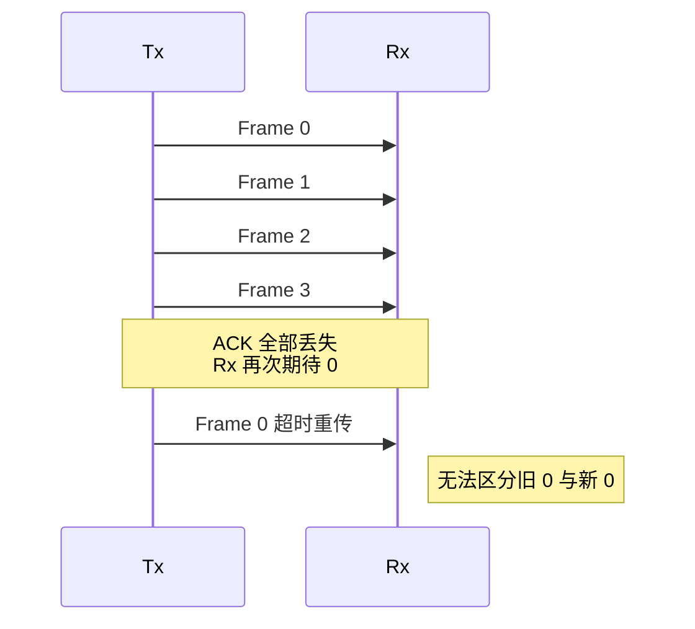
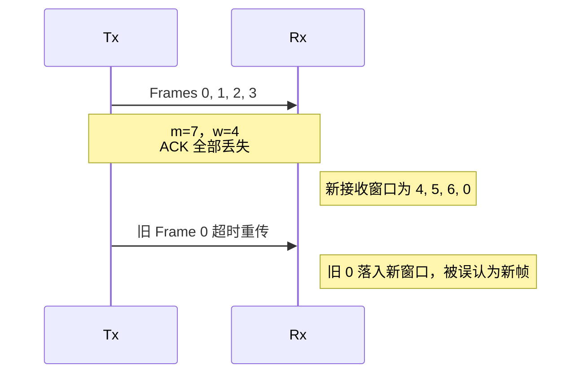
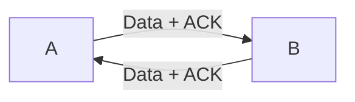
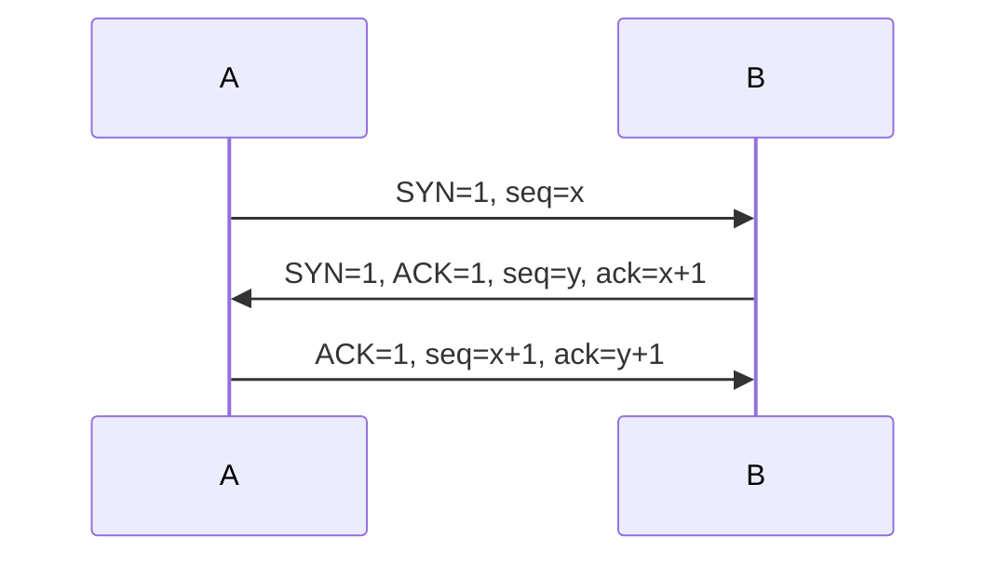
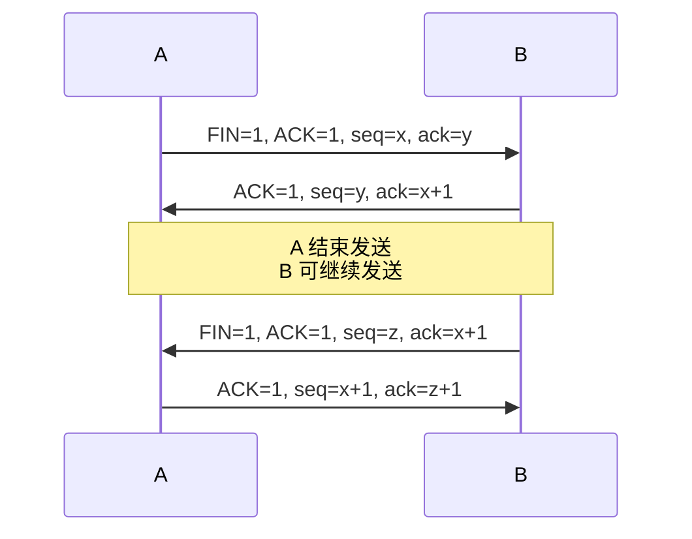
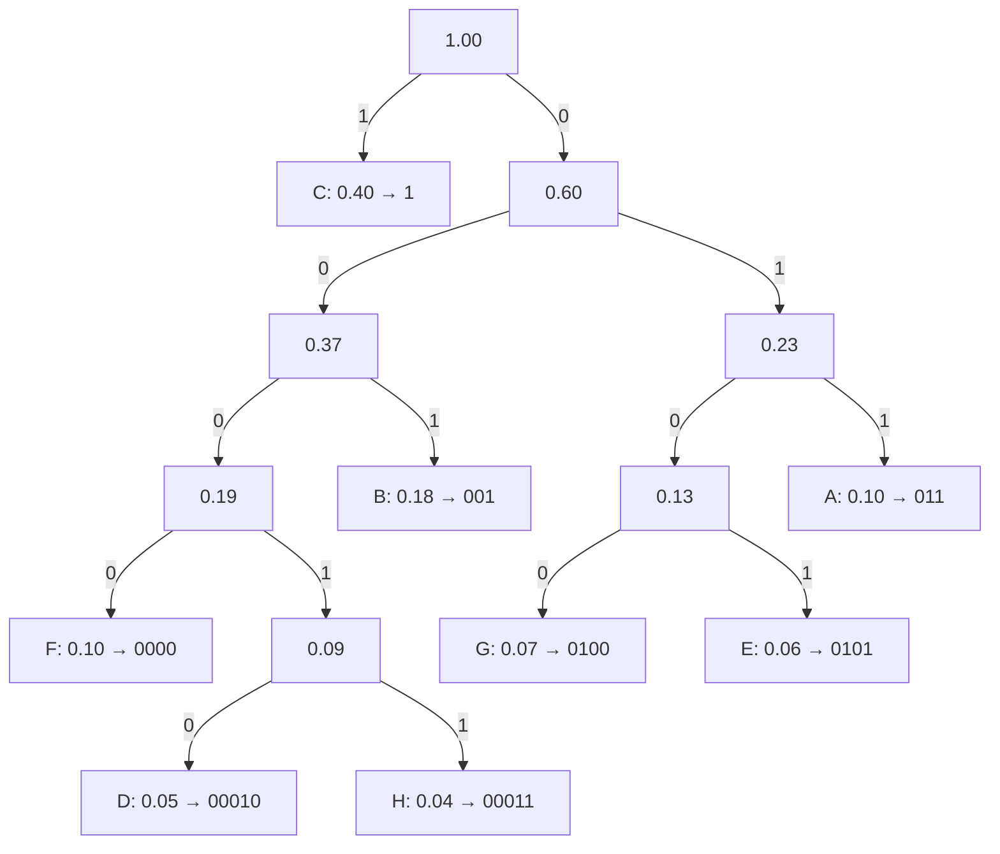
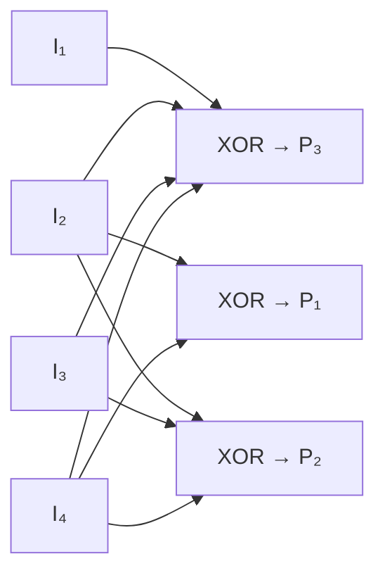

# Communications and Networks · 提纲

## 第一部分：Networks

### 第一章、Introduction to Networks and Protocol layering

1、A Communications Model

**A Communications Model包括哪些部分？**

Source、Transmitter、Transmission System、Receiver、Destination

**一个设备可以既是发送方又是接收方吗？**

Device can be transmitter and receiver at the same time.

2、Networking

**什么是networking？**

Deal with the technology and architectures of the communication networks used to interconnect communication devices.

**Communication network如何按照size分类？**

1.  Personal Area Network (PAN) 蓝牙

（2） Local Area Network(LAN) 学校，办公室

（3） Wide Area Networks(WAN) Internet，require satellite

（4） Metropolitan Area Networks（MAN） 城市交通管理系统

3、Transmission Mode

**Transmission Mode有哪些？**

（1）Simplex: 只有收或发

（2）Half-Duplex: 同时有收和发，但不能同时发和收

（3）Full-Duplex: 同时有收和发，可以同时发和收

4、Line Configuration：

**Line Configuration有哪些？**

1.  Point-to-Point line configuration 两个设备传输用了整个通道

2.  Point-to-Multipoint line configuration 多个设备传输公用一个通道

5、Topology

**有哪些拓扑？它们有没有核心？**

| 结构 | 中心节点 |
|---|---|
| Peer-to-peer（P2P） | 无固定中心；这是通信组织方式，可采用多种拓扑 |
| Mesh（网状） | 无固定中心 |
| Star（星形） | 有中心节点 |
| Tree（树形） | 有根节点与分层分支 |
| Bus（总线） | 无中心节点 |
| Ring（环形） | 无中心节点 |
| Hybrid（混合） | 由所组合的拓扑决定 |

6、Alternative Technologies

**什么是Circuit Switching？（实现WAN的技术）**

communication在双方开始通信前就建立了，通信路径在通信会话过程中保持dedicated（不变），Switch 只能让这条路径active或inactive

**什么是Packet Switching？（实现WAN的技术）**

数据被分成一个个小包分别传输，每个小包可能不同路径，按照optimal path传输，到达目的地后组装在一起，比circuit switching更高效

7、bit & bandwidth

**什么是bit？**

A bit is the smallest unit of data in a computer.

**什么是Bandwidth？**

Range between the lowest and highest frequencies used for a particular application.

Bandwidth的单位：

Analog（真的） bandwidth（constant）：Hz

Digital（假的） bandwidth（discrete）：bps

8、网络表现（通信服务质量）的评估

**数据有哪些错误的形式？**

Delayed、lost、mis-ordered、duplicated

重复丢失延迟错序

**什么是可靠的通信？**

Completeness，correctness，order

9、PDU

**什么是PDU？**

PDU包括：header，data，checksum

**什么是PCI？**

PCI（protocol control information）包括：header，checksum

**DATA中包括哪些？**

DATA.req（数据请求） / DATA.ind（数据确认）

10、ARQ

**什么是ARQ？**

Automatic Repeat Request 自动重复机制

包括Stop-and-wait和Continuous- Request

continuous-request又包括Go-back-N、Selective-retransmit

11、Idle Request（stop and wait）

**什么情况下会导致retransmission？**

有且只有timeout

**Idle Request的发送接收规则？**

（1）Tx发送PDU，Rx检查PDU中的checksum，

如果数据是对的，发送ACK确认给Tx

如果是duplicated数据，则会舍弃，但仍然会向发送ACK给Tx。

（2）Tx在timeout后未收到ACK会re-transmit PDU

**如果不加SN，Idea request有哪些问题，解决方案分别是什么？**

（1）ACK丢失，导致duplicate data，Rx要识别duplicate data：

解决方案：contains SN in PDU

（2）Tx的timer很短，Tx没收到ACK就timeout了，因此Tx重发PDU，但迟到的ACK被Tx当做了此次重发的回应：

解决方案：contains SN in ACK

**Idle Request的缺点？**

效率低

12、Continuous Request

**Window的意义？**

How many data can be transmitted without delay.

**Continuous Request的发送接收规则？**

接收到前一个ACK，发送下一个PDU

**有哪些Re-transmission strategies？**

（1）go-back-N

（2）selective re-transmission

13、Go-back-N

这张图中，min window size是4

**Go-back-N一些基本的思想**

发送方发送并接受到最左边的一个ACK，发送窗口可以向右移一格

接收方接受到正确的一个数据，接受窗口可以向右移一格

只要在window内，收到什么都可以接受，无论顺序

接收窗口大小为1

**m的意义**

m是SN modulus

如果m=3 ，那么 SN是0 1 2或 1 2 3（3个数）

**Go-back-N中，如果PDU丢失，接收方会怎么做？**

wait for retransmission

ignore all additional PDUs（不会发ACK，也不会接受数据）

**为什么Go-back-N中m\>w**

假设m=4, w=4，发送方发送0,1,2,3。接收方全部收到了，但ACK全部丢失了。现在接收方的接受窗口里的数字是0，而此时发送方的0 timeout，重发0，Rx将重发的0当做了新的0。

若序号空间只有 $m=3$，窗口却容纳 $w=4$ 帧，窗口序号为 `0, 1, 2, 0`。同一窗口内两个不同数据帧使用相同序号，接收方无法可靠区分；因此发送窗口不能覆盖整个序号空间。

如果m\<w，那么发送窗口中会有相同的SN的信息，假设第一个信息的ACK丢失了，第二个信息会被当做第一个信息。

**Go-back-N的缺点**

出现异常时，接收方停止接受，发送方需要重新发送lost/corrupt后的所有数据，浪费资源

14、Pure Selective Re-transmission

这张图中，min window size是4

**Pure Selective Re-transmission的一些基本的思想**

对于每个PDU，接收方都回ACK（发一条，回一条）

发送方发送并接受到一个最左边的ACK，发送窗口可以向右移一格

接收方接受到正确的接收窗口最左边左边的一个数据，接收窗口可以向右移一格

接收窗口大小等于发送窗口大小

**Pure Selective Re-transmission中，如果PDU丢失或是坏的，接收方和发送方会怎么做？**

接收方：ACK additional PDUs、wait for re-transmission（洞之后的数据暂存在Rx的缓存中）

发送方：看见ACK中的“hole”，在timeout后重发“hole”中的数据

**Pure Selective Re-transmission的缺点**

ACK太多了

15、Selective Re-transmission Variation

这张图中，min window size是4

这张图中，发送方发的2丢失/坏了，形成一个洞，洞之后的数据暂存在Rx的缓存内，当2,3,4,5的timer超时后陆续重发，接收方收到洞中的2后返回ACK5，表示5和5之前的数据已经全部收到了,发送方收到ACK5后停止重发

**Selective Re-transmission的一些基本的思想**

接收方使用Cumulative ACKs ，ACK5表示5和5之前的数据已经全部收到了

发送方使用Go-Back-N的策略

发送窗口等于接收窗口

**Selective Re-transmission中，如果PDU丢失，接收方会怎么做？**

wait for retransmission

no additional ACKs

**为什么Selective Re-transmission中m\>2w-1？**

Selective Repeat 要求 $m\ge 2w$，让新接收窗口与仍可能重传的旧窗口不重叠。

假设m=7, w=4，发送方发送0,1,2,3。接收方全部收到了，但ACK全部丢失了。现在接收方的接受窗口里的数字是4,5,6,0，而此时发送方的0 timeout，重发0，Rx将重发的0当做了新的0。

**Selective Re-transmission有哪些缺点？如何解决？**

缺点：Old PDU arrives in new window

解决方法：给PDU设置TTL（网络要丢弃旧PDU），或者使用更大的window size

16、Full Duplex Service

**什么是piggybacked（搭顺风车）？**

ACK 可以附在反向数据帧上，也可以单独发送。

Full Duplex下，两个设备可以同时发送和接收数据。

此时，ACK可以搭着数据的顺风车。这可以通过延迟ACK实现

17、Flow Control

**Flow Control的作用？**

防止Rx数据溢出

**Flow Control有哪几种方法？**

Stop/Go 和 Sliding Window

**Stop/Go的原理？（图中的数字表示Rx的缓冲剩余）**

Rx控制Tx发送PDU的速率

RNR: Receiver not ready

RR: Receiver ready

HWM：High threshold，高负载，发送RNR。安全起见，设置低一些

LWN：Low threshold，低负载，发送RR

**Stop/Go中，如果RNR丢失，会导致什么？**

Rx overruns

**Sliding Window的原理？**

Rx tells Tx what is the available space in the buffer and how much data to send through window.

具体来说，Rx通过发送ACK（包括SN和w）来控制Tx的window size，从而控制发送速度。

**有趣的是，当window size改变时，Rx也会受影响：**

当w=1时，Rx使用stop-and-wait，当w\>1时.Rx使用selective re-transmit

17、Standardized（标准） Protocol Architectures

**有两个primary standard，是什么？**

OSI Reference model（OSI是一个模型而不是一个协议，是开发协议标准的框架）

TCP/IP protocol suite（最广泛使用）

**Principles of Protocol Layering有哪些？**

每层需要能实现向上和向下通信的任务

两个objects（发送方和接收方）的同一层需要一致

18、OSI

**OSI 有哪些layer？**

第七层：Application

第六层：Presentation

第五层：Session

第四层：Transport（provide end-to-end communication）

第三层：Network

第二层：Data Link

第一层：Physical

只有source和receiver有所有层，其余设备可能只有其中的几个层，但均有physical layer

### 第二章、Transport Layer

1、Transport Layer Protocol——Transmission Control Protocol (TCP)

**TCP/IP Protocol有哪些layer？**

Each layer only communicates with adjacent layers.

**TCP如何提供connection-oriented process？**

（1）Establishing Channels Directly Connected to Data

（2）简述三次握手（Three-way Handshake）

2、TCP header

**TCP segment和TCP header的联系？**

**TCP header的格式？**

这张图中，最底下的Payload Area是data，实际上并不属于header

Source port：源端口号

Destination port：目标端口号

Sequence number：选择segment中第一个数据byte的Sequence number作为Sequence number，确认了data package的顺序

Acknowledgement number：接收方希望接收的下一个数据byte的序列号，ack=seq+1

Data offset：告诉接收方，哪里是Payload Area的开始

Flags（6 bits）：

**    **URG：为1时，Urgent Pointer里的紧急信息要看

**    **ACK：Acknowledgment Number是否有效。

**  ** PSH：push，表示接收方应该尽快将这个segment推送给应用程序。

**    **RST：reset，重置导致非正常终止的连接

**    **SYN：synchronize seq num，用于建立连接

FIN：finish，表示发送方已完成其数据发送，用于断开连接。

Window：用于flow control

Checksum：根据数据算checksum，检查数据是否correct

Options：不一定是32bits的倍数，加padding是32 bits的倍数

**Which fields in the TCP header contribute to providing reliable communication, and how?**

（1）回答什么是reliable communication：Completeness，correctness，order

（2）Completeness：Acknowledgment Number告诉发送方哪些数据已经成功接收，以及希望接受的下一个数据，如果发送方没有收到Acknowledgment Number，数据会重传，确保了完整性。

（3）Correctness：如果checksum与通过data计算出的结果不同的，说明数据not correct，确保了正确性

（4）Order：Sequence Number用于确认数据包的顺序，确保了有序性

**TCP header哪些部分作用于flow control，如何起作用？**

1.  The Window Size field.

2.  发送方通过window size告诉接收方what is the available space in the buffer

3.  发送这个信息调整data transmission rate

3、Port Numbers

**Port Numbers在哪里？Port Numbers的作用？**

写在TCP header中，表明应用使用了哪种协议，从而区别同一设备中的不同应用程序。

**Source port和Destination port 是如何工作的？**

**Port number有多长，各部分如何使用？**

4、Socket Address

**Socket Address的组成？**

IP address + Port number

**Socket Address各部分的作用？**

IP address标识设备所在的网络，用于定位设备

Port number用于设别同一设备的不同应用程序

**接收方如何根据Socket Address定位进程（应用程序）？**

接收方首先在layer3（OSI的第三层——Network layer）根据IP address，定位设备；

然后在layer4（OSI的第四层——Transport layer）根据Port number，定位进程。

5、Byte-Stream Oriented

**发送方的buffer中有什么？接收方的buffer中有什么？**

发送方buffer：未发送、已发送没收到ACK、free

接收方buffer：已读入未提取、free

**一个TCP连接有几个buffer？**

4个，因为一个设备既能发送又能接收，发送和接收每个都需要两个，2\*2=4

**Byte-Stream Oriented的流程？**

（1）发送方应用程序写入数据到发送方buffer

（2）发送方从其发buffer中取出数据，add TCP header，形成一个 TCP segment，发送。

（3）接收方的 TCP 层接收到 TCP 段后，会首先处理 TCP 头部，进行如校验和验证、序列号处理等操作。如果 TCP 段确认无误，TCP 层则将数据从 TCP 段中剥离出来，放入接收方buffer。

（4）接收方应用程序可以在空闲时此部分接收方buffer中读取数据

6、TCP连接时的三次握手和四次挥手（双向连接）

**连接——三次握手**

SYN 本身占用一个序号，所以握手确认号是 $x+1$ 和 $y+1$。普通数据的 ACK 表示期望收到的下一个字节序号：无丢失时，`ack = seq + 数据字节数`；SYN 或 FIN 还需额外计入其占用的一个序号。

三次握手的流程：confirm、connection

1.  A请求向B建立连接

2.  B确认建立连接，B向A请求建立连接

3.  A确认建立连接

**断开——四次挥手**

TCP 的两个传输方向可以分别关闭，允许一个方向先停止发送（half-close）。

FIN 占用一个序号。$z$ 是 B 发完剩余数据后的序号；如果没有剩余数据，则 $z=y$。

四次挥手的流程：confirm、disconnection

1.  A请求向B断开连接

2.  B确认断开连接，但此时B向A的数据还没传完

3.  B向A请求断开连接

4.  A确认断开连接

7、TCP Sliding Window Protocol

**接收方如何知道有congestion**

The package is lost.

**发送方如何知道（在传输过程中）The package is lost？**

timeout发送方收不到ACK

**什么是 effective window？**

（1）effective window size（Transmitter）= min{congestion window，advertised window}

（2）congestion window：congestion control，由实际的网络情况来调整这个窗口大小。

（3）advertised window：Flow control，由接收方控制。

The Rx advertises its available buffer space through the Window Size field（in TCP header）. The sender uses this information to adjust its data transmission rate accordingly.

8、Silly Window Syndrome

**Silly Window Syndrome是一种缺点，这种缺点是什么？**

small number of size at payload

- 每次发送的数据量很小，可能只有 1 字节 。

- 但每个 TCP 段都有固定的头部开销，通常为 20 字节 （不包括 IP 头部）。

- 这意味着传输大量小数据段时，头部开销远大于有效数据，极大地浪费了网络带宽和处理能力。

**导致 Silly Window Syndrome 的原因**

接收方：缓冲区空间小，advertised window小

发送方：发送数据频繁且量小

**Silly Window Syndrome解决方法**

（1）接收方：

缓冲区空闲空间达到缓冲区大小的一半时，或者当缓冲区有足够空间容纳一个 maximum-sized segment 时才更新窗口。

（2）发送方：使用Nagle 算法

等待缓冲区中累积足够的数据，发送一个 maximum-sized segment

所有 outstanding segments 都得到ACK后再发 small segments transmitted

等待接受窗口至少打开一半

9、TCP Congestion Control

这张图中， effective window size = cwnd，因为假设了advertised window is big enough

横轴：RTT times 几次发出又接受

重要的：Round Trip 是the time cost of sending TCP and receiving ACK

纵轴：Cwnd（Congestion Window Size）

重要的：Threshold（阈值）

**How dose TCP increase window size？**

（1）effective window size = cwnd

（2）assume that the advertised window is big enough，so the only restriction is the congestion window

（3）在SS中的表现 on each ACK，if cwnd \<=  Threshold，cwnd = cwnd + 1，exponentially

（4）在AI中的表现，ONLY when ALL segments in the current window are ACKed，if (cwnd \> ssthresh) ，cwnd = cwnd + 1

**SS (Slow Start）是什么？**

cwnd从1开始，指数（exponentially）增长，直到达到一个Threshold

**AI (Additive Increase）是什么？**

cwnd线性增加

**MD (Multiplicative Decrease)是什么？**

SS的时候发生timeout，或者AI的时候发生3-ACKs会触发（或者更多）

**TCP Tahoe是什么？**

timeout（No ACK）时， Threshold设为此刻cwnd的一半，cwnd设为1，进入SS

**TCP Reno是什么？**

连续收到3（或者更多）个相同的ACKs，Threshold设为此刻cwmd的一半，cwnd设为Threshold，进入AI

**TCP Tahoe VS TCP Reno是什么？**

与TCP Tahoe相比，TCP Reno可以 Fast Retransmit / Fast Recovery

**如果发送方连续收到三个相同的ACKs，可以推断出什么？**

网络中可能发生了congestion，导致数据包丢失。

接收方仍然活着，因为我们持续收到确认消息。

Rx中可能存在一个或多个数据包的hole

发送方需要考虑立即重传丢失的片段，以避免资源浪费。

10、TCP Retransmission Timer & RTT

**（1）SRTT(Smoothed-RTT)**

根据上次的RTT，更新SRTT，目标是接近真实RTT

**（2）RTO（Retransmission Time-Out）**

RTO 比 SRTT 大一点

**（3）MDEV（Mean Deviation）平均误差**

有时候Internet is unstable，SPTT和RTT的差值的绝对值变大，MDEV会变大，RTO会变大，这样可以deal with the unstabe Internet and avoid unnecessary retransmission 

**（4）Karn’s algorithm**

removes ambiguities， ignore retransmitted segments

11、UDP(User Datagram protocol)

**Looking at the UDP header, what features does UDP provide?**

（1）源端口（Source Port）和目标端口（Destination Port） ，用于identify the sending and receiving applications。

（2）长度（Length），指total length of the UDP datagram，It helps the receiver determine the boundaries of the data packet , knowing when to start，when to end.

（3）校验和（Checksum）字段，用于基本的error detection，传输过程中是否出现了数据错误。

**UDP的特点？**

快（没有ACK，所以比TCP快），开销少，不可靠 ， Connectionless， process-to-process communication

没有error correction，但有error detection

**UDP的适用场景？**

Real time data

### 第三章、NETWORK LAYER

1、IP address

class a第一部分是network id，后三部分是host id（主机），且第一部分是0开始（二进制）

size，看的是host bit

number看的是network bit

**（1）How many Class A networks can we have?**

**（2）How many available computers (hosts) can a Class A network have?**

**（3）Given the IP address 138.250.0.1, which class does it belong to, and what is the network ID？**

也可以将138转化为8位的二进制，观察最左边的位

因此network id是138.250.0.0

**（4）Class A，B，C的network size和network number的比较**

network size（看后面）：A\>B\>C

network number（看前面）:A\<B\<C

**（5）138.37.32.112的network address是什么？**

首先，判断出138属于Class B

所以把host写成0

答案：138.37.0.0

**（6）138.37.32.112的Broadcast Address 是什么？**

138.37.255.255

**（7）为什么需要将IP地址划分为Class A、B和C？**

是为了适应不同规模的网络需求：

- **Class A**网络具有少量网络，每个网络具有大量主机，适合非常大型的组织。

- **Class B**网络在网络数量和主机数量之间取得平衡，适合中型组织。

- **Class C**网络具有大量网络，每个网络具有较少主机，适合小型组织。

**（8）假设你要发送信息给queen marry的所有电脑，source and destination address分别是多少？**

source：138.37.32.112

destination：138.37.255.255   或者用Class D——Multicast address

**（9）The company has like 200 costs machine devices. They need 200 IP addresses, which class of network ID, we should assign to that company A ?**

**答案：Class c**

看的是host id的长度！

Because class C can connect 8 power of 2 -2 hosts, it’s more than 200. It can give more space to network.

2、Private IP addresses

**（1）Private IP使用场景**

organizations、home、school

**（2）Automatic Private IP Addressing**

169.254.0.0 - 169.254.255.255范围的地址是Windows的自动私有IP地址，用于自动分配。

**（3）Loopback range**

127.x.x.x地址用于本地测试和自我通信。

3、Router

**Routers的作用**

在layer 3- network layer， forward IP packets

Get data from previous hop. The previous hop can be the source, can be another router. But the router's intention is to forward the packet.

**两种路由协议**

routable protocol：like car，encapsulate user information and data into packets.

routing protocol：like navigator，基于网络实际情况，寻找每个packet的available route

4、IP datagram structure

**（1）IP datagram的结构图= IP header +  data（IP payload）**

**（2）各个部分的作用**

**Version：**使用的IPv4还是IPv6

**IHL：**Internet Header length，因为options是可变长度，这样可以表明data的起始位置

**Identification：**同一个package的fragment拥有相同的Identification，用于reassemble fragments

**Time To Live（TTL）：**剩余路由次数，不是时间，因为设备时钟不同步

**Protocol：**Transport layer使用的是那种协议（TCP/UDP）

**offset：**起始位置的偏移量

**MF：**more fragments，MF设置为1，表示后续还有更多的片段，除最后一个片段外，所有片段的 MF 都设置为 1。

**DF：**Do not fragments，DF设置为 1 时，不会碎片化。

**（3）谁可以同时更改源地址和目的地址？**

No one should change.

**（4）Why we need source address in the IP header?**

1.     Know where it is sent.

2.     Help routers in the network to find the best way for the package to the final destination.

**（5）What is the mandatory part of the IP header? How many bytes does it have?**

1\.    除了 options and padding,

2\.    20bytes

**（6）Why we need to know the protocol is UDP or TCP?**

TCP and UDP header have different structure.

You must know which protocol you are talking about to understand how to read the header in UDP or TCP, then the receiver knows how to interpret it.

**（7）Can we move the version to another fields not in the very beginning?**

No, we can’t. Because IPv4 and IPv6 has different structure.

**（8）Why TCP / UDP protocol does not put version in the very beginning?**

Because TCP and UDP have same structure.

5、Fragmentation

**（1） 你能推断出什么?**

1)  Offset: 4

Before e，there are more units，this is not the beginning of the message.

\(2\) MF=1

There are more units to come.

**（2）你还能推断出什么？**

（1）ID：33

they are from same message

（2）MF=0

This is the last unit of the original message.

注意：MF=0只表示这个IP数据报中的这个单位是最后一个单位。但是否应该继续接收更多，取决于你是否能将所有原始数据重组回一个完整的消息

6、Routing Protocols的分类

**（1）Static Routing的定义**

一开始就manually configured各种信息

**（2）Static Routing的缺点**

如果网络中的任何内容发生变化（如IP地址更改、设备添加或移除、或设备故障），你必须手动重新配置路由。

**（3）Static Routing的优点**

Low cost and simplicity

**（4）Static Routing的应用场景**

small-sized, managed networks

**（5）Dynamic Routing的特点**

动态路由相对复杂，但能够反映实时网络状况，根据当前网络条件自动计算每个数据包的最佳路径，无需人工重新配置路由。

**（补）Default Router**

Default Router就像是一条“主干道”或“出口”，帮助设备在不知道如何发送数据时，catch all（兜底）。对于简单网络，默认路由器就是那个负责连接互联网的设备。

**（6）Source Routing VS Next-Hop Routing**

Source Routing：只有source需要运行算法来确定路径，datagram只需要按照这个路径传输

Next-Hop Routing：每个节点只知道下一个hop，不关心整个路径

**（7）Is Source Routing Static or Dynamic?**

It can be static or dynamic.

Static routing is when you configure the router, the routes always follow the same rule for forwarding data，and the router can not reflect on the natural situation.

Source routing is the source decide the route for the package. But the source can change the route for different packages due to different situation.

7、Distance Vector Algorithm

**（1）Distance Vector Algorithm的目标**

目标是在网络中找到从自己到其他所有节点的最短路径。

**（2）Distance Vector Algorithm的工作原理**

1\. Each router knows the cost to its directly connected neighbors.

2\. Routers ask their neighbors: Who can you reach, and what is the cost from you to them?

3\. Each router updates its routing table by adding its own cost to reach a neighbor to the neighbor's cost to reach other destinations.

4\. Routers compare all possible routes and choose the path with the least total cost to each destination.

最后，每个router都有一个表，包括destination、distance、first hop

**（3）How does a router know the distance from himself to all directly connected routers?**

Because there is a physical connection between them. 

When they configure the network, 路由器就在物理上知道自己与邻居之间的距离了，不需要交换消息。

8、Routing Information Protocol（RIP）——Distance Vector的协议

**（1）RIPv1 Packet Format**

**（2）RIP各部分的意义**

**Command:** 1是Request, 2是 Response

**Version：**1是RIPv1

**Address Family Identifier：**使用的是哪种类型的地址

**（3）metric的意义**

request时是zero；

response时是the cost to each destination

IP address和Metric一起决定了the destinations they can reach and the cost to each destination。IP address是destination的IP，metric是distance

**（4）hop count设置为15时，意味着什么？**

有connection

after 15 hops，it is no longer used.

**（5）RIP如何防止无限循环？**

maximum hop count 设为15

When hop counts reach 16, the route is considered unreachable.

**（6）How do routers keep their routing information up-to-date in the network? There should be a mechanism to allow routers to know if any changes in the network occur. **

request/response + update mechanism

Periodic Updates：每隔一段时间（通常是 30 秒），路由器会向邻居广播（Broadcast）整个routing table，告诉邻居自己当前的路由情况

Event-Triggered Updates：如果网络拓扑结构发生变化（比如一条路径断了或者恢复了），路由器会立刻发送一条触发更新的消息，帮助faster convergence

**（7）RIP的操作流程**

1、At initialisation routers are configured with directly connected network addresses.

2、RIP Broadcast request to ask for RIP information on each RIP-enabled interface

当一个初始化router出现时，它向邻居发送request请求RIP信息，从而计算自己的routing table；

RIP 有两种请求方式：Complete routing table requests、Specified entries request

3、Router compares received RIP table with its own. Routers add new entries and update existing destinations, if the (hop count) cost is lower

4、RIP Broadcast response packets sent periodically

5、节点将所有直接连接的邻居距离设置为1 hops。如果连接中断，则将距离设置为无限（16 hops）。

6、直接连接的邻居定期交换routing tables（distance vectors）。如果接收到的路径更短，节点会更新其distance tables。最终All nodes know lowest cost path to any given node。

**（8）一些periodic update：**

1、每隔30秒，routers向邻居广播自己的整个的routing table

2、当一个router在180秒内未收到邻居的RIP update时，它会将该到邻居的distance设置为16 hops（unreachable），再过60s从routing table中移除。

**（9）当收到更新时，router应该怎么做？**

1、检查validity of the update；如果更新信息无效，直接忽略。

2、Look for the corresponding destination

3、 如果destination自己已经有了：

如果新路由的cost更低，则更新routing table并Reset timeout；

如果新路由的cost更高，自己的routing table中已经有一个lower cost entry，and 如果发送response的router就是自己的recorded next hop router（原来告诉它如何到达目的地的路由器），则将该router标记为“不可达”（unreachable），并进入 **hold-down（保持期）**。如果在保持期结束时，相邻路由器仍然通告较高的跳数，则接受新的metric。

4、如果destination自己没有，add it

**（10）Routing table中有哪些？**

Destination IP Address、Metric、Next Hop、Advertising Router、Timeout

**（11）RIP存在的问题——Slow convergence**

B与C的连接断开，B将C修改为unreachable，在B广播更新前，B收到了A的过时的更新（Outdated update）。

问题名字：Slow convergence（instability when routes change rapidly）

解决方法：split horizon update和hold down timer

**（12）如何改进Convergence Time？**

（1）Split Horizon Update：Router does not broadcast routing information over the same interface over which it was received

不会把对方告诉你的消息再原封不动地告诉回对方。

**Store who you learn things from. Don’t tell them what they’ve told you！**

（2）Poison Reverse

将unreachable的广播推迟两个broadcast periods（60秒）

（3）Triggered Updates

发生事件时马上更新并广播，而不是等待30秒

（4）Hold-Down Timer

如果收到消息说某个destination unreachable，收到消息的router不会立刻修改自己关于这个destination router的记录消息，它会等待60秒。

**（13）为什么最大hops是16？**

Because the nature of RIP——Slow convergence – instability when routes change rapidly.

9、Dijkstra’s Algorithm

10、OSPF（Open shortest Path First）—— Dijkstra的协议

1.  **LSA（Link State Advertisement）包括？**

LSA（Link State Advertisement）

who it's connected to，the cost of those connections

**（2）LSA如何起作用？**

每个路由器都生成LSA，包括who it's connected to和 the cost of those connections，LSA在整个网络中传播（flooding LSAs），确保所有路由器都能更新并拥有相同的topology。通过这个topology，我们可以使用Dijkstra来计算最短路径.

**（3）LSA如何防止传播无限循环？**

The trick is when you receive an LSA, you forward it the first time. But if you receive the same LSA at second time, you no longer forward it.

**（4）OSPF的流程？**

（1）路由器发送Hello packets，结识邻居——discovery mechanism

（2）部分邻居之间会建立Adjacencies（virtual point-to-point links）

（3）路由器发送LSA到adjacencies

（4）每个路由器接收到邻居的LSA后，将其记录到自己的link state database中，并sends a copy of the LSA to all of its other neighbors

（5）通过flooding LSAs在全部区域，确保所有路由器都有identical link state databases

（6）每个路由器，使用SPF算法，以自身为root计算loop-free graph（SPF tree）

（7）根据SPF tree，每个路由器生成自己的routing table

**（5）当网络发生变化时，OSPF会？**

Change occurs；“Broadcast” change；Run SPF algorithm；Install output into routing table

LSA仅在发生变化时发送，避免频繁更新（完整路由表更新间隔为30分钟）。

**（6）What is the role of Hello messages in OSPF?**

（1）Sending a Hello message indicates the router is still alive.

（2）When you receive a Hello message for the first time, you check it and identify the sender as your neighbor.

（3）By keeping a record of Hello messages received periodically, you can determine if a neighbor remains stable or has disappeared.

（4）建立connection，build up the structure of the OSPF network，以发送LSA

11、Distance Vector 对比 Dijkstra

**（1）目标**

目标相同，二者都希望找到每个router到其他destination的最短路径

**（2.1）Distance Vector 的 input**

Distance to its neighbor + Distance of neighbor to other destinations

**（2.2）Dijkstra 的 input**

Full topology.

**（3.1）Distance Vector 的协议——RIP**

Frequent, periodic updates：slow convergence

RIP发送的RIP Table是the destinations they can reach and the cost to each destination

发送的是整个routing table

**（3.2）Dijkstra的协议——OSPF**

Event-triggered updates: faster convergence

OSPF发送的LSA是who it's connected to，the cost of those connections

发送的是link-state routing updates

12、Subnet

**什么是subnet？**

a network is split up internally，分割的是host id

**subnet的优点？**

1.  Internal management，keep privacy，no view from outside world

2.  Maintain troubleshooting and defend the attack

3.  Optimizes IP address usage

4.  Gives network managers more flexibility in address allocation.

**Subnet Mask**

由很多1和很多0组成，1代表network id（不可变），0代表host id（可变）

**已知IP address 135.26.7.91,Network ID是什么？**

因为是Class B，所以Network ID是135.26.0.0

**已知IP address 135.26.7.91/22,Network ID是什么？**

因为是Class B，且前22位不变，所以Network ID是135.26.4.0

**已知IP address 92.231.1.10/23，一些问题（不需要subnet bit）：**

1.  Subnet mask是多少？

23代表的是how many bits for network ID，所以Subnet mask是23个1加9个0（一共32位）

23个1加9个0转换为decimal：255.255.254.0

2.  what is the last IP address available for assigning？

因为Subnet mask是23个1加9个0

所以92.231.1.10的前23位不变，后9位可变

所以Network ID为：92.231.0.0（把IP地址的后9位全部变为0）

所以最大的IP address为：92.231.1.255（把IP地址的后9位全部变为1）

所以range为：92.231.0.0 – 92.231.1.255

因为range的最后一个是广播地址

所以the last IP address available for assigning为：92.231.1.254

**已知IP address 216.21.5.0，要求三个subnet，各个subnet的范围？**

第一步：

通过216，判断出属于Class C，所以subnet前24位必须为1

第二步：

因为要三个subnet，所以需要2 bits for subnet（因为2^2=4\>3），所以subnet最后8位的前两位也属于1，Subnet mask有24+2=26位。所以Subnet mask前26位为1，后6位为0.

第三步：

所以分为4类：

以下地址是IP的最后8位

第一类：00（前两位不变） 000000 ~ 111111（后六位可变）

第二类：01（前两位不变） 000000 ~ 111111（后六位可变）

第三类：10（前两位不变） 000000 ~ 111111（后六位可变）

第四类：11（前两位不变） 000000 ~ 111111（后六位可变）

00、01、10、11叫做subnet bit

第四步：

转换成decimal：

**已知IP address为192.168.1.0，要求有50个hosts，subnet mask是什么？**

首先判断192.168.1.0为Class C，所以subnet前24位必须为1。

因为要求有50个hosts，2^6=64\>50，所以需要6 bits for hostid，所以Subnet mask最后六位必须为0，其余位都是1。所以subnet mask是26个1加6个0。

**已知IP address为192.168.1.0，要求三个subnet，要求每个subnet分别有20、20、50个hosts，各个subnet的范围？**

50 hosts的subnet mask是26（解析见上一道题）

20 hosts的subnet mask是27：因为只有20个hosts，所以host id可以减少一位

各个subnet的范围：

以下地址是IP的最后8位：

50 hosts：00（前两位不变） 000000 ~ 111111（后六位可变）

20 hosts：010（前三位不变）00000 ~ 11111（后五位可变）

20 hosts：011（前三位不变）00000 ~ 11111（后五位可变）

对于50 hosts，00是 subnet bits

对于20 hosts，010、011是subnet bits

**已知IP address为135.21.7.91/22，要求有5个subnets，subnet mask是多少？**

因为2^3=8\>5，所以需要3 bits for subnet

3+22=25

Subnet mask是25

11、Mac Address

**Mac Address在layer2中的作用**

Mac Address由设备制造商（manufacturer）分配，是网络设备的hardware address，全球唯一。

12、ARP（Address Resolution Protocol）

**ARP Packet结构**

Hardware address是Mac address

Protocol address是 IP address

Sender是发送方，target是接收方

**ARP的流程：**

ARP request is broadcast：

A不知道Destination IP（目标IP）的MAC address，因此A broadcast request。

所有的其他设备都会记录A的IP和MAC address in case of need.

ARP Reply is unicast：

B就是目标IP，所以B unicast reply给A（unicast is to avoid congestion）

13、RARP（Reverse Address Resolution Protocol）

**RARP Packet结构**

**RARP Packet结构**

和ARP Packet的结构是一样的，除了operation区域，request 3，reply 4

**RARP的流程：**

RARP request is broadcast：

Host知道自己的MAC address，不知道自己的IP address，因此A broadcast request。

RARP Reply is unicast：

RARP server（S）有Host的IP address，所以S unicast reply给Host

14、子网通信

**相同子网通信的步骤**

1.  通过subnet mask判断自己和destination IP在同一subnet内

2.  通过RAP找到destination IP的MAC address

3.  自己进行cached arp table

避免频繁使用ARP请求，减少网络广播流量，提高通信效率。

当需要再次通信时，可以直接从缓存中查找目标MAC地址，无需重新发送ARP请求。

4.  Encapsulate the IP packet in an Ethernet frame with the target MAC address and send.

**不同子网通信**

1、通过subnet mask判断自己和destination IP在同一subnet内

因为subnet mask是255.255.255.0，因此看前三部分——138.37.35与138.37.32不同，因此处于不同的subnet

2、通过RAP找到router（138.37.35.254）的MAC address

host检查自己的cached RAP table是否有router 138.37.35.254 的MAC address。

如果没有缓存，则通过ARP协议发送广播请求，查询路由器的MAC地址。

3、Encapsulate the IP packet in an Ethernet frame with the target MAC address and send it to router.

4、Router根据自己的routing table forward the packet to the target subnet（router）

### 第四章、DATA LINK LAYER

1.  data link layer的结构

**什么是LLC sublayer？**

全称：Logical Link Control Sublayer

Provides the link between the higher layers and the MAC sublayer.

**LLC提供哪几种service？**

• Unacknowledged connectionless service

• Connection oriented service

• Acknowledged connectionless service

Acknowledged意思是会发ACK，connectionless的意思是do not need pre set-up

**什么是MAC sublayer？**

全称：Media Access Control (MAC) Sublayer

**MAC sublayer的功能？**

Access control to shared medium

Reliable data transmission

2.  MAC Protocol

**有哪两种MAC protocol？**

Reservation based protocols、Contention based protocols

**什么是Reservation based protocols？**

（1）Requires knowledge of network topology

（2）Schedule for each end node

（3）Collision free

举例：Token Ring、TDMA

**什么是Contention based protocols？**

1.  No requirement for synchronization and topology knowledge

2.  Nodes compete for resources

举例：ALOHA、CSMA

**什么是Token Ring？**

Token=发言权

按顺序传递Token，有Token的节点可以一次性传输一定数量的frames（有最大限制）。

工作速率为 4-16 Mbps。

**Token Ring的优点和缺点？**

1.  优点：Doesn’t cause collision

2.  缺点：Failure of one node can crash the entire channel、Cannot fully utilize resources.

**什么是TDMA？**

全称：Time Division Multiple Access

Each node gets fixed length of time slot in each round

如果user无法在分配的time slot内完成数据传输，may get another slot later。

Guard time is added between the time slots（to avoid interference）

注意：ABCD的顺序不是固定的

**TDMA的优点和缺点（了解）**

优点：Extended battery life, Cost effective, Interference free.

缺点：Disconnection, Synchronization overheads.

**什么是Vulnerable Time？**

Vulnerable time is the time during which no transmission should be done to avoid any collision.

发送设备的英文可以是node、station

**什么是Unslotted ALOHA？**

设备在有数据要发送时随时发送，不需要等待固定的时间点。

如果某Frame成功传输，设备会继续发送next frame。

When two or more stations transmit at the same time, there is collision, and the frames are destroyed.

发生Collision后，发送设备会重新发送同一frame，直到成功为止。

Vulnerable Time = 2 Tfr（因为B之前之后都不能有设备发送信息）

Tfr是frame transmission time

**什么是Slotted ALOHA？**

The time of shared channel is divided into equal slots，每个slot的长度等于发送one frame所需的时间。

发送设备只能在time slot开始时发送数据。如果错过，等待next slot。

如果某Frame成功传输，设备会继续发送next frame in next slot。

If two or more nodes transmit in the same slot, all nodes detect collision.

发生Collision后，发送设备会重新发送同一frame，直到成功为止。

Vulnerable Time = Tfr（因为collision只会在同一个slot中发生）

**什么是CSMA/CD Access Protocol？（用于）**

全称：Carrier Sense Multiple Access with Collision Detection

Carrier Sense：

设备在发送数据前，会先sense the channel or wire

空闲就发数据；忙就等待，不发数据

Collision Detection：

设备如果detect a collision，就停止发送，并在channel空闲时retransmits the frame

Back-Off算法表现为：

After a collision, a node waits **X 个 time slots（X是一个随机分布的时间）**

N是number of retransmission attempts，也就是这个node连续发送失败的次数。

如果设备重传了 16 次仍未成功发送，设备会放弃传输，该frame将丢失。

3.  网络互联设备

**什么是Repeater？**

Physical layer device

接收并重新发送signal，用于增强和延长信号传输，去除噪声。

只发消息，不检查MAC address和IP address

**为什么Repeater不同于Amplifier？**

Amplifier放大了输入信号，也放大了noise & interference

**什么是Bridge？**

用于连接和分隔subnet

连接目的：允许不同subnet的通信

分隔（Divides LAN into multiple segments）目的：reduce traffic in the network

Bridge通过判断whether MAC address of destination is on same side as source，如果在同一边，不使用bridge

Bridge的MAC address table可以通过management process（静态）或self-learning（动态）生成。

4.  Ethernet（IEEE 802.3）

**Ethernet对比WIFI**

Ethernet相比WIFI，更快更安全

**Ethernet Topology分析**

1.  Bus（1990s）

所有节点共享同一个通信通道，数据包会被所有节点接收，节点间可能发生冲突。

2.  Star（现代）

每个节点通过独立的线路与switch连接，节点之间不会发生冲突。

**Ethernet Frame Structure**

1.  Preamble：101010……（7 bytes）

used to synchronize receiver

（2）SFD（Start Frame delimiter）：10101011（1 byte）

signals the beginning of the frame

（3）Addresses：MAC address

Destination address是receiver address

Source address是sender address

它们每个hop都会变

（4）Type：IPv4 or IPv6

（5）Data or Payload

超过1500 bytes：分段（fragmented）并封装（encapsulated）为多个frames。

小于46 bytes：pad with extra 0s。

（6）CRC（Cyclic Redundancy Check）

检测数据传输是否发生错误

（7）InterFrame Gap

每个frame之间有12 bytes的空隙

是从上一个frame的CRC的最后一个bit到下一个frame preamble的第一个bit

5、WIFI（IEEE 802.11）

WIFI都使用CSMA/CA

GHz（1 GHz = 10^9Hz）

Mbps（1 Mbps：1Mb per second）

**802.11 LAN Architecture**

BSS包括Wireless host、AP

Wireless host与base station交流

access point(AP): base station/router

**Host如何连接AP？**

1.  scans channels，监听Beacon Frame，包括SSID（AP’s name）、MAC address

2.  selects AP to associate with

3.  may perform authentication

**Passive Scanning & Active scanning是什么？**

1.  Passive Scanning：打开手机的WIFI开关选择一个WIFI

APs发送beacon frames

association Request frame: H1发给selectedAP

association Response frame：selectedAP 发给H1

（2）Active scanning：手动输入隐藏的WIFI

Probe Request frame：从H1 broadcast

Probe Response frames：由APs发送

Association Request frame：H1发给selected AP

association Response frame：selectedAP 发给H1

**什么时候会发生collision？**

2 or more nodes send data to the same receiver at the same time using the same channel.

**WIFI的CSMA/CA**

WIFI面临以下问题：

1.  fading：weak received signals，很难sense collisions

2.  hidden terminal：can’t sense all collisions in any case

但WIFI没有collision detection机制，WIFI使用的是CSMA/CA（Collision Avoidance）机制

**什么是hidden station（terminal）？**

在图中，节点A和节点C都能与节点B通信，但A和C之间彼此不可见。 如果A和C同时与B通信，会发生碰撞，而A和C无法察觉到彼此的存在。

**如何解决Hidden Station Problem中的collision？**

Use RTS-CTS Handshake。RTS、CTS、data都是broadcast的

1.  发送方首先通过 CSMA 机制发送小型的 RTS（Request-to-Send）数据包到基站（BS）

2.  基站接收到 RTS 后，广播 CTS（Clear-to-Send）信号。

3.  所有听到CTS的设备会暂停发送，避免collision

4.  A向BS发送数据

5.  接收方收到数据，用CRC检查数据是否正确，正确就返回ACK

**什么是Exposed Station Problem？**

B想向A发消息，广播RTS。当 C 听到 B 的 RTS 信号后，错误地认为channel被占用，于是推迟发送数据，尽管 C 实际上可以安全地与 D 通信。

handshaking只能防止Hidden Station Problem，但无法解决Exposed Station Problem。

**什么情况下会认为channel被占用？**

1.  收到RTS、CTS中的任意一个会认为channel被占用

2.  以上面的图（**Exposed Station Problem**）为例子，在WIFI中，D可能是不断移动的，D可能会移动到B所在的小区域。

3.  B的data是广播的，假设D移动到B所在的小区域，那么D能收到B的data。如果此时C又向D发送消息，D会发生collision。

**如何解决Exposed Station Problem？**

Give different channel to different stations and put channel information in RTS、CTS

**WIFI（802.11）Frame Structure**

上面的单位是bytes

Address 1：接收方的 MAC 地址，通常是wireless host或者AP

Address 2：发送方的 MAC 地址，通常是wireless host或者AP

Address 3：路由器接口的 MAC 地址（即 AP 所连接的路由器）。

Address 4：用于 Ad Hoc 模式

6、IEEE 802.11.ah

适用于物联网设备

**Advantages of transmitting in sub 1 <u>G</u>Hz**

（1）Spectrum characteristics（频谱特性）

Good propagation and penetration（穿透）

Large coverage area in one hop reach

（2）Reliability

Less congested frequency band

High sensitivity and link margin

Available diversity (frequency, time, space)

（3）Battery operation

Longer battery life

Short data transmission（数据传输时间短）

**How IEEE 802.11.ah works？**

1.  Short Beacons

Beacons are sent frequently at the lowest rate

Short Beacons are more frequent and full beacons are less frequent.

2.  Implicit acknowledgment

Reduces channel access attempts, number of frames exchanged

increases channel efficiency, battery lifetime

3.  Support thousands of associated devices

Legacy 802.11 limited to 2007 associated STAs

11ah increases to ~8000

##

## 第二部分：Physical Layer

### Information and entropy

事件发生概率为 $p$ 时，信息量为

$$I=\log_2\frac1p=\frac{\lg(1/p)}{\lg2}.$$

$p\to0$ 时 $I\to\infty$；$p\to1$ 时 $I\to0$。

Entropy（熵）是 average information content per symbol：

$$H=\sum_i p_iI_i=\sum_i p_i\log_2\frac1{p_i},$$

单位为 bit/symbol。若有 $N$ 个 symbols，各符号等概率，即 $p_i=1/N$，则熵达到最大值：

$$H_{\max}=\log_2N\quad\text{bit/symbol}.$$

Source coding 的目标：reduce the number of bits transmitted。

- **Codeword**：用 code 来表示 symbol。使用等长二进制编码时，4 个 symbols 需要 2 bits；6 个 symbols 需要 3 bits，因为 $2^2=4$，而 $2^3=8\ge6$。
- **Code length**：一个 codeword 的长度，记为 $l_i$。
- **Average code length**：$L=\sum_i p_i l_i$，单位为 bit/symbol。若各符号等概率，则为 $\sum_i l_i/N$。
- **Source efficiency**：$\eta_{\mathrm{source}}=H/H_{\max}=H/\log_2N$。
- **Code efficiency**：$\eta_{\mathrm{code}}=H/L$。

### Huffman coding

目的：减少 average code length。High probability 对应 short code；low probability 对应 long code。

步骤：

1. 按概率降序排列。
2. 合并最下面两个概率最小的结点，记住连接关系。
3. 将合并后的结点重新按概率降序排列，重复合并，直到只剩一个结点。
4. 从根结点向叶结点分配 0/1，沿路径读出每个 symbol 的 codeword。

例题：

| Symbol | C | B | A | F | G | E | D | H |
|---|---:|---:|---:|---:|---:|---:|---:|---:|
| Probability | 0.40 | 0.18 | 0.10 | 0.10 | 0.07 | 0.06 | 0.05 | 0.04 |
| Codeword | 1 | 001 | 011 | 0000 | 0100 | 0101 | 00010 | 00011 |
| Code length | 1 | 3 | 3 | 4 | 4 | 4 | 5 | 5 |
| $I_i$（约） | 1.32 | 2.47 | 3.32 | 3.32 | 3.84 | 4.06 | 4.32 | 4.64 |

Reduction 的合并顺序：

$$0.04+0.05=0.09,\quad0.06+0.07=0.13,$$
$$0.09+0.10=0.19,\quad0.10+0.13=0.23,$$
$$0.18+0.19=0.37,\quad0.23+0.37=0.60,\quad0.40+0.60=1.$$

Splitting 得到的编码树：

计算：

$$H=-\sum_i p_i\log_2p_i\approx2.5524\ \text{bit/symbol},$$
$$L=0.40\times1+0.18\times3+0.10\times3+0.10\times4
+0.07\times4+0.06\times4+0.05\times5+0.04\times5
=2.61\ \text{bit/symbol}.$$

$$\eta_{\mathrm{source}}=\frac{2.5524}{\log_2 8}\approx85.08\%,\qquad
\eta_{\mathrm{code}}=\frac{2.5524}{2.61}\approx97.79\%.$$

**Unique decodability**：正确的 coding 应能唯一 decode。例如 $A=0$、$B=10$、$C=110$ 是前缀码。收到 `10001100` 时，可唯一划分为 `10 | 0 | 0 | 110 | 0`，即 `B A A C A`。

### Channel capacity

信道容量：可靠传输信息的最大速率。The channel capacity imposes a theoretical limit on the transmission speed；信道中的噪声和误码约束会影响可可靠通信的速率。

Shannon's formula：

$$C=W\log_2(1+\mathrm{SNR})
=W\log_2\left(1+\frac{P}{N_0W}\right)\quad\text{bit/s}.$$

- $C$：channel capacity，bit/s。
- $W$：channel bandwidth，Hz。
- $P$：signal power，W。
- $P_N=N_0W$：该带宽内的 noise power。
- $\mathrm{SNR}=S/N=P/P_N=P/(N_0W)$：signal-to-noise ratio（信噪比），代入公式时使用线性功率比。

### Source coding 与 channel coding

| 类型 | 思路 | 目的 |
|---|---|---|
| Source coding | 减少 redundancy，减少传输的符号或比特数量 | 压缩 |
| Channel coding | 增加 redundancy，使用 longer sequences of symbols | 检测或纠正错误 |

两位 repetition code：$0\mapsto00$，$1\mapsto11$。若收到 `00 | 11 | 00 | 10 | 00`，其中 `10` 不是合法码字，可以发现错误，但不能确定它本来是 `00` 还是 `11`。Receiver drops it and asks for retransmission。

三位 repetition code：$0\mapsto000$，$1\mapsto111$。收到 `101` 时，采用多数判决，将其纠正为 `111`，解码为 `1`。在独立且低误码率的条件下，出现一个错误比出现两个错误更可能。

### Coding rate 与 channel code 分类

$$R_c=\frac{k}{n},\qquad m=n-k.$$

$k$ 是 length of information，$n$ 是 length of codeword，$m$ 是 redundancy bits。$k$ bits 信息需要传输 $n$ bits，通常 $k<n$。若要保持 information rate 不变，需要将 transmission bit rate 提高为原来的 $1/R_c$ 倍；在相同调制方式下，需要更多 bandwidth。

$N_D$：number of errors you can detect；$N_C$：number of errors you can correct。同一码的保证检错能力通常不小于纠错能力；具体取决于最小距离，不能只由码率确定。

Channel codes 分为：

- Block codes：将 $k$ bits 映射为 $n$ bits。
- Convolutional codes：卷积码。

#### Linear block codes

记作 $(n,k)$，$n$ 为码字长度，$k$ 为信息长度。特点：

1. 任意两个码字逐位 XOR，结果仍是码字；XOR 即模 2 加法。
2. $d_{\min}=w_{\min}$。
3. 全零码字一定属于该码。

例题：判断下面的 $(5,2)$ code 是否 linear。

| Information | Codeword |
|---|---|
| 00 | 00000 |
| 01 | 01111 |
| 10 | 10100 |
| 11 | 11011 |

其中 $k=2$，$n=5$；$I$ 表示 information，$C$ 表示 codeword。这里是系统码，码字的前两位与信息位相同。固定前两位后，剩余三位共有 $2^3=8$ 种可能：

| 信息位 | 保持此前缀的所有 5-bit 序列 |
|---|---|
| 00 | 00000, 00001, 00010, 00011, 00100, 00101, 00110, 00111 |
| 01 | 01000, 01001, 01010, 01011, 01100, 01101, 01110, 01111 |
| 10 | 10000, 10001, 10010, 10011, 10100, 10101, 10110, 10111 |
| 11 | 11000, 11001, 11010, 11011, 11100, 11101, 11110, 11111 |

码表从每组中选出一个合法码字。检验线性时，两两计算码字的 XOR。例如

$$C_1\oplus C_2=01111\oplus10100=11011=C_3.$$

另外，全零码字不改变任何码字，码字与自身 XOR 得零；其余组合也封闭，所以这是 linear code。

#### Hamming distance / weight

- $d(C_i,C_j)$：两个 codewords 不同位的数量。
- $d_{\min}$：不同码字之间最小的 Hamming distance。
- $w(C_i)$：一个 codeword 中 `1` 的数量。
- $w_{\min}$：除全零码字之外最小的 Hamming weight。

例如 $d(01111,10100)=4$，$w(10110)=3$。上面的码有 $d_{\min}=w_{\min}=2$。

保证纠正 $N_C$ 个错误，需要

$$d_{\min}\ge2N_C+1.$$

保证检测 $N_D$ 个错误，需要

$$d_{\min}\ge N_D+1.$$

### Generator matrix

系统形式的生成矩阵：

$$G=[I_k\mid P],\qquad C=xG\pmod2.$$

$G$ 是 $k\times n$ 矩阵；$I_k$ 是 $k\times k$ identity matrix；$P$ 是 $k\times m$ parity matrix。$x$ 是 information sequence，$C$ 是 codeword。

例：

$$G=\begin{bmatrix}1&0&1&0&0\\0&1&1&1&1\end{bmatrix}.$$

求信息 $x=[1,0]$ 的 codeword：

$$C=[1,0]G=[1,0,1,0,0].$$

先按普通矩阵乘法计算，再将每一位 mod 2。Trick：$G$ 的每一行本身就是一个 codeword，但并不包含全部 codewords。

### Parity-check matrix

对于二进制系统码：

$$H=[P^T\mid I_{n-k}],\qquad m=n-k.$$

$H$ 为 $m\times n$ 矩阵；$P^T$ 为 $m\times k$，$I_{n-k}$ 为 $m\times m$。Receiver uses $H$ to detect errors，检验序列是否属于合法码字集合。若 $C$ 是合法码字：

$$CH^T=0.$$

上例有

$$H=\begin{bmatrix}1&1&1&0&0\\0&1&0&1&0\\0&1&0&0&1\end{bmatrix},\qquad
[1,0,1,0,0]H^T=[0,0,0].$$

因此该序列属于码字集合。零 syndrome 并不保证传输中完全没有错误；某些错误会把一个合法码字变成另一个合法码字。

#### 已知 $H$ 和 information，快速写出 codeword

若

$$H=\left[\begin{array}{cccc|ccc}
1&1&0&1&1&0&0\\
0&1&0&1&0&1&0\\
0&1&1&0&0&0&1
\end{array}\right],$$

则码字写成 $C=[I_1,I_2,I_3,I_4,P_1,P_2,P_3]$。由 $CH^T=0$：

$$P_1=I_1\oplus I_2\oplus I_4,\quad
P_2=I_2\oplus I_4,\quad P_3=I_2\oplus I_3.$$

给定 information `0111`，$P_1=(0\times1+1\times1+1\times0+1\times1)\bmod2=0$。同理 $P_2=P_3=0$，所以 $C=0111000$。

也可以根据电路连接写出 $H$。例如三个 XOR 输出分别满足

$$P_1=I_2\oplus I_4,\quad P_2=I_2\oplus I_3\oplus I_4,\quad
P_3=I_1\oplus I_2\oplus I_3\oplus I_4,$$

则

$$H=\left[\begin{array}{cccc|ccc}
0&1&0&1&1&0&0\\
0&1&1&1&0&1&0\\
1&1&1&1&0&0&1
\end{array}\right].$$

### Syndrome decoding

$$y=C+e\pmod2.$$

$y$ 是 receiver 收到的序列，$C$ 是原本发送的码字，$e$ 是 error pattern。无错误时 $e=0$；若第三位错误，则 $e=(0,0,1,0,\ldots)$。

对 $y$ 使用 parity check：

$$S=yH^T=CH^T+eH^T=eH^T.$$

$S$ 是 syndrome，为 $1\times m$ 向量。先计算 $S=yH^T$，根据 syndrome 表找到对应的可纠正错误模式 $e$，再计算 $C=y+e\pmod2$。

Syndrome 有 $m$ bits，共 $2^m$ 种。为了区分 $n$ 个位置的单比特错误与无错误情形，必须满足

$$2^m\ge n+1.$$

例：

$$G=\left[\begin{array}{ccc|cccc}
1&0&0&1&0&1&0\\
0&1&0&1&1&1&1\\
0&0&1&0&1&1&0
\end{array}\right],\qquad y=1111001.$$

1. $k=3,n=7,m=4$。
2. 取 $P=\begin{bmatrix}1&0&1&0\\1&1&1&1\\0&1&1&0\end{bmatrix}$，再转置。
3. 写出

$$H=\left[\begin{array}{ccc|cccc}
1&1&0&1&0&0&0\\
0&1&1&0&1&0&0\\
1&1&1&0&0&1&0\\
0&1&0&0&0&0&1
\end{array}\right].$$

4. 计算 $S=yH^T=1010$。
5. 对“无错误或单比特错误”建立 8 种模式的表：

| 情形 | $e$ | $eH^T$ |
|---|---|---|
| 无错误 | 0000000 | 0000 |
| 第 1 位错误 | 1000000 | 1010 |
| 第 2 位错误 | 0100000 | 1111 |
| 第 3 位错误 | 0010000 | 0110 |
| 第 4 位错误 | 0001000 | 1000 |
| 第 5 位错误 | 0000100 | 0100 |
| 第 6 位错误 | 0000010 | 0010 |
| 第 7 位错误 | 0000001 | 0001 |

6. $S=1010$ 对应第 1 位错误，因此 $e=1000000$，$C=y+e=0111001$。

### Hamming code 的生成与纠错

给定 $x=10110101100$，求 codeword。

1. $x$ 有 11 bits，故 $k=11$。
2. 找满足 $2^m\ge k+m+1$ 的最小 $m$。这里 $m=4$，$n=k+m=15$，且 $2^4-4-1=11$。
3. 将 $2$ 的幂次方位置 $1,2,4,8$ 留给 parity bits，其余位置顺序填入 $x$。
4. 每个 parity bit 检查对应的一组位置，用 even parity，使包括 parity bit 自身在内的 `1` 的总数为偶数。

| 位置 | 1 | 2 | 3 | 4 | 5 | 6 | 7 | 8 | 9 | 10 | 11 | 12 | 13 | 14 | 15 |
|---|---|---|---|---|---|---|---|---|---|---|---|---|---|---|---|
| 类型 | $P_1$ | $P_2$ | $I_1$ | $P_4$ | $I_2$ | $I_3$ | $I_4$ | $P_8$ | $I_5$ | $I_6$ | $I_7$ | $I_8$ | $I_9$ | $I_{10}$ | $I_{11}$ |
| 值 | 1 | 0 | 1 | 0 | 0 | 1 | 1 | 1 | 0 | 1 | 0 | 1 | 1 | 0 | 0 |

| Parity bit | 检查的位置（包括自身） |
|---|---|
| $P_1$ | 1, 3, 5, 7, 9, 11, 13, 15 |
| $P_2$ | 2, 3, 6, 7, 10, 11, 14, 15 |
| $P_4$ | 4, 5, 6, 7, 12, 13, 14, 15 |
| $P_8$ | 8, 9, 10, 11, 12, 13, 14, 15 |

所以 $C=101001110101100$。

反过来，收到 $y=101011110101100$，判断是否有错误、哪一位出错。

1. 按上表检查 4 个 parity groups。
2. $P_1$ 和 $P_4$ 的检查失败，$P_2$ 和 $P_8$ 的检查通过。
3. 在单比特错误的假设下，错误位置为 $1+4=5$。
4. 翻转第 5 位，得到 $C=101001110101100$。
