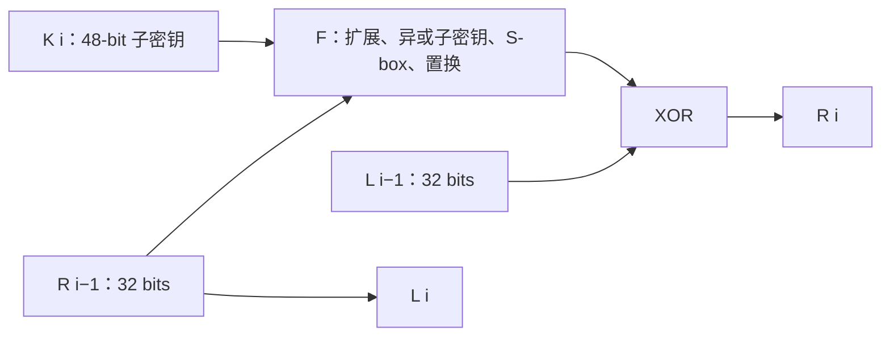
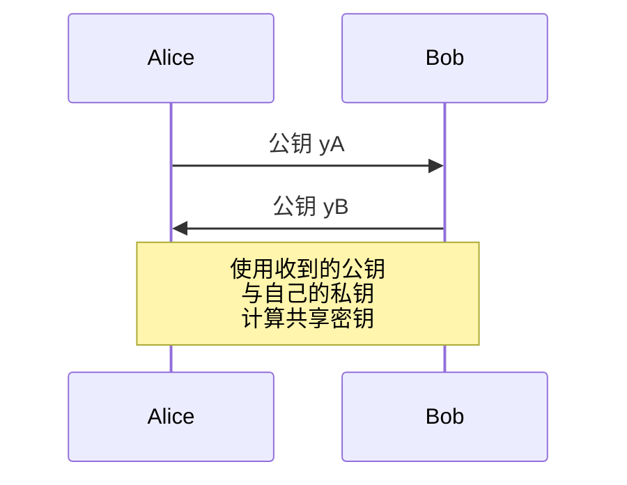
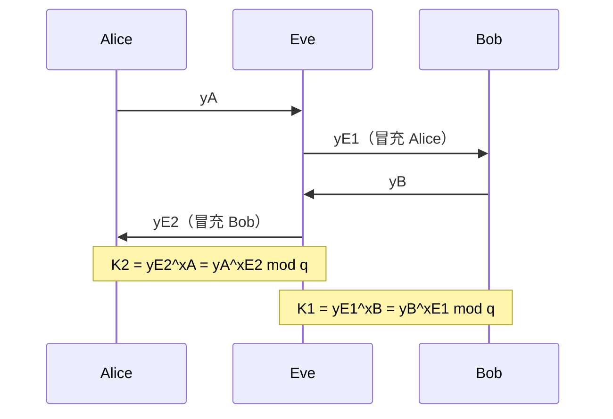
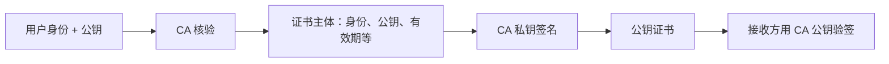
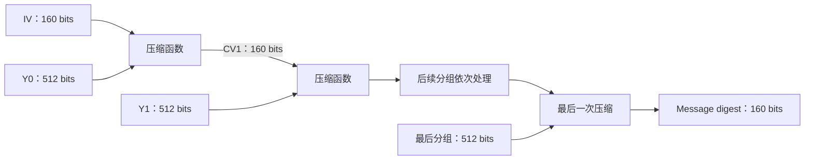
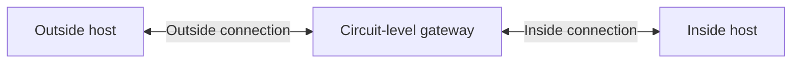

# Cryptography and Network Security · 提纲

## 常见加密算法

**What is cryptography？**

Cryptography is the art of secret writing, is the process of converting information that can be read by most, into a secret code, that can only be read by those who are party of the secret.

**What is security attacks？**

Actions involving the compromise of security info.

**What is security mechanisms？**

Detection, prevention and recovery from attacks.

**What is security services？**

Processes which improves security and protects from attacks.

1.  **Security Attacks**

**有哪些Security Attacks？**

（1）Passive Attacks（Doesn't affect the system resources）

Release of message contents

Traffic Analysis

2.  Active Attacks

Masquerade（Capture and replay of valid authentication sequence）

Replay（Re-use of observed data to produce an unauthorised effect）

Modification of message contents

Denial of Service

**有哪些典型的攻击方法？**

1.  Cryptanalysis Attacks

The attacker relies on the nature of the algorithm plus perhaps some knowledge of the general characteristics of the plaintext or even some sample plaintext ciphertext pairs.

（2）Brute-force Attacks

The attacker tries every possible key on a piece of ciphertext until an intelligible translation into plaintext is obtained.

**Why is Caesar cipher substitution technique vulnerable to a brute-force cryptanalysis?**

There are only 25 keys to try – very easy

**An encryption algorithm is computationally safe if？**

（1）Cost of breaking the cipher is much greater than the value of the encrypted information

（2）Time to break the cipher is much longer than the useful lifetime of the encrypted information

2.  **services & mechanism**

**有哪些security service？**

1.  Access Control：

Prevent unauthorized users from accessing system resources.

2.  Confidentiality：

Preserve（保留） authorised restrictions on information access and disclosure, including means for protecting personal privacy and proprietary information. A loss of confidentiality is the unauthorised disclosure of information.

（3）Integrity：

Guard against improper information modification or destruction. A loss of integrity is the unauthorised modification or destruction of information.

（4）Non-repudiation：

Protect against denial from either party.（防止任何一方的否认）

（5）Authentication：

Assurance of someone's identity.

（6）Availability:

Ensuring timely and reliable access to and use of information. A loss of availability is the disruption of access to or use of information or an information system.

**有哪些security mechanism？**

1.  Encryption

2.  Check/Hash algorithms

3.  Digital signature

**每个机制用了哪些服务？**

加密主要提供保密性；普通散列可用于检测变化，但单独使用不能认证发送者。MAC 提供完整性与消息认证；数字签名提供完整性、来源认证，并支持不可抵赖性。

**Consider a student attendance information system in which the students provide a password for accessing their accounts. Give examples of the security services the system should provide in terms of confidentiality, integrity, access control and availability.**

1.  The system must keep all passwords and account information confidential, both in the server and during the transaction.

2.  It must protect the integrity of data records from unauthorised changes.

3.  It must also limit access of various levels of data to the right users only; e.g. students can only access their own information, and instructors can access all students attendance records.

4.  Availability of the server during the college working hours is important, and needs to withstand DoS attacks.

**3、加密可以怎么分类？**

（1）The type of operations Substitution-Transposition（permutation）

（2）The number of keys used Symmetric-Asymmetric

（3）The way in which the plaintext is processed Block-Stream

**什么是Substitution？**

Each element of the plaintext is mapped into another element.

**什么是Transposition（permutation）？**

Each element of plaintext is rearranged.

**4、对称加密和非对称加密有什么不同？请分别举例**

1.  Symmetric Encryption

定义：Sender and receiver use the same key，faster and generally simpler to implement.

举例子：AES

2.  Asymmetric Encryption:

定义：Sender and receiver use different keys. Usually slower; can be used for exchanging symmetric keys. Security depends on the algorithm, key size and protocol, rather than simply whether encryption is asymmetric.

举例子：RSA

**5、stream cipher和block cipher**

**什么是Stream cipher？并举例**

Process one input element at a time.（no error propagation）

One Time Pad、Caesar

**什么是block cipher？并举例**

Process a block of elements at a time.

Permutation，Playfair square，AES

**6、One -time pad**

**How does a one-time pad work and how secure it is?**

（1）A one-time pad is a stream cipher that it is unbreakable .

（2）For each message a new random key is used, where the key is the same size as the message.

（3）Encryption produces a random output that has no statistical relationship to the plaintext.

（4）Weaknesses: easy to implement wrongly; and difficult to transmit the large key!

**One-time-pad的特点？**

1.  For each message use a new random key that is as long as the message.

2.  Encryption output that has no statistical relationship to the plaintext.

**One-time pad 为什么是坚不可摧的？**

Given a certain ciphertext, there are keys that produces different plaintext. If you did an exhaustive search of all possible keys, you would end up with many legible（清晰的） plaintexts, with no way of knowing which was the intended plaintext. The ciphertext contains no information whatsoever about the plaintext, there is simply no way to break the code.

**One-time pad有哪些实际问题？**

（1）the difficulty in generating truly random keys.

（2）how to transmit and protect the random key.

（3）The key size is as big as the message, so can have limitations.

（4）easy to implement wrongly

**7、什么是传统加密？——对称的块加密**

Block ciphers that use a shared key (symmetric) are known as conventional encryption algorithms.

**8、DES**

**DES的特点？**

加密方式：Block cipher

Plaintext block size：64 bits

Key size：56 bits

Number of rounds：16 rounds

Algorithms used：Feistel algorithm

**什么是Feistel algorithm？**

**DES的流程？**

DES 的每一轮把 64-bit 数据分成左右两半，各 32 bits。第 $i$ 轮：

$$
L_i=R_{i-1},\qquad R_i=L_{i-1}\oplus F(R_{i-1},K_i).
$$

完整 DES 在初始置换后进行 16 轮 Feistel 运算，再进行末尾交换与逆初始置换。

**Which are the two main areas of concern related to the level of security provided by DES?**

The two main areas of concern related to the level of security provided by DES are: key size and the nature of the algorithm, e.g. the design of S boxes and the choice of specific permutations.

**为什么DES在当今社会不再安全了？如何攻击DES？**

（1）Due to the limitation of the length of the key.

（2）The Data Encryption Standard (DES) uses a 56-bit key. A brute-force attack can try all possible keys within a reasonable time frame, making DES vulnerable.

（3）One example is that assume there is a 56-bit key with DES, the attackers test all 256 possible keys to decrypt the message.

**什么是双重DES？**

先用 $K_2$ 加密，再用 $K_1$ 加密；解密次序相反：

$$
C=E_{K_1}(E_{K_2}(m)),\qquad m=D_{K_2}(D_{K_1}(C)).
$$

**双重 DES（Double DES）是否能有效提升安全性？双重DES有什么缺陷？有没有其他方法可以解决以上缺陷？**

1.  No.

2.  Double DES is not an effective way to increase security due to the meet-in-the-middle attack. In this, an attacker can encrypt the plaintext with one key and decrypt the ciphertext with another key, comparing the results to find a match. This reduces the effective key size from 112 bits to 57 bits, making it vulnerable.

3.  A better alternative is AES (Advanced Encryption Standard). AES operates with 128, 192, or 256 bits key size, significantly increasing security against brute-force and meet-in-the-middle attacks. And it is optimized on various platforms, offering faster encryption and decryption processes.

**什么是S-box？**

Perform substitution on the message contents and 'confuse' the information of the original message.

**S-box的作用是什么？**

1.  Compress the length for key operation.

2.  Increase security

**DES中S-box替换的作用是什么？它是如何起作用的？**

• The S-box (substitution box) is used to perform substitution on the message contents.

• The purpose is to ‘confuse’ the information of the original message.

• It consists of a table (4 X 16) where the entries of the table are the substitution values.

• The first and last bits from a 6-bits block are used to represent a binary number and refer to a row on the table. The remaining 2 to 5 bits form a binary number to refer to a column in the table.

• The overlap between the selected row and column holds the new value which the S box is going to use in the substitution.

**9、AES**

AES 128的意思是key的大小是128 bits

**AES的特点，流程？**

加密方式：Block cipher

Plaintext block size：128 bits

Key size：128,192,256 sizes

Number of rounds：10,12,14 rounds

**AES Algorithms used：Rijndael algorithm**

1、substitute bytes S-box substitution

2、shift rows permutation

4、mix columns substitution

5、add round key bitwise XOR

**AES的流程图**

最后一轮没有mix columns

**AES流程各步骤的作用**

1.  Substitute Bytes : Uses an S-box to perform block substitutions. Each of the ‘state’ bytes is split into two 4-bit values; these represent the column and row values of the S-box containing the new substitution value.

2.  Shift Rows : A simple permutation where the ‘state’ block is altered by re arranging the bytes located on each of the four rows.

3.  Mix Columns : A substitution that makes used of arithmetic over GF(28). Hence, each of the ‘state’ elements is updated using the product of elements of one row and one column.

4.  Add Round Key : A simple bitwise XOR of the current block with a portion of the expanded key. The expanded key is obtained through the ‘expansion algorithm’.

**AES中S-box替换的作用是什么？它是如何起作用的？**

（1）The S-box (substitution box) is used to perform substitution on the message contents. （2）The purpose is to ‘confuse’ the information of the original message.

（3）It consists of a table (16x16) where the entries of the table are the substitution values.

（4）The first 4 bits of the 8-bits block are used to represent a binary number and refer to the row of the table. The last 4 bits of the 8-bits block are used to represent a binary number and refer to the column of the table.

（5）We use the value of the selected row and selected column of the table to do the S-box substitution.

**AES中使用Key expansion algorithm的作用？**

1.  Generate multiple round keys，ensure each round uses a different key. **The AES key is 4 words，which is used for round 0. For round 1-10，the key expansion algorithm provides a new 4-word round key for each of the 10 rounds.**

2.  Prevent key reuse，increase complexity and confusion. Use the same key in each round would make the encryption vulnerable to attacks.

**10、Modes of operation**

**Modes of operation的作用是是什么？**

1)  To avoid the result of using of the same key would produce the same ciphertext for the similar plaintext.

2)  To avoid the attackers using this weakness to get the key.

3)  They enable improving the encryption of block using the same key.

**Modes of operation有哪些？**

（1）ECB: electronic code book

分块加密，相同的明文块始终会得到相同的密文块，没有解决根本问题

（2）CBC: cipher block chaining DES

每个明文块先和前一个密文异或，再用密钥加密。

（3）CFB: cipher feedback mode DES

将前一个密文块作为输入进行加密，生成一个密钥流，再与当前明文块进行异或运算得到密文块。

（4）OFB: output feedback mode Ek

保持同一个密钥 $K$，从 IV 开始反复加密前一步的输出，生成密钥流；再与明文逐块异或。加密的是反馈状态，不是密钥本身。

（5）CTR: counter mode DES

**CBC的流程是什么？**

**CBC中的error propagation是什么样的？**

（1）If an error bit occurs in the ciphertext， it propagates for a maximum of 2 blocks - the current block and the next block.

（2）If an error bit occurs in the plaintext, it propagates to the current blocks and all the following blocks.

**CFB中的流程是什么？**

（1）Start with an initial vector (iv) (given)

（2）Shift j bits

（3）Encrypt using DES

（4）Select first j bits

（5）XOR with the j bits of the message

（6） Use the encrypted message as j bits in new iv

**CFB 中的 Error Propagation 是什么样的？**

设分组长度为 $b$，每次反馈 $s$ bits：

- 密文传输中的单 bit 错误，会让当前明文段对应 bit 翻转，并扰乱后续 $\lceil b/s\rceil$ 个明文段，之后恢复同步。
- DES-CFB8 中 $b=64,s=8$，所以影响当前段及后续 8 个 8-bit 段。
- 全分组 CFB 中 $s=b$，影响当前块和下一块。
- 如果在加密前改变明文本身，由于密文持续参与反馈，变化可影响后续密文序列。

参见 [NIST SP 800-38A，Appendix D](https://nvlpubs.nist.gov/nistpubs/legacy/sp/nistspecialpublication800-38a.pdf)。

**OFB中的流程是什么样的呢？**

**OFB中的Error Propagation是什么样的？**

No error propagation.

**CTR中的流程是什么样的？**

## 第二章、公钥加密和认证

**1、public key encryption（非对称加密）**

**What is the difference between the public and private keys?**

**If 20 people want to communicate using conventional encryption, how many keys are**

**needed? And if they want to use public-key encryption, how many keys are needed?**

**List the principal elements of a public-key encryption. Briefly explain each of them.**

**What are three broad categories of applications of public-key cryptosystems?**

**公钥加密的流程是什么？**

公钥加密，私钥解密

（1） Each user generate two keys, public and private.

（2） The user put their public key in public register. These public keys are accessible by anyone.

（3） If User1 wishes to send a message to User2, User1 encrypts the message using User2’s public key.

（4） User2 decrypts it using his/her own private key. No one else could decrypt the message because it’s kept privately.

**有哪些公钥密码技术？**

（1）Diffie-Hellman Key Exchange：密钥协商，本身不直接加密消息。

（2）RSA

**2、Diffe-Hellman key exchange**

**Diffe-Hellman key exchange是什么？**

下面的 $y_A,y_B$ 是双方公开交换的值。

公开参数：素数 $q$，以及模 $q$ 的原根 $\alpha$。

| Alice | Bob |
|---|---|
| 私钥 $x_A$ | 私钥 $x_B$ |
| 公钥 $y_A=\alpha^{x_A}\bmod q$ | 公钥 $y_B=\alpha^{x_B}\bmod q$ |
| $K_A=y_B^{x_A}\bmod q$ | $K_B=y_A^{x_B}\bmod q$ |

$$
K_A=K_B=\alpha^{x_Ax_B}\bmod q.
$$

**Primitive root（原根）**：若 $\alpha$ 是模素数 $q$ 的原根，则

$$
\alpha^1,\alpha^2,\ldots,\alpha^{q-1}\pmod q
$$

两两不同，恰好覆盖 $1,2,\ldots,q-1$。

**Diffe-Hellman key exchange应用题：**

第一问：

 

第二问：

1.  The secret key cannot be used practically because it is not secure.

2.  The reason is that the prime number q is too small, which makes it easy for attackers to guess the secret key through brute-force attacks.

**如何攻击Diffe-Hellman key exchange？**

Man-in-the-middle attack

未经身份认证的 Diffie–Hellman 交换中，中间人可以替换双方的公钥，分别建立两个共享密钥。

Eve 持有 $x_{E1},x_{E2}$，因此能计算两侧密钥；Alice 与 Bob 实际上没有得到彼此直接共享的同一个密钥。

**3、RSA**

RSA 加密使用接收方公钥，并由接收方用私钥解密；RSA 签名使用发送方私钥，并由接收方用发送方公钥验证。

**What is the RSA? What are its uses?**

**RSA使用了哪几种钥匙？**

A public key Ku= {n, e} for encryption and a private key Kr={n, d} for decryption.

**RSA public key algorithm如何处理数据（逻辑上）？——先公**

1.  Encrypt with Recipient's Public Key

2.  Send Encrypted Message

3.  Decrypt with Private Key

4.  Both sender and receiver must known n & e， only the receiver knows d.

**RSA的流程是什么（数学上）？**

（1）Choose two large prime numbers 𝑝 and 𝑞

（2）n=p×q

（3）ϕ(n)=(p−1)(q−1)

（4）choose e，1\< e\< ϕ(n)，e and ϕ(n) are relative primes.

（5）Calculate d， ed≡1 mod ϕ(n)

（6）The public key is (n, e), and the private key is (n, d).

（7）encryption：

（8）decryption：

（9）总结：

**Is 3 a primitive root of 7? Why?**

**RSA可以使用在哪些security mechanisms中？**

Encryption、Digital signature

**RSA如何应用在Digital signature中？——后公**

在 RSA 签名的简化数学模型中，令 $h(m)$ 为消息摘要：

$$
S=h(m)^d\bmod n,\qquad S^e\bmod n\stackrel{?}{=}h(m).
$$

发送方用私钥签名，接收方用发送方的公钥验签。实际 RSA 签名还包含规定的摘要编码与填充步骤。

（1）Hash the Message

（2）Encrypt Hash with sender’s Private Key

（3）Attach Signature and Send

（4）Verify with sender’s Public Key

**RSA如何应用在Confidentiality中？**

1.  Encrypt message with receiver’s Public Key

2.  Decrypt cipher with receiver’s Private key

**RSA应用题**

给密文，求原文

第一步、Factorize n，find p,q（p，q是prime number）

第二步、Calculate 𝜙(𝑛)

第三步、Find the Private Key 𝑑

第四步、Decrypt the Ciphertext

所以，The plaintext 𝑀 is 3.

**Why RSA works？**

**4、Hybrid Encryption**

**Hybrid Encryption的流程是什么？**

1.  generate a fresh session key KAB

（2）

（3）Bob decrypts the message and obtains KAB

（4）

（5）

（6）

**Hybrid Encryption为什么能处理大量数据？**

（1）Symmetric encryption (session keys) is much faster than asymmetric encryption.

（2）Public-key encryption are used to securely share the session key.

（3）The session key encrypts large data efficiently after being securely shared.

（4）This combination provides both security and speed.

**5、Certificate（Public-Key Certificates）**

**获取Certificate的流程是什么？**

1. 用户生成密钥对，把身份信息与公钥提交给 CA（Certificate Authority）。
2. CA 核验身份及相应的密钥持有证明。
3. CA 对证书主体签名；主体包含用户身份、公钥、有效期等信息。
4. 接收方使用可信 CA 的公钥验证证书签名，并检查有效期及证书用途等。

证书将身份与公钥绑定；CA 的签名不用于保密公钥。参见 [X.509 证书结构（RFC 5280）](https://www.rfc-editor.org/rfc/rfc5280#section-4.1)。

**6、Hash Function**

**What is a one-way function？**

A function that is very easy to do, but difficult to reverse.

**What is hash function？**

1.  it is a **one-way function**

2.  sender and receiver do not need to share a secret key.

3.  Takes a message of a variable length and produces a fixed length output as a message digest.

4.  h(m) is easy to compute for any m.

**Hash function的三个Security Properties是什么？**

1.  Preimage Resistance

For c，it is hard to find a m such that h(m)=c

2.  Second Preimage Resistance

For m and h(m), it is hard to find n ≠ m such that h(m) = h(n).

3.  Collision Resistance

For a hash function, it is hard to find different m，n such that h(m)=h(n)

**One-way hash（hash function）和MAC的对比**

1.  The sender and the receiver of a MAC need to share a secret key, but no key is required for a hash function.

2. An unkeyed hash detects changes only when compared with a trusted digest; it cannot authenticate the sender on its own. A MAC provides integrity and data origin authentication to parties sharing the key.

**如何攻击Hash？（生日攻击是什么？）**

（1）A preimage or second preimage attack**（brute-force attacks）**

Find x such that H(x) equals a given hash value

For an ideal m-bit hash, a generic preimage search requires work on the order of $2^m$ hash evaluations.

（2）Collision resistance attack（Birthday Attack）**（cryptanalysis）**

For a hash function, find different m，n such that h(m)=h(n)

For an ideal m-bit hash, collision search requires roughly $2^{m/2}$ trials. More precisely, about $\sqrt{2\ln2}\,2^{m/2}\approx1.177\,2^{m/2}$ independently sampled messages give a 50% chance of at least one collision.

**Birthday attack 流程是什么？**

1.  There is an m-bit hash.

2.  Eve creates around 2^(m/2) variations of the original messages.

3.  Eve creates around 2^(m/2) variations of the fraudulent（false）messages.

4.  Eve looks for a collision where both messages have the same hash，probability of success is over 50% due to the birthday paradox（悖论）——in a group of just 23 people, there is a 50% chance that two people share the same birthday.

**7、SHA1**

**SHA1的流程图？**

SHA-1 将消息填充后分成 512-bit 分组，内部链值与最终摘要均为 160 bits。

设原消息长度为 $\ell$ bits：先追加一个 `1`，再追加 $k$ 个 `0`，使

$$
\ell+1+k\equiv448\pmod{512}.
$$

最后追加表示原消息长度 $\ell$ 的 64-bit 字段，得到长度为 512 bits 整数倍的消息。

$CV$ 是 chaining value（链值）；每个压缩步骤接收当前消息分组和前一步链值，首步使用预定义 IV。参见 [Secure Hash Standard，§5.1.1](https://nvlpubs.nist.gov/nistpubs/FIPS/NIST.FIPS.180-4.pdf)。

**SHA-512相较于SHA-1有何不同？**

1.  larger Message digest size

2.  larger Message size

3.  larger Block size

4.  larger Word size

5.  Number of steps is same

6.  Safer

**8、MAC**

**Define Message Authentication Code**

**MAC流程图？**

**9、HMAC**

**什么是HMAC？**

HMAC is a MAC derived from a cryptographic hash code, that is, it incorporates a secret key into an existing hash algorithm.

**为什么要用HMAC？**

（1）Cryptographic hash functions execute faster (software) than conventional encryption algorithm (e.g. DES)

（2）Code for cryptographic hash functions is widely available.

**如何替换HMAC中的hash？**

Remove the existing hash function module and drop in the new module.

**10、Digital Signature**

**Digital Signature的流程图？**

**Digital Signature提供哪些3？**

Authentication，integrity，non-repudiation.

## 第三周、秘钥管理和IP安全

1.  Distribution of Public Keys

forgery伪造、tampering篡改、revocation（吊销）、revoke（吊销）、compromise（泄露）

**公钥分发有哪几种？**

1.  public announcement，缺点forgery

2.  Publicly Available Directory，缺点tampering、forgery

3.  Public-Key Authority，Requires real-time access to directory when keys are needed.，缺点tampering

4.  Public-Key Certificates

**Public key certificate的流程图**

**Public key certificate是什么？它由哪几个部分组成？**

（1）It is used to authenticate public-keys of users.

（2）a public key, an identifier of the key owner and other information, is signed and created by a certificate authority（CA）, and is given to the participant. A participant conveys its key information to another by transmitting its certificate. Other participants can verify that the certificate was created by the authority.

2、X．509（Public key certificate）

**什么是X．509？**

（1）X.509 defines a framework for authentication services using the X.500 directory.

（2）user's public key is signed by the private key of a trusted Certificate Authority (CA) to ensure authenticity.

（3）X.509 defines alternative authentication protocols based on public key certificates.

（4）它有吊销机制，Hierarchical Trust

**Certificate什么情况下会被revoked（吊销）？**

（1） User’s Private-Key has been compromised（泄露）

（2） Certification Authority has been compromised （泄露）

（3） User is no longer certified by this Authority if the user is no longer authorized.（用户离开了组织）

（4） User is no longer certified by this Authority due to the misuse.（用户提供了错误的信息）

**How can Certification Authorities (CAs) maintain an up-to-date validity of all users and avoid invalid keys? （X.509 Certificate的Revocation的原理？）**

**（1）Risk management process：**

Identification：Recognize risks associated with invalid or compromised certificates that affect security.

Evaluation：评估这些risk对网络安全和信任的影响。

**（2）Mitigation：**

- 使用CRL（Certificate Revocation List），CRL记录了已经revoked但没有expired的certificates，CRL包括issuer's name、list creation data、The date when the next CRL will be issued、entry for each revoked certificate. 每个entry由证书的SN和该证书的revocation date组成。由于SN（serial numbers）在CA中是唯一的，因此SN足以标识CA证书。

- 用户在每次收到certificate时，check certificates with CA’s CRL，来决定这个certificate是不是revoked的。

- Monitoring: CAs要经常更新（regular updates）CRL

3.  **Kerberos**

**Kerberos的定义**

Kerberos is a centralized authentication and access-control service designed for use in open, distributed environments.

**Kerberos提供了哪些security services？**

Access control、Authentication

**Kerberos的requirements是什么？实现这些requirements的mechanism是什么？**

1.  Secure：should cope with external attacks

> Mechanism：Conventional encryption、authentication

2.  Reliable: should be highly reliable and should employ distributed server architecture. One system able to back up another.

> Mechanism：Distributed architecture. Uses mirrored system backups.

3.  Transparent: Apart from the password, a user should not be aware of the authentication is taking place.

> Mechanism：Limitation of user interaction to the authentication with the client (password, or other methods).

4.  Scalable: As the network grows, there should be a method which allows such growth.

> Mechanism：Principle of Kerberos realms.

**A simple way for a server to authenticate a client, is to ask for a password. In Kerberos this authentication is not used, why? How does Kerberos authenticate the server and the clients? （Kerberos 认证的原理和原因）**

1.  The main security weakness is that the password is transmitted. So anybody eavesdropping（窃听） can get hold of it.

2. Kerberos 的基本流程：

   - Client 与 KDC 的 Authentication Server 交互，获得 Ticket-Granting Ticket（TGT）及与 TGS 通信的 session key。给客户端的回复由客户端长期密钥（通常从口令派生）保护；TGT 由 TGS 的长期密钥保护。
   - Client 使用 TGT 和 authenticator 向 Ticket-Granting Server 请求目标服务的 ticket。
   - TGS 返回服务 ticket，以及 client/server session key。服务 ticket 由目标服务的长期密钥保护。
   - Client 将 ticket 和新的 authenticator 提交给目标服务；服务解密并验证后建立认证上下文，可进一步实现双向认证。

Session key 由 KDC 生成；用户口令不作为明文在网络中传输。参见 [Kerberos V5（RFC 4120）](https://www.rfc-editor.org/rfc/rfc4120#section-1.1)。

内部其实是conventional encryption

4、IPSec

**What is IPsec? Why is it significant?**

（1）IPSec stands for IPSecurity as it protects IP packets

（2）It is vital for providing additional security at the IP layer, and protects packets of all applications including security-ignorant applications

（3）It provides: confidentiality, authentication, or both for IP packets.

什么是SA（Security Association）？

A one-way relationship between sender and receiver that describes a security service.

**List the services provided by IPSec.**

**List four of the parameters used to characterize the nature of a particular Security Associate (SA)**

• Sequence Number Counter

• Sequence Counter Overflow

• Anti–Replay Window

• AH Information

• ESP Information

• Lifetime of this Security Association

• IPSec Protocol Mode: tunnel or transport

• Path MTU (maximum transmission unit)

**SA如何建立two-way communication？**

For two-way exchange of data，two SAs are needed，from sender-to-receiver and receiver-to-sender.

**能够唯一标识每个SA的参数是什么？**

SPI（Security Parameters Index）用于选择 SA。经典 IPsec 模型中，SA 由 SPI、目标 IP 地址和安全协议（AH 或 ESP）的组合标识；具体入站查找可根据协议及实现使用 SPI 或更完整的组合。[RFC 4301](https://www.rfc-editor.org/rfc/rfc4301#section-4.1)

**什么是DOI？**

全称：domain of interpretation

1.  Contains values to relate the different specifications of the protocol

2.  Identifiers for encryption and authentication algorithms

3.  Operational parameters, key lifetimes, key exchange etc

**List the two IPSec modes of operation？How can they achieve protection against traffic analysis?**

1.  Tunnel Mode：protects entire packet

2.  Transport Mode：protects payload

3.  ESP provides protection against traffic analysis.

4.  In tunnel mode ESP provides protection against traffic analysis where the host on the internet networks use the Internet transport of data but do not interact with other Internet-based hosts.

5.  In Transport Mode, ESP only protects the payload, hence the IP header will not be hidden (limited protection against traffic analysis)

**What is ESP Tunnel Mode？**

1.  Tunnel Mode: protects entire packet.

2.  In tunnel mode ESP can be used to set up a virtual private network.

3.  Host on the internet networks use the Internet transport of data but do not interact with other Internet-based hosts.

4.  Tunnel mode operation provides protection against traffic analysis.

**What is ESP Transport Mode？**

1.  Transport Mode: protects payload.

2.  In transport mode ESP is used to encrypt (and optional to authenticate) the data carried by IP.

3.  The entire transport-level segment plus the ESP trailer are encrypted.

4.  Transport mode operation provides confidentiality.

**IPsec policy can be configured in which manner？**

Per-packet：encrypt outgoing packets if I’m sending to 10.1.1.0/24

Per-socket：encrypt outgoing packets from this socket

5、Oakley

**什么是Man-in-the-middle attack？如何解决？**

未经身份认证的 Diffie–Hellman 交换中，中间人可以替换双方的公钥，分别建立两个共享密钥。

Eve 持有 $x_{E1},x_{E2}$，因此能计算两侧密钥；Alice 与 Bob 实际上没有得到彼此直接共享的同一个密钥。

解决方法：

Digital signature of public key exchange to do the authentication

1.  使用Oakley Key Determination Protocol，Oakley可以使用Digital Signature to authenticate the Diffie–Hellman exchange to thwart man-in-the-middle attack. Authentication is done by signing a mutually obtainable hash. Each party encrypts the hash with its private key. And the receiver can decrypt the hash with the public key with sender’s public key and compare the hash.

2.  The public key is certified by the CA to ensure its authenticity.

6、ISAKMP（Internet Security Association and Key Management Protocol)

**In IPSec, what are the specific key exchange algorithms in ISAKMP?**

ISAKMP by itself does not dictate a specific key exchange algorithm; rather, ISAKMP consists of a set of message types that enable the use of a variety of key exchange algorithms

**Oakley和ISAKMP在IPSec中的职责分别是什么？**

（1）Oakley provides the security mechanism

Oakley is the specific key exchange algorithm mandated for use with the initial version of ISAKMP.

（2）ISAKMP provides the protocol framework.

ISAKMP by itself does not dictate a specific key exchange algorithm; rather, ISAKMP consists of a set of message types that enable the use of a variety of key exchange algorithms

7、Firewalls

**什么是Firewall？**

（1）A Firewall protects a local system/network from network–based security threats, at the same time allows access to the outside world (WAN, Internet).

（2）The Firewall may be one or more computer systems.

（3）Only authorised traffic will be allowed to pass.

（4）The Firewall is inserted between the premises network and the Internet.

**Firewall Limitations？**

• The Firewall cannot protect against attacks that bypass the Firewall.

• The Firewall does not protect against internal attacks.

• The Firewall cannot protect against computer viruses.

**Firewall有几种control？**

Service Control、Direction Control、Use Control、Behavior Control

**Firewall有几种Protection Methods？**

Packet Filtering（Rejects unauthorized TCP/IP packets or connection attempts）、Application-Level Gateway、Circuit-Level Gateway、Proxy Services

**什么是Application-Level Gateway？Application-Level Gateway的流程图？**

（1）It acts as a relay of Application-Level.

（2）If the gateway does not implement the proxy code for a specific application, then it is not supported and cannot be used.

（3）A user contacts the gateway to access some service, provides details of the service, remote host & authentication details, contacts the application on the remote host and relays all data between the two endpoints.

（4）They tend to be more secure than packet filters, and can log and audit traffic at application level.

（5）They are more secure than packets filters as only check a few allowable applications.

（6）缺点: Additional processing overhead for each connection.

**什么是Circuit-level Gateway？Circuit-level Gateway的流程图？**

1.  It does not permit an end-to-end TCP connection, but rather relays them.

2.  It opens two connections between itself and inner host，itself and outside host.

3.  It hides the direct internal endpoint by relaying connections. A circuit-level gateway is distinct from NAT, which translates network addresses and possibly port numbers.

4.  Security function consist of determining which connections are allowed.

**In the context of Firewalls, what is the difference between a circuit-level gateway and an application-level gateway? When might you use one over the other?**

1.  分别介绍circuit-level gateway和application-level gateway

2.  circuit-level gateway位于transport layer，application-level gateway位于application layer

3.  当你想hide the addresses of internal hosts from the outside world，使用Circuit-level Gateway

4.  If you want to perform security checks for a specific application, 使用Application-Level Gateway

## 第四周、安全

1.  TLS（Transport Layer Security）

本节按课程中的 TLS 1.2 及更早版本握手模型讨论；Heartbeat 属于可选扩展。[TLS 1.2（RFC 5246）](https://www.rfc-editor.org/rfc/rfc5246.html)

**TLS Connection是什么？**

A connection in TLS is a transport that provides suitable type of service (they are peer-to-peer and transient). Every connection is associated with one session.

**TLS Session是什么？**

A session in TLS is an association in between a client and a server. They define the security which can be shared between multiple connections (to avoid expensive renegotiation of security parameters).

**TLS Architecture图？**

SSL的结构图没有Heartbeat Protocol

**TLS有哪些protocol，分别简述？**

Handshake protocol、Change Cipher Spec protocol、Alert protocol、Heartbeat protocol、Record Protocol

（1）Handshake protocol：

This protocol performs all the tasks requiring agreement between the two entities before they set up the secure TLS channel

（2）Change Cipher Spec protocol：

Change Cipher Spec 通知对方：后续记录开始使用已协商的 CipherSpec 与密钥。它把 pending state 切换为 current state，通常紧接着发送 Finished 消息。

（3）Alert protocol：

Used to convey TLS-related alerts to the peer entity.

（4）Heartbeat protocol：

A heartbeat protocol is used to monitor the availability of a protocol entity.

（5）Record Protocol：

TLS Record protocol provides: Confidentiality & Message Integrity

**Handshake protocol的流程？**

------------------------------------------------------------------------

Establish Security Capabilities

Authentication and Key exchange

Client Authentication and Key exchange

Finish (Change Cipher Spec)

**Explain the term “'cipher suite" in the Handshake protocol**

1.  Cipher is a list that contains the combinations of cryptographic algorithms.

2.  Handshake protocol contains：agree on the cipher suite to be used to establish the secure channel

3.  For example, Key Exchange and CipherSpec

**Ephemeral Diffie-Hellman如何在server和client构建secret value？**

1.  Client sends hello Request to the server, including a list of cipher suites the client supports.

2.  The server generates a fresh set of parameters, and sends the public values alongside a digital signature on the chosen parameters.

3.  After receiving server response message, *client* needs to verify the digital signature on the Diffie–Hellman parameters.

4.  The client generates a fresh temporary Diffie–Hellman key pair and sends the public value to the server.

5.  Both client and server compute the shared secret KP.

**TLS Record protocol是什么？**

TLS Record Protocol 将上层数据分段，按协商的连接状态保护各条记录，添加记录头后交给传输层；接收端执行验证、解密和重组。

**TLS Record protocol提供哪些security service？**

Confidentiality、Message Integrity

**TLS Record Protocol的流程？**

传统非 AEAD 记录模型：Fragmentation → 可选 Compression → Add MAC → Encrypt → Append TLS record header。压缩可以是 null；使用 AEAD 时由认证加密同时完成保密与完整性保护。

2.  PGP（Pretty Good Privacy）

**四张你必须会背的图（基础）**

**Authentication最后Z，**

**Confidentiality最开始Z**

**两张组合的图（复习）**

**将终点和起点组合在一起**

**In a PGP message, which part of the message is compressed? Which part of the message is converted to ASCII text?**

1.  The signature and message.

2.  The encrypted part of the message.

**If the message was first compressed and then signed then for future verification？**

应该先signed，再compressed

（1）A compressed version of the document has to be stored，or

（2）Re-compress the message when verification is required.

**How many types of encryptions keys are used/generated in PGP?**

（1）Pass-phrase key

（2）Session keys (random keys generated)

（3）Public-key

（4）Private-key

**How do PGP manage keys?**

（1）One or more keys stored together constitute a key-ring.

（2）There are two classes:

Private-key ring: Stores the private/public key pairs owned at this node.

Public-key ring: Stores the public keys of other users known at this node.

**In PGP key management, there is a possibility of multiple public keys per user, therefore the recipient of the message needs to know which of his/her public keys was used for encryption. Explain how PGP identifies the public key.**

（1）PGP send an identifier of the recipients public key.

（2）在课程涉及的旧版 OpenPGP 中，V3 RSA Key ID 取公钥模数的低 64 bits，V4 Key ID 则取 fingerprint 的低 64 bits。Key ID 用于查找候选密钥，不能视为绝对唯一的身份标识。[RFC 4880，§12.2](https://datatracker.ietf.org/doc/html/rfc4880#section-12.2)

**The purpose of pass-phrase key in PGP**

（1）In Private Key ring, we can use Pass-phrase key to encrypt private key.

（2）Then the encrypted private key can be safely stored in the Private Key ring of the user’s device.

**How the public keys are certified in PGP？**

1.  PGP does not include any specification for establishing Cas

2.  adopts a different trust model – the “web of trust”

3.  Individuals sign one another’s public keys (the “signature field” in the public-key ring) and create an interconnected community of public-key users.

4.  PGP computes a trust level for each public key in key ring

<!-- -->

3.  **S/MIME**

**S/MIME Authentication**

1\. The sender creates a message

2\. SHA-256 is used to generate a 256-bit message digest of the message

3\. The message digest is encrypted with RSA using the sender’s private key, and the result is appended to the message. Also appended is identifying information for the signer, which will enable the receiver to retrieve the signer’s public key

4\. The receiver then verifies the message digest.

**S/MIME Confidentiality**

1\. The sender generates a message and a random 128- bit number to be used as a content-encryption key for this message only.

2\. The message is encrypted using the content encryption key.

3\. The content-encryption key is encrypted with RSA using the recipient's public key and is attached to the message.

4\. The receiver uses RSA with its private key to decrypt and recover the content-encryption key.

5\. The content-encryption key is used to decrypt the message.

**Sender**

**Receiver**

**Explain the Certificates Processing of S/MIME.**

（1）Uses public-key certificates that conform to X.509 v3.

（2）Key management is hybrid between X.509 and PGP’s web of trust.

（3）Each client has a list of trusted CA’s certificates and own public/private key pairs & certificates.

（4）Certificates must be signed by trusted CA’s (e.g. VeriSign)

4.  **Malicious Software**

Virus、Worm、Trojan horse、Spyware

5.  **DDoS**

**What is DDos？**

**DDoS Countermeasures预防措施？**

