# Digital Circuit Design · 笔记

## 数字系统和编码

### Gates 逻辑门

- **AND 与门**：$`X=AB`$。
- **OR 或门**：$`X=A+B`$。
- **NOT 非门**：$`X=\overline A`$。

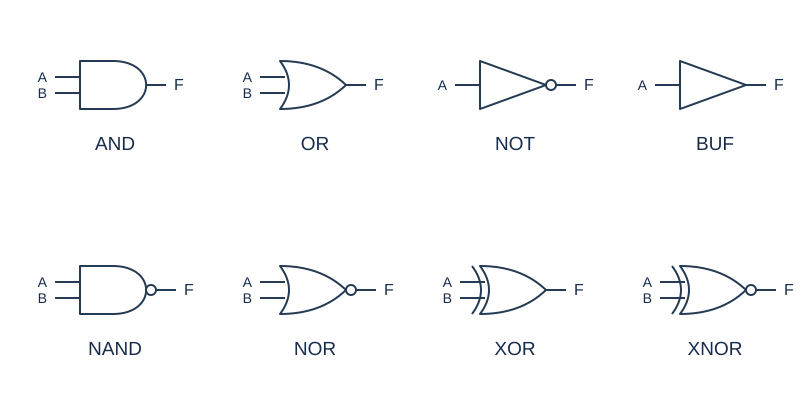

### Number System 数制

- **Decimal**：十进制。
- **Binary**：二进制。
- **Octal**：八进制（和月份不同）。
- **Hexadecimal**：十六进制，数字为 $`0,1,2,3,4,5,6,7,8,9,A,B,C,D,E,F`$。

$`53_{10}=110101_2`$。

- **MSB（most significant bit）**：最高位。
- **LSB（least significant bit）**：最低位。
- 一般数位也称 **MSD（most significant digit）**、**LSD（least significant digit）**。

例如 $`123402.3829`$，整数部分最高位是 1、最低位是 2；小数部分最左是 3、最右是 9。

#### 二进制与十进制转换

**二进制转十进制**：

整数：$`11_2=1\times2^0+1\times2^1=3_{10}`$。

小数：

```math
1011.11_2=1\times2^{-2}+1\times2^{-1}+1\times2^0+1\times2^1+1\times2^3=11.75_{10}.
```

**十进制转二进制，整数**：

1. 不断除以 2，记录每次余数。
2. 余数自下向上读。

| 被除数 | 商 | 余数 |
|---:|---:|---:|
| 53 | 26 | 1 |
| 26 | 13 | 0 |
| 13 | 6 | 1 |
| 6 | 3 | 0 |
| 3 | 1 | 1 |
| 1 | 0 | 1 |

故 $`53_{10}=110101_2`$。

**小数（fractional part）**：

1. 将小数乘 2。
2. 取结果的整数部分作为下一位。
3. 对剩余小数重复计算。

| 小数乘 2 | 结果 | 取整数位 |
|---|---:|---:|
| $`0.0390625\times2`$ | 0.0781250 | 0 |
| $`0.078125\times2`$ | 0.156250 | 0 |
| $`0.15625\times2`$ | 0.31250 | 0 |
| $`0.3125\times2`$ | 0.6250 | 0 |
| $`0.625\times2`$ | 1.250 | 1 |
| $`0.25\times2`$ | 0.50 | 0 |
| $`0.5\times2`$ | 1.0 | 1 |

小数部分变为 0，才说明其二进制小数表示是有限的。例中结果为 $`0.0000101_2`$。

例：$`5.2_{10}`$ to binary，最多保留 3 位二进制小数。

整数：$`5\div2=2`$ 余 1（LSD）；$`2\div2=1`$ 余 0；$`1\div2=0`$ 余 1（MSD）。

小数：$`0.2\times2=0.4`$（取 0，MSD）；$`0.4\times2=0.8`$（取 0）；$`0.8\times2=1.6`$（取 1），etc.

继续：$`0.6\times2=1.2`$，取 1。因此截取前三位有 $`5.2_{10}\approx101.001_2`$。

**总结**：

- 整数、小数分开计算。
- 小数部分乘 2、取整数部分、反复计算，可能无限循环。

#### 十六进制及其他进制转换

**十六进制转十进制**：

```math
A2F_{16}=10\times16^2+2\times16^1+15\times16^0=2607_{10}.
```

**十进制转十六进制**：Convert $`265.78_{10}`$ to hexadecimal.

整数部分：$`265\div16=16`$ 余 9（LSD）；$`16\div16=1`$ 余 0；$`1\div16=0`$ 余 1（MSD）。

小数部分：

| 运算 | 结果 | 取整数部分 |
|---|---|---|
| $`0.78\times16`$ | 12.48 | C |
| $`0.48\times16`$ | 7.68 | 7 |
| $`0.68\times16`$ | 10.88 | A |
| $`0.88\times16`$ | 14.08 | E |

答案截取为 $`109.C7AE_{16}`$；整数部分由下向上读，小数部分由上向下读。

**十六进制转二进制（正过程）**：分别转换，再组合。八进制转二进制也可用这种思路。

| Hex | Binary | Hex | Binary |
|---|---|---|---|
| 0 | 0000 | 8 | 1000 |
| 1 | 0001 | 9 | 1001 |
| 2 | 0010 | A | 1010 |
| 3 | 0011 | B | 1011 |
| 4 | 0100 | C | 1100 |
| 5 | 0101 | D | 1101 |
| 6 | 0110 | E | 1110 |
| 7 | 0111 | F | 1111 |

$`A2F_{16}\to1010\ 0010\ 1111_2`$。

**二进制转十六进制（逆过程）**：

1. 整数从右向左看，4 位一组。
2. 不足在左边补 0。

例：$`1101000101_2=0011\ 0100\ 0101_2=345_{16}`$。二进制转八进制同理，3 位一组。

**2、4、8、16 进制间的转换**：

- 二进制到八进制：3 位一个 group。
- 二进制到十六进制：4 位一个 group。
- 二进制到四进制：2 位一个 group。

例：把 $`(1001101.101)_2`$ 转为 Hex。从小数点向两边分组，整数左补 0，小数右补 0：

```math
0100\ 1101.1010_2=4D.A_{16}.
```

Trick：如果遇到很大的二进制数需要转十进制，可以采用 $`2\to16\to10`$。

```math
\begin{aligned} 110111110011_2&=1101\ 1111\ 0011_2=DF3_{16}\\ &=13\times16^2+15\times16^1+3\times16^0\\ &=3328+240+3=3571_{10}. \end{aligned}
```

#### 加减法与补码

**各种进制的加减法**：

- 二进制加法：$`1+1`$ 本位为 0，进位 1；减法：$`0-1`$ 要借位，借 1 得 2，本位结果为 1。例：$`101_2-10_2=11_2`$。
- 十六进制加法：$`F+1`$ 本位为 0，进位 1；减法：$`0-1`$ 要借位，借 1 得 16，本位结果为 F。

十六进制例：$`A734865+1259D6=A85A23B`$；$`A85A23B-1259D6=A734865`$。

对于 8-bit 有符号二进制数，最高位 1 表示负数，0 表示非负数。在原码（sign-magnitude representation）中：$`01010101\to+85`$，$`11010101\to-85`$。

**补码（two's complement）**：只有一个 0，即 $`0000\cdots00`$。也可通过最高位的 0/1 判断正负。

**通过补码得到十进制的两种方法**：

1. 直接按权展开，8 位的权从高到低为 $`-128,64,32,16,8,4,2,1`$。例：$`11001011`$ 的值为 $`-128+64+8+2+1=-53`$。
2. 对负数，先减 1，再 invert（逐位取反），得到绝对值，最后加负号。

计算机可将减法转换成补码加法。例如 $`25-(+19)=25+(-19)`$：$`00011001+11101101=1\ 00000110`$，保留 8 位得 6。

**Subtraction with 2's complement**：Perform $`15_{10}-6_{10}`$.

```text
 6 = 0000 0110
反转 1111 1001
加 1 1111 1010 = -6

  0000 1111       15
+ 1111 1010       -6
-----------
1 0000 1001        9
```

最高进位 discard（不要了），这里没有 overflow。

正数的补码等于其原码。**负数求补码**：

1. 取绝对值。
2. 将所有位 $`0\leftrightarrow1`$。
3. 加 1。

例：Convert $`-320_{10}`$ to 16-bit 2's complement。

```text
 320 = 0000 0001 0100 0000
Invert 1111 1110 1011 1111
Add 1  0000 0000 0000 0001
-320 = 1111 1110 1100 0000
```

**Sign and zero extension**：原来是 8 位补码，如果要用 16 位表示，就把表示正负的最高位复制到新增的所有位上。

$`64_{10}`$：8-bit 为 `0100 0000`，16-bit 为 `0000 0000 0100 0000`。无符号数扩展则在左侧补 0。

$`-64_{10}`$：8-bit 为 `1100 0000`，16-bit 为 `1111 1111 1100 0000`。

**关于溢出问题**：$`n`$ 位补码可表示整数范围

```math
-2^{n-1}\le x\le2^{n-1}-1.
```

**Overflow 判断方法**：

- 正 + 正却得负，或负 + 负却得非负，表示溢出。
- 变成十进制，看是否超出表示范围。

异号相加不会产生有符号溢出。

#### 浮点数

**Floating-point 浮点表示法**：可表示非常大或非常小的数。规格化二进制形式：

```math
\pm1.\mathrm{Mantissa}\times\mathrm{Base}^{\mathrm{Exponent}}.
```

例 1：将 $`0.0390625_{10}`$ 表示为 IEEE 754 单精度 floating-point format。

规格化普通数的值为 $`(-1)^s\times(1.f)_2\times2^{e-127}`$。

```math
\begin{aligned} 0.0390625_{10}&=0.0000101_2\\ &=1.01_2\times2^{-5}\\ &=1.01_2\times2^{122-127}\\ &=(-1)^0\times1.01_2\times2^{(01111010)_2-127}. \end{aligned}
```

注意底数是 2，不是 10。$`e`$ 必须写成 8 位；$`s=0,e=01111010,f=01`$。Binary representation 分为符号 1 位、指数 8 位、小数 23 位：

```text
s | e        | f
0 | 01111010 | 01000000000000000000000
```

- $`s`$ **表示正负**：0 正、1 负。
- $`f`$ **不足 23 位**：用 0 补齐。
- **无限小数**：须按指定精度舍入。

**逆过程，IEEE 754 FP**：Convert `0 | 10000110 | 10111010000000000000000` to a decimal number。

Exponent：$`10000110_2=134_{10}`$；mantissa：$`1.1011101_2`$。

```math
x=1.1011101_2\times2^{134-127}=11011101_2=221_{10}.
```

例 2：将 $`7.25_{10}`$ 换为 floating-point format with excess-3 exponent code。

```math
\begin{aligned} 7.25_{10}&=(-1)^0\times111.01_2\\ &=(-1)^0\times1.1101_2\times2^2\\ &=(-1)^0\times1.1101_2\times2^{5-3}\\ &=(-1)^0\times1.1101_2\times2^{(101)_2-3}. \end{aligned}
```

故字段为 `0 | 101 | 1101`。

### 二进制编码

- $`N`$ bits 能表示 $`2^N`$ 种不同编码。
- $`N`$ bits 作为无符号数可表示从 0 到 $`2^N-1`$ 的整数。
- **BCD**：对十进制数逐位分解，用二进制表示每个 0–9 的数。

| Decimal | Binary |
|---|---|
| 0 | 0000 |
| 1 | 0001 |
| 2 | 0010 |
| 3 | 0011 |
| 4 | 0100 |
| 5 | 0101 |
| 6 | 0110 |
| 7 | 0111 |
| 8 | 1000 |
| 9 | 1001 |
| +（本例约定） | 1010 |
| −（本例约定） | 1011 |

$`123`$ 的 BCD 为 `0001 0010 0011`。按上表约定，$`+123`$ 为 `1010 0001 0010 0011`，$`-123`$ 为 `1011 0001 0010 0011`。

### 格雷码

快速写出 4 位格雷码表：行、列都按 `00,01,11,10` 排列，再按蛇形路线依次读取。

| AB\CD | 00 | 01 | 11 | 10 |
|---|---|---|---|---|
| 00 | 0000 | 0001 | 0011 | 0010 |
| 01 | 0100 | 0101 | 0111 | 0110 |
| 11 | 1100 | 1101 | 1111 | 1110 |
| 10 | 1000 | 1001 | 1011 | 1010 |

蛇形顺序：第一行从左到右，第二行从右到左，第三行从左到右，第四行从右到左，相邻编码只有一位不同。

通过快速写出格雷码表，可以将二进制转为 Gray code（查表法，不考）。从第 0 个 `0000` 开始蛇形计数，第 5 个为 `0111`。二进制 `0101` $`=1\times2^0+1\times2^2=5`$，对应格雷码 `0111`。

**格雷码的特点**：

- **循环特性**：最后一个码组与第一个码组的码距也为 1。
- 它是**无权码**。
- 任意两个相邻码字之间只有一位不同。

例：把二进制码 `0101` 转为格雷码。二进制从左到右记为 $`b_1=0,b_2=1,b_3=0,b_4=1`$，并令 $`b_0=0`$，则

```math
g_n=b_n\oplus b_{n-1}.
```

所以 $`g_1=0\oplus0=0,g_2=1,g_3=1,g_4=1`$，Gray code 为 `0111`。异或：相同为 0，不同为 1。

### 奇偶校验（Parity Checking）

- **信息码有奇数个 1**：奇校验位为 0，偶校验位为 1。
- **信息码有偶数个 1**：奇校验位为 1，偶校验位为 0。

Odd-parity code：奇校验码；even-parity code：偶校验码。

| 十进制数 | 信息码 | 奇校验位 | 偶校验位 |
|---|---|---|---|
| 0 | 0000 | 1 | 0 |
| 1 | 0001 | 0 | 1 |
| 2 | 0010 | 0 | 1 |
| 3 | 0011 | 1 | 0 |
| 4 | 0100 | 0 | 1 |
| 5 | 0101 | 1 | 0 |
| 6 | 0110 | 1 | 0 |
| 7 | 0111 | 0 | 1 |

| 字符 | S | E |
|---|---|---|
| ASCII（7 位） | 101 0011 | 100 0101 |
| Even parity | 0101 0011 | 1100 0101 |
| Odd parity | 1101 0011 | 0100 0101 |

每次检验只使用 even / odd 中的一种。奇校验要求总共有奇数个 1，偶校验要求总共有偶数个 1，均包括新增的第 8 位。

**偶校验例子：发送字符 S**。7 位 ASCII 为 `1010011`，有 4 个 1，已是偶数，校验位为 0，放在最左侧，发送 `0/1010011`。若收到 `01010010`，最低位从 1 变成 0，总共有 3 个 1，接收方能检测出错误。

**奇校验例子：发送字符 E**。7 位 ASCII 为 `1000101`，有 3 个 1，已是奇数，校验位为 0，发送 `0/1000101`。若收到 `01010010`，其中仍有 3 个 1，奇校验不能检出这次错误：它相对原信息发生了偶数个位的改变，1 的总数奇偶性未变。

## 第二章 交换代数

### Switching Algebra

对于变量 $`X`$，$`X=0`$ 或 $`X=1`$。

**Basic gates，AND**：Switching algebra equation 为 $`F=AB`$ 或 $`F=A\cdot B`$。

| A | B | F |
|---|---|---|
| 0 | 0 | 0 |
| 0 | 1 | 0 |
| 1 | 0 | 0 |
| 1 | 1 | 1 |

开关实现：从 $`V_{CC}`$ 经 A、B 两个串联开关到输出 F，F 经电阻 R 接地。A、B 均闭合时才输出高电平。

**OR**：$`F=A+B`$。

| A | B | F |
|---|---|---|
| 0 | 0 | 0 |
| 0 | 1 | 1 |
| 1 | 0 | 1 |
| 1 | 1 | 1 |

开关实现：A、B 并联于 $`V_{CC}`$ 与 F 之间，F 经 R 接地，任一开关闭合即为高电平。

**NOT**：$`F=A'`$ 或 $`F=\overline A`$。

| A | F |
|---|---|
| 0 | 1 |
| 1 | 0 |

开关实现：$`V_{CC}`$ 经上拉电阻 R 到 F，F 经开关 A 接地。A 闭合，F 为 0；A 断开，F 为 1。

### Combining Basic Gates

#### 组合逻辑示例

$`F=X+\overline YZ`$：

1. Y 先经过 NOT。
2. 再与 Z 进入 AND。
3. 最后与 X 进入 OR。

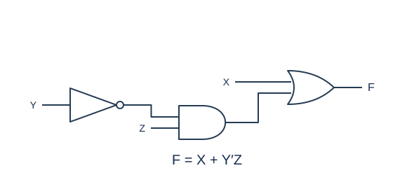

#### Buffer 缓冲器

- **逻辑功能**：$`F=A`$，输入 0 输出 0，输入 1 输出 1。
- **符号**：无输出反相圆圈的三角形。
- **开关实现**：$`V_{CC}`$ 经 A 到 F，F 经 R 接地。

#### NAND 与非门

$`F=\overline{AB}=(A\cdot B)'=(AB)'`$。

| A | B | F |
|---|---|---|
| 0 | 0 | 1 |
| 0 | 1 | 1 |
| 1 | 0 | 1 |
| 1 | 1 | 0 |

开关实现：$`V_{CC}`$ 经上拉电阻 R 到 F；F 经 A、B 两个串联开关接地。

#### NOR 或非门

$`F=\overline{A+B}=(A+B)'`$。

| A | B | F |
|---|---|---|
| 0 | 0 | 1 |
| 0 | 1 | 0 |
| 1 | 0 | 0 |
| 1 | 1 | 0 |

#### XOR 异或（exclusive OR）

同假异真。

| A | B | F |
|---|---|---|
| 0 | 0 | 0 |
| 0 | 1 | 1 |
| 1 | 0 | 1 |
| 1 | 1 | 0 |

```math
F=A\oplus B=\overline AB+A\overline B.
```

开关逻辑为两路并联：一路为 A 与 $`\overline B`$ 串联，另一路为 $`\overline A`$ 与 B 串联。

XOR 性质：

```math
X\oplus0=X,\qquad X\oplus1=\overline X,\qquad X\oplus X=0,
```

```math
X\oplus\overline X=1,\qquad X\oplus\overline Y=\overline{X\oplus Y},\qquad\overline X\oplus Y=\overline{X\oplus Y},
```

```math
X\oplus Y=Y\oplus X,\qquad (X\oplus Y)\oplus Z=X\oplus(Y\oplus Z).
```

#### XNOR 与等效电路

**XNOR**：异或输出再取反，同真异假。

**表示 NOT 的三种方法**，均输出 $`\overline X`$：

- 直接用非门。
- 把 NOR 两个输入均接 X。
- 把 NAND 两个输入均接 X。

**用 OR/NAND gates 画 XOR、XNOR**：输入带反相圈的 OR 门等价于 NAND。令

```math
T=\overline{XY},\quad U=\overline{XT},\quad V=\overline{YT},
```

则 $`X\oplus Y=\overline{UV}`$。XNOR 再在输出后接一级 NOT（可用输入并联的 NAND 实现）。

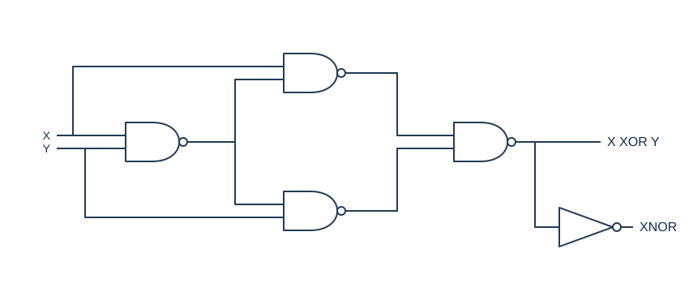

上面输入反相的 OR 门可换成 NAND，电路等效，XOR 用 4 个 NAND，XNOR 再增加 1 个作反相器。

**电路图的等价（德摩根）**：

```math
\overline{XYZ}=\overline X+\overline Y+\overline Z,
```

```math
\overline{X+Y+Z}=\overline X\,\overline Y\,\overline Z.
```

- 输出带反相圈的 **AND**，等价于各输入带反相圈的 **OR**。
- 输出带反相圈的 **OR**，等价于各输入带反相圈的 **AND**。

识图和画图的关键：标注好原始信号和输出信号。

例：$`F_1=X'Y'Z+X'YZ+XY'`$。先生成 $`X',Y'`$；三个 AND 分别生成 $`X'Y'Z,X'YZ,XY'`$，再用 OR 合并。

化简后 $`F_2=X'Z+XY'`$，画两个 AND 分别生成 $`X'Z`$、$`XY'`$，再进 OR。

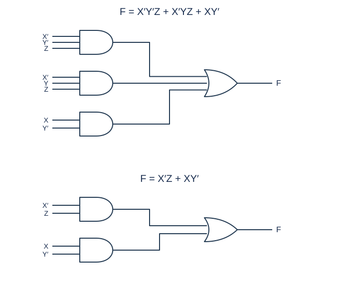

例：$`F=A'B'C'+A'B'C+A'BC`$。可以直接画三个 AND 接一个 OR，也可以先简化再画：

```math
F=A'B'+A'C.
```

画复杂图时先找公因子。化简后的实现为：A 取反、B 取反；两个 AND 分别输出 $`A'B'`$ 和 $`A'C`$，再接 OR。

**XNOR**：$`F=\overline{A\oplus B}=\overline A\,\overline B+AB`$。

| A | B | F |
|---|---|---|
| 0 | 0 | 1 |
| 0 | 1 | 0 |
| 1 | 0 | 0 |
| 1 | 1 | 1 |

开关实现可采用上拉电阻，在 F 到地之间并联 $`A\overline B`$ 与 $`\overline AB`$ 两条串联支路，使输入不同时输出 0。

### 逻辑函数

有限形式的性质：

1. $`(X+Y)+Z=X+(Y+Z)`$；$`(XY)Z=X(YZ)`$。
2. $`X(Y+Z)=XY+XZ`$；$`(X+Y)(X+Z)=X+YZ`$。

3. $`X+XY=X`$；$`X(X+Y)=X`$（吸收原变量）。
4. $`XY+X\overline Y=X`$；$`(X+Y)(X+\overline Y)=X`$。
5. $`XY+\overline XZ+YZ=XY+\overline XZ`$（一致性定理）。多余项 $`YZ`$ 后面再乘任意逻辑因子（如 DEF）也仍可删除。
6. $`X+\overline XY=X+Y`$；$`X(\overline X+Y)=XY`$（吸收反变量）。

推广形式：

1. $`X+X+\cdots+X=X`$；$`X\cdot X\cdots X=X`$。
2. 德摩根：$`(X_1X_2\cdots X_n)'=X_1'+X_2'+\cdots+X_n'`$；$`(X_1+\cdots+X_n)'=X_1'X_2'\cdots X_n'`$。
3. 广义德摩根：函数整体取反时，将每个变量取反、AND 与 OR 互换（以及常数 0、1 互换）。
**香农定理（不考）**：

```math
\begin{aligned} F(X_1,X_2,\ldots,X_n)&=X_1F(1,X_2,\ldots,X_n)+X_1'F(0,X_2,\ldots,X_n)\\ &=[X_1+F(0,X_2,\ldots,X_n)]\,[X_1'+F(1,X_2,\ldots,X_n)]. \end{aligned}
```

展开两个变量（不考）：

```math
\begin{aligned} F(X_1,X_2,\ldots,X_n)={}&X_1X_2F(1,1,\ldots,X_n)\\ &+X_1X_2'F(1,0,\ldots,X_n)\\ &+X_1'X_2F(0,1,\ldots,X_n)\\ &+X_1'X_2'F(0,0,\ldots,X_n). \end{aligned}
```

有原变量时置 1，有反变量时置 0。

香农例（不考）：$`f=ab+cd+a'be`$。

```math
f\vert _{a=0}=0b+cd+0'be=cd+be,
```

```math
f\vert _{a=1}=1b+cd+1'be=b+cd.
```

**The principle of duality 对偶定理**：$`F=XY+ZW`$，其对偶函数 $`F^D=(X+Y)(Z+W)`$。二者互为对偶，但逻辑上不一定等价。法则：乘与加互换，本质为 AND 与 OR 互换；出现的常数 0、1 也互换。

**Complement 补函数，求法一（德摩根法）**：

1. 找对偶函数。
2. 反转每个变量。

例：Find the complement of $`F=A'BC'+A'B'C`$。

1. **对偶函数**：$`F^D=(A'+B+C')(A'+B'+C)`$。
2. **反转每个变量**：$`F'=(A+B'+C)(A+B+C')`$。

求补函数方法二，真值表法：写出真值表，将输出 1、0 互换。

**Minimisation 简化**：

```math
\begin{aligned} F&=A'B'C'+A'B'C+A'BC\\ &=A'B'C'+A'B'C+A'B'C+A'BC\\ &=A'B'+A'C. \end{aligned}
```

把一项拆成两项，利用 $`X+X=X`$，再两两配对，利用 $`XY+X\overline Y=X`$。

例 a：

```math
\begin{aligned} F&=AB'(C+D)+C'D'\\ &=AB'(C'D')'+C'D'\qquad\text{[de Morgan]}\\ &=AB'+C'D'. \end{aligned}
```

注意 $`C+D=(C'D')'`$。

### Minterms & Maxterms

| X | Y | Z | Product term | Symbol | Sum term | Symbol |
|---|---|---|---|---|---|---|
| 0 | 0 | 0 | $`X'Y'Z'`$ | $`m_0`$ | $`X+Y+Z`$ | $`M_0`$ |
| 0 | 0 | 1 | $`X'Y'Z`$ | $`m_1`$ | $`X+Y+Z'`$ | $`M_1`$ |
| 0 | 1 | 0 | $`X'YZ'`$ | $`m_2`$ | $`X+Y'+Z`$ | $`M_2`$ |
| 0 | 1 | 1 | $`X'YZ`$ | $`m_3`$ | $`X+Y'+Z'`$ | $`M_3`$ |
| 1 | 0 | 0 | $`XY'Z'`$ | $`m_4`$ | $`X'+Y+Z`$ | $`M_4`$ |
| 1 | 0 | 1 | $`XY'Z`$ | $`m_5`$ | $`X'+Y+Z'`$ | $`M_5`$ |
| 1 | 1 | 0 | $`XYZ'`$ | $`m_6`$ | $`X'+Y'+Z`$ | $`M_6`$ |
| 1 | 1 | 1 | $`XYZ`$ | $`m_7`$ | $`X'+Y'+Z'`$ | $`M_7`$ |

**性质**：

- $`m_i=\overline{M_i}`$。
- **Minterm** 中 0 对应反变量。
- **Maxterm** 中 1 对应反变量。

给 XYZ 表达式时，先写对应的 0、1，再找 $`m_i/M_i`$。同一个 001 对应下标相同的 $`m_1,M_1`$，但对应的表达式不同。

Sum of minterms 是规范的 sum of products（SOP）。

例：真值表输出为 1 的输入为 000、001、010、100、101，其他为 0。例如 $`m_4`$ 对应 100，$`4=0\times2^0+0\times2^1+1\times2^2`$。

```math
\begin{aligned} F&=X'Y'Z'+X'Y'Z+X'YZ'+XY'Z'+XY'Z\\ &=\Sigma m(0,1,2,4,5)\\ &=X'Y'+X'YZ'+XY'\\ &=Y'+X'YZ'\\ &=Y'+X'Z'. \end{aligned}
```

**Minterm 与 maxterm 对照**（$`F(X,Y,Z)`$ 有 $`2^3`$ 项，编号 0–7）：

| 已知形式 | F 的 minterm 展开 | F 的 maxterm 展开 | F′ 的 minterm 展开 | F′ 的 maxterm 展开 |
|---|---|---|---|---|
| $`F=\Sigma m(3,4,5,6,7)`$ | 同左 | $`\Pi M(0,1,2)`$ | $`\Sigma m(0,1,2)`$ | $`\Pi M(3,4,5,6,7)`$ |
| $`F=\Pi M(0,1,2)`$ | $`\Sigma m(3,4,5,6,7)`$ | 同左 | $`\Sigma m(0,1,2)`$ | $`\Pi M(3,4,5,6,7)`$ |

**题型 1：将逻辑表达式转为规范 SOP（minterm expansion）**。思路：用 $`A+A'`$、$`B+B'`$、$`C+C'`$ 把缺失变量补齐。

```math
\begin{aligned} F(A,B,C)&=A'B'+BC\\ &=A'B'(C+C')+BC(A+A')\\ &=A'B'C+A'B'C'+ABC+A'BC\\ &=\Sigma m(0,1,3,7)\\ &=\Pi M(2,4,5,6). \end{aligned}
```

对应二进制编号分别为 001、000、111、011，最后按数字排序。

**题型 2：转为规范 POS（product of sums / maxterm expansion）**。记住两个公式：

```math
A+BC=(A+B)(A+C),
```

```math
A+B+CC'=(A+B+C)(A+B+C').
```

技巧：$`A+B=A+B+CC'`$，因为 $`CC'=0`$。

例：

```math
\begin{aligned} F(A,B,C)&=A'B'+BC\\ &=(A'B'+B)(A'B'+C)\\ &=(A'+B)(B'+B)(A'+C)(B'+C)\\ &=(A'+B+CC')(A'+C+BB')(B'+C+AA')\\ &=(A'+B+C)(A'+B+C')\\ &\quad\cdot(A'+C+B)(A'+C+B')\\ &\quad\cdot(B'+C+A)(B'+C+A')\\ &=(A'+B+C)(A'+B+C')(A'+B'+C)(A+B'+C)\\ &=\Pi M(2,4,5,6). \end{aligned}
```

去掉重复因子，再用对应真值表找结果为 0 的行检验。

真值表检验：

| A | B | C | F |
|---|---|---|---|
| 0 | 0 | 0 | 1 |
| 0 | 0 | 1 | 1 |
| 0 | 1 | 0 | 0 |
| 0 | 1 | 1 | 1 |
| 1 | 0 | 0 | 0 |
| 1 | 0 | 1 | 0 |
| 1 | 1 | 0 | 0 |
| 1 | 1 | 1 | 1 |

### 逻辑信号

逻辑信号经常用高、低电平区分。

- **Positive logic**：高电平为 1、低电平为 0。
- **Negative logic**：高电平为 0、低电平为 1。

以本课程 5 V 逻辑器件为例：CMOS 输入低电平约 0–1.5 V（L、0），高电平约 3.5–5 V（H、1）。具体阈值取决于器件与供电。

### Logic Families

两种常见逻辑系列：TTL、CMOS。

| 系列（5 V 示例） | 输入低电平 0 | 输入高电平 1 |
|---|---|---|
| CMOS | 0–1.5 V | 3.5–5 V |
| TTL | 0–0.8 V | 2–5 V |

**Noise margin 噪声容限**：在前一级输出最坏的情况下，为保证后一级正常工作所允许的最大噪声幅度。包括高电平向下、低电平向上可容忍的噪声，越大说明抗扰性越好。

```math
V_{NH}=V_{OH(\min)}-V_{IH(\min)},\qquad V_{NL}=V_{IL(\max)}-V_{OL(\max)}.
```

CMOS 电平图中的示例参数：$`V_{OH}=4.4`$ V、$`V_{IH}=3.15`$ V、$`V_{IL}=1.35`$ V、$`V_{OL}=0.1`$ V。

- **High-level noise margin**：$`V_{NH}=4.4-3.15=1.25`$ V。
- **Low-level noise margin**：$`V_{NL}=1.35-0.1=1.25`$ V。

TTL 示例：$`V_{OH}=2.4`$ V、$`V_{IH}=2.0`$ V、$`V_{IL}=0.8`$ V、$`V_{OL}=0.4`$ V，因此高、低电平噪声容限均为 0.4 V。输出电平要能被下一级输入正确接受。

**Fan-in & fan-out 扇入与扇出**：

- **扇入**：单个逻辑门的输入端数量。
- **扇出**：单个逻辑门输出能可靠驱动的同类输入端最大数量。

逻辑表达式与真值表可相互推导；表达式还可写为 $`\Sigma m`$ 或 $`\Pi M`$。

例：输入编号 101 对应 $`m_5=XY'Z`$ 和 $`M_5=X'+Y+Z'`$。同下标的 $`m_i,M_i`$ 对应相同输入组合，但表达式不同，且 $`m_i=\overline{M_i}`$。

## 第三章 Karnaugh Map

定义：卡诺图是真值表的另一种形式。$`n`$ 个变量对应 $`2^n`$ 个格子。

4 变量 Karnaugh map，相邻标签只有 1 位不同：

| AB\CD | 00 | 01 | 11 | 10 |
|---|---|---|---|---|
| 00 | $`m_0`$ | $`m_1`$ | $`m_3`$ | $`m_2`$ |
| 01 | $`m_4`$ | $`m_5`$ | $`m_7`$ | $`m_6`$ |
| 11 | $`m_{12}`$ | $`m_{13}`$ | $`m_{15}`$ | $`m_{14}`$ |
| 10 | $`m_8`$ | $`m_9`$ | $`m_{11}`$ | $`m_{10}`$ |

Karnaugh map 与真值表的联系：输出为真，对应格子填 1；输出为假，对应格子填 0。例如 AND 门只有 $`AB=11`$ 的格子为 1，其余为 0。

3 变量 Karnaugh map：

| X\YZ | 00 | 01 | 11 | 10 |
|---|---|---|---|---|
| 0 | $`m_0`$ | $`m_1`$ | $`m_3`$ | $`m_2`$ |
| 1 | $`m_4`$ | $`m_5`$ | $`m_7`$ | $`m_6`$ |

2 变量图中格子的意义：

| X\Y | 0 | 1 |
|---|---|---|
| 0 | $`m_0=X'Y'`$ | $`m_1=X'Y`$ |
| 1 | $`m_2=XY'`$ | $`m_3=XY`$ |

**根据逻辑表达式画 Karnaugh map**：

### 根据表达式填图

**Sum of minterms**：原变量对应 1、反变量对应 0，定位坐标；有项的坐标写 1，其余写 0。例：$`F=X'Y+XY'+XY`$。

| X\Y | 0 | 1 |
|---|---|---|
| 0 | 0 | 1 |
| 1 | 1 | 1 |

**Product of maxterms**：原变量对应 0、反变量对应 1，定位坐标；有项的坐标写 0，其余写 1。例：$`F=(X'+Y)(X'+Y')`$。

| X\Y | 0 | 1 |
|---|---|---|
| 0 | 1 | 1 |
| 1 | 0 | 0 |

**不是完整的 minterm**，如 $`X'`$、$`XY'`$：利用侧边变量范围填写。

$`F=X'`$：

| X\YZ | 00 | 01 | 11 | 10 |
|---|---|---|---|---|
| 0 | 1 | 1 | 1 | 1 |
| 1 | 0 | 0 | 0 | 0 |

$`F=XY'`$：

| X\YZ | 00 | 01 | 11 | 10 |
|---|---|---|---|---|
| 0 | 0 | 0 | 0 | 0 |
| 1 | 1 | 1 | 0 | 0 |

### 分组规则与化简例题

**根据 Karnaugh map 写化简逻辑表达式**：在图中画圈。

- 用尽可能大的正方形或长方形圈出 $`1,2,4,8,\ldots`$ 个 1。
- 所有 1 都要被圈到，覆盖所需圈数尽可能少。
- 1 可以重复使用。
- 圈可以跨越边界扩展：四角相邻，对边相邻。

始终问自己：“Could we enlarge it?” “Could we delete it?”

- **MSP**：minimal sum of products。
- **Prime implicants（PI，主蕴含项）**：不能再扩大的、格子数为 2 的幂的全 1 分组。

**找实际最小 SOP 的方法**：

1. 先找全部 PI。
2. 从中选取覆盖全部 1 且代价最小的一组。
3. 在项数相同的情况下，继续比较文字数量。

**若要 minimum POS**：圈 0，写和式，再相乘。注意变量取反的规则与圈 1 相反。

例：

| AB\CD | 00 | 01 | 11 | 10 |
|---|---|---|---|---|
| 00 | 1 | 1 | 1 | 1 |
| 01 | 1 | 0 | 0 | 1 |
| 11 | 1 | 0 | 0 | 0 |
| 10 | 1 | 1 | 0 | 0 |

圈 0：行 01、11 与列 01、11 组成一组（$`B=D=1`$），得到 $`B'+D'`$；行 11、10 与列 11、10 组成一组（$`A=C=1`$），得到 $`A'+C'`$。

```math
F=(B'+D')(A'+C').
```

画圈可能不止一种成功画法。

**例 1**：$`F(X,Y,Z)=\Sigma m(3,4,5,6,7)`$。

| X\YZ | 00 | 01 | 11 | 10 |
|---|---|---|---|---|
| 0 | 0 | 0 | 1 | 0 |
| 1 | 1 | 1 | 1 | 1 |

圈整个 $`X=1`$ 行，以及 $`YZ=11`$ 列，得到 $`F=X+YZ`$。布尔代数检验：

```math
\begin{aligned} F&=X'YZ+XY'Z'+XY'Z+XYZ'+XYZ\\ &=XZ(Y'+Y)+XZ'(Y'+Y)+X'YZ\\ &=XZ+XZ'+X'YZ\\ &=X(Z+Z')+X'YZ\\ &=X+X'YZ=X+YZ. \end{aligned}
```

**例 2**：

| X\YZ | 00 | 01 | 11 | 10 |
|---|---|---|---|---|
| 0 | 0 | 1 | 0 | 1 |
| 1 | 0 | 1 | 0 | 1 |

分别圈列 01、列 10，$`F=Y'Z+YZ'`$。

**例 3**：

| WX\YZ | 00 | 01 | 11 | 10 |
|---|---|---|---|---|
| 00 | 0 | 1 | 0 | 1 |
| 01 | 1 | 1 | 0 | 1 |
| 11 | 1 | 1 | 1 | 1 |
| 10 | 0 | 1 | 0 | 1 |

四组：列 01、列 10、整个行 11、行 01/11 与列 00/01 的方块。

```math
F=XY'+Y'Z+YZ'+WX.
```

**例 4**：

| WX\YZ | 00 | 01 | 11 | 10 |
|---|---|---|---|---|
| 00 | 1 | 1 | 0 | 0 |
| 01 | 1 | 1 | 0 | 0 |
| 11 | 0 | 1 | 1 | 0 |
| 10 | 0 | 0 | 1 | 1 |

使用 3 组：左上 4 格、行 11 中列 01/11 两格、行 10 中列 11/10 两格，得到

```math
F=W'Y'+WXZ+WX'Y.
```

若在左上 4 格之外又圈其左侧 2 格，会得到 4 个圈，但额外小圈可删，不是最小覆盖。

**例 5**：

| AB\CD | 00 | 01 | 11 | 10 |
|---|---|---|---|---|
| 00 | 1 | 0 | 1 | 1 |
| 01 | 0 | 1 | 1 | 0 |
| 11 | 0 | 1 | 1 | 1 |
| 10 | 1 | 0 | 1 | 1 |

圈中间 4 格得 BD，整列 11 得 CD，右下 4 格得 AC，四角得 $`B'D'`$，故

```math
F=BD+CD+AC+B'D'.
```

**例 6：边界延伸**。

| AB\CD | 00 | 01 | 11 | 10 |
|---|---|---|---|---|
| 00 | 0 | 1 | 1 | 0 |
| 01 | 1 | 1 | 1 | 1 |
| 11 | 1 | 0 | 1 | 1 |
| 10 | 0 | 0 | 1 | 0 |

可画出的最大组包括 $`A'D,A'B,BC,CD,BD'`$，其中 $`BD'`$ 跨越左右边界。选择 $`A'D,CD,BD'`$ 即可覆盖全部 1：

```math
F=A'D+CD+BD'.
```

**例 7**：$`F(X,Y,Z)=X'+XY'+XYZ'`$。

| X\YZ | 00 | 01 | 11 | 10 |
|---|---|---|---|---|
| 0 | 1 | 1 | 1 | 1 |
| 1 | 1 | 1 | 0 | 1 |

Always ask: Could we enlarge it? 圈上面一整行、左边两列、左右边界两列，得到 3 个 EPI：

```math
F=X'+Y'+Z'.
```

**例 8：没有 EPI**。

| AB\CD | 00 | 01 | 11 | 10 |
|---|---|---|---|---|
| 00 | 0 | 0 | 0 | 0 |
| 01 | 1 | 1 | 0 | 1 |
| 11 | 0 | 1 | 1 | 1 |
| 10 | 0 | 0 | 0 | 0 |

两种最小覆盖：

```math
F=A'BC'+ABD+BCD',
```

```math
F=BC'D+ABC+A'BD'.
```

均为 3 个 PI，NO EPI。Ask：有没有可消去的 PI？

### Essential Prime Implicants（EPIs）

先把所有 PI 画出，此时不要求数量最少，但每个分组必须最大。如果某个 PI 含有至少一个未被其他任何 PI 覆盖的 minterm，则它是 EPI（本质主蕴含项）。EPIs 一定出现在 MSP 中，因为其中存在别的组都不包含的 minterm。

例 4 的图中，左上 4 格为 EPI，因为 $`m_0,m_1,m_4`$ 没有别的组能覆盖；最下行右边 2 格为 EPI，因为 $`m_{10}`$ 没有别的组能覆盖。中间横向 2 格是 PI，可与其他候选 PI 比较后选择。

例 8 的两种覆盖均由 PI 构成，但不存在任何 EPI。

**EPI 的快速判断**：

1. 画最大组，检查重复与能否扩大。
2. 检查每个圈中的每个格子，能否由其他 PI 覆盖。

判断结果：

- 如果整个圈都能被其他 PI 覆盖，它只是**非本质 PI**。
- 若至少一格不能被其他 PI 覆盖，它就是 **EPI**。

### 通过 Karnaugh Map 写 NAND、NOR 式子

**代数方法**。例如：

| X\YZ | 00 | 01 | 11 | 10 |
|---|---|---|---|---|
| 0 | 0 | 1 | 1 | 1 |
| 1 | 1 | 1 | 0 | 0 |

圈左下两格、右上两格、列 01，得

```math
F=XY'+X'Y+Y'Z.
```

两次取反再用德摩根：

```math
F=F''=(XY'+X'Y+Y'Z)''=((XY')'(X'Y)'(Y'Z)')'.
```

这就是两层 NAND 实现。

**图形方法**：$`F=AB+CD`$ 的以下四种实现等价：

1. 两个 AND 输出进入 OR。
2. 在两个 AND 的输出及 OR 的对应输入同时加反相圈，逻辑不变。
3. 把输入带反相圈的 OR 换成 NAND，得到三个 NAND 的两层实现：$`F=((AB)'(CD)')'`$。
4. 用 NOR 构成 AND：$`AB=(A'+B')'`$、$`CD=(C'+D')'`$，两路再经 NOR 后取反，得到相同输出。

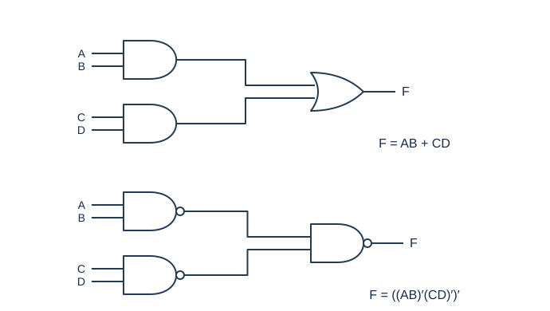

### Don't-care Cases

有一些变量组合是设计者不关心、不会正常出现的，对所需功能没有影响。例如

```math
F(W,X,Y,Z)=\Sigma m(1,3,7,11,15),\qquad d(W,X,Y,Z)=\Sigma m(0,2,5).
```

$`d`$ 表示不关心的组合，在图中记为 x。

- **求 SOP 时**，可把 x 看作 1 以扩大分组；必须优先覆盖真正的 1，留下若干 x 未圈到也可以。
- **求 POS 时**，可把 x 看作 0；必须覆盖真正的 0，留下若干 x 未圈到也可以。

上述 SOP 例子的卡诺图：

| WX\YZ | 00 | 01 | 11 | 10 |
|---|---|---|---|---|
| 00 | x | 1 | 1 | x |
| 01 | 0 | x | 1 | 0 |
| 11 | 0 | 0 | 1 | 0 |
| 10 | 0 | 0 | 1 | 0 |

第一种答案：整列 11 圈为 YZ，第一行利用 x 扩为整行，得到 $`F=YZ+W'X'`$。

第二种答案：整列 11 加上左上部行 00/01、列 01/11 的 4 格，得到 $`F=YZ+W'Z`$。两者在所有指定输入上等价。

**POS 例子**：Design a circuit that will produce output 1 if the BCD input combination is an even number. The BCD input combination 0000 is not allowed to occur. (1) Find the POS using the Karnaugh map. (2) Find the circuit diagram.

0000 记为 x；有效 BCD 中的偶数 2、4、6、8 输出 1；奇数 1、3、5、7、9 输出 0；10–15 不是有效 BCD，记为 x。

| AB\CD | 00 | 01 | 11 | 10 |
|---|---|---|---|---|
| 00 | x | 0 | 0 | 1 |
| 01 | 1 | 0 | 0 | 1 |
| 11 | x | x | x | x |
| 10 | 1 | 0 | x | x |

圈列 01 与 11 的全部 0 和 x，得到 $`F=D'`$。电路只需将 D 接一个 NOT 门，A、B、C 不参与。

### 用 Exclusive-OR 化简

真值表在 001、010、100、111 时输出 1，其余为 0：

| X\YZ | 00 | 01 | 11 | 10 |
|---|---|---|---|---|
| 0 | 0 | 1 | 0 | 1 |
| 1 | 1 | 0 | 1 | 0 |

```math
\begin{aligned} F&=XY'Z'+XYZ+X'Y'Z+X'YZ'\\ &=X(Y'Z'+YZ)+X'(Y'Z+YZ')\\ &=X(Y\oplus Z)'+X'(Y\oplus Z)\\ &=X\oplus Y\oplus Z. \end{aligned}
```

### Timing Hazards and Output Glitches

Hazard：冒险；glitch：毛刺。

**Static-1 hazard 的情形**：

- Differ in only one input variable。
- Both give a 1 output。

若相邻的两个 1 未被同一乘积项覆盖，因不同路径延迟，输出可能短暂从 1 变为 0 再恢复为 1。

**Static-0 hazard 的情形**：

- Differ in only one input variable。
- Both give a 0 output。

若相邻两个 0 未被同一和项覆盖，输出可能短暂从 0 变 1 再回到 0。

解决 timing hazard 的方法：add redundant group，增加冗余分组。

**步骤**：

1. 画 Karnaugh map。
2. 检查相邻格子的转换是否存在静态冒险。
3. 画额外的圈覆盖该转换。

例：$`F=A'B+AC`$。

| A\BC | 00 | 01 | 11 | 10 |
|---|---|---|---|---|
| 0 | 0 | 0 | 1 | 1 |
| 1 | 0 | 1 | 1 | 0 |

当 $`B=C=1`$，A 改变时，两个 1 未被共同的乘积项覆盖，可能产生 static-1 hazard。

增加列 $`BC=11`$ 的冗余圈，得到

```math
F=A'B+AC+BC.
```

这个冗余项消除了上述单输入变化的静态冒险。

## 第四章 时序逻辑电路（Sequential Logic Circuit）

### Sequential Circuit

定义（必考）：A circuit whose outputs depend not only on current inputs, but also on the past sequence of inputs.

Sequential systems 由 combinational circuit 和 some form of memory 组成。

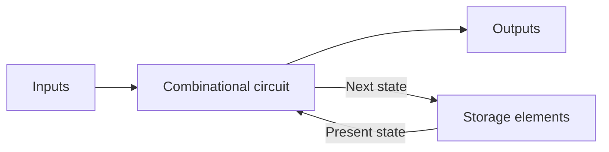
```mermaid
flowchart LR
  I["Inputs"] --> C["Combinational circuit"]
  C --> O["Outputs"]
  C -->|Next state| M["Storage elements"]
  M -->|Present state| C
```

例：traffic lights、elevator controller（电梯控制器）。

**Synchronous & asynchronous 同步与异步**：

- **同步电路**：状态更新按离散的时钟时刻进行。
- **异步电路**：行为取决于输入变化的次序，可以在任意时刻受到影响。

同步电路仍有记忆，其行为仍与当前状态及过去输入有关。

Synchronous: The system's behavior can be defined from the knowledge of its signals at discrete moments in time.

Asynchronous: The behavior depends on the order in which inputs change and can be affected at any instant of time.

**State 状态**：电路内部存储信息的当前取值，通常由存储元件的输出描述。The state of a circuit is described by the values of its storage-element outputs.

**Clock signals 时钟信号**：大多数同步时序电路的 state change 由时钟信号控制。有效方式可能为 active high、active low、rising edge 或 falling edge。

- **Frequency**：$`f=1/T`$。
- **Duty cycle（占空比）**：有效时间 / 周期 $`T`$。

- **高有效时钟**：周期 $`t_{\mathrm{per}}=t_H+t_L`$，频率 $`1/t_{\mathrm{per}}`$，占空比 $`t_H/t_{\mathrm{per}}`$。
- **低有效时钟 `CLK_L`**：有效电平是低，按有效时间定义占空比为 $`t_L/t_{\mathrm{per}}`$。
- **边沿触发**：状态在指定上升沿或下降沿改变。

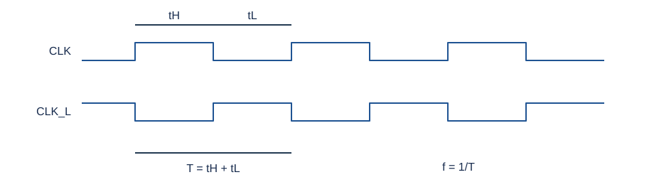

**Synchronous clocked sequential circuit**：组合电路接收 inputs 和 present state，产生 outputs 与 next state；state register 在 clock pulses 控制下更新，并把 present state 反馈给组合电路。

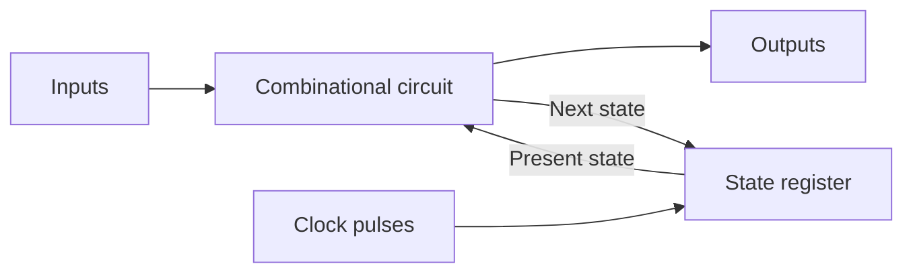
```mermaid
flowchart LR
  I["Inputs"] --> C["Combinational circuit"]
  C --> O["Outputs"]
  C -->|Next state| R["State register"]
  CLK["Clock pulses"] --> R
  R -->|Present state| C
```

**Bistable 双稳态元件**：两个反相器交叉耦合，无外部数据输入，有两个输出 Q、Q_L。$`V_{in2}=V_{out1},V_{in1}=V_{out2}`$。两个稳定状态为 $`(0,1)`$ 和 $`(1,0)`$。

两个反相器的电压传输曲线联立时，有 stable high、stable low 两个稳定交点，以及中间的 metastable（亚稳态）交点。

### Latch 锁存器

**SR latch（NOR 门）**：两个 NOR 交叉耦合。上门输入 R（reset）和下门输出，输出 Q；下门输入 S（set）和 Q，输出 $`Q_N`$。

- **Set**：S 从 0 变 1，置 Q=1。
- **Reset**：R 从 0 变 1，置 Q=0。

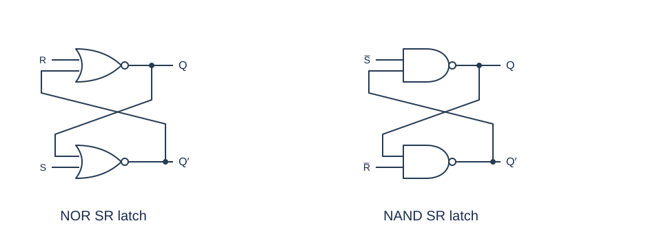

NOR SR latch 真值表：

| S | R | Q | QN | 操作 |
|---|---|---|---|---|
| 0 | 0 | 原 Q | 原 QN | 保持 |
| 0 | 1 | 0 | 1 | Reset |
| 1 | 0 | 1 | 0 | Set |
| 1 | 1 | 0 | 0 | 禁止输入，undefined operation |

保持：output 保持不变。S=R=1 时两输出均为 0，不再互补；若同时释放回 0，可能出现竞争与亚稳态，最终状态不确定。

**SR latch（NAND 门）**：两个 NAND 交叉耦合，输入 $`\overline S,\overline R`$ 低有效。Set：$`\overline S`$ 从 1 变 0；reset：$`\overline R`$ 从 1 变 0。

| S̅ | R̅ | Q | QN | 操作 |
|---|---|---|---|---|
| 0 | 0 | 1 | 1 | 禁止输入，undefined operation |
| 0 | 1 | 1 | 0 | Set |
| 1 | 0 | 0 | 1 | Reset |
| 1 | 1 | 原 Q | 原 QN | 保持 |

### SR Latch with Control Input

带控制 C 的 SR latch：先用两个 NAND 得到 $`\overline{SC}`$、$`\overline{RC}`$，再接低有效 NAND SR latch。C=1 时，外部 S、R 的动作规则与高有效 SR 相同；C=0 时保持。

| S | R | C | Q | QN | 操作 |
|---|---|---|---|---|---|
| 0 | 0 | 1 | 原 Q | 原 QN | 保持 |
| 0 | 1 | 1 | 0 | 1 | Reset |
| 1 | 0 | 1 | 1 | 0 | Set |
| 1 | 1 | 1 | 1 | 1 | Undefined |
| x | x | 0 | 原 Q | 原 QN | 保持 |

使能期间、排除 S=R=1 后的特征方程：$`Q^*=S+\overline RQ`$。$`Q`$ 表示当前状态，$`Q^*`$ 表示下一状态。

### D Latch

D latch 把受控 SR latch 的 S 接 D、R 接 $`\overline D`$，避免 S、R 同时有效。使能 C=1 时特征方程为 $`Q^*=D`$，完整形式为 $`Q^*=CD+\overline CQ`$。

| C | D | Q | QN | 操作 |
|---|---|---|---|---|
| 1 | 0 | 0 | 1 | Reset state |
| 1 | 1 | 1 | 0 | Set state |
| 0 | x | 原 Q | 原 QN | 保持 |

### Flip-flops 触发器

**D-type master-slave flip-flop**：由两个 D latch 串联组成。

**Negative-edge-triggered D flip-flop**：master 的使能接 C，slave 接 $`\overline C`$。

- **C=1 时**：master 跟随 D、slave 保持。
- **C 从 1 降到 0 时**：master 锁住数据，slave 传递 master 的输出 Y 到 Q。
- **Q 只在时钟下降沿附近改变**，特征方程 $`Q^*=D`$（前提 CLK↓）。

| D | CLK | Q | QN |
|---|---|---|---|
| 0 | ↓ | 0 | 1 |
| 1 | ↓ | 1 | 0 |
| x | 稳定 0 | 原 Q | 原 QN |
| x | 稳定 1 | 原 Q | 原 QN |

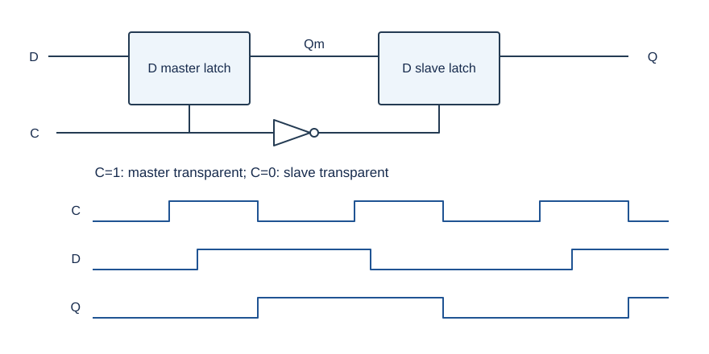

**Positive-edge-triggered D flip-flop**：master 的使能接 $`\overline{CLK}`$，slave 接 CLK；上升沿更新。符号的 CLK 端用三角形表示边沿触发，不带反相圈为上升沿，带反相圈为下降沿。

| D | CLK | Q | QN |
|---|---|---|---|
| 0 | ↑ | 0 | 1 |
| 1 | ↑ | 1 | 0 |
| x | 稳定 0 | 原 Q | 原 QN |
| x | 稳定 1 | 原 Q | 原 QN |

特征方程仍为 $`Q^*=D`$。

### JK Flip-flops

**Master-slave JK flip-flop**：主从型（使用时要注意输入脉冲捕获）。

主从 JK 结构：两个 SR latch 由互补时钟隔离。master 输入 $`S_m=J\overline Q,R_m=KQ`$，master 使能为 C，slave 使能为 $`\overline C`$。master 的 $`Q_m,Q_m'`$ 分别接 slave 的 S、R；slave 输出 Q、QN 反馈到输入逻辑。

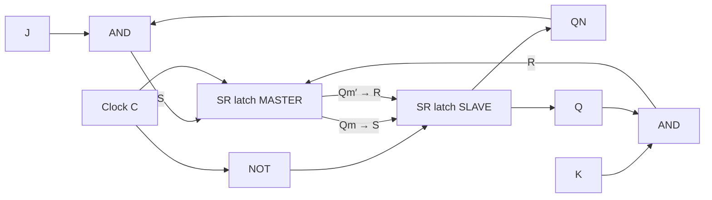
```mermaid
flowchart LR
  J["J"] --> SJ["AND"]
  QN["QN"] --> SJ
  K["K"] --> RK["AND"]
  Q["Q"] --> RK
  SJ -->|S| M["SR latch MASTER"]
  RK -->|R| M
  C["Clock C"] --> M
  C --> N["NOT"]
  N --> S["SR latch SLAVE"]
  M -->|Qm → S| S
  M -->|Qm′ → R| S
  S --> Q
  S --> QN
```

JK 特征方程：

```math
Q^*=J\overline Q+\overline KQ.
```

| J | K | 时钟 | 下一 Q | 下一 QN | 操作 |
|---|---|---|---|---|---|
| x | x | 无有效更新 | 原 Q | 原 QN | 保持 |
| 0 | 0 | 有效时钟 | 原 Q | 原 QN | 保持 |
| 0 | 1 | 有效时钟 | 0 | 1 | Reset |
| 1 | 0 | 有效时钟 | 1 | 0 | Set |
| 1 | 1 | 有效时钟 | 原 QN | 原 Q | 翻转 |

**主从 JK 的波形判断**：

1. 先根据 $`S_m=J\overline Q,R_m=KQ`$ 和受控 SR latch 规则判断 $`Q_m`$。
2. Q 在 CLK 下降沿接收已锁住的 $`Q_m`$，因此变化比 master 延迟。

C=1 时，$`S_mR_m=00`$ 保持、01 复位、10 置位；C=0 时 master 保持。由于 Q 与 QN 互补，正常运行时不会产生 $`S_m=R_m=1`$。

主锁存器在整个有效电平期间都能响应，短暂的 J 或 K 脉冲可能被捕获并保留，产生 “1s catching” 或 “0s catching”。例如 Q=0 时，K 脉冲被反馈屏蔽；Q=1 时，J 脉冲被屏蔽。判断时不能只看外部 JK 在下降沿瞬间的值。

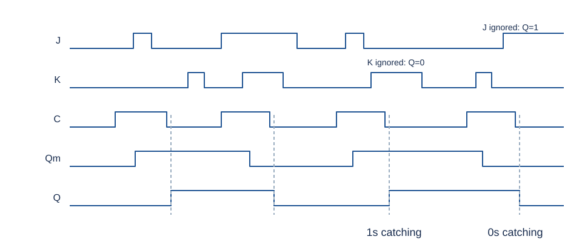

**Edge-triggered JK flip-flop**：边沿触发型（更方便按有效边沿采样）。

可用 D 触发器实现边沿 JK：将 $`D=J\overline Q+\overline KQ`$ 接到 D 端，输出 Q、QN 反馈至该组合逻辑。

| J | K | CLK | Q* | QN* |
|---|---|---|---|---|
| x | x | 稳定 0 或 1 | Q | QN |
| 0 | 0 | ↑ | Q | QN |
| 0 | 1 | ↑ | 0 | 1 |
| 1 | 0 | ↑ | 1 | 0 |
| 1 | 1 | ↑ | QN | Q |

### Toggle Flip-flop（T 触发器）

**在有效边沿**：

- T=1 时，Q 反转。
- T=0 时，Q 不变。

将 JK 触发器的 J、K 连接在一起作为 T，即可转换为 T 触发器。J=K=0（T=0），输出 last Q；J=K=1，输出 changes state。

| CLK | T | Q（原状态） | Q*（新状态） |
|---|---|---|---|
| ↑ | 0 | 0 | 0 |
| ↑ | 0 | 1 | 1 |
| ↑ | 1 | 0 | 1 |
| ↑ | 1 | 1 | 0 |

波形例：四个上升沿处 T 依次为 1、0、1、1，若初始 Q=0，则 Q 依次更新为 1、1、0、1。

规则：只有在 CLK↑ 且 T=1 时 Q 才反转，其余情况 Q 不变。若 CLK 端多了一个反相圈，则把规则中的 ↑ 改成 ↓。

## 第五章 时序电路的分析与设计

### 1. 概述

按输入、输出关系分类：

- **Moore**：输出仅与 current state 有关。
- **Mealy**：输出与 inputs 和 current state 都有关。

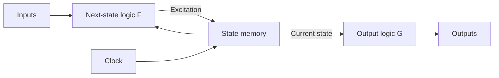
```mermaid
flowchart LR
  X["Inputs"] --> F["Next-state logic F"]
  F -->|Excitation| M["State memory"]
  C["Clock"] --> M
  M -->|Current state| G["Output logic G"]
  M --> F
  G --> Y["Outputs"]
```

上图为 Moore。Mealy 还需把 inputs 直接接入 output logic：

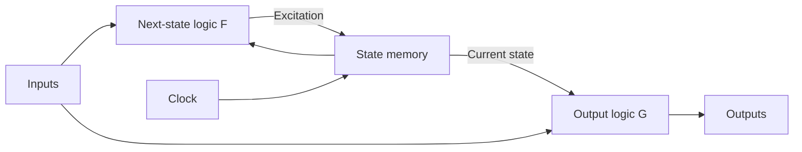
```mermaid
flowchart LR
  X["Inputs"] --> F["Next-state logic F"]
  X --> G["Output logic G"]
  F -->|Excitation| M["State memory"]
  C["Clock"] --> M
  M -->|Current state| G
  M --> F
  G --> Y["Outputs"]
```

A state register with $`n`$ flip-flops has $`2^n`$ possible states。

State Machine Diagram 用状态和有向边描述状态的变化。

时序电路可分成 next-state logic、state memory 和 output logic。输入和 current state 进入组合逻辑，其结果作为触发器的 excitation；触发器在有效时钟条件下更新 current state。

| Device type | Characteristic equation（有效时钟条件下） |
|---|---|
| S-R latch / MS S-R flip-flop | $`Q^*=S+R'Q`$，不允许 $`S=R=1`$ |
| D latch | $`Q^*=D`$（使能有效时） |
| JK latch / MS J-K / ET J-K flip-flop | $`Q^*=JQ'+K'Q`$ |
| ET D flip-flop | $`Q^*=D`$ |
| D flip-flop with enable | $`Q^*=E_ND+E_N'Q`$ |
| T flip-flop（每个有效沿均翻转，$`T=1`$） | $`Q^*=Q'`$ |
| T flip-flop with enable | $`Q^*=E_NQ'+E_N'Q`$ |

只有在有效时钟或有效使能条件下，表中相应的状态更新关系才发生；其余时间保持状态。MS = Master/Slave；ET = Edge-Triggered。

- Next-state logic — excitation equation。

- State memory — characteristic equation。
- Output logic — output equation。

状态可用字母代替二进制编码，例如 $`A=00,\ B=01,\ C=10,\ D=11`$。

### 2. 电路分析步骤

1. Identify 3 main parts：next-state logic、memory、output。
2. 写 excitation equation（输入方程）、characteristic equation（特性方程）、output equation（输出方程）。把输入方程代入特性方程，得到 transition equation（状态转移方程）。
3. 根据状态转移方程画真值表。
4. 将真值表中的二进制序列转换为字母状态。
5. 根据输出方程写出 output，注意 Moore 与 Mealy 的区别。
6. 画 State diagram（状态图，Development Process 图）。

#### 例 1：D flip-flops（Mealy）

电路使用两个同步 D 触发器，状态输出为 $`A,B`$，输入为 $`X`$。

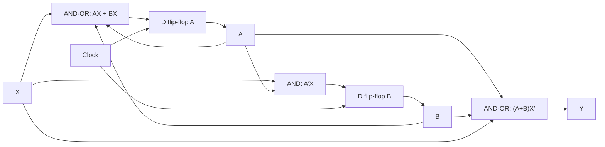
```mermaid
flowchart LR
  X["X"] --> LA["AND-OR: AX + BX"]
  A["A"] --> LA
  B["B"] --> LA
  LA --> DA["D flip-flop A"]
  DA --> A
  X --> LB["AND: A′X"]
  A --> LB
  LB --> DB["D flip-flop B"]
  DB --> B
  A --> LY["AND-OR: (A+B)X′"]
  B --> LY
  X --> LY
  LY --> Y["Y"]
  C["Clock"] --> DA
  C --> DB
```

**Excitation equations：**

```math
D_A=AX+BX,\qquad D_B=A'X.
```

**Output equation：**

```math
Y=(A+B)X'.
```

**Characteristic equation：** $`Q^*=D`$。

**Transition equations：**

```math
A^*=D_A=AX+BX,\qquad B^*=D_B=A'X.
```

$`A^*`$ 是 A next，$`B^*`$ 是 B next。下表按 $`BA`$ 的顺序编码：

| Current state $`BA`$ | $`X=0`$ 时 $`B^*A^*`$ | $`X=1`$ 时 $`B^*A^*`$ |
|---|---|---|
| 00 | 00 | 10 |
| 01 | 00 | 01 |
| 10 | 00 | 11 |
| 11 | 00 | 01 |

例如 $`B=0,A=0,X=0`$ 时，$`B^*A^*=00`$。

Give each numerical state an alphanumeric name：$`00=M,\ 01=N,\ 10=O,\ 11=P`$。Substitute into the Transition Table to form the State Table。

| State | $`X=0`$ 的 next state | $`X=1`$ 的 next state |
|---|---|---|
| M | M | O |
| N | M | N |
| O | M | P |
| P | M | N |

再利用 $`Y=(A+B)X'`$ 计算输出。例如 $`A=B=X=0`$ 时，$`Y=(0+0)\cdot1=0`$。

| State | $`X=0`$：next state, $`Y`$ | $`X=1`$：next state, $`Y`$ |
|---|---|---|
| M | M, 0 | O, 0 |
| N | M, 1 | N, 0 |
| O | M, 1 | P, 0 |
| P | M, 1 | N, 0 |

将表转换成状态图，边上标注 input/output：

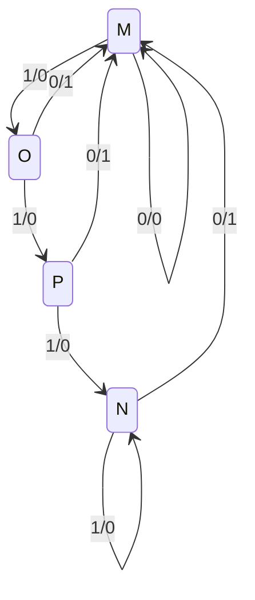
```mermaid
stateDiagram-v2
  M --> M: 0/0
  M --> O: 1/0
  N --> M: 0/1
  N --> N: 1/0
  O --> M: 0/1
  O --> P: 1/0
  P --> M: 0/1
  P --> N: 1/0
```

例如 $`N\xrightarrow{0/1}M`$ 表示：state 从 N 到 M，input $`X=0`$，output $`Y=1`$。

#### 例 2：JK flip-flops（Moore）

电路由两个同步 JK 触发器组成，输入为 $`X,Y`$，状态输出为 $`A,B`$。

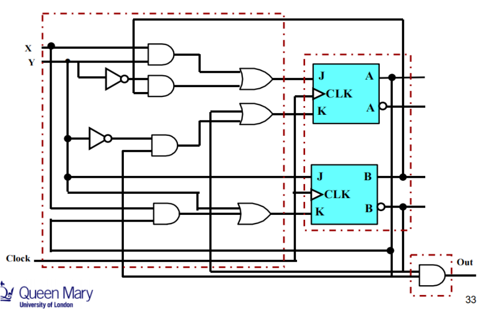

**Excitation (input) equations：**

```math
\begin{aligned} J_A&=XY+Y'B,&K_A&=Y'A+B',\\ J_B&=Y,&K_B&=XA+Y. \end{aligned}
```

**Output equation：** $`\mathrm{OUT}=AB'`$。

**Characteristic equation：** $`Q^*=JQ'+K'Q`$。

**Transition equations：**

```math
\begin{aligned} A^*&=J_AA'+K_A'A\\ &=(XY+Y'B)A'+(Y'A+B')'A\\ &=XYA'+Y'BA'+ABY,\\[3pt] B^*&=J_BB'+K_B'B\\ &=YB'+(XA+Y)'B\\ &=YB'+X'Y'B+Y'A'B. \end{aligned}
```

仍按 $`BA`$ 的顺序编码：

| $`BA`$ | $`XY=00`$ | $`XY=01`$ | $`XY=10`$ | $`XY=11`$ |
|---|---|---|---|---|
| 00 | 00 | 10 | 00 | 11 |
| 01 | 00 | 10 | 00 | 10 |
| 10 | 11 | 00 | 11 | 01 |
| 11 | 10 | 01 | 00 | 01 |

取 $`00=H,\ 01=I,\ 10=J,\ 11=K`$：

| State | $`XY=00`$ | $`XY=01`$ | $`XY=10`$ | $`XY=11`$ | OUT |
|---|---|---|---|---|---|
| H | H | J | H | K | 0 |
| I | H | J | H | J | 1 |
| J | K | H | K | I | 0 |
| K | J | I | H | I | 0 |

这个电路与例 1 不同：例 2 的输出只与 current state 相关，因此 output 只需写一列。

Moore 状态图把 output 写在状态内部，边上只写 input。相同的起点、终点可以合并输入条件。例如 H → H 的 $`XY=00,10`$ 可合并成 $`Y'`$；H → J 的条件为 $`X'Y`$。

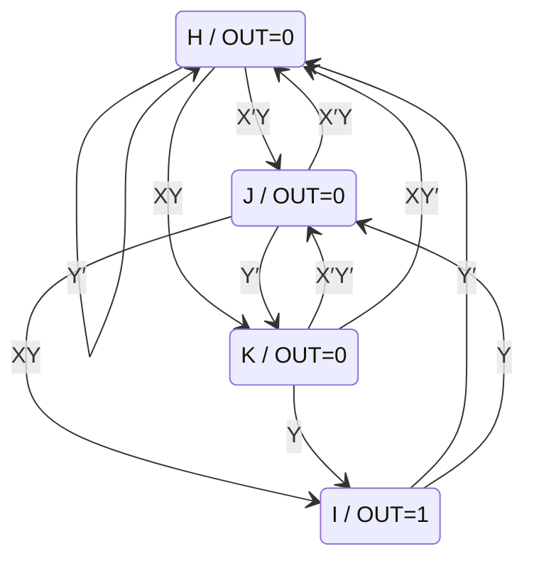
```mermaid
stateDiagram-v2
  state "H / OUT=0" as H
  state "I / OUT=1" as I
  state "J / OUT=0" as J
  state "K / OUT=0" as K
  H --> H: Y′
  H --> J: X′Y
  H --> K: XY
  I --> H: Y′
  I --> J: Y
  J --> K: Y′
  J --> H: X′Y
  J --> I: XY
  K --> J: X′Y′
  K --> I: Y
  K --> H: XY′
```

#### 最高时钟频率

找 feedback 路径中的最大延迟 $`T_D`$。理想化地忽略触发器自身延迟及 setup time 时，时钟周期必须不小于 $`T_D`$，故 $`f_{\max}\le1/T_D`$；实际设计应留余量。

例：假设所有逻辑门的 delay 都是 7 ns，最长反馈路径经过两个门：

```math
T_D=7\ \mathrm{ns}+7\ \mathrm{ns}=14\ \mathrm{ns},\qquad f_{\max}=\frac1{14\ \mathrm{ns}}\approx71.4\ \mathrm{MHz}.
```

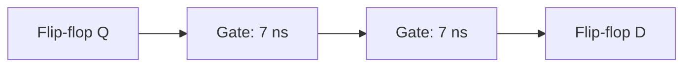
```mermaid
flowchart LR
  Q["Flip-flop Q"] --> G1["Gate: 7 ns"]
  G1 --> G2["Gate: 7 ns"]
  G2 --> D["Flip-flop D"]
```

### 3. 设计自主时序电路（Autonomous sequential circuit）

Moore 结构中，若增加 inputs 到 output logic 的连接，就变成 Mealy；若去掉外部数据输入，便得到 autonomous 电路。时钟信号仍然保留。

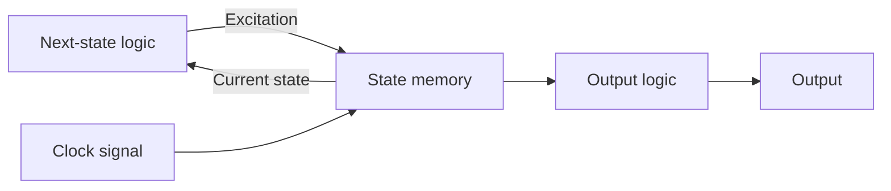
```mermaid
flowchart LR
  F["Next-state logic"] -->|Excitation| M["State memory"]
  M -->|Current state| F
  M --> G["Output logic"]
  C["Clock signal"] --> M
  G --> Y["Output"]
```

#### Example 1：D-type flip-flop

Design an autonomous sequential circuit using D-type flip-flops to generate the following sequence of states：

```math
001\to100\to010\to101\to110\to111\to011\to001.
```

特征方程：$`D_A=Q_A^*`$。

1. **画表。**

   | Present state $`Q_AQ_BQ_C`$ | Next state $`Q_A^*Q_B^*Q_C^*`$ | D inputs $`D_AD_BD_C`$ |
   |---|---|---|
   | 001 | 100 | 100 |
   | 100 | 010 | 010 |
   | 010 | 101 | 101 |
   | 101 | 110 | 110 |
   | 110 | 111 | 111 |
   | 111 | 011 | 011 |
   | 011 | 001 | 001 |

2. **画真值表及 Karnaugh maps。** 组合逻辑的 input 是 present state，output 是 D inputs。未用的状态 000 暂作 don't-care（表中记为 —）。

   $`D_A`$：

   | $`Q_C\backslash Q_AQ_B`$ | 00 | 01 | 11 | 10 |
   |---|---|---|---|---|
   | 0 | — | 1 | 1 | 0 |
   | 1 | 1 | 0 | 0 | 1 |

   第一行中间两格合成 $`Q_BQ_C'`$；第二行左右边界两格合成 $`Q_B'Q_C`$。

   $`\displaystyle Q_A^*=D_A=Q_BQ_C'+Q_B'Q_C=Q_B\oplus Q_C.`$

   $`D_B`$：

   | $`Q_C\backslash Q_AQ_B`$ | 00 | 01 | 11 | 10 |
   |---|---|---|---|---|
   | 0 | — | 0 | 1 | 1 |
   | 1 | 0 | 0 | 1 | 1 |

   右侧四格一组：$`Q_B^*=D_B=Q_A`$。

   $`D_C`$：

   | $`Q_C\backslash Q_AQ_B`$ | 00 | 01 | 11 | 10 |
   |---|---|---|---|---|
   | 0 | — | 1 | 1 | 0 |
   | 1 | 0 | 1 | 1 | 0 |

   中间四格一组：$`Q_C^*=D_C=Q_B`$。

3. **画电路。** 三个 D 触发器共用时钟，A 的输出接 B 的 D 输入，B 的输出接 C 的 D 输入；B、C 的输出经过 XOR 反馈到 A 的 D 输入。

   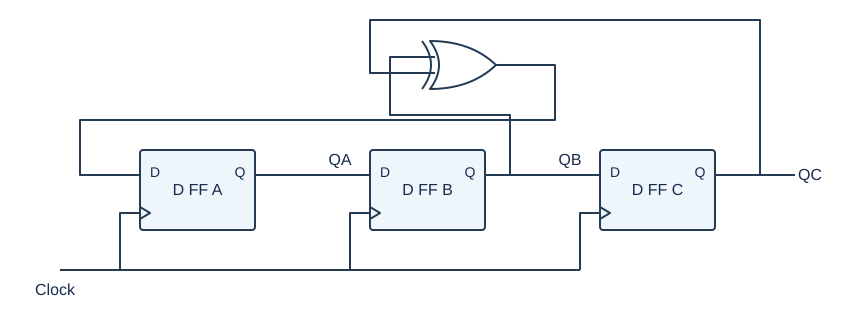

#### Example 2：JK flip-flop

Design a 6-state counter using the first six binary numbers. Use JK flip-flops。

$`2^3=8\ge6`$，使用 3 个 JK flip-flops。

1. **根据 JK 的工作表，得到 excitation table，再填写状态转换表。**

   | J | K | Clock | Q | Q′ |
   |---|---|---|---|---|
   | X | X | 0 | last Q | last Q′ |
   | X | X | 1（无有效沿） | last Q | last Q′ |
   | 0 | 0 | ↑ | last Q | last Q′ |
   | 0 | 1 | ↑ | 0 | 1 |
   | 1 | 0 | ↑ | 1 | 0 |
   | 1 | 1 | ↑ | last Q′ | last Q |

   | Prev Q → Next Q | J | K |
   |---|---|---|
   | 0 → 0 | 0 | X |
   | 0 → 1 | 1 | X |
   | 1 → 0 | X | 1 |
   | 1 → 1 | X | 0 |

   | Present $`Q_AQ_BQ_C`$ | Next $`Q_A^*Q_B^*Q_C^*`$ | $`J_AK_A`$ | $`J_BK_B`$ | $`J_CK_C`$ |
   |---|---|---|---|---|
   | 000 | 001 | 0X | 0X | 1X |
   | 001 | 010 | 0X | 1X | X1 |
   | 010 | 011 | 0X | X0 | 1X |
   | 011 | 100 | 1X | X1 | X1 |
   | 100 | 101 | X0 | 0X | 1X |
   | 101 | 000 | X1 | 0X | X1 |
   | 110 | — | — | — | — |
   | 111 | — | — | — | — |

   题目只要求 6 个状态，最后两行的转换未指定，可暂作 don't-care；若要求自启动，需要另行检查非法状态的去向。

2. **每次取一个 JK input，例如 $`J_A,K_A,J_B,K_B`$，作为组合逻辑的 output，以 present state $`Q_A,Q_B,Q_C`$ 作为 input，画 Karnaugh map 并圈组。空值也作为 X。**

   下面所有 K-map 的列都是 $`Q_AQ_B=00,01,11,10`$，行都是 $`Q_C=0,1`$：

   | 函数 | $`Q_C=0`$ 四格 | $`Q_C=1`$ 四格 | 圈组与结果 |
   |---|---|---|---|
   | $`J_A`$ | 0, 0, —, X | 0, 1, —, X | 第二行中间两格：$`J_A=Q_BQ_C`$ |
   | $`K_A`$ | X, X, —, 0 | X, X, —, 1 | 第二行四格：$`K_A=Q_C`$ |
   | $`J_B`$ | 0, X, —, 0 | 1, X, —, 0 | 第二行左侧两格：$`J_B=Q_A'Q_C`$ |
   | $`K_B`$ | X, 0, —, X | X, 1, —, X | 第二行四格：$`K_B=Q_C`$ |
   | $`J_C`$ | 1, 1, —, 1 | X, X, —, X | 全部八格：$`J_C=1`$ |
   | $`K_C`$ | X, X, —, X | 1, 1, —, 1 | 全部八格：$`K_C=1`$ |

3. **画电路图。** 三个 JK 触发器共用时钟，各输入按化简式连接：

   ```mermaid
   flowchart LR
     QA["Q_A"] --> N["NOT"]
     N --> GB["AND"]
     QC["Q_C"] --> GB
     GB -->|J_B| B["JK flip-flop B"]
     QB["Q_B"] --> GA["AND"]
     QC --> GA
     GA -->|J_A| A["JK flip-flop A"]
     QC -->|K_A| A
     QC -->|K_B| B
     ONE["Logic 1"] -->|J_C and K_C| C["JK flip-flop C"]
     CLK["Clock"] --> A
     CLK --> B
     CLK --> C
     A --> QA
     B --> QB
     C --> QC
   ```

#### Example 3：T flip-flop

表的画法与 example 2 稍有不同。规则：$`T=1`$ 时 $`Q`$ 反转，$`T=0`$ 时 $`Q`$ 不反转，即 $`T=Q\oplus Q^*`$。

| Present $`Q_AQ_BQ_C`$ | Next $`Q_A^*Q_B^*Q_C^*`$ | $`T_A`$ | $`T_B`$ | $`T_C`$ |
|---|---|---|---|---|
| 000 | 001 | 0 | 0 | 1 |
| 001 | 010 | 0 | 1 | 1 |
| 010 | 011 | 0 | 0 | 1 |
| 011 | 100 | 1 | 1 | 1 |
| 100 | 101 | 0 | 0 | 1 |
| 101 | 000 | 1 | 0 | 1 |
| 110 | — | — | — | — |
| 111 | — | — | — | — |

## Digital Systems

### 1. Buses

Bus：a set of two or more electrical conductors representing a binary value。

例如 4-bit bus 的四根导线分别为 +V、+V、0 V、+V，表示二进制数 1101。Bus often has more than just a one-to-one connection。

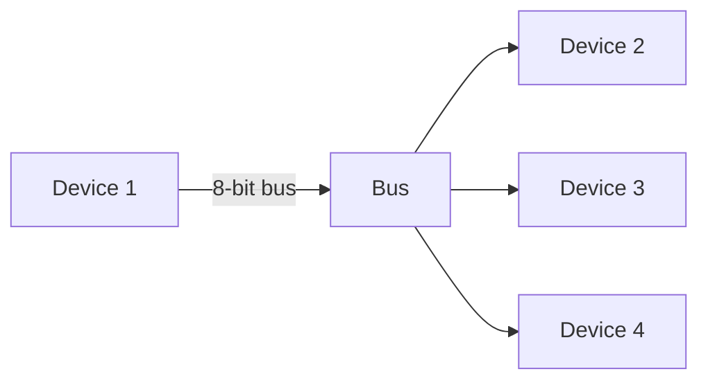
```mermaid
flowchart LR
  D1["Device 1"] -->|8-bit bus| BUS["Bus"]
  BUS --> D2["Device 2"]
  BUS --> D3["Device 3"]
  BUS --> D4["Device 4"]
```

### 2. Selectors

#### 2-input selector

| $`S_0`$ | Output |
|---|---|
| 0 | $`I_0`$ |
| 1 | $`I_1`$ |

```math
Y=S_0'I_0+S_0I_1.
```

#### 4-input selector

```math
Y=S_1'S_0'I_0+S_1'S_0I_1+S_1S_0'I_2+S_1S_0I_3.
```

四个 AND 门分别选择一条输入线，其结果送入 OR 门。

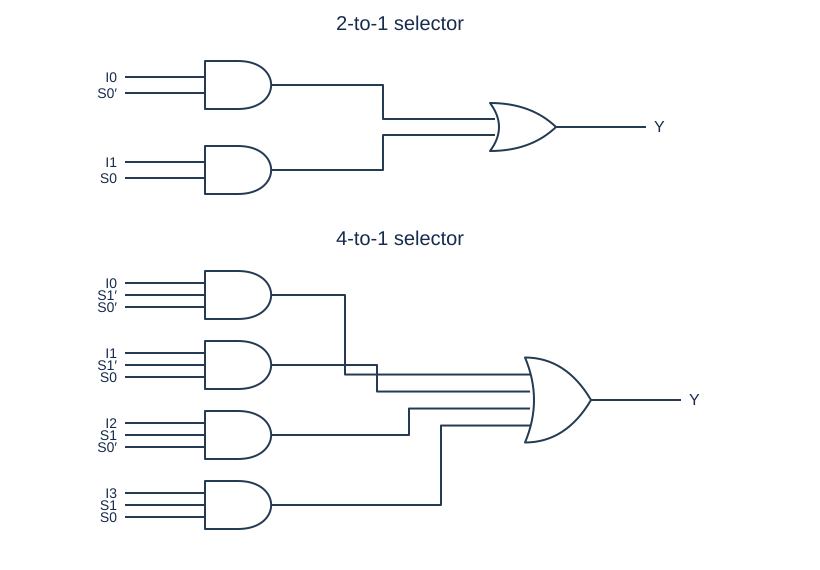

| $`S_1`$ | $`S_0`$ | Output |
|---|---|---|
| 0 | 0 | $`I_0`$ |
| 0 | 1 | $`I_1`$ |
| 1 | 0 | $`I_2`$ |
| 1 | 1 | $`I_3`$ |

### 3. Multiplexers

**2-input 4-bit MUX — Internal implementation：** 四个二选一 selector 并排组成，所有 selector 共用选择信号 $`S`$。

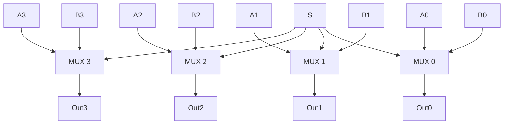
```mermaid
flowchart TB
  A3["A3"] --> M3["MUX 3"]
  B3["B3"] --> M3
  A2["A2"] --> M2["MUX 2"]
  B2["B2"] --> M2
  A1["A1"] --> M1["MUX 1"]
  B1["B1"] --> M1
  A0["A0"] --> M0["MUX 0"]
  B0["B0"] --> M0
  S["S"] --> M3
  S --> M2
  S --> M1
  S --> M0
  M3 --> O3["Out3"]
  M2 --> O2["Out2"]
  M1 --> O1["Out1"]
  M0 --> O0["Out0"]
```

- $`S=0`$：输出 $`A_3,A_2,A_1,A_0`$。
- $`S=1`$：输出 $`B_3,B_2,B_1,B_0`$。

### 4. Decoder

- **Function**：Converts $`n`$ bits of binary information into $`2^n`$ output lines。
- **Output**：Outputs 1 on the wire corresponding to the binary number represented by the inputs。
- **线数**：输入侧有 $`n`$ 根线，输出侧有 $`2^n`$ 根线。

2-to-4 decoder：

```math
D_0=A_1'A_0',\quad D_1=A_1'A_0,\quad D_2=A_1A_0',\quad D_3=A_1A_0.
```

| $`A_1`$ | $`A_0`$ | $`D_3`$ | $`D_2`$ | $`D_1`$ | $`D_0`$ |
|---|---|---|---|---|---|
| 0 | 0 | 0 | 0 | 0 | 1 |
| 0 | 1 | 0 | 0 | 1 | 0 |
| 1 | 0 | 0 | 1 | 0 | 0 |
| 1 | 1 | 1 | 0 | 0 | 0 |

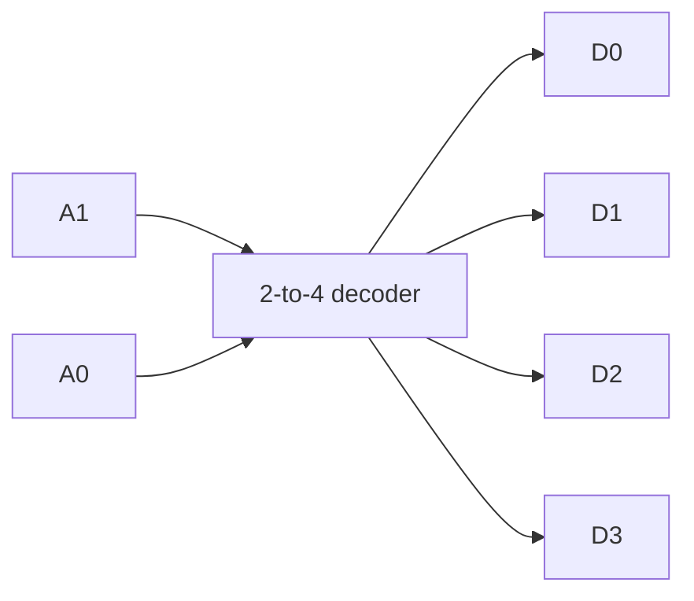
```mermaid
flowchart LR
  A1["A1"] --> DEC["2-to-4 decoder"]
  A0["A0"] --> DEC
  DEC --> D0["D0"]
  DEC --> D1["D1"]
  DEC --> D2["D2"]
  DEC --> D3["D3"]
```

### 5. Magnitude Comparator（XNOR）

大小比较器：判断相等时使用 XNOR 门，即 XOR 的反。

#### 一位比较

方法：画真值表，找逻辑表达式。

```math
\mathrm{EQ}=(X'Y+XY')'=XY+X'Y'.
```

| X | Y | EQ |
|---|---|---|
| 0 | 0 | 1 |
| 0 | 1 | 0 |
| 1 | 0 | 0 |
| 1 | 1 | 1 |

- 判断 $`X\gt Y`$：$`F=XY'`$。
- 判断 $`X\lt Y`$：$`F=X'Y`$。
- 判断 $`X\ge Y`$：$`F=X+Y'`$。
- 判断 $`X\le Y`$：$`F=X'+Y`$。

#### 多位比较

For more than 1-bit comparisons, the XNORs are ANDed together。比较两组 2-bit 数据时，必须 $`A_0=B_0`$ 与 $`A_1=B_1`$ 同时成立，output 才为 1。

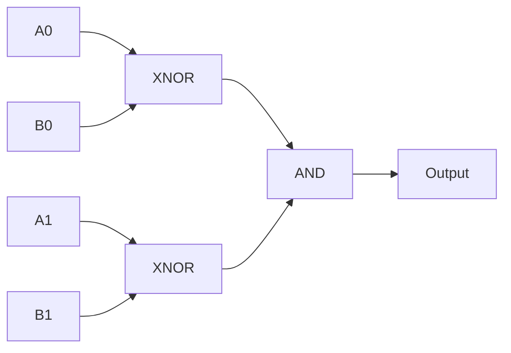
```mermaid
flowchart LR
  A0["A0"] --> E0["XNOR"]
  B0["B0"] --> E0
  A1["A1"] --> E1["XNOR"]
  B1["B1"] --> E1
  E0 --> AND["AND"]
  E1 --> AND
  AND --> O["Output"]
```

Exercise：Show that output of the above 2-bit comparator is given by

```math
(A_0B_0+A_0'B_0')(A_1B_1+A_1'B_1').
```

### 6. Adders — the Half-adder

二进制加法：$`X+Y`$ 得到进位 $`C`$ 与和位 $`S`$。

| X | Y | C | S |
|---|---|---|---|
| 0 | 0 | 0 | 0 |
| 0 | 1 | 0 | 1 |
| 1 | 0 | 0 | 1 |
| 1 | 1 | 1 | 0 |

$`S`$ 的 K-map（行 X=0,1，列 Y=0,1）为 $`\begin{smallmatrix}0&1\\1&0\end{smallmatrix}`$；$`C`$ 的 K-map 为 $`\begin{smallmatrix}0&0\\0&1\end{smallmatrix}`$。因此

```math
S=XY'+X'Y=X\oplus Y,\qquad C=XY.
```

**Half-adder NAND gate implementation：** 用前述四个 NAND 门实现 $`S=X\oplus Y`$；中间节点 $`(XY)'`$ 再经过反相，得到 $`C=XY`$。反相也可用两个输入短接的 NAND 门实现。

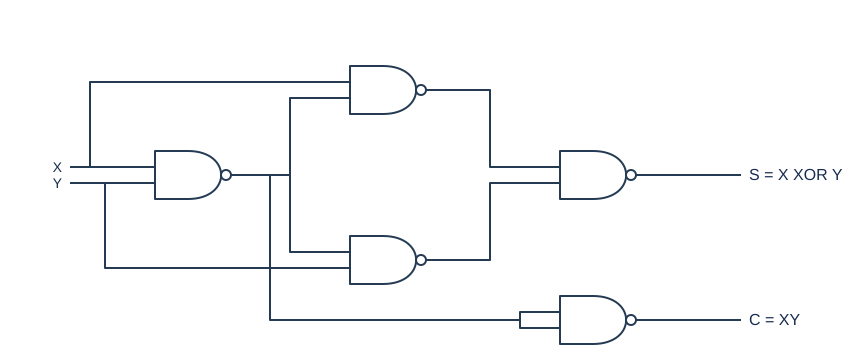

### 7. Full Adder（带之前的进位）

- $`C_{\mathrm{in}}`$：之前的进位。
- $`C_{\mathrm{out}}`$：自己计算之后给下一位的进位。

全加器有三个输入 $`X,Y,C_{\mathrm{in}}`$，两个输出 $`S,C_{\mathrm{out}}`$：

```math
S=X\oplus Y\oplus C_{\mathrm{in}},\qquad C_{\mathrm{out}}=XY+XC_{\mathrm{in}}+YC_{\mathrm{in}}.
```

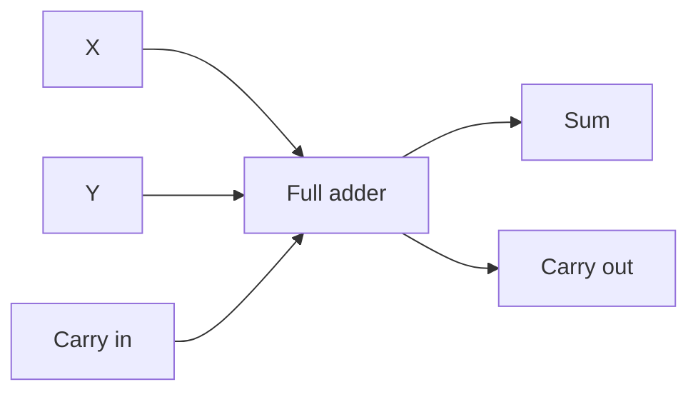
```mermaid
flowchart LR
  X["X"] --> FA["Full adder"]
  Y["Y"] --> FA
  CI["Carry in"] --> FA
  FA --> S["Sum"]
  FA --> CO["Carry out"]
```

| $`C_{\mathrm{in}}`$ | X | Y | S | $`C_{\mathrm{out}}`$ |
|---|---|---|---|---|
| 0 | 0 | 0 | 0 | 0 |
| 0 | 0 | 1 | 1 | 0 |
| 0 | 1 | 0 | 1 | 0 |
| 0 | 1 | 1 | 0 | 1 |
| 1 | 0 | 0 | 1 | 0 |
| 1 | 0 | 1 | 0 | 1 |
| 1 | 1 | 0 | 0 | 1 |
| 1 | 1 | 1 | 1 | 1 |

$`C_{\mathrm{out}}`$ 的 K-map：

| $`C_{\mathrm{in}}\backslash XY`$ | 00 | 01 | 11 | 10 |
|---|---|---|---|---|
| 0 | 0 | 0 | 1 | 0 |
| 1 | 0 | 1 | 1 | 1 |

圈三组相邻的两个 1：第三列上下两格、第二行中间两格、第二行右侧两格。因此 $`C_{\mathrm{out}}=XY+C_{\mathrm{in}}Y+C_{\mathrm{in}}X`$。

$`S`$ 的 K-map：

| $`C_{\mathrm{in}}\backslash XY`$ | 00 | 01 | 11 | 10 |
|---|---|---|---|---|
| 0 | 0 | 1 | 0 | 1 |
| 1 | 1 | 0 | 1 | 0 |

四个 1 都是单格：

```math
S=C_{\mathrm{in}}'X'Y+C_{\mathrm{in}}'XY'+C_{\mathrm{in}}X'Y'+C_{\mathrm{in}}XY.
```

**用两个 half-adders 组成一个 full adder**：

1. 第一个 HA 计算 $`X,Y`$，得到 $`C_1=XY`$ 和 $`S_1=X\oplus Y`$。
2. 第二个 HA 计算 $`S_1,C_{\mathrm{in}}`$，得到 $`S=X\oplus Y\oplus C_{\mathrm{in}}`$ 和 $`C_2=(X\oplus Y)C_{\mathrm{in}}`$。
3. 两个 carry 经 OR 输出。

输出公式：

```math
C_{\mathrm{out}}=C_1+C_2=XY+(X\oplus Y)C_{\mathrm{in}}=XY+C_{\mathrm{in}}X+C_{\mathrm{in}}Y.
```

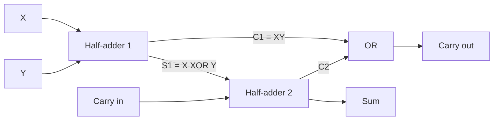
```mermaid
flowchart LR
  X["X"] --> H1["Half-adder 1"]
  Y["Y"] --> H1
  H1 -->|S1 = X XOR Y| H2["Half-adder 2"]
  CI["Carry in"] --> H2
  H1 -->|C1 = XY| O["OR"]
  H2 -->|C2| O
  H2 --> S["Sum"]
  O --> CO["Carry out"]
```

只用 NAND 门的实现，本质上也是两个带 carry 输出的 XOR / half-adder：

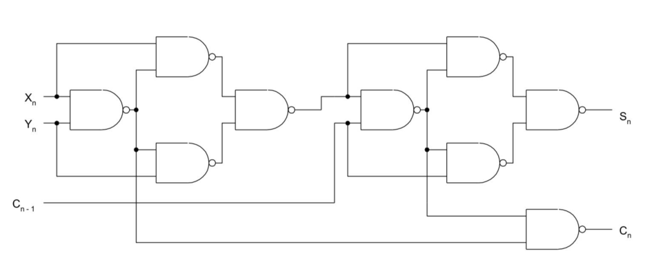

#### 4-bit Parallel Adder

四个 full adders 串联进位。第 $`i`$ 位输入 $`N1(i),N2(i)`$，输出 $`\mathrm{SUM}(i)`$；低位的 carry out 接高位的 carry in。

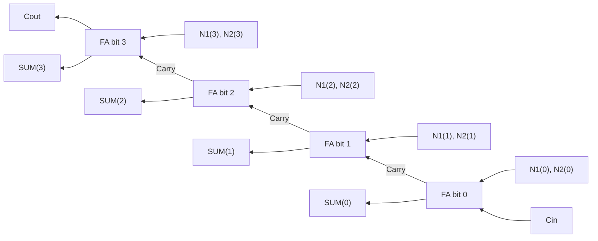
```mermaid
flowchart RL
  CIN["Cin"] --> F0["FA bit 0"]
  F0 -->|Carry| F1["FA bit 1"]
  F1 -->|Carry| F2["FA bit 2"]
  F2 -->|Carry| F3["FA bit 3"]
  F3 --> COUT["Cout"]
  N0["N1(0), N2(0)"] --> F0
  N1["N1(1), N2(1)"] --> F1
  N2["N1(2), N2(2)"] --> F2
  N3["N1(3), N2(3)"] --> F3
  F0 --> S0["SUM(0)"]
  F1 --> S1["SUM(1)"]
  F2 --> S2["SUM(2)"]
  F3 --> S3["SUM(3)"]
```

Delay caused by carry outputs at each stage：进位从低位向高位逐级传播，形成 ripple delay。

**四位加法器的模块接口**：

- **输入**：两个 4-bit 输入 N1、N2，一个 Cin。
- **输出**：一个 4-bit Sum 和一个 Cout。

#### 4-bit Ripple Subtractor using Adders

用二进制补码实现：

```math
N1-N2=N1+(-N2)=N1+(\overline{N2}+1).
```

1. Invert：N2 每一位取反。
2. Add 1：最低位 Cin 设为 1。

如需计算 $`N1-N2-B_{\mathrm{in}}`$，最低位的加法器 Cin 接 $`\overline{B_{\mathrm{in}}}`$；最终 borrow out 为最高位 carry out 的反，即 $`B_{\mathrm{out}}=\overline{C_{\mathrm{out}}}`$。

#### 4-bit Adder/Subtractor

利用

```math
X\oplus0=X,\qquad X\oplus1=X'.
```

N2 的每位先与 Control 做 XOR，再进入全加器；最低位的进位根据加/减模式选择。没有外部进位、借位时，直接令最低位 $`C_0=\mathrm{Control}`$。

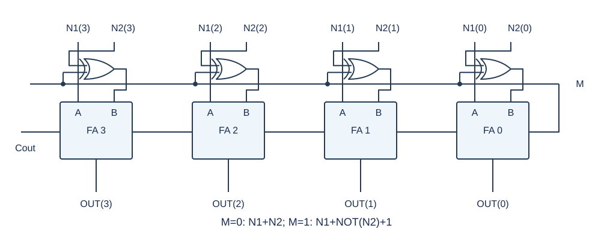

- Control = 0 ⇒ Adder。
- Control = 1 ⇒ Subtractor。

例：$`5-2`$。

```math
0101+\overline{0010}+1=0101+1101+1=1\,0011.
```

逐位运算（从最低位开始）：

| 位 | N1 | N2 取反后 | Carry in | Sum | Carry out |
|---|---|---|---|---|---|
| 0 | 1 | 1 | 1 | 1 | 1 |
| 1 | 0 | 0 | 1 | 1 | 0 |
| 2 | 1 | 1 | 0 | 0 | 1 |
| 3 | 0 | 1 | 1 | 0 | 1 |

保留 4 位结果 0011，即 3；最高位 carry = 1，表示无借位。

| Control | Output function |
|---|---|
| 0 | Add：N1 + N2 |
| 1 | Subtract：N1 − N2 |

- **模块输入**：两个 4-bit 数 N1、N2、Control 和进位/借位输入。
- **模块输出**：4-bit Output 和进位/借位标志。

### 8. An Arithmetic Unit

一个 4-bit MUX 在常数 0001 与 B 之间选择，由 $`C_0`$ 控制；其结果与 A 送入 adder/subtractor，由 $`C_1`$ 控制加减。

| $`C_1`$ | $`C_0`$ | Arithmetic function |
|---|---|---|
| 0 | 0 | A + 1 |
| 0 | 1 | A + B |
| 1 | 0 | A − 1 |
| 1 | 1 | A − B |

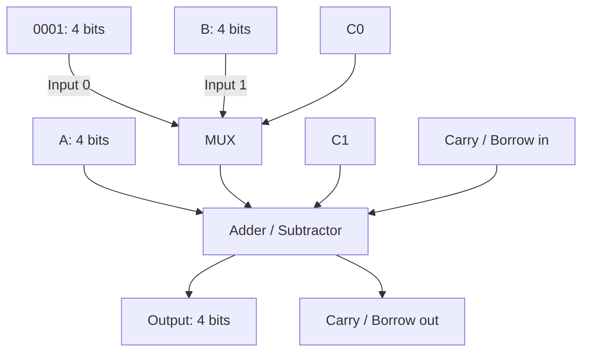
```mermaid
flowchart TB
  ONE["0001: 4 bits"] -->|Input 0| M["MUX"]
  B["B: 4 bits"] -->|Input 1| M
  C0["C0"] --> M
  A["A: 4 bits"] --> AS["Adder / Subtractor"]
  M --> AS
  C1["C1"] --> AS
  CI["Carry / Borrow in"] --> AS
  AS --> O["Output: 4 bits"]
  AS --> CO["Carry / Borrow out"]
```

把以上结构合成一个 Arithmetic unit，其控制输入为两位 $`C_1C_0`$。

## 最后一章 Memories Overview & Microcomputer

### 1. 存储器概述

- **ROM（non-volatile）**：非易失性只读存储器，关闭电源后内容仍保留。
- **RAM（volatile）**：通常指易失性的读写存储器，关闭电源后内容丢失。
- Both ROM and RAM are random-access：都可随机存取。

RAM 分类：

- Static RAM（SRAM）：用晶体管组成的双稳态电路保存状态。
- Dynamic RAM（DRAM）：用 capacitor 的电荷保存状态，需要刷新。

### 2. ROM（Read Only Memory）

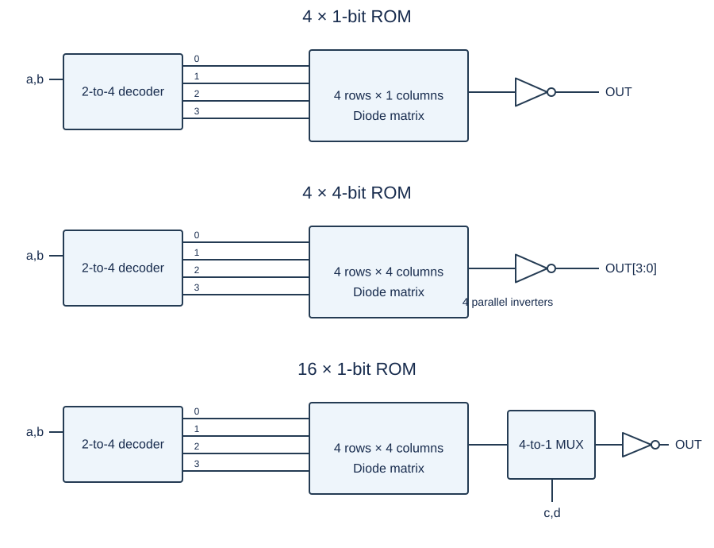

在 16×1-bit 例子中，$`a,b,c,d`$ 都是地址输入：

- $`a,b`$ → decoder：选横线（行）。
- $`c,d`$ → selector：选竖线（列）。
- 被选中的 decoder 输出为低电平。有二极管的交点把相应列拉低至 0；没有二极管的列由电阻上拉为 1。
- 注意 output 端的 NOT：最后有二极管 → 输出 1；无二极管 → 输出 0。

#### 判断 ROM 是多少 × 多少

对于 $`m\times n`$ ROM：

```math
m=2^{\text{地址输入位数}},\qquad n=\text{数据输出位数}.
```

交点阵列的总容量为 $`m\times n`$ bits，可用来检查；有行、列选择器时，阵列的几何行列数不一定直接等于字数和字长。

三个例子：

| 组织方式 | 地址输入 | 输出 | 阵列及选择 |
|---|---|---|---|
| 4×1-bit | a,b（2 位） | 1 位 | 2-to-4 decoder，4 行×1 列，末端反相 |
| 4×4-bit | a,b（2 位） | 4 位 | 2-to-4 decoder，4 行×4 列，每列末端反相 |
| 16×1-bit | a,b,c,d（4 位） | 1 位 | a,b 选 4 行之一；c,d 经 4-to-1 selector 选 4 列之一，末端反相 |

三个示例的二极管配置如下（表中 1 表示安装二极管，也就是末端反相后的输出 1）：

| Decoder 选中行 | 4×1 输出 | 4×4 输出（左到右 y3,y2,y1,y0） | 16×1 按 selector 0,1,2,3 选择所得输出 |
|---|---|---|---|
| 0 | 0 | 0100 | 0, 1, 0, 0 |
| 1 | 1 | 1111 | 1, 1, 1, 1 |
| 2 | 1 | 1001 | 1, 0, 0, 1 |
| 3 | 0 | 0011 | 0, 0, 1, 1 |

### 3. Memory Sizes

Careful! 课程中的存储容量采用二进制计数，1 K = 1024 = $`2^{10}`$，不是 SI 的 1000。现代明确的二进制单位写作 KiB、MiB 等；题目若使用 KB、MB，应先确认其约定。

| Term（课程常用写法） | 二进制约定 | SI 十进制 |
|---|---|---|
| Kilobyte (KB) | $`2^{10}`$ bytes | $`10^3`$ bytes |
| Megabyte (MB) | $`2^{20}`$ bytes | $`10^6`$ bytes |
| Gigabyte (GB) | $`2^{30}`$ bytes | $`10^9`$ bytes |
| Terabyte (TB) | $`2^{40}`$ bytes | $`10^{12}`$ bytes |
| Petabyte (PB) | $`2^{50}`$ bytes | $`10^{15}`$ bytes |
| Exabyte (EB) | $`2^{60}`$ bytes | $`10^{18}`$ bytes |
| Zettabyte (ZB) | $`2^{70}`$ bytes | $`10^{21}`$ bytes |
| Yottabyte (YB) | $`2^{80}`$ bytes | $`10^{24}`$ bytes |

### 4. ROM Technologies

- Mask ROM — programmed in manufacture。
- PROM — Programmable ROM。
- EPROM — Erasable PROM。
- EEPROM — Electrically Erasable PROM。

#### 例 1：概念解释

Explain what is meant by each of the following terms：Non-volatile、Random Access、DRAM、EPROM。

1. **Non-volatile：** Non-volatile memory keeps its contents even if there is no power to the device.
2. **Random Access：** All memory contents can be accessed in the same time as each other.
3. **DRAM：** Dynamic Random Access Memory. Compact type of memory, but relatively slow. Uses a capacitor to store its state. DRAMs need to be refreshed periodically to retain their charge.
4. **EPROM：** Erasable Programmable Read Only Memory. Programmed by the user using a programming device. Contents can be erased, and the chip reprogrammed.

#### 例 2：各个名词的计算

Suppose we have a computer with 256 MBytes of memory, with each memory chip having a capacity of 4 MBytes。

1. How many memory chips are required？$`256/4=64`$ chips。
2. How many address bits are required？$`\log_2(256\times2^{20})=\log_2(2^{28})=28`$ bits。
3. How many bits are required to select the memory chips？$`\log_2 64=6`$ bits。
4. Draw a block diagram of a circuit using a decoder so that all 256 MBytes of memory can be addressed。

   使用 6-to-64 decoder：高 6 位选择芯片，其余 22 位选择被选芯片内部的 memory location。4 MBytes = $`2^{22}`$ bytes；这里寻址的是每个存储位置（按 byte），不是 individual bits。

   ```mermaid
   flowchart LR
     A["28-bit address"] -->|High 6 bits| DEC["6-to-64 decoder"]
     A -->|Low 22 bits| ADDR["Address inputs of all chips"]
     DEC -->|Chip select 0| C0["4 MB chip 0"]
     DEC -->|Chip select 1| C1["4 MB chip 1"]
     DEC -->|...| CN["... 4 MB chip 63"]
     ADDR --> C0
     ADDR --> C1
     ADDR --> CN
     C0 --- BUS["Shared data bus"]
     C1 --- BUS
     CN --- BUS
   ```

   记忆：22 — select the memory locations；6 — select the chips。

#### 例 3：设计 memory

Design an 8×4-bit read-only memory (ROM) circuit pre-programmed with the data shown in the table below. Hint: diodes, decoder, multiplexer etc. are required in this ROM design。

首先将 address、data 转换为二进制：

| Address | $`A_2A_1A_0`$ | Data (4 bit) | 二进制数据 |
|---|---|---|---|
| 0 | 000 | 4 | 0100 |
| 1 | 001 | 9 | 1001 |
| 2 | 010 | 10 | 1010 |
| 3 | 011 | 12 | 1100 |
| 4 | 100 | 15 | 1111 |
| 5 | 101 | 1 | 0001 |
| 6 | 110 | 3 | 0011 |
| 7 | 111 | 0 | 0000 |

8×4 ⇒ 地址输入 3 位，数据输出 4 位。将地址拆成“上 2 位、下 1 位”：$`A_2,A_1`$ 接 2-to-4 decoder，$`A_0`$ 接各个 2-to-1 selector。

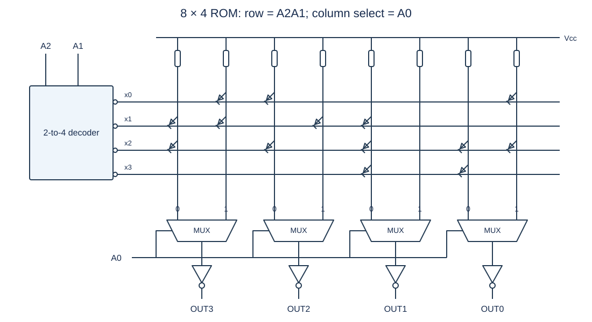

每个数据输出分配两列，分别对应 $`A_0=0`$ 与 $`A_0=1`$。先选行，再选列；四个 selector 的输出分别经过 NOT，得到 OUT3、OUT2、OUT1、OUT0。

以 address 0、data 4 为例：

```math
0\to A_2A_1A_0=000,\qquad4\to0100.
```

1. Decoder 中，$`A_2A_1=00`$，选中编号 0 的横线，令这一行输出低电平。注意地址位顺序。
2. $`A_0=0`$，选择每组中标为 0 的竖线。

3. 根据 data 安装二极管：经过末端 NOT 后，有二极管为 1，无二极管为 0。因此在该行、$`A_0=0`$ 的四个选中交点中，只在 OUT2 对应的位置接二极管，得到 0100。
