# Discrete Mathematics · 笔记

## 1. Sets and Logic

### 1.1 Sets 集合

$`A=\{1,2,3,4\}`$，其中的数为 **elements（元素）**。

- $`\mathbb Z`$：integers。
- $`\mathbb Q`$：rational。
- $`\mathbb R`$：real。

- $`\vert A\vert`$：cardinality（势）of a set $`A`$，大小等于有限集合 $`A`$ 中元素的个数。

- void set = null set = empty set：空集。

**Set equality**：$`A,B`$ are equal if:

1. For every $`x`$, if $`x\in A`$, then $`x\in B`$.
2. For every $`x`$, if $`x\in B`$, then $`x\in A`$.

证明集合相等时，在已经确定 $`x\in B`$ 的情况下可以再分情况讨论。

#### 1.1.1 包含关系与集合运算

$`A\subseteq B`$ 且 $`B\subseteq A\Rightarrow A=B`$。

$`A\subsetneq B`$：proper subset，真子集。

$`\mathcal P(A)`$：power set，幂集，指所有子集组成的集合。$`n`$ 个元素有 $`2^n`$ 个子集。

- **Union**：并集。
- **Intersection**：交集。
- **Difference / relative complement**：差集。

```math
A-B=\{x\mid x\in A\text{ and }x\notin B\}.
```

- Disjoint：不相交，$`X\cap Y=\varnothing`$。

- Pairwise disjoint（两两不相交）：$`X,Y`$ 是 $`S`$ 中不同的集合，则 $`X,Y`$ 不相交。

- **Universal set**：全集。
- **Complement**：补集／余集，记为 $`A^c`$。

判断 $`A\cup(B\cap C)=(A\cup B)\cap(A\cup C)`$ 的方法：画 Venn 图。这是 distributive law（分配律）。

#### 1.1.2 集合运算律

**Associative law 结合律**（任意二者结合）：

```math
(A\cup B)\cup C=A\cup(B\cup C),\qquad (A\cap B)\cap C=A\cap(B\cap C).
```

**Commutative law 交换律**：

```math
A\cup B=B\cup A,\qquad A\cap B=B\cap A.
```

**Distributive laws 分配律**：

```math
A\cap(B\cup C)=(A\cap B)\cup(A\cap C),
```

```math
A\cup(B\cap C)=(A\cup B)\cap(A\cup C).
```

- **Identity laws 同一律**：$`A\cap U=A,\ A\cup\varnothing=A`$。

- **Complement laws 补余律**：$`A\cup A^c=U,\ A\cap A^c=\varnothing`$。

- **Idempotent laws 等幂律**：$`A\cup A=A,\ A\cap A=A`$。Idempotent：任意多次执行所产生的影响与一次执行的影响相同。

- **Bound laws 零律**：$`A\cup U=U,\ A\cap\varnothing=\varnothing`$。

- **Absorption laws 吸收律**：$`A\cup(A\cap B)=A,\ A\cap(A\cup B)=A`$。

- **Involution law 对合律**：$`(A^c)^c=A`$。

- **0/1 律**：$`\varnothing^c=U,\ U^c=\varnothing`$。

**De Morgan's laws for sets 德摩根定律**：

```math
(A\cup B)^c=A^c\cap B^c,\qquad (A\cap B)^c=A^c\cup B^c.
```

#### 1.1.3 集族、分割与笛卡尔积

若 $`S=\{A_1,A_2,A_3,\ldots,A_n\}`$，则 $`\bigcap S=\bigcap_{i=1}^n A_i`$。

**Partition 分割**：例如全集为 $`\{1,2,3\}`$，$`S=\{\{1,2\},\{3\}\}`$ 是一种 partition。

**Cartesian product 笛卡尔积**：

```math
A\times B=\{(a,b)\mid a\in A\land b\in B\}.
```

### 1.2 Logic 逻辑

- **Conjunction** $`\land`$：且，$`p\land q`$。
- **Disjunction** $`\lor`$：或，$`p\lor q`$。
- **Negation** $`\neg`$：非，$`\neg p`$。

- **异或** $`\oplus`$：相同为假，不同为真。

**操作符优先级**：$`\neg,\land,\lor,\to`$。

$`p\equiv q`$：逻辑等价（同真同假）。

**Conditional proposition 条件命题**：$`p\to q`$，if $`p`$, then $`q`$。只有 $`p`$ 为真、$`q`$ 为假时，$`p\to q`$ 才为假，其余均为真。

- $`p`$：**hypothesis（antecedent）**。
- $`q`$：**conclusion（consequent）**。

#### 1.2.1 真值表与命题等价

**1.2.1.1 根据真值表写逻辑表达式**

1. 选择 output 为 1 的行。例：$`(p,q,r)=(T,T,F),(F,T,T)`$ 对应

   $`\displaystyle (p\land q\land\neg r)\lor(\neg p\land q\land r).`$

2. 选择 output 为 0 的行。例：$`(p,q,r)=(T,F,F),(F,T,F)`$ 对应

   $`\displaystyle \neg(p\land\neg q\land\neg r)\land\neg(\neg p\land q\land\neg r).`$

**De Morgan's law**：$`\neg(p\land q)\equiv\neg p\lor\neg q`$；$`\neg(p\lor q)\equiv\neg p\land\neg q`$。

$`p\to q`$ 的逆（converse）是 $`q\to p`$。

**Biconditional proposition 双条件命题**：$`p\leftrightarrow q`$，$`p`$ if and only if $`q`$。$`p,q`$ 一样才为真。

| $`p`$ | $`q`$ | $`p\leftrightarrow q`$ |
|:---:|:---:|:---:|
| T | T | T |
| F | F | T |
| T | F | F |
| F | T | F |

**Contrapositive (transposition) proposition**：逆否命题与原命题真假同步，

```math
p\to q\equiv\neg q\to\neg p.
```

$`\land,\lor`$ 满足交换律、结合律、分配律。德摩根定律则会交换 $`\land`$ 与 $`\lor`$。

```math
A\land(A\lor B)\equiv A,\qquad A\lor(A\land B)\equiv A.
```

```math
A\to B\equiv\neg A\lor B,\qquad A-B=A\cap B^c.
```

```math
A\leftrightarrow B\equiv(A\to B)\land(B\to A).
```

```math
(A\to B)\land(A\to\neg B)\equiv\neg A.
```

分配律之一：$`A\land(B\lor C)\equiv(A\land B)\lor(A\land C)`$。

#### 1.2.2 命题的真假类型

**Tautology 永真式**：

1. $`p\lor\neg p`$。
2. $`(p\land q)\lor(\neg q\land p)\lor(\neg p\land\neg q)\lor(\neg p\land q)`$。
3. $`p\to(p\lor q)`$。

补：$`(\neg A\land B)\lor(\neg A\land C)\equiv\neg A\land(B\lor C)`$。

**Contradiction 矛盾式**：

1. $`p\land\neg p`$。
2. $`(p\lor q)\land(\neg q\lor p)\land(\neg p\lor\neg q)\land(\neg p\lor q)`$。

**Contingency**：有真也有假。

#### 1.2.3 论证与推理规则

**Argument 论证**：写法为 $`p_1,p_2,\ldots,p_n/\therefore q`$。

论证有效，当且仅当若 $`p_1,\ldots,p_n`$ 都真，那么 $`q`$ 也真。若前提不可能全为真，也是有效的。

**Modus ponens rule of inference / law of detachment（假言推理、分离定律）**：

```math
p\to q,\quad p\quad/\therefore q.
```

- **Modus tollens 拒取**：$`p\to q,\ \neg q\ /\therefore\neg p`$。

- **Addition 附加**：$`p\ /\therefore p\lor q`$。

- **Simplification 化简**：$`p\land q\ /\therefore p`$。

- **Conjunction 合取**：$`p,\ q\ /\therefore p\land q`$。

- **Disjunctive syllogism 析取三段论**：$`p\lor q,\ \neg p\ /\therefore q`$。

补：反证法，假设相反结论，推出与题目相违背的矛盾。

#### 1.2.4 命题函数与量词

**Propositional function 命题函数**。

- **Universal quantifier**：$`\forall`$，全称量词。
- **Existential quantifier**：$`\exists`$，存在量词。
- $`D`$：**discourse**，论域。

```math
\neg(\forall x\,P(x))\equiv\exists x\,\neg P(x),
```

```math
\neg(\exists x\,P(x))\equiv\forall x\,\neg P(x).
```

“All lions are fierce”：$`\forall x(P(x)\to Q(x))`$，其中 $`P(x)`$：$`x`$ is a lion；$`Q(x)`$：$`x`$ is fierce。

“Some lions do not drink coffee”：$`\exists x(P(x)\land\neg Q(x))`$，其中 $`P(x)`$：$`x`$ is a lion；$`Q(x)`$：$`x`$ drinks coffee。

- **Universal instantiation 全称例化**：$`\forall x\,P(x)\ /\therefore P(d)`$，if $`d\in D`$。

- **Universal generalization 全称一般化**：$`P(d)`$ for every $`d\in D\ /\therefore\forall x\,P(x)`$。

- **Existential instantiation 存在例化**：$`\exists x\,P(x)\ /\therefore P(d)`$ for some $`d\in D`$。

- **Existential generalization 存在一般化**：$`P(d)`$ for some $`d\in D\ /\therefore\exists x\,P(x)`$。

Tips：证 $`\forall x(P(x)\to Q(x))`$，可假设 $`P(x)`$ 为真；$`P(x)`$ 为假时无需另证。

**Nested quantifiers 嵌套量词**：$`\forall x\exists y\,P(x,y)`$。

**Mathematical systems 数学系统**：axioms（公理）、definitions（定义）、undefined terms（未定义项）。

Counterexample：反例；disprove：证明……为假。

证明子集：for every $`x`$, if $`x\in A`$, then $`x\in B`$。

**证明相等**：

1. For every $`x\in A`$, $`x\in B`$。
2. For every $`x\in B`$, $`x\in A`$。

### 1.3 Proofs 证明

- **Proof by contradiction 反证法**：证 $`p\to q`$，假设 $`p`$ 为真、$`q`$ 为假。假设结论为假，推出与题目条件相矛盾的结果，则结论正确。

- **Proof by contrapositive 逆否证明法**：证 $`p\to q`$，转而证明 $`\neg q\to\neg p`$。

- **Proof by cases**：分情况证明。

- **Proof by equivalence 等价证明法**：$`p\leftrightarrow q\equiv(p\to q)\land(q\to p)`$。

- **Existence proofs 存在性证明法**：$`\exists x\,P(x)`$。

**Resolution proofs 消解证明／归结证明**：如果 $`p\lor q`$ 和 $`\neg p\lor r`$ 都是真，那么 $`q\lor r`$ 是真。

特殊情况：

- 如果 $`p\lor q`$ 和 $`\neg p`$ 都是真，那么 $`q`$ 是真。
- 如果 $`\neg p\lor q`$ 和 $`p`$ 都是真，那么 $`q`$ 是真。

#### 1.3.1 数学归纳法

**Principle of mathematical induction 数学归纳法**：

1. $`S(1)`$ is true（basic step）。
2. For all $`n\ge1`$, if $`S(n)`$ is true, then $`S(n+1)`$ is true（inductive step）。

Then $`S(n)`$ is true for every positive integer $`n`$。证明要写 basic step 和 inductive step 这两个术语。

**Strong form of induction 强数学归纳法**。Preceding statement：前趋语句。

1. $`S(n_0)`$ is true（可从多项开始，比如 $`S_1,S_2,S_3`$）。
2. For all $`n\gt n_0`$, if $`S(k)`$ is true for all $`n_0\le k\lt n`$, then $`S(n)`$ is true.

Then $`S(n)`$ is true for every integer $`n\ge n_0`$。

#### 1.3.2 邮票问题

**求凑邮票问题**：面值为 $`a,b`$。

1. 找 $`a,b`$ 中较小的数，记为 $`\min(a,b)`$。
2. 找形如 $`ma+nb`$（$`m,n\ge0`$）的最小连续序列，个数为 $`\min(a,b)`$。
3. 最小连续序列的第一个即为“此数及以后均可凑出”的起点。

良序性：每一个非负整数的非空集合都有一个最小元素。

例题：Given an unlimited supply of 5-cent or 7-cent stamps, what postages are possible?

**邮票问题的证明，Example 2.5.1**：Use mathematical induction to show that postage of 4 cents or more can be achieved by using only 2-cent and 5-cent stamps.

**Proof: basis steps ($`n=4,n=5`$)**. We can make 4-cent postage by using two 2-cent stamps. We can make 5-cent postage by using one 5-cent stamp. The basis steps are verified.

**Inductive step**. Assume that $`n\ge6`$ and that postage of $`k`$ cents can be achieved by using only 2-cent and 5-cent stamps for $`4\le k\lt n`$. By the inductive assumption, we can make postage of $`n-2`$ cents. Add a 2-cent stamp to make $`n`$-cent postage. The inductive step is complete.

设命题函数 $`S(n)`$ 的论域是所有不小于 $`n_0`$ 的整数。如果 $`S(n_0)`$ 真，且对所有 $`n\gt n_0`$，由 $`S(k)`$ 对全部 $`n_0\le k\lt n`$ 成立可推出 $`S(n)`$ 真，那么 $`S(n)`$ 对每个 $`n\ge n_0`$ 成立。

当 $`a,b`$ 为互质正整数时，所有不小于 $`(a-1)(b-1)`$ 的金额都可以凑出。例如 $`(2-1)(5-1)=4`$。

#### 1.3.3 商和余数定理

**Quotient-remainder theorem 商和余数定理**：If $`d`$ and $`n`$ are integers, $`d\gt 0`$, there exist integers $`q`$ (quotient) and $`r`$ (remainder) satisfying

```math
n=dq+r,\qquad 0\le r\lt d.
```

Furthermore, $`q`$ and $`r`$ are unique. If

```math
n=dq_1+r_1,\quad 0\le r_1\lt d,
```

```math
n=dq_2+r_2,\quad 0\le r_2\lt d,
```

then $`q_1=q_2`$ and $`r_1=r_2`$.

## 2. Functions, Sequences and Counting

### 2.1 Functions 函数

**Arrow diagram**：例如定义域为 $`\{1,2,3\}`$，陪域为 $`\{a,b,c,d\}`$，映射 $`1\mapsto a,2\mapsto c,3\mapsto b`$。函数的要求：定义域中的每一个值都必须用上，并且对应唯一的值。

- **Domain**：定义域。
- **Codomain**：陪域。
- **Range**：值域。

- **单射 injective（one-to-one）**：不同 $`x`$ 对应不同的 $`y`$。
- **满射 surjective（onto）**：陪域中的每个 $`y`$ 都有人指。
- **双射（bijection）**：既是单射又是满射，$`x,y`$ 一一对应，互不干扰。

**Inverse function 反函数**：只有双射函数才有以原陪域为定义域的反函数。若 $`f`$ 中有 $`(1,a)`$，则 $`f^{-1}`$ 中有 $`(a,1)`$。

Composition 复合：$`(f\circ g)(x)=f(g(x))`$，先 $`g`$ 后 $`f`$。

**Pigeonhole principle 鸽巢原理**：如果有 $`n`$ 只鸽子、$`k`$ 个笼子，$`k\lt n`$，那么有的笼子至少有 2 只鸽子。大的有限集合往小的有限集合映射，不可能是单射。

$`x\bmod y`$：$`x`$ 除以 $`y`$ 的余数。Modulus operator：模算子。例：$`-11\bmod7=3`$。

- **Floor** $`\lfloor x\rfloor`$：向下取整，在区间 $`[k,k+1)`$ 取值 $`k`$。
- **Ceiling** $`\lceil x\rceil`$：向上取整，在区间 $`(k-1,k]`$ 取值 $`k`$。

**鸽巢原理例题**：Twenty people are to sit in a row of 25 chairs. Prove that four consecutive chairs are sure to be occupied.

1. 连续 4 把椅子有 $`25-4+1=22`$ 种位置。
2. $`25-20=5`$，有 5 把空椅子。一个空椅子最多排除 4 种位置，5 把最多排除 20 种。
3. 仍至少有 2 种连续 4 把椅子的位置未被排除，因而全部有人坐。

### 2.2 Sequences and Strings 序列与串

- **Unary operator**：一元操作符，$`X\to X`$。
- **Binary operator**：二元操作符，$`X\times X\to X`$。

$`S_n`$ 中的 $`n`$ 叫 index（下标）。$`\{S_n\}_{n=k}^{\infty}`$ 表示下标的定义域从 $`k`$ 到 $`\infty`$。

- 递增序列：对于 $`S_n`$，如果 $`i\lt j`$，那么 $`S_i\lt S_j`$。

- 非增序列（nonincreasing）：对所有 $`i,j`$，若 $`i\lt j`$，那么 $`S_i\ge S_j`$。

Subsequence：子序列。$`\sum`$：求和符；$`\prod`$：乘积符。

- $`X`$：一个有限集。
- $`X^*`$：基于集合 $`X`$ 的所有串。
- $`X^+`$：基于集合 $`X`$ 的所有非空串。
- $`\lambda`$：空串。

例：$`X=\{a,b\}`$，$`ababa`$ 的长度是 5。

## 3. Relations 关系

$`x`$ divides $`y`$：$`x`$ 整除 $`y`$。例如 $`2\mid4,3\mid6,2\mid2`$。

Digraph（有向图）：关系 $`\{(1,1),(1,2),(2,2)\}`$ 表示为

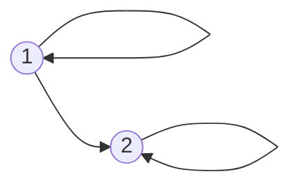

二元关系（binary relation），写作 $`xRy`$。$`n`$ 个元素的集合上有 $`2^{n^2}`$ 种二元关系。

- Reflexive 自反的：每个 $`(x,x)`$ 都在关系里面。
- Symmetric 对称的：如果有 $`(x,y)`$，肯定有 $`(y,x)`$。
- Antisymmetric 反对称的：如果有 $`(x,y)`$，不能同时有 $`(y,x)`$，除非 $`x=y`$。
- Transitive：传递的。

**Transitive 传递的**：如果有 $`(x,y)`$ 和 $`(y,z)`$，肯定有 $`(x,z)`$。

若 $`X\ne\varnothing`$ 而 $`R=\varnothing`$，除了不是自反的，其余三个性质都有。若 $`X=\varnothing`$，四个性质都有。

证明反对称的方法：如果有 $`(x,y),(y,x)`$，那么推出 $`x=y`$。

### 3.1 偏序与全序

**Partial order 偏序**：自反、反对称、传递，符号 $`x\preceq y`$。

如果 $`x\preceq y`$ 或 $`y\preceq x`$，则 $`x,y`$ 是可比的（comparable）；否则是不可比的（incomparable）。

**Total order 全序的判断**：

1. 首先判断 $`R`$ 是否为偏序。
2. 接着判断任意在 $`X`$ 中取 2 个元素（可以相同）$`x,y`$，在 $`R`$ 中是否始终有 $`(x,y)`$ 或 $`(y,x)`$。
3. 始终存在则为全序。

Inverse 逆：$`(2,4)\mapsto(4,2)`$。

复合关系：

```math
R_2\circ R_1=\{(x,z)\mid (x,y)\in R_1\text{ and }(y,z)\in R_2\text{ for some }y\in Y\}.
```

### 3.2 等价关系与划分

自反、对称、传递 $`\Rightarrow`$ equivalence relation（等价关系）。

集族（collection of sets）：集合的集合。设 $`\mathcal S=\{A_1,A_2,A_3,\ldots,A_m\}`$。若

1. $`A_i\ne\varnothing`$；
2. $`A_i\cap A_j=\varnothing`$，$`i\ne j`$；
3. 总的并集是 $`X`$；

则称 $`\mathcal S`$ 是对 $`X`$ 的划分（partition）。

定理：若定义 $`xRy`$ 当且仅当 $`x,y`$ 属于划分中的同一个集合，那么 $`R`$ 是等价关系。

**Example 3.4.2**：Consider the partition $`\mathcal S=\{\{1,3,5\},\{2,6\},\{4\}\}`$ of $`X=\{1,2,3,4,5,6\}`$。关系 $`R`$ 包含 $`(1,1),(1,3),(1,5)`$，因为 $`\{1,3,5\}\in\mathcal S`$。完整关系为

```math
\begin{aligned} R=\{&(1,1),(1,3),(1,5),(3,1),(3,3),(3,5),\\ &(5,1),(5,3),(5,5),(2,2),(2,6),(6,2),(6,6),(4,4)\}. \end{aligned}
```

Let $`\mathcal S`$ and $`R`$ be as above. If $`S\in\mathcal S`$, the members of $`S`$ are equivalent in the sense of $`R`$。因此自反、对称、传递的关系称为 equivalence relations。若关系为“is the same color as”，则 equivalent 即“is the same color as”；每一个分块包含全部某一颜色的球。

**Equivalence classes 等价类**：等价类是个集合。$`a\in X`$，

```math
[a]=\{x\in X\mid xRa\}.
```

例如对一般关系 $`R=\{(1,1),(1,3),(2,3),(1,2)\}`$，与 3 有关系的前项集合为 $`\{1,2\}`$，与 2 有关系的前项集合为 $`\{1\}`$。这个 $`R`$ 不是等价关系，故这些集合不能称为等价类。

定理：如果 $`R`$ 是 $`X`$ 上的等价关系，那么 $`\mathcal S=\{[a]\mid a\in X\}`$ 是 $`X`$ 的 partition。

### 3.3 关系矩阵与计数

**Matrices of relations 关系矩阵**：$`X=\{1,2,3,4\}`$，$`Y=\{a,b,c,d\}`$，关系有 $`(3,c),(3,b)`$，则

```math
M_R=\begin{pmatrix}0&0&0&0\\0&0&0&0\\0&1&1&0\\0&0&0&0\end{pmatrix}.
```

注意：画 $`X\to X`$ 的关系矩阵时，行、列的 order 须一致。例如左边和上边都用 $`2,3,1,4`$ 的顺序。

若普通矩阵乘积

```math
A_1A_2=\begin{pmatrix}1&1&0\\0&1&1\\1&2&1\end{pmatrix},
```

则复合关系 $`R_2\circ R_1`$ 的布尔矩阵为

```math
M_{R_2\circ R_1}=\begin{pmatrix}1&1&0\\0&1&1\\1&1&1\end{pmatrix}.
```

即乘积中大于等于 1 的项取 1。

传递性在关系矩阵中的表现（判断传递的方法）：$`A^2(i,j)\ne0\Rightarrow A(i,j)\ne0`$。

**关系计数**。从 $`X`$ 到 $`X`$，$`X`$ 有 $`n`$ 个元素：

| 关系性质 | 数量 |
|---|---|
| 任意关系 | $`2^{n^2}`$ |
| 自反 | $`2^{n(n-1)}`$ |
| 对称 | $`2^{n(n+1)/2}`$ |
| 反对称 | $`2^n3^{n(n-1)/2}`$ |
| 自反且对称 | $`2^{n(n-1)/2}`$ |
| 自反且反对称 | $`3^{n(n-1)/2}`$ |
| 对称且反对称 | $`2^n`$ |
| 自反、对称、反对称 | $`1`$ |

$`X`$ 有 $`n`$ 个元素，$`Y`$ 有 $`m`$ 个元素：

- 从 $`X`$ 到 $`Y`$ 的**关系**有 $`2^{nm}`$ 种。
- 从 $`X`$ 到 $`Y`$ 的**函数**有 $`m^n`$ 个。

若 $`A\subseteq B\subseteq X`$，$`\vert X\vert =n`$，则二元组 $`(A,B)`$ 有 $`3^n`$ 个。例：$`A=\{1\},B=\{1,3,4\},X=\{1,2,3,4\}`$。每个 $`x\in X`$ 有 3 种位置：$`A`$、$`B-A`$、$`X-B`$，故 $`n`$ 个 $`x`$ 有 $`3^n`$ 种可能。

### 3.4 Counting 排列组合

Power set（幂集）：集合 $`X`$ 所有子集的集合。

4-digit number：4 位数，每一位可用数字包含 0，但首位不能为 0；若指 4 位数字串，则首位也可为 0。

**Inclusion-exclusion principle 容斥原理**：

```math
\vert X\cup Y\vert =\vert X\vert +\vert Y\vert -\vert X\cap Y\vert .
```

这里竖线表示元素个数。

例：计算以 10 开始或以 011 结束（或二者都有）的八位二进制字符串数量。

#### 3.4.1 排列、组合与重复元素

**Permutation（排序、排列）**。$`r`$-permutation：$`r`$ 排列。$`P(n,r)`$：从有 $`n`$ 个元素的集合中取 $`r`$ 个不同元素进行有序排列的方法数。

```math
P(n,r)=\frac{n!}{(n-r)!}.
```

**Combination 组合**。$`r`$-combination：$`r`$ 组合，记为 $`C(n,r)`$ 或 $`\binom nr`$。从有 $`n`$ 个元素的集合中挑 $`r`$ 个元素（无序）。

```math
C(n,r)=\frac{P(n,r)}{r!}=\frac{n!}{(n-r)!r!}=\frac{n(n-1)\cdots(n-r+1)}{r!}.
```

**Generalized 广义的排列组合**：相较于一般情况，可以有重复元素。有序排列公式：

```math
\frac{n!}{n_1!n_2!n_3!},
```

其中 $`n_1,n_2,n_3`$ 为 $`A,B,C`$ 重复出现的次数，$`n=n_1+n_2+n_3`$。

有 8 个球，可以选 3 种颜色，按各颜色球的数量计有多少种可能？用隔板法，将 8 个球和 2 个隔板排列，$`C(10,2)=45`$。

如果集合 $`X`$ 有 $`t`$ 个元素，从 $`X`$ 中选择 $`k`$ 个元素，无序、允许重复，有

```math
C(k+t-1,t-1)=C(k+t-1,k)
```

种可能。上面的选球颜色就是例子。

## 4. Graph Theory 图论

**Eulerian path 欧拉路径**：每条边只能走一遍，每条边都要走。对于有边的无向图，忽略孤立顶点后，存在欧拉路径当且仅当图连通且奇数度顶点数为 0 或 2。若有 2 个奇数度顶点，则它们是起点和终点。

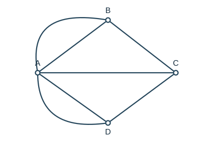

- **Graph**：无向图；**digraph**：有向图。
- **Edge**：边；**arc**：弧。

Incident：相关联的；adjacent：相邻的。

- **平行边（parallel edges）**：两条边共用一对顶点。
- **Loop**：边的起点、终点相同，即自循环。
- **孤立顶点（isolated vertex）**：没有与任何一条边相关联的点。

简单图（simple graph）：没有 loop、平行边的图。

**完全图（complete graph）**，写成 $`K_n`$，满足：

- 是简单图。
- 任意两个不同顶点间都有一条边。

$`K_1`$ 是一个点，$`K_2`$ 是两点之间连一条边，$`K_3`$ 是三角形。

### 4.1 二部图与超立方体

**二部图（bipartite graph）**：$`V_1\cap V_2=\varnothing`$，$`V_1\cup V_2=V`$，每条边都是一个顶点在 $`V_1`$ 中，另一个在 $`V_2`$ 中。

例如 $`V_1=\{v_1,v_2,v_3\},V_2=\{v_4,v_5\}`$，边为 $`v_1v_4,v_2v_5,v_3v_5`$。

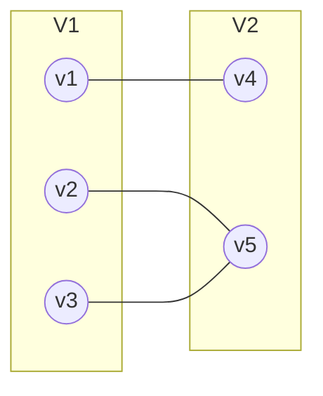

判断是否为二部图：把顶点标为三角形和圆，每条边必须是三角形连圆，或圆连三角形。空图、$`K_1`$ 也是二部图。

**完全二部图（complete bipartite graph）**：写成 $`K_{m,n}`$。$`V`$ 分成 $`V_1,V_2`$，$`V_1`$ 中有 $`m`$ 个顶点，$`V_2`$ 中有 $`n`$ 个顶点；两组之间每一对顶点都有边。

**$`n`$-cube（$`n`$-立方体）／hypercube（超立方体）**：有 $`2^n`$ 个顶点，顶点的名字是 $`n`$ 位二进制数；每条边两端顶点的二进制数只有一位不同。

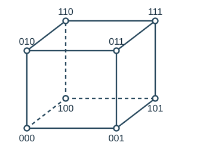

**画四立方体的方法**：

1. 复制一个三立方体。
2. 一份顶点标签前加 0，另一份前加 1。
3. 连接对应顶点。

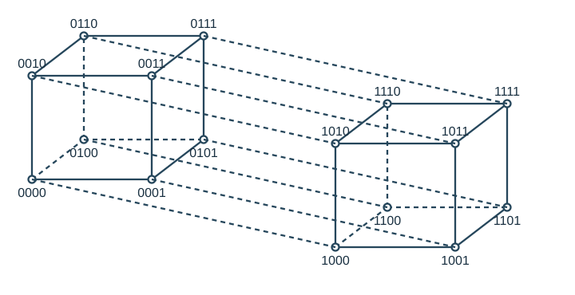

### 4.2 连通性、路径与回路

Path：路径；connected：连通的；subgraph：子图；component：分支。

子图：边在的话，端点必须在。例如三角形 $`ABC`$ 的边 $`AB,AC,BC`$ 分别为 1、2、3。只取一条无端点的边 1 不是子图；取 $`A,B`$ 和边 1 是子图。

分支：数有几个连通部分。下图有 3 个分支。

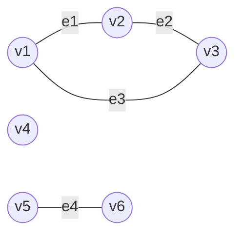

$`vRw`$ 表示有 $`v`$ 到 $`w`$ 的路径。无向图中这里的 $`R`$ 是等价关系，此时等价类写作 $`[v]=\{w\in V\mid wRv\}`$。

- 简单路径（simple path）：没有重复顶点的路径。

- 回路（circuit）：非零的闭合路径，从一点开始，在同一点结束，不能有重复的边。

- 简单回路（simple cycle）：在回路基础上，除起点与终点相同外，没有重复顶点。

Eulerian path：欧拉路径；Euler cycle：欧拉回路。

简单图中每个顶点的度数等于该顶点的邻接顶点数（neighbours）。度数记为 $`\deg(v)`$，例如 $`\deg(a)=1`$。

有欧拉回路 $`\Leftrightarrow`$ 忽略孤立顶点后图 $`G`$ 连通，且每个顶点的度数都是偶数。

欧拉图（Euler graph）：有欧拉回路的图。

所有无向图的顶点度数之和一定为偶数，因为

```math
\sum_{v\in V}\deg(v)=2\vert E\vert .
```

非负整数度数序列的和为偶数时，可以构成允许自环与平行边的图，但不一定能构成简单图。

### 4.3 哈密顿回路与格雷码

**Hamiltonian cycle 哈密顿回路**：每个顶点都经过一次（只能经过一次），起点与终点相同。取出的回路中，点数等于边数。

邻居集：例如四边形的边为 $`ab,bc,cd,da`$，则 $`N(b)=\{a,c\}`$。

**Randomized Hamiltonian cycle 随机哈密顿回路算法**（输入是简单图）：

1. 随便挑一个点作为 $`v_1`$。
2. 随便挑一个与 $`v_1`$ 相邻的点作为 $`v_2`$。
3. 找 $`N(v_2)-\{v_1,v_2\}`$，继续扩展到尚未访问的顶点。
4. 最后到达当前端点 $`v_n`$，看它是否为 $`v_1`$ 的邻居。若已包含所有顶点且首尾相邻，则返回 true。
5. 若端点度数为 1，且图的顶点数大于 2，则图不可能存在哈密顿回路。
6. 若端点有其他已访问邻居，找与 $`v_n`$ 相邻的 $`v_j`$（$`j\ne n-1`$），将路径

   $`\displaystyle v_1,v_2,\ldots,v_j,v_{j+1},\ldots,v_{n-1},v_n`$

   改为

   $`\displaystyle v_1,v_2,\ldots,v_j,v_n,v_{n-1},\ldots,v_{j+1}.`$

   这是一次路径旋转，新的端点是 $`v_{j+1}`$。
7. 顶点还没走满，则继续寻找新的点；顶点已走满，则继续判断末端是否能回到起点。

随机尝试失败只表示这一次没有找到回路，不能一般性地断言图中不存在哈密顿回路。

**Traveling salesperson problem 旅行商问题**：给一个有权图，寻找权值和最小的哈密顿回路。

任意 $`n\ge2`$ 的 $`n`$-立方体都有哈密顿回路，而且都是二部图。

**Gray code 格雷码**：$`S_1,S_2,\ldots,S_{2^n}`$ 满足：

1. $`S_i`$ 是 $`n`$ 位二进制字符串。
2. 每个二进制字符串只出现一次。
3. $`S_i`$ 和 $`S_{i+1}`$ 只有一位数字不同（$`i=1,\ldots,2^n-1`$）。
4. $`S_{2^n}`$ 和 $`S_1`$ 只有一位数字不同。

已有 $`G_{n-1}`$，构造 $`G_n`$：

1. 求 $`G_{n-1}`$ 的逆序 $`G_{n-1}^R`$。
2. 在 $`G_{n-1}`$ 每个码字前加 0 得到 $`G'_{n-1}`$。
3. 在 $`G_{n-1}^R`$ 每个码字前加 1 得到 $`G''_{n-1}`$。
4. 先 $`G'_{n-1}`$ 后 $`G''_{n-1}`$ 拼在一起，得到 $`G_n`$。

**The knight's tour 骑士遍历问题**：在 $`n\times n`$ 棋盘上，马能不能把每一个点都走一遍，并回到起点（哈密顿回路）？当 $`n\ge6`$ 且 $`n`$ 为偶数时，闭合骑士遍历有解。

### 4.4 最短路径：Dijkstra 算法

**Dijkstra 算法**：适用于非负权图，不能用于含负权边的情况。寻找 $`a\to z`$ 的最短路径。

**基本思想**：集合 $`S`$ 存放已经找到最短路径的顶点。

1. **初始化**：$`S`$ 只包含源点 $`v`$。对 $`v_i\in V-S`$，先用从 $`v`$ 直接到 $`v_i`$ 的边长作暂定距离，没有边则设为无穷。
2. **选点**：选择暂定距离最小的顶点 $`v_k`$ 加入 $`S`$。
3. **更新距离**：将经过 $`v_k`$ 到其他顶点的路径与原暂定路径比较，取较短者。
4. **重复**：直到所有可达顶点均加入 $`S`$。

思路：从起点出发，最小的设为 known（不必再判断）。经过这个最小点更新其他点的路径长度，比原来的短就更新，再次找最小值。

- 简单地扫描表格：$`T=O(\vert V\vert ^2+\vert E\vert )`$。

- 使用二叉堆优先队列：$`T=O((\vert V\vert +\vert E\vert )\log\vert V\vert )`$；对连通图通常写作 $`O(\vert E\vert \log\vert V\vert )`$。若用允许重复条目的实现，最多会有 $`O(\vert E\vert )`$ 次 DeleteMin，并需 $`O(\vert E\vert )`$ 的额外空间。

记得看题目要求，是记录路径长度，还是具体路径怎么走，并在写题时进行记录！

**Dijkstra 示例一**：有向边及权值如下。

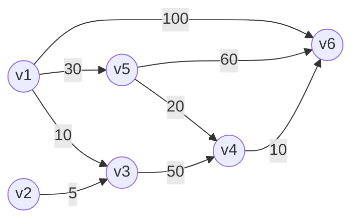

以 $`v_1`$ 为源点，Dis 数组按 $`v_1,\ldots,v_6`$ 排列：

| 步骤 | $`v_1`$ | $`v_2`$ | $`v_3`$ | $`v_4`$ | $`v_5`$ | $`v_6`$ |
|---|---:|---:|---:|---:|---:|---:|
| 初始化 | 0 | $`\infty`$ | 10 | $`\infty`$ | 30 | 100 |
| 选 $`v_3`$，更新 $`v_4`$ | 0 | $`\infty`$ | 10 | 60 | 30 | 100 |
| 选 $`v_5`$，更新 $`v_4,v_6`$ | 0 | $`\infty`$ | 10 | 50 | 30 | 90 |
| 选 $`v_4`$，更新 $`v_6`$ | 0 | $`\infty`$ | 10 | 50 | 30 | 60 |
| 选 $`v_6`$ | 0 | $`\infty`$ | 10 | 50 | 30 | 60 |

最后 $`v_2`$ 不可达，距离保持 $`\infty`$，退出循环。剩余顶点若距离已不会被更新，也可直接确定。

**Dijkstra 示例二**：无向加权图。

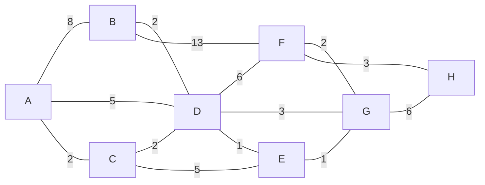

以下下标记录前驱；空白表示该点已确定。

| 步骤 | A | B | C | D | E | F | G | H |
|---|---|---|---|---|---|---|---|---|
| 1 | **0** | $`\infty`$ | $`\infty`$ | $`\infty`$ | $`\infty`$ | $`\infty`$ | $`\infty`$ | $`\infty`$ |
| 2 | | $`8_A`$ | **$`2_A`$** | $`5_A`$ | $`\infty`$ | $`\infty`$ | $`\infty`$ | $`\infty`$ |
| 3 | | $`8_A`$ | | **$`4_C`$** | $`7_C`$ | $`\infty`$ | $`\infty`$ | $`\infty`$ |
| 4 | | $`6_D`$ | | | **$`5_D`$** | $`10_D`$ | $`7_D`$ | $`\infty`$ |
| 5 | | **$`6_D`$** | | | | $`10_D`$ | $`6_E`$ | $`\infty`$ |
| 6 | | | | | | $`10_D`$ | **$`6_E`$** | $`\infty`$ |
| 7 | | | | | | **$`8_G`$** | | $`12_G`$ |
| 8 | | | | | | | | **$`11_F`$** |

伪代码：

```text
procedure dijkstra(w, a, z, L)
    L(a) := 0
    for each node x ≠ a do L(x) := ∞
    T := set of all nodes
    // T contains vertices whose shortest distance from a is not yet known
    while z ∈ T do
        choose v ∈ T with minimum L(v)
        T := T − {v}
        for each x ∈ T adjacent to v do
            L(x) := min(L(x), L(v) + w(v,x))
        end
    end
```

若要找 $`A\to B`$ 的最短路径，沿前驱 $`6_D,4_C,2_A`$ 回溯，得到 $`A\to C\to D\to B`$。

### 4.5 图的矩阵表示与同构

两个点的相邻关系：adjacent；一个点和一条边的关联关系：incident。

**Adjacency matrix 邻接矩阵**：若简单图的邻接矩阵为 $`A`$，则 $`A^2`$ 的第 $`i,j`$ 项表示从 $`i`$ 到 $`j`$ 长度为 2 的游走数量，且 $`A^2`$ 对角线元素就是各顶点的度数。

**Incidence matrix 关联矩阵**：行对应 $`v_1,v_2,\ldots`$，列对应 $`e_1,e_2,\ldots`$。顶点 $`v`$ 与边 $`e`$ 关联取 1，不关联取 0。

对于无 loops 的无向图，关联矩阵每一列只有 2 个 1，每一行之和等于对应 vertex 的度数。

**Isomorphisms of graphs 同构图**。Isomorphic：同构的。同一张图可有不同的画法，也可有不同标签。

示例图的边为 $`257\! -\!122,257\! -\!99,122\! -\!99,145\! -\!306,145\! -\!99,306\! -\!99,306\! -\!67,67\! -\!99`$。改变顶点位置不改变这张图。把标签按下表替换也得到同构图：

| 原标签 | 新标签 |
|---|---|
| 257 | Albert |
| 122 | Grant |
| 145 | Sharat |
| 306 | Sonya |
| 67 | Christos |
| 99 | Jessica |

Isomorphism of $`G_1`$ onto $`G_2`$：$`G_1`$ 到 $`G_2`$ 上的同构映射，即在顶点之间建立双射，并保持相邻关系。

$`G_1,G_2`$ 是同构图，当且仅当按适当顺序排列顶点（及边）后，它们的邻接矩阵（或关联矩阵）相同。

**一般图的同构**需要同时满足：

- $`f:V(G_1)\to V(G_2)`$ 为双射。
- $`g:E(G_1)\to E(G_2)`$ 为双射。
- 若边 $`e`$ 的端点为 $`v,w`$，则 $`g(e)`$ 的端点为 $`f(v),f(w)`$。

简单图的同构只需顶点双射 $`f`$，并满足 $`v,w`$ 在 $`G_1`$ 中相邻，当且仅当 $`f(v),f(w)`$ 在 $`G_2`$ 中相邻。

**Invariant 不变量**：判断同构的方法，是找 $`G_1`$ 有、同构的 $`G_2`$ 也必须有的性质。例如“有一个度为 $`k`$ 的顶点”“有一个长度为 $`l`$ 的 simple cycle”都是不变量。若 $`G_1,G_2`$ 同构，则一定有相同数量的顶点和边。

### 4.6 Planar Graphs 平面图

Planar：可以画在平面上，且边除了公共端点外不相交。只要存在一种没有边交叉的同构画法即可。

Faces：面，包含外部的无界面。下图有 4 个面：内部的 A、B、C，以及外部的 D。

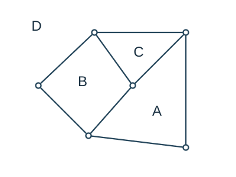

图的欧拉公式（针对连通平面图）：

```math
f=e-v+2.
```

即面数 = 边数 − 顶点数 + 2。

**为什么 $`K_{3,3}`$ 不是平面图？** 假设它是平面图。每条边最多属于两个面，而二部图没有三角形，每个面至少由 4 条边围成，因此

```math
2e\ge4f=4(e-v+2).
```

已知 $`e=9,v=6`$，于是 $`18\ge20`$，矛盾。

若 $`v`$ 的度数为 2，边 $`v_1v`$ 与 $`vv_2`$ 是串联的（series）。

串联约减（series reduction）：删去度为 2 的顶点 $`v`$ 及其关联的两条边，用一条 $`v_1v_2`$ 边替代。如果原来已有 $`v_1v_2`$ 边，则应保留它，约减后形成两条平行边。

若 $`G_1,G_2`$ 分别经过串联约减得到同构图 $`G_1',G_2'`$，那么 $`G_1,G_2`$ 是同胚的（homeomorphic）。

**库拉托夫斯基定理**：图 $`G`$ 是平面图，当且仅当 $`G`$ 不含与 $`K_5`$ 或 $`K_{3,3}`$ 同胚的子图。

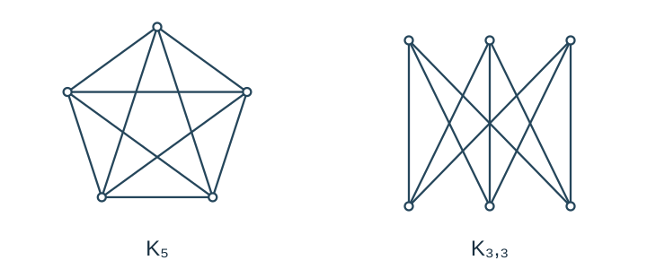

对任何顶点数 $`v\ge3`$ 的简单连通平面图，都有

```math
e\le3v-6.
```

证明：$`2e\ge3f=3(e-v+2)`$，故 $`e\le3v-6`$。

满足 $`e\le3v-6`$ 不一定是平面图，反例为 $`K_{3,3}`$。

- **证明是平面图**：按定义画出来。
- **证明是非平面图**：用定理找矛盾，或找与 $`K_{3,3}`$、$`K_5`$ 同胚的子图。

## 5. Trees 树

**(Free) tree 自由树**：

- 定义方式 1：简单图，且任意两个顶点 $`v,w`$ 之间都有唯一的 simple path。
- 定义方式 2：没有循环的连通图。

有根树（rooted tree）：指定了根节点的树。

顶点 $`v`$ 所在的层次（level of a vertex $`v`$）：深度，根的层次为 0。Height：高度。Acyclic graph：无环图。

- **Parent**：父节点；**child**：子节点。
- **Siblings**：兄弟节点。
- **Ancestor**：祖先节点；**descendant**：后代节点。

- **Terminal vertex = leaf**：终节点 = 叶子节点。
- **Internal vertex = branch**：中间节点 = 枝节点；不是叶子的节点都是枝节点。

**Subtree 子树**。原树：

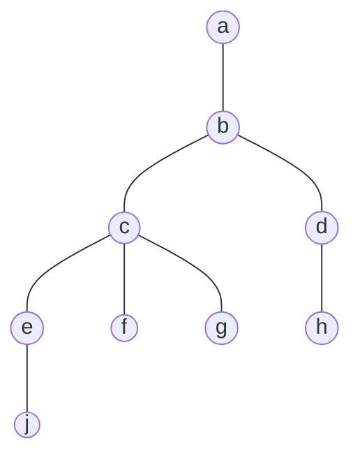

Draw the subtree rooted at $`c`$：取 $`c,e,f,g,j`$ 和边 $`ce,cf,cg,ej`$。

画某节点的子树 = 画它及它以下的所有节点 + 它到这些节点的简单路径。

假设 $`T`$ 是有 $`n`$ 个顶点的无向图，以下结论等价：

1. $`T`$ 是树。
2. $`T`$ 连通、无环。
3. $`T`$ 连通，有 $`n-1`$ 条边。
4. $`T`$ 无环，有 $`n-1`$ 条边。
5. 若 $`v,w`$ 是 $`T`$ 中的顶点，则存在唯一一条从 $`v`$ 到 $`w`$ 的简单路径。

### 5.1 Huffman Codes 霍夫曼编码

Algorithm:

1. Scan text to be compressed and count occurrences of all characters.
2. Sort or prioritize characters based on number of occurrences in text.
3. Build the Huffman code tree based on the prioritized list.
4. Perform a traversal of the tree to determine all code words.
5. Scan text again and create a new file using the Huffman codes.

例：`Eerie eyes seen near lake.`

| 字符 | E | e | r | i | y | s | n | a | l | k | 空格 | . |
|---|---:|---:|---:|---:|---:|---:|---:|---:|---:|---:|---:|---:|
| 次数 | 1 | 8 | 2 | 1 | 1 | 2 | 2 | 2 | 1 | 1 | 4 | 1 |

先统计字符，包括标点、空格，以出现次数作为权值，再进行编码。

### 5.2 生成树与图的搜索

Forest（森林）：树的集合。

**Spanning tree 生成树**（不一定唯一）：包含原图所有顶点，使所有顶点连通且无环的树；$`n`$ 个顶点、$`n-1`$ 条边。

$`G`$ 有生成树，当且仅当 $`G`$ 连通。

**5.2.1 Breadth-first search 广度优先搜索**

1. 搜索之前，先写出 $`a,b,c,d,e,f,g`$ 的顶点顺序。
2. 一层一层把不同层次的点往集合中加，但要保证不会发生循环。
3. 同一层次的顶点需要往后延伸时，处在前面的顶点先延伸、先考虑。

**Depth-first search 深度优先搜索**：

1. 用 $`a,b,c,d,e,f,g`$ 确定访问次序。
2. 序列靠前的点优先加入。
3. 一条路走到底。
4. 如果走到底，沿当前路径逆序回溯，检查是否还能加入新点；每个回溯到的点都要检查。

### 5.3 最小生成树

**Minimum spanning tree 最小生成树**：权值之和最小的生成树。

**Prim's algorithm 普里姆算法**：每一步选择当前树与树外顶点之间最小权边，把新顶点加入树。

示例图：

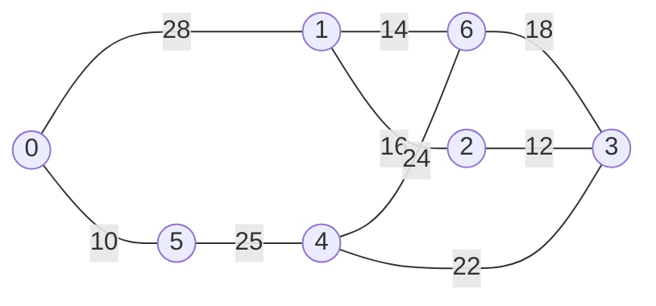

从 0 开始，Prim 依次加入：$`(0,5):10`$、$`(5,4):25`$、$`(4,3):22`$、$`(3,2):12`$、$`(2,1):16`$、$`(1,6):14`$。

**Kruskal's algorithm 克鲁斯卡尔算法**：按权值由小到大考虑边，仅在不会形成环时加入。

同一示例中依次加入：$`(0,5):10`$、$`(2,3):12`$、$`(1,6):14`$、$`(1,2):16`$；跳过会成环的 $`(6,3):18`$；加入 $`(3,4):22`$；跳过 $`(4,6):24`$；加入 $`(4,5):25`$。最小生成树总权值为 99。

### 5.4 复杂度与近似算法

**Polynomial time 多项式时间**：

- P：能在多项式时间内解决的判定问题。
- NP：给定“是”的证书后，能在多项式时间内验证的判定问题。
- 旅行商问题即使满足三角不等式，优化问题仍为 NP-hard（NP 难）。

时间复杂度依次增长：$`O(\log n),O(n),O(n\log n),O(n^c),O(2^n),O(n!)`$。前四种属于多项式时间的范围，$`c`$ 为固定常数。

**5.4.1 A 2-approximation algorithm for the metric TSP**

1. 找到一个最小生成树。
2. 把最小生成树的所有边都复制一遍。
3. 找复制后的多重图的欧拉回路。
4. 按欧拉回路的顺序，跳过重复出现的顶点，用直接边连接，剩下的访问顺序即为答案。

```math
\mathop{\mathrm{cost}}\nolimits(C)\le2\mathop{\mathrm{cost}}\nolimits(C_{\mathrm{opt}}).
```

```math
\mathop{\mathrm{cost}}\nolimits(C)\le\mathop{\mathrm{cost}}\nolimits(T_{\mathrm{eu}})=2\mathop{\mathrm{cost}}\nolimits(T_{\mathrm{mst}})\le2\mathop{\mathrm{cost}}\nolimits(C_{\mathrm{opt}}).
```

$`C_{\mathrm{opt}}`$ 是最优解。注意：输入为满足三角不等式的完全加权图，所有距离均须满足条件。

**贪心算法（nearest addition / nearest insertion algorithm）**：找距离当前集合最近的未加入顶点，把它插入当前回路，并选择增加代价最小的插入位置。例：图中候选点到当前回路的最近距离为 10 与 5，则先选距离为 5 的点并插入。

在 metric TSP 的这些条件与插入规则下，也可保证 $`\mathop{\mathrm{cost}}\nolimits(C)\le2\mathop{\mathrm{cost}}\nolimits(C_{\mathrm{opt}})`$。

## 6. Transport Networks 运输网络

Transport network：有源点（source）、汇点（sink），边都是有向的，容量为非负。

- **源点**：都往外指，has no incoming edges。
- **汇点**：都往内指，has no outgoing edges。

**流（flow）**：$`F_{ij}`$ 是边 $`(i,j)`$ 的 flow。

- $`\sum_iF_{ij}`$：$`j`$ 的流入量。
- $`\sum_iF_{ji}`$：$`j`$ 的流出量。

流的性质：

1. $`0\le F_{ij}\le C_{ij}`$，其中 $`C_{ij}`$ 为 capacity（容量）。
2. $`\sum_iF_{ij}=\sum_iF_{ji}`$：对非源点、非汇点，流入量等于流出量。

流的定理：假设 $`a`$ 为源点，$`z`$ 为汇点，则

```math
\sum_iF_{ai}=\sum_iF_{iz}=\text{the value of the flow }F.
```

即源点流出量等于汇点流入量，称为流 $`F`$ 的流量。

边上可写两个数，例如 $`a\xrightarrow{\ 4,7\ }b`$，第一个数 4 为 flow，第二个数 7 为 capacity。

### 6.1 最大流与割

**Maximum flow algorithm 最大流算法：Ford–Fulkerson algorithm**。

1. 将所有边的 flow 设为 0。
2. 在残量网络中找从 $`a`$ 到 $`z`$ 的 augmenting path（增广路径）。关键是找该路径上可增加量或可减少量的最小值，即瓶颈值。
3. 向增广路径中尽可能多地加流：正向边增加、反向边减少。每次加流后更新残量网络，并重新检查能否增加新的流量。
4. 不再存在增广路径时停止。

最大流的值唯一，但实现该值的流不一定唯一，可能各边上的分配不同。

多源点、多汇点的解决方法：构造虚拟源点和虚拟汇点。虚拟源点到每个原源点、每个原汇点到虚拟汇点的边容量都设为 $`\infty`$。

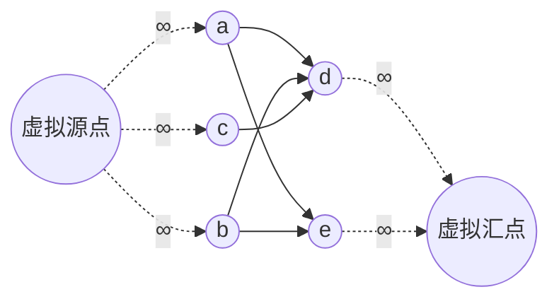

**Cut 割**：$`a\in P,z\in\overline P`$，$`\overline P=V-P`$，则

```math
S=(P,\overline P)=\{(v,w)\in E\mid v\in P,w\in\overline P\}.
```

$`S`$ 中的有序对必须是图中实际存在的边。
