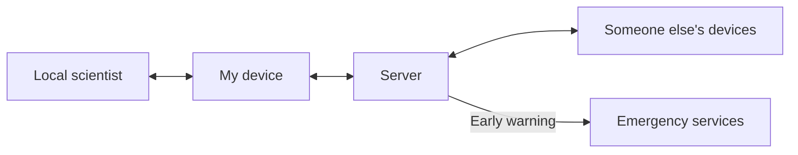
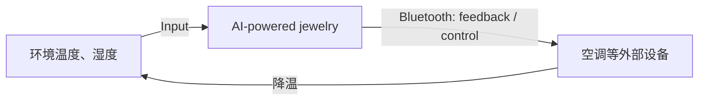
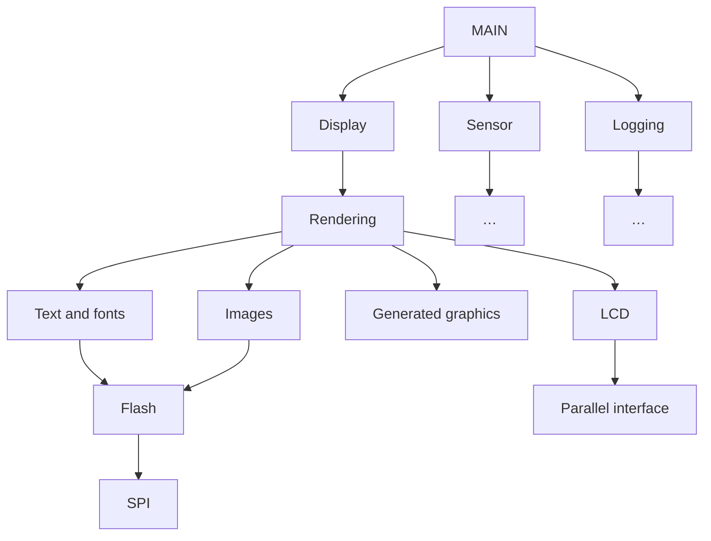
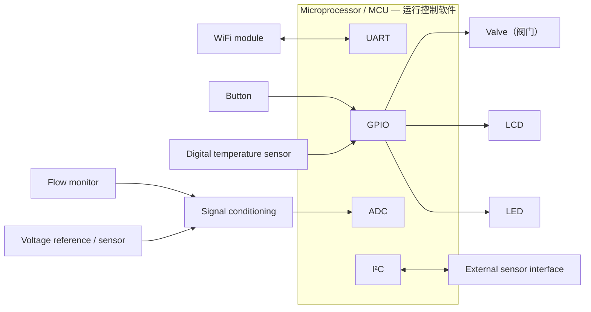
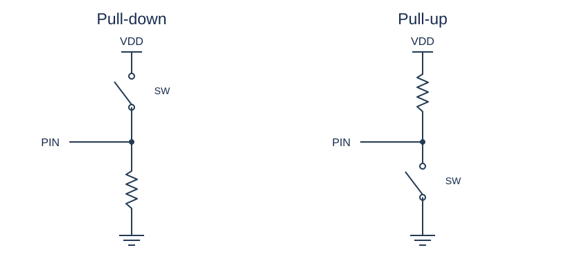
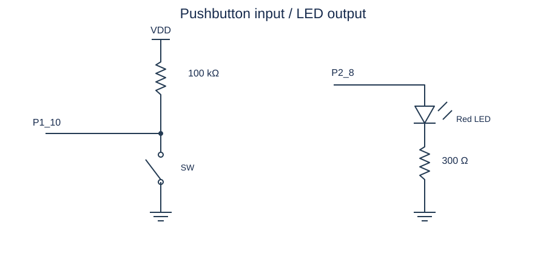
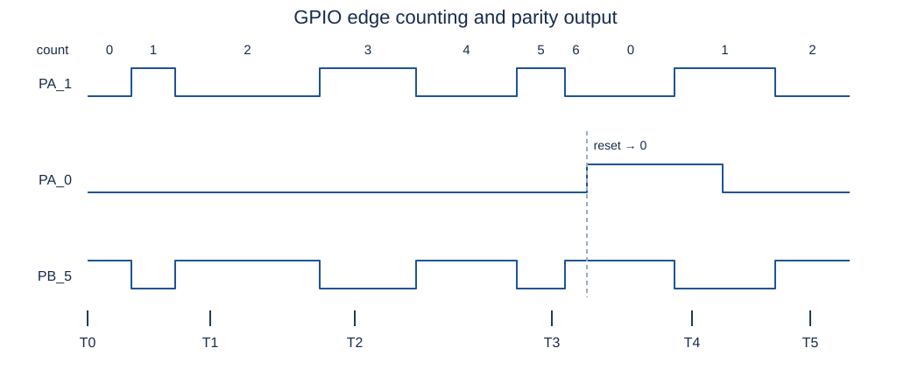
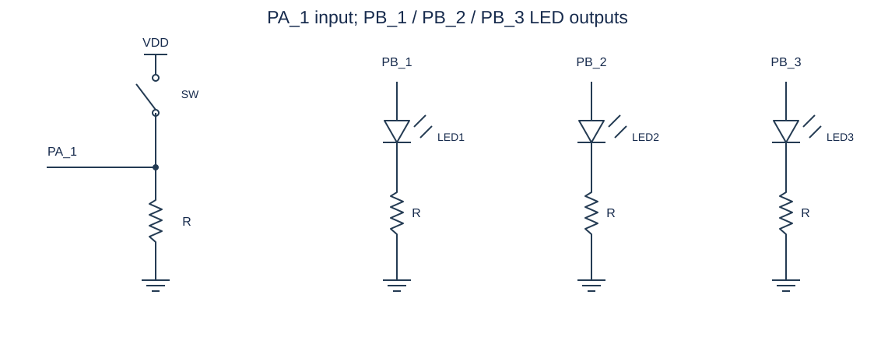
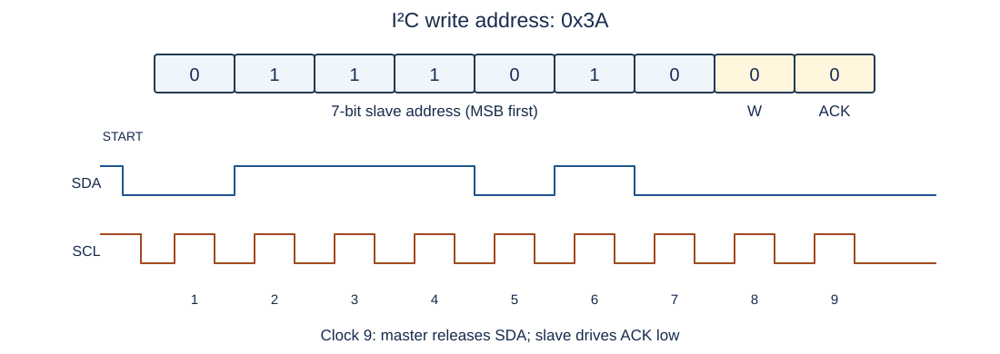
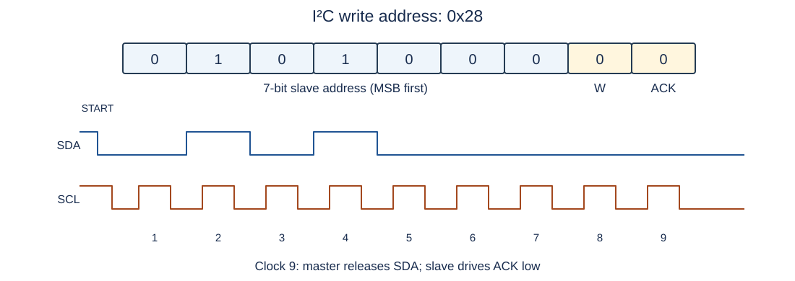

# Embedded Systems · 提纲

## 第一周

### 1. 基础概念

#### What is an Embedded System？

- An embedded system is a computerised system that is purpose-built for its application.

- An embedded system has less support for things that are unrelated to accomplishing the job at hand. The hardware often has constraints.

  完成特定任务之外的功能支持较少，硬件受限。

- The embedded software must act exactly the same each time or in real time

  每次执行都完全一致，实时响应

- Some systems require that the software be fault-tolerant, with graceful degradation in the face of errors.

  容错能力，优雅化解

/media/image1.png>)

**In a typical low-cost embedded system, which components are commonly used for collecting, processing and distributing data? Provide example of an embedded system using these components and explain their functionality in your proposed system.**

**Example: Smart Temperature Monitoring System**

1. **Collecting Data**: A temperature sensor (e.gLM35 or DHT11) measures the temperature.

2. **Processing Data**: The microcontroller (e.g., STM32) reads the sensor data via an ADC and processes it.

3. **Distributing Data**: The processed data is displayed on an LCD screen.

#### Why XX is an Embedded System？

- Function：以Rice cooker为例

  It uses timers to create accurate timing in cooking

  intelligent control of temperature by software/programs

- Constraints：Size、Cost、Power and Energy、Weight、Reliability

- Input：button、button、valve

- Output：LCD、LED

- Low/High performance MCU（Microcontroller Unit，单片机）

#### What are the Attributes of Embedded System？

- Interfacing with larger system and environment

- Concurrent, reactive behaviours

- Fault handling & Diagnostics

#### What are the Applications of Embedded System？Give examples.

- Closed-loop control system 闭环，Motor Speed Control

- Sequencing 顺序，Washing Machine Controller

- Signal processing Digital Hearing Aids（助听器）

- Communications and networking home monitoring

#### What are the Benefits of Embedded Systems？

- Greater performance and efficiency

- Lower costs

- Better dependability

#### What are the Constraints of Embedded Design？

- Cost

- Computation

- Size and weight limits

- Power and energy limits

- Environment

#### What is the Impact of Constraints in Embedded System？

/media/image2.png>)

### 2. 系统图

#### 三个图

- **Context diagram**: what you’re supposed to do.
- **Block diagram**: pieces of HW and SW.
- **Organigram**: shows where control flows and possible conflicts as multiple subsystems try to access the same resources.

#### Context diagram

画输入、输出以及与外部实体的交互，不要画出内部组件



Context diagram：AI-powered jewelry。设备感知温度、湿度，并通过 Bluetooth 向外部系统发送反馈；例如温度过高时，控制空调降温。



/media/image5.png>)

#### Block diagram

要画出内部组件，包括软件和硬件，可以一起画，把μP放在图中间。可以参考下面的练习题的最后一问

#### Organigram



SPI（Serial Peripheral Interface，串行外设接口）用于模块间的通信

#### 热水器练习题

/media/image7.png>)

**What are the input and output devices?**

- input ：cold water、Thermometer、Temperature Setpoint

- output ：hot water、Heating Element、LCD display

**Name one safety feature to include, and specify what hardware and/or software is needed.**

- Overheat Protection

- Waterline control

**Describe a useful energy-saving feature which could you add in software if the controller could keep track the time of day.**

Use solar energy to heat the water

**Describe a useful feature which could you add in software if the water heater included an internet connection.**

Remote control heating

**Draft a block diagram (hardware-software) for the controller.**



这张 block diagram 将硬件和软件放在一起画：microprocessor 是硬件，内部运行控制软件，其余模块表示连接的外围硬件。

##### 中间：微处理器

- **UART（串口通信）**：用于与外部设备通信，比如WiFi模块。

- **GPIO（通用输入输出）**：用来控制按钮、阀门（控制液体流动的开关）、LED等设备。

- **ADC（模数转换）**：用于读取模拟传感器的数据，比如温度传感器、流量监测等。

- **I²C（I2C通信）**：用于连接某些智能传感器或LCD显示屏。

##### 右边：输入和输出

GPIO连接输入和输出

输入：

- **Button/valve**：用户可以通过按键/阀门来触发某些功能。

- **Temperature sensor**：温度传感器

输出：

- **LCD**：显示文字和数字。
- **LED**：不同颜色的灯，显示系统的运行状态。

##### 左边：传感器接口

ADC和I²C连接：

- **Signal Conditioning**：处理传感器采集的原始信号

- **Flow monitor**：流量监测器，检测液体流量的数据

- **Voltage reference sensor**：电压参考传感器，用于提供稳定的电压基准，确保系统测量准确。

UART连接：

WIFI

### 3. Designing for Change

- No design will remain static.

- Encapsulate Modules 封装模块

- Delegation of Tasks 裁切任务

### 4. Architecture

#### Draw Von Neumann Architecture（3-box model）

/media/image9.png>)

了解：

- **Data Bus**：负责在存储器、CPU 和 I/O 设备之间传输数据。

- **Address Bus**：负责指定存储单元的地址，用来告诉存储器或 I/O 设备，数据应该从哪里读取或者存储到哪里。

- **Control Bus**：负责发送控制信号，指示数据的读/写方向、时序控制等。

#### Draw Harvard Architecture

It Separates instruction and data memories each with dedicated bus

/media/image10.png>)

#### How CPU execute the instructions？

/media/image11.png>)

perform a sequence of calculations就是回答How CPU execute the instructions？

/media/image12.png>)

1. **Fetch** – retrieve an instruction from memory.
2. **Decode** – interpret the instruction.
3. **Execute** – control appropriate hardware to carry out the instruction.

### 5. The Assembly Language Syntax

**基础概念**

/media/image13.png>)

/media/image14.png>)

操作数可能不止两个

举例：

/media/image15.png>)

/media/image16.png>)

/media/image17.png>)

/media/image18.png>)

#### Why is the number of registers small and limited?

Smaller is faster. A very large number of registers may increase the clock cycle time.

### 6. ARM

/media/image19.png>)

#### What are the advantages of ARM Cortex-M Series？

- Energy-efficiency: lower energy cost, longer battery life

- Smaller code: lower silicon costs

- Ease of use: faster software development and reuse

- Embedded applications

#### Cortex-M4 Memory Map

Cortex-M4 processor has a 4GB memory space.

/media/image20.png>)

#### 一些特征

/media/image21.png>)

/media/image22.png>)

## 第二周

### 1. 指令

指令和 SysTick 寄存器可查阅 [Cortex-M4 Devices Generic User Guide](https://documentation-service.arm.com/static/5f2ac4ab60a93e65927bbdbf)。

- 每个地址存 **1 byte** 的数据。
- **R0、R1** 是寄存器。
- **MOV** 可直接加载可编码的立即数；较大的常量可用 **LDR** 伪指令加载。

\[A+B\]，括号里面是地址，括号外面是值，\[ \]代表取这个地址的值，A和B都是地址的值

LDR、LDRB、LDRH都是LDR

加载/存储指令在寄存器与内存数据之间传送值；是否更新基址寄存器取决于寻址形式。

\|Label1\|是一个地址

LDRB会把有符号的数转化成无符号的数

/media/image23.png>)

**`LDR R0, [R1]`**

Load，把 R1 中地址所指向的内存值加载给 R0。

**`STR R0, [R1]`**

Store，把 R0 的值存入 R1 中地址所指向的内存。

**`LDR R0, [R1, #0x4]`**

把（R1存的值+4 byte）的地址存的值加载给R0

`0x` 表示十六进制（hexadecimal）。

/media/image24.png>)

**`LDR R1, [R0, R2]`**

把（R0存储的值+R2储存的值）的地址的值加载给R1

R0存的是基地址，R2存的是offset

**`LDR R3, [R0, R2, LSL #2]`**

把（R0 存的值 + R2 存的值左移 2 位，也就是 4 倍的 R2）所指向地址的值加载给 R3。

/media/image25.png>)

**LDR R0, \|Label1\|**

\|Label1\|是一个地址，赋值给 R0

实际操作是：LDR R0, \[PC, \#offset\]。PC是register，Label1 =PC +offset，offset是由assembler自动计算的。

比如，假设PC地址是0x08001190，offset是0x10，那么Lable1地址就是0x080011A0。十六进制加法的计算法则是将每1个数转化为4个二进制数

**LDR r3, \|L1.272\|**

数组指针赋值给R3

**LDRD r1, r0, \[sp, \#offset\]**

一共读取2个4 bytes的数，存入两个register

- 从 `[sp + offset]` 读取 4 bytes，存入第一个目标寄存器 r1。
- 从 `[sp + offset + 4]` 读取 4 bytes，存入第二个目标寄存器 r0。

**MOV R0, \#5**

直接把 5 存入 R0

**DCD**

/media/image26.png>)

定义Label1，并在这个位置存储一个 32 位的常量 0x12345678。

/media/image27.png>)

定义L1.272，存储数组 buff2 的地址

**LDRB r3, \[r3, \#0\]**

从 r3 指向的内存地址 读取1 byte到 r3 寄存器中，并且高位补 0。

**ADDS r0,r3,r4**

r0=r3+r4

**ADD**

加法运算与 ADDS 相同；ADDS 会更新条件标志，ADD 不更新。

**LSL R0, R0, \#8**

Logical Shift Left

8/4=2

二进制R0左移8位，二进制左移8位等于十六进制左移2位

十六进制R0右边补两个0，相当于乘2的八次方

**LSLS**

移位用法与 LSL 相同，LSLS 还会更新条件标志。

**LSRS**

Logic shift right，二进制右移2位，相当于/4

**MULS r0, r1, r0**

`r0 = r1 * r0`

**SUB R0, R1, R2**

R0 = R1 - R2

**SUB SP, SP, \#0x20**

在栈上分配 32 字节（存放 x\[8\]）

**STR r2, \[sp, \#0x4\]**

R2的值放入（sp+0x4）地址

**SXTB Rd, Rm**

将 Rm 的右边8 位做符号扩展到 Rd

/media/image28.png>)

1110 1101=-128+64+32+8+4+1=-19

正数扩展

R0（0x7F）转化为2进制，第八位是0，即正数，因此R1剩余位补零

/media/image29.png>)

负数扩展

/media/image30.png>)

R0（0x90）转化为2进制，第八位是1，即负数，因此R1剩余位补F

**MVN r0, \#0x0D**

取反赋值，0D 是 13，r0 = -14

### 2. Addressing Modes and Data Access

#### uint

- `uint8 buff2[3]`：这个数组里的元素是 uint8 类型（无符号的 8 bits 整数）。
- `uint16 buff3[5][7]`：这个数组里的最小元素是 uint16 类型（无符号的 16 bits 整数）。

#### 1-D Array

假设每个元素是1 byte

/media/image31.png>)

1. `MOV r2, r0`：将 n（r0）复制到 r2。
2. `LDR r3, [L1.272]`：加载 buff2 的地址到 r3。
3. `LDRB r3, [r3, #0]`：读取 buff2[0] 存入 r3。
4. `LDR r4, [L1.272]`：再次加载 buff2 的地址到 r4。
5. `LDRB r4, [r4, r2]`：读取 buff2[n] 存入 r4。
6. `ADDS r0, r3, r4`：计算 buff2[0] + buff2[n]，结果存入 r0。

/media/image27.png>)

#### 2-D Array

buff3\[row\]\[col\] = buff3 + row index × row size + col index × 元素大小

/media/image32.png>)

每个 元素占 2 bytes，整行大小 = 7 × 2 = 14 字节

buff3\[row\]\[col\] = buff3 + row × 14 + col × 2

#### 二维数组指令

/media/image33.png>)

目标：i = i + buff3\[n\]\[j\]

| 指令 | 操作 |
|---|---|
| `MOVS r3, #0xE` | `r3 = 0xE (14)` |
| `MULS r3, r2, r3` | `r3 = n * 0xE` |
| `LDR r4, \|L1.276\|` | `r4 = &buff3` |
| `ADDS r3, r3, r4` | `r3 = &buff3 + n * 0xE` |
| `LSLS r4, r1, #1` | `r4 = j << 1`，即 `j * 2` |
| `LDRH r3, [r3, r4]` | 读取 `&buff3 + n * 0xE + (j << 1)` 地址中的值，即 `r3 = buff3[n][j]` |
| `ADDS r0, r3, r0` | `r0 += buff3[n][j]` |

### 3. Branching and Control Flow

#### ARM Thumb-2 指令长度

1 word = 4 bytes

Hf是half word

当指令无法用 2 bytes（half word）表示时，将使用4 bytes（1 word）表示

hw1长half word，hw2长half word，hw1和hw2都是指令

4个十六进制的数是1个half word

#### Program Counter and Fetch

硬件内部，PC 实时指向当前指令的地址。在执行过程中，每取回一个half word（2 byte），PC 的值就会递增 2

hw1是0x08000190，hw2是0x08000192

/media/image34.png>)

- **32 bits（1 word）指令**：先取低位 hw1，再取高位 hw2。
- **16 bits（half word）指令**：只取 hw1。

#### Branch Instructions

Branch就是跳转到其他指令

L（Link）代表要保存到LR ，X（exchange）可以理解为跳转到Rm的地址（如BX Rm）

返回地址（Return Address）通常是下一条要执行的指令的地址

| Mnemonic           | Operation                                     |
|--------------------|-----------------------------------------------|
| B \<label\>        | 直接跳转到 \<label\> 位置，执行目标地址的代码 |
| B\<cc\> \<label\>  | 根据 \<cc\> 条件进行跳转                      |
| BL \<label\>       | 跳转并返回地址存入LR                          |
| BX Rm（比如BX LR） | 跳转到Rm 存储的地址                           |
| BLX Rm             | 跳转到Rm 存储的地址，并会把返回地址存入 LR    |

#### while结构

/media/image35.png>)

/media/image36.png>)

#### if-else 结构

/media/image37.png>)

/media/image38.png>)

### 4. Stack

#### Stack Memory

SP 存的是stack顶地址

stack的增长方向是从高地址向低地址（SP递减）

- PUSH

  SP = SP – 4，然后在新的地址存储值

- POP

  在SP地址读取值，SP = SP + 4

- PUSH {R0, R4-R7}

  将R0, R4, R5, R6, R7的值压入stack

- POP {R2-R3, R5}

  将值从堆栈弹出到R2, R3, R5

#### PUSH 指令示例

/media/image39.png>)

地址是上面高，下面低

ARM 的 PUSH 指令会按照register编号从大到小入栈

PUSH {R0, R3} 先存 R3，再存 R0

因此，register编号较小的，对应的内存地址也较低

#### POP 指令示例

/media/image40.png>)

POP顺序和 PUSH 相反，会按照register编号从小到大出栈

POP {R0, R3}先恢复R0，再恢复R3

**SUB SP, SP, \#0x20**

在栈上分配 32 字节（存放 x\[8\]）

### 5. Function

#### 什么是LR？

LR register记录了函数返回后下一条指令的地址，通常是+4（LR: Storing the Return Address）

#### BL 指令的执行过程

/media/image41.png>)

BL.W func1

1. 软件角度，下一条指令（MOV R1, R0）的地址放在 PC 中

2. PC 的值被复制到 LR，并设置 bit\[0\] = 1，表示 Thumb 模式

3. PC存放被调用函数的地址

#### BX LR 指令的执行过程

**BX LR 返回示意。** 调用点为 `0x08000190: BL.W func1`，下一条指令为 `0x08000194: MOV R1, R0`。`LR=0x08000195` 的 bit 0 为 1，表示 Thumb 状态；执行 `BX LR` 时，实际跳转地址清除最低位，返回 `0x08000194`。

| Code address | Instruction |
|---|---|
| 0x08000100 | func1 起点 |
| … | … |
| 0x0800012C | BX LR |
| … | … |
| 0x08000190 | BL.W func1 |
| 0x08000194 | MOV R1, R0 |

`BX LR` 为 16-bit 指令，其顺序下一地址是 `0x0800012E`（加 2）；实际控制流由 BX 改为跳转到返回地址。

BX LR

1. 检查 LR 的 bit\[0\]

   - 如果 bit[0] = 1，保持 Thumb 模式。
   - Cortex-M4 只支持 Thumb 状态；若目标 bit[0] = 0，会导致状态错误，而不会切换到 ARM 模式。

2. PC = LR（去掉 bit\[0\]）

#### 函数执行的总结

调用时PC存入 LR，返回时用 LR恢复PC

#### Register的变化

- R0-R3 用于传递参数和存放返回值，调用函数后可能会变。

  R0一般存放了函数的返回值

- R4-R8、R10-R11 需要保持原值，如果在函数里用了，就要先存起来，结束时再恢复。

  /media/image43.png>)

#### Function Call Example

/media/image44.png>)

/media/image45.png>)

1. 前 4 个参数（arg1, 4, 5, 6）存入寄存器 r0 - r3。超过 4 个参数的值 会存入stack（但这里 func2 只有 4 个参数，所以用不到stack）。

2. 当 func2 计算完毕后，返回值会存入 r0

   /media/image46.png>)

   /media/image47.png>)

   BX lr就是BX LR，这里只有返回至下一条指令的意思，没有返回r0的意思， r0已经存储了函数的计算结果，调用者知道 r0 里存着返回值，因此 BL func2 之后可以直接使用 r0，不需要返回r0

存在的问题：

- r4保存着func1的arg2，但是func2中调用了MULS，我们也不知道r4是否会被改变

  r4 is not preserved by func1()

- func1的LR被func2 覆盖（over-written）了，无法正常返回

  LR for func1() is over-written when func2() is called!

如何解决以上问题？

func1 需要在调用 func2 前将 r4 和 LR 的值保存到 stack 上，并在 func2 返回后恢复它们。

```asm
PUSH {r4, lr}       ; 保存 r4 和返回地址
MOVS r4, r1         ; r4 = arg2，跨函数调用保存
                    ; r0 已经是 arg1（第 1 个参数）
MOVS r1, #4         ; 第 2 个参数
MOVS r2, #5         ; 第 3 个参数
MOVS r3, #6         ; 第 4 个参数
BL func2           ; 调用 func2，返回值在 r0
ADDS r0, r0, r4     ; r0 = func2() + arg2
POP {r4, pc}       ; 恢复 r4，并返回调用点
```

#### Prolog 和 Epilog

r4 - r8, r10 - r11，LR必须进入stack，保持不变

```asm
fun4 PROC
    ; Prologue：保存寄存器，分配栈帧
    PUSH {r4, lr}       ; 保护 r4 和 lr（返回地址）
    SUB sp, sp, #0x20   ; 分配 32 字节，用于 x[8]

    ADDS r0, r3, r1     ; r0 = a + b
    ADDS r0, r0, r2     ; r0 = (a + b) + c

    ; Epilogue：释放栈帧，恢复并返回
    ADD sp, sp, #0x20
    POP {r4, pc}
ENDP
```

Prolog的stack操作图：

/media/image50.png>)

Epilog的stack操作图：

/media/image51.png>)

#### 寄存器与栈练习一

/media/image52.png>)

1. R0=0x12，每次执行，PC+=2

   /media/image53.png>)

2. R0左移8位，8/4=2，二进制左移8位等于十六进制左移2位，PC+=2

   /media/image54.png>)

3. R1=0x34，PC+=2

   /media/image55.png>)

4. R2=R0+R1，PC+=2

   /media/image56.png>)

5. R2的值放入（sp+0x4）地址

   /media/image57.png>)

#### 寄存器与栈练习二

/media/image58.png>)

1. PUSH {r4-r6, lr}

   Save r4，r5，r6，lr to stack

2. SUB sp, sp, \#0x18

   Allocates 24 bytes on the stack for local variables.

3. MOV r4, r0；MOV r5, r1；MOV r6, r2

   a, b, c was originally in r0, r1, r2.

   Then, a is copied to r4.

   b is copied to r5.

   c is copied to r6.

/media/image59.png>)

1. MOVS r0, \#0x0F

   Move 0x0F(15) into r0.

   r0 = 15

2. STR r0, \[sp, \#0x14\]

   Store r0’s value at address(sp+0x14)

   \[sp+0x14\] = 15

3. MOVS r0, \#0xF2

   Move 0xF2 (242) into r0; its low byte is the 8-bit representation of -14.

   r0 = 242 (0x000000F2)

4. STR r0, \[sp, \#0x10\]

   Store r0’s value at sp+0x10

   `[sp+0x10] = 242`；最低字节 `0xF2` 按有符号 8-bit 数解释为 -14

5. LDRB r0, \[sp, \#0x14\]

   Load one byte from sp+0x14 into r0.

   r0 = 0x0F (15)

6. LDRB r1, \[sp, \#0x10\]

   Load one byte from sp+0x10 into r1.

   r1 = 0xF2 (242)

7. MULS r0, r1, r0

   Multiply r1 by r0, and store the result in r0

   r0 = r1 \* r0=3630 (0x0E2E)

8. SXTB r0, r0

   Sign Extend Byte

   2E=00101110， 因此扩充0，r0 = 00101110 = 46

9. STRB r0, \[r4, \#0x00\]

   Put r0’s value into the memory location that r4 points to.

   \[r4\] = 46 (0x2E)

/media/image60.png>)

1. MOVS r0, \#0x0F

   r0 = 0x0F = 15

2. STR r0, \[sp, \#0x0C\]

   \[sp + 0x0C\] = 15

3. MVN r0, \#0x0D

   MVN是取反赋值，0D 是 13，取反后是-14

   r0 = -14

4. STR r0, \[sp, \#0x08\]

   \[sp + 0x08\] = -14

5. LDRD r1, r0, \[sp, \#0x08\]

   r1 = \[sp + 0x08\] = -14

   r0 = \[sp + 0x0C\] = 15

6. MULS r0, r1, r0

   r0 = -14 \* 15 = -210

7. STR r0, \[r5, \#0x00\]

   \[r5+0x00\] = -210

不同：

- Snippet \#3 uses 32-bit integer operations, making it more suitable for handling standard integers. Data is not lost, and the computation is more efficient.

- Snippet \#2 uses 8-bit data operations, but it requires SXTB to extend negative numbers. Additionally, data loss (overflow issue) may occur when storing the final result.

/media/image61.png>)

了解即可

1. LDR r0, \[pc, \#20\]

   R0=\[pc+20\]，R0=15.0f

2. STR r0, \[sp, \#0x04\]

   将r0的值（15）存入栈中的偏移0x04处，相当于push

3. LDR r0, \[pc, \#20\]

   R0=\[pc+20\]，R0=-14

4. STR r0, \[sp, \#0x00\]

   将r0的值（-14）存入栈中的偏移0x00处，相当于push

5. LDRD r1, r0, \[sp, \#0\]

   R0 = -14

   R1 = 15

6. BL.W \_\_aeabi_fmul

   将r0, r1的值相乘，并返回结果到r0

7. STR r0, \[r6, \#0x00\]

   \[R6\]=R0

8. ADD sp, sp, \#0x18

   释放stack空间（24 字节）

9. POP {r4-r6, pc}

   Return

/media/image62.png>)

了解即可

| PUSH {r1-r3, lr} | 将 r1、r2、r3 和 lr 入栈                               |
|------------------|--------------------------------------------------------|
| MOV r2, sp       | 将res1的地址放入 r2                                    |
| ADD r1, sp       | 将res2的地址放入r1                                     |
| ADD r0, sp       | 将res3的地址放入r0                                     |
| BL.W fn          | 调用函数 fn()，这个函数的参数是register在stack中的地址 |
| NOP              | 空指令                                                 |
| B 0x080003CC     | 无条件跳转回 0x080003CC，形成死循环                    |

### 6. Interrupts

#### What is the process of handling interrupt？

1. IRQ（interrupt request）happens

2. The processor saves the context

3. The processor finds the function associated with the interrupt in the vector table.

4. The ISR（interrupt service routine） runs

5. The processor restores the saved context

#### 2 Types of Interrupts

- small high-priority tasks，Once their ISR is complete, the processor restores the context it saved and continues on its way as though nothing had happened.

- exceptions, handling system faults and never returning to normal execution.

#### What is Nonmaskable interrupts (NMI)?

Those are so important that they cannot be disabled.

#### What are the advantages of Interrupt？

- Efficient

  code runs only when necessary

- Fast

  hardware mechanism

- Scales well

  ISR response time doesn’t depend on most other processing.

  Code modules can be developed independently

#### What is interrupt latency？

$`T_{ISR\,start}-T_{IRQ}`$

#### Interrupt前后stack的变化

/media/image63.png>)

#### EXC_RETURN

当发生异常（比如中断）时，EXC_RETURN 值 存入 LR，它告诉了where to return when the exception finishes

- **Return Mode**：返回的模式。
- **Return Stack**：要用哪个 stack（MSP or PSP）恢复。

| EXC_RETURN | Return mode | Return stack | Description |
|---|---|---|---|
| 0xFFFF_FFF1 | Handler | MSP | Return to exception handler，返回被抢占的异常处理程序 |
| 0xFFFF_FFF9 | Thread | MSP | Return to thread with MSP |
| 0xFFFF_FFFD | Thread | PSP | Return to thread with PSP |

Handler 对应异常处理上下文；Thread 对应普通线程上下文。

/media/image65.png>)

#### Maximum Interrupt Rate

/media/image66.png>)

- **Fcpu**：1 s 有多少时钟周期。
- **Fint**：1 s 有多少次 interrupt。
- **Cisr + Coverhead**：一次 interrupt 要用多少时钟周期。

如果给定Fcpu和Cisr+Coverhead，那一次interrupt的时间就是（Cisr+Coverhead）/Fcpu

比如：

/media/image67.png>)

/media/image68.png>)

/media/image69.png>)

/media/image70.png>)

/media/image71.png>)

#### 时间延迟练习题（以时间为分母）

/media/image72.png>)

给定 $`F_{CPU}=48\times10^6\ \mathrm{Hz}`$，$`F_{int}=10\times10^3\ \mathrm{Hz}`$，$`T_{ISR}=14.9\ \mu s`$，$`T_{overhead}=1\ \mu s`$。

(a) 每次中断总时间：

```math
T=T_{ISR}+T_{overhead}=15.9\ \mu s.
```

一秒内用于中断的时间：

```math
T_0=T F_{int}=15.9\times10^{-6}\times10^4=0.159\ \mathrm{s}=159\ \mathrm{ms}.
```

```math
U_{int}=\frac{159\ \mathrm{ms}}{1000\ \mathrm{ms}}\times100\%=15.9\%.
```

Hz 表示一秒发生多少次；159 ms 表示一秒内共有 159 ms 用于中断。

(b) Main loop 可用比例：$`1-15.9\%=84.1\%`$。

(c) Main loop 每次需要 37 ms，运行频率：

```math
f_{loop}=\frac{841\ \mathrm{ms}}{37\ \mathrm{ms}}\ \mathrm{Hz}\approx22.7\ \mathrm{Hz}.
```

给定 $`F_{CPU}=48\times10^6\ \mathrm{Hz}`$，$`F_{int}=25\times10^3\ \mathrm{Hz}`$，$`T_{ISR}=34\ \mu s`$，$`T_{overhead}=1\ \mu s`$。

(d) 每次中断用时 $`34+1=35\ \mu s`$，一秒内中断占用：

```math
35\times10^{-6}\times25\times10^3=0.875\ \mathrm{s}=875\ \mathrm{ms},\qquad U_{int}=87.5\%.
```

(e) Main loop 可用比例：$`1-87.5\%=12.5\%`$。

(f) Main loop 的频率：

```math
f_{loop}=\frac{125\ \mathrm{ms}}{37\ \mathrm{ms}}\ \mathrm{Hz}\approx3.38\ \mathrm{Hz}.
```

#### How much work to do in ISR?

/media/image75.png>)

#### 中断控制函数

| enable_irq() | 清除 PRIMASK，允许中断 |
|----|----|
| disable_irq() | 设置 PRIMASK，屏蔽中断 |
| get_PRIMASK() | 获取 PRIMASK 当前值 |
| set_PRIMASK(uint32_t x) | 设置 PRIMASK（x = 1 禁用中断，x = 0 使能中断） |
| EnableIRQ(IRQn_Type IRQn) | 允许指定中断 |
| DisableIRQ(IRQn_Type IRQn) | 禁用指定中断 |
| SetPendingIRQ(IRQn_Type IRQn) | 设置中断为 挂起状态 (Pending) |
| ClearPendingIRQ(IRQn_Type IRQn) | 清除挂起状态 (Pending) |

#### 优先级

Cortex-M4 采用 “数值越小，优先级越高” 的策略

/media/image76.png>)

/media/image77.png>)

#### 异常进入：寄存器与栈

/media/image78.png>)

Write down the values for the registers, after responding to exception request and before executing the first instruction exception handler:

/media/image79.png>)

1. R0到R12保持不变，PRIMASK保持不变，Privilege和Stack保持不变

2. Mode有两种，一种是Handler，一种是Thread，题目中说executing the first instruction exception handler exception handler，所以新Mode是Handler

3. 进入interrupt，会把R0、R1、R2、R3、R12、R14、R15、xPSR这八个registers压入stack，4\*8=32（十进制）=20（十六进制），所以0x2000_0FF4（旧SP）- 20 = 0x2000_0FD4，这是新的SP

4. 之前的mode是main，所以之后也是用MSP，MSP=新的SP=0x2000_0FD4，PSP是n/a

5. LR存放着函数返回后下一条指令的地址，因为进入 IRQ 前处于 Thread mode、使用主栈MSP，之后也会保持不变。根据以下图片，因为return mode是Thread mode，return stack是MSP，根据EXC_RETURN，所以新LR=0xFFFF_FFF9

   /media/image80.png>)

6. PC存放着下一条指令的地址，因为题目给的是IRQ2,所以Exception Number=2+16=18，根据表格找到对应的value，新R15 (PC) = 0x0000_1351

7. 新xPSR= 0x0100_0000+exception number=0x0100_0000+18（十进制）=0x0100_0000+0x12（十六进制）=0x0100_0012

   /media/image81.png>)

Also write down the addresses and contents of the stack area.

/media/image82.png>)

遇到interrupt，会把R0、R1、R2、R3、R12、R14、R15、xPSR这八个registers压入stack

上面是小地址，下面是大地址，小寄存器放上面，大寄存器放下面

1. 开始的SP是0x2000_0FF4，每次-4，存新值。因此Address从最下面的0x2000_0FF0，可以到上面的0x2000_0FD4

2. R0、R1、R2、R3、R12、R14、R15、xPSR这八个的Value就是之前存的值，保持不变，除此之外，再存入一个previous LR，它的value是EXC_RETURN

   /media/image83.png>)

   下面是答案，第一行可以不写，不然上一题的SP也需要更新

   /media/image820.png)

   /media/image84.png>)

#### 异常返回：寄存器与栈

调试器中的当前寄存器与栈：

| Register | Value | Register | Value |
|---|---|---|---|
| R0 | 0x00000001 | R8 | 0x9CFFF76F |
| R1 | 0x00040001 | R9 | 0x20000768 |
| R2 | 0x40040400 | R10 | 0x000011EC |
| R3 | 0x00000001 | R11 | 0x000011EC |
| R4 | 0x00040001 | R12 | 0x0FFFF0AA |
| R5 | 0x000011EC | R13 (SP) | 0x20000FC8 |
| R6 | 0x00000000 | R14 (LR) | 0xFFFFFFF9 |
| R7 | 0x000011BB | R15 (PC) | 0x00000CC4 |
| xPSR | 0x01000010 | Mode / Stack | Handler / MSP |

| Memory address | Value | 内容 |
|---|---|---|
| 0x20000FC8 | 0x00040001 | 当前 SP 指向；软件保存的 R4 |
| 0x20000FCC | 0xFFFFFFF9 | 软件保存的 LR / EXC_RETURN |
| 0x20000FD0 | 0x00000001 | 硬件异常栈帧：R0 |
| 0x20000FD4 | 0x00040001 | R1 |
| 0x20000FD8 | 0x40040400 | R2 |
| 0x20000FDC | 0x00000001 | R3 |
| 0x20000FE0 | 0x0FFFF0AA | R12 |
| 0x20000FE4 | 0x00000B39 | LR |
| 0x20000FE8 | 0x00000B38 | PC |
| 0x20000FEC | 0x01000200 | xPSR |
| 0x20000FF0 | 0x00000B39 | 后续栈内容 |
| 0x20000FF4 | 0x00000002 | 后续栈内容 |
| 0x20000FF8 | 0x000011EC | 后续栈内容 |
| 0x20000FFC | 0x00000E73 | 后续栈内容 |
| 0x20001000 | 0x000011EC | 后续内存 |
| 0x20001004 | 0x00000E73 | 后续内存 |
| 0x20001008 | 0x682D4D32 | 后续内存 |
| 0x2000100C | 0x428C5D2C | 后续内存 |
| 0x20001010 | 0x4C31DAE9 | 后续内存 |
| 0x20001014 | 0x622361E2 | 后续内存 |
| 0x20001018 | 0xB510BD30 | 后续内存 |
| 0x2000101C | 0x6800482F | 后续内存 |
| 0x20001020 | 0x04892101 | 后续内存 |

/media/image86.png>)

1. When ISR executes，the current SP is 0x20000FC8. So after POP {R4, PC}，R4 = 0x00040001，PC = 0xFFFFFFF9

2. When the ISR finishes, BX LR will be executed. LR stores the EXC_RETURN value（0xFFFF_FFF9）, the processor recognizes it as an exception return address.

3. Then the processor restores the context from the stack, so the return address will be 00000B38

   /media/image65.png>)

   /media/image87.png>)

## 第三周

### 1. I/O

#### I/O Styles in Microprocessors

- **Microprocessor**：主要用 Memory-Mapped I/O，需要通过外部芯片（如控制器、计数器、定时器等）扩展功能。
- **Microcontroller**：所有功能（如 RAM、ROM、I/O 端口、定时器）都集成在一个芯片里。

/media/image88.png>)

### 2. GPIO

**GPIO（General-Purpose Input/Output）**

- Input: program can determine if input signal is a 1 or a 0

- Output: program can set output to 1 or 0

STM32有很多digital ports，比如GPIO1, GPIO2, GPIO3, ...

每个port有16bits，因此有16个 electrical pins，每个pin可以设置为输入或者输出，或者其他功能（串口通信（UART）、模拟输入（ADC）、模拟输出（DAC）、定时器（PWM 输出等）、SPI/I2C 接口）

#### GPIO Input

有两种模式，Pull-up、Pull-down

电阻在上，pull-up



- **Pull-down**：输入引脚经电阻接地，开关断开时为 0，接通 VDD 时为 1。
- **Pull-up**：输入引脚经电阻接 VDD，开关断开时为 1，接地时为 0。

图中开关可由晶体管实现；PINMUX 接 MCU 的输入引脚。

在Pull-up模式中，pin value is:

- High when switch is not pressed

- Low when switch is pressed

#### Mode Register

Mode Register用于设置GPIO pin的功能

| 配置 | Mode |
|---|---|
| 00 | Input (reset state)，默认状态 |
| 01 | General purpose output mode |
| 10 | Alternate function mode |
| 11 | Analog mode |

Mode Register有0-31 bits，每2个bits是一个pin。

#### PUPDR Register

**Pull-up/Pull-down register**，用于控制 GPIO pin 是否使用 Pull-up 或 Pull-down 电阻：

- **00**：不使用 Pull-up 或 Pull-down 电阻（默认状态）。
- **01**：使用上拉电阻。
- **10**：使用下拉电阻。

PUPDR有0-31 bits，每2个bits是一个pin。

#### IDR/ODR Register

Input data register、Output data register

- **IDR**：读取 GPIO pin 的输入状态。
- **ODR**：读写 GPIO pin 的输出数据。

IDR和ODR有0-15 bits，每1个bit是一个pin。

#### GPIO 配置与读数练习

**Pin P2_6 is configured as input and connected to a switch; which of the following register readings is possible when the switch is pressed?**

- **A**：`PUPDR_2=0x9A85; IDR_2=0x0`
- **B**：`PUPDR_2=0xA942; IDR_2=0x40`
- **C**：`PUPDR_2=0xCA85; IDR_2=0x0`
- **D**：None

P2_6的意思是，port=2，pin=6，第2个port上的第6个pin。

PUPDR_2是控制port=2的PUPDR，控制电阻Pull-up/Pull-down。

IDR_2=0x0是读取port=2的IDR，读取输入

PUPDR有0-31 bits，每2个bits是一个pin。

IDR和ODR有0-15 bits，每1个bit是一个pin。

1. 对于A选项，要找PUPDR的pin6，也就是bit13和bit12，因为bit15-bit12是9（十六进制），转化成二进制是1001，所以bit13和bit12是01，所以是pull-up。

   因为switch is pressed，所以预测输入是0。

   所以IDR port2（IDR_2）的pin6应该为0。而IDR_2=0x0，0x的意思是十六进制，pin6确实为0，所以A正确

   **PUPDR：Pull-up/Pull-down register。** 每个 GPIO pin 使用 2 bits，`PUPDRn[1:0]` 位于寄存器的 `2n+1:2n`。

   | 2-bit 配置 | 功能 |
   |---|---|
   | 00 | No pull-up / pull-down |
   | 01 | Pull-up |
   | 10 | Pull-down |
   | 11 | Reserved |

   例如低 16 位 `0x9A85` 按 pin 7 至 pin 0 拆成 `10 01 10 10 10 00 01 01`。其中 pin 6 为 `01`，表示 pull-up；pin 2 为 `00`；pin 1、pin 0 均为 `01`。`9₁₆=1001₂`。

   **IDR / ODR。** Data input/output is performed through the IDR and ODR registers。每个 pin 映射到对应的一位，16 个 GPIO pin 使用低 16 位，高 16 位保留。

   | Register | Bits 31:16 | Bits 15:0 | Access |
   |---|---|---|---|
   | IDR | Reserved | IDR15 … IDR0 | Read |
   | ODR | Reserved | ODR15 … ODR0 | Read / Write |

   例如 bit 6 对应 pin 6，bit 2 对应 pin 2，bit 1 对应 pin 1，bit 0 对应 pin 0。每个十六进制数位包含 4 个这样的 pin 位。

2. 对于B选项，同理，因为PUPDR_2=0xA942，A是1010,而10是pull-down，所以IDR_2的pin6应该为1，IDR_2=0x40，4是0100，满足要求，所以B正确

3. 对于C选项，因为PUPDR_2=0xCA85，C是1100，而00是No-pull/pull-down，所以C错误

#### GPIO 位操作练习

**ODR_1 is equal to 0xC3C3 and IDR_2 is 0xA58.**

**指令gpio_set(P1_4, !gpio_get(P2_10));**

**求ODR_1的值**

gpio_get(P2_10)，IDR_2是0xA58，A是1010，pin10是0，！取反是1

gpio_set(P1_4, 1), ODR_1是0xC3C3，pin4被设置为1，C从1100变为1101

因此ODR_1= 0xC3D3

**What will be the value of ODR_1 after executing the following code**

```c
ODR_1 = 0xC3C3;
IDR_2 = 0xABC8;
if (gpio_get(P2_6)) {
    gpio_toggle(P1_1);
}
```

因为IDR_2 = 0xABC8，所以gpio_get(P2_6)=1

gpio_toggle(P1_1)，P1_1Toggle意思是反转，因为ODR_1 = 0xC3C3，pin1反转

所以ODR_1 = 0xC3C1

**一开始ODR_1=0xC3C3 and IDR_2 is 0xXYC8; after executing if !(gpio_get(P2_10)) {gpio_toggle(P1_4)}， ODR_1变成了0xC3D3。求IDR_2的XY的值**

ODR_1=0xC3C3从0xC3C3变为0xC3D3，说明成功toggle了，所以gpio_get(P2_10)=0，所以IDR_2的pin10是0，所以Y一定是x0xx

#### 写register的值

/media/image92.png>)

1. pin确定之后，所有register用的pin的编号是一样的

   由题目可知，MODER_A是输入，MODER_B是输出，

   且A的pin1连sw1，pin2连sw2；B的pin1连LED 1，B的pin2连LED 2。

   所以A的MODER register的pin2和pin1设置为00（Input）

   B的MODER register的pin2和pin1设置为01（output）

2. 假设sw1=1，sw2=0。那么LED 1=0，LED 2=1

   IDR_A=0x0002，ODR_B= 0x0004

   ODR_A= 0x0000（固定的）

   IDR_B= ODR_B= 0x0004

3. 假设sw1=1，sw2=1。那么LED 1=1，LED 2=0

   IDR_A=0x0006，ODR_B= 0x0002

   ODR_A= 0x0000（固定的）

   IDR_B= ODR_B= 0x0002

#### 开灯关灯的例子

**Example 1：Read a pushbutton and light the LED。** P1_10 使用 100 kΩ 上拉电阻接 VDD，按钮 SW1 接地；P2_8 经红色 LED 和 300 Ω 限流电阻接地。因此按钮按下时输入为 0，需要取反后驱动 LED。

```c
int main(void) {
    gpio_set_mode(P1_10, Input);
    gpio_set_mode(P2_8, Output);
    for (;;) {
        int PBstatus = gpio_get(P1_10);
        gpio_set(P2_8, !PBstatus);
    }
}
```



/media/image94.png>)

/media/image95.png>)

/media/image96.png>)

这也是pull-up

- **按下开关**：LED2 亮，LED1 不亮。
- **不按开关**：LED1 亮，LED2 不亮。

#### GPIO 边沿与计数练习

/media/image97.png>)

/media/image98.png>)

- **上升沿**：Rising Edge。
- **下降沿**：Falling Edge。

**（1）PA_1 的含义与计数规则**

PA_1 的意思是 port=A，pin=1。

- **PA_1 翻转**（上升沿或下降沿）→ `count++`。
- **PA_0 上升沿** → `count = 0`。
- **count 为偶数** ↔ `PB_5 = 1`。

/media/image99.png>)



从 T0 开始，PA_1 每次翻转使 count 依次为 1、2、3、4、5、6；PA_0 上升沿把 count 清零，之后 PA_1 再翻转使 count 为 1、2。PB_5 在 count 为偶数时为 1，为奇数时为 0。

**（2）PA_1 下拉输入与 LED 输出连接**



PA_1 是 SwitchIn：开关 SW1 接 VDD，电阻 R 下拉至地。PB_1、PB_2、PB_3 分别驱动 LED1、LED2、LED3；每个 LED 都串联独立的限流电阻接地。

/media/image102.png>)

**（3）下降沿更新 LED**

只有在 PA_1 的下降沿把当前的 count 送到 LED。

若 LED 只在 PA_1 的下降沿更新，则它显示的是最近一次下降沿锁存的 count，而非任意时刻的当前 count：

| 时刻 | 当前 count | LED 显示值（最近一次下降沿） | LED1 | LED2 | LED3 |
|---|---|---|---|---|---|
| T1 | 2 | 2 | 0 | 1 | 0 |
| T2 | 3 | 2 | 0 | 1 | 0 |
| T3 | 5 | 4 | 1 | 0 | 0 |
| T4 | 1 | 6 | 1 | 1 | 0 |
| T5 | 2 | 2 | 0 | 1 | 0 |

T4 之前 PA_0 已复位 count，但此时尚未出现下一个 PA_1 下降沿，因此 LED 仍保留显示 6。波形见上图。

#### GPIO Range

/media/image104.jpeg>)

**Task 1：GPIO 范围读取。**

```c
unsigned int gpio_get_range(Pin pin_base, int count) {
    GPIO_TypeDef *p = GET_PORT(pin_base);
    uint32_t pin_index = GET_PIN_INDEX(pin_base);
    return READ_BIT(p->IDR, ((1UL << count) - 1) << pin_index)
           >> pin_index;
}
```

读取 IDR 中从 pin_base 开始的 count 位，再右移到最低位。例：IDR=`0x0C=0b00001100`、pin_base=3、count=3，mask=`0b00111000`；按位与得到 `0b00001000`，右移 3 位得到 `0b001=1`。

**Task 2：GPIO 范围写入。**

```c
void gpio_set_range(Pin pin_base, int count, int value) {
    GPIO_TypeDef *p = GET_PORT(pin_base);
    uint32_t pin_index = GET_PIN_INDEX(pin_base);
    uint32_t mask = ((1UL << count) - 1) << pin_index;
    MODIFY_REG(p->ODR, mask, ((uint32_t)value << pin_index) & mask);
}
```

把 ODR 从 pin_base 开始的 count 位设置为 value，其他位保持。例：原 ODR=0、pin_base=3、count=3、value=3，`3 << 3 = 0b00011000 = 0x18 = 24`，故新 ODR=`0x18`。

两个例子的二进制结果：

| 操作 | 输入 | 结果 |
|---|---|---|
| `gpio_get_range` | IDR=0x0C，base=3，count=3 | 0b001 = 1 |
| `gpio_set_range` | ODR=0，base=3，count=3，value=3 | ODR=0x18 = 24 |

/media/image107.png>)

/media/image108.png>)

### 3. Serial Communication

#### 什么是serial和Parallel？

- **Serial**：一个 bit 接一个 bit 发送。
- **Parallel**：一次性发送多个 bits。

#### Serial Communication优点和缺点

- **优点**：减少 data lines 的数量。
- **缺点**：传输延迟较高、效率较低（相同位时钟下逐位发送）。

#### Simplex、Half duplex、Full duplex

/media/image109.png>)

#### Asynchronous Comm. Protocol

UART：Universal Asynchronous Receiver/Transmitter

/media/image110.png>)

Start bit是1位，data bits有8位，stop bits有1位

parity bit是在data bits里面的，如果存在，会占用1个data bit。even parity要保证data bits中1的数量是偶数，odd parity要保证data bits中1的数量是奇数。

communication speed：9600 baud（9600 bits per second），接受发送的波特率必须一样

- **优点**：simple & inexpensive。
- **缺点**：high overhead because of start and stop bits: 2 / 10 (or more) of bandwidth。

**A message uses N bits for data, an additional bit for parity, one start bit, and 2 stop bits. If the control overhead is 1/3, what is the value of N?** **If the baud rate in the above question is 900 baud, what is the data rate?**

N bits for data是指data bits中去除parity bit的部分

control overhead是指除了bits for data的部分=start+stop+parity

- **Start bit** = 1。
- **Stop bits** = 2。
- **Parity bit** = 1。

N=2\*（1+2+1）=8

Data rate = 900 × (2/3) = **600 bits/s**。

**UART is used to transmit 16 bits at 10000 baud, M=0（data bits有8位）, with even parity and 1 stop bit. How long does it take?**

1. **每帧有效数据**：`8 - 1 = 7` bits。
2. **帧数**：16 除以 7 商 2、余 2，所以要传 `2 + 1 = 3` 次。
3. **每帧总位数**：`8 + 1 + 1 = 10` bits。
4. **总传输位数**：`3 × 10 = 30` bits。
5. **时间**：`30 / 10000 = 3 ms`。

/media/image111.png>)

1. A有更多的stop bits，且A有parity bit，所以A更robust

2. **第 2 问**

   A传输8 bits data需要9+2+1=12bits（parity bits包括在data bits中）

   B传输8 bits data需要8+1+1=10bits

   所以B更快

#### USART如何buffering information between threads

- Solution: circular queue with head and tail pointers

- One for TX, one for RX

/media/image112.png>)

- Queue is empty if tail == head

- Queue is full if (tail + 1) % size == head

#### USART计算公式

USART：Universal Synchronous Asynchronous Receiver Transmitter

1M=10的6次方

USARTDIV用来设置波特率， 是USART_BRR寄存器中的值，表示一个固定小数，包含了整数部分和小数部分。

USART_BRR是USARTDIV转为成十六进制，并且去掉小数点

- **DIV_Mantissa**：USARTDIV 的整数部分。
- **Mantissa（USARTDIV）**：USARTDIV 真实的整数部分。
- **DIV_Fraction**：USARTDIV 小数部分的整数编码。
- **Fraction (USARTDIV)**：USARTDIV 真实的小数部分。

当Fraction (USARTDIV)和DIV_Fraction都是十进制的时候，有以下公式

Fraction (USARTDIV)= DIV_Fraction/16

USARTDIV的真实小数=USARTDIV小数部分当做整数/16

/media/image113.png>)

- **OVER8=1**：sampling by 8。
- **OVER8=0**：sampling by 16。

#### 给定USART_BRR = 0x1BC，求USARTDIV

USART_BRR = 0x1BC

化成二进制，0000 0001 1011 1100

0000 0001 1011是27

1100这样算，1\*2<sup>-1</sup>+1\*2<sup>-2</sup>=0.75

组合，USARTDIV=27.75

DIV_Mantissa = 0d27

DIV_Fraction = 0d12

Mantissa (USARTDIV) = 0d27

Fraction (USARTDIV) = 0d0.75

#### 给定USARTDIV = 0d25.62，求USART_BRR

USARTDIV = 0d25.62

DIV_Mantissa=0d25=0x19

DIV_Fraction=0.62\*16=0d9.92，Nearest real number is 0d10 = 0xA

USART_BRR = 0x19A

#### USART 例题：460.8 kbps

/media/image114.png>)

/media/image115.png>)

1. $`f_{PCLK}=12\ \mathrm{MHz}`$，目标 baud rate 为 $`460.8\ \mathrm{kbps}`$，OVER8=0：

   $`\displaystyle 460.8\times10^3=\frac{12\times10^6}{8(2-0)\,USARTDIV},\qquad USARTDIV\approx1.6276.`$

   整数部分为 1；小数部分编码：

   $`\displaystyle DIV_{Fraction}=\mathop{\mathrm{round}}\nolimits(16\times0.6276)=\mathop{\mathrm{round}}\nolimits(10.0416)=10.`$

   因此 `USART_BRR=0x001A`。

2. 实际 baud rate：

   $`\displaystyle \frac{12\times10^6}{(1+10/16)\times16}\approx461.53846\ \mathrm{kbps}.`$

   $`\displaystyle \text{error}=461.53846-460.8=0.73846\ \mathrm{kbps}.`$

#### USART 例题：9600 baud 与 16 倍过采样

**Question 1a。** Suppose the baud rate is 9600. How much time does it take to transmit a byte of data of the USART? Assuming a peripheral clock of 16 MHz, what should be the value of USART2_BRR？

1. 取 1 start bit + 8 data bits + 1 stop bit：

   $`\displaystyle T_{bit}=\frac1{9600}\ \mathrm{s},\qquad T_{byte}=\frac{10}{9600}=\frac1{960}\ \mathrm{s}\approx1.0417\ \mathrm{ms}.`$

2. 采用 16 倍过采样，即 OVER8=0：

   $`\displaystyle 9600=\frac{16\times10^6}{8\times2\times USARTDIV},\qquad USARTDIV=104.1667.`$

   $`\displaystyle DIV_{Fraction}=\mathop{\mathrm{round}}\nolimits(0.1667\times16)=\mathop{\mathrm{round}}\nolimits(2.667)=3.`$

   整数部分 $`104=0x68`$，故 `USART2_BRR=0x0683`。

#### USART 例题：8 倍过采样

**9600 baud、16 MHz、sampling by 8。** 求最低可配置 baud rate，以及目标 9600 baud 对应的 USART2_BRR。

- Sampling by 8 → OVER8=1；sampling by 16 → OVER8=0。
- `DIV_Mantissa` 是整数部分，占 BRR[15:4]。
- OVER8=0 时小数部分为 BRR[3:0]/16；OVER8=1 时为 BRR[2:0]/8，bit 3 必须为 0。参见 [STM32F4 RM0090 参考手册](https://www.st.com/resource/en/reference_manual/rm0090-stm32f407-advanced-armbased-32bit-mcus-stmicroelectronics.pdf)。

1. OVER8=1 时最大分频值为 $`4095+7/8`$：

   $`\displaystyle baud_{min}=\frac{16\times10^6}{8(4095+7/8)}\approx488.296\ \mathrm{baud}.`$

   该最低速率对应 `BRR=0xFFF7`。

2. 配置 9600 baud：

   $`\displaystyle USARTDIV=\frac{16\times10^6}{8\times9600}=208.3333.`$

   整数部分 $`208=0xD0`$；小数编码为 $`\mathop{\mathrm{round}}\nolimits(0.3333\times8)=3`$，所以 `USART2_BRR=0x0D03`。

#### Asynchronous Comm. Protocol error

Tx和Rx的距离不能相差超过半个bit

下图速度是RX\>TX

/media/image119.png>)

接收方在时间 T\*(N+1.5) 对数据线进行采样，以提取第 N 个data bit（N从0开始）

/media/image120.png>)

#### Data bit有多少位？奇偶校验

/media/image121.png>)

1. N=8

   从图中可以数出来data bit有8位

2. X=1，Odd

   先看表，奇数个1，所以是odd，所以X=1

#### 异步误差例题：RX 较快

/media/image122.png>)

比特固定，当10k和9.5k速度确定时，时间之差可计算，答案是0.042ms

16 sampling 更好，reduces the sampling error window per bit.

#### 异步误差例题：TX 较快

下图速度是TX\>RX

/media/image123.png>)

1. 没有，可以从图中看出，也可以通过第三问的计算得出

2. 没有，因为有2 stop bits，非常robust

3. **第 3 问**

   Tx传输start bit+8 bit=9bit所需要的时间t=（1+8）/（10\*10<sup>3</sup>）=0.9\*10<sup>-3</sup>s

   设Rx接受的速度是v

   8.5\<vt\<9.5

   所以vmin=8.5/t=9.44kbps

#### 异步误差例题：19200 / 18000 baud

/media/image124.png>)

1. N = 7; Parity bit off; smaller Baud rate; 2 stop bits; Oversampling =16

   A higher oversampling rate enables the receiver to have more sampling points within one bit period.

2. **第 2 问**

   Start bit + 8 data bits 共 $`1+8=9`$ bits。

   按题中的速率，TX 为 19200 baud，RX 为 18000 baud：

   $`\displaystyle X=\frac9{19200}\times18000=8.4375,\qquad 9-8.4375=0.5625\gt 0.5.`$

   按本题采用的半比特容差判据，需要 $`8.5\lt X\lt 9.5`$；结果不满足，因此存在 error。

## 第四周

### 1. Clock Cycles and Time Delay

- **Clock frequency = 84 MHz**：每秒钟可以运行 84 百万个 Clock Cycles。

- **CPI（Cycles Per Instruction）**：每条指令平均需要多少个 Clock Cycles。本课程例题中 MOV、NOP、SUBS 等普通指令按 CPI=1 计算。

#### 计算Time delay

##### 第一题

- **BEQ LOOP**：Z=1（相等/结果为 0）时跳转；不满足条件则顺序执行。
- **BNE LOOP**：Z=0（不等/结果非 0）时跳转；减到 0 后退出循环。

这里循环题通常按题给 BNE = 3 cycles 估算。

/media/image126.png>)

/media/image127.png>)

##### 第二题

/media/image128.png>)

/media/image129.png>)

##### 第三题

/media/image130.png>)

/media/image131.png>)

##### 第四题

/media/image132.png>)

1. delay= 2+0xFFFFFFFF /4 \*（1+3）= 2+0xFFFFFFFF= 2 + r0

2. 一个delay需要1/f时间，一共有2 + r0个delay

   所以t=（2+r0）\*（1/120MHz）= 3\*10^(-4)s，可以解出r0

##### 第五题

**例题。** Given CPI for MOV, NOP and SUBS is 1, and BNE is 3, estimate the processor clock cycles required：

```asm
    MOV r1, #10
LABEL1
    MOV r0, #25
LABEL2
    NOP
    SUBS r0, #1
    BNE LABEL2
    SUBS r1, #1
    BNE LABEL1
```

- `MOV r1,#10` 执行 1 次。
- `MOV r0,#25` 每轮外层循环执行一次，共 10 次。
- 内层每次包含 NOP、SUBS、BNE，共 $`1+1+3=5`$ cycles；每轮 25 次，共 10 轮。
- 外层的 SUBS、BNE 共 $`1+3=4`$ cycles，执行 10 次。

```math
C=1+10+25\times5\times10+4\times10=1301\ \text{cycles}.
```

此计算按题设将每次 BNE 都计为 3 cycles。

### 2. Timer

#### 什么是timer？

The core of a timer is a digital counter whose value changes by one each time the counter is clocked.

**input clock frequency = 10 MHz，How much time has passed if the counter counts from 0 to 6475?**

这题比较特殊，后面算时间，都要6475+1=6476

/media/image134.png>)

N = 6475

t = N\*T = 6475 \* 0.1 μs = 647.5 μs

#### 最大时间计算题

**例题。** A processor clock runs at 72 MHz. What is the maximum time, in milliseconds, that can be counted by a 32-bit register/variable in an ARM program？

```math
T_{clock}=\frac1f=\frac1{72\times10^6}\ \mathrm{s}.
```

无符号 32-bit 变量有 $`2^{32}`$ 种取值，最大数值为 $`2^{32}-1`$。若每个计数对应一个时钟周期：

```math
T_{max}=\frac{2^{32}-1}{72\times10^6}\ \mathrm{s}\approx59652.324\ \mathrm{ms}.
```

#### Timer的两种模式

- **Counter mode**：用于计数。
- **Timer mode**：用于计时。

#### Start Value

Start value=100，意味着——从100开始减，每次减1，减到0，interrupt，回到100

#### Start Value计算

Start value = round(T × Freq) – 1，round的意思是四舍五入

- **T**：interrupt 一次的时间。
- **Freq**：clock frequency。

/media/image136.png>)

#### 给定start value，求T

这题不用round

/media/image137.png>)

SysTick 使用 80 MHz 时钟，reload value 为 `0xFF`：

```math
0xFF=Tf-1,\qquad256=T\times80\times10^6.
```

```math
T=\frac{256}{80\times10^6}=3.2\times10^{-6}\ \mathrm{s}=3.2\ \mu s.
```

### 3. Timer / PWM Module (TPM)

#### 三种模式

##### Input Capture Mode

当输入信号发生变化时，记录timer的值。

从我启动定时器开始，过了多久输入信号发生了变化

/media/image139.png>)

##### Output Compare Mode

当timer达到某一特定值时，改变输出信号状态。

/media/image140.png>)

##### Pulse Width Modulation（PWM）

/media/image141.png>)

- **fmod**：每秒产生多少个 pulses。
- **Period（周期）** = 1 / fmod。
- **On-time**：高电平时间。
- **Duty-cycle（占空比）** = On-time / period。

/media/image142.png>)

#### 占空比计算题

**例题。** A PWM signal has an ON-time of 200 μs and an OFF-time of 800 μs。

```math
f=\frac1{(200+800)\ \mu s}=1000\ \mathrm{Hz}.
```

```math
\text{duty cycle}=\frac{200}{200+800}\times100\%=20\%.
```

### 4. SysTick Timer

#### SysTick 寄存器

- **`SysTick->CTRL`**：设置模式。
- **`SysTick->LOAD`**：设置重装载值。
- **`SysTick->VAL`**：读取当前计数值；写入任意值均清零当前计数及 COUNTFLAG，随后从 LOAD 重装载。

#### 结构

/media/image144.png>)

| 位 | 字段 | 含义 |
|---|---|---|
| 0 | **ENABLE** | 0 disable；1 enable |
| 1 | **TICKINT** | 0 禁用中断；1 启用中断 |
| 2 | **CLKSOURCE** | 0 使用 reference clock；1 使用 processor's clock |
| 16 | **COUNTFLAG** | 自上次读取 CTRL 以来计数到过 0，则为 1；读取 CTRL 会清除此标志 |

#### 读取寄存器的值判断题

/media/image145.png>)

/media/image146.png>)

寄存器从第零位开始

看CTRL，十六进制003=二进制011

第一行，因为LOAD不为0，所以是downward，第⼆位为0，所以reference clock

第二行，第一位为1，所以enabled

第三行，虽然有VAL 寄存器表示当前的计数值，但是要计算下一个中断的时间，我们还需要知道定时器的时钟频率，但我们不知道。

#### 如何设置50ms的interrupt？只看（iv）

/media/image147.png>)

1. Disable the SysTick timer by writing 0 to SysTick→CTRL. (Just in case it is enabled previously)

2. Write the new reload value to SysTick→LOAD. The reload value should be interval value – 1

   $`\displaystyle \begin{aligned} \text{reload value}&=\mathop{\mathrm{round}}\nolimits(Tf)-1\\ &=\mathop{\mathrm{round}}\nolimits(50\times10^{-3}\times80\times10^6)-1\\ &=3\,999\,999. \end{aligned}`$

3. Write to the SysTick Current Value register SysTick→VAL with any value to clear the current value to 0

4. Write to the SysTick Control and Status register SysTick→CTRL to start the SysTick timer.

   SysTick→CTRL = 7

#### SysTick 代码示例

/media/image149.png>)

CTRL就是结构图下面的长条

/media/image150.png>)

1. SysTick-\>CTRL = 0;

   把ctrl设为0，就是ENABLE=0，不启动

2. SysTick-\>LOAD = 0xFF;

   从255开始递减，有256 cycles，因为0也算1个cycle

3. SysTick-\>VAL = 0;

   把当前值设置为0

4. SysTick-\>CTRL = 5;

   设置模式为5（101）启动，不中断，clocksource为内部（internal）

5. while ((SysTick-\>CTRL & 0x00010000) == 0); SysTick-\>CTRL = 0; // stop SysTick

   (SysTick-\>CTRL & 0x00010000) → 使用按位与操作提取 CTRL 寄存器的第 16 位（COUNTFLAG）。

   当 COUNTFLAG=0 时继续等待；COUNTFLAG=1 时退出循环，再把 CTRL 设为 0 停止计时。

#### LED例题

/media/image151.png>)

1. Make use of SysTick timer interrupt for two different durations 230 us and 50 us respectively

2. **第 2 问**

   50 μs、48 MHz：

   $`\displaystyle \text{start/reload value}=\mathop{\mathrm{round}}\nolimits(Tf)-1=\mathop{\mathrm{round}}\nolimits(50\times10^{-6}\times48\times10^6)-1=2399.`$

3. overhead in interrupt handler; timer counts only in integer.

#### LED分析题

/media/image153.png>)

1. NO，because：

   - **Lack of Accuracy:** The faster the clocking rate, the faster the device counts.

   - **Non-portable:** The delay will vary between different processors or clock frequencies.

   - **CPU Blocking:** This method keeps the CPU busy doing nothing, which is inefficient.

   A hardware-based timer (like SysTick) is much more reliable and accurate, as it uses the processor’s clock directly and can generate precise time delays without wasting CPU cycles.

2. **第 2 问**

   50 μs、84 MHz：

   $`\displaystyle \text{reload value}=\mathop{\mathrm{round}}\nolimits(50\times10^{-6}\times84\times10^6)-1=4199.`$

3. Make use of SysTick timer interrupt for two different durations 150 us and 100 us respectively.

   在 84 MHz 下分别产生 150 μs 和 100 μs 的间隔：

   $`\displaystyle \begin{aligned} \text{reload}_1&=\mathop{\mathrm{round}}\nolimits(150\times10^{-6}\times84\times10^6)-1=12599,\\ \text{reload}_2&=\mathop{\mathrm{round}}\nolimits(100\times10^{-6}\times84\times10^6)-1=8399. \end{aligned}`$

   /media/image156.png>)

   /media/image157.png>)

### 5. I²C

#### 什么是I²C？

是⼀种链接你不同的模块的⽅式

/media/image158.png>)

#### 传输格式

/media/image159.png>)

#### SDA & SCL

/media/image160.png>)

⼀条为SDA，是Master和Slave共⽤的，master可以传数据（或者从Slave那⾥读数据），Slave可以回复收到了或者没收到，在静默的时候值为1（NACK）

另⼀条是SCL，由Master控制的，Slave可以也把它扳为0，主要就是起到⼀个时钟的作⽤，周期性的0 1变换，1的时候读取SDA的值，0的时候不读，同样的，在静默的时候值为1（NACK）

- **SDA**: Serial data — transmits actual address/data bits.
- **SCL**: Serial clock — synchronizes the data.

#### 数据传输的例子

/media/image161.png>)

只有SCL=1时，SDA中的数据才能被读取

1. **Start**：SCL 为 1 时，SDA 从 1 到 0，开始。
2. **SCL 的第 1–7 个时钟**：把 slave address 读完。
3. **第 8 个时钟**：读取绿色的 0，代表 write。
4. **第 9 个时钟**：master release SDA，slave 接手 SDA，并 pull down 为 0，表示 ACK（NACK 是 1），数据收到了。
5. **Stop（P）**：如果后面还有 P，则 SCL 为 1 时 SDA 从 0 到 1，结束。

#### 数据传输例题

/media/image162.png>)

1. 2

2. **第 2 问**

   向 I²C 从设备地址 `0x3A` 写入时，地址阶段为：

   | Start | 7-bit address | R/W | ACK |
   |---|---|---|---|
   | S | 0111010 | 0（write） | 0 |

   

   SCL 为高时 SDA 从高变低表示 START。前 7 个时钟发送地址，MSB first；第 8 个时钟发送 write=0；第 9 个时钟 master 释放 SDA，由 slave 拉低 SDA 表示 ACK。

3. **第 3 问**

   No, MCU can hardly notice.

   Acknowledgement bit will still be received, and data from both sensors will be logic-ANDed together when received by the MCU (which is wrong).

   /media/image164.png>)

#### I²C的优点和缺点

/media/image165.png>)

/media/image166.png>)

#### I²C的两个问题

/media/image167.png>)

/media/image168.png>)

/media/image169.png>)

#### I2C的问答题

/media/image170.png>)

1. Yes.

   Because Slave address is 7 bits long.

   So, at most 128 devices can be attached to the same bus.

2. **第 2 问**

   向 I²C 从设备地址 `0x28` 写入时：

   | Start | 7-bit address | R/W | ACK |
   |---|---|---|---|
   | S | 0101000 | 0（write） | 0 |

   

   第 9 个时钟前 master 释放 SDA，slave 拉低 SDA 产生 ACK；地址与 R/W 位都在 SCL 高电平期间保持稳定。

3. **第 3 问**

   collision detection & bus arbitration

   When SCL is '1', each master checks to see if the SDA level matches what it has sent.

   /media/image172.png>)

#### Clock Stretching

**What if the slave is not fast enough to process the data and want to ask the master to wait until it is ready?**

clock stretching：slave pulls down SCL to '0' while it is not ready for more data.

Master has to wait until SCL = '1' again, and continues to send data after an additional minimum buffer time (say 4 μs).

/media/image173.png>)

#### 10-bit Addressing

之前address是7位，只能连128个设备，现在address可以为10位，左边的11110是不变的，后面的xx是高位，之后的xxxxxx是低位

/media/image174.png>)

#### Combined Format & Repeated Start

/media/image175.png>)

从write到read，中间不需要加stop（P）了，加一个repeated START（Sr）就行

**i) Master and slave are the two main roles in I2C communication. Briefly describe the main responsibilities of a master and a slave in I2C.**

**ii) Draw a diagram to show the data bit on the I2C bus in this scenario:**

**1、A master sends a byte of data (0x41) to a slave with an address 0x21.**

**2、The master changes the direction of transfer and reads a byte from the same slave.**

i\)

**Master**：

- Initializes a transfer.
- Generates clock signals.
- Send / ask for data.
- Terminates a transfer.

**Slave**：

- Keep listening to the bus.
- Wait to be addressed by the master.
- Receive / send data.

ii\)

这题是正常的传输格式

/media/image159.png>)

1. slave address 0x21=0b0100001，data=0x41=0b01000001

   send data，是write，0

   是ACK，0

   /media/image176.png>)

2. 直接Sr，后面变为read，其他不变

/media/image177.png>)
