# Information Processing for the Internet of Things · 笔记

## 1. 数据特征

### 1.1 Mean 与 median

Mean（均值）：

```math
\bar x=\frac1n\sum_{i=1}^n x_i,\qquad \bar x_w=\frac{\sum_iw_ix_i}{\sum_iw_i}.
```

分组数据的 median（中位数）可以用组内插值估计：

```math
\mathop{\mathrm{median}}\nolimits\approx L+\frac{n/2-F_{\lt }}{f_{\mathrm{median}}}\,w.
```

- $`n/2`$：用于定位中位数组的累计频数位置。
- $`L`$：中位数组的下边界。
- $`F_{\lt }`$：中位数组之前的累计频数。
- $`f_{\mathrm{median}}`$：中位数组的频数。
- $`w`$：中位数组的区间宽度。

例：

| Age | Frequency |
|---|---:|
| 1–5 | 200 |
| 6–15 | 450 |
| 16–20 | 300 |
| 21–50 | 1500 |
| 51–80 | 700 |
| 81–110 | 44 |

$`n=3194`$，$`n/2=1597`$，中位数位于 21–50 组。若年龄为按整数记录的分组数据，采用组界 20.5–50.5，则 $`L=20.5`$、$`w=30`$、$`F_{\lt }=200+450+300=950`$：

```math
\mathop{\mathrm{median}}\nolimits\approx20.5+30\frac{1597-950}{1500}=33.44.
```

### 1.2 Attribute types

- **Nominal attribute**：标称型变量，例如 black、white、red。
- **Binary attribute**：二元变量。Symmetric 的两种取值同等重要；asymmetric 中某一取值更重要，例如检验阳性比阴性更值得关注。
- **Ordinal attribute**：有顺序的变量，例如小、中、大。

### 1.3 Data matrix 与 dissimilarity matrix

| Point | Attribute 1 | Attribute 2 |
|---|---:|---:|
| $`x_1`$ | 1 | 2 |
| $`x_2`$ | 3 | 5 |
| $`x_3`$ | 2 | 0 |
| $`x_4`$ | 4 | 5 |

使用 Euclidean distance，可得（矩阵对称，这里列出下三角）：

| | $`x_1`$ | $`x_2`$ | $`x_3`$ | $`x_4`$ |
|---|---:|---:|---:|---:|
| $`x_1`$ | 0 | | | |
| $`x_2`$ | 3.61 | 0 | | |
| $`x_3`$ | 2.24 | 5.10 | 0 | |
| $`x_4`$ | 4.24 | 1.00 | 5.39 | 0 |

矩阵中的 $`d(2,1)`$ 表示第 2 个对象与第 1 个对象的距离。

**1.3.1 Distance measure of nominal attributes**

```math
d(i,j)=\frac{p-m}{p},
```

$`p`$ 是比较的属性总数，$`m`$ 是匹配的属性数量，所以 $`p-m`$ 是不匹配的数量。例：4 个对象的一个 nominal attribute 依次为 code A、code B、code C、code A。这里 $`p=1`$，相同为 0，不同为 1：

```math
D=\begin{bmatrix}0&1&1&0\\1&0&1&1\\1&1&0&1\\0&1&1&0\end{bmatrix}.
```

**1.3.2 Distance measure for binary attributes**

| Object $`i`$ / Object $`j`$ | 1 | 0 | Sum |
|---|---:|---:|---:|
| 1 | $`q`$ | $`r`$ | $`q+r`$ |
| 0 | $`s`$ | $`t`$ | $`s+t`$ |
| Sum | $`q+s`$ | $`r+t`$ | $`p`$ |

对称二元距离与非对称二元距离分别为

```math
d_{\mathrm{sym}}(i,j)=\frac{r+s}{q+r+s+t},\qquad d_{\mathrm{asym}}(i,j)=\frac{r+s}{q+r+s}.
```

非对称二元变量中，若 `1` 更重要，则不计入共同为 `0` 的情形。相似度为

```math
\mathop{\mathrm{sim}}\nolimits(i,j)=\frac{q}{q+r+s}=1-d_{\mathrm{asym}}(i,j).
```

例：令 Y、P 为 1，N 为 0。

| Name | Fever | Cough | Test 1 | Test 2 | Test 3 | Test 4 |
|---|---|---|---|---|---|---|
| Jack | Y | N | P | N | N | N |
| Mary | Y | N | P | N | P | N |
| Jim | Y | P | N | N | N | N |

比较 Jack 与 Mary，$`q=2,r=0,s=1`$，所以

```math
d(\mathrm{Jack},\mathrm{Mary})=\frac{0+1}{2+0+1}=\frac13,
```

```math
d(\mathrm{Jack},\mathrm{Jim})=\frac{1+1}{1+1+1}=\frac23\approx0.67,
```

```math
d(\mathrm{Jim},\mathrm{Mary})=\frac{1+2}{1+1+2}=\frac34=0.75.
```

**1.3.3 Distance on numeric data: Minkowski distance**

```math
d(i,j)=\left(\sum_{f=1}^p\vert x_{if}-x_{jf}\vert ^h\right)^{1/h},\qquad h\ge1.
```

- $`L_1`$：Manhattan distance，$`\sum_f\vert x_{if}-x_{jf}\vert`$。
- $`L_2`$：Euclidean distance，$`\sqrt{\sum_f(x_{if}-x_{jf})^2}`$。
- $`L_\infty`$：supremum distance，$`\max_f\vert x_{if}-x_{jf}\vert`$。

对前面的四个点，Manhattan 距离下三角为

```math
D_1=\begin{bmatrix}0&&&\\5&0&&\\3&6&0&\\6&1&7&0\end{bmatrix},
```

而 supremum 距离下三角为

```math
D_\infty=\begin{bmatrix}0&&&\\3&0&&\\2&5&0&\\3&1&5&0\end{bmatrix}.
```

### 1.4 Distance measure for ordinal attributes

先将顺序变量的等级 $`r_{if}`$ 映射到 $`[0,1]`$：

```math
z_{if}=\frac{r_{if}-1}{M_f-1},
```

$`M_f`$ 是属性 $`f`$ 的等级数量。之后可按 numeric data 计算距离。

例：fair、good、excellent 分别对应等级 1、2、3，$`M_f=3`$，因此 fair $`\mapsto0`$、good $`\mapsto0.5`$、excellent $`\mapsto1`$。

| Object | Test 2 (ordinal) | $`z`$ |
|---|---|---:|
| 1 | excellent | 1 |
| 2 | fair | 0 |
| 3 | good | 0.5 |
| 4 | excellent | 1 |

只有一个属性时，$`L_1`$ 和 $`L_2`$ 距离相同：

```math
D=\begin{bmatrix}0&1&0.5&0\\1&0&0.5&1\\0.5&0.5&0&0.5\\0&1&0.5&0\end{bmatrix}.
```

## 2. 数据处理

### 2.1 Binning

用于 **handle noisy data**。

1. First **sort data and partition into bins**。
2. Then **smooth by bin means, bin medians or bin boundaries**。

- **Equal-width (distance) partitioning**：各 bin 的数值区间宽度相同。
- **Equal-depth (frequency) partitioning**：各 bin 的样本数量相同或尽量接近。

例：排序后的价格为 `4, 8, 9, 15, 21, 21, 24, 25, 26, 28, 29, 34`，等频分为三组：

| 方法 | Bin 1 | Bin 2 | Bin 3 |
|---|---|---|---|
| 原数据 | 4, 8, 9, 15 | 21, 21, 24, 25 | 26, 28, 29, 34 |
| Bin means | 9, 9, 9, 9 | 22.75, 22.75, 22.75, 22.75 | 29.25, 29.25, 29.25, 29.25 |
| Bin boundaries | 4, 4, 4, 15 | 21, 21, 25, 25 | 26, 26, 26, 34 |

- **Bin means：** 用均值替换。
- **Bin boundaries：** 将每个值替换为该 bin 中距离最近的边界值。

### 2.2 Sampling

Obtaining a small sample $`S`$ to represent the whole data set $`N`$。

- **Simple random sampling**：等概率的简单随机采样。
- **Sampling without replacement**：不放回。
- **Sampling with replacement**：有放回。
- **Stratified sampling**：分层采样，在每一层中进行随机采样；可按各层比例分配样本量。

### 2.3 Normalization / standardization

Min-max normalization 到 $`[\mathrm{new\_min}_A,\mathrm{new\_max}_A]`$：

```math
v'=\frac{v-\min_A}{\max_A-\min_A} (\mathrm{new\_max}_A-\mathrm{new\_min}_A)+\mathrm{new\_min}_A.
```

例如收入范围 $`12{,}000`$–$`98{,}000`$，映射到 $`[0,1]`$，$`73{,}600`$ 映射为

```math
\frac{73600-12000}{98000-12000}\approx0.716.
```

Z-score normalization：

```math
v'=\frac{v-\mu_A}{\sigma_A}.
```

若 $`\mu=54000`$、$`\sigma=16000`$，则 $`v'=(73600-54000)/16000=1.225`$。

Decimal scaling：

```math
v'=\frac v{10^j},
```

其中 $`j`$ 为使 $`\max\vert v'\vert \lt 1`$ 成立的最小整数。

另一种标准化使用 mean absolute deviation：

```math
m_f=\frac1n\sum_{i=1}^nx_{if},\qquad s_f=\frac1n\sum_{i=1}^n\vert x_{if}-m_f\vert ,\qquad z_{if}=\frac{x_{if}-m_f}{s_f}.
```

这里 $`s_f`$ 是平均绝对偏差，与使用标准差 $`\sigma_f`$ 的通常 Z-score 要区分。

## 3. Frequent Pattern Mining

### 3.1 基本概念与 association rules

- **Itemset**：a set of one or more items。
- **$`k`$-itemset**：$`X=\{x_1,\ldots,x_k\}`$。
- **Absolute support**：包含 itemset 的 transaction 数量。
- **Relative support**：包含 itemset 的 transaction 比例。
- $`\mathop{\mathrm{support}}\nolimits(X)\ge\mathrm{minsup}`$ 时，$`X`$ 为 frequent itemset。

例：

| TID | Items bought |
|---|---|
| 10 | Beer, Nuts, Diaper |
| 20 | Beer, Coffee, Diaper |
| 30 | Beer, Diaper, Eggs |
| 40 | Nuts, Eggs, Milk |
| 50 | Nuts, Coffee, Diaper, Eggs, Milk |

对 $`\{\mathrm{Beer}\}`$，absolute support 为 3，relative support 为 $`3/5`$。

Association rule $`X\to Y`$ 的 support 与 confidence：

```math
\mathop{\mathrm{support}}\nolimits(X\to Y)=\mathop{\mathrm{support}}\nolimits(X\cup Y),
```

```math
\mathop{\mathrm{confidence}}\nolimits(X\to Y)=P(Y\mid X) =\frac{\mathop{\mathrm{support}}\nolimits(X\cup Y)}{\mathop{\mathrm{support}}\nolimits(X)}.
```

前者表示同一 transaction 同时包含 $`X`$ 和 $`Y`$ 的比例；后者表示在包含 $`X`$ 的条件下也包含 $`Y`$ 的比例。

当 minsup = 50%、minconf = 50% 时，Beer、Nuts、Diaper、Eggs 的支持度计数分别为 3、3、4、3；$`\{\mathrm{Beer},\mathrm{Diaper}\}`$ 为 3。

- Beer $`\to`$ Diaper：support = 60%，confidence = 100%。
- Diaper $`\to`$ Beer：support = 60%，confidence = 75%。

### 3.2 Closed patterns 与 max-patterns

这里讨论 frequent patterns：

- **Closed frequent pattern**：自身 frequent，且不存在真超集 $`Y\supset X`$ 与它具有相同 support。
- **Maximal frequent pattern**：自身 frequent，且不存在仍然 frequent 的真超集 $`Y\supset X`$。

例：数据库只有两条 transaction，$`\{a_1,\ldots,a_{100}\}`$ 和 $`\{a_1,\ldots,a_{50}\}`$，minsup count = 1。

- Closed itemsets：$`\{a_1,\ldots,a_{100}\}`$（support count 1）；$`\{a_1,\ldots,a_{50}\}`$（support count 2）。
- Max-pattern：$`\{a_1,\ldots,a_{100}\}`$（support count 1）。
- All frequent patterns：第一条 transaction 的所有非空子集。完全包含于 $`\{a_1,\ldots,a_{50}\}`$ 的子集支持度为 2，其余为 1。

### 3.3 Apriori: candidate generation and test

**Apriori property**：一个 frequent itemset 的所有非空子集都 frequent。

**Apriori pruning principle**：如果一个 itemset 不 frequent，则它的任何 superset 都不可能 frequent，可直接剪枝。

步骤：

1. 找出长度为 1 的 frequent itemsets，记为 $`L_1`$。
2. 由 $`L_k`$ 生成长度为 $`k+1`$ 的 candidates。
3. 扫描数据库，统计 candidates 的 support，保留 frequent 的候选。
4. 重复，直到没有新的 frequent itemset。

**Generate candidates：** 每个 itemset 内部按字典序排列。

1. **Self-joining：** 两个 $`k`$-itemsets 的前 $`k-1`$ 项相同、最后一项不同，才进行连接。
2. **Pruning：** 连接后再剪枝。

例：$`L_3=\{abc,abd,acd,ace,bcd\}`$。Self-join 得到 `abcd`（来自 abc、abd）和 `acde`（来自 acd、ace）。接着 pruning：`acde` 的子集 `ade` 不在 $`L_3`$，所以移除；`abcd` 的所有 3-item subsets 均在 $`L_3`$，保留。

#### 3.3.1 例 1：AllElectronics

| TID | Items |
|---|---|
| T100 | I1, I2, I5 |
| T200 | I2, I4 |
| T300 | I2, I3 |
| T400 | I1, I2, I4 |
| T500 | I1, I3 |
| T600 | I2, I3 |
| T700 | I1, I3 |
| T800 | I1, I2, I3, I5 |
| T900 | I1, I2, I3 |

Minsup count = 2。$`C_1=L_1`$：I1:6、I2:7、I3:6、I4:2、I5:2。

| $`C_2`$ | Support count | 保留到 $`L_2`$ |
|---|---:|---|
| I1, I2 | 4 | 是 |
| I1, I3 | 4 | 是 |
| I1, I4 | 1 | 否 |
| I1, I5 | 2 | 是 |
| I2, I3 | 4 | 是 |
| I2, I4 | 2 | 是 |
| I2, I5 | 2 | 是 |
| I3, I4 | 0 | 否 |
| I3, I5 | 1 | 否 |
| I4, I5 | 0 | 否 |

Join 并 pruning 后：$`C_3=\{\{I1,I2,I3\},\{I1,I2,I5\}\}`$，两者 support count 均为 2，因此 $`L_3=C_3`$。

再连接得到 $`\{I1,I2,I3,I5\}`$，但它存在不频繁的 3-item subset，剪枝后 $`C_4=\varnothing`$，停止。最终输出 $`L_1\cup L_2\cup L_3`$。

#### 3.3.2 例 2

| TID | Items |
|---|---|
| 10 | A, C, D |
| 20 | B, C, E |
| 30 | A, B, C, E |
| 40 | B, E |

Minsup count = 2。

- $`C_1`$：A:2、B:3、C:3、D:1、E:3；删除 D。
- $`C_2`$：AB:1、AC:2、AE:1、BC:2、BE:3、CE:2。
- $`L_2`$：AC:2、BC:2、BE:3、CE:2。
- $`C_3=L_3=\{BCE\}`$，support count = 2。
- 无法再生成更长候选，停止。

#### 3.3.3 Pseudocode

```text
Apriori(D, min_sup):
    L[1] = find_frequent_1_itemsets(D)
    k = 2
    while L[k - 1] is not empty:
        C[k] = apriori_gen(L[k - 1])
        for each candidate c in C[k]:
            c.count = 0
        for each transaction t in D:
            Ct = {c in C[k] : c is a subset of t}
            for each c in Ct:
                c.count += 1
        L[k] = {c in C[k] : c.count >= min_sup}
        k += 1
    return union of all L[k]

apriori_gen(L[k - 1]):
    C = empty set
    for each l1 in L[k - 1]:
        for each l2 in L[k - 1]:
            if l1[1..k-2] == l2[1..k-2] and l1[k-1] < l2[k-1]:
                c = join(l1, l2)
                if not has_infrequent_subset(c, L[k - 1]):
                    add c to C
    return C

has_infrequent_subset(c, L[k - 1]):
    for each (k - 1)-subset s of c:
        if s is not in L[k - 1]:
            return true
    return false
```

### 3.4 FP-Growth (Frequent Pattern Growth)

例题，minsup count = 3：

| TID | Items bought |
|---|---|
| 100 | f, a, c, d, g, i, m, p |
| 200 | a, b, c, f, l, m, o |
| 300 | b, f, h, j, o, w |
| 400 | b, c, k, s, p |
| 500 | a, f, c, e, l, p, m, n |

1. 扫描数据库，统计每个 item 的 frequency。

    统计结果为：

    | Item | a | b | c | d | e | f | g | h | i | j | k | l | m | n | o | p | s | w |
    |---|---:|---:|---:|---:|---:|---:|---:|---:|---:|---:|---:|---:|---:|---:|---:|---:|---:|---:|
    | Frequency | 3 | 3 | 4 | 1 | 1 | 4 | 1 | 1 | 1 | 1 | 1 | 2 | 3 | 1 | 2 | 3 | 1 | 1 |

2. 根据 minsup = 3 保留 frequent items，再按 frequency 降序排列。相同频数采用固定顺序，得到 **f-list: f, c, a, b, m, p**。

3. **按照 f-list 删除不频繁项并重新排列每条 transaction：**

    | TID | Ordered frequent items |
    |---|---|
    | 100 | f, c, a, m, p |
    | 200 | f, c, a, b, m |
    | 300 | f, b |
    | 400 | c, b, p |
    | 500 | f, c, a, m, p |

4. 画 FP-tree。逐条插入，公共前缀共用结点并增加计数。

    1. 插入 `f,c,a,m,p`：创建一条计数均为 1 的路径。
    2. 插入 `f,c,a,b,m`：`f,c,a` 的计数变为 2；在 a 下新增 `b:1 → m:1`。
    3. 插入 `f,b`：f 的计数变为 3，在 f 下新增 `b:1`。
    4. 插入 `c,b,p`：根结点下新增 `c:1 → b:1 → p:1`。
    5. 再插入 `f,c,a,m,p`：f、c、a 的计数分别变为 4、3、3；这条路径上的 m、p 均变为 2。

    最终 FP-tree：

    ```mermaid
    flowchart TD
        R["null"] --> F["f:4"]
        R --> C2["c:1"]
        F --> C1["c:3"]
        F --> B2["b:1"]
        C1 --> A["a:3"]
        A --> M1["m:2"]
        A --> B1["b:1"]
        M1 --> P1["p:2"]
        B1 --> M2["m:1"]
        C2 --> B3["b:1"]
        B3 --> P2["p:1"]
        C1 -. "node-link" .-> C2
        B1 -. "node-link" .-> B2
        B2 -. "node-link" .-> B3
        M1 -. "node-link" .-> M2
        P1 -. "node-link" .-> P2
    ```

    Header table 记录每个 item、总 frequency 和指向第一个同名结点的 head；同名结点通过 node-link 串联。

    | Item | Frequency |
    |---|---:|
    | f | 4 |
    | c | 4 |
    | a | 3 |
    | b | 3 |
    | m | 3 |
    | p | 3 |

5. 沿 FP-tree 写 conditional pattern bases。路径不包含目标 item 本身，路径权重取目标结点的计数。

    | Item | Conditional pattern base |
    |---|---|
    | c | `(f:3)` |
    | a | `(fc:3)` |
    | b | `(fca:1), (f:1), (c:1)` |
    | m | `(fca:2), (fcab:1)` |
    | p | `(fcam:2), (cb:1)` |

    f 没有非空前缀路径。

6. 按 f-list 逆序，先处理 p。把 conditional pattern base 看作带权 database，重新构造 conditional FP-tree，删除支持度不足的项。

    - p：`fcam:2, cb:1`。只有 c 的计数达到 3，条件树为 `null → c:3`。
    - m：`fca:2, fcab:1`。f、c、a 的计数都是 3，b 只有 1，条件树为 `null → f:3 → c:3 → a:3`。

    | Item | Conditional pattern base | Conditional FP-tree |
    |---|---|---|
    | p | `(fcam:2), (cb:1)` | `c:3` |
    | m | `(fca:2), (fcab:1)` | `f:3 → c:3 → a:3` |
    | b | `(fca:1), (f:1), (c:1)` | 空 |
    | a | `(fc:3)` | `f:3 → c:3` |
    | c | `(f:3)` | `f:3` |
    | f | 空 | 空 |

7. 根据 conditional FP-tree 生成 frequent patterns。例如 m 的条件树是单路径，所以可生成 `m, fm, cm, am, fcm, fam, cam, fcam`，支持度计数均为 3。

FP-tree 的优点：**completeness（完备）** 与 **compactness（紧凑）**。

#### 3.4.1 FP-Growth 算法

输入：transaction database $`D`$、minimum support threshold。输出：完整的 frequent patterns。

构造 FP-tree：

1. 扫描数据库一次，收集 frequent items $`F`$ 及其 support counts，按支持度降序排列为列表 $`L`$。
2. 建立根结点，标为 `null`。
3. 对每条 transaction，选出 frequent items 并按 $`L`$ 排序。设排序结果为 $`[p\mid P]`$，$`p`$ 是首项，$`P`$ 是剩余列表。
4. 调用 `insert_tree([p | P], T)`：若 T 已有名为 p 的子结点 N，则增加 N 的计数；否则新建 N，计数置为 1，连接父指针，并更新同名结点的 node-link。
5. 若 P 非空，递归调用 `insert_tree(P, N)`。

挖掘阶段调用 `FP_growth(FP_tree, empty)`：

```text
FP_growth(Tree, alpha):
    if Tree contains a single path P:
        for each nonempty combination beta of nodes in P:
            output beta union alpha
            support = minimum node count among nodes in beta
    else:
        for each item ai in the header table, in reverse frequency order:
            beta = {ai} union alpha
            output beta with support = support_count(ai)
            build beta's conditional pattern base
            build beta's conditional FP-tree Tree_beta
            if Tree_beta is not empty:
                FP_growth(Tree_beta, beta)
```

这是**递归函数**：从当前 FP-tree 和已有模式 $`\alpha`$ 出发，继续找出以 $`\alpha`$ 为固定后缀的 frequent patterns。

- **单路径：** 枚举所有非空组合，并取组合中结点计数的最小值。
- **多分支：** 依次构造条件模式基、条件树，再递归挖掘。

### 3.5 ECLAT: vertical data format

把横向的 transaction 数据转换为“itemset → TID-set”。扩展 itemset 时，TID-set 取交集；交集大小就是 support count。

前面的 AllElectronics 数据转换为：

| Itemset | TID-set |
|---|---|
| I1 | T100, T400, T500, T700, T800, T900 |
| I2 | T100, T200, T300, T400, T600, T800, T900 |
| I3 | T300, T500, T600, T700, T800, T900 |
| I4 | T200, T400 |
| I5 | T100, T800 |

例如 $`T(I1,I2)=T(I1)\cap T(I2)`$。

| 2-itemset | TID-set |
|---|---|
| I1, I2 | T100, T400, T800, T900 |
| I1, I3 | T500, T700, T800, T900 |
| I1, I4 | T400 |
| I1, I5 | T100, T800 |
| I2, I3 | T300, T600, T800, T900 |
| I2, I4 | T200, T400 |
| I2, I5 | T100, T800 |
| I3, I5 | T800 |

其余二项组合交集为空。Minsup count = 2 时，可继续得到：

| 3-itemset | TID-set |
|---|---|
| I1, I2, I3 | T800, T900 |
| I1, I2, I5 | T100, T800 |

### 3.6 Correlations: lift

```math
\mathop{\mathrm{lift}}\nolimits(A,B)=\frac{P(A\cap B)}{P(A)P(B)}=\frac{P(B\mid A)}{P(B)}.
```

- Lift < 1：negatively correlated，负相关。
- Lift > 1：positively correlated，正相关。
- Lift = 1：A、B 独立。

例：

| | Basketball | Not basketball | Sum |
|---|---:|---:|---:|
| Cereal | 2000 | 1750 | 3750 |
| Not cereal | 1000 | 250 | 1250 |
| Sum | 3000 | 2000 | 5000 |

```math
\mathop{\mathrm{lift}}\nolimits(B,C)=\frac{2000/5000}{(3000/5000)(3750/5000)}\approx0.89,
```

```math
\mathop{\mathrm{lift}}\nolimits(B,\neg C)=\frac{1000/5000}{(3000/5000)(1250/5000)}\approx1.33.
```

## 4. Classification

Classification 是 two-step process：

1. **Model construction**：描述一组预先确定的 classes，使用带类别标签的 training set。流程：training data → classification algorithm → classifier (model)。
2. **Model usage**：用训练好的模型对未来或未知对象分类。先在独立 testing data 上评估，效果满足要求后再应用于 unseen data。

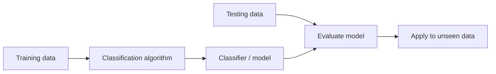

### 4.1 Decision tree

- **Root：** 根结点。
- **Leaf：** 叶结点，没有子结点，用于输出类别。

构建方式：**top-down recursive divide-and-conquer**。

1. 所有训练样本初始放在根结点。
2. 根据划分准则选择最佳属性，例如 information gain、gain ratio、Gini index。
3. 按属性取值划分样本；连续属性可以用阈值形成“大于 / 不大于”分支。
4. 对每个子集递归建树。

停止划分并产生 leaf 的条件：

- 当前结点所有样本属于同一类：输出该类别。
- 没有可继续划分的属性：majority voting，输出当前样本的多数类。
- 某分支没有样本：输出父结点样本的多数类。

Buys-computer 例题的结果：

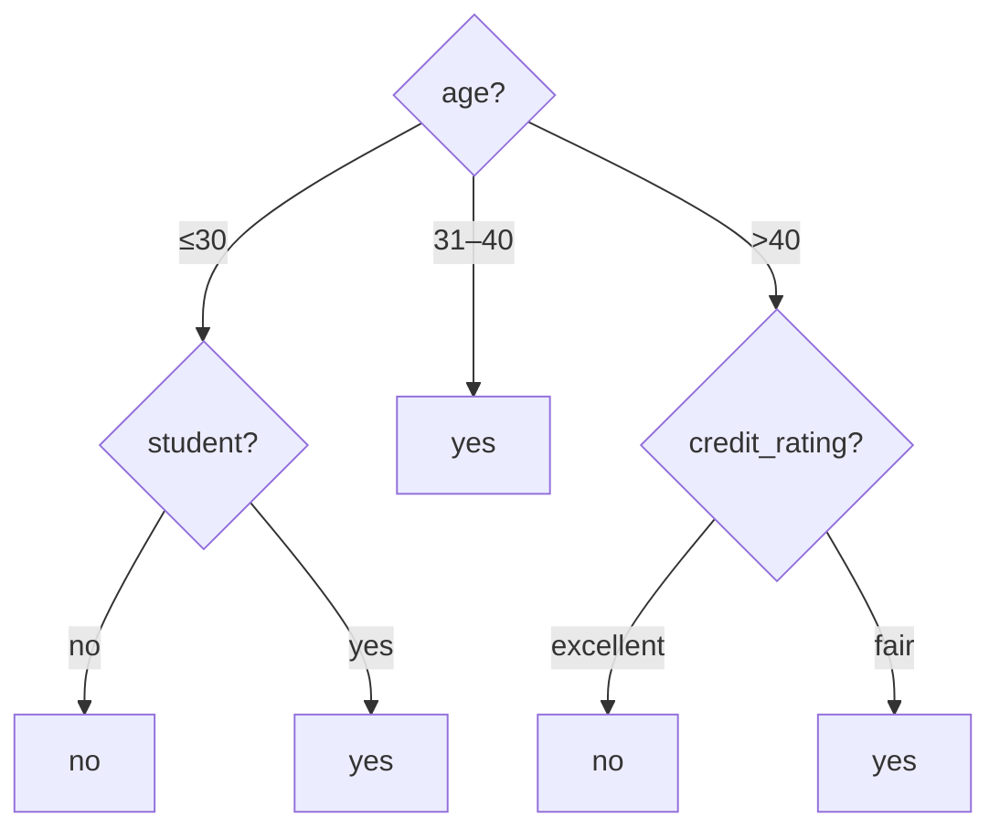

### 4.2 Entropy、information gain 与 gain ratio

```math
H=-\sum_i p_i\log_2p_i=\sum_i p_i\log_2\frac1{p_i}.
```

H 大表示不确定性高，H 小表示更确定。约定 $`0\log_2 0=0`$。

```math
H(Y\mid X)=\sum_x P(X=x)H(Y\mid X=x).
```

Expected information（entropy）：

```math
\mathop{\mathrm{Info}}\nolimits(D)=H(D).
```

按属性 A 将 D 分成 $`D_1,\ldots,D_v`$ 后：

```math
\mathop{\mathrm{Info}}\nolimits_A(D)=\sum_{j=1}^v\frac{\vert D_j\vert }{\vert D\vert }\mathop{\mathrm{Info}}\nolimits(D_j),
```

```math
\mathop{\mathrm{Gain}}\nolimits(A)=\mathop{\mathrm{Info}}\nolimits(D)-\mathop{\mathrm{Info}}\nolimits_A(D).
```

例题：Class P 为 buys_computer = yes，Class N 为 no。

| Age | Income | Student | Credit rating | Buys computer |
|---|---|---|---|---|
| ≤30 | high | no | fair | no |
| ≤30 | high | no | excellent | no |
| 31–40 | high | no | fair | yes |
| >40 | medium | no | fair | yes |
| >40 | low | yes | fair | yes |
| >40 | low | yes | excellent | no |
| 31–40 | low | yes | excellent | yes |
| ≤30 | medium | no | fair | no |
| ≤30 | low | yes | fair | yes |
| >40 | medium | yes | fair | yes |
| ≤30 | medium | yes | excellent | yes |
| 31–40 | medium | no | excellent | yes |
| 31–40 | high | yes | fair | yes |
| >40 | medium | no | excellent | no |

共有 9 个 yes、5 个 no：

```math
\mathop{\mathrm{Info}}\nolimits(D)=I(9,5)=\frac9{14}\log_2\frac{14}9+\frac5{14}\log_2\frac{14}5\approx0.940.
```

| Age | $`p_i`$ | $`n_i`$ | $`I(p_i,n_i)`$ |
|---|---:|---:|---:|
| ≤30 | 2 | 3 | 0.971 |
| 31–40 | 4 | 0 | 0 |
| >40 | 3 | 2 | 0.971 |

```math
\mathop{\mathrm{Info}}\nolimits_{age}(D)=\frac5{14}I(2,3)+\frac4{14}I(4,0)+\frac5{14}I(3,2)\approx0.694,
```

```math
\mathop{\mathrm{Gain}}\nolimits(age)\approx0.246.
```

其他属性：$`\mathop{\mathrm{Gain}}\nolimits(income)\approx0.029`$，$`\mathop{\mathrm{Gain}}\nolimits(student)\approx0.151`$，$`\mathop{\mathrm{Gain}}\nolimits(credit\_rating)\approx0.048`$。按 information gain，age 最优。

Gain ratio：

```math
\mathop{\mathrm{SplitInfo}}\nolimits_A(D)=-\sum_j\frac{\vert D_j\vert }{\vert D\vert }\log_2\frac{\vert D_j\vert }{\vert D\vert },
```

```math
\mathop{\mathrm{GainRatio}}\nolimits(A)=\frac{\mathop{\mathrm{Gain}}\nolimits(A)}{\mathop{\mathrm{SplitInfo}}\nolimits_A(D)}.
```

D 表示当前数据集。Income 的分组数量为 high:4、medium:6、low:4，总计 14。

Income 的 split information 为

```math
\mathop{\mathrm{SplitInfo}}\nolimits_{income}(D)= \frac4{14}\log_2\frac{14}4+\frac6{14}\log_2\frac{14}6+\frac4{14}\log_2\frac{14}4 \approx1.557.
```

```math
\mathop{\mathrm{GainRatio}}\nolimits(income)=\frac{\mathop{\mathrm{Gain}}\nolimits(income)}{1.557}.
```

按 **gain ratio** 选择时，比较各候选划分的增益率。

- **Information gain** 偏向取值较多的属性。
- **Gain ratio** 又可能偏好很不平衡的划分，例如某一分支远小于其他分支。
- **实际 C4.5** 会结合信息增益等条件限制候选划分。

### 4.3 Bayes classification

```math
P(H\mid X)=\frac{P(X\mid H)P(H)}{P(X)}.
```

- $`H`$：**hypothesis**。
- $`X`$：**evidence**。
- $`P(H)`$：**prior probability（先验概率）**。
- $`P(H\mid X)`$：**posterior probability（后验概率）**。

分类时，选择使 $`P(H\mid X)`$ 最大的 H，等价于选择使 $`P(X\mid H)P(H)`$ 最大的 H，因为不同候选 H 的分母 $`P(X)`$ 相同。

**Naive Bayes** 假设：给定类别后，不同属性条件独立。

```math
P(X\mid C_i)=\prod_fP(x_f\mid C_i).
```

例：仍使用上面的 14 条 Buys-computer 数据，判断

```math
X=(age\le30,\ income=medium,\ student=yes,\ credit\_rating=fair).
```

1. 先验概率：$`P(yes)=9/14`$，$`P(no)=5/14`$。
2. 条件概率：

    | 条件 | Given yes | Given no |
    |---|---:|---:|
    | $`age\le30`$ | $`2/9`$ | $`3/5`$ |
    | income = medium | $`4/9`$ | $`2/5`$ |
    | student = yes | $`6/9`$ | $`1/5`$ |
    | credit rating = fair | $`6/9`$ | $`2/5`$ |

3. 计算 likelihood：

    $`\displaystyle P(X\mid yes)=\frac29\frac49\frac69\frac69\approx0.0439,`$

    $`\displaystyle P(X\mid no)=\frac35\frac25\frac15\frac25=0.0192.`$

4. 乘先验：$`P(X\mid yes)P(yes)\approx0.0282`$，$`P(X\mid no)P(no)\approx0.00686`$。前者更大，故 X 属于 buys_computer = yes。

**Laplacian correction**：防止零概率，对每一种可能取值的计数加 1，同时调整分母。例：income 的原始计数为 low:0、medium:990、high:10；平滑后为 1、991、11，总数 1003：

```math
P(low)=\frac1{1003},\quad P(medium)=\frac{991}{1003},\quad P(high)=\frac{11}{1003}.
```

### 4.4 Rule-based classification

**IF–THEN rule**，例如：

```text
IF age = mid-age THEN buys_computer = yes
```

记 $`n_{covers}`$ 为规则覆盖的样本数量，$`n_{correct}`$ 为被规则正确分类的样本数量：

```math
\mathop{\mathrm{coverage}}\nolimits(R)=\frac{n_{covers}}{\vert D\vert },\qquad \mathop{\mathrm{accuracy}}\nolimits(R)=\frac{n_{correct}}{n_{covers}}.
```

多个规则同时触发时，需要 conflict resolution：

- **Size ordering**：优先选择包含更多属性测试、更具体的规则。
- **Class-based ordering**：根据类别重要性、错误分类代价等确定优先级。
- **Rule-based ordering / decision list**：按置信度、专家经验等排列规则，按优先顺序使用。

**Extracting rules from a decision tree**：从根结点到一个叶结点的每条路径对应一条规则。前面的树得到：

```text
IF age = young AND student = no THEN buys_computer = no
IF age = young AND student = yes THEN buys_computer = yes
IF age = mid-age THEN buys_computer = yes
IF age = old AND credit_rating = excellent THEN buys_computer = no
IF age = old AND credit_rating = fair THEN buys_computer = yes
```

其中 young 为 ≤30，mid-age 为 31–40，old 为 >40。

**Sequential covering method**：每次学习一条规则，移除它覆盖的目标类别正例，再对剩余样本重复，直到剩余目标样本不足或规则质量低于阈值。每条规则通常通过贪心添加条件生长，直到达到可接受的质量。

```text
while enough target tuples remain:
    generate a rule
    remove positive target tuples satisfying this rule
```

Rule generation：

```text
while true:
    find the best predicate p (for example, income = high)
    if FOIL_gain(p) > threshold:
        add p to the current rule
    else:
        break
```

在这里的命题分类记法下：

```math
\mathop{\mathrm{FOIL\_Gain}}\nolimits=pos'\left[ \log_2\frac{pos'}{pos'+neg'}-\log_2\frac{pos}{pos+neg}\right].
```

$`pos,neg`$ 为添加条件前覆盖的正、负样本数；$`pos',neg'`$ 为添加条件后覆盖的正、负样本数。该指标越大越好。

可使用独立剪枝集评估是否删去条件：

```math
\mathop{\mathrm{FOIL\_Prune}}\nolimits(R)=\frac{pos-neg}{pos+neg}.
```

这里的 pos、neg 是规则 R 覆盖的剪枝集正、负样本数。若剪枝后的值更高，则进行剪枝。

### 4.5 Confusion matrix 与分类评估

注意矩阵横纵轴分别表示 Actual 还是 Predicted。本表使用行 = Predicted，列 = Actual：

| | Actual positive | Actual negative |
|---|---:|---:|
| Predicted positive | TP | FP |
| Predicted negative | FN | TN |

```math
\mathop{\mathrm{Accuracy}}\nolimits=\frac{TP+TN}{TP+FP+FN+TN},\quad \mathop{\mathrm{Precision}}\nolimits=\frac{TP}{TP+FP},\quad \mathop{\mathrm{Recall}}\nolimits=\frac{TP}{TP+FN}.
```

例题中的表使用相反方向，行 = Actual，列 = Predicted：

| Actual / Predicted | Cancer = yes | Cancer = no | Total |
|---|---:|---:|---:|
| Cancer = yes | 90 | 210 | 300 |
| Cancer = no | 140 | 9560 | 9700 |
| Total | 230 | 9770 | 10000 |

- **Precision** $`=90/230\approx39.13\%`$。
- **Recall / sensitivity** $`=90/300=30\%`$。
- **Specificity** $`=9560/9700\approx98.56\%`$。
- **Accuracy** $`=(90+9560)/10000=96.5\%`$。

- **Holdout method**：随机划分数据为训练集和测试集，例如 2/3 用于训练、1/3 用于测试。Random subsampling 会重复随机划分 k 次，最终取 k 次测试结果的平均值。

- **Cross-validation**：将数据分为 k 份（常见 k=10）。每次用一份测试，其余 k−1 份训练，轮换 k 次，取结果均值。这样能更充分地利用数据，每个样本用于一次测试和 k−1 次训练，评估通常更稳定。

- **Bootstrap**：有放回随机采样，适用于样本有限的场景。每次从原始数据抽取一个样本后放回，因此一个样本可能被多次抽中，也可能一次都未抽中。可用未抽中的样本评估模型。

## 5. Clustering

Cluster analysis（clustering / data segmentation）：根据数据特征寻找相似性，并把相似对象分到同一个 cluster。这属于 **unsupervised learning**。

### 5.1 K-means

属于 partitioning methods，通常收敛到局部最优，结果受初始化影响。目标是最小化簇内平方距离和：

```math
E=\sum_{i=1}^k\sum_{p\in C_i}\Vert p-c_i\Vert ^2,
```

其中 $`C_i`$ 为第 i 个簇，$`c_i`$ 为其 centroid（均值中心）。

输入：簇数 k、包含 n 个对象的数据集 D。输出：k 个簇。

```text
choose k initial cluster centers
repeat:
    assign each object to the nearest center
    update every center to the mean of its assigned objects
until assignments stop changing or the iteration limit is reached
```

另一种初始化方式是先把对象随机划为 k 个非空子集，再计算各子集均值。迭代步骤始终是“重新分配 → 重算中心”。若出现空簇，需要重新初始化该簇的中心。

K-means 的弱点：

- 适合数值空间中可计算均值的数据；不能直接用于一般类别属性。类别数据可考虑 k-modes；若定义了合适的相异度，k-medoids 更通用。
- 需要提前指定 k；估计合适的 k 仍是一个问题。
- 对 noise 和 outliers 敏感，因为均值容易受极端值影响。
- 更适合近似球形的簇，不擅长月牙形、环形等非凸结构。

### 5.2 K-medoids 与 PAM

PAM：**Partitioning Around Medoids**，属于 partitioning methods。Medoid 必须是数据集中的实际对象。目标是减小对象到代表对象的总相异度：

```math
E=\sum_{i=1}^k\sum_{p\in C_i}d(p,c_i).
```

尝试将某个 medoid 与非 medoid 对象交换，重新计算代价：

```math
S=E_{swapping}-E_{current}.
```

若 S < 0，交换更好，接受交换。示意例中 k=2，原代价为 20，某次交换后为 26，则 S=6，应拒绝该交换。

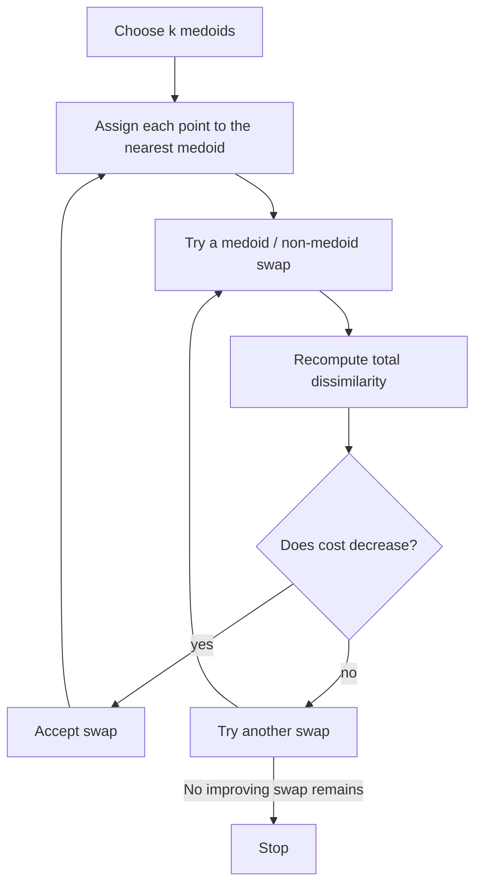

```text
PAM(D, k):
    choose k objects as representative objects
    repeat:
        assign each remaining object to its nearest representative
        evaluate exchanges between a representative and a nonrepresentative
        if an exchange lowers the total cost:
            perform an improving exchange
        else:
            stop
    return clusters
```

### 5.3 Hierarchical methods

Hierarchical clustering 产生层次化的簇。

- **Agglomerative：** 自下而上合并。
- **Divisive：** 自上而下拆分。

例：从 a、b、c、d、e 开始的合并序列为：

| Step | Clusters |
|---|---|
| 0 | {a}, {b}, {c}, {d}, {e} |
| 1 | {a,b}, {c}, {d}, {e} |
| 2 | {a,b}, {c}, {d,e} |
| 3 | {a,b}, {c,d,e} |
| 4 | {a,b,c,d,e} |

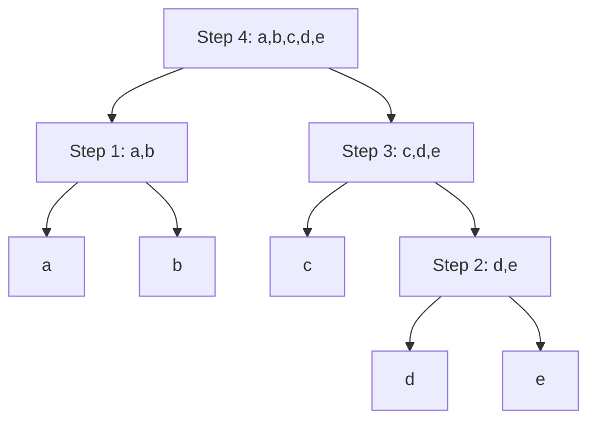

自叶结点向根看是凝聚过程；反向看是拆分过程。

**AGNES (Agglomerative Nesting)**：每个对象初始各成一簇，每步合并最相似的两个簇，直到形成一个簇或达到停止条件。Single-link 使用两个簇之间最近的两个点的距离。

**DIANA (Divisive Analysis)**：最初所有对象在同一簇，逐步拆分。标准 DIANA 选择直径最大的簇，从与簇内其他对象平均相异度最大的对象开始形成 splinter group，再将更接近新组的对象移过去。继续拆分，直到每个对象独立成簇，或按所需层级截断。它与 AGNES 的方向相反，但不保证得到同一棵树。参见 [DIANA 算法说明](https://stat.ethz.ch/CRAN/web/packages/cluster/cluster.pdf)。

衡量两个簇间距离的方式：

- **Single link**：两簇最近点对的距离。
- **Complete link**：两簇最远点对的距离。
- **Average link**：所有跨簇点对距离的平均值。
- **Centroid**：两簇均值中心之间的距离。
- **Medoid**：两簇代表对象之间的距离。

Agglomerative clustering 的弱点：

- **不能回退：** 通常不能撤销早先的合并。
- **扩展性：** 不易扩展到超大数据集。许多实现需要 $`O(n^2)`$ 存储，时间复杂度随 linkage 和实现而异，朴素方法可达 $`O(n^3)`$。

### 5.4 Density-based methods 与 DBSCAN

K-means 等基于中心划分的方法偏好近似球形簇；density-based methods 可识别不规则形状的簇。Hierarchical methods 是否能处理非凸簇取决于 linkage，不能一概而论。

- **Eps / $`\varepsilon`$**：邻域半径。
- **MinPts**：成为核心点所需的最小邻域点数。

```math
N_\varepsilon(q)=\{p\in D:\mathop{\mathrm{dist}}\nolimits(p,q)\le\varepsilon\}.
```

此定义包括 q 自身。若 $`\vert N_\varepsilon(q)\vert \ge\mathrm{MinPts}`$，则 q 是 **core object**。这里采用 [DBSCAN 文档](https://search.r-project.org/CRAN/refmans/dbscan/html/dbscan.html) 中包括自身的计数约定。

- **Directly density-reachable（直接密度可达）**：X 在 Y 的 $`\varepsilon`$ 邻域内，且 Y 是 core。方向为 Y → X；X 可以是 core，也可以是 border。若 X 不是 core，反向关系不一定成立。

- **Density-reachable（密度可达）**：存在从 Y 到 X 的直接密度可达链。链中每一步的出发点均须为 core，最后的 X 可以不是 core。

- **Density-connected（密度相连）**：存在 O，使 X 和 Y 都从 O 密度可达。

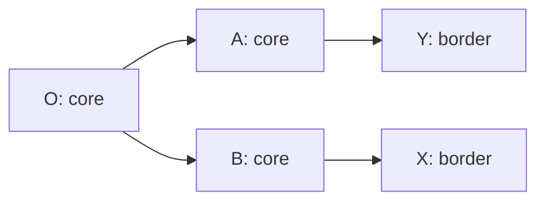

图中 O → A → Y、O → B → X 是密度可达链，因此 X 与 Y 密度相连。不能从 border 点继续扩展密度可达链。

DBSCAN 对点的分类：

- **Core**：邻域点数至少为 MinPts。
- **Border**：自身不是 core，但位于某个 core 的邻域内。
- **Noise / outlier**：既不是 core，也不属于任何 core 的密度可达簇。

算法输入 D、$`\varepsilon`$、MinPts；输出基于密度的 clusters。

```text
mark all points as unvisited
for each unvisited point p:
    mark p as visited
    N = epsilon-neighborhood(p)
    if size(N) < MinPts:
        temporarily mark p as noise
        continue
    create a new cluster C and add p to C
    for each point p' in the expanding set N:
        if p' is unvisited:
            mark p' as visited
            N' = epsilon-neighborhood(p')
            if size(N') >= MinPts:
                N = N union N'
        if p' is not assigned to any cluster:
            add p' to C
    output C
```

N 是用于扩展搜索的中间集合，C 才是输出的 cluster。先被暂记为 noise 的点，之后仍可能作为 border 加入某个簇。

### 5.5 Determine the number of clusters

- **Empirical method**：经验估计，例如粗略取 $`k\approx\sqrt{n/2}`$。n=200 时约为 10；这只是启发式，不能替代对数据的检查。
- **Elbow method**：绘制 k 与簇内平方误差和的关系，寻找下降速度开始明显变缓的“肘部”，作为候选簇数。
- **Cross-validation method**：把数据分为 m 份，用 m−1 份训练，在剩余一份评估；对候选 k 重复 m 次。可将测试点分配给最近中心，比较预先选定的聚类质量指标。单纯距离误差通常随 k 增大而下降，需要结合复杂度、稳定性等判断。

### 5.6 Measuring clustering quality: silhouette coefficient

对属于 $`C_i`$ 的点 o：

```math
a(o)=\frac{\sum_{o'\in C_i,\ o'\ne o}\mathop{\mathrm{dist}}\nolimits(o,o')}{\vert C_i\vert -1},
```

```math
b(o)=\min_{j\ne i}\frac{\sum_{o'\in C_j}\mathop{\mathrm{dist}}\nolimits(o,o')}{\vert C_j\vert },
```

```math
s(o)=\frac{b(o)-a(o)}{\max\{a(o),b(o)\}}.
```

- $`a(o)`$：o 到**同簇其他点的平均距离**。
- $`b(o)`$：o 到**其他簇的平均距离中的最小值**。
- $`s(o)\in[-1,1]`$：接近 **1** 表示归属较好，接近 **−1** 表示可能分错簇。
- **单点簇**的 silhouette 通常定义为 **0**。

## 6. Outlier detection

### 6.1 Outlier 的定义与类型

Outlier（异常值）：与正常对象显著不同，表现得像由另一种机制产生的数据对象。Noise 是测量中的随机误差或变异，二者并不等同；通常先处理已知噪声，再进行异常检测。

- **Global outlier / point anomaly**：某个对象显著偏离整个数据集的其他部分。例如网络入侵检测。关键问题是选择合适的偏离度量。

- **Contextual outlier / conditional outlier**：某个对象在特定上下文中显著异常。例如 Urbana 的 80°F 气温是否异常，取决于是夏季还是冬季。

    - Contextual attributes 定义上下文，如时间、地点。
    - Behavioral attributes 描述需要评估的行为，如温度。
    - 局部密度异常可视为一种局部上下文中的异常；更一般的上下文还可由领域属性定义。
    - 关键问题：如何定义有意义的上下文？

- **Collective outliers**：一组对象整体显著异常，即使其中单个对象看起来并不异常。例如多台计算机共同发起 DoS 攻击，各台机器的单个请求可能不异常，但集体行为异常。

### 6.2 Outlier detection 方法

**Supervised methods** 将异常检测作为分类问题，用领域专家标注的样本训练和测试，区分正常与异常。

- **对正常对象建模：** 将不符合模型的对象标为异常。
- **对已知异常建模：** 但不能据此保证所有不匹配对象都正常。

挑战：

- **Class imbalance：** 异常样本稀少，可通过增加异常样本或合理构造训练样本改善。
- **Recall 与误报代价：** 很多场景尤其重视 recall，希望尽量找出异常，但仍需权衡误报代价。

**Unsupervised methods** 常假设正常对象形成一个或多个较大的群体，异常对象偏离这些群体。可以先聚类，再考察远离正常簇、处于很小簇或低密度区域的对象。

局限：

- 难以区分 noise 与真正的 outlier。
- 正常数据可能很多样；相似的集体异常反而可能形成一个紧密小群，简单聚类不一定能识别。
- 可能出现较多 false positives，将正常对象错判为异常，也可能漏掉异常。
- 聚类本身有计算成本，且正常对象通常远多于异常对象。

例如在入侵或病毒检测中，正常活动未必形成明显簇；多台计算机协同攻击却可能具有很强的相似性。结合标注或领域信息，有助于识别这种 collective anomaly。

**Semi-supervised methods**：很多应用中标记数据很少，标注可能只含正常对象、只含异常对象，或两者都有。利用少量有标签数据与大量未标记数据训练模型。

- 若有少量已标记的正常对象：利用这些对象及相关未标记数据建立正常行为模型，检测明显偏离模型的数据。
- 若只有少量已标记的异常：它们通常不能覆盖所有可能异常；可结合未标记数据建模、正常行为学习或其他半监督方法，提高检测覆盖度。

### 6.3 Statistical approaches

通过学习一个适合给定数据集的生成模型，然后识别模型中位于低概率区域的对象作为异常值。统计方法通常分为参数方法和非参数方法。

**参数方法（Parametric Methods）：**

- 假设正常数据由一个具有参数 $`\theta`$ 的参数化分布生成。
- 给定概率密度函数 $`f(x;\theta)`$，其数值反映对象 $`x`$ 所在位置的密度。
- 异常值判断：如果 $`f(x;\theta)`$ 较小，$`x`$ 更可能是异常值，即数据点位于该分布的低密度区域。

**非参数方法（Non-parametric Methods）：**

- 不预先限定某一种参数化分布形式，而是根据输入数据决定模型。
- 非参数并非完全没有参数，而是模型的复杂度和参数数量不受固定有限维参数形式约束。
- 示例：直方图和核密度估计（Kernel Density Estimation）。这些方法通过估计数据的分布识别异常值，不依赖某个特定的分布形状假设。

### 6.4 Proximity-based approaches

#### 6.4.1 Distance-based outlier detection

如果一个对象 $`o`$ 的邻域内没有足够多的其他数据点，则该对象被认为是异常值。设 $`n=\vert D\vert`$，半径为 $`r`$，比例阈值为 $`\pi`$。按“邻居数少于 $`\pi n`$”的规则：

```math
\frac{\vert \{o'\in D\setminus\{o\}:\mathop{\mathrm{dist}}\nolimits(o,o')\leq r\}\vert }{\vert D\vert }\lt \pi.
```

也可以计算 $`o`$ 与其第 $`k`$ 个最近邻对象 $`o_k`$ 的距离，其中 $`k=\lceil\pi\vert D\vert \rceil`$。当第 $`k`$ 个邻居存在时，若 $`\mathop{\mathrm{dist}}\nolimits(o,o_k)\gt r`$，则 $`o`$ 是异常值。

**算法步骤：**

1. 对于每个对象 $`o_i`$，计算它与其他对象之间的距离。
2. 统计距离 $`o_i`$ 小于或等于 $`r`$ 的邻域内其他对象数量。
3. 若邻域内的对象数已达到 $`\pi n`$，提前终止内层循环，避免不必要的计算，提高效率。
4. 若完整扫描后邻域内的对象数量仍小于 $`\pi n`$，则 $`o_i`$ 被视为 DB$`(r,\pi)`$ 异常值。

**Efficient computation: nested loop algorithm**

- For any object $`o_i`$, calculate its distance from other objects, and count the number of other objects in the $`r`$-neighborhood.
- If at least $`\pi n`$ other objects are within distance $`r`$, terminate the inner loop.
- Otherwise, $`o_i`$ is a DB$`(r,\pi)`$ outlier.

Input：a set of objects $`D=\{o_1,\ldots,o_n\}`$，threshold $`r\gt 0`$，$`0\lt \pi\leq1`$。Output：DB$`(r,\pi)`$ outliers in $`D`$。

```text
for i = 1 to n:
    count = 0
    for j = 1 to n:
        if i != j and dist(o_i, o_j) <= r:
            count = count + 1
            if count >= pi * n:
                break
    if count < pi * n:
        output o_i as a DB(r, pi) outlier
```

#### 6.4.2 Density-based outlier detection

Outlier 的 density 明显低于邻居的 density。LOF（Local Outlier Factor）越大，越有可能是 outlier。

- **$`k`$-distance of an object $`o`$，$`\mathop{\mathrm{dist}}\nolimits_k(o)`$：** Distance between $`o`$ and its $`k`$-th nearest neighbor.
- **$`k`$-distance neighborhood of $`o`$：**

    $`\displaystyle N_k(o)=\{o'\in D\setminus\{o\}:\mathop{\mathrm{dist}}\nolimits(o,o')\leq\mathop{\mathrm{dist}}\nolimits_k(o)\}.`$

    $`N_k(o)`$ may contain more than $`k`$ objects since multiple objects may have identical distance to $`o`$.

#### 6.4.3 局部离群因子（Local Outlier Factor，LOF）

**可达距离（Reachability Distance）：** 对对象 $`o`$ 相对于邻居 $`o'`$，定义

```math
\mathop{\mathrm{reachdist}}\nolimits_k(o,o')=\max\{\mathop{\mathrm{dist}}\nolimits_k(o'),\mathop{\mathrm{dist}}\nolimits(o,o')\}.
```

这里 $`\mathop{\mathrm{dist}}\nolimits_k(o')`$ 是邻居 $`o'`$ 到其第 $`k`$ 近邻的距离。这一截断避免过小的样本间距离造成过大的局部密度估计。$`k`$ 是用户指定的参数，用于定义局部邻域大小。

**局部可达密度（Local Reachability Density，lrd）：**

```math
\mathop{\mathrm{lrd}}\nolimits_k(o)=\frac{\vert N_k(o)\vert }{\sum_{o'\in N_k(o)}\mathop{\mathrm{reachdist}}\nolimits_k(o,o')}.
```

它表示对象 $`o`$ 与其邻居之间平均可达距离的倒数。

**局部离群因子：**

```math
\mathop{\mathrm{LOF}}\nolimits_k(o)=\frac1{\vert N_k(o)\vert }\sum_{o'\in N_k(o)}\frac{\mathop{\mathrm{lrd}}\nolimits_k(o')}{\mathop{\mathrm{lrd}}\nolimits_k(o)}.
```

LOF 是邻居局部可达密度与对象自身局部可达密度的比值的平均值。LOF 越高，表示 $`o`$ 越可能是离群点。

如果 $`o`$ 的局部密度比其邻居的密度低很多，则 LOF 较高，说明 $`o`$ 是潜在的局部离群点。LOF 有效识别相对于局部区域显著异常的点，即使它们不是全局离群点。

### 6.5 Clustering-based outlier detection

可疑对象通常表现为：

- Not belonging to any cluster。
- Far from its closest cluster。
- 属于很小且偏离主要群体的簇。

**方法：FindCBLOF。** 目标是通过聚类发现离群点，尤其关注小簇中的对象。

步骤：

1. 对所有数据**聚类，并按簇大小从大到小排序**。
2. **区分大簇与小簇**。
3. 对每个数据点计算**基于聚类的局部离群因子（Cluster-Based Local Outlier Factor，CBLOF）**。

设点 $`p`$ 属于簇 $`C_i`$，$`LC`$ 为大簇集合，$`\mathop{\mathrm{dist}}\nolimits(p,C)`$ 表示点到簇代表（通常为中心）的距离：

```math
\mathop{\mathrm{CBLOF}}\nolimits(p)= \begin{cases} \vert C_i\vert \mathop{\mathrm{dist}}\nolimits(p,C_i),&C_i\in LC,\\ \vert C_i\vert \min_{C_j\in LC}\mathop{\mathrm{dist}}\nolimits(p,C_j),&C_i\notin LC. \end{cases}
```

即大簇中的点使用到自身簇的距离，小簇中的点使用到最近大簇的距离，再乘以其所属簇的大小。按这种距离定义，CBLOF 越高，点越可疑。

**6.5.1 基于聚类的离群检测方法：优缺点分析。**

优势：

- 无需任何标注数据即可检测离群点。
- 聚类结果可被视为对数据的整体摘要。
- 一旦聚类完成，只需将对象与簇比较即可判断是否为离群点，速度较快。

劣势：

- 检测效果高度依赖所用聚类方法；常规聚类方法未必适用于离群点检测。
- 计算开销大：首先必须聚类，这一过程可能耗时较长。

### 6.6 Classification-based approaches

**One-class model：** 学习已知正常数据的分布或边界，用来区分符合正常模式的对象和潜在 outliers。若同时拥有正常与异常标签，也可以训练普通监督分类模型。

**Semi-supervised learning：** 有时训练数据不足，可结合 classification-based 和 clustering-based 方法。

**一种结合聚类与 one-class 模型的流程：**

1. 使用聚类方法，找到一个大簇 $`C`$ 和一个小簇 $`C_1`$。
2. 如果 $`C`$ 中部分对象被标记为“正常”，并且有理由相信簇内对象同质，则将正常标签传播到 $`C`$ 中其他对象。
3. 利用 one-class 模型学习簇 $`C`$ 的“正常”边界，用于识别其他正常点。
4. 如果 $`C_1`$ 中部分对象被标记为“离群”，在簇内同质假设下，可将 $`C_1`$ 的其他对象也视为潜在离群点。
5. 不符合簇 $`C`$ 正常模型的对象（例如对象 $`a`$）也视为候选离群点。

## 7. Information Retrieval（信息检索）

### 7.1 IR models

**建模目标：** Modeling 是 IR 中一个复杂过程，最终目标是构建排序函数（ranking function）。

**排序函数：** 根据给定查询（query）为每个文档打分。分数表示文档与查询的相关程度，从而实现文档排序。

建模过程包括两个主要任务：

1. 构建文档与查询的逻辑表示框架，定义如何表达文档和查询，例如布尔模型、向量模型。
2. 定义一个排序函数，量化文档与查询之间的相似性，例如余弦相似度、概率相关性。

Index terms（索引词）由用户与系统共同使用，用于表示信息需求和文档内容。


**IR model：四元组** $`[D,Q,F,R(q_i,d_j)]`$。

- $`D`$：文档集合中的文档逻辑视图，是对文档的抽象表示，系统通过这种视图理解和处理文档内容。
- $`Q`$：用户查询的逻辑视图，是对查询的抽象表达，用来表示用户需要什么信息。
- $`F`$：用来建立文档和查询表示的框架，即将它们转化为系统可以处理的形式的方法或规则。
- $`R(q_i,d_j)`$：排序函数，根据查询 $`q_i`$ 和文档 $`d_j`$ 之间的关系给文档打分排序，决定哪些文档最相关、应排在前面。

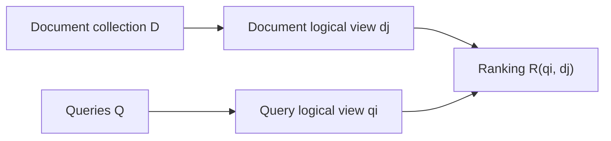

词汇表：

```math
V=\{k_1,k_2,k_3,\ldots,k_t\}.
```

$`V`$ 为所有文档的词汇表，$`t`$ 为 index terms 的数量，$`k_i`$ 为一个 index term。

用 patterns of term co-occurrences 表示 documents 和 queries。

例如在词汇表 $`V=[k_1,k_2,k_3,\ldots,k_t]`$ 下：

- $`[1,0,0,\ldots,0]`$：该文档只包含 $`k_1`$。
- $`[1,1,1,\ldots,1]`$：该文档包含所有词。

这种出现模式记作 $`c(d_i)`$ 或 $`c(q)`$。

**Term-document matrix：** 行对应词，列对应文档。

```math
\begin{array}{c|cc} &d_1&d_2\\\hline k_1&f_{1,1}&f_{1,2}\\ k_2&f_{2,1}&f_{2,2}\\ k_3&f_{3,1}&f_{3,2} \end{array}
```

例如 $`f_{3,1}`$ 表示 $`d_1`$ 中 $`k_3`$ 出现的次数，即 frequency。

### 7.2 The Boolean model

查询例子：

```math
q=k_a\land(k_b\lor\neg k_c).
```

表示检索包含词项 $`k_a`$，并且“包含 $`k_b`$ 或不包含 $`k_c`$”的文档。

Boolean model 的 term-document matrix 是 binary 的，只取 0 或 1：

- $`w_{i,j}\in\{0,1\}`$ 对应词 $`k_i`$ 是否出现在文档 $`d_j`$ 中。
- 查询也可用二值词项模式表示。

**Conjunctive component 与 disjunctive normal form（DNF，析取范式）。** 假设 vocabulary 为 $`V=\{k_a,k_b,k_c\}`$，查询为上式。其满足条件的完整合取模式为：

```math
q_{\mathrm{DNF}}=(1,1,1)\lor(1,1,0)\lor(1,0,0).
```

每个三元组是一个 $`c(q)`$：依次表示 $`k_a,k_b,k_c`$ 的出现情况。

若 $`V=\{k_a,k_b,k_c,k_d\}`$，文档 $`d_j`$ 只有 $`k_a,k_b,k_c`$，则

```math
c(d_j)=(1,1,1,0).
```

查询仍为 $`q=k_a\land(k_b\lor\neg k_c)`$，不涉及 $`k_d`$，因此其第四位可取 0 或 1：

```math
\begin{aligned} q_{\mathrm{DNF}}={}&(1,1,1,0)\lor(1,1,1,1)\\ &\lor(1,1,0,0)\lor(1,1,0,1)\\ &\lor(1,0,0,0)\lor(1,0,0,1). \end{aligned}
```

文档 $`d_j`$ 与查询 $`q`$ 的相似性定义为：

```math
\mathop{\mathrm{sim}}\nolimits(d_j,q)=\begin{cases} 1,&\text{存在一个满足查询的完整模式 }c(q)=c(d_j),\\ 0,&\text{否则}. \end{cases}
```

**7.2.1 Boolean model 总结：**

- 优点：intuitive and precise semantics；neat formalism。
- 缺点：no ranking；可能 return too few / too many documents；no notion of partial matching。

### 7.3 Term weighting

为了表示词项的重要性，给文档 $`d_j`$ 中出现的词 $`k_i`$ 分配权重 $`w_{i,j}`$；未出现的词通常令 $`w_{i,j}=0`$。权重表示词项在文档中的重要性，即其对描述该文档内容的贡献程度。

这些权重用于计算文档的 rank，使我们可以根据用户查询对集合中的文档排序。

```math
\mathbf d_j=(w_{1,j},w_{2,j},\ldots,w_{t,j}).
```

这是一个 weighted vector，包含词汇表 $`V`$ 中全部 $`t`$ 个词在文档 $`d_j`$ 中的权重；$`t`$ 是词汇表中的词数量。

可以用文档中 term 出现的 frequency 计算权重。总词频：

```math
F_i=\sum_{j=1}^N f_{i,j}.
```

- $`N`$：**文档总数**。
- $`F_i`$：词 $`k_i`$ 在所有文档中出现的**总 frequency**。

**7.3.1 Document frequency 例子：**

| 文档 | 内容 |
|---|---|
| $`d_1`$ | To do is to be. To be is to do. |
| $`d_2`$ | To be or not to be. I am what I am. |
| $`d_3`$ | I think therefore I am. Do be do be do. |
| $`d_4`$ | Do do do, da da da. Let it be, let it be. |

忽略大小写：

```math
f(\mathrm{do},d_1)=2,\quad f(\mathrm{do},d_2)=0,\quad f(\mathrm{do},d_3)=3,\quad f(\mathrm{do},d_4)=3.
```

$`F(\mathrm{do})=8`$；包含 do 的文档数量 $`n(\mathrm{do})=3`$。总词频与 document frequency 不是同一个量。

**Term-term correlation matrix：** Terms 之间可能相关，模型可考虑体现这种相关性。

### 7.4 Document length normalization

文档长度差异很大，篇幅（字数或词数）可能相差很多。长文档因包含更多词，更可能与查询词匹配，从而更容易被检索到，即使它不一定真正更相关。

为了补偿这种偏差，可以根据文档长度调整每篇文档的得分，例如除以相应的长度度量，以减少文档长度对排序的影响。这称为文档长度归一化（Document Length Normalization），通常能够改善排序效果。

**文档长度归一化的方法：** 取决于如何表示文档。

- **按字节数（Size in bytes）：** 将文档视为一串字节流，长度为所占字节数。用于较底层的表示方式，例如原始文件大小。
- **按词数（Number of words）：** 将文档视为词序列，长度等于文档中单词数量。这是最直观、常见的方法之一。
- **按向量范数（Vector norms）：** 文档表示为加权词项的向量，例如 TF-IDF 向量。使用向量的范数（如 L2 范数）进行归一化；余弦相似度的分母即包含这种归一化。

```math
\mathbf d_j=(w_{1,j},w_{2,j},\ldots,w_{t,j}),\qquad \Vert \mathbf d_j\Vert _2=\sqrt{\sum_{i=1}^t w_{i,j}^2}.
```

### 7.5 The vector model

```math
\mathbf d_j=(w_{1,j},w_{2,j},\ldots,w_{t,j}),\qquad \mathbf q=(w_{1,q},w_{2,q},\ldots,w_{t,q}).
```

以文档向量为例，$`w_{i,j}`$ 可取非负实数，不限于二进制的 0 和 1。经典向量模型将 index terms 看作独立的坐标维度，不显式考虑词项之间的相关性。

**Similarity：** 文档向量与查询向量的夹角为 $`\theta`$，用余弦衡量相似性。

```math
\cos\theta=\frac{\mathbf d_j\cdot\mathbf q}{\Vert \mathbf d_j\Vert \,\Vert \mathbf q\Vert },
```

```math
\mathop{\mathrm{sim}}\nolimits(d_j,q)=\frac{\sum_{i=1}^t w_{i,j}w_{i,q}}{\sqrt{\sum_{i=1}^t w_{i,j}^2}\sqrt{\sum_{i=1}^t w_{i,q}^2}}.
```

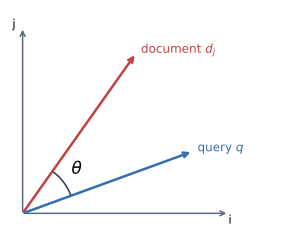

对于非负权重且非零的文档、查询向量：$`0\leq\mathop{\mathrm{sim}}\nolimits(d_j,q)\leq1`$。

**7.5.1 查询中的词项权重：**

```math
w_{i,q}=(1+\log f_{i,q})\log\frac{N}{n_i}\qquad(f_{i,q}\gt 0).
```

**文档中的词项权重：**

```math
w_{i,j}=(1+\log f_{i,j})\log\frac{N}{n_i}\qquad(f_{i,j}\gt 0).
```

符号含义：

- $`f_{i,q}`$：词项 $`i`$ 在查询 $`q`$ 中出现的频次（term frequency）。
- $`f_{i,j}`$：词项 $`i`$ 在文档 $`j`$ 中的频次。
- $`N`$：语料库中的总文档数。
- $`n_i`$：包含词项 $`i`$ 的文档数（document frequency）。

若 $`f_{i,q}=0`$，定义 $`w_{i,q}=0`$；若 $`f_{i,j}=0`$，定义 $`w_{i,j}=0`$。

**例：对查询 “to do” 计算文档排名。** 文档仍使用前面的 $`d_1,d_2,d_3,d_4`$。为了给同一查询排序，可先省略所有文档共同的因子 $`\Vert \mathbf q\Vert`$，计算排序分数

```math
\mathop{\mathrm{rank}}\nolimits(d_j,q)=\frac{\mathbf d_j\cdot\mathbf q}{\Vert \mathbf d_j\Vert }.
```

| 文档 | Rank computation（省略共同的查询范数） | Rank |
|---|---|---:|
| $`d_1`$ | $`(1\times3+0.415\times0.830)/5.068`$ | 0.660 |
| $`d_2`$ | $`(1\times2+0.415\times0)/4.899`$ | 0.408 |
| $`d_3`$ | $`(1\times0+0.415\times1.073)/3.762`$ | 0.118 |
| $`d_4`$ | $`(1\times0+0.415\times1.073)/7.738`$ | 0.058 |

**以 $`d_1`$ 为例，$`q=\text{“to do”}`$。** 使用以 2 为底的对数。

1. 对于 to：

    $`\displaystyle w_{\mathrm{to},q}=(1+\log_2 1)\log_2\frac42=1,`$

    $`\displaystyle w_{\mathrm{to},1}=(1+\log_2 4)\log_2\frac42=3.`$

2. 对于 do：

    $`\displaystyle w_{\mathrm{do},q}=(1+\log_2 1)\log_2\frac43\approx0.415,`$

    $`\displaystyle w_{\mathrm{do},1}=(1+\log_2 2)\log_2\frac43\approx0.830.`$

3. 对于 is：

    $`\displaystyle w_{\mathrm{is},1}=(1+\log_2 2)\log_2\frac41=4.`$

4. 对于 be：

    $`\displaystyle w_{\mathrm{be},1}=(1+\log_2 2)\log_2\frac44=0.`$

因此

```math
\Vert \mathbf d_1\Vert =\sqrt{3^2+0.830^2+4^2}\approx5.068,\qquad \Vert \mathbf q\Vert =\sqrt{1^2+0.415^2}\approx1.083.
```

完整余弦相似性：

```math
\mathop{\mathrm{sim}}\nolimits(d_1,q)=\frac{1\times3+0.415\times0.830}{\sqrt{3^2+0.830^2+4^2}\sqrt{1^2+0.415^2}}\approx0.610.
```

因为同一次查询中各文档使用相同的 $`\Vert \mathbf q\Vert`$，排序时可以不除以它；但计算真正的 cosine similarity 时仍需包含查询范数。

**7.5.2 Vector model 的优点：**

- Term-weighting improves quality of the answer set. 使用 TF-IDF 等加权方法可以更准确表示词项的重要性，提高检索结果的相关性。
- Partial matching allows retrieval of documents that approximate the query conditions. 不要求完全匹配，允许返回与查询条件大致相符的文档，增强灵活性。
- Cosine ranking formula sorts documents according to a degree of similarity to the query. 相关性高的文档排在前面。
- Document length normalization is naturally built into the ranking. 向量范数自动调整文档长度的影响，减少长文档仅因长度而占优的偏差。

**缺点：** It assumes independence of index terms. 词项在实际语言中可能存在语义关联，而经典模型没有显式考虑这种依赖关系。

## 8. Text Classification

### 8.1 要素与分类器

- $`D`$：文档集合。
- $`C=\{c_1,c_2,\ldots,c_L\}`$：包含 $`L`$ 个类别的集合，每个类别都有标签。

分类器（Classifier）是一个二元函数：

```math
F:D\times C\longrightarrow\{0,1\}.
```

对于每对 $`(d_j,c_p)`$，若文档 $`d_j`$ 属于类 $`c_p`$，则 $`F(d_j,c_p)=1`$；否则为 0。

分类类型：

- **Single-label（单标签）：** 每个文档只分配一个类别。
- **Multi-label（多标签）：** 每个文档可以被分配一个或多个类别。

### 8.2 无监督算法（Unsupervised Algorithms）

#### 8.2.1 聚类（Clustering）

- 输入：一组未标注文档。
- 输出：将文档分成若干组（cluster），每组内容相似。

#### 8.2.2 K-means 聚类算法

输入要生成的簇数 $`K`$，步骤如下：

1. 随机选取 $`K`$ 个文档作为初始中心（质心）。
2. 将其他文档分配给最近质心的簇，可用余弦相似度判断。
3. 重新计算每个簇的质心。
4. 重复步骤 2 和 3，直到质心不再变化。

#### 8.2.3 简易（Naive）文本分类

已知类名，无需训练数据。根据文档中出现的词与类标签的匹配程度分类。

1. 将文档与类别表示成词项向量。
2. 用词项匹配类标签，支持同义词。
3. 选择相似度最高的类作为分类结果。

### 8.3 有监督算法（Supervised Algorithms）

特点：

- 依赖训练数据，即已标注的文档—类别对。
- 需要评估性能：用测试集比较分类器输出和人工标注。

#### 8.3.1 决策树（Decision Tree）

- 每个内部节点：一个关键字或词项。
- 每个叶节点：一个类别。
- 构建方式：从所有文档开始，按信息增益等标准选择最能区分文档的词，递归划分，直到满足终止条件。
- 优点：结构清晰，可解释性强。

#### 8.3.2 k 近邻算法（kNN）

属于“懒惰学习”方法，无需事先拟合模型。分类步骤：

1. 新文档 $`d_j`$ 到来时，与训练集所有文档计算相似度，如余弦相似度。
2. 选出 $`k`$ 个最相似的邻居。
3. 看这些邻居的类别，用投票法决定 $`d_j`$ 的类别。

- **性能瓶颈：** 需要与所有训练文档比较。
- **参数选择：** 关键是如何选取最优的 $`k`$ 值。

## 9. Indexing and Searching

### 9.1 IR System 的效率评价

Information Retrieval System 的 efficiency 指标包括：

- Indexing time：建立索引的时间。
- Indexing space：建立索引时所需的空间。
- Index storage：索引存储量。
- Query latency：查询延迟。
- Query throughput：吞吐量，即每秒可以处理的 queries 数量。

### 9.2 Inverted Indexes（倒排索引）

包括 vocabulary 和 occurrences。

#### 9.2.1 Term-document matrix

文档仍使用上面的四个例子。$`n_i`$ 表示词项出现于多少个文档；矩阵单元表示该词在对应文档中出现的次数。

| Vocabulary | $`n_i`$ | $`d_1`$ | $`d_2`$ | $`d_3`$ | $`d_4`$ |
|---|---:|---:|---:|---:|---:|
| to | 2 | 4 | 2 | 0 | 0 |
| do | 3 | 2 | 0 | 3 | 3 |
| is | 1 | 2 | 0 | 0 | 0 |
| be | 4 | 2 | 2 | 2 | 2 |
| or | 1 | 0 | 1 | 0 | 0 |
| not | 1 | 0 | 1 | 0 | 0 |
| I | 2 | 0 | 2 | 2 | 0 |
| am | 2 | 0 | 2 | 1 | 0 |
| what | 1 | 0 | 1 | 0 | 0 |
| think | 1 | 0 | 0 | 1 | 0 |
| therefore | 1 | 0 | 0 | 1 | 0 |
| da | 1 | 0 | 0 | 0 | 3 |
| let | 1 | 0 | 0 | 0 | 2 |
| it | 1 | 0 | 0 | 0 | 2 |

#### 9.2.2 Basic inverted index

仅保存出现过的文档以及词频，记为 `[文档编号, 次数]`。

| Vocabulary | $`n_i`$ | Occurrences as inverted lists |
|---|---:|---|
| to | 2 | `[1,4], [2,2]` |
| do | 3 | `[1,2], [3,3], [4,3]` |
| is | 1 | `[1,2]` |
| be | 4 | `[1,2], [2,2], [3,2], [4,2]` |
| or | 1 | `[2,1]` |
| not | 1 | `[2,1]` |
| I | 2 | `[2,2], [3,2]` |
| am | 2 | `[2,2], [3,1]` |
| what | 1 | `[2,1]` |
| think | 1 | `[3,1]` |
| therefore | 1 | `[3,1]` |
| da | 1 | `[4,3]` |
| let | 1 | `[4,2]` |
| it | 1 | `[4,2]` |

例如 `to` 的倒排表说明：$`d_1`$ 出现 4 次，$`d_2`$ 出现 2 次。

#### 9.2.3 Full inverted indexes

加上 word 在文档中出现的位置，记为 `[文档编号, 次数, [位置列表]]`。

| Vocabulary | $`n_i`$ | Occurrences as full inverted lists |
|---|---:|---|
| to | 2 | `[1,4,[1,4,6,9]], [2,2,[1,5]]` |
| do | 3 | `[1,2,[2,10]], [3,3,[6,8,10]], [4,3,[1,2,3]]` |
| is | 1 | `[1,2,[3,8]]` |
| be | 4 | `[1,2,[5,7]], [2,2,[2,6]], [3,2,[7,9]], [4,2,[9,12]]` |
| or | 1 | `[2,1,[3]]` |
| not | 1 | `[2,1,[4]]` |
| I | 2 | `[2,2,[7,10]], [3,2,[1,4]]` |
| am | 2 | `[2,2,[8,11]], [3,1,[5]]` |
| what | 1 | `[2,1,[9]]` |
| think | 1 | `[3,1,[2]]` |
| therefore | 1 | `[3,1,[3]]` |
| da | 1 | `[4,3,[4,5,6]]` |
| let | 1 | `[4,2,[7,10]]` |
| it | 1 | `[4,2,[8,11]]` |

例如，第 1 个文档出现了 4 次 `to`，分别在第 1、4、6、9 个单词的位置。

#### 9.2.4 Single word queries

使用 hashing 或 B-trees 查找词项。

#### 9.2.5 Multiple word queries

**合取查询（Conjunctive Query，使用 AND 操作符）** 要求所有词都必须出现在结果文档中。

1. 为每个词获取对应的倒排列表（Inverted List）。
2. 将所有倒排列表求交集（intersect）。
3. 得到同时包含所有词的文档。

**析取查询（Disjunctive Query，使用 OR 操作符）** 要求至少一个词出现在结果文档中。

1. 获取每个词的倒排列表。
2. 将这些列表合并（merge，求并集）。
3. 得到包含任意一个词的文档。

### 9.3 Signature Files

基于 hash，将词项映射为位串，并按位 OR 生成文本块的 signature。

例子：

| Block | Text | Text signature |
|---|---|---|
| 1 | This is a text. | `000101` |
| 2 | A text has many | `110101` |
| 3 | words. Words are | `100100` |
| 4 | made from letters. | `101101` |

Signature function：

| 词 | Hash signature |
|---|---|
| text | `000101` |
| many | `110000` |
| words | `100100` |
| made | `001100` |
| letters | `100001` |

将句子按每 $`b`$ 个 words 分为一个 block。这个例子每 4 个词一块，并对有索引意义的词计算 signature。

Block 1 是 `This is a text`：

```math
h(\text{text})=000101,
```

所以 signature 是 `000101`。

Block 2 是 `A text has many`：

```math
h(\text{text})=000101,\qquad h(\text{many})=110000.
```

每一位做 OR：

```text
  000101
OR110000
--------
  110101
```

如果一个 word 在某个 block 中，signature 一定会通过筛选；但通过 signature 筛出的 block 可能并没有这个 word，这叫 **false drop**。

如何 searching？设：

- $`W`$：query 的 signature。
- $`B_i`$：block 的 signature。

如果

```math
W\mathbin{\&}B_i=W,
```

那么该 block 中可能出现了 query，需要进一步核对原文。

## 10. Visual Information Processing

### 10.1 Gray level

Gray levels 的数量记为 $`L`$，即 brightness levels 的数量。8-bit 图片中：

```math
L=2^8=256,
```

brightness 的取值为 $`0`$–$`255`$。

### 10.2 三种距离

坐标为 $`(i,j)`$ 与 $`(h,k)`$ 的两个点之间的距离可以用不同方式定义。

**Euclidean distance $`D_E`$：**

```math
D_E((i,j),(h,k))=\sqrt{(i-h)^2+(j-k)^2}.
```

**City block distance $`D_4`$**，又称 $`L_1`$ metric 或 Manhattan distance：

```math
D_4((i,j),(h,k))=\vert i-h\vert +\vert j-k\vert .
```

**Chessboard distance $`D_8`$：**

```math
D_8((i,j),(h,k))=\max\{\vert i-h\vert ,\vert j-k\vert \}.
```

- **$`D_4`$：** 可以向上、下、左、右 4 个方向走。
- **$`D_8`$：** 可以向 8 个方向走，包括斜着走。

例如从 $`(0,2)`$ 到 $`(4,0)`$，三种距离分别为 $`D_E=\sqrt{20}`$、$`D_4=6`$、$`D_8=4`$。

### 10.3 Neighbors

中心点为 $`p`$，四邻域与八邻域如下，星号表示邻居：

```math
\text{4-neighborhood: }\begin{matrix}&\ast&\\\ast&p&\ast\\&\ast&\end{matrix} \qquad \text{8-neighborhood: }\begin{matrix}\ast&\ast&\ast\\\ast&p&\ast\\\ast&\ast&\ast\end{matrix}.
```

- 两点是 **4-neighbors**，当且仅当 $`D_4(p,q)=1`$。
- 两点是 **8-neighbors**，当且仅当 $`D_8(p,q)=1`$。

### 10.4 Region & Contiguous

- **Region（区域）**：由多个相邻像素组成的集合。一个区域是一个连通的像素集合，即这些像素之间是“连接”的。

- **Contiguous（连通）**：一组像素中，如果任意两个像素之间存在一条完全位于该集合内的路径，那么这个像素集合就是一个连通区域。

### 10.5 $`R`$、$`R_i`$、$`R^c`$、background、holes

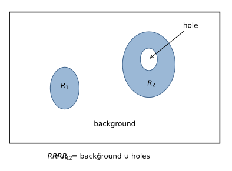

各前景区域 $`R_i`$ 的并集构成 $`R`$；$`R^c`$ 包括背景及孔洞。

- $`R_i`$ 是不相交的区域（disjoint regions），彼此没有重叠。这个例子中各区域均不接触图像边界。
- $`R`$ 是所有 $`R_i`$ 的合集，即图像中所有目标区域的总和，$`R=\bigcup_iR_i`$，也就是所有前景。
- $`R^c`$ 是 $`R`$ 的补集（complement），即图像中不属于 $`R`$ 的部分，是非前景。
- $`R^c`$ 中与图像边界相连的部分称为背景（background），例如图像四周的空白区域。
- $`R^c`$ 中剩下的部分称为空洞（holes），即被区域 $`R`$ 围住的空白，像圆圈的中心部分。
- 如果一个区域没有洞，称为“简单连通区域”（simply connected region）。
- 如果区域中包含一个或多个洞，称为“多重连通区域”（multiply connected region）。

### 10.6 内外 border

- **区域的内部边界（inner border，border of a region）**：区域内的一些像素，它们的邻居中至少有一个在区域外，即不属于该区域。这些像素虽然在区域内，但靠近边缘，与区域外相连。邻居可以按 4 邻域或 8 邻域定义。

- **区域的外部边界（outer border）**：区域补集中靠近该区域的像素，也就是在区域外与它贴着的一圈像素。

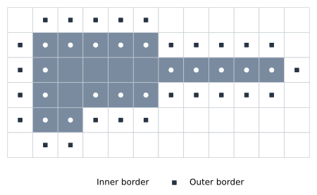

### 10.7 图像分析的数据结构

#### 10.7.1 Matrix

用矩阵表示图像。

#### 10.7.2 Chains

使用 8 邻域的 chain code，方向编码如下：

```math
\begin{matrix} 3\;\nwarrow&2\;\uparrow&1\;\nearrow\\ 4\;\leftarrow&\bullet&0\;\rightarrow\\ 5\;\swarrow&6\;\downarrow&7\;\searrow \end{matrix}.
```

从标出的参考像素开始，沿轮廓顺时针走，逐步记录方向：

```text
00077665555556600000006444444442221111112234445652211
```

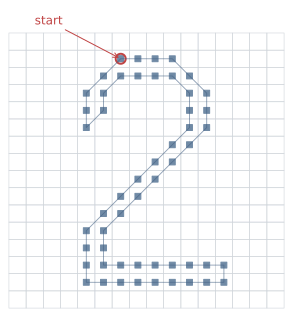

#### 10.7.3 Run length coding

按行记录连续像素的起止列。例子中的像素坐标如下（行、列均从 0 开始）：

| 行 | 非零像素的列 | 编码 |
|---:|---|---|
| 1 | 1、4 | `11144` |
| 2 | 1、2、3、4 | `214` |
| 5 | 2、3、5 | `52355` |

完整编码为：

```text
((11144) (214) (52355))
```

- `11144`：第 1 行，$`(1,1)`$ 表示从列 1 到列 1；$`(4,4)`$ 表示从列 4 到列 4。
- `214`：第 2 行，$`(1,4)`$ 表示从列 1 到列 4。
- `52355`：第 5 行，$`(2,3)`$ 表示从列 2 到列 3；$`(5,5)`$ 表示从列 5 到列 5。

### 10.8 图像预处理：Pixel brightness transformations

Pixel brightness transformation 分为：

- Brightness corrections。
- Gray-scale transformations（灰度变换）。

#### 10.8.1 Gray-scale transformation

$`f\to g`$，变的是每个点的 brightness，也就是改变每个点的灰度。

- 分段线性函数可以增强 $`p_1`$ 与 $`p_2`$ 之间的图像对比度（contrast enhancement）。
- Brightness thresholding 将图像变成黑白图像。
- Negative transformation 用下降直线实现明暗反转。

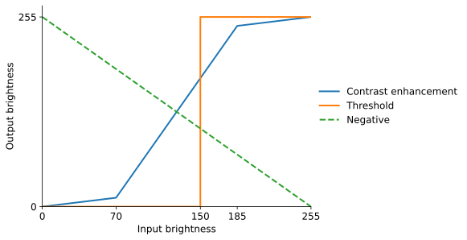

#### 10.8.2 Histogram equalization

直方图均衡化让 brightness 分布更均匀。

```math
q=T(p).
```

- $`q`$：输出 brightness，范围 $`[q_0,q_k]`$。
- $`p`$：输入 brightness，范围 $`[p_0,p_k]`$。
- 对 $`N\times N`$ 的图像，$`N^2`$ 是总像素数。
- $`H(i)`$：brightness 为 $`i`$ 的像素个数。

```math
q=T(p)=\frac{q_k-q_0}{N^2}\sum_{i=p_0}^{p}H(i)+q_0.
```

其中 $`\sum_{i=p_0}^{p}H(i)`$ 是从 $`p_0`$ 到当前 $`p`$ 的累计像素个数。

例：有一幅 $`64\times64`$ 的 gray-scale image，gray level range from 0 to 7。Brightness levels 的数量为 8，因此是 3-bit image。

| Brightness level | 像素数量 $`n`$ |
|---:|---:|
| 0 | 790 |
| 1 | 1023 |
| 2 | 850 |
| 3 | 656 |
| 4 | 329 |
| 5 | 245 |
| 6 | 122 |
| 7 | 81 |

代入均衡化公式，并将结果四舍五入为整数灰度：

```math
T(0)=\frac{7}{64\times64}\times790+0\approx1.35\approx1.
```

```math
T(1)=\frac{7}{64\times64}(790+1023)+0\approx3.098\approx3.
```

```math
T(2)=\frac{7}{64\times64}(790+1023+850)+0\approx4.551\approx5.
```

后面同理，完整映射为 $`[1,3,5,6,6,7,7,7]`$。

### 10.9 图像预处理：Local pre-processing

使用图像中一个像素的小邻域区域，通过计算生成新的亮度值，形成输出图像。在信号处理领域，这种方法也称为滤波（filtering）。

#### 10.9.1 两类局部预处理方法

- **平滑（Smoothing）**：目标是抑制图像中的噪声或其他小波动。缺点是会模糊所有锐利边缘，而边缘包含图像的重要信息。

- **梯度算子（Gradient Operators）**：基于图像函数的局部导数，识别图像中的快速变化区域。快速变化处导数值较大，梯度算子的目的是标识这些变化显著的位置。噪声通常具有高频特性，应用梯度算子也可能同时增强噪声。

#### 10.9.2 Spatial averaging

空间平均可以 suppress noise（抑制噪声）：用窗口内的平均值替代原值。

#### 10.9.3 Non-linear smoothing operator：Median filtering

中值滤波。例如原图 $`5\times5`$，窗口为 $`3\times3`$。

假设窗口区域为：

```math
\begin{bmatrix} 70&80&90\\ 120&\boxed{140}&130\\ 170&180&190 \end{bmatrix}.
```

从小到大排列：

```math
70,80,90,120,130,140,170,180,190.
```

中位数为 130，用 130 替代中心值 140。

#### 10.9.4 Directional smoothing

Spatial averaging（均值滤波）的问题是 edges get blurred（边缘模糊），可以用 directional smoothing 减轻这个问题。

#### 10.9.5 Image derivative and sharpening

给定一个 $`5\times5`$ 灰度图像，以及两个 $`3\times3`$ operator：

```math
I=\begin{bmatrix} 1&2&3&4&5\\1&2&3&4&5\\1&2&3&4&5\\1&2&3&4&5\\1&2&3&4&5 \end{bmatrix},
```

```math
K_1=\begin{bmatrix}-1&0&1\\1&0&1\\0&0&1\end{bmatrix},\qquad K_2=\begin{bmatrix}1&0&1\\2&0&1\\4&0&1\end{bmatrix}.
```

这里的矩阵用于演示“对应相乘、求和”的计算；若要作为严格的导数算子，应另外使用具有相应导数性质的滤波核。

选中的 $`3\times3`$ 邻域为：

```math
A=\begin{bmatrix}2&3&4\\2&3&4\\2&3&4\end{bmatrix}.
```

每个位置对应相乘，然后相加、取绝对值，再把两个绝对值相加：

```math
G=\left\vert \sum_{i,j}A_{ij}(K_1)_{ij}\right\vert + \left\vert \sum_{i,j}A_{ij}(K_2)_{ij}\right\vert .
```

第一个响应：

```math
\begin{aligned} G_1={}&2(-1)+3(0)+4(1)\\ &+2(1)+3(0)+4(1)\\ &+2(0)+3(0)+4(1)=12. \end{aligned}
```

第二个响应：

```math
\begin{aligned} G_2={}&2(1)+3(0)+4(1)\\ &+2(2)+3(0)+4(1)\\ &+2(4)+3(0)+4(1)=26. \end{aligned}
```

因此 $`G=\vert 12\vert +\vert 26\vert =38`$。

#### 10.9.6 二阶求导：Laplacian 矩阵

```math
\begin{bmatrix} 0&1&0\\ 1&-4&1\\ 0&1&0 \end{bmatrix}.
```

中心是 $`(x,y)`$，因此：

```math
\nabla^2 f(x,y)=f(x+1,y)+f(x-1,y)+f(x,y+1)+f(x,y-1)-4f(x,y).
```

只有一个矩阵，这里不用加绝对值。

#### 10.9.7 Unsharp masking

Unsharp masking is an image manipulation technique for increasing the apparent sharpness of photographic images.

The “unsharp” of the name derives from the fact that the technique uses a blurred, or “unsharp”, positive to create a “mask” of the original image. The unsharp mask is then combined with the negative, creating a resulting image sharper than the original.

数字图像处理中的步骤：

1. **Blur the image**：平滑图像。
2. **Subtract the blurred version from the original**：原图减去模糊图像，计算差值，这叫作 mask。
3. **Add the mask to the original**：给原图加上差值。

```math
\text{mask}=f-f_{\mathrm{blur}},\qquad f_{\mathrm{sharp}}=f+\text{mask}.
```

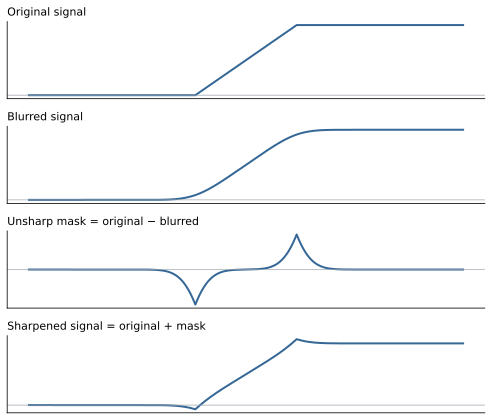
