# Java Programming · 笔记

各节代码按独立示例阅读；同一示例中有多个 `public` 顶层类时，应分别保存到与类名相同的 `.java` 文件中。只展示方法或语句的片段，需要放入相应的类或方法内。

## HelloWorld案例的编写

```java
public class HelloWorld {
    public static void main(String[] args) {
        System.out.println("HelloWorld");
    }
}
```

**注意点**

Java 类名通常按命名约定使用大写字母开头；这是命名规范，并非语法强制要求。

## 基本数据类型

| 类型 | 位数 | 取值范围或含义 |
| --- | --- | --- |
| `byte` | 8 | −128～127 |
| `short` | 16 | −32,768～32,767 |
| `int` | 32 | −2,147,483,648～2,147,483,647 |
| `long` | 64 | −2⁶³～2⁶³−1 |
| `float` | 32 | IEEE 754 单精度；最大有限绝对值约 3.4 × 10³⁸，最小正非零值约 1.4 × 10⁻⁴⁵ |
| `double` | 64 | IEEE 754 双精度；最大有限绝对值约 1.8 × 10³⁰⁸，最小正非零值约 4.9 × 10⁻³²⁴ |
| `char` | 16 | 无符号 UTF-16 代码单元，0～65,535 |
| `boolean` | — | `true` 或 `false`，语言规范不规定其存储字节数 |

浮点类型也可以表示负数、正负零、无穷大和 `NaN`。

### 说明

- e+38表示是乘以10的38次方，同样，e-45表示乘以10的负45次方。

- 在java中整数默认是int类型，浮点数默认是double类型。

### 需要记忆以下几点

- **`byte` 类型的取值范围：** −128～127。
- **`int` 类型的大概取值范围：** −21 亿多～21 亿多。
- **按可表示数值的最大量级比较：** `double > float > long > int > short > byte`。
- **范围与精度：** 范围更大不代表整数精度更高；`float` 不能精确表示所有 `int`，`double` 也不能精确表示所有 `long`。

## 定义 8 种基本数据类型变量与 String 引用变量

```java
public class VariableDemo3{
    public static void main(String[] args){
        //1.定义byte类型的变量
        //数据类型 变量名 = 数据值;
        byte a = 10;
        System.out.println(a);
        //2.定义short类型的变量
        short b = 20;
        System.out.println(b);
        //3.定义int类型的变量
        int c = 30;
        System.out.println(c);
        //4.定义long类型的变量
        long d = 123456789123456789L;
        System.out.println(d);
        //5.定义float类型的变量
        float e = 10.1F;
        System.out.println(e);
        //6.定义double类型的变量
        double f = 20.3;
        System.out.println(f);
        //7.定义char类型的变量
        char g = 'a';
        System.out.println(g);
        //8.定义boolean类型的变量
        boolean h = true;
        System.out.println(h);
        //9.定义String类型的变量
        String name = "黑马谢广坤";
        System.out.println(name);
    }
}
```

**注意点**

- 如果要定义 一个整数类型的变量，不知道选择哪种数据类型了，默认使用int。

- 如果要定义 一个小数类型的变量，不知道选择哪种数据类型了，默认使用double。

- 整数文字超出 `int` 范围时，需要加 `L` 后缀才表示 `long`（大小写都可以，建议大写）。例如 `long n = 10;` 也合法，`10` 会由 `int` 转为 `long`。

- 如果要定义一个float类型的变量，那么在数据值的后面需要加上F后缀。（大小写都可以）

## 输入

键盘录入的实际功能Java已经帮我们写好了，不需要我们自己再实现了，而Java写好的功能都放在了Scanner这个类中，所以，我们只要直接使用Scanner这个类就可以了。

**使用步骤**

1. **导包：** 先找到 `Scanner` 这个类在哪。
2. **创建对象：** 申明一下，准备开始用 `Scanner` 这个类。
3. **接收数据：** 真正干活的代码。

**代码示例**

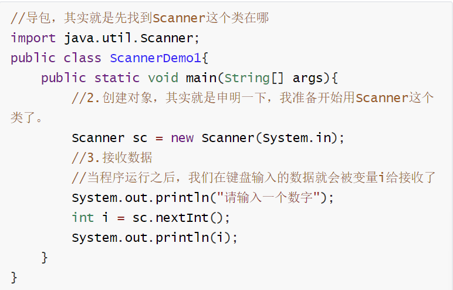

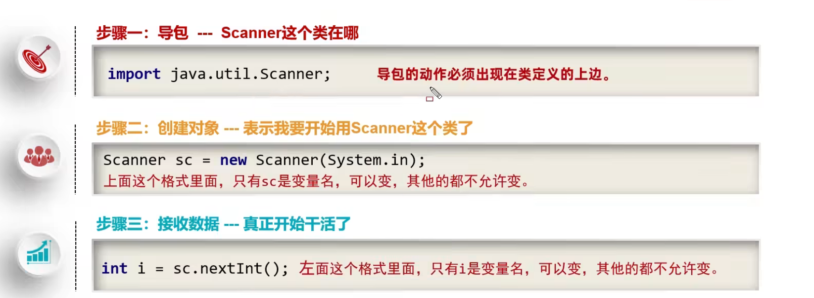

### 键盘录入涉及到的方法如下：

- **读取字符串：** `next()`、`nextLine()`。
- **读取数值：** `nextInt()`、`nextDouble()`。

#### 1）next（）、nextLine（）：

可以接受任意数据，但是都会返回一个字符串。

**代码示例**

```java
Scanner sc = new Scanner(System.in);
String s = sc.next();//录入的所有数据都会看做是字符串
System.out.println(s);
```

**代码示例**

```java
Scanner sc = new Scanner(System.in);
String s = sc.nextLine();//录入的所有数据都会看做是字符串
System.out.println(s);
```

#### 2）nextInt（）：

- **可接受内容：** 只能接受整数。例如，键盘录入 123，会把 123 当作 `int` 类型的整数返回。
- **输入错误：** 录入小数或者其他字母会报错。

**代码示例**

```java
Scanner sc = new Scanner(System.in);
int s = sc.nextInt();//只能录入整数
System.out.println(s);
```

#### 3）nextDouble（）：

- **可接受内容：** 能接收整数和小数，都会看作小数返回。
- **输入错误：** 录入字母会报错。

**代码示例**

```java
Scanner sc = new Scanner(System.in);
double d = sc.nextDouble();//录入的整数，小数都会看做小数。
//录入字母会报错
System.out.println(d);
```

### 第一个细节：

- **停止位置：** `next()`、`nextInt()`、`nextDouble()` 接收数据时，遇到空格、回车、制表符中的一个就会停止接收数据。
- **剩余输入：** 分隔符以及后面的数据仍可能留在输入中；如果后面还有其他键盘录入方法，会继续接收这些数据。

**代码示例**

```java
Scanner sc = new Scanner(System.in);
String s1 = sc.next();
String s2 = sc.next();
System.out.println(s1);
System.out.println(s2);
//此时值键盘录入一次a b(注意a和b之间用空格隔开)
//那么第一个next();会接收a，a后面是空格，那么就停止，所以打印s1是a
//但是空格+b还在内存中。
//第二个next会去掉前面的空格，只接收b
//所以第二个s2打印出来是b
```

### 第二个细节：

nextLine（）方法是把一整行全部接收完毕。

**代码示例**

```java
Scanner sc = new Scanner(System.in);
String s = sc.nextLine();
System.out.println(s);
//键盘录入a b(注意a和b之间用空格隔开)
//那么nextLine不会过滤前面和后面的空格，会把这一整行数据全部接收完毕。
```

## 如何配合使用输入方法

`next()`、`nextInt()`、`nextDouble()` 按 token 读取；`nextLine()` 读取当前位置到本行结束的内容，并消费行结束符。

它们可以混用，但 `nextInt()` 等方法后可能留下换行符，紧接着的 `nextLine()` 会先读到当前行剩余的内容（常常是空字符串）。若要读取下一整行，先消费当前行的剩余内容：

```java
Scanner sc = new Scanner(System.in);
int age = sc.nextInt();
sc.nextLine(); // 消费本行剩余内容及换行符
String name = sc.nextLine();
```

也可以统一用 `nextLine()`，需要整数时再用 `Integer.parseInt()` 转换。

按 token 读取的示例：

```java
Scanner sc = new Scanner(System.in);
String s = sc.next(); // 键盘录入123
System.out.println("此时为字符串：" + s);
int i = sc.nextInt(); // 再录入123
System.out.println("此时为整数：" + i);
```

按行读取并转换的独立示例：

```java
Scanner sc = new Scanner(System.in);
String s = sc.nextLine(); // 键盘录入123
System.out.println("此时为字符串：" + s);
int i = Integer.parseInt(s);
System.out.println("此时为整数：" + i);
```

## IDEA结构分类

1. **project**（项目、工程）
2. **module**（模块）
3. **package**（包）
4. **class**（类）

### IDEA技巧

`psvm` + 回车可生成 `public static void main(String[] args) {}`。

`sout` 是 IDE 模板缩写，可生成 `System.out.println();`，它本身不是 Java 语句。

## 算术运算符

**注意点**

1. 整数相除得到整数商，小数部分向零截断。如果需要浮点数结果，至少一个操作数应为浮点类型。

2. 小数直接参与运算，得到的结果有可能是不精确的。

**案例**

```java
System.out.println( 10 / 3);//3
System.out.println(10.0 / 3);//3.3333333333333335
```

**一些公式**

- **`% 10`：** 得到最后一位数（个位）。
- **`% 100`：** 得到最后两位数。
- **`/ 10`：** 去除最后一位数。

## 两种自动类型提升规则：

- 取值范围小的，和取值范围大的进行运算，小的会先提升为大的，再进行运算。

- byte、short、char三种类型的数据在运算的时候，都会直接先提升为int，然后再进行运算。

## 常见的数值拓宽转换方向

`byte → short → int → long → float → double` 是常见的数值拓宽转换方向，`char → int` 也可以。拓宽转换也可能损失精度，例如 `int → float`。

## 强制类型转换

### 概念：

如果要把一个取值范围大的数据或者变量赋值给另一个取值范围小的变量。是不允许直接操作。

如果一定要这么干，就需要加入强制转换。

### 书写格式：

目标数据类型 变量名 = （目标数据类型）被强转的数据；

**简单理解**

要转成什么类型的，那么就在小括号中写什么类型就可以了。

**案例**

```java
public class OperatorDemo2 {
    public static void main(String[] args) {
        double a = 12.3;
        int b = (int) a;
        System.out.println(b);//12
    }
}
```

**注意点**

强制转换有可能会导致数据发生错误。（数据的精度丢失）

## 字符串的+操作

案例1：

1 + "abc" + 1

结果："1abc1"

案例2：

1 + 2 + "abc" + 2 + 1

结果：“3abc21”

案例3：

```java
String name = "黑默丁格";
System.out.println("我的名字是" + name);
```

结果： 我的名字是黑默丁格

解释：当字符串跟变量相加的时候，实际上是跟变量里面的值进行拼接。

## 字符的+操作

### 规则：

`char` 参与数值加法时，会提升为其 UTF-16 代码单元对应的 `int` 值再计算。英文字母等 ASCII 字符的码值与此一致；如果另一侧是字符串，则进行字符串拼接。

### 案例：

```java
char c = 'a';
int result = c + 0;
System.out.println(result);//97
```

ASCII码表中：

- **`'a'`：** 97。
- **`'A'`：** 65。

## 扩展赋值运算符注意点：

扩展的赋值运算符中隐层还包含了一个强制转换。

以+=为例。

当 `a` 的类型为 `byte` 时，`a += b` 的数值转换效果相当于 `a = (byte) (a + b)`。一般情况下，复合赋值会把结果转换为左侧变量的类型，并且左侧只求值一次。

```java
public class OperatorDemo8 {
    public static void main(String[] args) {
        byte a = 10;
        byte b = 20;
        //a += b;
        a = (byte)(a + b);
        System.out.println(a);//30
    }
}
```

## 关系运算符（与C相同）

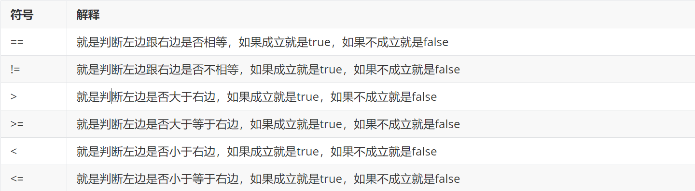

## 逻辑运算符（与C差不多）

### & 和 | 的使用：

```java
// & //两边都是真，结果才是真。
System.out.println(true & true);//true
System.out.println(false & false);//false
System.out.println(true & false);//false
System.out.println(false & true);//false
// | 或 //两边都是假，结果才是假，如果有一个为真，那么结果就是真。
System.out.println(true | true);//true
System.out.println(false | false);//false
System.out.println(true | false);//true
System.out.println(false | true);//true
```

### ^（异或）的使用：

在以后用的不多，了解一下即可。

计算规则：如果两边相同，结果为false，如果两边不同，结果为true

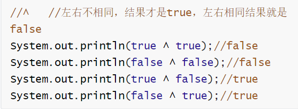

### !（取反）的使用：

是取反，也叫做非。

计算规则：false取反就是true，true取反就是false

通常写一个 `!` 即可；连续取反也合法，例如 `!!flag` 的值与 `flag` 相同。

**代码示例**

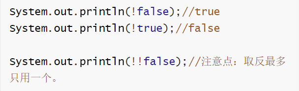

## 短路逻辑运算符

分类： && ||

### &&：

对布尔值的真值规则与 `&` 相同，但具有短路效果。

### ||：

对布尔值的真值规则与 `|` 相同，但具有短路效果。

### 逻辑核心：

- 当左边不能确定整个表达式的结果，右边才会执行。

- 当左边能确定整个表达式的结果，那么右边就不会执行了。从而提高了代码的运行效率。

### 总结：

`&&` 与 `&`、`||` 与 `|` 对布尔值具有相同的真值表，但右侧表达式是否执行不同；如果右侧有副作用或可能抛出异常，程序行为就可能不同。

### 建议：

最为常用： && || ！

## 三元运算符

又叫做：三元表达式或者问号冒号表达式。

### 格式：

关系表达式 ？ 表达式1 ：表达式2 ；

### 计算规则：

1. **计算条件：** 计算关系表达式的值。
2. **选择结果：** 如果值为真，执行表达式 1；如果值为假，执行表达式 2。

### 注意点：

三元运算符的最终结果一定要被使用，要么赋值给一个变量，要么直接打印出来。

### 案例：

```java
System.out.println(a > b ? a : b);
```

## 运算符的优先级

只要知道其中一点：小括号优先于所有

## 判断语句：if语句

**格式**

```java
if (关系表达式1) {
    // 语句体1
} else if (关系表达式2) {
    // 语句体2
} else if (关系表达式3) {
    // 语句体3
} else {
    // 其他情况的语句体
}
```

## switch语句

### 格式

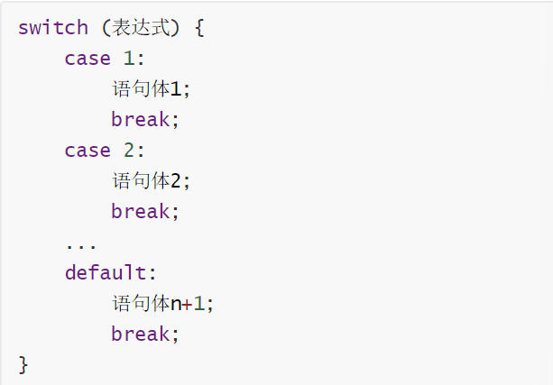

### 举例

```java
int week = 1;
switch (week){
    case 1:
    System.out.println("跑步");
    break;
    case 2:
    System.out.println("游泳");
    break;
    case 3:
    System.out.println("慢走");
    break;
}
```

### switch 的扩展知识

`switch` 箭头写法及表达式在 JDK 12 中预览，在 JDK 14 中正式引入。参见 [JEP 361](https://openjdk.org/jeps/361)。

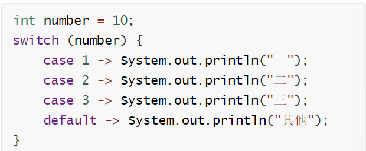

## 循环结构

### for循环格式：

**代码示例**

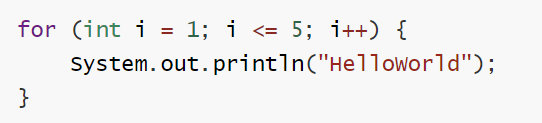

## while循环

### 实例：打印5次HelloWorld

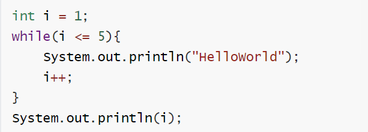

## do...while循环

**格式**

初始化语句; do{ 循环体; 条件控制语句; }while(条件判断语句);

**特点**

先执行，再判断。

## break

结束循环

## continue

跳过本次循环，继续执行下次循环。

## Random

1. 导包

   ```java
   import java.util.Random;
   ```

2. 创建对象

   ```java
   Random r = new Random ();
   ```

3. 生成随机数

   ```java
   int number = r.nextInt(随机数的范围);
   ```

`r` 和 `number` 都是可自定义的变量名。`nextInt(bound)` 中的 `bound` 必须是正整数。

随机数范围的特点：从0开始，不包含指定值。比如：参数为10，生成的范围[0,10)

**代码示例**

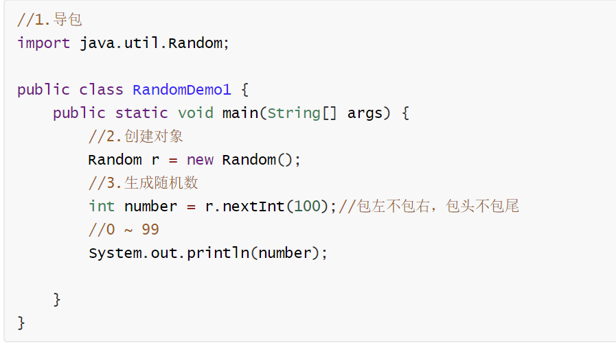

## 数组的定义

### 格式一：

数据类型 [] 数组名

比如：int [] array

### 格式二：

数据类型 数组名 []

比如： int array []

## 数组的静态初始化

### 完整格式：

```java
int[] arr = new int[]{11, 22, 33};
double[] decimals = new double[]{1.1, 1.2, 1.3};
```

### 注意点：

- 赋值两侧的数组类型必须兼容。上面的基本类型数组示例中，两侧使用相同的元素类型。

- 数组一旦创建之后，长度不能发生变化。

### 简化格式:

数据类型[] 数组名 = {元素1，元素2，元素3，元素4...};

比如：

```java
int[] array = {1, 2, 3, 4, 5};
double[] decimals = {1.1, 1.2, 1.3};
```

## 地址值

直接打印数组通常得到类似 `[I@1b6d3586` 的字符串：类型标记、`@` 和哈希值的十六进制表示。这不是可直接使用的内存地址。使用 `Arrays.toString(arr)` 可以打印一维数组内容。

```java
int[] arr = {1, 2, 3};
System.out.println(arr); // 类似 [I@1b6d3586，具体后缀不固定
System.out.println(java.util.Arrays.toString(arr)); // [1, 2, 3]
```

## 索引

也叫角标、下标

就是数组容器中每一个小格子对应的编号。

### 索引的特点：

- 索引一定是从0开始的。

- 连续不间断。

- 逐个+1增长。

## 数组的遍历

```java
for(int i = 0; i < arr.length; i++){
    System.out.println(arr[i]);
}
```

## 数组的动态初始化

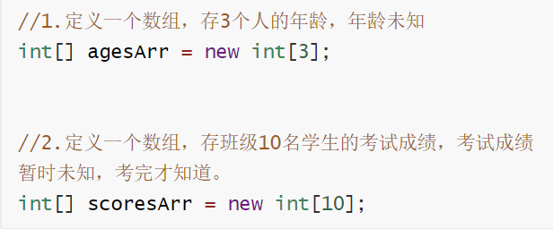

### 数组的默认初始化值：

- **整数类型：** `0`
- **小数类型：** `0.0`
- **布尔类型：** `false`
- **字符类型：** `'\u0000'`
- **引用类型：** `null`

## 方法概述

方法（method）是组织和复用一段功能的基本单位。

### 不带返回值方法定义和调用

```java
public class MethodTest {
    public static void main(String[] args) {
        getMax(10,20);
    }
    public static void getMax(int num1, int num2){
        System.out.println(Math.max(num1, num2));
    }
}
```

### 带返回值方法定义和调用

例子：

```java
public static boolean isEvenNumber(int number) {
    return number % 2 == 0;
}
```

```java
public static int getMax(int a, int b) {
    return Math.max(a, b);
}
```

```java
// 在main等方法中调用
boolean flag = isEvenNumber(5);
System.out.println(flag); // false
System.out.println(getMax(10, 20)); // 20
```

**注意**

- **返回值类型：** 方法定义时return后面的返回值与方法定义上的数据类型要匹配，否则程序将报错。

- **定义位置：** 方法不能嵌套定义。

嵌套定义的错误例子：

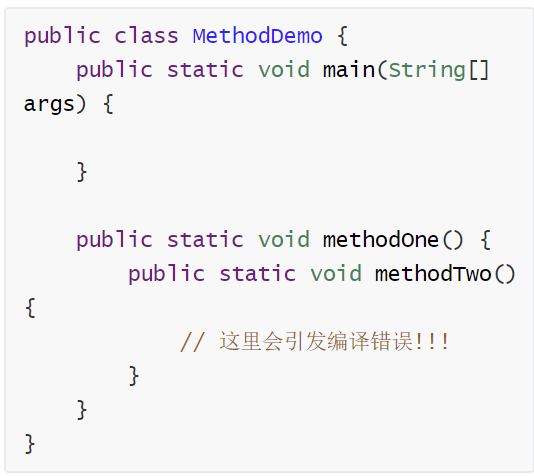

### 数组作为参数（下面的 `getMax` 要求数组非空）

```java
public class MethodTest {
    public static void main(String[] args) {
        //定义一个数组，用静态初始化完成数组元素初始化
        int[] arr = {12, 45, 98, 73, 60};
        int number = getMax(arr);
        System.out.println("number:" + number);
    }
    public static int getMax(int[] arr) {
        int max = arr[0];
        for(int x=1; x<arr.length; x++) {
            if(arr[x] > max) {
                max = arr[x];
            }
        }
        return max;
    }
}
```

## 方法重载

**方法重载概念**

- 一个类中声明或继承了多个同名方法

- 多个方法具有相同的方法名

- 多个方法的参数列表不同：参数类型、数量或类型顺序不同

- 注意：不能仅通过返回值类型区分重载；方法名相同、参数列表也相同的方法不能因此重复定义。

正确范例：

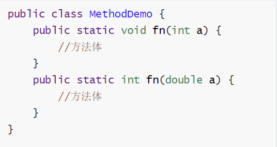

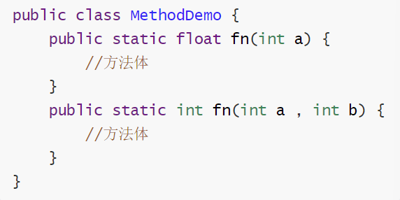

错误范例：

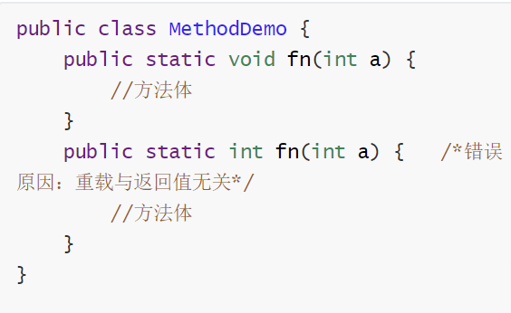

## 输出

```java
System.out.println("内容"); // 输出内容并换行
System.out.print("内容"); // 输出内容不换行
```

## 面向对象

### 定义类（可类比 C 中的数据封装，类还包含行为）

类的定义步骤：

1. **定义类**。
2. **编写成员变量**。
3. **编写成员方法**。

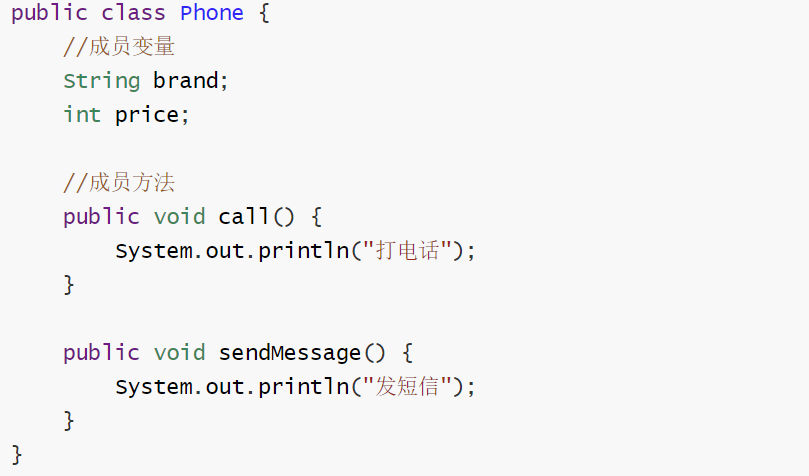

### 创建和使用对象（main函数）

**创建对象的格式**

类名 对象名 = new 类名();

**调用成员的格式**

对象名.成员变量

对象名.成员方法();

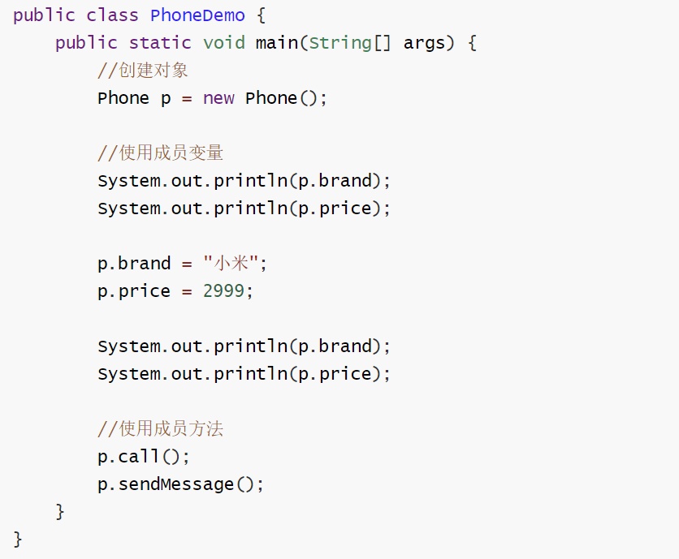

## private关键字

- private是一个修饰符，可以用来修饰成员（成员变量，成员方法）

- 被private修饰的成员，只能在本类进行访问，针对private修饰的成员变量，如果需要被其他类使用，提供相应的操作

- 提供“get变量名()”方法，用于获取成员变量的值，方法用public修饰

- 提供“set变量名(参数)”方法，用于设置成员变量的值，方法用public修饰

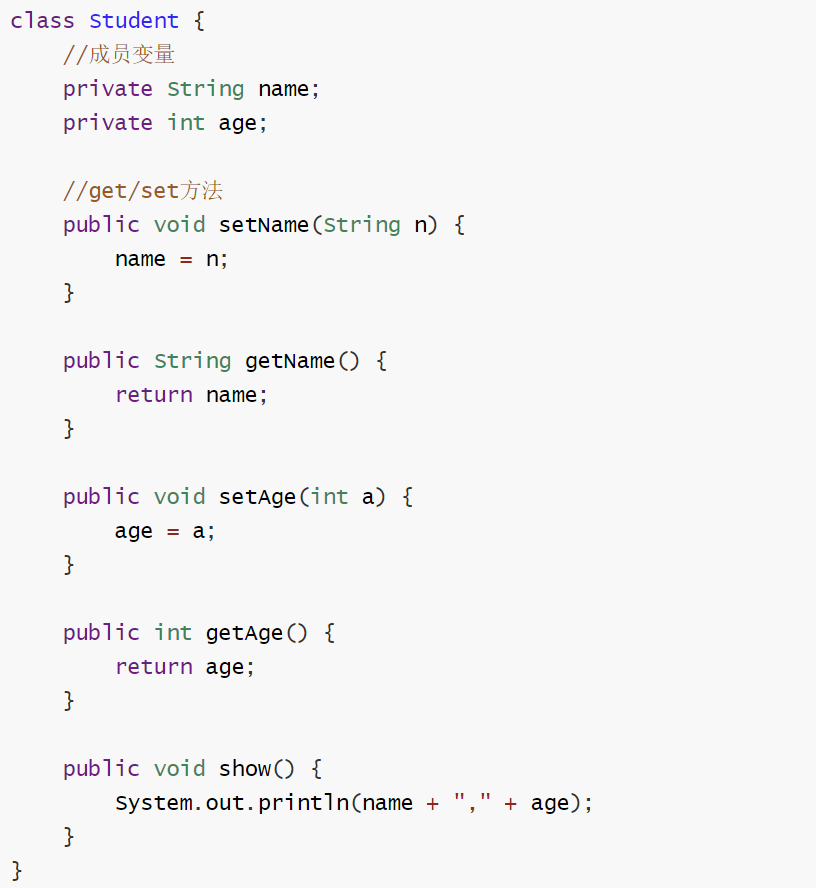

## this关键字

- this修饰的变量用于指代成员变量，其主要作用是区分局部变量和成员变量的重名问题

- 方法的形参如果与成员变量同名，不带this修饰的变量指的是形参，而不是成员变量（上面的）

- 如果没有this，又有重名，则采取就近原则

- 如果形参及局部变量均未遮蔽该成员变量，可以省略 `this` 来访问成员变量。

举例说明：

```java
public class Student {
    private String name;
    public void setName(String name) {
        this.name = name;
    }
    public String getName() {
        return name;
    }
}
```

## 构造方法

功能：主要是完成对象数据的初始化

**示例代码**

```java
class Student {
    private String name;
    private int age;
    public Student() {}
    public Student(String name,int age) {
        this.name = name;
        this.age = age;
    }
}

public class StudentDemo {
    public static void main(String[] args) {
        // 创建对象
        Student s = new Student("林青霞", 30);
    }
}
```

### 构造方法的注意事项

**构造方法的创建**

- 构造方法的名字必须和类的名字保持一致

- 如果没有定义构造方法，系统将给出一个默认的无参数构造方法

- 如果定义了构造方法，系统将不再提供默认的构造方法

## 标准类制作

下面是本课程练习中的写法约定，实际项目按需要提供构造方法、getter 和 setter。

1. **类名：** 需要见名知意。
2. **成员变量：** 使用 `private` 修饰。
3. **构造方法：** 提供至少两个构造方法：
   - 无参构造方法。
   - 带全部参数的构造方法。
4. **get 和 set 方法：** 提供每一个成员变量对应的 `setXxx()` / `getXxx()`。如果有 `name`、`age`、`sex`、`grade`、`money`，就一共要写 10 个 get、set 方法。
5. **其他行为：** 如果还有其他行为，也需要写上。

## public

一个 `.java` 文件至多包含一个 `public` 顶层类，这个类的名字应与文件名相同。

### 标准代码：

**需求**

定义标准学生类，要求分别使用空参和有参构造方法创建对象，空参创建的对象通过setXxx赋值，有参创建的对象直接赋值，并通过show方法展示数据。

**示例代码**

```java
class Student {
    //成员变量
    private String name;
    private int age;
    //构造方法
    public Student() {
    }
    public Student(String name, int age) {
        this.name = name;
        this.age = age;
    }
    //成员方法
    public void setName(String name) {
        this.name = name;
    }
    public String getName() {
        return name;
    }
    public void setAge(int age) {
        this.age = age;
    }
    public int getAge() {
        return age;
    }
    public void show() {
        System.out.println(name + ", " + age);
    }
}
```

```java
//使用标准类
public class StudentDemo {
    public static void main(String[] args) {
        Student s1 = new Student();
        s1.setName("林青霞");
        s1.setAge(30);
        Student s2 = new Student("林青霞",30);
        s1.show();
        s2.show();
    }
}
```

## %s的使用

### 示例 1

```java
String[] injureds_desc = {
    "结果%s退了半步，毫发无损",
    "结果给%s造成一处瘀伤",
    "结果一击命中，%s痛得弯下腰"
};
System.out.printf(injureds_desc[0], role.getName());
```

### 示例 2

```java
System.out.printf("%s你好啊%s","张三","李四");
//用张三填充第一个%s，李四填充第二个%s
```

## String类的特点

- 字符串不可变，它们的值在创建后不能被更改

- 虽然 String 的值是不可变的，但是它们可以被共享

- 字符串 API 以 UTF-16 代码单元处理字符，可以通过 `char` 访问。内部存储是实现细节：JDK 9 引入紧凑字符串后，常见实现使用 `byte[]` 加编码标记，不能把所有 Java 版本的字符串都简单理解为同一种数组。参见 [JDK 9 新增功能](https://docs.oracle.com/javase/9/whatsnew/)。

## String类的构造方法

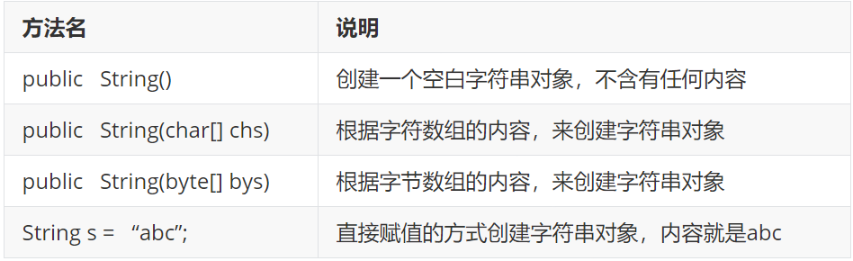

### 示例代码

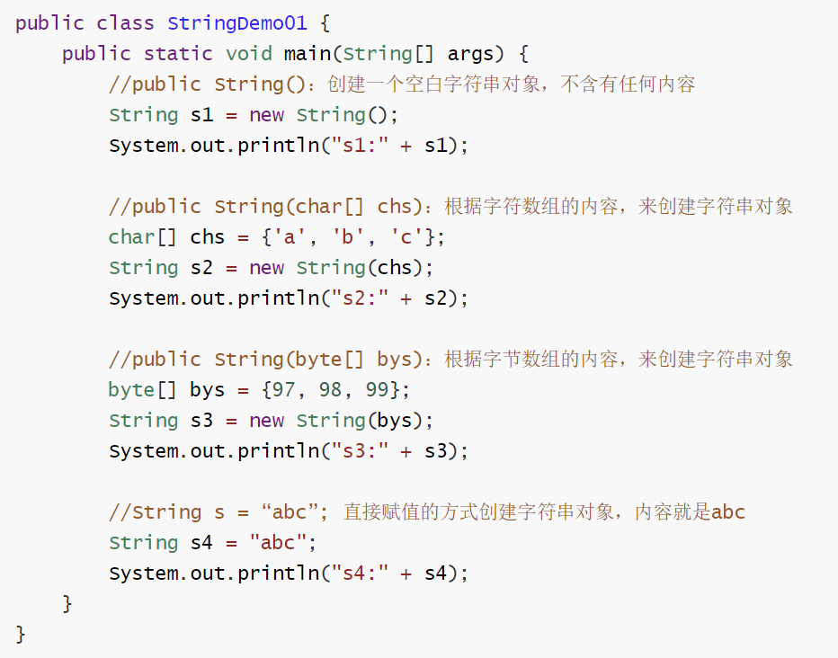

## 创建字符串对象两种方式的区别

- **通过构造方法创建：** 通过 `new` 创建的字符串对象，每一次 `new` 都会申请一个内存空间，虽然内容相同，但是地址值不同。
- **直接赋值方式创建：** 以 `""` 方式给出的字符串，只要字符序列相同（顺序和大小写），无论在程序代码中出现几次，JVM 都只会建立一个 `String` 对象，并在字符串池中维护。

## 字符串的比较

### ==号的作用

- **比较基本数据类型：** 比较的是具体的值

- **比较引用数据类型：** 比较是否指向同一个对象（或者是否都为 `null`）

引用数据类型包括类、接口和数组等。引用变量保存对象引用或 `null`；引用不是供程序直接运算的内存地址。

结论：`==` 可以比较基本类型，也可以比较兼容的引用类型。比较字符串内容应使用 `equals()`，不能用 `==` 代替。

### equals方法的作用

**方法介绍**

方法签名：`public boolean equals(Object obj)`。

比较两个字符串内容是否相同、区分大小写

**示例代码**

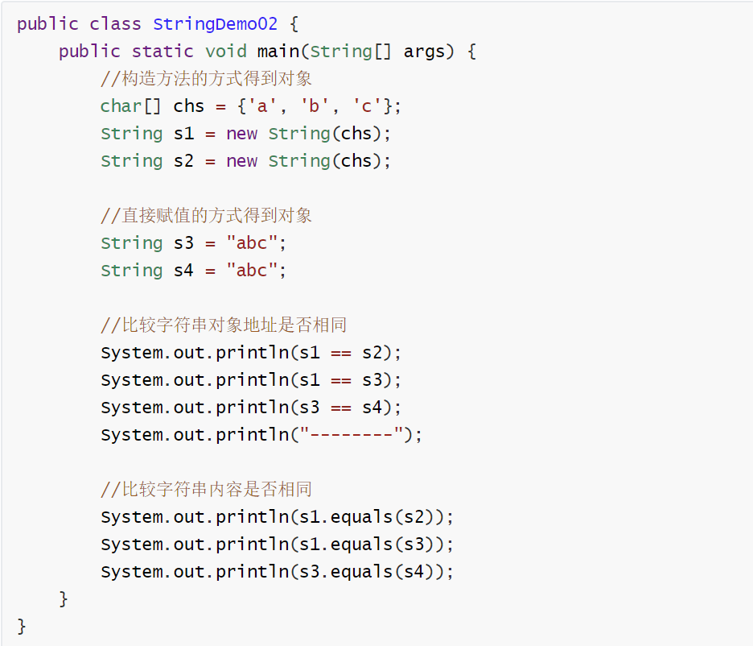

## StringBuilder

StringBuilder 可以看成是一个容器，创建之后里面的内容是可变的。

当我们在拼接字符串和反转字符串的时候会使用到

### 基本使用

```java
// 1. 创建对象
StringBuilder sb = new StringBuilder("abc");
// 2. 添加元素
sb.append(1);
sb.append(2.3);
sb.append(true);
// 3. 反转
sb.reverse();
// 4. 获取长度
int len = sb.length();
System.out.println(len);
// 打印时调用toString()，显示构建器中的字符内容
System.out.println(sb);
```

### 链式编程

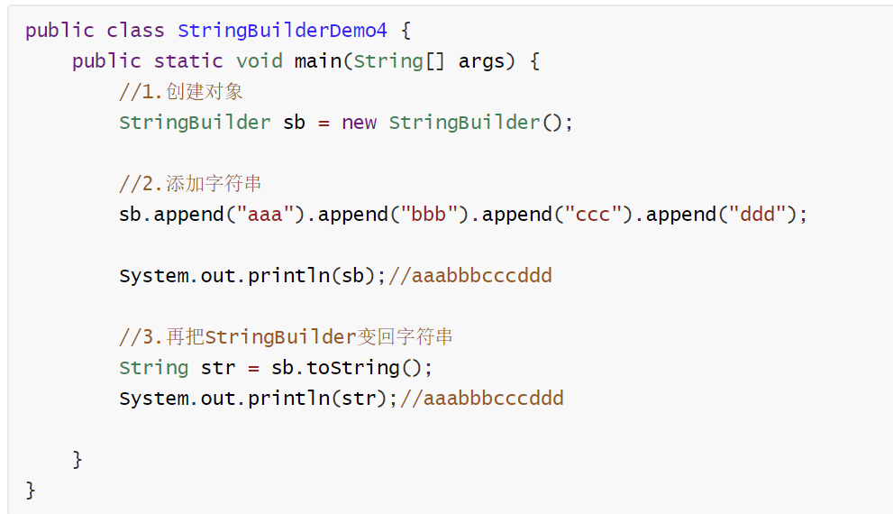

## StringJoiner

StringJoiner跟StringBuilder一样，也可以看成是一个容器，创建之后里面的内容是可变的。

作用：按指定分隔符连接字符串，还可以设置前缀和后缀，代码比较简洁。

基本使用：

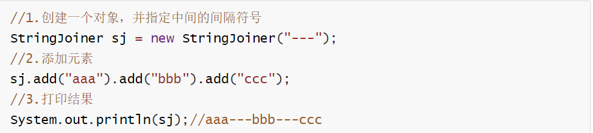

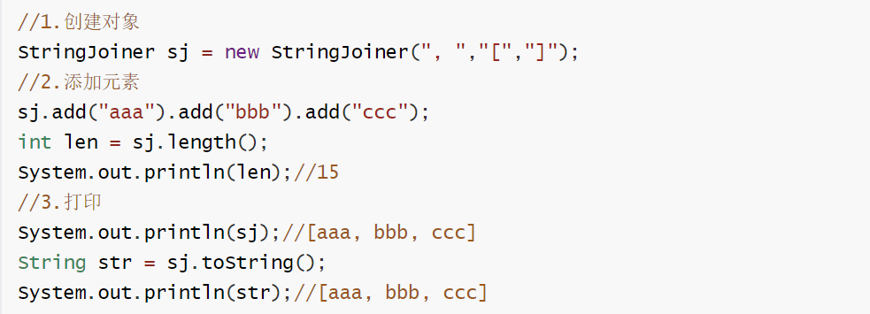

## ArrayList（集合）类概述

### 集合定义

提供一种存储空间可变的存储模型，存储的数据容量可以发生改变

### 集合特点

长度可以变化，只能存储引用数据类型和包装类

### 泛型

限定集合中存储数据的类型

### ArrayList类常用方法

#### 构造方法

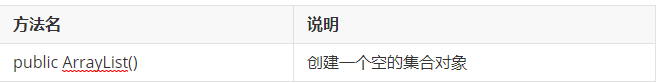

#### 成员方法

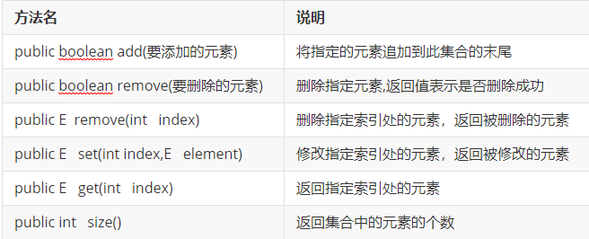

#### 示例代码

```java
import java.util.ArrayList;

public class ArrayListDemo02 {
    public static void main(String[] args) {
        //创建集合
        ArrayList<String> array = new ArrayList<String>();
        //添加元素
        array.add("hello");
        array.add("world");
        array.add("java");
        //public boolean remove(Object o)：删除指定的元素，返回删除是否成功
        // System.out.println(array.remove("world"));
        // System.out.println(array.remove("javaee"));
        //public E remove(int index)：删除指定索引处的元素，返回被删除的元素
        // System.out.println(array.remove(1));
        //IndexOutOfBoundsException
        // System.out.println(array.remove(3));
        //public E set(int index,E element)：修改指定索引处的元素，返回被修改的元素
        // System.out.println(array.set(1,"javaee"));
        //IndexOutOfBoundsException
        // System.out.println(array.set(3,"javaee"));
        //public E get(int index)：返回指定索引处的元素
        // System.out.println(array.get(0));
        // System.out.println(array.get(1));
        // System.out.println(array.get(2));
        //System.out.println(array.get(3)); //？？？？？？ 自己测试
        //public int size()：返回集合中的元素的个数
        System.out.println(array.size());
        //输出集合
        System.out.println("array:" + array);
    }
}
```

## static关键字

- **意义：** 成员属于类，可通过类名使用，无需先创建对象。

- **使用范围：** java static关键字可以用在变量、方法、代码块和嵌套类上。

- **作用范围：** static关键字属于类，而不是类的实例。

静态(static)修饰如下：

1. 变量：称为类变量、静态变量

2. 方法：称为类方法、静态方法

3. 代码块：称为静态代码块

4. 嵌套类：称为静态内部类

### 举例

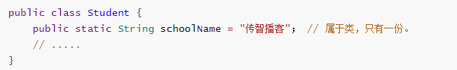

### 静态成员变量的访问

格式：类名.静态变量

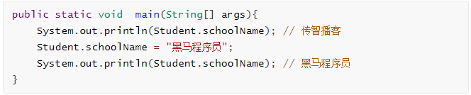

## 实例变量

无static修饰的成员变量属于每个对象的， 这个成员变量叫实例变量

## 静态方法及其访问

有 `static` 修饰的成员方法属于类，称为类方法或者静态方法，可以直接用类名调用。静态方法没有 `this`，不能直接访问某个对象的实例成员；若要访问，需要先取得对象引用。

与静态成员变量一样，静态方法也是直接通过类名.方法名称即可访问。

### 举例

```java
public class Student{
    public static String schoolName = "传智播客"; // 属于类，只有一份。
    // .....
    public static void study(){
        System.out.println("我们都在黑马程序员学习");
    }
}
```

## 实例方法及其访问

无static修饰的成员方法属于每个对象的，这个成员方法也叫做实例方法。

需要注意的是：实例方法是属于每个对象，必须创建类的对象才可以访问。

格式：对象.实例方法示例

示例：

```java
public class Student {
    private String name;
    public void setName(String name) { this.name = name; }
    public void run() { System.out.println("学生可以跑步"); }
    public void sleep() { System.out.println("学生睡觉"); }
    public static void study() {}
}
```

```java
public static void main(String[] args) {
    Student stu = new Student();
    stu.setName("徐干");
    // Student.sleep(); // 错误：实例方法需要对象
    stu.sleep();
    stu.run();
}
```

```java
BanZhuRen linTao = new BanZhuRen();
linTao.setName("灵涛");
linTao.setAge(28);
linTao.setSalary(1000.99);
System.out.println(linTao.getName());
System.out.println(linTao.getAge());
System.out.println(linTao.getSalary());
linTao.admin();
```

## 小结

1. `static` 修饰的字段和方法分别称为静态变量、静态方法。对于同一个已加载的类，静态变量由各实例共享；读写仍受访问权限及 `final` 等规则限制。推荐通过类名访问。
2. 无 `static` 修饰的字段和方法分别称为实例变量、实例方法，通常通过对象引用访问。
3. 静态成员与类关联，其初始化遵循类初始化规则；不宜把它们概括为一定存储在某块固定的“静态区”。
4. 每个对象有自己的实例字段；实例方法操作调用它的对象，并不是每创建一个对象就复制一份方法代码。

## 继承

### 继承本质

继承实际上是子类相同的属性和行为可以定义在父类中，子类特有的属性和行为由自己定义，这样就实现了相同属性和行为的重复利用，从而提高了代码复用。

### 继承格式

通过 extends 关键字，可以声明一个子类继承另外一个父类，定义格式如下：

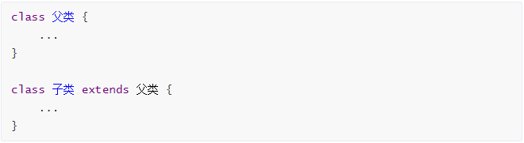

需要注意：Java 的类是单继承的，一个类只能有一个直接父类，但可以实现多个接口。

### 继承案例

请使用继承定义以下类:

1. 学生类 属性:姓名,年龄 行为:吃饭,睡觉

2. 老师类 属性:姓名,年龄，薪水 行为:吃饭,睡觉，教书

3. 班主任 属性:姓名,年龄，薪水 行为:吃饭,睡觉，管理

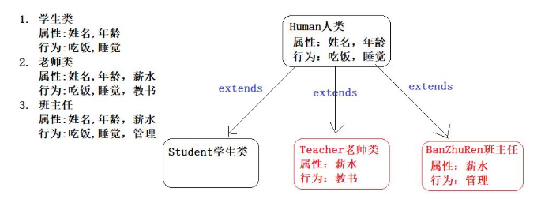

### 案例代码实现

#### 父类Human类

```java
public class Human {
    // 合理隐藏
    private String name;
    private int age;

    // 合理暴露
    public String getName() { return name; }
    public void setName(String name) { this.name = name; }
    public int getAge() { return age; }
    public void setAge(int age) { this.age = age; }
    public void eat() { System.out.println("吃饭"); }
    public void sleep() { System.out.println("睡觉"); }
}
```

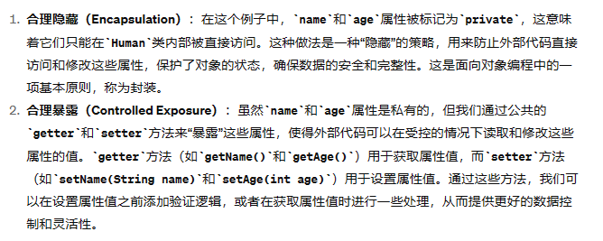

#### 子类Teacher类

```java
public class Teacher extends Human {
    private double salary;
    public void teach() {
        System.out.println("老师在认真教技术！");
    }
    public double getSalary() { return salary; }
    public void setSalary(double salary) { this.salary = salary; }
}
```

#### 子类Student类

```java
public class Student extends Human {
}
```

#### 子类 BanZhuRen 类

```java
public class BanZhuRen extends Human {
    private double salary;
    public void admin() {
        System.out.println("班主任强调纪律问题！");
    }
    public double getSalary() { return salary; }
    public void setSalary(double salary) { this.salary = salary; }
}
```

## 子类不能继承的内容

| 内容 | 是否继承 |
| --- | --- |
| 构造方法 | 不继承，可以通过 `super(...)` 调用 |
| `private` 成员变量、成员方法 | 不继承 |
| 可访问的非私有成员 | 按访问权限、隐藏和重写规则继承 |

子类对象中仍包含父类定义的实例状态。父类中的方法可以操作父类自己的 `private` 字段，子类可通过可访问的 getter/setter 间接操作这些状态。父类私有字段不等于子类继承来的成员。参见 [Java 语言规范：类的成员](https://docs.oracle.com/javase/specs/jls/se17/html/jls-8.html#jls-8.2)。

## 继承后的特点—成员变量

### case1：成员变量不重名

如果子类父类中出现不重名的成员变量，这时的访问是没有影响的。

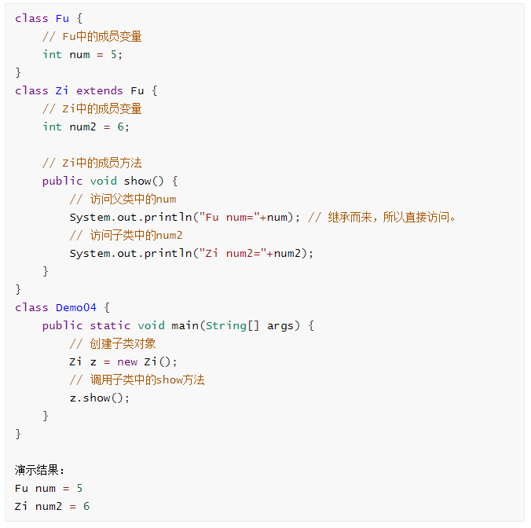

### case2：成员变量重名

子父类中出现了同名的成员变量时，子类会优先访问自己对象中的成员变量。如果此时想访问父类成员，可以使用super关键字。

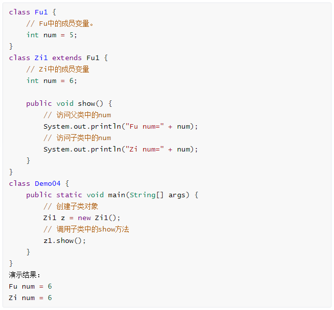

## 使用super访问父类成员变量

使用格式：super.父类成员变量名

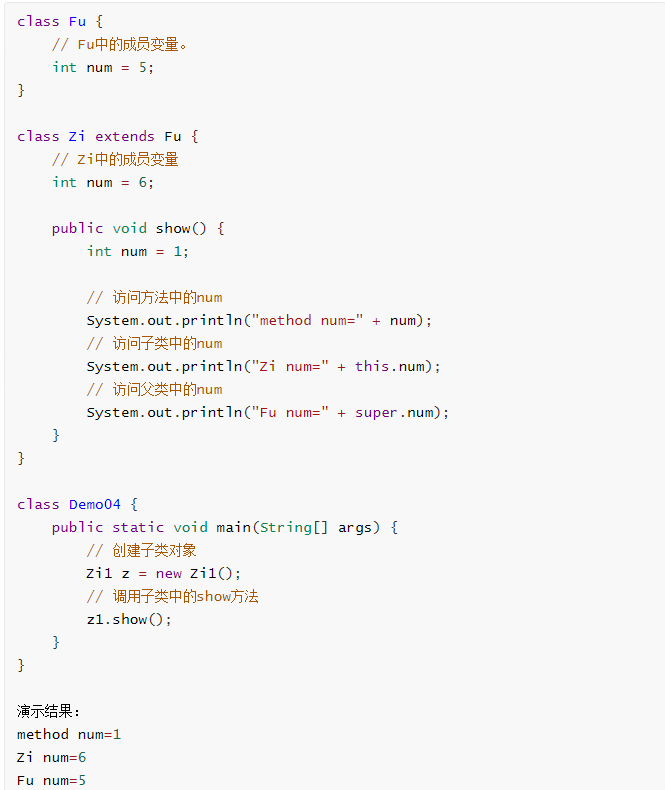

## 继承后的特点—成员方法

### case1：成员方法不重名

如果子类父类中出现不重名的成员方法，这时的调用是没有影响的。对象调用方法时，会先在子类中查找有没有对应的方法，若子类中存在就会执行子类中的方法，若子类中不存在就会执行父类中相应的方法。

### case2：成员方法重名

如果子类提供了对父类实例方法的重写，通过子类对象调用时会执行子类的实现。仅方法名相同还不够：参数列表不同可能构成重载。

## 方法重写

- **签名：** 子类以兼容的签名重新实现父类可重写的实例方法，会产生覆盖效果。
- **返回类型：** 可以相同，也可以是允许的协变引用类型。
- **访问权限：** 不能缩小。
- **特殊情况：** `private` 方法不被重写，`static` 方法发生的是隐藏。

## @Override重写注解

`@Override` 用于编译期校验：方法必须重写父类方法或实现接口方法等，否则编译报错。

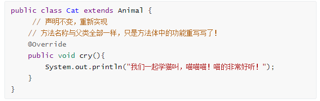

## 继承后的特点—构造方法（先父后子）

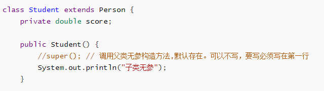

- **调用位置：** 在这里采用的传统构造方法写法中，`super(...)` 或 `this(...)` 放在构造方法的开头。
- **默认调用：** 若没有显式构造调用，编译器通常会插入 `super()`，所以父类必须有可访问的无参构造方法；否则要显式调用合适的父类构造方法。
- **执行顺序：** 父类构造完成后再执行子类构造方法的后续语句。

## 通过 super(name, age) 初始化父类定义的属性

假设父类是 `Person`，拥有 `name` 和 `age` 两个属性；子类是 `Student`，还有 `score` 属性，可以使用以下构造方法：

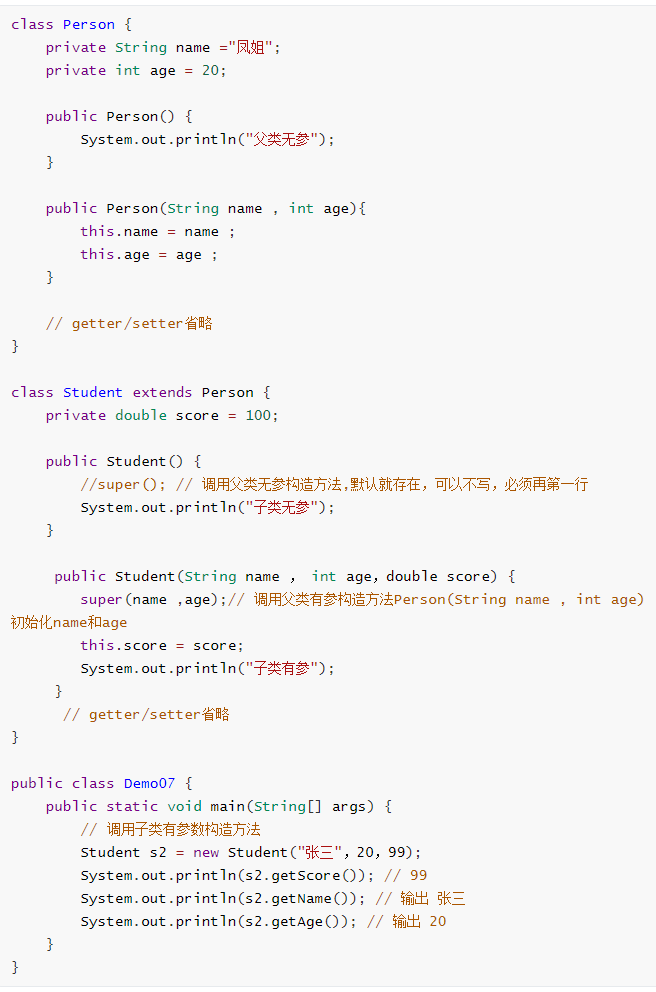

## 通过 this("徐干", 21, '男') 设置三个属性的默认值

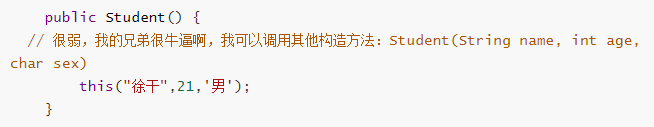

## 继承的特点

- **Java 的类只支持单继承；接口可以多继承，一个类也可以实现多个接口。**

  ```java
  // 一个类只能有一个父类，不可以有多个父类。
  class A {}
  ```

  ```java
  class B {}
  ```

  ```java
  class C1 extends A {} // ok
  ```

  ```java
  // class C2 extends A, B {} // error
  ```

- **一个类可以有多个子类。**

  ```java
  // A可以有多个子类
  class A {}
  ```

  ```java
  class C1 extends A {}
  ```

  ```java
  class C2 extends A {}
  ```

- **可以多层继承。**

  ```java
  class A {}
  ```

  ```java
  class C1 extends A {}
  ```

  ```java
  class D extends C1 {}
  ```

## 多态——对象的多种形态

格式：父类类型 变量名 = new 子类/实现类构造器;


### 多态的前提

- **关系：** 有继承/实现关系

- **引用：** 有父类引用指向子类对象

- **动态分派：** 子类重写实例方法时，可以体现调用同一方法而执行不同实现的效果；父类引用指向子类对象本身并不要求一定发生重写。

### 代码示例：

父类：

```java
public class Person {
    private String name;
    private int age;
    public Person() {}
    public Person(String name, int age) {
        this.name = name;
        this.age = age;
    }
    public String getName() { return name; }
    public void setName(String name) { this.name = name; }
    public int getAge() { return age; }
    public void setAge(int age) { this.age = age; }
    public void show(){
        System.out.println(name + ", " + age);
    }
}
```

子类1：

```java
public class Administrator extends Person {
    @Override
    public void show() {
        System.out.println("管理员的信息为：" + getName() + ", " + getAge());
    }
}
```

子类2：

```java
public class Student extends Person{
    @Override
    public void show() {
        System.out.println("学生的信息为：" + getName() + ", " + getAge());
    }
}
```

子类3：

```java
public class Teacher extends Person{
    @Override
    public void show() {
        System.out.println("老师的信息为：" + getName() + ", " + getAge());
    }
}
```

测试类：

```java
public class Test {
    public static void main(String[] args) {
        //创建三个对象，并调用register方法
        Student s = new Student();
        s.setName("张三");
        s.setAge(18);
        Teacher t = new Teacher();
        t.setName("王建国");
        t.setAge(30);
        Administrator admin = new Administrator();
        admin.setName("管理员");
        admin.setAge(35);
        register(s);
        register(t);
        register(admin);
    }
    //这个方法既能接收老师，又能接收学生，还能接收管理员
    //这里把参数写成三个类型共同的父类Person
    public static void register(Person p){
        p.show();
    }
}
```

### 多态的运行特点

- 访问字段时：按照引用的编译期类型选择字段（“看左边”）。

- 调用可重写的实例方法时：编译期检查引用类型是否提供相应方法，运行期按实际对象类型选择重写实现（“编译看左边，运行看右边”）。静态方法隐藏不遵循实例方法的动态分派。

**代码示例**

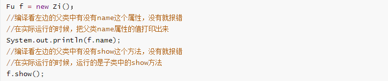

### 多态的弊端

如果子类有些独有的功能，此时多态的写法就无法访问子类独有功能了，但是还是可以访问子类重写后的方法

## 引用类型转换

为什么要转型？

因为使用多态的写法就无法访问子类独有功能了。想要调用子类特有的方法，必须做向下转型。

### 向上转型（自动转换）

多态本身是子类类型向父类类型向上转换（自动转换）的过程，这个过程是默认的。

当父类引用指向一个子类对象时，便是向上转型。

### 向下转型（强制转换）

父类类型向子类类型向下转换的过程，这个过程是强制的。

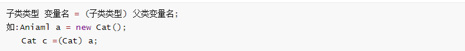

### 向下转型案例演示

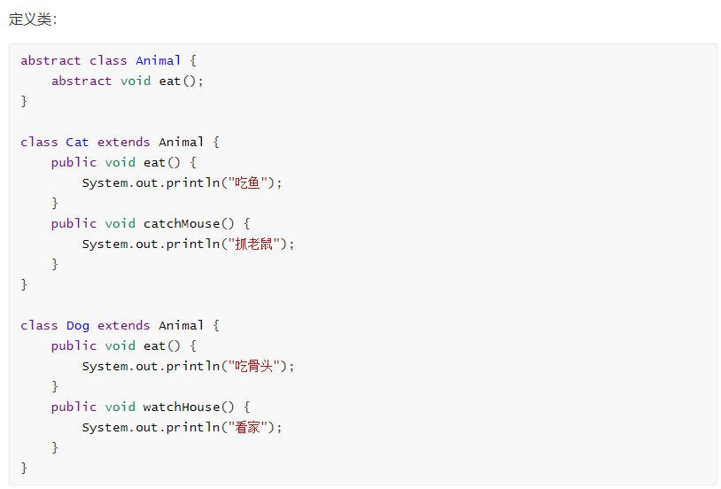

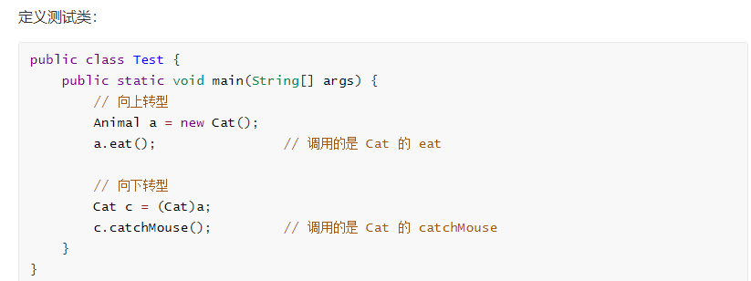

### 转型的异常

创建了Cat类型对象，运行时，当然不能转换成Dog对象的，运行报错：ClassCastException

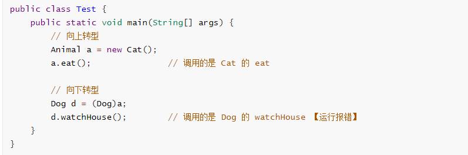

## instanceof 关键字——避免 ClassCastException

变量名 instanceof 数据类型

- 如果变量属于该数据类型或者其子类类型，返回true。

- 如果引用的对象与目标类型不兼容，返回 `false`。`null instanceof T` 也为 `false`；目标类型也可以是接口。

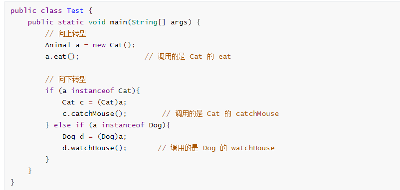

### instanceof新特性

`instanceof` 模式匹配把类型检查和转换结果的绑定写在一起：JDK 14 开始预览，JDK 16 正式引入。参见 [JEP 394](https://openjdk.org/jeps/394)。

```java
// a 是前面定义的Animal引用
if (a instanceof Dog d) {
    d.watchHouse();
} else if (a instanceof Cat c) {
    c.catchMouse();
} else {
    System.out.println("没有这个类型，无法转换");
}
```

## 不同权限的访问能力

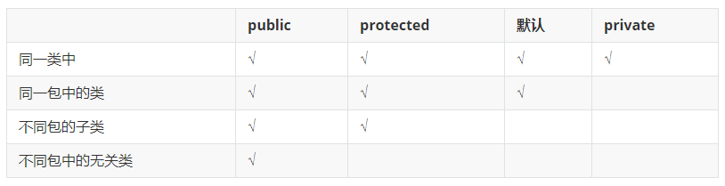

跨包访问 `protected` 实例成员时，还受访问位置及接收对象类型限制，不能据此通过任意父类对象引用访问。`private` 访问还允许同一顶层类内部的嵌套类之间按语言规则互访。

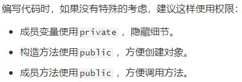

## final关键字

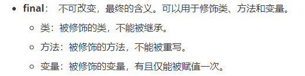

- **命名约定：** 常量通常采用全大写字母加下划线；普通 `final` 局部变量、参数不必全大写。
- **引用限制：** `final` 引用不能重新指向另一个对象，但所指对象仍可能可变。

## 修饰变量-成员变量

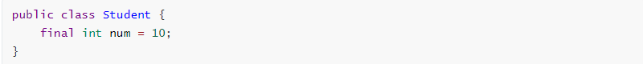

显式初始化（在定义成员变量的时候赋值，常用）：

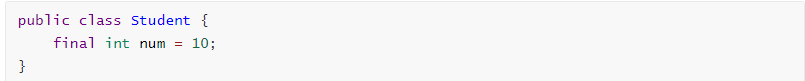

## 抽象

- **抽象方法 ：**  没有方法体的方法。

- **抽象类：** 用 `abstract` 声明的类，可以包含抽象方法，也可以不包含。包含抽象方法的类必须声明为抽象类。

### 抽象方法书写方法

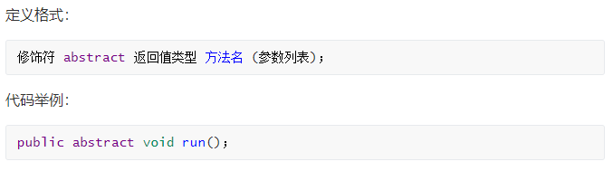

### 抽象类书写方法

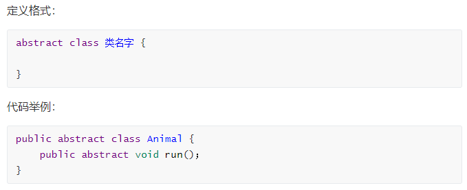

### 抽象类的使用

要求：继承抽象类的子类必须重写父类所有的抽象方法。否则，该子类也必须声明为抽象类。

此时的方法重写，是子类对父类抽象方法的完成实现，我们将这种方法重写的操作，也叫做实现方法。

代码举例：

```java
// 父类：抽象类
abstract class Employee {
    private String id;
    private String name;
    private double salary;

    public Employee() {}

    public Employee(String id, String name, double salary) {
        this.id = id;
        this.name = name;
        this.salary = salary;
    }

    // 类中的抽象方法必须放在抽象类中
    public abstract void work();
}
```

```java
// 定义一个子类继承抽象类
class Manager extends Employee {
    public Manager() {
    }
    public Manager(String id, String name, double salary) {
        super(id, name, salary);
    }
    // 2.重写父类的抽象方法
    @Override
    public void work() {
        System.out.println("管理其他人");
    }
}
```

```java
// 定义一个子类继承抽象类
class Cook extends Employee {
    public Cook() {
    }
    public Cook(String id, String name, double salary) {
        super(id, name, salary);
    }
    @Override
    public void work() {
        System.out.println("厨师炒菜多加点盐...");
    }
}
```

```java
// 测试类
public class Demo10 {
    public static void main(String[] args) {
        // 创建抽象类,抽象类不能创建对象
        // 假设抽象类让我们创建对象,里面的抽象方法没有方法体,无法执行.所以不让我们创建对象
        // Employee e = new Employee();
        // e.work();
        // 3.创建子类
        Manager m = new Manager();
        m.work();
        Cook c = new Cook("ap002", "库克", 1);
        c.work();
    }
}
```

### 抽象类的细节

- 抽象类不能创建对象，如果创建，编译无法通过而报错。只能创建其非抽象子类的对象。

- 抽象类中，可以有构造方法，是供子类创建对象时，初始化父类成员使用的。

- 抽象类中，不一定包含抽象方法，但是有抽象方法的类必定是抽象类。

- 抽象类的子类，必须重写抽象父类中所有的抽象方法，否则子类也必须定义成抽象类，编译无法通过而报错。

- 抽象类存在的意义是为了被子类继承。

## 接口

接口体现一种规范。非抽象的实现类必须提供接口所要求的全部抽象方法的实现（也可以继承已有的有效实现）；否则该类必须声明为抽象类。接口的 `default` 和 `static` 方法不要求实现类逐一重写。

### 类与接口基本实现案例 1

假如我们定义一个运动员的接口（规范），代码如下：

```java
public interface SportMan {
    void run(); // 跑步
    void law(); // 遵守法律
    String competition(String project); // 比赛
}
```

接下来定义一个乒乓球运动员类，实现接口，实现接口的实现类代码如下：

```java
public class PingPongMan implements SportMan {
    @Override
    public void run() {
        System.out.println("乒乓球运动员稍微跑一下！！");
    }
    @Override
    public void law() {
        System.out.println("乒乓球运动员守法！！");
    }
    @Override
    public String competition(String project) {
        return "参加" + project + "得金牌！";
    }
}
```

### 类与接口基本实现案例 2

一个类可以同时实现多个接口

首先我们先定义两个接口，代码如下：

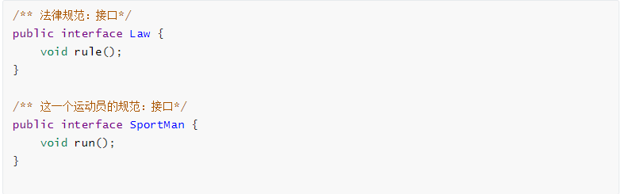

然后定义一个实现类：

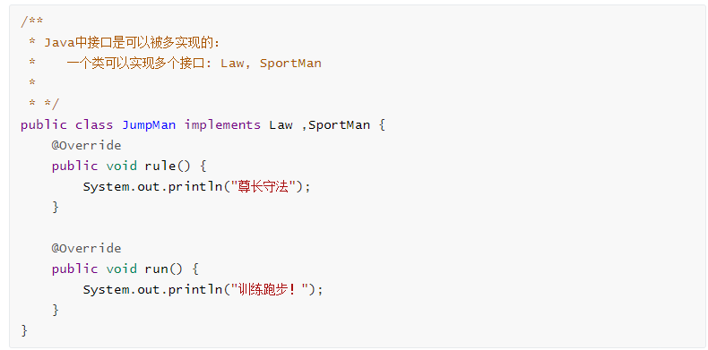

### 接口与接口的多继承

接口与接口之间是可以多继承的：也就是一个接口可以同时继承多个接口,接口继承接口就是把其他接口的抽象方法与本接口进行了合并。

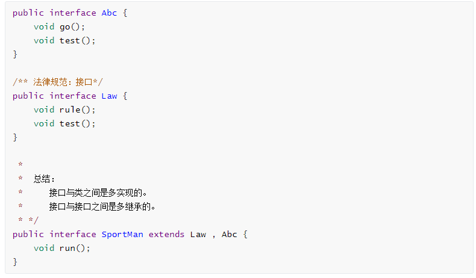

### 接口的细节

1. 当两个接口中存在相同抽象方法的时候，该怎么办？

   若两个方法的签名相同、返回类型等要求兼容，实现一次即可同时满足两个接口；方法必须满足接口要求的 `public` 访问权限。若返回类型冲突，则不能简单用一个实现解决。

2. 实现类能不能继承A类的时候，同时实现其他接口呢？

   继承的父类，就好比是亲爸爸一样 实现的接口，就好比是干爹一样 可以继承一个类的同时，再实现多个接口，只不过，要把接口里面所有的抽象方法，全部实现。

3. 实现类能不能继承一个抽象类的时候，同时实现其他接口呢？

   实现类可以继承一个抽象类的同时，再实现其他多个接口，只不过要把里面所有的抽象方法全部重写。

4. 实现类 Zi 实现一个接口，同时继承 Fu 类。如果接口和父类都有相同签名的方法，子类如何处理？

   如果继承的父类方法是 `public`，且签名、返回类型等满足接口要求，并能满足业务需求，子类可以直接继承该实现；否则需要在子类中提供符合接口要求的重写实现。

5. 如果接口有 10 个抽象方法，而实现类只关心其中一个，该怎么办？

   可以在接口和实现类之间新建一个中间类（适配器类），让它实现接口，并为各方法提供默认实现。`void` 方法可以使用空方法体；有返回值的方法必须返回符合约定的值。子类继承适配器类，只重写自己关心的方法。通常把适配器类声明为抽象类，避免直接创建无实际用途的适配器对象。
