# Machine Learning · 笔记

北京邮电大学国际学院 · Machine Learning

## 1. 介绍

### 1.1 机器学习、数据与数据集

- **机器学习定义：** The ability to acquire knowledge by extracting patterns from raw data. A set of tools for modeling and understanding complex datasets.

- **Data 定义：** Data is the materialisation of an observation or a measurement.

    - **materialisation：** 物化。
    - **observation：** 观察。
    - **measurement：** 测量。

- **Dataset 定义：** Datasets are data formatted as a collection of items described by a set of pre-defined attributes. In ML, our data is always represented as a dataset.

### 1.2 模型与机器学习的阶段

数学模型和计算机模型是等价的。Models describe relationships between attributes. Mathematical and computer models are equivalent:

- Mathematical models can be implemented as computer programs.
- Every computer model has a corresponding mathematical expression.

The mathematical expression $`y=x+3x^2`$ is equivalent to the following Matlab line of code:

```matlab
y = x + 3*x^2
```

or this Python line of code:

```python
y = x + 3*x**2
```

这门课中，我们用 deployment-first（problem-first）的方法。

机器学习的 two stages：

1. **Learning stage:** The model is built.
2. **Deployment stage:** The model is used.

流程：Prior knowledge + Data → Learning → Model → Deployment → Prediction / Action / Insight。

**Prior knowledge（先验知识）** 是指在开始进行学习或分析之前，我们已经掌握的相关信息或经验。它是我们对某个问题或领域的已有了解，可以帮助我们更好地建立模型或进行预测。

例如，在预测房价时，先验知识可能包括我们已经知道的房价与地理位置、房屋大小等因素之间的关系。这些知识可以指导我们选择合适的模型或方法，而不是从零开始。

Basic machine learning methodologies include two separate tasks:

- **Training:** A model is created using data and a quality metric（质量度量）. We also say that we fit a model to a dataset.
- **Testing:** The performance of the model during deployment is assessed using new, unseen data.

### 1.3 Supervised learning（有监督学习）

In supervised learning, we are given a new item such that the value of one of its attributes is unknown to us. Our goal is to estimate（guess）the missing value by learning from a collection of known items.

有监督学习依据 type of label 可以分为以下两类：

- **Classification（分类）:** The label is a discrete variable.
- **Regression（回归）:** The label is a continuous variable.

有监督学习与无监督学习的区别是有无 label：有监督学习有 label，无监督学习无 label。

### 1.4 Unsupervised learning（无监督学习）

In unsupervised learning, we set out to **find the underlying structure**（底层结构）of our dataset. This can be useful to gain understanding, identify anomalies（异常）, compress（压缩）our data and reduce processing time.

Applications of unsupervised learning include:

- Customer segmentation.
- Social community detection.
- Recommendation systems.
- Evolutionary analysis.

无监督学习可以分为以下两类：Structure Analysis 和 Density Estimation。

机器学习分类总结：

| Machine Learning | 类型 |
|---|---|
| Supervised | Classification；Regression |
| Unsupervised | Density Estimation；Structure Analysis |

**Structure Analysis:** The underlying structure of a dataset can be studied using structure analysis, which includes:

- **Cluster analysis:** Focuses on groups of data points.
- **Component analysis:** Identifies directions of interest.

**Density Estimation:** Density estimation techniques provide statistical models that describe the distribution of samples in the attribute space.

## 2. 回归（Regression）

In ML, data is organised as a dataset（a collection of items described by a set of attributes）, and knowledge is represented as a model.

### 2.1 Regression 定义与例子

- Regression is a **supervised** problem: Our goal is to predict the value of one attribute（**label**）using the remaining attributes（**predictors**）.
- The label is a **continuous** variable.
- Our job is then to **find the best model** that assigns a unique label to a given set of predictors.
- We use **datasets** consisting of **labelled samples**.

Regression 例子：

1. Predict distance driven by a car given its speed and time（journey duration）.
2. Predict future values of a company stock, given past stock prices.

- **Predictors：** $`X`$。
- **Labels：** $`y`$。

在机器学习中，我们需要构建关联模型，而不一定是因果模型。

Our ability to build predictors is due to **association** between attributes, rather than **causation**. Two attributes in a dataset appear associated:

- If one causes the other（directly or indirectly）.
- When both have a common cause.
- Due to the way we collect samples（sampling）.

### 2.2 数学符号

预测流程：$`x_i\longrightarrow f(\cdot)\longrightarrow\hat y_i`$。

**Population（总体）：**

- $`x`$ is the predictor attribute. $`x`$ 是预测变量，也就是用来预测的输入，比如房子的位置、过去的股票价格等。
- $`y`$ is the label attribute. $`y`$ 是标签，也就是我们要预测的结果，比如房子的能耗或未来的股票价格。

**Dataset（数据集）：**

- $`N`$ is the number of samples；$`i`$ identifies each sample. $`N`$ 是样本数量，表示我们有多少个数据点；$`i`$ 是样本的编号，用来标记每一个样本。
- $`x_i`$ is the predictor of sample $`i`$. $`x_i`$ 是第 $`i`$ 个样本的预测变量，比如第 $`i`$ 个房子的地理位置。
- $`y_i`$ is the actual label of sample $`i`$. $`y_i`$ 是第 $`i`$ 个样本的实际标签，比如第 $`i`$ 个房子的真实能耗。
- $`(x_i,y_i)`$ is sample $`i`$；$`\{(x_i,y_i):1\leq i\leq N\}`$ is the entire dataset. 每个样本可以表示为 $`(x_i,y_i)`$，这代表了一个完整的数据点，包含输入 $`x_i`$ 和实际输出 $`y_i`$。

**Model（模型）：**

- $`f(\cdot)`$ denotes the model. 模型通过输入 $`x_i`$ 预测输出 $`\hat y_i`$。
- $`\hat y_i=f(x_i)`$ is the predicted label for sample $`i`$. $`\hat y_i`$ 是模型预测的结果，也就是预测的标签，比如模型预测的第 $`i`$ 个房子的能耗。
- $`y_i-\hat y_i`$ is the prediction error for sample $`i`$. 预测误差表示实际结果 $`y_i`$ 和预测结果 $`\hat y_i`$ 之间的差异。

### 2.3 误差与优化

**简答题：** 在现实世界的数据集中，通常难以找到一个既能泛化、又让每个样本的预测值 $`\hat y_i`$ 都完全等于真实值 $`y_i`$ 的模型，也就是说，模型的误差通常不为零（MSE $`\ne 0`$）。

The reason for this is related to the inherent（固有）noise and complexity present in the real-world datasets（数据集）.

**Squared error:**

```math
e_i^2=(y_i-\hat y_i)^2.
```

**Sum of squared errors（SSE）：**

```math
E_{\mathrm{SSE}}=e_1^2+e_2^2+\cdots+e_N^2=\sum_{i=1}^N e_i^2.
```

**Mean squared error（重点）：**

```math
E_{\mathrm{MSE}}=\frac1N\sum_{i=1}^N e_i^2.
```

误差的因素（详细）：

- The chosen **predictors might not include all the factors** that determine the label.
- The chosen **model might not be able to represent** the true relationship between response and predictor（the pattern）.
- **Random mechanisms**（noise）might be present.

我们的目标：find the model with the lowest $`E_{\mathrm{MSE}}`$.

```math
f_{\mathrm{best}}=\underset{f}{\arg\min}\;\frac1N\sum_{i=1}^N\bigl(y_i-f(x_i)\bigr)^2.
```

这是一个 optimisation problem（优化问题）。

### 2.4 Regression learner 流程

Priors + Data → Learner → Model；Model + New data → Deployment → Prediction / Action。

- **Priors:** Type of model.
- **Data:** Labelled samples（predictors and true label）.
- **Model:** Predicts a label based on the predictors.

### 2.5 Simple linear regression（简单线性回归）

```math
\hat y_i=f(x_i)=w_0+w_1x_i.
```

- $`w_0`$：intercept，截距。
- $`w_1`$：gradient，斜率。
- tuned：调整。

### 2.6 Simple polynomial regression（简单多项式回归）

Polynomial regression defines a family of families of models.

```math
f(x_i)=w_0+w_1x_i+w_2x_i^2+\cdots+w_Dx_i^D.
```

$`D`$：the degree of the polynomial，是一个 hyperparameter。

- $`D=1`$：linear。
- $`D=2`$：quadratic。
- $`D=3`$：cubic。

### 2.7 Multiple regression（多元回归）

定义：there are two or more predictors.

单个计算：

```math
\hat y_i=f(\mathbf x_i)=\mathbf w^T\mathbf x_i=w_0+w_1x_{i,1}+\cdots+w_Kx_{i,K},
```

```math
\mathbf w=[w_0,w_1,w_2,\ldots,w_K]^T,\qquad \mathbf x_i=[1,x_{i,1},x_{i,2},x_{i,3},\ldots,x_{i,K}]^T.
```

- $`x_{i,K}`$：**$`K`$-th predictor of the $`i`$-th sample**。
- $`K`$：**predictor 的数量**。

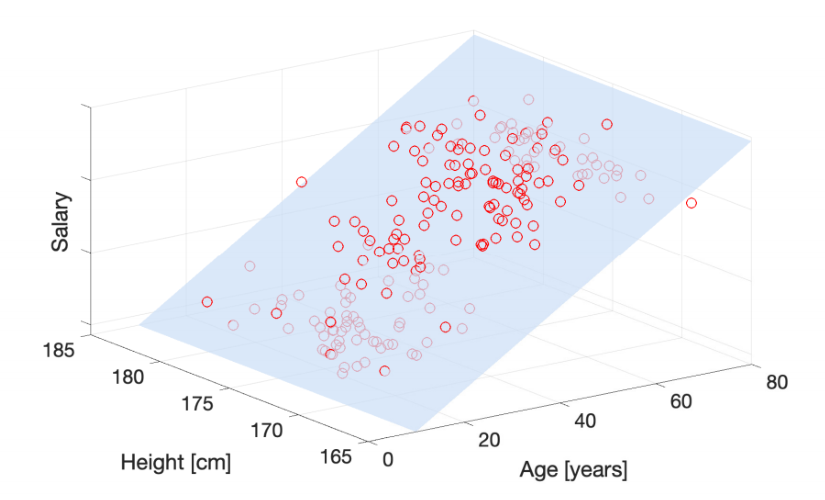

解得的模型是 planes（或 hyperplanes）。

具体计算：$`\hat{\mathbf y}=X\mathbf w`$。

Training dataset $`X`$（$`x_{i,k}`$ 中 $`i`$ 对应 item，$`k`$ 对应 attribute）：

```math
X=[\mathbf x_1,\ldots,\mathbf x_N]^T= \begin{bmatrix}\mathbf x_1^T\\\mathbf x_2^T\\\vdots\\\mathbf x_N^T\end{bmatrix} =\begin{bmatrix} 1&x_{1,1}&x_{1,2}&\cdots&x_{1,K}\\ 1&x_{2,1}&x_{2,2}&\cdots&x_{2,K}\\ \vdots&\vdots&\vdots&\ddots&\vdots\\ 1&x_{N,1}&x_{N,2}&\cdots&x_{N,K} \end{bmatrix}.
```

Label vector $`\mathbf y`$：

```math
\mathbf y=[y_1,\ldots,y_N]^T=\begin{bmatrix}y_1\\y_2\\\vdots\\y_N\end{bmatrix}.
```

使用 least squares（最小二乘法），得到 $`E_{\mathrm{MSE}}`$ 最小的 exact / analytical solution：

```math
\mathbf w_{\mathrm{best}}=(X^TX)^{-1}X^T\mathbf y.
```

这是 normal equation 的解（当 $`X^TX`$ 可逆时），也适用于将多项式各次幂作为特征的 polynomial model。

**2.7.1 例：Multiple linear regression**

Consider a dataset consisting of 4 samples described by three attributes, namely age, height and salary:

| Sample | Age [years] | Height [cm] | Salary [GBP] |
|---|---:|---:|---:|
| $`S_1`$ | 18 | 175 | 12000 |
| $`S_2`$ | 37 | 180 | 68000 |
| $`S_3`$ | 66 | 158 | 80000 |
| $`S_4`$ | 25 | 168 | 45000 |

We decide to build a linear model that maps age and height to salary.

1. Use vector notation to represent the resulting linear regression model.
2. Obtain the design matrix $`X`$ and response vector $`\mathbf y`$.

解：

```math
X=\begin{bmatrix}1&18&175\\1&37&180\\1&66&158\\1&25&168\end{bmatrix},\qquad \mathbf y=\begin{bmatrix}12000\\68000\\80000\\45000\end{bmatrix},\qquad \mathbf w=\begin{bmatrix}w_0\\w_1\\w_2\end{bmatrix}.
```

例如第一个样本的预测值：$`\hat y_1=w_0+18w_1+175w_2`$，与真实值 $`12000`$ 比较。

```math
\hat{\mathbf y}=X\mathbf w,\qquad\hat y_i=\mathbf w^T\mathbf x_i.
```

$`X`$ 的维度为 $`N\times(K+1)`$，$`\mathbf w`$ 的维度为 $`(K+1)\times1`$，$`\hat{\mathbf y}`$ 的维度为 $`N\times1`$。

### 2.8 Logistic model

```math
p(d)=\frac{e^d}{1+e^d}=\frac1{1+e^{-d}},\qquad d=w_0+w_1x.
```

```math
\therefore\quad\hat y_i=\frac1{1+e^{-(w_0+w_1x_i)}}.
```

### 2.9 其他的 quality metrics

除了 MSE，还有：

- **Root mean squared error（RMSE）**

   $`\displaystyle E_{\mathrm{RMSE}}=\sqrt{\frac1N\sum_{i=1}^N e_i^2}.`$

- **Mean absolute error（MAE）**

   $`\displaystyle E_{\mathrm{MAE}}=\frac1N\sum_{i=1}^N\vert e_i\vert .`$

- **R-squared**

   $`\displaystyle R^2=1-\frac{\sum_{i=1}^N e_i^2}{\sum_{i=1}^N(y_i-\bar y)^2},\qquad\bar y=\frac1N\sum_{i=1}^Ny_i.`$

### 2.10 Flexibility、Interpretability 与 fitting

**Flexibility（灵活性）与 Interpretability（可解释性）：** 灵活性越高，模型越复杂，可解释性往往越低，一般训练误差也越小。

**Fitting（拟合）与泛化能力：**

- **Underfitting（欠拟合）:** Large training and deployment errors are produced. The model is unable to capture the underlying pattern. Rigid（刚性，不灵活）models lead to underfitting.
- **Overfitting（过拟合）:** Small errors are produced during training, large errors during deployment. The model is memorising irrelevant details（记忆不相关的细节）. Too complex models and not enough data lead to overfitting.
- **Just right:** Low training and deployment errors. The model is capable of reproducing the underlying pattern and ignores irrelevant details.

**Generalisation（泛化）：** Generalisation can only be assessed by comparing training and deployment performance, not by just looking at how each model fits the training data. 不能只看训练集，也要看部署的表现。

## 3. Methodology（方法）

### 3.1 Sampling a population（总体取样）

如果我们要 use datasets as population surrogates（代替物），我们需要保证：

- Datasets are representative.
- Samples need to be extracted independently.

Samples need to be independent and identically distributed（i.i.d.）。

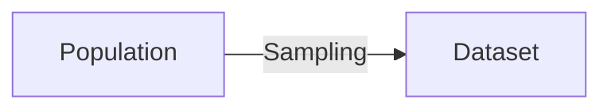
```mermaid
flowchart LR
    P[Population] -->|Sampling| D[Dataset]
```

**Best model：** 最好的模型 is the one with the highest deployment performance（works best on the target population）.

### 3.2 评估模型

Strategy:

- A quality metric used to quantify the performance.
- How data will be used to assess the performance of a model.

**Test dataset（测试集）：** Test datasets are extracted randomly. The test performance itself is random, as different datasets generally produce different values.

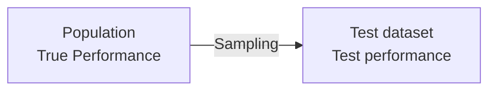
```mermaid
flowchart LR
    P["Population<br/>True Performance"] -->|Sampling| T["Test dataset<br/>Test performance"]
```

训练集是 subset of data。

### 3.3 Optimisation（优化）与 gradient descent（梯度下降）

Optimisation allows us to identify, among all the candidate models, the one that achieves the highest quality on the target population（也叫作 optimal model，最优模型）.

可微函数的内部最优点满足：$`\nabla E(\mathbf w)=0`$。

**梯度：函数上升最快的方向。**

Gradient descent is a numerical optimisation method where we **update iteratively** our model using the gradient of the error surface.

The gradient provides the direction along which the error increases the most. Using the gradient, we can create the following update rule:

```math
\mathbf w_{\mathrm{new}}=\mathbf w_{\mathrm{old}}-\epsilon\nabla E(\mathbf w_{\mathrm{old}}),
```

where $`\epsilon`$ is known as the **learning rate** or **step size**.

With every iteration we adjust the parameters $`\mathbf w`$ of our model. This is why this process is also known as **parameter tuning（调参）**.

- Small values of $`\epsilon`$ result in **slow convergence** to the optimal model.
- Large values of $`\epsilon`$ risk **overshooting** the optimal model.

Adaptive approaches can be implemented, where the value of the learning rate decreases progressively（逐渐减小学习率）.

### 3.4 Stopping strategy

- Number of iterations.
- Processing time.
- Error value.
- Relative change of the error value.

### 3.5 局部解、全局解

- **Local optima:** Model with the lowest error within a region.
- **Global optima:** Model with the lowest error among all the models.

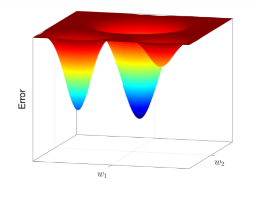

可能会有一个问题：Gradient descent can get stuck in local optima.

为了解决这个问题，可以 repeat the procedure from several initial models and select the best.

**Training dataset（训练数据集）：**

- 使用训练集得到的 error surface 叫作 empirical error surface（经验误差曲面）。
- 在训练集上表现最好的模型不一定会在 population 上表现得最好。

### 3.6 Data-driven gradient descent

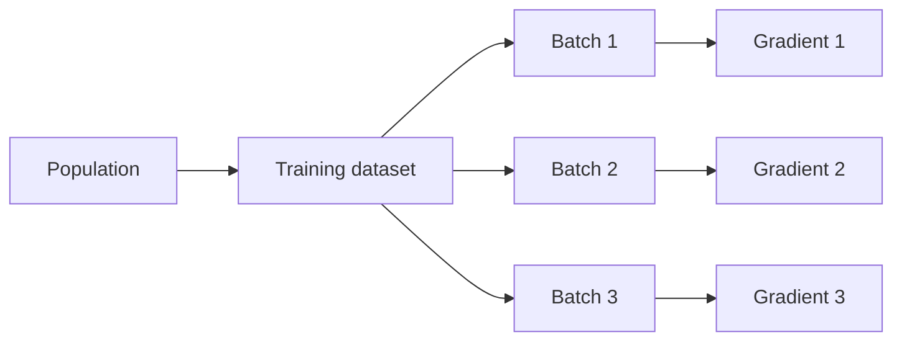
```mermaid
flowchart LR
    P[Population] --> T[Training dataset]
    T --> B1[Batch 1] --> G1[Gradient 1]
    T --> B2[Batch 2] --> G2[Gradient 2]
    T --> B3[Batch 3] --> G3[Gradient 3]
```

Depending on the amount of data used in each iteration，我们有以下几种梯度下降：

- **Batch gradient descent:** The whole training dataset is used.
- **Stochastic（随机，or online）gradient descent:** One sample is used.
- **Mini-batch gradient descent:** A small subset from the training dataset is used.

Batch size 较小时比较有用，这类随机梯度下降的随机性有助于 escape local minima。

### 3.7 其他 gradient-based optimisation 方法

- **Momentum** defines a velocity（direction and speed）for the update step, which depends on past gradients.
- **RMSProp** adapts the learning rate by scaling updates using the past gradients.
- **Adam** combines some features from the Momentum and RMSProp approaches.

- **动量法（Momentum）：** 这种方法不仅考虑当前的梯度，还考虑上一次的更新方向（即“动量”），以此来调整当前的更新步骤。这使得模型在梯度方向较稳定的情况下加速学习，并且能在梯度变化不大时保持稳定，避免了在陡峭的地方震荡。
- **RMSProp（均方根传播）：** 这种方法通过考虑过去梯度的平方的移动平均来调整每个参数的学习率。它能有效减小学习步长在梯度大的方向上的振动，增强在梯度小的方向上的稳定性，使训练过程更加平滑。
- **Adam（自适应矩估计）：** 结合了 Momentum 和 RMSProp 的特点，既考虑过去梯度的动量（Momentum），又自适应地调整每个参数的学习率（类似 RMSProp）。Adam 通常是一种效率很高且稳定的优化方法，适用于处理大规模和复杂的数据集。

### 3.8 Regularisation（正则化）

```math
E_R(\mathbf w)=E(\mathbf w)+\lambda\mathbf w^T\mathbf w.
```

例如，若不惩罚截距，

```math
E_{\mathrm{MSE}+R}=\frac1N\sum_{i=1}^Ne_i^2+\lambda\sum_{k=1}^K w_k^2.
```

```math
\mathbf w=(X^TX+N\lambda D)^{-1}X^T\mathbf y,\qquad D=\mathop{\mathrm{diag}}\nolimits(0,1,\ldots,1).
```

若连同截距一起惩罚，则 $`D=I`$。$`\lambda`$ 增大通常使模型复杂度降低，可以抑制模型 overfitting（过拟合）。

我们把 during training 的 notion of quality 叫作 **cost** or **objective function**。

例如：$`E_{\mathrm{MSE}}`$ 是 quality metric；$`E_{\mathrm{MSE}+R}`$ 是 cost / objective function。

### 3.9 Validation（验证）

**Why：** Validation methods allow us to use data for **assessing** and **selecting** different families of models. The same data used for validation can then be used to train a final model. 也可以用于选择有助于抑制 overfitting 的模型。

**定义：** Validation involves one or more **training** and **performance estimation** rounds per model family followed by **performance averaging**.

#### 3.9.1 Validation set

Dataset 划分为 Train（训练）和 Validation（评估）。

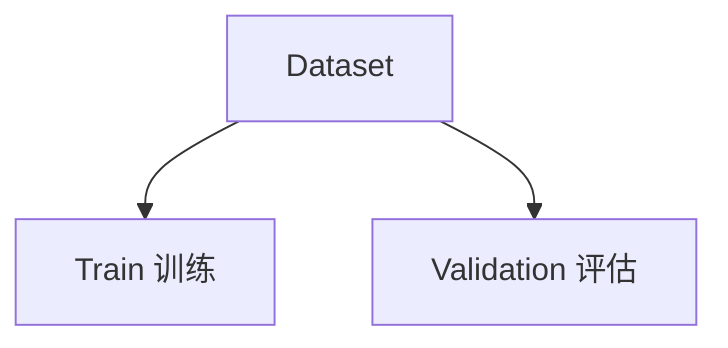
```mermaid
flowchart TD
    D[Dataset] --> T[Train 训练]
    D --> V[Validation 评估]
```

#### 3.9.2 Leave-one-out cross-validation（LOOCV）

This method also splits the available dataset into training and validation sets. However, the **validation set contains only one sample**.

**Multiple splits** are considered and the final performance is calculated as the average of the individual performances（for $`N`$ samples, we produce $`N`$ splits and obtain $`N`$ different performances）.

第 $`i`$ 轮：第 $`i`$ 个样本作验证，其余 $`N-1`$ 个样本作训练。LOOCV 的 $`k=N`$。

#### 3.9.3 $`k`$-fold cross-validation

In this approach the **available dataset is divided into $`k`$ groups**（also known as folds）of approximately equal size:

- We carry **$`k`$ rounds of training followed by validation**, each one using a different fold for validation and the remaining for training.
- The final estimation of the performance is the average of the performances from each round.

LOOCV is a special case of $`k`$-fold cross-validation, where $`k=N`$.

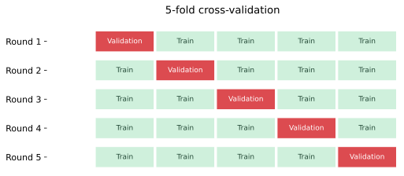

#### 3.9.4 各个 validation 的比较

- The **validation set** approach involves one training round. Models are however trained with fewer samples and the final performance is highly variable due to random splitting.
- **LOOCV** requires as many training rounds as samples there are in the dataset; however, in every round almost all the samples are used for training. For a fixed dataset and deterministic training procedure, it provides the same performance estimation.
- **$`k`$-fold** is the most popular approach. It involves fewer training rounds than LOOCV. Compared to the validation set approach, the performance estimation is less variable and more samples are used for training.

- 验证集法：只进行一次训练，模型使用的样本较少，最终表现因随机分割而变化较大。
- LOOCV（留一法）：训练轮次与样本数量相同，每轮使用几乎所有样本进行训练；固定数据和确定性训练方法下，评估结果不受随机划分影响。
- $`k`$ 折交叉验证：最常用的方法，训练轮次比 LOOCV 少；评估结果通常比验证集法稳定，且使用更多样本进行训练。

### 3.10 总结：Basic tasks

- **Test:** This is the **most important** task. It allows us to estimate the deployment performance of a model.
- **Training:** Used to find the best values for the parameters of a model, i.e. to tune a model.
- **Validation:** Necessary to compare different modelling options and select the best one, the one that will be trained.

### 3.11 总结：Using data correctly

- Datasets need to be **representative** of the target population and their samples need to have been extracted **independently**.
- Any test strategy has to be designed **before training**. Avoid looking at the test dataset during training and test a final model only once（Monkey Theorem!）.
- Any performance estimation that is obtained from a dataset is a **random quantity**: use with caution.

模型的 quality 取决于：

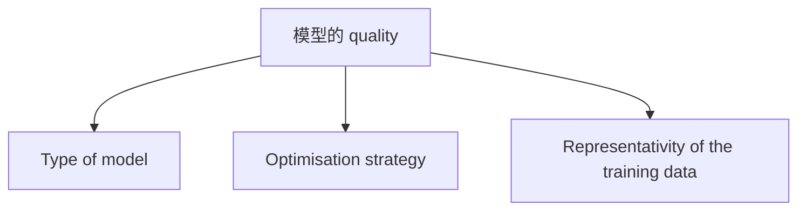
```mermaid
flowchart TD
    Q[模型的 quality] --> T[Type of model]
    Q --> O[Optimisation strategy]
    Q --> R[Representativity of the training data]
```

## 4. 分类（Classification）

### 4.1 应用场景与基本概念

分类的应用场景：TikTok recommendation algorithm；Sentiment analysis（情感分析）。

**什么是 classification？** 有监督学习，$`\mathbf x_i\longrightarrow f(\cdot)\longrightarrow\hat y_i`$。$`(\mathbf x_i,y_i)`$ 的意思：the label of sample $`i`$ is $`y_i`$。Predictor → Class。

**Decision region：** Points associated with the same label.

分类模型的解：partition of the predictor space into decision regions by using decision boundaries.

### 4.2 Linear boundary 与 linear classifiers

| Predictor space | Linear boundary |
|---|---|
| 1D | 使用一点：threshold（阈值） |
| 2D | 使用一条直线 |
| 3D | 使用一个 plane surface |

**Linear classifiers 定义：** Use linear boundaries between decision regions.

Linear boundaries：$`\mathbf w^T\mathbf x=0`$。例如二维预测空间中：

```math
\mathbf w=\begin{bmatrix}w_0\\w_1\\w_2\end{bmatrix},\qquad\mathbf x=\begin{bmatrix}1\\x_1\\x_2\end{bmatrix}.
```

### 4.3 评估 linear classifiers（quality metric）

#### 4.3.1 Accuracy 与 error rate

```math
A=\frac{\#\text{correctly classified samples}}{\#\text{samples}},
```

```math
E=1-A=\frac{\#\text{incorrectly classified samples}}{\#\text{samples}}.
```

就是比分对的比例，但这种指标是 blind（盲目的），不能体现预测的确定程度。

#### 4.3.2 分类之 logistic model

用于评估模型中 $`\mathbf w`$ 的效果。这里 $`p(d)`$、$`p(\mathbf x_i)`$、$`p(\mathbf w^T\mathbf x_i)`$ 都表示将相应输入代入 logistic 函数后的值。

The logistic function $`p(d)`$ is defined as

```math
p(d)=\frac{e^d}{1+e^d}=\frac1{1+e^{-d}}.
```

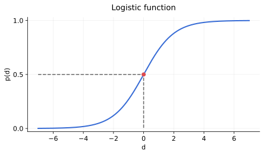

$`d=\mathbf w^T\mathbf x_i`$；$`d\lt 0`$ 时属于第一类，$`d\gt 0`$ 时属于第二类。$`p(\mathbf x_i)`$ 是属于第二类的 certainty，$`1-p(\mathbf x_i)`$ 是属于第一类的 certainty。

类别只有 0、1 之分，但 $`p(\mathbf w^T\mathbf x_i)`$ 在 $`0\sim1`$ 之间。

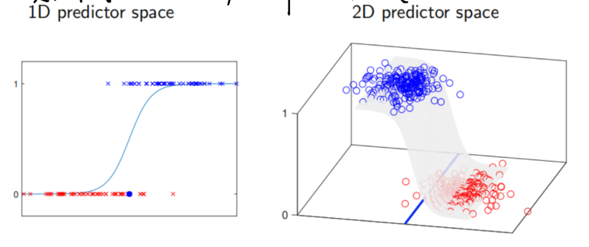

采用 $`y\in\{0,1\}`$ 编码时，$`p(d)`$ is the probability that the sample is class 1，即 $`P(y=1\mid\mathbf x)`$。

根据 $`p(d)`$ 判断类别：

- $`p(d)\to0`$：class 0。
- $`p(d)=0.5`$：boundary。
- $`p(d)\to1`$：class 1。

如何评估？$`L`$ 要尽可能大。

#### 4.3.3 Likelihood 与练习

**Likelihood function：**

```math
L=\prod_{i:y_i=0}\bigl(1-p(\mathbf x_i)\bigr)\prod_{i:y_i=1}p(\mathbf x_i),\qquad0\lt L\lt 1.
```

**Log-likelihood：**

```math
\log L=\sum_{i:y_i=0}\log\bigl[1-p(\mathbf x_i)\bigr]+\sum_{i:y_i=1}\log\bigl[p(\mathbf x_i)\bigr].
```

这里 $`y_i`$ 是真实的 label。

**练习题一：看懂图。** 方形样本在 $`d=-2`$，三角形样本在 $`d=2`$，分类边界 $`d=0`$；横轴是 $`d`$，纵轴在本例中无意义。

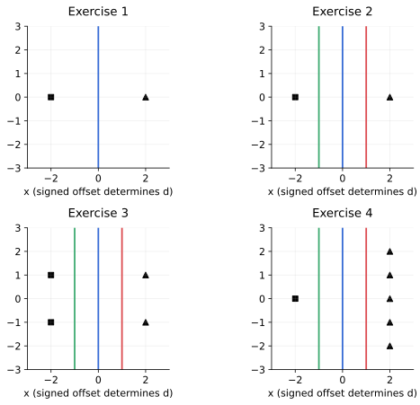

已知 $`p(2)\approx0.88`$，所以

```math
L=p(\triangle)\bigl(1-p(\square)\bigr)=p(2)\bigl(1-p(-2)\bigr)\approx0.77.
```

**练习题二：** 仍为 $`(-2,0)`$ 的方形样本与 $`(2,0)`$ 的三角形样本，比较三条竖直边界。The global certainty of each classifier（i.e. boundary）is:

| Boundary | $`L=p(\triangle)(1-p(\square))`$ |
|---|---:|
| 红色，$`x=1`$ | $`\approx0.70`$ |
| 蓝色，$`x=0`$ | $`\approx0.77`$ |
| 绿色，$`x=-1`$ | $`\approx0.70`$ |

**练习题三：有多个点（纵轴上）。** 方形样本为 $`(-2,1),(-2,-1)`$，三角形样本为 $`(2,1),(2,-1)`$。

| Boundary | Global certainty $`L`$ |
|---|---:|
| 红色，$`x=1`$ | $`\approx0.49`$ |
| 蓝色，$`x=0`$ | $`\approx0.60`$ |
| 绿色，$`x=-1`$ | $`\approx0.49`$ |

**练习题四：** 方形样本为 $`(-2,0)`$，三角形样本为 $`(2,2),(2,1),(2,0),(2,-1),(2,-2)`$。

| Boundary | Global certainty $`L`$ |
|---|---:|
| 红色，$`x=1`$ | $`\approx0.20`$ |
| 蓝色，$`x=0`$ | $`\approx0.47`$ |
| 绿色，$`x=-1`$ | $`\approx0.57`$ |

### 4.4 Parametric vs non-parametric

- **Parametric approaches:** Boundary 的形式被预先假定（固定形状，boundary is assumed）。
- **Non-parametric approaches:** 不假设固定的 boundary type，边界更灵活。

### 4.5 NN（Nearest Neighbours）与 KNN

**NN：** 把新样本赋予距离它最近的训练样本的 label。

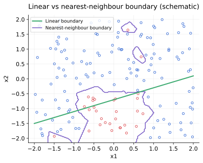

**KNN：** 给一个 sample $`\mathbf x`$，判断类别：找离 $`\mathbf x`$ 最近的已知的 $`k`$ 个点，看这 $`k`$ 个点最多是哪一类，$`\mathbf x`$ 就是哪一类。

KNN 中有 implicit boundary。二分类时常取奇数 $`k`$，减少平票情况。

- $`k\uparrow\Rightarrow`$ 边界 complexity $`\downarrow`$。
- 小 $`k\Rightarrow`$ 容易 overfitting。
- 大 $`k\Rightarrow`$ 容易 underfitting。

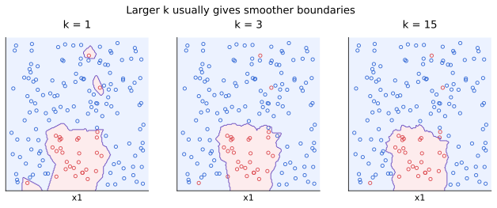

### 4.6 Bayes classifier

**Posterior probabilities（后验概率）：** $`P(y=\text{红}\mid\mathbf x)`$。给定 predictor，label 是蓝 / 红的概率；predictor 是已知结果，label 为未知。

**Odds ratio：** 比值。

```math
\frac{P(y=\text{红}\mid\mathbf x)}{P(y=\text{蓝}\mid\mathbf x)} =\frac{p(\mathbf x\mid y=\text{红})P(y=\text{红})}{p(\mathbf x\mid y=\text{蓝})P(y=\text{蓝})} \underset{\text{蓝}}{\overset{\text{红}}{\gtrless}}1.
```

- **大于 1：** 取分子对应类别。
- **小于 1：** 取分母对应类别。

符号：

- $`P(y\mid\mathbf x)`$ 是**概率**。
- $`p(\mathbf x\mid y)`$ 是 **density**。
- $`P(y)`$ 是**先验概率**。

**Gaussian density（1 个 predictor）：**

```math
p(x\mid y=c)=\frac1{\sigma_c\sqrt{2\pi}}\exp\left[-\frac12\left(\frac{x-\mu_c}{\sigma_c}\right)^2\right].
```

**Gaussian density（$`K`$ 个 predictors）：**

```math
p(\mathbf x\mid y=c)=\frac1{(2\pi)^{K/2}\vert \Sigma_c\vert ^{1/2}} \exp\left[-\frac12(\mathbf x-\boldsymbol\mu_c)^T\Sigma_c^{-1}(\mathbf x-\boldsymbol\mu_c)\right].
```

- $`\mathbf x=[x_1,\ldots,x_K]^T`$ contains **all the predictors**（note we have **not** prepended a 1）.
- $`\boldsymbol\mu_c`$ is the **mean**.
- $`\Sigma_c`$ is the **covariance matrix**.

#### 4.6.1 从高斯图像中寻找信息

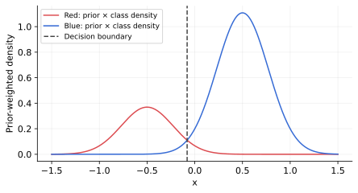

The boundary in discriminant analysis depends on the covariance matrices $`\Sigma_{\text{红}}`$ and $`\Sigma_{\text{蓝}}`$:

- If $`\Sigma_{\text{红}}=\Sigma_{\text{蓝}}`$, the boundary is linear. We call this scenario **linear discriminant analysis（LDA）**.
- Otherwise, the boundary is quadratic. This is **quadratic discriminant analysis（QDA）**.


#### 4.6.2 Exercise 1

Consider the following dataset, where $`x`$ will be used as a predictor and $`y`$ as a label:

| $`x`$ | $`y`$ |
|---:|:---:|
| -2 | A |
| -1 | A |
| 0 | A |
| 1 | A |
| 2 | A |
| 1 | B |
| 2 | B |
| 3 | B |
| 4 | B |
| 5 | B |

We will assume that the value of the predictor $`x`$ is distributed following a Gaussian distribution for both classes A and B. In other words, the class densities are Gaussian.

- Estimate the parameters of the Gaussian class densities.
- Build a Bayes classifier for the previous dataset.
- Build a new Bayes classifier with the same likelihoods but different priors, namely $`P_A=0.1`$ and $`P_B=0.9`$.

1. **参数估计。** 每类有 $`N=5`$ 个样本：

    $`\displaystyle \mu_A=\frac1N\sum x_A=0,\qquad\mu_B=\frac1N\sum x_B=3,`$

    $`\displaystyle \sigma_A^2=\frac1{N-1}\sum(x_A-\mu_A)^2=2.5,`$

    $`\displaystyle \sigma_B^2=\frac1{N-1}\sum(x_B-\mu_B)^2=2.5=\sigma_A^2.`$

    $`\displaystyle p(x\mid y=A)=\frac1{\sqrt{2.5}\sqrt{2\pi}}\exp\left[-\frac12\left(\frac{x}{\sqrt{2.5}}\right)^2\right],`$

    $`\displaystyle p(x\mid y=B)=\frac1{\sqrt{2.5}\sqrt{2\pi}}\exp\left[-\frac12\left(\frac{x-3}{\sqrt{2.5}}\right)^2\right].`$

    两条密度曲线的最高高度只与 $`\sigma`$ 有关，分别在 $`x=0`$ 和 $`x=3`$ 达到最大值。

    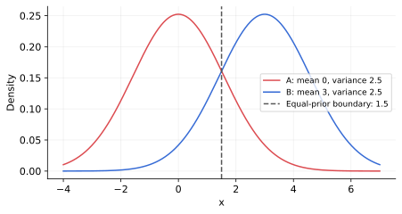

2. **等先验 Bayes classifier。**

    $`\displaystyle \frac{P(A\mid x_i)}{P(B\mid x_i)} =\frac{P(A)p(x_i\mid A)}{P(B)p(x_i\mid B)} =\frac{0.5p(x_i\mid A)}{0.5p(x_i\mid B)} =\frac{p(x_i\mid A)}{p(x_i\mid B)} =e^{(9-6x_i)/5}.`$

    - $`e^{(9-6x_i)/5}\gt 1\Leftrightarrow x_i\lt \frac32\Rightarrow\hat y_i=A`$。
    - $`e^{(9-6x_i)/5}\lt 1\Leftrightarrow x_i\gt \frac32\Rightarrow\hat y_i=B`$。

3. **不同先验。** $`P_A=0.1,P_B=0.9`$ 时，后验比值为 $`\frac19e^{(9-6x)/5}`$。令其等于 1，得到边界

    $`\displaystyle x=\frac{9-5\ln9}{6}\approx-0.331.`$

    小于边界取 A，大于边界取 B。

### 4.7 Bayesian extension：考虑误分类成本

- The cost of misclassifying a blue sample is $`C_{\text{蓝}}`$。
- The cost of misclassifying a red sample is $`C_{\text{红}}`$。

$`C_{\text{红}}`$ 指把红色样本错分为蓝色的 cost。

**Expected cost：**

- 选蓝的 cost：$`C_{\text{红}}\,P(y=\text{红}\mid\mathbf x)`$。
- 选红的 cost：$`C_{\text{蓝}}\,P(y=\text{蓝}\mid\mathbf x)`$。

目标：最小化 expected cost。

比较规则：

```math
\frac{P(y=\text{红}\mid\mathbf x)}{P(y=\text{蓝}\mid\mathbf x)} \underset{\text{蓝}}{\overset{\text{红}}{\gtrless}} \frac{C_{\text{蓝}}}{C_{\text{红}}}=T.
```

比值大于 $`T`$ 取红，小于 $`T`$ 取蓝。如果 $`T=100`$，边界为后验 odds ratio 等于 100 的等值线，红类区域相较 $`T=1`$ 时缩小。

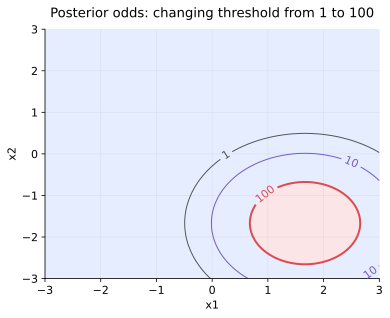

### 4.8 Confusion matrix

#### 4.8.1 Confusion matrix（counting）

数次数，每个样本预测一次。

In the following confusion matrix, 3 red samples are misclassified as blue, and 4 green samples are correctly classified. We can also learn that the dataset has 10 red samples, 20 blue samples and 5 green samples, and the **accuracy** is $`24/35`$.

| Predicted class / Actual class | 红 | 蓝 | 绿 |
|---|---:|---:|---:|
| 红 | 5 | 2 | 0 |
| 蓝 | 3 | 15 | 1 |
| 绿 | 2 | 3 | 4 |

#### 4.8.2 Confusion matrix（rates）

竖着算百分比，即每一列按该真实类别的总样本数归一化。

| Predicted class / Actual class | 红 | 蓝 | 绿 |
|---|---:|---:|---:|
| 红 | 0.5 | 0.1 | 0 |
| 蓝 | 0.3 | 0.75 | 0.2 |
| 绿 | 0.2 | 0.15 | 0.8 |

#### 4.8.3 一些专有词汇

**True positive：** True 表示判断正确，positive 看 predicted class；后面加 rate 就变成相应比例。

| Predicted class / Actual class | Positive | Negative |
|---|---|---|
| Positive | True positive（TP） | False positive（FP） |
| Negative | False negative（FN） | True negative（TN） |

**4.8.3.1 例题：**

Number of samples：

| Predicted / Actual | Positive | Negative |
|---|---:|---:|
| Positive | 10 | 11 |
| Negative | 2 | 9 |

Rates：

| Predicted / Actual | Positive | Negative |
|---|---:|---:|
| Positive | 0.83 | 0.55 |
| Negative | 0.17 | 0.45 |

- TP $`=10\Rightarrow`$ TPR $`=10/12\approx0.83`$。
- FP $`=11\Rightarrow`$ FPR $`=11/20=0.55`$。
- FN $`=2\Rightarrow`$ FNR $`=2/12\approx0.17`$。
- TN $`=9\Rightarrow`$ TNR $`=9/20=0.45`$。
- $`A=(10+9)/32=19/32\approx0.59`$。
- $`E=(11+2)/32=13/32\approx0.41`$。
- $`A+E=1`$。

### 4.9 评价标准

- **Sensitivity（recall, true positive rate）**
- **Specificity（true negative rate）**
- **Precision（positive predictive value）**

用下列位置编号对应混淆矩阵：

```math
\begin{bmatrix}1&2\\3&4\end{bmatrix}\quad\leftrightarrow\quad \begin{bmatrix}\mathrm{TP}&\mathrm{FP}\\\mathrm{FN}&\mathrm{TN}\end{bmatrix}.
```

```math
\mathrm{Sensitivity}=\frac{\mathrm{TP}}{\mathrm{TP}+\mathrm{FN}}\qquad\text{（竖着算：位置 1 /（位置 1 + 位置 3））},
```

```math
\mathrm{Specificity}=\frac{\mathrm{TN}}{\mathrm{FP}+\mathrm{TN}}\qquad\text{（竖着算：位置 4 /（位置 2 + 位置 4））},
```

```math
\mathrm{Precision}=\frac{\mathrm{TP}}{\mathrm{TP}+\mathrm{FP}}\qquad\text{（横着算：位置 1 /（位置 1 + 位置 2））}.
```

评价标准 in pairs：

- Sensitivity + Specificity：分别看两列。
- Precision + Recall（Sensitivity）：看正类的预测与真实情况。

```math
F_1=2\frac{\mathrm{precision}\times\mathrm{recall}}{\mathrm{precision}+\mathrm{recall}}.
```

**为什么 $`F_1`$ 不使用 specificity？** $`F_1`$ 聚焦正类的查准率和召回率，不依赖 TN，因此适合关注正类识别的场景。

**4.9.1 例：依据不同评价标准优化模型。**

If red is the positive class and blue is the negative class, obtain a linear boundary with the highest sensitivity and another with the highest specificity.

提高 sensitivity 要减少 FN，让更多真实正类落在预测正类区域；提高 specificity 要减少 FP，让更多真实负类落在预测负类区域。边界的移动方向由正、负区域的定义决定。

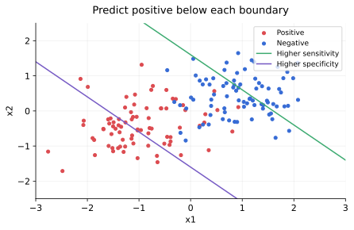

### 4.10 ROC plane

横轴为 $`1-\mathrm{specificity}=\mathrm{FPR}`$，纵轴为 $`\mathrm{sensitivity}=\mathrm{TPR}`$。越靠左上越好；对角线表示随机分类的参考水平。

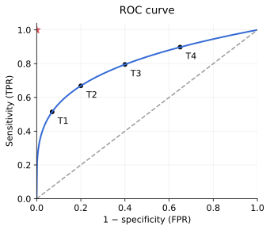

优化时通常需要在两个指标间权衡，例如：**highest sensitivity with a minimum specificity（of 70%）**，即要求 specificity 至少 70%，再最大化 sensitivity。

#### 4.10.1 ROC plane 应用

取不同的阈值 $`T`$，画 ROC curve。每个阈值对应一个 sensitivity 与 $`1-\mathrm{specificity}`$ 的组合。图中 $`T_1,T_2,T_3,T_4`$ 表示不同工作点；“最好”取决于约束和误分类代价，不能只看一个指标。

#### 4.10.2 变化 boundary 的法则

竖着看 matrix，看 boundary 两侧同色（相同 actual class）数量之比，对应矩阵每一列的比值。

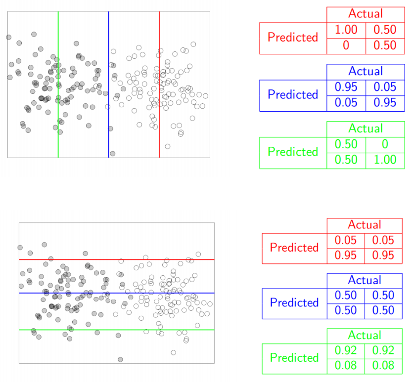

竖直边界，从右向左对应红、蓝、绿三条边界，其归一化混淆矩阵分别为：

```math
M_{\text{红}}=\begin{bmatrix}1.00&0.50\\0&0.50\end{bmatrix},\quad M_{\text{蓝}}=\begin{bmatrix}0.95&0.05\\0.05&0.95\end{bmatrix},\quad M_{\text{绿}}=\begin{bmatrix}0.50&0\\0.50&1.00\end{bmatrix}.
```

水平边界，从上向下对应红、蓝、绿三条边界，其归一化混淆矩阵分别为：

```math
M_{\text{红}}=\begin{bmatrix}0.05&0.05\\0.95&0.95\end{bmatrix},\quad M_{\text{蓝}}=\begin{bmatrix}0.50&0.50\\0.50&0.50\end{bmatrix},\quad M_{\text{绿}}=\begin{bmatrix}0.92&0.92\\0.08&0.08\end{bmatrix}.
```

#### 4.10.3 在 ROC plane 中评估

使用 **AUC（area under curve）**。AUC：ROC curve 下的面积。

Good classifier 的例子：AUC $`\approx0.8`$；随机分类器：AUC $`=0.5`$。AUC $`=0.5`$ 表示随机水平；AUC 也可能低于 0.5，表示排序方向比随机还差。

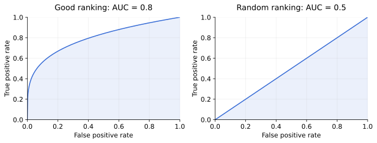

#### 4.10.4 评价标准应用：言之有理即可

1. 银行贷款（贷给别人）：若把“可以还款”作为正类，要关注 precision，减少把不能还款的人误判为可还款（FP）。

2. 安全系统报警：关注 sensitivity，减少真实危险被漏报（FN）。
3. 医学检查：关注 sensitivity，减少真实患者被漏诊（FN）。
4. 烟雾报警器：关注 sensitivity，减少火灾或烟雾的漏报（FN）。

## 5. 数字 Ethics

### 5.1 Bias（偏差）与 fairness（公平）

偏差的来源：

- Sample。
- Label。
- Historical。

如何解决：

- Balanced data sampling。
- Data augmentation（数据增强）。
- Fairness metric。
- Leveraging benchmark datasets（使用基准数据集 / 测试集）。
- Transparency。

### 5.2 Privacy（隐私）

Data anonymization and de-identification（匿名化与去识别化）：

- **Pseudonymization：** 使用假名字 / 假名标识。
- **$`k`$-anonymity：** 每条记录在准标识属性上与至少 $`k-1`$ 条其他记录不可区分，即组成至少 $`k`$ 条记录的组。
- **Data masking：** 数据掩码、脱敏替换。
- **Differential privacy：** 通过加入经过控制的噪声保护个体信息。

**Federated learning（联邦学习）：** 数据存在本地，共享模型更新；对设备和通信有要求，实现较复杂。

## 6. Methodology：Pipeline 与数据表示

### 6.1 Pipeline

**Pipeline：** A sequence of operations.

Supervised ML pipeline 是用 predictors（input）produce a prediction（output）。

例如一个 $`A\times B`$ pixels 的彩色图片：

- Input dimensionality：$`3\times A\times B`$。
- 一个线性预测模型的 $`\mathbf w`$ consists of $`3\times A\times B+1`$ values。
- 为了降低 overfitting 风险，需要足够多的样本；无正则线性拟合通常要求样本数量大于参数数目 $`3AB+1`$，但这本身并不能保证不过拟合。
- 也可以从 $`3\times A\times B`$ features 中提取 4 个 features，再做预测，这样更有 meaning。

注意：pipeline 不是单个 model；我们需要 **deploy the entire pipeline**，而不是 individual models，因为一个 pipeline 可能用到了很多 models。

预测的质量由 **all the pipeline stages（步骤）** 决定。

### 6.2 Distance

- 在 regression 中，$`y_i-\hat y_i=e_i`$ 是带符号的误差，其绝对值可作为 distance。
- 在 classification 中，样本与边界的距离是一种 distance。
- 在 clustering 中，用样本和 prototypes 间的 distance 进行 $`k`$-means 聚类。
- 在 density estimation 中，the standard deviation（标准差）量化了样本与样本均值之间的典型 distance。

### 6.3 Data normalisation（数据归一化）

- **Min-max normalisation**。

    $`\displaystyle z=\frac{x-\min(x)}{\max(x)-\min(x)}.`$

- **Standardisation**。

    $`\displaystyle z=\frac{x-\mu}{\sigma}.`$

    - $`\mu`$：average of $`x`$。
    - $`\sigma`$：the standard deviation（标准差）。

要注意 outliers（异常值）。

### 6.4 Transformation

定义：data manipulations（操作）that change the way that we represent our samples.

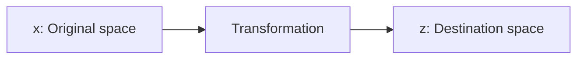
```mermaid
flowchart LR
    X["x: Original space"] --> T[Transformation] --> Z["z: Destination space"]
```

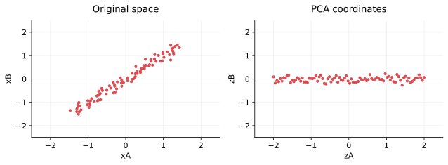

Normalisation 也是一种 transformation。

有两种 transformation：

- 空间 dimensions 不变，例如 linear transformation。
- **Dimensionality reduction**：feature selection（从已有特征选择）、feature extraction（提取新的特征）。

Transformation 包括 dimensionality reduction、normalization、feature selection 和 feature extraction。

### 6.5 Linear transformation：PCA

**PCA：Principal Component Analysis。** 保留全部主成分时，变换前后 dimensions 不变；只保留部分主成分时可用于降维。Scaling 或 rotation 都是 linear transformation。

### 6.6 Non-linear transformations

例如原空间中有两个红色点簇 $`C_1,C_2`$，周围为蓝色样本。定义：

- $`z_1`$：距离 centre 1 的距离。
- $`z_2`$：距离 centre 2 的距离。

在新空间中，靠近任一中心的红色样本分别落在 $`z_1`$ 较小或 $`z_2`$ 较小的区域，可用两个线性判别条件的 OR 组合分类。

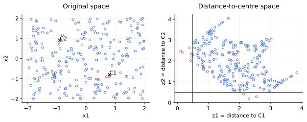

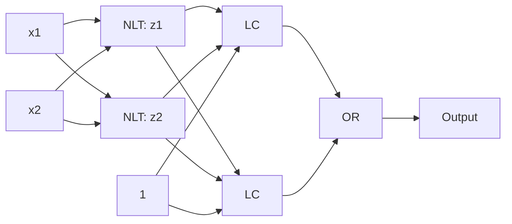
```mermaid
flowchart LR
    X1[x1] --> N1[NLT: z1]
    X1 --> N2[NLT: z2]
    X2[x2] --> N1
    X2 --> N2
    N1 --> L1[LC]
    N1 --> L2[LC]
    N2 --> L1
    N2 --> L2
    B[1] --> L1
    B --> L2
    L1 --> O[OR]
    L2 --> O
    O --> Y[Output]
```

先经过 **NLT（non-linear transformation）**，再经过 **LC（linear classifier）**，最后结合 OR 进行输出。

### 6.7 Kernel methods

例如 support vector machines，kernel methods 是 transformation 的高手；它们 implicitly define such transformations，你需要做的就是使用简单模型在变换后的空间进行预测。

PCA 举例：旋转坐标轴。

### 6.8 PCA 在降维中的作用

1. **衡量重要性：** PCA 会为新空间的每一个 dimension 分配一个反映其重要性的量，即对应主成分的解释方差。
2. **排序并选择：** 根据解释方差可以对新空间中的特征进行排序，去掉那些方差低、信息较少的维度。
3. **用于后续模型：** 通过这种方式，我们可以将数据的维度从高降到低，同时保留尽可能多的重要信息。降维后的低维数据可以作为输入，训练机器学习模型。

**作用：** 这种方法不仅可以减少计算复杂度，还可以降低过拟合的风险，因为模型处理的数据更简洁、信息更集中。


### 6.9 Feature selection

Feature selection 可以通过 **validation** 进行。

1. **枚举特征子集：** 假设有 $`M`$ 个特征，从里面挑子集，有 $`2^M-1`$ 种非空组合。
2. **训练并比较：** 对于每个特征组合训练一个模型，通过比较不同模型的表现，判断哪些特征是 relevant 的。

#### 6.9.1 过滤法（Filtering）

**方法：**

- 单独评估每个特征（属性）的表现。
- 可通过训练简单模型并评估验证性能为每个特征打分。
- 按分数选择表现最好的特征。

**优点：** 简单快速，适合初筛。

**缺点：** 忽略了特征之间的交互作用。例如，特征 $`X_1`$ 和 $`X_2`$ 单独效果不好，但结合起来可能很好。

#### 6.9.2 包装法（Wrapping）

如果怀疑特征之间的交互很重要，就需要将特征组合起来评估。通过以下步骤实现：

1. 使用不同的特征子集训练模型。
2. 使用验证方法评估每个模型的表现。
3. 选择验证性能最好的特征子集。

**优点：** 考虑了特征之间的交互作用。

**缺点：** 计算成本高。逐特征评估只需评估 $`M`$ 个模型（$`M`$ 是特征数量），而穷举包装法需要评估最多 $`2^M-1`$ 个非空组合。为减少计算复杂度，可以使用贪婪搜索（Greedy Search）等方法。

### 6.10 Feature extraction

Reduce dramatically the dimensionality.

**特点：**

- 特征提取通过设计有效的特征来大幅降低数据集的维度。
- 适用于复杂数据类型（如图片、信号等），用少量特征来总结数据的重要信息。

**例子：**

- 一张图片有 $`422\times424\approx180000`$ 个像素，是否需要 $`3\times180000`$ 个特征来判断这是一只狗？
- 特征提取可以提取图片中的关键特征（如轮廓、纹理）来大幅减少数据量。

**应用：** 数字信号处理和图像处理提供了多种方法来从复杂数据中提取特征，例如边缘检测、颜色直方图等。

### 6.11 Ensemble learning（集成学习）

#### 6.11.1 原理

- **传统方法：** 通过验证选择一个最佳模型家族（best family）。
- **集成方法：** 结合多个基础模型（base models）的优势，创建一个更强的模型。
- **基础模型的多样性：** 使用随机数据子集训练模型（random subset of the data）；使用随机特征子集训练模型（random subset of the attributes）；使用完全不同的模型家族（如决策树、神经网络等）。

#### 6.11.2 Bagging（装袋法）

**Bootstrap 方法：** 从数据集中随机抽样（可重复，即有放回抽样），生成多个子数据集。

**Bagging 流程：**

1. 利用 Bootstrap 方法生成 $`K`$ 个子数据集。
2. 用每个子数据集训练一个基础模型 $`f_k(\mathbf x)`$。
3. 将 $`K`$ 个基础模型的预测结果组合成最终模型 $`f(\mathbf x)`$。

- **平均法（averaging）：** $`f(\mathbf x)=\frac1K\sum_{k=1}^K f_k(\mathbf x)`$。
- **投票法（voting）：** 按基础模型的预测结果投票决定输出。

**优点：** 降低过拟合；提高模型的稳定性和鲁棒性。

### 6.12 Decision trees（决策树）

Root：whole region；leaf：one of the decision regions。

**原理：** 决策树通过对特征空间的分割构建决策区域。分割规则基于单一特征，结果可以表示为一棵树。

**树的结构：**

- 根节点（Root）：代表整个未分割的数据集。
- 叶节点（Leaf）：代表最终的决策区域。
- 目标是使每个叶节点尽可能“纯”（pure leaves），包含尽可能多的同类样本。
- 分类规则：根据叶节点的多数类别（majority class）进行分类。

**构建过程：**

1. 从根节点开始，递归地（recursively）将每个区域 split 成两个子区域。
2. 分割规则为轴平行，每次基于一个特征的阈值。
3. 选择能够最大程度提高区域纯度的分割。
4. 停止条件：区域中的样本数小于设定值；区域纯度已满足要求。

**例：根据 salary 和 age 判断 opinion。** 绿色 = good，蓝色 = neutral，红色 = bad opinion。

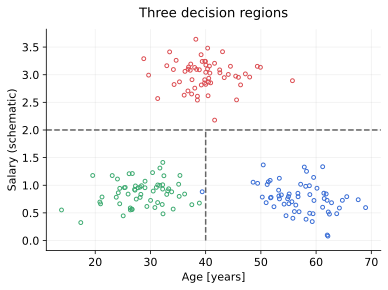

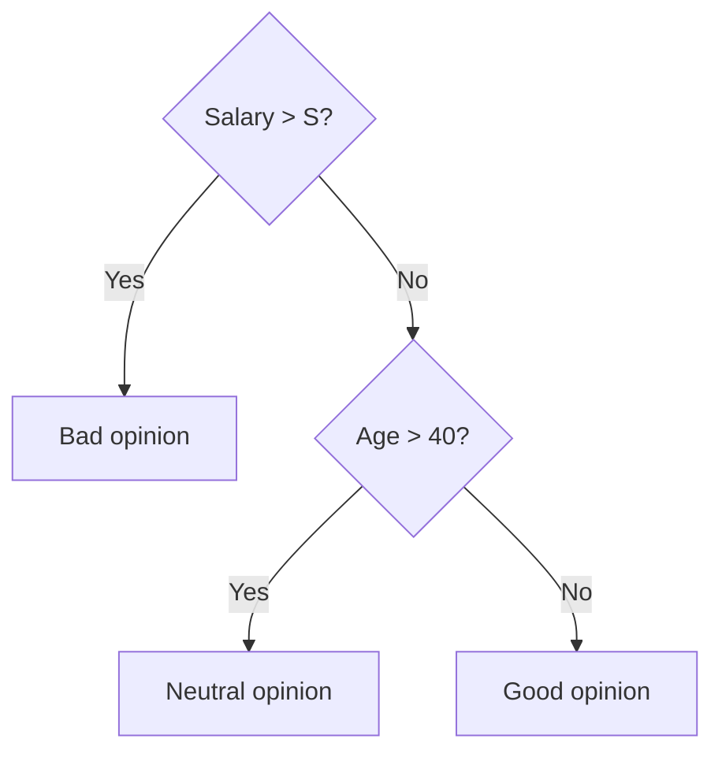
```mermaid
flowchart TD
    S{Salary > S?} -->|Yes| B[Bad opinion]
    S -->|No| A{Age > 40?}
    A -->|Yes| N[Neutral opinion]
    A -->|No| G[Good opinion]
```

Decision trees 可以解决 XOR 问题，linear classifier 不能解决 XOR 问题；但决策树训练出有效的树比较困难。

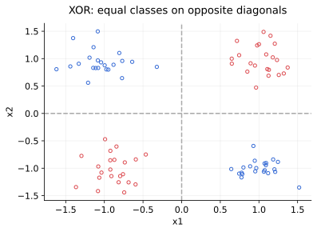

**决策树的优缺点：**

- 优点：决策树简单且灵活，能够处理 numerical and categorical predictors（数值型和分类型特征）。
- 缺点之一，过拟合风险：决策树可能记住训练样本，需要剪枝（Pruning）和停止条件（stop criteria）缓解。
- 缺点之二，不稳定性：不同的训练数据集可能导致树结构差异很大。
- 缺点之三，复杂问题的学习难度：虽然一些问题（如 XOR 问题）可以用树表示，但训练出有效的树可能较难。

### 6.13 Ensemble learning 之 random forests

**定义：** 随机森林是一种集成学习方法，由多个决策树组成。

**特点：**

- 随机化训练：每棵树通过随机选择训练样本和特征来训练，增加了模型的多样性。
- 预测方式：最终预测通过平均（回归）或投票（分类）汇总所有树的结果。

**优点：** 高准确性；抗过拟合能力强。

**缺点：** 训练成本高，计算复杂；难以解释模型（相比单一决策树，随机森林更难直观理解）。

### 6.14 Ensemble learning 之 boosting

Boosting 不同于 bagging、random forests。

**特点：**

1. 基础模型（如简单的决策树）按顺序生成，后一个模型依赖于前一个模型的结果。
2. 强调改进弱点，因此模型组合起来可以逐步提升性能。

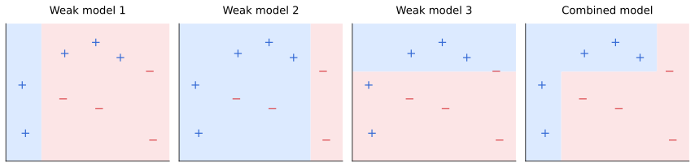

## 7. Neural Networks and Deep Learning

### 7.1 Neural network（神经网络）

神经网络常用于 supervised problems。

```math
\mathbf x\longrightarrow W\longrightarrow\hat y=h_W(\mathbf x).
```

$`W`$：weights，可以 tuned。神经网络是一种 universal machine，在适当条件下有很强的函数表达能力。

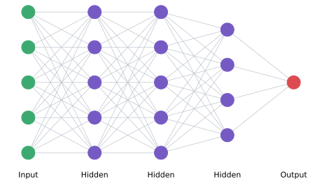

神经网络可以看作一个可调的管道（tunable），但有 overfit 的风险。

### 7.2 Perceptron（感知器 / neuron）

Perceptron 是 neural network 的 basic unit。它由以下两部分组成：

- **权重向量（weight vector）$`\mathbf w`$：** 每个输入变量对应一个权重，影响输入对输出的贡献。
- **激活函数（activation function）$`h(\cdot)`$：** 将加权输入映射到输出，通常为 non-linear，使输出更符合问题需求。

```math
a=h(\mathbf w^T\mathbf x)=h\left(w_0+\sum_{k=1}^K w_kx_k\right).
```

$`w_0`$：bias。

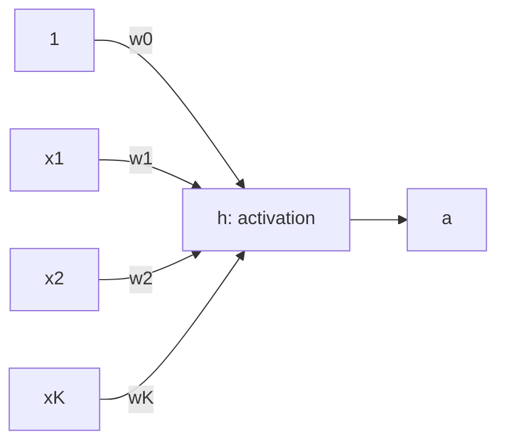
```mermaid
flowchart LR
    B[1] -->|w0| H["h: activation"]
    X1[x1] -->|w1| H
    X2[x2] -->|w2| H
    XK[xK] -->|wK| H
    H --> A[a]
```

### 7.3 Layer（层）

**定义：**

- 层是由多个感知器（Perceptrons）组成的集合。
- 这些感知器使用相同的输入，每个感知器独立生成一个输出。

**重点：** 如果有 $`L`$ 个 perceptrons、$`K`$ 个 inputs，那么有 $`L\times(K+1)`$ 个 weights（包括偏置）。

一个全连接层让输入 $`1,x_1,x_2,\ldots,x_K`$ 连接到每一个输出单元 $`a_1,a_2,\ldots,a_L`$。

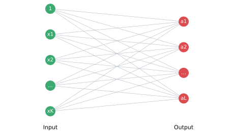

### 7.4 神经网络的 architecture

**神经网络的架构：** 描述各层之间的连接方式。

- **输入层：** 接收输入数据（预测变量），表示为 $`x_1,x_2,\ldots,x_K`$。
- **隐藏层（hidden layer）：** 提取数据的内部特征。
- **输出层：** 生成最终的预测结果，表示为 $`\hat y_1,\hat y_2,\ldots,\hat y_M`$。

**数学表达：**

```math
\hat{\mathbf y}=[\hat y_1,\ldots,\hat y_M]^T=h_W(\mathbf x).
```

注意：这里的 $`\hat y_j`$ 不是第 $`j`$ 个样本的预测值，而是输出层中对应节点的值。

**神经网络的组成：**

- **感知器（Perceptrons）：** 神经网络由多个感知器组成，分层排列并通过特定架构连接。
- **权重（Weight）：** 每条连接线都有一个参数，用于调整输入的影响。

**特征提取与深度：** 每一层都会生成中间特征（Intermediate Features），逐步对输入数据进行转换。神经网络的层数决定其深度：

- **浅层网络（Shallow Neural Networks）：** 隐藏层较少，适合简单任务。
- **深层网络（Deep Neural Networks）：** 隐藏层较多，能够处理复杂问题。

若有 $`K`$ 个输入，三个计算层分别有 $`L_1,L_2,L_3`$ 个 perceptrons，则共有

```math
L_1(K+1)+L_2(L_1+1)+L_3(L_2+1)
```

个参数。输入层 → 隐藏层 → 隐藏层 → 输出层。

### 7.5 Step activation function

```math
h_{\mathrm{step}}(d)=\begin{cases}1,&d\gt 0,\\0,&\text{otherwise}.\end{cases}
```

**AND 的感知器实现：**

```math
f(A,B)=h_{\mathrm{step}}(-1.5+A+B).
```

| $`A`$ | $`B`$ | $`f(A,B)`$ |
|---:|---:|---:|
| 0 | 0 | 0 |
| 0 | 1 | 0 |
| 1 | 0 | 0 |
| 1 | 1 | 1 |

**组合 AND 和 OR，实现 XOR：**

```math
a_{\land}=h_{\mathrm{step}}(-1.5+A+B),\qquad a_{\lor}=h_{\mathrm{step}}(-0.5+A+B),
```

```math
f(A,B)=h_{\mathrm{step}}(-0.5-a_{\land}+a_{\lor}).
```

| $`A`$ | $`B`$ | AND | OR | $`f`$ |
|---:|---:|---:|---:|---:|
| 0 | 0 | 0 | 0 | 0 |
| 0 | 1 | 0 | 1 | 1 |
| 1 | 0 | 0 | 1 | 1 |
| 1 | 1 | 1 | 1 | 0 |

### 7.6 检测 vertical / horizontal edge

例如图片的分界线。用 $`3\times3`$ 网格的像素作为输入，分别训练一个感知器判断 vertical edge、一个感知器判断 horizontal edge。边缘要依据具体的图片内容而定。

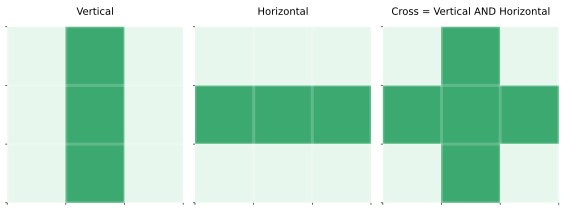

检测 derived grid patterns——十字架：既要有水平边缘，又要有竖直边缘，将两个检测结果进行 AND。

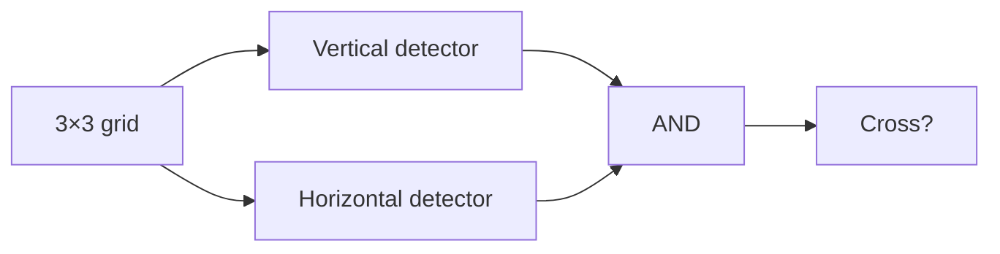
```mermaid
flowchart LR
    X[3×3 grid] --> V[Vertical detector]
    X --> H[Horizontal detector]
    V --> A[AND]
    H --> A
    A --> C[Cross?]
```

**XOR 类型的数据分布：** 两种类别各有两个点簇，对角位置的点簇属于同一类。


$`L_v`$ 和 $`L_h`$：它们是感知机（Perceptrons），分别实现垂直和水平的线性边界。它们的输出表示数据点在边界的哪一侧（类似于分类）。将它们的输出组合为 AND、OR，再计算 $`h(-0.5-\mathrm{AND}+\mathrm{OR})`$，可实现 XOR 分类。

### 7.7 Negative log-likelihood function

二分类网络的平均负对数似然（cost function）：

```math
\ell(W)=-\frac1N\sum_{i=1}^N\left[y_i\log\hat y_i+(1-y_i)\log(1-\hat y_i)\right].
```

### 7.8 Gradient descent & back-propagation

**梯度下降（Gradient Descent）：** 是用于优化目标函数 $`\ell(W)`$ 的主要方法，用来寻找最优的参数 $`W`$。直接计算全部梯度虽然方法简单，但可能消耗较多计算资源。

**反向传播（Back-propagation）：** 是一种高效的算法，用于计算梯度。梯度由反向传播算法计算后，用于梯度下降优化 $`W`$。

**反向传播的原理：**

- 利用微积分的链式法则（chain rule of calculus）。
- 计算某一层的梯度时，使用从下一层传回的信息。
- 从输出层开始，先计算损失函数对输出的导数，再逐层向前传播梯度信息，计算隐藏层的梯度。

### 7.9 训练注意事项

- **Parameter initialization：** 同层神经元的权重不应全部初始化为相同的零，否则对称性无法被打破，神经元会学到相同的特征。权重通常初始化为合适的 random values。
- **Overfitting：** Neural networks 可能包含数百万个参数，容易过拟合。解决方法：使用 regularization（如 L1 / L2）和基于验证集的 early stopping。
- **Non-convexity：** Cost function 可能有多个局部最小值。为降低陷入较差局部最优的风险，可以从不同的 random initial values 重新训练。
- **Input scaling：** 输入值的范围会影响权重的计算。应对方法：对输入数据进行 standardization，避免不同输入维度仅因量纲而受到不同对待。
- **Network architecture：** 不同的问题适合不同的网络结构，应根据问题选择合适的 architecture。

### 7.10 Transfer learning（迁移学习）

```math
\mathbf x_i\xrightarrow{T}\mathbf z_i\xrightarrow{f}\hat y_i.
```

**核心思想：** 将一个已经在任务 A 上训练好的神经网络用于解决一个相关的任务 B，这样可以节省训练时间和计算资源。

**具体做法：**

- 前几层（Early Stages）保持不变：将任务 A 中学到的早期特征提取部分 $`T(\mathbf x)`$ 固定下来，不需要重新训练。
- 后几层（Late Stages）重新训练：使用任务 B 的新数据，仅对后期的预测部分 $`f(\mathbf z)`$ 进行重新训练。

**优点：**

- 节省计算成本：问题 A 和问题 B 的输入特征相似时，$`T(\mathbf x)`$ 部分可以复用。
- 快速收敛：问题 B 的参数可能接近问题 A 已学到的参数，因此模型训练时间可能更短。

### 7.11 Fully connected layer

All perceptrons receive all the outputs from the previous layer.

参数太多，不适合直接利用图像平移等变性（equivariance）：相同 pattern 可以出现在 grid 的不同位置，而全连接层不会自动共享检测这个 pattern 的权重。

### 7.12 Convolutional layer（卷积层）

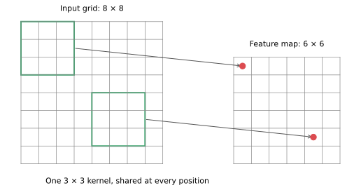

$`3\times3`$ kernel 内的参数在不同位置共享。Kernel 在 input grid 中滑动（filter），所到之处分别进行 convolution（卷积），形成 feature map；feature map 的每个输出对应一个局部区域的计算。

可以有多个 feature maps，每个 feature map 对应 different concept，它们形成 stack of maps。

- Kernel 的 dimensions：$`H\times W\times D`$。
- 每个 kernel 的参数个数：$`H\times W\times D+1`$（包括 bias）。
- 训练卷积层 $`\Longleftrightarrow`$ tune kernel weights。

### 7.13 Pooling layer（池化层）

池化层可以减小 feature maps 的尺寸。有两种 pooling 方式：

- **Max pooling：** 取最大值。
- **Average pooling：** 取平均值。

#### 7.13.1 卷积层例子

输入网格为 $`8\times8`$，kernel 为 $`3\times3`$；无 padding、stride 为 1 时，输出 feature map 为 $`6\times6`$，图中局部区域映射到对应位置的一个输出。

Feature map 的边长：

```math
F=m-n+1.
```

$`m`$：图的边长；$`n`$：核的边长。例：$`8-3+1=6`$，所以 $`8\times8`$ 输入经过 $`3\times3`$ 卷积核后得到 $`6\times6`$ 输出。

## 8. Unsupervised：Structure analysis

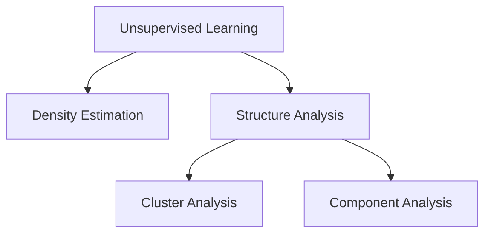
```mermaid
flowchart TD
    U[Unsupervised Learning] --> D[Density Estimation]
    U --> S[Structure Analysis]
    S --> C[Cluster Analysis]
    S --> A[Component Analysis]
```

Unsupervised learning 可以用来：summarise data、discovery、quantitative applications。定量应用包括 class densities、probability density，以及根据低密度识别 anomalies（异常）。

### 8.1 Cluster analysis

定义：将数据样本描述为 clusters of similar samples。

假设 $`\mathbf x_i=(x_{i,1},x_{i,2},\ldots,x_{i,p})`$、$`\mathbf x_j=(x_{j,1},x_{j,2},\ldots,x_{j,p})`$，则平方欧氏距离

```math
d_{i,j}=(x_{i,1}-x_{j,1})^2+\cdots+(x_{i,p}-x_{j,p})^2.
```

用 proximity 描述 similarity。

#### 8.1.1 Intra-cluster sample scatter（簇内散度，要小）

```math
I(C_0)=\frac12\sum_{\mathbf x_i,\mathbf x_j\in C_0}d_{i,j},\qquad I(C_1)=\frac12\sum_{\mathbf x_i,\mathbf x_j\in C_1}d_{i,j}.
```

就是把同一类中每个点到其他所有点的距离平方加在一起。如果每个无序点对只计算一次，就不用再乘 $`1/2`$；$`1/2`$ 用于去掉重复的连线。

另一种计算方法：

```math
\boldsymbol\mu_0=\frac1{N_0}\sum_{\mathbf x_i\in C_0}\mathbf x_i,
```

```math
I(C_0)=N_0\sum_{\mathbf x_i\in C_0}\Vert \mathbf x_i-\boldsymbol\mu_0\Vert ^2.
```

距离仍然是平方。

**例：求 $`I(C_0)`$。** $`C_0`$ 中四个点为 $`(0,2),(1,3),(2,2),(1,1)`$；另一个簇的点为 $`(4,1),(5,2),(6,1),(5,0)`$。

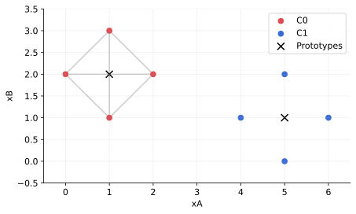

第一种：

```math
I(C_0)=4+4+2+2+2+2=16.
```

第二种：$`\boldsymbol\mu_0=(1,2)`$，所以

```math
I(C_0)=4\times(1^2+1^2+1^2+1^2)=16.
```

**Prototypes（聚类的中心）：** 用一个代表点概括一个簇，例如以该簇的均值作为 prototype。

#### 8.1.2 Inter-cluster sample scatter（簇间散度，要大）

```math
O(C_0,C_1)=\sum_{\mathbf x_i\in C_0,\,\mathbf x_j\in C_1}d_{i,j}.
```

即连接两个簇中每一对跨簇样本，累加其平方距离。

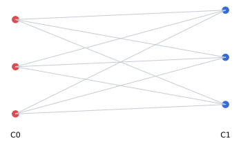

### 8.2 $`k`$-means clustering

最终得到的解可能是 local optimum（局部最优解）。$`k`$-means 是 prototype-based 算法。

#### 8.2.1 $`k`$-means 步骤

1. 先决定 $`K`$ 的值，即有多少 clusters。
2. 初始时，randomly choose the cluster centers（prototypes）。
3. Samples are re-assigned to the cluster with the closest prototype.
4. Prototypes are obtained as the center of each cluster.
5. Samples are re-assigned to the cluster with the closest prototype.
6. Repeat steps 4 and 5 until reaching a stable solution, where no sample is reassigned.

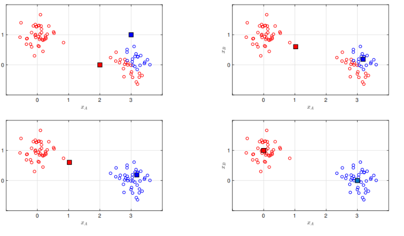

#### 8.2.2 如何决定 $`K`$ 的值（即多少个 clusters）

**Elbow method。**

Core idea：Assuming the true number of clusters is $`K_T`$. For $`K\gt K_T`$, the increase in quality is slower than for $`K\lt K_T`$, as we will split true clusters.

Steps：

1. Compute the intra-cluster sample scatter for different values of $`K`$.
2. Plot the graph.
3. Identify the “elbow point”.

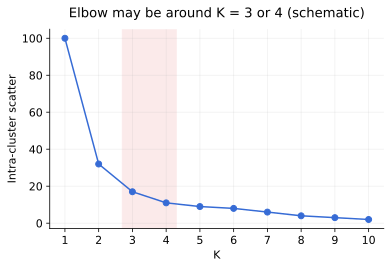

图中 3、4 都可能是 elbow points，需要结合应用判断。

- **$`k`$-means：** 适用于近似 spherical（球形）、凸形 cluster。
- **DBSCAN：** 适用于 non-convex cluster（非凸）。

### 8.3 DBSCAN（Density-based clustering）

Cluster 是 group of connected samples。DBSCAN 是 density-based 算法。

**核心概念：**

- Radius $`r`$：邻域半径。
- Density：每个点在半径 $`r`$ 范围内的邻居样本数。此处约定不包括自身。
- Threshold $`t`$：密度阈值。
- **Core：** Density $`\geq t`$ 的点。
- **Border：** Density $`\lt t`$，但至少位于一个 core 点的邻域内。
- **Outlier：** 既不是 core，也不是 border 的点，即离群点。

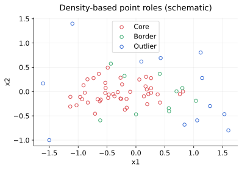

- **红：** core。
- **绿：** border。
- **蓝：** outlier。

**DBSCAN 的流程：**

1. 根据 density 找出 core、border 和 outlier。
2. 相邻的 core samples 连接起来，形成 cluster 的 backbone。
3. 将 border sample 归入其半径 $`r`$ 邻域内某个 core sample 所属的 cluster；若同时邻接多个 cluster，归属可随访问顺序变化。
4. Outlier samples 不会被分配到任何 cluster。

$`t=3`$ 时，比较 $`r=0.8,0.5,0.44`$ 的结果：

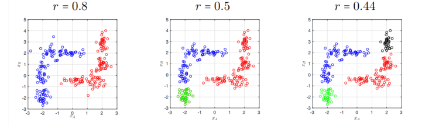

$`r`$ 减小时，原有簇可能分裂为更多簇，也可能有更多样本变为噪声点。

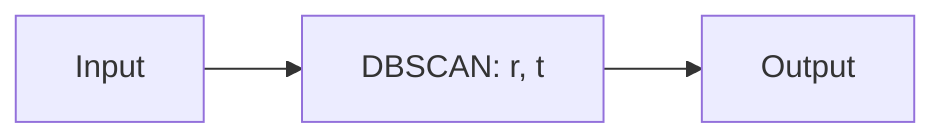
```mermaid
flowchart LR
    I[Input] --> D["DBSCAN: r, t"] --> O[Output]
```

### 8.4 Hierarchical clustering

**定义：** Progressively（逐步）build clustering arrangements at different levels.

生成 dendrogram（树状图）：顶部为整个 dataset，底部为每个样本。可以在不同 levels 探索 dataset。

两种方式：

- **Top-down：** 从上到下，从顶部开始 split。
- **Bottom-up：** 从下到上，从底部开始 merge 两个 clusters。

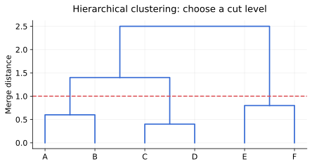

#### 8.4.1 Hierarchical clustering 各层的三种方法

**Single linkage：**

- 比较两个聚类中最近的样本之间的距离。
- 特点：能形成 arbitrary shapes 的聚类。
- 只要两个聚类之间有“最近”的两个点比较近，就可以合并成一个聚类。

**Complete linkage：**

- 比较两个聚类中最远的样本之间的距离。
- 特点：倾向于形成 spherical shapes 聚类。
- 要合并两个聚类，需要看它们之间“最远”的点距离是否够近。

**Group average：**

- 比较两个聚类中所有跨簇样本对之间距离的平均值。
- 特点：通常形成较紧凑的 spherical-shape clusters；相对于极值距离，更 robust to outliers（受 outlier 影响较小）。

#### 8.4.2 总结

- **$`k`$-means：** 适合简单、球形数据，需预设聚类数量。
- **DBSCAN：** 适合复杂、非凸数据，聚类数量由密度参数和数据共同确定。
- **层次聚类：** 适合分析数据的多层次结构和关系。

聚类结果的好坏应结合 application，通过明确的目标和标准来评估，而不是单纯比较算法结果。

## 9. Density estimation

**复习类比：** Test 就是考试，validation 就是复习做模拟卷（用于调参、选模型）。样本数相对于参数过少，过拟合风险较大。

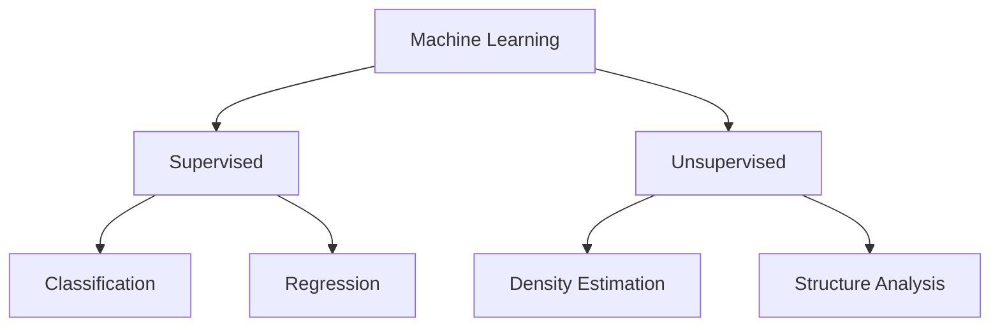
```mermaid
flowchart TD
    M[Machine Learning] --> S[Supervised]
    M --> U[Unsupervised]
    S --> C[Classification]
    S --> R[Regression]
    U --> D[Density Estimation]
    U --> A[Structure Analysis]
```

### 9.1 如何分析数据的 distribution？

Divide and count.

### 9.2 Probability density


```mermaid
flowchart LR
    R[Region] --> M[Model] --> P[Probability]
```

**定义：** Probability densities are models that describe the underlying true distribution of our data.

Probability density 用于通过积分计算样本出现在属性空间（attribute space）某一区域（region）的概率。

- **Joint probability density：** $`p(x_1,x_2)`$，or using vector notation，$`p(\mathbf x)`$。
- **Marginal probability density：** $`p(x_1)`$。

### 9.3 Non-parametric methods for density estimation

非参数方法不假设概率密度（probability density）的具体形状，但需要设置 hyperparameters：

- **Histogram：** 需要设定 bin size，提供分段常数的概率密度估计。
- **Kernel methods：** 需要选择 kernel type 和 bandwidth，生成 smooth 概率密度估计。

**Curse of dimensionality（维度灾难）：**

- Histogram：高维空间可能导致每个箱只有一个样本或没有样本，结果过于稀疏。
- Kernel methods：高维空间中，样本分布可能相互隔离，难以形成可靠的连续估计。

#### 9.3.1 Histogram（直方图）

将 feature space divide 为大小相等的区域，称为 bin。每个 bin 的概率质量用落入其中的样本占总样本的比例表示；密度还需除以 bin 的宽度或体积。

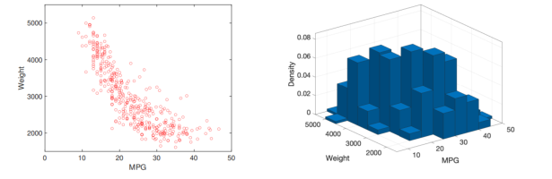

- Bin 太小：密度估计会变得尖锐（spiky）。
- Bin 太大：密度估计会变得平坦（flat），会丢失 underlying structure。

#### 9.3.2 Kernel methods

定义：build an individual density around each sample first and then combine all the densities together.

核方法先为每个样本构建一个单独的密度分布，然后将所有单独的密度分布组合起来，形成整体的密度估计。Individual densities have the same kernel.

例子：每个样本的 kernel 都是 Gaussian 分布，加在一起并归一化。

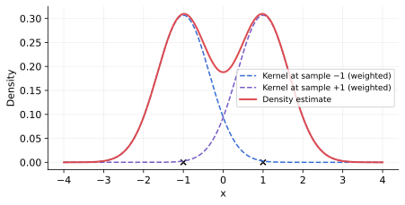

### 9.4 Parametric density estimation

Parametric methods 意味着假设了概率密度的 shape。

#### 9.4.1 Gaussian distribution（高斯分布 / 正态分布）

**一维高斯分布定义：**

```math
p(x_1)=\frac1{\sigma\sqrt{2\pi}}\exp\left[-\frac12\left(\frac{x_1-\mu}{\sigma}\right)^2\right].
```

最大似然估计：

```math
\hat\mu=\frac1N\sum_i x_i,\qquad\hat\sigma^2=\frac1N\sum_i(x_i-\hat\mu)^2.
```

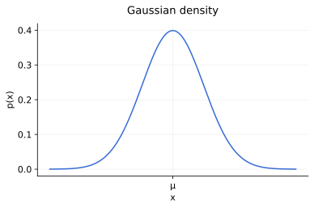

- $`\mu`$：mean。
- $`\sigma`$：standard deviation。

- $`\sigma^2`$：variance。

#### 9.4.2 The central limit theorem

在独立同分布、有限方差等适当条件下，大量随机变量的和经过中心化和标准化后趋近高斯分布。这为高斯分布在 class densities 中的广泛使用提供了部分依据。

#### 9.4.3 Multivariate Gaussian distribution

```math
p(\mathbf x)=\frac1{\sqrt{(2\pi)^K\vert \Sigma\vert }} \exp\left[-\frac12(\mathbf x-\boldsymbol\mu)^T\Sigma^{-1}(\mathbf x-\boldsymbol\mu)\right].
```

```math
\hat{\boldsymbol\mu}=\frac1N\sum_i\mathbf x_i,\qquad \hat\Sigma=\frac1N\sum_i(\mathbf x_i-\hat{\boldsymbol\mu})(\mathbf x_i-\hat{\boldsymbol\mu})^T.
```

**Covariance matrix：**

```math
\Sigma=\begin{bmatrix}\sigma_1^2&\sigma_{12}\\\sigma_{21}&\sigma_2^2\end{bmatrix}
```

是对称的。若 $`x_1,x_2`$ 独立，则 covariance matrix 为 diagonal：

```math
\Sigma=\begin{bmatrix}\sigma_1^2&0\\0&\sigma_2^2\end{bmatrix}.
```

**参数个数：** $`K`$ 维空间中，按矩阵元素总数计为 $`K^2+K`$；考虑 covariance matrix 对称性，独立参数实际为

```math
\frac12K^2+\frac32K=\frac{K(K+1)}2+K.
```

如果 $`x_1,x_2`$ 独立，则有 $`p(x_1,x_2)=p(x_1)p(x_2)`$；在联合高斯前提下，$`p(x_1)`$ 和 $`p(x_2)`$ 本身也为高斯分布。

#### 9.4.4 高维问题

High dimensionality 通常会增大 overfitting 风险，因为样本少、参数多。

Constraints on the covariance matrix and regularisation techniques can be used to stabilise the solution.

#### 9.4.5 Gaussian mixture models（GMM）

- **问题：** Datasets can exhibit more than one mode（clumps），即多个峰。
- **解决方法：** Gaussian mixture models（GMM）。

```math
p(\mathbf x)=\sum_m\pi_m g_m(\mathbf x),\qquad\pi_m\geq0,\quad\sum_m\pi_m=1.
```

$`\pi_m`$ 反映每个高斯分布的重要性。

**参数数量例：** 若是 $`K`$ 维空间，$`p(\mathbf x)=\pi_1g_1(\mathbf x)+\pi_2g_2(\mathbf x)`$。按矩阵元素和两个权重直接存储，数量为 $`2K^2+2K+2`$；考虑两协方差矩阵对称及 $`\pi_1+\pi_2=1`$，独立参数数量为 $`K^2+3K+1`$。

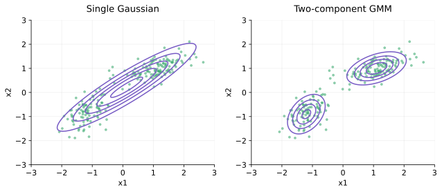

#### 9.4.6 GMM 流程（注意与 k-means 的区别）

使用 **expectation-maximization（EM）algorithm**。

1. 初始化每个高斯分布的均值、协方差和混合系数。

2. **E-step：** 根据当前高斯分布与混合系数，计算每个样本属于不同组的后验概率（responsibilities），保留这些软分配权重。
3. **M-step：** 根据软分配权重重新计算各高斯分布的均值、协方差和混合系数。
4. 使用更新的分布重新计算各样本属于不同组的概率。
5. 重复 E-step 和 M-step，直到收敛。

若最终需要硬聚类标签，再选择概率最大的组。简化版 PPT 上的 GMM 步骤：fit $`K`$ Gaussian densities and then assign each sample to the most likely density.

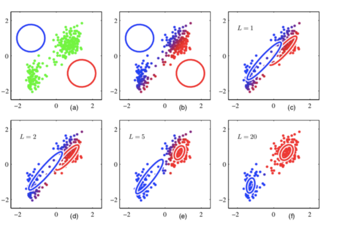

### 9.5 Noise

**定义：** Samples extracted from the same population will always exhibit some level of randomness and deviate from the underlying pattern. Such deviations are known as noise.

### 9.6 Outliers

**定义：** Outliers are samples that deviate markedly from the main population; they may belong to a different population altogether, rather than differing only because of ordinary noise.

如何解决 outliers？

- **Anomaly detection algorithms：** 识别数据中的异常值。根据具体应用决定如何处理，例如确认异常数据后将其排除，以免影响模型。
- **Robustness：** 在设计模型时，使用不同的损失函数处理异常值。例如，通过特定的损失函数降低大偏差（异常值）对整体模型的影响。

### 9.7 Basic anomaly detection algorithm

**核心思想：**

- 用概率模型描述 general pattern，量化样本偏离该模式的程度。
- 如果一个样本所在位置的概率密度很低，意味着它可能是一个异常值。

**实现步骤：** 假设整体模式用概率密度函数 $`p(\mathbf x)`$ 表示（例如多变量高斯分布）。

1. Estimate $`\boldsymbol\mu`$ and $`\Sigma`$ from the dataset.
2. Agree on a threshold value $`T`$.
3. If $`p(\mathbf x_i)\lt T`$, $`\mathbf x_i`$ is an anomaly.

### 9.8 补：Classification，estimating class densities

Classifiers that apply Bayes' rule express posterior probabilities in terms of priors and class densities. A class density $`p(\mathbf x\mid C)`$ describes the distribution of samples in the predictor space for each class $`C`$.

Class densities are obtained using density estimation methods. We need to fit a probability distribution for each class **separately**.

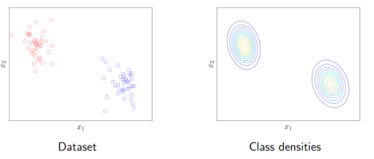

Bayes 比值：

```math
\frac{P(\text{红}\mid\mathbf x)}{P(\text{蓝}\mid\mathbf x)}= \frac{P(\text{红})p(\mathbf x\mid\text{红})}{P(\text{蓝})p(\mathbf x\mid\text{蓝})}.
```

### 9.9 Naive Bayes（朴素贝叶斯）classifiers

在 class densities 中，Gaussian distributions 是常用选择。

- **高维场景下的参数数量：** 若数据有 $`P`$ 个特征（预测变量），每类的均值参数有 $`P`$ 个，协方差矩阵有 $`P^2`$ 个存储元素，总存储数量为 $`P+P^2`$；考虑对称性，独立参数为 $`P+P(P+1)/2`$。

- **朴素贝叶斯的简化假设：** 假设给定类别后，特征（预测变量）之间条件独立，因此每一类的联合密度可表示为各特征条件密度的乘积。这种“朴素”假设极大地简化了模型复杂度。

- **参数减少的优势：** 高斯朴素贝叶斯每类只需要 $`P`$ 个均值参数和 $`P`$ 个方差参数，总参数数目为 $`P+P=2P`$（不含类别先验）。这种简化减少了模型复杂度，从而降低了过拟合风险。

协方差：covariance。

### 9.10 $`k`$-means 对比 GMM fitting

$`k`$-means 可与一种受限 GMM 的硬分配形式联系起来：各高斯分量具有相同的球形协方差 $`\sigma^2I`$，聚类区域偏向 spherical（球形）。仅要求相同的 diagonal covariance matrix 并不足以保证球形，还需各维方差相同。

一般 GMM 可产生 ellipsoidal（椭圆形）聚类。流程：First we fit $`K`$ Gaussian densities and then assign each sample to the most likely density.

### 9.11 Probability densities 应用场景

- **Anomaly detection**。
- **Classification**。
- **Clustering**。

## 10. Principles of Machine Learning Deployment

### 10.1 Lifecycle of a machine learning model


```mermaid
flowchart LR
    P[Plan] --> D[Design data] --> B[Build and test] --> DEP[Deploy]
    DEP --> MA[Maintain] --> MO[Monitor] --> P
```

### 10.2 The data flywheel

在 data flywheel 中，模型是不断迭代的。部署后的新数据被用来改进模型，然后再进行重新部署，形成一个不断优化的循环。

### 10.3 Reproducible deployment

当相同的输入数据被提供时，构建并部署的 machine learning pipelines 能够产生可复现的输出（涉及随机过程时需控制相关随机设置）。

### 10.4 提高模型预测速度的方法

- Faster models can be designed by choosing faster families of models.
- Making models faster（inference 推理 optimisation）。
- Making models smaller（compression，例如 quantisation 量化、pruning 修剪、factorisation 分解）。

- Using more powerful hardware.

### 10.5 Test

- **Canary testing** releases a new model to a limited customer group. It reduces deployment risks and allows for gradual replacement.
- **Shadow testing** deploys a model in parallel, but predictions are logged, not served, to be analysed.
- **A/B testing** is used to compare two or more versions by deploying them simultaneously.

- **金丝雀测试（Canary Testing）：** 将新模型发布给一小部分用户群体。优点：降低部署风险，可以逐步替换旧模型。

- **影子测试（Shadow Testing）：** 新模型与旧模型并行运行，但新模型的预测结果仅被记录，不会直接影响用户。优点：便于分析新模型的表现，而不会干扰实际业务。

- **A/B 测试（A/B Testing）：** 同时部署两个或多个模型版本，将用户随机分配到不同版本中。优点：直接比较不同版本的表现，例如准确性、用户体验、业务转化率。

### 10.6 MLOps（Machine Learning Operations）

**End-to-end machine learning management。** Key features of these platforms include:

- Model versioning and collaborative development.
- Experiment tracking and comparison.
- Code packaging in a reproducible way, for sharing and deploying.
- Model deployment, from ML libraries to model serving and inference platforms.

举个简单的例子，就像盖一座房子，端到端的管理就是从设计、选材、施工到最后的装修和入住，全过程都有人负责和把控。

MLOps（机器学习运维）用于管理整个机器学习生命周期，包括从数据准备到模型构建、部署和监控的全流程管理。

**这些平台的核心功能：**

- 模型版本管理与协作开发：跟踪模型版本，支持团队成员之间的协作。
- 实验追踪与比较：记录实验过程，并比较不同模型的性能。
- 代码打包与可复现性：以可复现的方式打包代码，方便共享和部署。
- 模型部署与推理：从机器学习库到模型服务与推理平台，实现部署和高效运行。

**示例平台：** MLflow 是常见的开源机器学习生命周期管理工具，可用于支持 MLOps 工作流程。

MLOps 平台通过集成多个功能模块，简化机器学习项目的管理，提升团队协作效率和模型部署的可靠性。

## 11. Large Language Models

### 11.1 Language models（LM）

A language model（LM）is a probability distribution over sequences of words.

```math
p(\text{sequence of words}).
```

The LM takes a sequence and returns a probability to assess its goodness. 以下为示意概率：

- $`p(\text{the, mouse, ate, the, cheese})=0.02`$。
- $`p(\text{the, cheese, ate, the, mouse})=0.01`$。
- $`p(\text{mouse, the, the, cheese, ate})=0.0001`$。

### 11.2 LM 和 LLM 文本生成的核心机制

1. Feed the network with a sequence of words and ask it to predict the next word.
2. Output probabilities for each word that we can sample from.
3. Sample and append the sampled word to the existing sequence.

**对应的中文步骤：**

1. 将一个单词序列输入模型，预测下一个单词。
2. 根据模型输出的每个单词概率进行采样。
3. 将采样出的单词加入现有序列中。

实际模型通常以 token 为单位，而不一定以完整单词为单位。

### 11.3 Training LLMs

#### 11.3.1 Pre-training

大型语言模型（LLMs）通过下一 token（例如单词）预测任务进行预训练。这属于 **self-supervised learning（自监督学习）**，训练目标由原始文本自身构造，不需要逐条人工标注。这种训练方式促使模型学习大量语言模式和世界知识。

从头预训练成本较高，通常不会像应用更新那样频繁进行；具体周期取决于项目和资源。

#### 11.3.2 Fine-tuning

微调常用于将预训练模型适配特定应用场景，或改进模型对用户需求的对齐程度。微调相对预训练通常更轻量，可以更频繁地进行，但没有固定的每周或每年周期。使用标注的输入输出样本进行微调，属于 supervised training。

### 11.4 Tokenization

**定义：** Splitting the text into smaller units（tokens）like words, subwords, or characters.

Tokens 是自然语言处理（NLP）的基本构建块。

#### 11.4.1 文本分词方法

**单词分词（Word Tokenization）：** 将文本拆分为独立的单词作为 token。示例：

- 输入文本：`I love food`。
- 输出 tokens：`["I", "love", "food"]`。

**N-gram：** 将连续的 $`n`$ 个 token 组成一个序列单元。以 2-gram 为例：

- 输入文本：`I eat gelato often`。
- 输出：`[("I", "eat"), ("eat", "gelato"), ("gelato", "often")]`。

N-gram 与子词分词不是同一概念；LLM 常用子词 tokenization，将词拆成可复用的子词片段。

#### 11.4.2 流程

1. **Tokenization**。
2. **统计 word frequencies 并建立 vocabulary / dictionary。** The text vocabulary: the set of distinct words（或 tokens）in the training set.
3. **Token-to-index mapping：** 为每个 token 分配一个唯一的索引，用数字表示。
4. **Associate every token with a high-dimensional vector（embeddings）。**

### 11.5 Embeddings

**定义：** A way to represent a token as a vector with learnable parameters.

将每个 token 关联到一个高维向量（high-dimensional vector）。

### 11.6 Attention Is All You Need

Transformer 的引入使得语言模型能够更高效地处理语言任务，并推动了 GPT 和 BERT 等模型的发展，深刻改变了自然语言处理领域。Transformer 是大型语言模型的一种主要架构。

### 11.7 Self-attention mechanism：Transformer 的核心

- **核心思想：** Dynamically focus on the most relevant parts of the input sequence when making predictions about the output sequence.

- **实现方式：** 通过计算输入的加权表示，权重反映每个 token 对当前处理步骤的重要性。更高的权重分配给更相关的 token。

- **结果：** 高效提取有用信息，同时减少无关细节干扰；模型能够更好地捕捉序列中 token 之间的关系和上下文信息。

Attention$`(Q,K,V)`$ 是基于注意力权重对 value 向量的加权表示，其中权重反映每个输入 token 对当前处理步骤的相关性。

#### 11.7.1 Attention（Q, K, V）

- **Queries：** Represent the current token that we are focusing on.
- **Keys：** Represent each token in the input sequence for matching.
- **Values：** The actual information carried by a token.

- $`Q`$ 适合表达 **“要查找什么”**。
- $`K`$ 适合**被匹配查找**。
- $`V`$ **承载内容**。

网络设置可学习的投影，将输入表示变换成 $`Q,K,V`$，学习适合任务的匹配和信息聚合方式。

**结果：** A context-aware representation of the current token.

Transformer 可以捕捉词与词之间复杂的关系和上下文，直接建立相距较远 token 之间的联系；序列位置信息则通过位置编码等机制提供。
