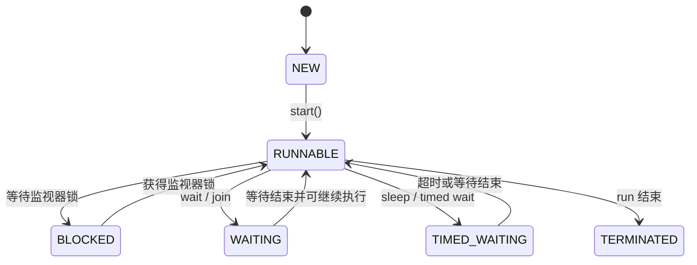

# Middleware · 提纲

## 1. MOM

### 1.1 MOM的定义：

- Message-oriented Middleware (MOM) is a software or hardware that provides a communication channel between heterogeneous applications, platforms and systems by passing messages across between the communicating systems.

- Provides capabilities for sending and receiving messages among distributed systems.

- Provides asynchronous message-based communication between modules and processes.

- Different MOM implementations use different protocols, such as AMQP, MQTT or XMPP; XMPP is not required by all MOM systems.

### 1.2 MOM Architecture：

#### 1.2.1 MOM Architecture的流程


1. A client makes an API call to send a message.

2. Message sends to a destination managed by the provider. The call invokes provider services to route and deliver the message.

3. Once it has sent the message, the client can continue to do other work, confident that the provider retains the message until a receiving client retrieves it.

4. The message-based model, coupled with the mediation of the provider, makes it possible to create a system of loosely-coupled components

#### 1.2.2 Broker的作用？Broker的主要组成？

**作用：**

- The broker is responsible for receiving and sending the message

- Establish connection securely between producer and consumer.

- Maintain persistent data store to reliably send data.

- The broker provides secure connection using encrypted SSL authenticated connection.

- The broker monitors message and connection activities to provide logs of diagnostics information for administrators to access during troubleshooting

**主要组成：** Destination object

### 1.3 两种Messaging Models的定义和对比

#### 1.3.1 Point-to-Point (P2P)（特点：Queues小字）


- It is a one-to-one relationship

- Client sends a message to a particular queue

- The receiver consumes from the appropriate queue; it does not need advance knowledge of when an individual message is sent. Multiple consumers may compete, but one queued message is normally delivered to one consumer at a time.

#### 1.3.2 Publish/Subscribe (Pub/Sub)


- It is either a one-to-many or many-to-many relationships

- The sender and receiver of messages are decoupled.

- Receivers are decoupled from the producer. Whether offline subscribers can receive earlier messages depends on durable subscriptions and message retention; ordinary non-durable subscriptions have a timing dependency.

### 1.4 两种Publish-Subscribe Message的图像、定义、对比

#### 1.4.1 Topics-Based（特点：Topics小字）


- It uses a hierarchical naming scheme.分层命名模式

- It uses specific terms to describe the topics

- Messages are routed according to named topics; the implementation may maintain a queue for each subscription.

- It is too restrictive as it uses specific terms

#### 1.4.2 Content-Based（特点：subscribe，notify，Topic小字）


- Subscriptions specify predicates on message content or properties, rather than only a topic name.

- It is more flexible because consumers can select messages by the values they contain.

### 1.5 MOM Message的组成成分

- **Header**

  consists of information about the message destination, message expiration time, message unique identification, message delivery mode and message time stamp.

- **Properties**

  used to extend the functionality of the header.

  Programmers can create properties to describe the message they want to send or receive.

- **Body**

  the message and how it will be sent and received

## 2. JMS

### 2.1 两种Messaging Domains的图像和定义


#### 2.1.1 Messaging Domains定义：

how message is published and consumed used by the provider and clients.

#### 2.1.2 Point-to-point (PTP) messaging domain：

- based on the message queues, senders and receivers concept.

- A message is sent to a specific queue so that receiving clients can extract the message from the queue that they know have their messages

#### 2.1.3 Publish/Subscribe messaging domain：

- Each message can have multiple clients

- Non-durable subscriptions have a timing dependency. Durable subscriptions can retain messages for a temporarily inactive subscriber, subject to the provider’s retention rules.

### 2.2 两种JMS Message Consumption的定义

#### 2.2.1 Synchronous（同步）

- A subscriber or receiver explicitly fetches the message from the destination by calling the **receive（）** method.

- The receive method can block until a message arrives or can time out if message does not arrive within a specified time limit.

#### 2.2.2 Asynchronous（异步）

- A client can register a message listener with a consumer.

- A message listener is similar to an event listener.

- Whenever a message arrives at the destination, the JMS provider delivers the message by calling the listener's **onMessage** method, which acts on the contents of the message

### 2.3 The JMS API Programming Model


- **sender / publisher：** 都是 producer。

- **receiver / subscriber：** 都是 consumer。

### 2.4 Administered（管理） objects包括哪些？

- **Connection Factory (CF)**

  A connection factory is the object a client uses to create a connection with a provider；

  it encapsulates connection configuration parameter.

- **Destination (D)**

  A destination is the object a client uses to specify the target of messages it produces and the source of message it consumes

### 2.5 Sessions的定义

- A session is a single threaded context for producing and consuming messages.

- use sessions to create message producers, message consumers and messages.

- The older domain-specific APIs use **QueueSession** and **TopicSession**. The unified **Session** API supports both domains. The following code uses the older APIs taught in this course.

### 2.6 JMS代码

#### 2.6.1 发送topic信息


#### 2.6.2 发送queue信息（topic换成queue，publisher换成sender）


#### 2.6.3 同步接收topic信息


#### 2.6.4 异步接受topic信息


## 3. servlet

### 3.1 Tomcat


#### 3.1.1 Model，View，Controller，DD？

- **Model** — `Login.java`
- **View** — `Client.jsp`
- **Controller** — `QueryServlet.java`
- **Deployment Descriptor** — `web.xml`

没有就是none

#### 3.1.2 web.xml是什么？它的作用是什么？

- The XML file is called the Deployment Descriptor

- It is used for setting up configurations，to configure the servlet container and servlet mappings.

- It is used for setting up initial parameters

- It is a configuration file for a program that is deployed in some container /engine.

#### 3.1.3 为什么“web.xml”在WEB-INF目录下？

- It is located directly under the WEB-INF so that it will be safely secure from unauthorized users.

- it is not available to the public

#### 3.1.4 访问各个client.jsp的url？

`http://localhost:8080/Test/client.jsp`，其中 `Test` 是题目应用的 context path，应按实际部署名称填写。

只有应用部署在 `/Test` context path 下时，URL 才需要这一段；根应用没有这一段。

`http://localhost:8080/` 访问根应用（ROOT），不是列出整个 `webapps` 目录。

#### 3.1.5 访问QueryServlet的url？

<http://localhost:8080/Test/query>

只有应用部署在 `/Test` context path 下时，URL 才需要这一段；根应用没有这一段。

### 3.2 使用DD写xml


`http://localhost:8080/welcome`（根应用）；若部署在 `/Test`，则为 `http://localhost:8080/Test/welcome`。

### 3.3 写service（）和destroy（）

**3.3.1 题目：A servlet class MyServlet is created that extendsHttpServlet class，The servlet shall return an HTML page that display the current value of the field myMsg the text in an H1 element.**

```java
import java.io.IOException;
import java.io.PrintWriter;
import javax.servlet.ServletException;
import javax.servlet.http.HttpServlet;
import javax.servlet.http.HttpServletRequest;
import javax.servlet.http.HttpServletResponse;

public class MyServlet extends HttpServlet {
    private String myMsg;
    @Override
    public void init() throws ServletException {
        myMsg = "Hello Servlet!";
    }
    @Override
    protected void service(HttpServletRequest request, HttpServletResponse response)
            throws ServletException, IOException {
        response.setContentType("text/html;charset=UTF-8");
        PrintWriter out = response.getWriter();
        out.println("<h1>" + myMsg + "</h1>");
    }
    @Override
    public void destroy() {
        myMsg = null;
        // Release resources held by this servlet, if any.
    }
}
```

这里使用课程中的 `javax.servlet` API；新 Jakarta Servlet 项目使用 `jakarta.servlet` 包。若只处理 GET 或 POST，通常分别重写 `doGet()` 或 `doPost()`。

#### 3.3.2 题目：Write the required service() method in Java language that called by the server to allow a servlet to handle a POST request. Includes the necessary exception handlers.

```java
@Override
protected void doPost(HttpServletRequest request, HttpServletResponse response)
        throws ServletException, IOException {
    // Handle the POST request here.
}
```

`HttpServlet.service()` 会按 HTTP 方法分派至 `doPost()`。`throws` 声明向容器传播异常；若题目要求本地异常处理，需要再写 `try/catch`。

### 3.4 写 parameter 的 XML，通过 servlet 的 `init()` 方法读取初始化参数


Xml：


`init()`：


## 4. SpringFramework

### 4.1 spring container

#### 4.1.1 spring container有哪几种？

- Spring ApplicationContext Container

- Spring BeanFactory Container

#### 4.1.2 spring container的核心？

Inversion of Control (IoC) ，IoC通过Dependency Injection实现

#### 4.1.3 Dependency Injection的特点？

- Keep classes as independent as possible

- Increase reuse by applying low coupling

- 容易理解，方便测试

#### 4.1.4 spring IoC container（IOC）的作用？

- It provides the control of objects or portions of a program is transferred to a container or framework.

- It gets its instructions on what objects to instantiate, configure, and assemble by reading configuration metadata provided.

- Take control of the flow of a program and make calls to customized code.

#### 4.1.5 configuration metadata有哪些？

- XML
- Java annotations
- Java code

### 4.2 通过ApplicationContext 获取对象

#### 4.2.1 题目：需要getName（）


```java
ApplicationContext appCon = new ClassPathXmlApplicationContext("info.xml");
beanInfo mod = (beanInfo) appCon.getBean("beanInfo");
mod.getName();
```

此处按题目保留类名 `beanInfo`；变量声明类型与转换类型一致。`ApplicationContext` 是接口，实例化的是实现类 `ClassPathXmlApplicationContext`。

#### 4.2.2 题目：不需要getName（）


### 4.3 写bean.xml


#### 4.3.1 根据以上代码写bean的xml，property的name是"name"，value是"Alex"

```xml
<bean id="studentBean" class="org.example.student.StudentBean">
    <property name="name" value="Alex"/>
</bean>
```

#### 4.3.2 加载第一问的xml文件的对象


`bean id` 是配置中指定的标识符，不要求等于类名。示例使用 `studentBean`；`class` 应写类的全限定名。

### 4.4 两种bean

- **Singleton:** one shared instance per bean definition per Spring container. Requests for that bean return this instance. [Spring bean scopes](https://docs.spring.io/spring-framework/reference/core/beans/factory-scopes.html)

- **Prototype:** new bean created each time，same as new Class（）

### 4.5 bean的Dependency Injection (DI)依赖注入的代码


`property` 的 `name` 是要注入的 JavaBean 属性名，`ref` 是另一个 bean 的 id/name；`ref` 不是类名或对象种类。

## 5. AOP

### 5.1 预测输出

```java
public class MainApp {
    public static void main(String[] args) {
        ApplicationContext context =
                new ClassPathXmlApplicationContext("applicationContext.xml");
        Operation op = (Operation) context.getBean("opBean");
        System.out.println("Calling Operation A...");
        op.a();
        System.out.println("Calling Operation B...");
        op.b();
    }
}
```

```java
@Aspect
public class TrackOperation {
    @Pointcut("execution(* Operation.*(..))")
    public void pc() {}

    @After("pc()")
    public void myadvice(JoinPoint jp) {
        System.out.println("Operation terminated successfully.");
    }
}

public class Operation {
    public void a() { System.out.println("Operation A completed."); }
    public void b() { System.out.println("Operation B completed."); }
}
```

这些类分别放入对应文件，并配置 Spring AOP 代理与 aspect bean；示例省略 import 和容器配置。`@After` 在异常退出时也执行，示例输出文字本身不代表目标方法一定成功。

`@After` advice 在匹配的目标方法结束后执行（正常返回或抛异常都会执行）。Pointcut 负责选择连接点，并不是之后执行的业务代码。

所以输出是：


## 6. Thread

### 6.1 线程生命周期

课程常用的五状态概念图将线程分为 New、Runnable/Ready、Running、Blocked/Waiting/Sleeping 和 Dead。Java `Thread.State` API 实际定义六种状态：

| 状态 | 含义 |
| --- | --- |
| `NEW` | 已创建，尚未调用 `start()` |
| `RUNNABLE` | 可以运行或正在 JVM 中执行；也可能等待操作系统资源 |
| `BLOCKED` | 等待进入一个 `synchronized` 监视器 |
| `WAITING` | 不限时等待，例如无超时的 `wait()` 或 `join()` |
| `TIMED_WAITING` | 限时等待，例如 `sleep()`、带超时的 `wait()` |
| `TERMINATED` | `run()` 已结束，不能再次启动 |



- **`sleep()` 与 `wait()`：** `sleep()` 不释放已持有的监视器锁；`wait()` 会释放被调用对象的监视器。
- **`interrupt()`：** 是中断请求，不会直接把线程设成“阻塞”。
- **线程结束：** 正常结束不需要调用 `destroy()`，也不通过它触发垃圾回收。参见 [Thread.State](https://docs.oracle.com/en/java/javase/17/docs/api/java.base/java/lang/Thread.State.html)。

### 6.2 Visibility和Race Conditions

#### 6.2.1 什么是Visibility？

- 在Multithreaded Application （多线程应用）中，当threads是在non-volatile变量上操作时，每个thread可能会把变量从main memory复制到CPU cache中，这样可以提高性能。

- 每个线程可能在不同的CPU上运行，这意味着每个线程可以将变量复制到不同CPU的缓存中。

- 对于non-volatile变量，无法保证JVM何时将数据从主内存读取到CPU缓存中，或者何时将数据从CPU缓存写回主内存。

- operation is not thread-safe

#### 6.2.2 如何解决Visibility？

Declare the shared variable `volatile` when only visibility/order guarantees are needed, or use the same lock for reading and writing. `volatile` does not make compound operations such as `count++` atomic.

#### 6.2.3 什么是Race Condition？

- 两个或多个threads同时access共享数据，并尝试同时修改它时就会发生这种情况。

- 线程access（访问）共享数据的顺序是unknown的

- 因此，数据的修改结果取决于thread scheduling algorithm，比如both threads are racing to access/change the data.

- operation is not thread-safe

#### 6.2.4 如何解决Race Condition？

Make operations atomic，Intrinsic lock（Synchronized）

### 6.3 使用Intrinsic lock进行Synchronized的代码

#### 6.3.1 保证线程安全、原子的代码

问题：Improve the code to ensure the thread-safe and atomic operation. 并写出对应的main方法。


方法1：Synchronized Block


方法2：Synchronized Method


Main方法：


### 6.4 mutual exclusion和cooperation

#### 6.4.1 JAVA监视器有哪两种thread synchronization方法？

mutual exclusion、cooperation

#### 6.4.2 什么是mutual exclusion？

- Supported by object locks

- Enable multiple threads to independently work on shared data without interfering with each other.

#### 6.4.3 什么是cooperation？

- Supported by the wait and notify methods of class Object

- Enable threads to work together towards a common goal.

### 6.5 notify和notifyAll

#### 6.5.1 In your own words, explain the differences of notify () and notifyAll () in Java's monitor.

- **`notify()`：** selects one thread waiting on this object’s monitor.
- **`notifyAll()`：** wakes all such waiting threads.
- **Monitor ownership：** a notified thread must reacquire the same monitor before continuing. Neither method immediately transfers the lock.
- **Condition check：** test the wait condition in a `while` loop. [Object.wait / notify](https://docs.oracle.com/en/java/javase/17/docs/api/java.base/java/lang/Object.html)

### 6.6 代码解释和输出预测

**代码示例**

```java
public class ThreadA {
    public static void main(String[] args) {
        ThreadB b = new ThreadB();
        System.out.println("Main thread initializing..."); // 1
        synchronized (b) {
            b.start();
            System.out.println("Thread B started."); // 2
            try {
                System.out.println("Waiting for Thread B to complete..."); // 3
                while (!b.finished) {
                    b.wait();
                }
            } catch (InterruptedException e) {
                Thread.currentThread().interrupt();
                return;
            }
            System.out.println("Total is: " + b.total);
        }
    }
}

class ThreadB extends Thread {
    int total = 0;
    boolean finished;

    @Override
    public void run() {
        synchronized (this) {
            try {
                for (int i = 0; i < 5; i++) {
                    total += i;
                }
            } finally {
                finished = true;
                this.notify();
            }
        }
        System.out.println("Thread completed.");
    }
}
```

1. `ThreadB b = new ThreadB()`：创建线程对象，此时线程尚未启动。
2. `b.start()`：启动新线程；新线程尝试进入 `synchronized (this)` 时，需要取得对象 `b` 的监视器锁。
3. `synchronized (b)`：主线程持有对象 `b` 的监视器锁。它只排斥需要同一把锁的其他临界区，不禁止所有代码访问对象 `b`。
4. `b.wait()`：暂停的是调用它的**主线程**，不是线程 `b`。主线程释放 `b` 的监视器，等待通知、中断或虚假唤醒，然后重新取得锁、检查 `finished`。
5. 子线程中的 `synchronized (this)` 与主线程锁的是同一个对象 `b`。
6. `this.notify()`：通知在 `b` 的 wait set 中等待的线程；主线程须等子线程退出同步块并重新取得锁后才能继续。

正常执行时前三行顺序固定：

```text
Main thread initializing...
Thread B started.
Waiting for Thread B to complete...
```

之后会输出 `Thread completed.` 和 `Total is: 10`，但**这两行的相对顺序不确定**，因为 `Thread completed.` 位于子线程的同步块之外。不能仅根据 `notify()` 的位置断定它一定先于主线程的输出。

#### 6.6.1 累加 0 到 99 的例子

```java
class ThreadA {
    public static void main(String[] args) {
        ThreadB b = new ThreadB();
        synchronized (b) {
            b.start();
            System.out.println("Waiting for b to complete...");
            while (!b.finished) {
                try {
                    b.wait();
                } catch (InterruptedException e) {
                    Thread.currentThread().interrupt();
                    return;
                }
            }
            System.out.println("Total is: " + b.total);
        }
    }
}

class ThreadB extends Thread {
    int total;
    boolean finished;
    @Override
    public void run() {
        synchronized (this) {
            for (int i = 0; i < 100; i++) {
                total += i;
            }
            finished = true;
            notifyAll();
        }
    }
}
```

```text
Waiting for b to complete...
Total is: 4950
```

使用条件标志和 `while`，可以避免先通知后等待造成的遗漏通知，也能正确处理虚假唤醒。

## 7. 网络安全

### 7.1 网络安全

#### 7.1.1 List the FOUR ways used to secure the web services.

- **Authentication**

  This is a process that you can use username and passwords or other means to allow users to login to the system of the company

  

- **Authorisation**

  This feature consists of policies that allow users that have login the system to be able to use the services in the company’s computer systems

  

- **Data Integrity**

  This is the ability of computer systems to ensure that data at rest and in transit is not changed or manipulated by unauthorised users and that the originality of data must be preserved without anybody tampering with it in an unauthorised way.

  - Protect messages against unauthorized modification using a message authentication code, authenticated encryption or a digital signature, as appropriate.
  - Verify signatures with the corresponding public key.
  - Authenticated timestamps, nonces or sequence numbers help reject replayed messages only when the receiver validates freshness and enforces replay checks.
  - Exchange security tokens only through an appropriately protected channel.

- **Data Confidentiality**

  This is the ability of computer systems to ensure that data can only be made available or accessible or seen by only the intended audience or user of the data, meaning data should not find its way into the wrong hands.

  

#### 7.1.2 Web Security Vulnerabilities

| Vulnerability | 含义与防护要点 |
| --- | --- |
| Injection Flaws（注入漏洞） | 不可信数据进入查询或命令语法；使用参数化查询、上下文适当的处理及最小权限 |
| Broken Authentication（认证缺陷） | 认证或会话管理存在漏洞，例如会话凭据泄露；采用成熟认证机制、安全会话管理与适当的多因素认证 |
| Cross-Site Scripting（XSS） | 不可信内容在用户浏览器中成为可执行脚本；按输出上下文编码，必要时净化 HTML |
| Insecure Direct Object Reference（IDOR） | 修改对象标识符即可越权访问别人的对象；服务器必须对每次对象访问做授权检查 |
| Security Misconfiguration | 默认密码、过宽权限或不安全配置；维护安全基线并自动化检查 |
| Sensitive Data Exposure | 敏感数据受到不必要暴露；限制收集/访问并使用适当的传输与静态加密 |
| Access Control Issues | 缺失或错误授权；在服务器端集中、逐请求地实施访问控制 |
| Cross-Site Request Forgery（CSRF） | 借助已登录用户浏览器的凭据发起非预期操作；使用防 CSRF token 等措施 |
| Unvalidated Redirects and Forwards | 未校验的目标地址被用于重定向或转发；采用固定映射、允许列表及授权检查 |

#### 7.1.3 Injection Flaws是什么？解决方法是什么？

1. Injection occurs when untrusted input is interpreted as part of a command or query, such as SQL or LDAP, instead of being treated only as data.
2. Attackers may change query meaning, access or modify unauthorized data, or execute unintended commands.
3. Use parameterized SQL queries/prepared statements; use the correct parameterization or context-specific escaping for other interpreters. Validate input with allow-lists where appropriate and apply least privilege.
4. Test input handling thoroughly. Encryption and browser updates do not by themselves prevent injection. [OWASP SQL Injection Prevention](https://cheatsheetseries.owasp.org/cheatsheets/SQL_Injection_Prevention_Cheat_Sheet.html)

#### 7.1.4 Cross Site Request Forgery (CSRF)是什么？解决方法是什么？

1. CSRF tricks an authenticated user’s browser into sending an unwanted request to a trusted site, often using automatically attached cookies.
2. The forged request may change account settings or perform another action using the victim’s authority. It does not require a fake browser or a compromised bank website.
3. This can be understood as a “Confused Deputy” problem（困惑的代理问题）.
4. Use anti-CSRF tokens, suitable `SameSite` cookies and Origin/Referer validation for state-changing requests. Avoiding suspicious links is useful user practice but is not a sufficient server-side defense. [OWASP CSRF Prevention](https://cheatsheetseries.owasp.org/cheatsheets/Cross-Site_Request_Forgery_Prevention_Cheat_Sheet.html)

#### 7.1.5 Cross Site Scripting (XSS)是什么？解决方法是什么？

1. XSS occurs when attacker-controlled content executes as script in another user’s browser under the vulnerable site’s origin.
2. It can read exposed data, perform actions as the user, or steal cookies that are accessible to JavaScript.
3. Apply output encoding appropriate to the HTML, attribute, URL or JavaScript context; sanitize HTML when user-supplied HTML is intentionally supported.
4. Prefer safe DOM APIs and use Content Security Policy as an additional defense. Legitimate HTML can be returned; the objective is to prevent untrusted content from becoming executable code. [OWASP XSS Prevention](https://cheatsheetseries.owasp.org/cheatsheets/Cross_Site_Scripting_Prevention_Cheat_Sheet.html)

#### 7.1.6 Security Misconfigurations是什么？解决方法是什么？

- Using default passwords and keys on production systems

- Using outdated applications

- Automate security configurations

#### 7.1.7 什么是DDoS？

- DDoS stands for Distributed Denial of Service.

- The attacker of the computer system makes the system unavailable for use to users by flooding the network or website with network traffic requests that exceeds the capacity of the network or website to handle, making the system very slow and unresponsive to users.

- The attacker’s intention is not to steal data, but to deny users from using the system.

#### 7.1.8 如何Mitigate（减轻）DDoS？

- Use Load Balancing to spread the increase in load

- Use AWS Shield (Standard and Advanced)

- Use Firewall for DoS

- Use Web Application Firewall for layer 7 attacks

#### 7.1.9 什么是DoS？

DoS（Denial of Service）指使服务不可用的攻击；DDoS 是由分布式来源发起的 DoS。单一来源的 DoS 也不一定只表现为一个固定 IP。

#### 7.1.10 如何解决Dos？

For identifiable abusive sources, IP filtering can help. Also use rate limits, capacity protection, application-layer controls and upstream mitigation as appropriate; IP blacklisting alone is not a general solution.

### 7.2 Symmetric and Asymmetric Encryption

#### 7.2.1 什么是Cryptography？

Cryptography is used to encrypt data (make data nonreadable to human beings) and decrypt data (make data readable to human beings)

#### 7.2.2 什么是 Symmetric Encryption（Secret-Key Cryptography）？

Symmetric Encryption is the cryptographic process of encrypting data (make data nonreadable to human beings) and decrypt data (make data readable to human beings) using a single key (one key only)

#### 7.2.3 什么是Asymmetric Encryption？（什么是Public Key Cryptography？）

- Public Key Cryptography, sometimes known as asymmetric cryptography, is an encryption and decryption algorithm that uses keypairs.

- Is the cryptographic process of encrypting data (make data nonreadable to human beings) and decrypt data (make data readable to human beings) using a key pair (2 keys).

- For confidentiality, other users encrypt with the recipient’s public key, and the recipient decrypts with the private key. Knowing the public key does not let everyone decrypt the files. Digital signatures instead use a private key to sign and a public key to verify.

## 8. 物联网协议

### 8.1 IEEE 802委员会将Data Link Layer细分为two sub-layers

- **Media-Access Control (MAC) layer**

  This is located on top of the physical layer and implements the methods used to have access to the network.

- **Logical Link Control (LLC) layer**

  LLC provides the interface to upper-layer protocols and identifies/multiplexes those protocols; MAC handles media access and MAC framing/addressing.

协议看笔记：

LDAP、IMAP、NTP、SSH、MQTT、UDP


### 8.2 UDP — User Datagram Protocol

- A connectionless transport-layer protocol in the Internet protocol suite.
- Provides datagrams without guaranteeing delivery, ordering or duplicate suppression.
- Has a checksum for detecting corruption; it does not retransmit lost data or repair errors itself.
- Useful for real-time audio/video or applications that implement their own reliability and congestion control.
- Its protocol overhead is lower than TCP’s, but it is not guaranteed to be faster for every workload. [RFC 768](https://www.rfc-editor.org/rfc/rfc768.html)


### 8.3 SSH — Secure Shell

- Provides encrypted remote login and communication on Unix/Linux and other systems, including Windows.
- Authenticates servers with host keys; users may authenticate with public keys, passwords or other supported methods. It does not always require a certificate-based PKI.
- Uses TCP port 22 by default.
- PuTTY and WinSCP support SSH. VNC is a separate protocol and may be tunneled over SSH.


TLS commonly uses X.509 certificates for authentication, and can also use pre-shared keys. X.509 is a certificate standard, not a cryptographic algorithm; TLS is not generally “based on Kerberos”. SSL versions are obsolete. [TLS 1.3](https://www.rfc-editor.org/rfc/rfc8446.html)

### 8.4 NTP — Network Time Protocol

- Synchronizes computer clocks; it does not configure local time zones.
- Estimates clock offset and network delay to improve time accuracy in distributed systems.
- Supports applications that require accurate timestamps.
- Unauthenticated NTP can be vulnerable to spoofing and time manipulation; authenticated mechanisms such as NTS address this risk. [NTPv4](https://www.rfc-editor.org/rfc/rfc5905.html)


### 8.5 FTP / SFTP

- FTP (File Transfer Protocol) transfers files over TCP using a client–server model; plain FTP does not encrypt credentials or data.
- FTPS secures FTP using TLS.
- SFTP (SSH File Transfer Protocol) is a different file-transfer protocol that runs over SSH, rather than simply being FTP with encryption.

### 8.6 MQTT

- A lightweight messaging protocol based on publish/subscribe, historically called MQ Telemetry Transport.
- Commonly runs over TCP/IP and can use TLS for transport security.
- Designed for constrained devices, low bandwidth and unreliable networks.
- Publishers send to a broker, which routes messages to matching subscribers.
- Facebook Messenger is a historical application example; MQTT is widely used in IoT.

### 8.7 DDS — Data Distribution Service

- An OMG standard for data-centric publish/subscribe middleware, including machine-to-machine communication.
- Supports data exchange among heterogeneous publishers and subscribers with configurable Quality of Service (QoS).
- Designed for real-time, dynamic data exchange; it can be used in distributed, embedded and cloud systems.

### 8.8 RTPS — Real-Time Publish-Subscribe Protocol

- A wire protocol used to make DDS implementations interoperable across vendors.
- Supports real-time publish/subscribe communication among distributed participants.
- Carries discovery and user data and supports the communication mechanisms needed for DDS QoS.
- Its use is not restricted to cloud systems, and DDS QoS policies are not simply cloud SLA metrics. [OMG DDSI-RTPS](https://www.omg.org/spec/DDSI-RTPS/)

### 8.9 IP-Based Protocols有哪些？


### 8.10 REST为什么rigid？

REST全称Representational State Transfer

- All interfaces must be uniform based on the concept of exchanging resources between the client and the server.

- Communication should be stateless and each request from client to server must contain all the information needed (data, metadata, etc)

### 8.11 HTTP结构？

HTTP全称hypertext Transfer protocol


### 8.12 什么是HTTPS？

hypertext Transfer protocol secure

将SSL（TLS）和HTTP结合，用于加密传输、身份认证

### 8.13 Constrained devices的特点？

Low power, storage，memory，processing power

Some constrained devices do not use IP directly, but others support IP through technologies such as 6LoWPAN; lacking an IP address is not a defining feature.

### 8.14 Constrained Device Protocols有哪些？


### 8.15 Describe TWO IoT protocols that are commonly used in buildings and home automation applications.

- Zigbee: Zigbee is a mesh network protocol that was designed for buildings and home automation applications.

- Z-Wave: Z-Wave is a wireless mesh network communication protocol built on low-power radio frequency technology for buildings and home automation applications.

- Wifi：WiFi is particularly well suited within LAN environments, with short- to medium-range distances. And it offers fast data transfer and is capable of processing large amounts of data.

### 8.16 为传感器设计的协议？

- CoAP (Constrained Application Protocol)

- CoAP is an application layer and web-based protocol designed for constrained devices like sensors.

- CoAP is similar to the Hypertext Transfer Protocol (HTTP) in its request/response model and supports a Representational State Transfer (REST) style.

- Sensors have a small memory and limited processing power（处理能力弱）

### 8.17 低功耗的协议？

6LoWPAN、CoAP、LoRaWAN

## 9. 卡夫卡

可以把 event 类比为一条记录，把 topic 类比为某类记录的集合；但 Kafka topic 是分区日志，不是关系数据库表。

### 9.1 Apache Kafka’s Events

- An event in Kafka is any type of action, incident, or change that's identified or recorded by software or applications.

- Events are stored as records with a key (which may be null), a value and metadata. A key need not be unique; a record is identified within the log by its topic, partition and offset.

- internal is bytes，external is structured objects in your language type.

- Kafka translation between language types and internal bytes using serialization and deserialization.

### 9.2 Apache Kafka’s Topics

- A topic is a log of events.

  - **Durability:** Log is durable

  - **Retention:** Every topic can be configured to expire data after it has reached a certain age，from as short as seconds to as long as years or even to retain messages indefinitely

  - **Storage:** files stored on disk

- The Middleware Developer creates different topics to hold different events（received，processed，sent，stored，etc.）

- The topics arrange data like a table in a relational database to organize the data into different types from different sources.

- Apache Kafka's most fundamental unit of organization is the topic.

### 9.3 Apache Kafka’s Partitions

- Partitioning takes the single topic log and breaks it into multiple logs, each of which can live on a separate node in the Kafka cluster.

- This way, the work of storing messages, writing new messages, and processing existing messages can be split among many nodes in the cluster.

How：

- If no key or explicit partition is provided, the producer’s partitioner selects a partition. Modern default producers use sticky/batch-oriented behavior rather than necessarily alternating every record round-robin. Ordering is guaranteed within a partition, not across an entire multi-partition topic. [Kafka producer configuration](https://kafka.apache.org/35/generated/producer_config.html)

- With the usual key-based partitioner and a fixed partition count, the key hash selects the partition, so the same key is routed to the same partition. Changing the partition count or partitioner can change the mapping; Kafka preserves the order recorded within each partition.

### 9.4 例题

**9.4.1 Describe how the Middleware Developer will ensure that the different data from the different sources will be well organised (weather, mortgage rates, etc should be separate) and durable (last for a long time) using Kafka.**

默写event、topic

- The Middleware Developer can use events, topics, and logs features in Kafka to manage and organize the different data.

- The IoT company is using sensors to perform actions like receive, process and sent which the Middleware Developer can capture as events that are identified by key/value pairs to store them as logs in Kafka.

- The Middleware Developer should create different topics to hold different events (received, processed, sent, stored, etc.)

- The topics arrange data like a table in relational database to organize the data（into weather, mortgage rates, inflation rates, currency exchange rates, etc.）when they are received, processed, sent and stored (events)

- A topic is also a log of events and logs store data in a durable way in Kafka, so the Middleware Developer can use logs to store data durably

#### 9.4.2 Describe how Apache Kafka organizes different data from different sources.

默写：event、key、topic、partition、log、file system

- Create different topics for different sources. 例如，如果数据来自电商平台，Kafka 会为这些数据创建一个“电商”主题；如果数据来自天气相关的来源，它会为这些数据创建一个“天气”主题。

- Before producing data, determine a method for generating event keys.

- Events are stored as records with a key (which may be null), a value and metadata. A key need not be unique; a record is identified within the log by its topic, partition and offset.

- The keys of data records determine the partitioning of data

- A topic is a log of events，so it is durable.

- The Middleware Developer creates different topics to hold different events（received，processed，sent，stored，etc.）

- Each topic is divided into partitions to enable parallel processing and scalability.

- The topics arrange data like a table in a relational database to organize the data into different types from different sources.

- With the usual key-based partitioner and a fixed partition count, the key hash selects the partition, so the same key is routed to the same partition. Changing the partition count or partitioner can change the mapping; Kafka preserves the order recorded within each partition.

- **File system:** Kafka is Stored on the File System

**9.4.2.1 Describe how Apache Kafka Streams simplifies middleware application development that enables data locality, elasticity, scalability, high performance and fault tolerance system./ Architecture of Apache Kafka**

默写Architecture of Apache Kafka

- Kafka Streams simplifies application development by building on the Kafka producer and consumer libraries and leveraging（利用）the native capabilities of Kafka to offer data parallelism, distributed coordination, fault tolerance, and operational simplicity.

- The messaging layer of Kafka partitions data for storing and transporting it.

- Kafka Streams partitions data for processing it.

- In both cases above, this partitioning is what enables data locality, elasticity, scalability, high performance, and fault tolerance.

**9.4.2.2 Describe the steps and sequential order of interacting components that enable Middleware Developers to develop highly scalable message-driven applications using Apache Kafka clusters.**

默写Architecture of Apache Kafka、topic

- The messaging layer of Kafka partitions data for storing and transporting it.

- Kafka Streams partitions data for processing it.

- Apache Kafka's most fundamental unit of organization is the topic. We need to organize the events into topics.

#### 9.4.3 How Apache Kafk achieve fault tolerance？

默写Replication

- Replication is used to copy data to different Kafka brokers to mitigate against any failure

- Whether brokers are bare metal servers or managed containers, they and their underlying storage are susceptible to failure, so we need to copy partition data to several other brokers to keep it safe.

- Those copies are called follower replicas, whereas the main partition is called the leader replica.

- When you produce data to the leader—in general, reading and writing are done to the leader—the leader and the followers work together to replicate those new writes to the followers.

- This happens automatically

#### 9.4.4 Describe Apache Kafka and how it ensures large scale scalability in large increase of workloads.

默写Partitions、consumer group

Consumer group：

- Kafka uses multiple consumers to consume multiple messages simultaneous for better performance.

- You can use just one consumer if the producer is not generating messages frequently

- Kafka uses consumer groups to consume different messages for performance.

- Kafka consumers are part of a consumer group.

- When multiple consumers form a consumer group to consume topics, each consumer will receive messages from different partitions.

### 9.5 Brokers

- Kafka Brokers are the computer machines (physical or virtual machines/containers) in a Kafka network cluster.

- Replication is used to copy data to different Kafka brokers to mitigate against any failure

- Each broker hosts some set of partitions and handles incoming requests to write new events to those partitions or read events from them.

### 9.6 Replication——fault tolerance

- Whether brokers are bare metal servers or managed containers, they and their underlying storage are susceptible to failure, so we need to copy partition data to several other brokers to keep it safe.

- Those copies are called follower replicas, whereas the main partition is called the leader replica.

- When you produce data to the leader—in general, reading and writing are done to the leader—the leader and the followers work together to replicate those new writes to the followers.

- This happens automatically

- Replication is used to copy data to different Kafka brokers to mitigate against any failure

### 9.7 Producer代码

```java
// props must configure bootstrap.servers and matching key/value serializers.
try (KafkaProducer<String, Payment> producer = new KafkaProducer<>(props)) {
    for (long i = 0; i < 10; i++) {
        String orderId = "id" + i;
        Payment payment = new Payment(orderId, 1000.00d);
        ProducerRecord<String, Payment> record =
                new ProducerRecord<>("transactions", orderId, payment);
        producer.send(record, (metadata, error) -> {
            if (error != null) {
                error.printStackTrace();
            }
        });
    }
}
```

`transactions` 是 topic 名，`orderId` 是应用选定的 key，`payment` 是 value。Key 可以重复；`send()` 是异步调用，不直接声明抛出受检的 `InterruptedException`。

### 9.8 Consumer代码

```java
// props must configure the group and matching key/value deserializers.
try (KafkaConsumer<String, Payment> consumer = new KafkaConsumer<>(props)) {
    consumer.subscribe(Collections.singletonList(TOPIC));
    while (true) {
        ConsumerRecords<String, Payment> records =
                consumer.poll(java.time.Duration.ofMillis(100));
        for (ConsumerRecord<String, Payment> record : records) {
            String key = record.key();
            Payment value = record.value();
            System.out.printf("key = %s, value = %s%n", key, value);
        }
    }
}
```

### 9.9 The mechanism manage and convert the internal data (machine readable) to external data (human readable) formats？

The Middleware Developer can use the deserialization features of Apache Kafka to convert internal data (machine readable eg bytes) from sensors to external data (human readable eg JSON) formats.

### 9.10 What Type of Applications is Apache Kafka

message oriented middleware

（JMS 是消息 API 规范，消息队列产品可以提供 MOM；SMS 是短信服务，不能直接把三者视为同一种中间件产品。）

## 10. OSGI

### 10.1 OSGi Architecture（图要记住）


- **Bundles**

  They are the OSGi components written by Java developers based on the OSGi specifications

- **Services**

  This layer connects each bundle dynamically through a publish find-bind model for POJOs(Plain Old Java Objects)

- **Services Registry**

  This is the API for management services that register services and tracks down services based on their unique service references

- **Life-Cycle**

  The application programming interface (API) that allows bundles to be remotely installed, stopped, started, updated, uninstalled on the fly without restarting the services

- **Modules**

  This layer defines how a bundle can import and export codes

- **Security**

  The security layer that handles authentication, authorisation and protection of bundles

- **Execution Environment**

  This layer defines the **methods** and **classes** that are available for a specific platform (JVM, OS, etc.)

- **Java Virtual Machine (JVM)**

  A Java virtual machine (JVM) executes JVM bytecode. Java and other languages that target JVM bytecode can run on it. Native C/C++ programs and ordinary C# assemblies do not automatically run on a JVM; native code can be accessed through mechanisms such as JNI. The JVM specification defines the execution model that supports portability across platforms.

- **Component**

  - A web resource, web service, module or software package that communicates with other interacting components using its interface

  - Modular and cohesive implementation of services

### 10.2 Advantage/features of OSGi

- Ease of deployment and dynamic updates

- It is secure for distributed and cloud infrastructures

- Reduces complexity for developers as bundles hide their implementation details and developers just need to use their APIs

- The component model of OSGi allows reuse of the modules and bundles and this saves the time of developers as the cost of rewriting codes for the company

- Adopts a dynamic addition and removal of bundles, hence is a real-world model

- Its development and maintenance is well supported by companies such Oracle, IBM, Samsung, RedHat and Ericson

### 10.3 OSGI应用场景

- Mobile phones

- Cloud computing

- Automobiles

- Industrial automation

- Application servers

## 11. Client/Server Network Programming

### 11.1 根据server的IP address和server的port写Client的代码（client side）

**11.1.1 Write a public client Java class program named NetworkClient that makes request to a server with IP address 100.0.1.0 at port 8080. Use the Java Socket class to make the connection and to read data using BufferedReader and InputStreamReader Java classes.**

```java
import java.net.Socket;
import java.net.ConnectException;
import java.io.BufferedReader;
import java.io.InputStreamReader;
import java.io.IOException;
import java.nio.charset.StandardCharsets;

public class NetworkClient {
    public static void main(String[] args) {
        try (Socket socket = new Socket("100.0.1.0", 8080);
             BufferedReader reader = new BufferedReader(new InputStreamReader(
                     socket.getInputStream(), StandardCharsets.UTF_8))) {
            System.out.println(reader.readLine());
        } catch (ConnectException e) {
            System.err.println("Could not connect to the server.");
        } catch (IOException e) {
            e.printStackTrace();
        }
    }
}
```

注意：class name可能会变


### 11.2 根据client代码中的port写Server的代码（server side）

```java
import java.net.ServerSocket;
import java.net.Socket;
import java.io.BufferedWriter;
import java.io.OutputStreamWriter;
import java.io.IOException;
import java.nio.charset.StandardCharsets;

public class NetworkServer {
    public static void main(String[] args) {
        try (ServerSocket server = new ServerSocket(8080)) {
            while (true) {
                try (Socket client = server.accept();
                     BufferedWriter writer = new BufferedWriter(new OutputStreamWriter(
                             client.getOutputStream(), StandardCharsets.UTF_8))) {
                    writer.write("Hello Network World!");
                    writer.newLine();
                    writer.flush();
                } catch (IOException e) {
                    e.printStackTrace();
                }
            }
        } catch (IOException e) {
            e.printStackTrace();
        }
    }
}
```

注意：客户端连接的**目标端口**必须等于服务器监听端口；客户端自己的本地端口通常由系统分配，两者不要求相同。


服务器通过 `accept()` 返回的新 `Socket` 与当前客户端通信；原监听 `ServerSocket` 的端口仍为 8080，可以继续接受其他客户端。

### 11.3 steps in Using URLs in Networking

#### 11.3.1 Describe the FOUR steps in using the Uniform Resource Locator (URL) to write and implement a Java networking program.

1. **Create a URL object**

   - Within your Java programs, you can create a URL object that represents a URL address eg <https://qmul.ac.uk>.

   - The URL object always refers to an absolute URL but can be constructed from an absolute URL, a relative URL, or from URL components.

2. **Reading/Retrieving from a URL**

   You can read from a URL using the openStream() method.

3. **Connecting to a URL**

   - If you want to do more than just read from a URL, you can connect to it by calling openConnection() on the URL.

   - The openConnection() method returns a URLConnection object that you can use for more general communications with the URL.

4. **Reading from and Writing to a URL Connection**

   This ensures how to connect to a URL and get results back.

#### 11.3.2 写代码


### 11.4 flush()

#### 11.4.1 sometimes nothing will be sent to the socket (and so to the server) even though you have called write，如何解决？

- call `flush()` on the buffered output stream or writer

- force data in the buffer to be written to the socket

#### 11.4.2 如何实现every time you call println() it automatically sends the data（⾃动flush的办法）

new PrintWriter (socket.getOutputStream(), true)

### 11.5 distributed application Issues in Enterprise Computing

- **Load balancing**
- **Security**
- **Threading**
- **Systems Management**
- **Back-end integration**
- **Logging and auditing**

## 12. Microservices and Serverless Applications

### 12.1 Microservices

#### 12.1.1 Microservices use which type of architecture？

service-oriented architecture

#### 12.1.2 Microservices的定义

- Microservices are software services that are small in size, messaging-enabled, autonomously developed, independently deployable, decentralized and built and released with automated processes.

- is a variant of the service-oriented architecture (SOA)，which arrange an application as a collection of loosely coupled services.

- Microservices are an architectural and organizational approach to software development where software is composed of small independent services that communicate over well-defined APIs.

- These services are owned by small, self-contained teams.

- Microservices architectures make applications easier to scale and faster to develop, enabling innovation and accelerating time-to-market for new features.

#### 12.1.3 Benefits of Microservices

- **Modularity（模块化）**

  makes the application easier to understand, develop, test, and become more resilient（适应） to architecture erosion（侵蚀）.

- **Scalability**

  Since microservices are implemented and deployed independently of each other, i.e. they run within independent processes, they can be monitored and scaled independently.

- **Integration of heterogeneous（异构） and legacy（传统） systems**

  microservices is considered as a viable mean for modernizing existing monolithic software application.

- **Distributed development**

  it parallelizes development by enabling small autonomous teams to develop, deploy and scale their respective services independently，and facilitates continuous integration, continuous delivery and deployment.

#### 12.1.4 支持微服务开发与运行的服务示例

- **AWS Cloud9**

  Cloud-Based IDE、Built-In Tools、No Setup Needed、Access Anywhere、Serverless Development、Team Collaboration

  AWS Cloud9 is a cloud-based integrated development environment (IDE) that lets you write, run, and debug code in a browser. It is development tooling, not a serverless execution service. Since July 25, 2024, it has been unavailable to new customers; existing customers can continue using it. [AWS Cloud9 history](https://docs.aws.amazon.com/cloud9/latest/user-guide/history.html)

  

  

- **AWS Lambda**

  Serverless Compute、Pay Per Use、High Availability、Event Triggers

  AWS Lambda lets you run code without provisioning or managing servers. You pay only for the compute time you consume.

  

- **AWS SQS**

  Message Queuing、Simplifies Middleware、Reliable Messaging

  AWS SQS is a fully managed message queuing service that enables you to decouple and scale microservices, distributed systems, and serverless applications.

- **AWS SNS**

  Messaging Service、A2A Pub/Sub、A2P Communication

  AWS SNS is a fully managed messaging service for both application-to-application (A2A) and application-to-person (A2P) communication.

### 12.2 Serverless Applications

#### 12.2.1 Serverless Applications的定义

- Serverless Applications are applications and services that automatically provisions your servers for you when you run an application based on the requirements of the application.

- It does not mean your application does not use servers, it means that you do not need to provision（提供） servers by yourself, the servers will be provisioned for you automatically.

- Servers that are automatically provisioned can be application servers, storage servers, database servers, web servers, etc.

- Serverless can support microservices, but the concepts are independent: a microservice may run on managed servers, and a serverless application need not use a microservices architecture.

- Examples：AWS Lambda and AWS Step Functions. AWS Cloud9 is an IDE used for development.

### 12.3 实际应用

**12.3.1 A company wants to deploy message-oriented middleware (MOM) in its cloud platform that will ensure that its architecture is loosely coupled and can satisfy both push model (passive model) and pull model (poll or active model) applications. Describe TWO cloud services that can help the company to implement loosely coupled architecture with push and pull models.**

- The TWO cloud services are Amazon Simple Notification Service (or AWS/Amazon SNS) and Amazon Simple Queue Service (or AWS/Amazon SQS).

- Amazon SNS and Amazon SQS provide loosely coupled architecture because they communicate by passing messages across network architectures.

- Amazon SNS is a push model (passive model) that fans/sends out messages to many applications or users/sources/destinations at the same time.

- Amazon SQS is a pull model (poll or active model) that can work with Amazon SNS in the same architecture to send messages to only one application or user or source/destination at a time.
