# Operating Systems · 笔记

## 第一部分：课程笔记

main memory是物理内存

启动thread时，应该调用 start() 方法，而不是直接调用 run() 方法。

同步方法不能完全防止deadlock

### 第一章、介绍

#### 1、OS Main functions

1. Memory management（16g）

2. CPU scheduling, process management

3. I/O management

4. File and storage management（1T）

5. Networking

总的来说，Roles of an OS有：裁判，魔法师，胶水

Referee：Resource allocation、Isolation（protection）、Communication

Illusionist：Imagination

Each application appears to have the entire machine to itself

Infinite number of processors

infinite amount of memory

Glue：combination

#### 2、Kernel（重要）

“The one program running at all times on the computer” is the kernel.

内核是“计算机中唯一一直运行的程序”

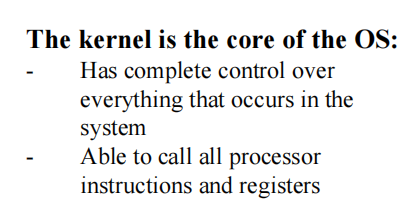

内核是系统的核心：

它对系统中发生的一切拥有完全的控制权。

能够调用所有处理器指令和寄存器。

#### 3、OS是用什么语言写的？

C and Assembly language（c语言和汇编语言）

#### 4、Referee

（1）问题（Problem）：

Run multiple applications in such a way that they are protected from one another

（2）目标（Goal）：

– Keep user programs from crashing the OS

– Keep user programs from crashing each other

（3）机制（Mechanisms）：

– Address Translation

– Dual Mode Operation (user – kernel mode)

（4）策略（Simple Policy）：

– Programs are not allowed to read/write memory of other Programs or of the Operating System

#### 5、为什么需要multi-tasking多任务处理？

– Multi-tasking improved the efficiency of the use of the CPU

程序在执行过程中经常需要等待 I/O 设备（如打印机、硬盘）完成操作，这段时间 CPU 就处于空闲状态。

通过多任务处理，操作系统可以在一个程序等待 I/O 时切换到其他程序执行，从而充分利用 CPU 资源，让计算机更加高效地运行。

### 第二章、Processes的理论

#### 1、读取，解码，执行

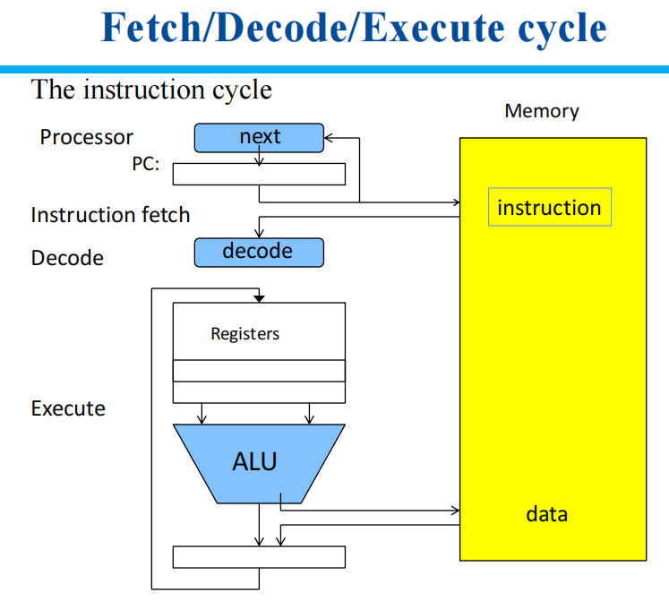

#### 2、Why Processes?

一个没有进程的操作系统一次只运行一个程序，不方便，效率低

1. Multi-programming

2. Multi-users

#### 3、What is a Process ?

A process is an instance of a running program, with

– current state example：PC, SP, data，other registers

– system resources example：files it is using，amount of memory

#### 4、为什么OS需要掌握process的信息？

– To resume（恢复） the process after it has been switched off the CPU

– The scheduler may make use of this data in scheduling decisions

-So that it can save the information for process A when it switches from A to B, load up the information for process B

#### 5、Memory中的Process（内存中的进程）

1、Program code

2、Data

3、Process context：OS管理进程的数据（例如：Process Control Block）

#### 6、Dispatcher（调度员）

– Switches between processes

#### 7、Program Counter (PC) 和 Stack Pointer

Processors use the Program Counter (PC) register to store the address of the next instruction to be executed.

Stack Pointer是一个用于管理计算机内存中的堆栈的寄存器。它指向堆栈的顶部，并用于跟踪函数调用和返回、局部变量的存储，以及中断处理程序等。（了解）

#### 8、执行多个程序

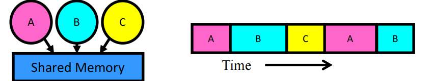

– Multiplex in time

#### 9、如何从一个进程切换到另一个进程？

– Save PC, SP, and registers in current process control block

– Load PC, SP, and registers from new process control block

Program Counter (PC), Stack Pointer (SP)

#### 10、什么会触发进程的切换？

Timer

voluntary yield (e.g. sleep())

I/O

other things

#### 11、如何给人一种可以执行多个进程的错觉？

Multiplex in time!

Let processes think that they have exclusive access（独享权） to shared resources

#### 12、一次只有一个进程在等待的说法是错误的！

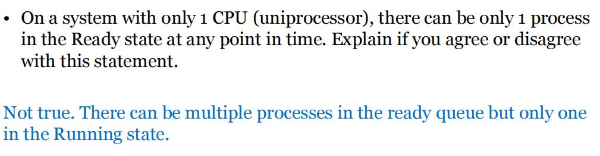

#### 13、States of a process

##### （0）如何改变Process State？

1. Save program counter (PC) , stack pointer(SP) and other registers (context)

保存在PCB中

2. Update the process control block (PCB)

3. Move process to queue

ready; blocked; ready/suspend

4. Select new process for execution

5. ... update its PCB

6. Update memory-management data structures

7. Restore context of the selected process

##### （1）Two-State Process Model

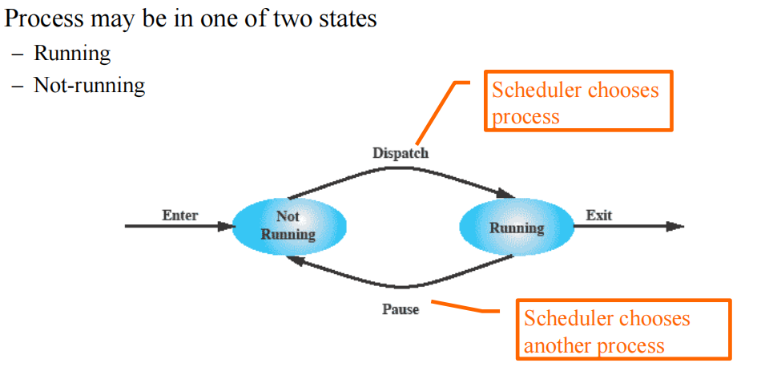

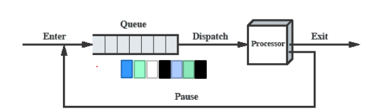

Processes moved by the dispatcher of the OS to the CPU then back to the queue until the task is completed.

Scheduling problem：

Choosing a process for the CPU from the queue

##### （2）Five-State Process Model

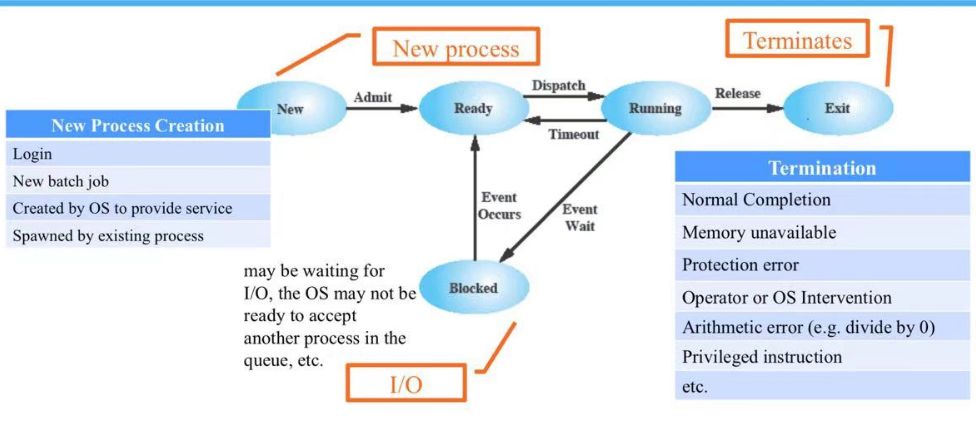

New：登录、新的批处理作业、操作系统创建的服务、由现有进程衍生的进程

Block：等待I/O设备的输入/输出

Exit：正常完成、内存不足、保护错误、操作员操作系统干预、算术错误、特权指令

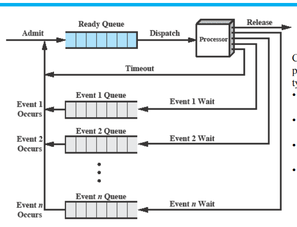

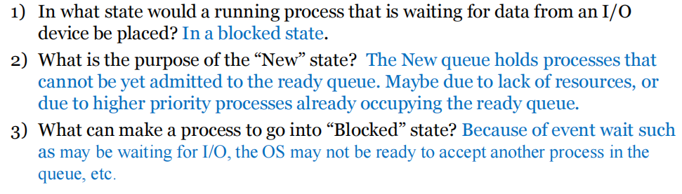

##### （3）Suspending a Process

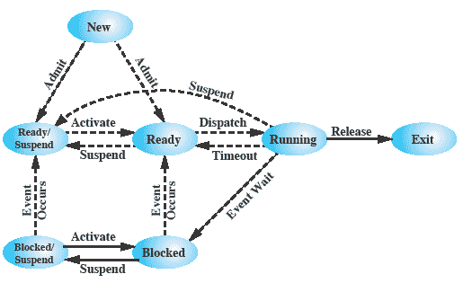

相较于五步，增加一个单词Suspend，两种状态：

Blocked/Suspend，Ready/Suspend

在这里的挂起模型中，进程可从 main memory（主内存）换出到磁盘交换区；虚拟内存是地址空间与映射机制，不能简单等同于磁盘。

补：Main (physical) memory is used for communication between CPU and device controllers主内存（物理内存） 就是 CPU 和设备控制器之间进行交流的地方。

#### 14、Process Control Block（PCB）

Kernel represents each process as a process control block (PCB)

PCB是操作系统中用于管理进程的关键数据结构。它保存了与进程相关的所有必要信息。

PCB 通常包含以下信息：

1. State

2. Identifier（标识符） of the process

3. Priority

4. PC, stack pointers, values of registers

5. Execution time

Kernel Scheduler maintains （维护）a data structure containing the PCBs

#### 15、User vs. Kernel Mode

硬件上需要：

1、a bit of state (user/system mode bit)

2、certain operations / actions only permitted in system/kernel mode

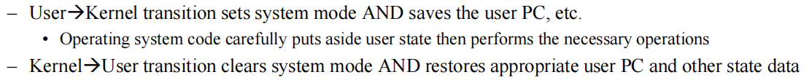

restore：恢复

#### 16、Protection

##### （1）什么是Protection？

1、The OS must protect itself from user processes

Reliability、Security、Privacy、Fairness

2、protect processes from one another

##### （2）3 types of mode transfers（从user到kernel）

1、System call

通过call gates

example is read() operation

2、Interrupt：

External events transfer control to an interrupt handler; the OS may then decide to switch processes.

example is external event from timer or I/O

3、Trap or Exception：

An internal event transfers control to an exception handler; a process switch is not always required.

example is Divide by zero

#### 17、When to switch processes

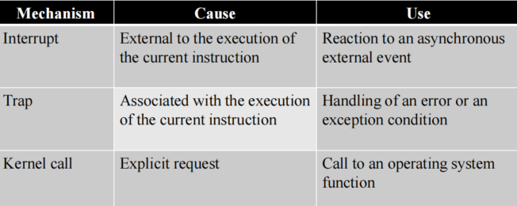

中断 (Interrupt)：

原因：与当前指令的执行无关的外部事件。

用途：对异步外部事件作出反应。

陷阱 (Trap)：

原因：与当前指令的执行相关。

用途：处理错误或异常情况。

内核调用 (Kernel Call)：

原因：显式请求。

用途：调用操作系统功能。

#### 18、改变进程状态的具体过程

1、Save program counter (PC) , stack pointer(SP) and other registers

2、Update the (PCB)

3、Move process to queue

4. Select new process for execution

5、update its PCB

6、Update memory-management data structures（更新内存管理数据结构）

7、Restore context of the selected process（恢复选中进程的上下文）

#### 19、切换进程的代价

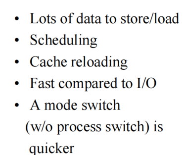

大量数据存储和加载

调度：选择下一个要运行的进程也需要时间，特别是在进程数量较多时。

缓存重新加载：由于 CPU 缓存中存储的是当前进程的数据，切换进程后可能需要重新加载缓存，这会降低效率。

相较于 I/O 快速：尽管进程切换有开销，但与 I/O 操作相比，速度仍然较快。

模式切换更快：仅切换用户模式和内核模式（不进行进程切换）的模式切换比进程切换要快得多，因为它不需要保存和恢复完整的进程上下文。

#### 20、概念总结

• Process: instance of a running program

• Process context: data OS has about a process

• Process state: OS keeps track of state of each process: running, etc.

• Protection: user and kernel modes to prevent processes interfering

• Syscalls: secure programming interface between apps and OS

• Context switch: changing the running process

• Scheduling: choosing which (ready) process to run

#### 21、Process Scheduling（进程调度）的目标

1、Response time:

程序需要对用户交互be responsive ，因此调度应确保程序响应时间短，Minimise （avg. and max. wait time）

2、Throughput （吞吐量）：

Maximise在特定时间内完成的进程数量。

3、Efficiency/Utilisation（效率/利用率）:

use the resources efficiently

4、Prevent process starvation：

确保没有进程不能get executed或is denied resources for too long

5、Share time fairly among processes

Batch jobs: (lots of computations) throughput matters most 吞吐量最重要。

Interactive: response time matters most 响应时间最重要。

#### 22、process有哪几种？

1、Batch processes (CPU intensive)

吞吐量最重要。

2、Interactive processes (I/O intensive)

响应时间最重要。

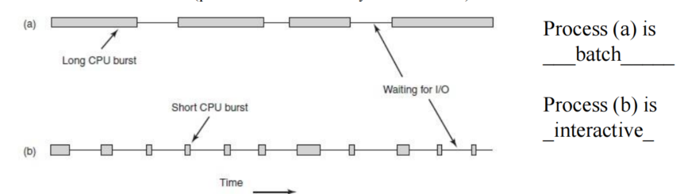

#### 23、什么是CPU burst？

CPU burst: the process is being executed in the CPU（CPU执行的时间段）

长batch，短interactive

#### 24、CPU bursts的分布

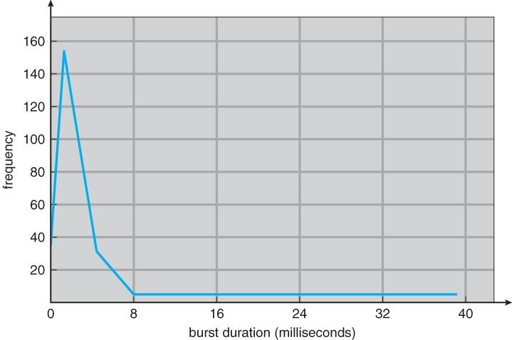

左边高的是Interactive，右边低的是batch

#### 25、First-Come-First-Served (FCFS）算法

1、定义：Processes are assigned the CPU in the order they request it，使用A single Ready queue，新到的进程放在队列末尾，程在运行时不会因时间过长被interrupted（中断）。

FCFS favours（偏向于） CPU-intensive

2、缺点：短进程可能因长进程的存在而等待很久。

##### 26、FCFS 算三种时间（arrival times=0）


1、先画Gantt Chart：

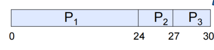

2、

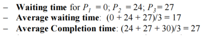

##### 27、Shortest Job First (SJF)算三种时间（arrival times=0）

较短的进程优先

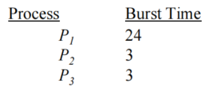

1、先画Gantt Chart

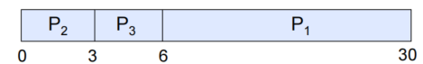

2、

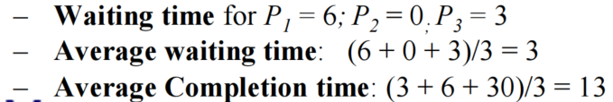

##### （1）FCFS 算三种时间（arrival times不是0）

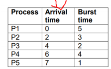

1、先画Gantt Chart

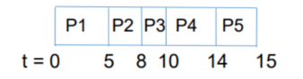

2、wait time=开始运行的时间-到达的时间

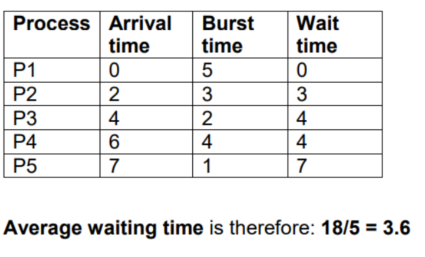

##### （2）SJF 算三种时间（arrival times不是0）

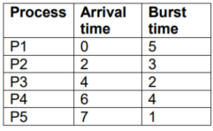

1、先画Gantt Chart，每一步慢慢思考，哪一个什么时候到的

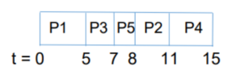

2、wait time=开始运行的时间-到达的时间

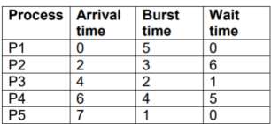

#### 28、Non-preemptive vs. Preemptive scheduling

##### （1）Non-preemptive

一旦进程进入运行状态，它会持续运行直到：

• completed

• blocks（阻塞） for I/O (or voluntarily gives up the CPU)

FCFS 是例子

##### （2）Preemptive

当前运行的进程可能会被interrupted，

Preemption（抢占）发生在：

• when a new process arrives

• on an interrupt

• periodically based on a timer （基于计时器周期性地中断）

RR是例子

#### 29、Preemptive的例子——Round Robin (RR)

##### （1）RR是什么？

each process is given a time slice before being preempted.

对shorter jobs 表现较好。

适用于 jobs长度不一的场景。

比 FCFS 更加 fair

当只有一个进程的时候，他的运行时长可以超过time quantum

##### （2）RR——应用题（q=20，arrival times=0）

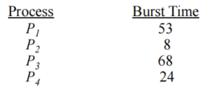

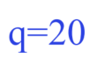

1、先画Gantt chart

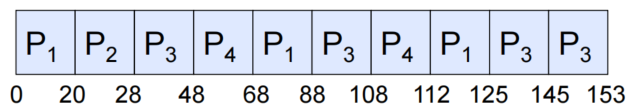

2、

等待时间为进程进入就绪队列后、尚未得到 CPU 的所有时间段之和，包括多次被抢占后的等待。

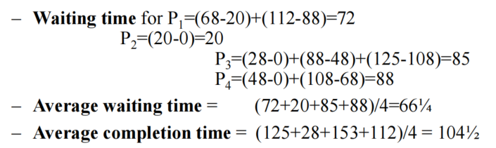

##### （3）RR——应用题（q=2，arrival times不是0）

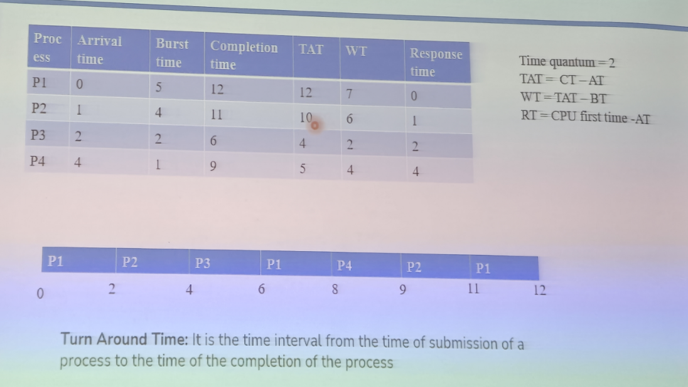

周转时间（TAT，Turn Around Time）：

完成时间减去到达时间（TAT = CT - AT）。

等待时间（WT，Waiting Time）：

周转时间减去运行时间（WT = TAT - BT）。

响应时间（Response time）：

公式是CPU首次执行时间减去到达时间（RT = CPU first time - AT）。

##### （4）RR——应用题（q=1，arrival times不是0）

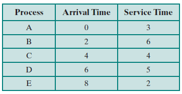

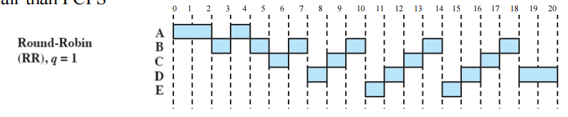

##### （5）RR——应用题（q=2，arrival times不是0）

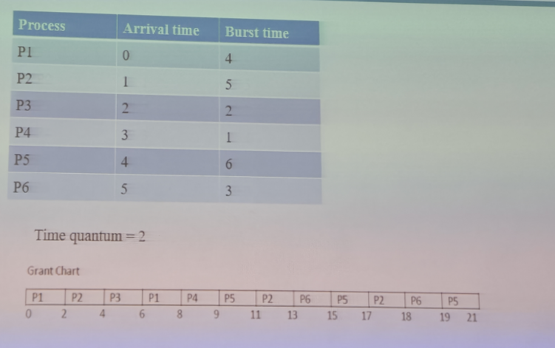

##### （6）RR——应用题解题技巧

1、结束的同时到达，到达在先，结束在后

2、画出每个时间点的cpu和ready队列

轮转队列推演示例（时间片为 1，新到达者先入队）：

| t | CPU | Ready queue |
|---:|---|---|
| 0 | — | A |
| 1 | A | B |
| 2 | B | C, A |
| 3 | C | D, A, B |
| 4 | D | E, A, B, C |
| 5 | E | A, B, C, D |
| 6 | A | B, C, D, E |

#### 30、Time Quantum Size（q的大小）

q如果太长：

-Poor responsiveness

-Computationally heavy processes would be favoured

q如果太短：

大部分时间都花在context switching上了

#### 31、Scheduling with Priorities（优先级调度）

Scheduler 总是选择进程of higher priority来执行

Priorities（优先级）可以是 static or dynamic

#### 32、Priority Queuing（优先队列）

有multiple ready queues，这些队列代表不同的优先级的进程

Scheduler starts at highest priority queue (RQ0)

Lower-priority processes 面临 starvation

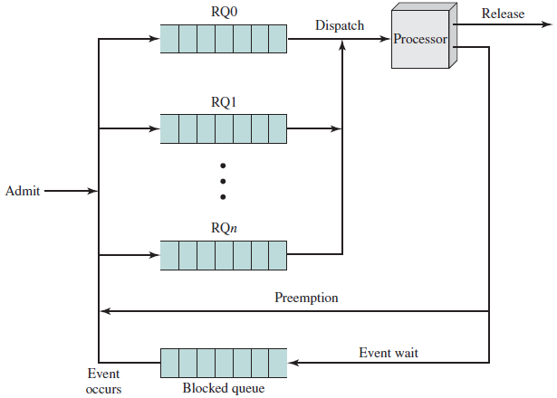

#### 33、Multi-Level Feedback Queues

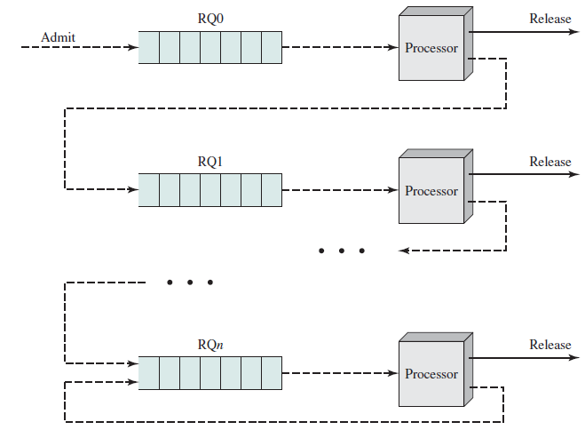

（1）构成：有Multiple priority queues构成（FCFS or RR）

（2）原理：

新进程会从top level of priority队列开始。

On pre-emption: go down a level（如果进程在执行过程中被抢占（如时间片用完），则进程会下降到下一个优先级的队列。）

On I/O block: go up a level

（3）适用于：

newer and shorter jobs and to I/O bound（I/O密集型） processes

（4）不适用于：

Turnaround time（周转时间） of longer processes can stretch out（延长），starvation may occur

但可以通过

vary the preemption times according to the queue来解决以上问题

#### 34、Scheduling algorithms that ‘know’ remaining time of all processes are best

理论上，能够知道所有进程剩余执行时间的调度算法表现最好。例如，抢占式的“最短剩余时间优先”（Shortest Remaining Time First, SRTF）和非抢占式的“最短作业优先”（Shortest Job First, SJF）。

实际上，很难提前准确知道一个进程需要多少时间完成。通常需要通过数学模型，基于过去的执行时间（如时间序列数据）来近似预测。

### 第三章、Process的代码

#### 1、几个方法

##### （1）os.fork（）

（1）作用：通过进程创造进程

System call to create a copy of the current process, and start it running.

（2）fork() 函数的返回值

大于 0：Running in (original) Parent process，返回值是新创建的子进程的 PID。

等于 0：Running in new Child process

在 C/POSIX 中，`fork()` 失败返回 −1；Python 的 `os.fork()` 失败则抛出 `OSError`，需要异常处理。[Python 文档](https://docs.python.org/3/library/os.html#os.fork)

（3）调用方法：

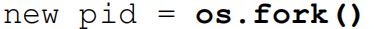

（4）Copy On Write

传统的fork会在调用时直接do duplication

现代，

Copy on Write (COW) delays or altogether prevents（完全阻止） copying of the data.

The duplication occurs only when there is attempt to write on the shared copy.

##### （2）os.execv()

作用：执行

System calls to change the program being run by the current process.

##### （3）os.waitpid()

作用：等待

System call to wait for a process to finish.

##### （4）signal.signal()

作用：设置某个信号的处理函数；发送信号通常使用 `os.kill(pid, sig)`。[Python signal 文档](https://docs.python.org/3/library/signal.html#signal.signal)

#### 2、代码create a new process&using os.waitpid()

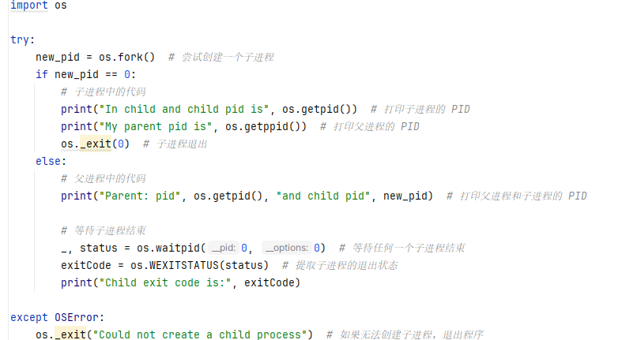

如果new_pid=0，说明目前在子进程中，需要用os.getpid（）得到子进程的pid

如果new_pid不为0，说明目前在父进程中，需要用new_pid得到子进程的pid


在 os.waitpid() 中，

第一个0意味着父进程将会等待当前进程组中的任意子进程结束。

第一个0如果换成-1，意味着父进程会等待它的任意一个子进程终止。

第二个0表示父进程会阻塞并等待，直到子进程终止。

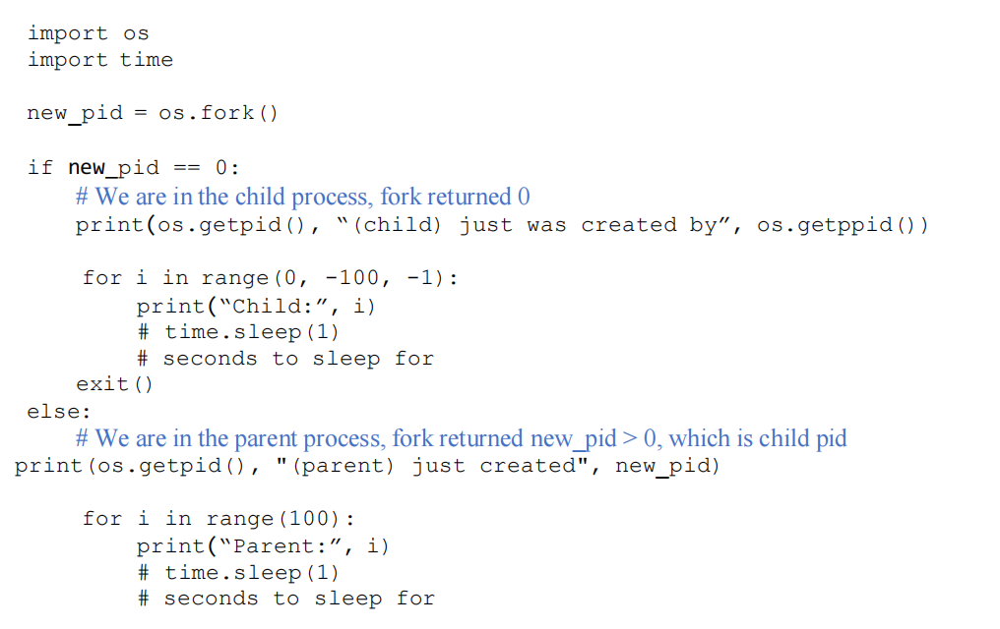

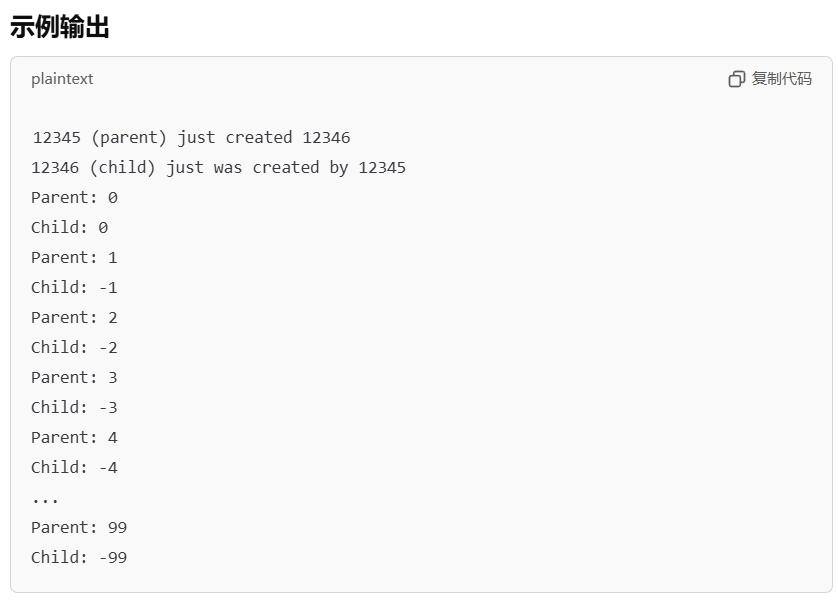

#### 3、Niceness（NI)

（1）定义：

niceness量化the priority of processes

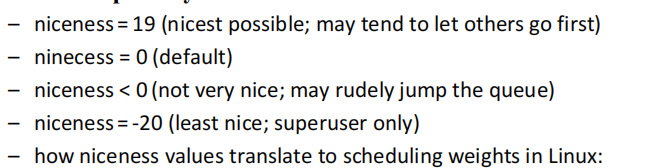

NI越大，优先级越低。

（2）Completely Fair Scheduler (CFS)

当所有任务的 nice 值相同时，CFS 按相同权重分配 CPU；不同 nice 值对应不同权重，并影响 vruntime 的增长速率。[CFS 设计说明](https://www.kernel.org/doc/html/v6.6/scheduler/sched-design-CFS.html)

CFS总是选择vruntime值（该进程获得的CPU时间 virtual runtime）最小的任务

### 第四章、File Systems

#### 1、什么是File Systems？

A File System is a layer of OS that transforms block interface of disks into Files, Directories.

File Systems有四大功能：

Disk Management、Naming、Protection、Reliability/Durability

#### 2、什么是File——不同视角下？

（1）User’s view:

Durable Data（持久保存的数据）

（2）System’s view：

系统不会关心具体的数据是什么

Collection of Bytes、Collection of blocks

block 是 logical transfer unit；本课程例题常用 4 KB，具体大小由文件系统决定。

sector是physical transfer unit

#### 3、A file is a collection of blocks，inside the File System everything is in whole size（大小完整的） blocks

文件系统内部是基于block操作的。

读取操作：加载整个块到内存中，提取出用户请求的部分。

写入操作：读取整个块，修改指定字节，再把整个块写回磁盘。

#### 4、什么是File——标准定义？inode是什么？

（1）定义：It is an abstraction for non-volatile（非易失性） storage.

（2）File包括：data & metadata

（3）metadata包括：

Owner, size, last opened, last modified，Access rights

（4）inode包括：

metadata、which disk blocks belong to which file的信息

具体来说，有

– The size of the file in bytes

– Device ID

– User ID of the file’s owner

– Group ID of the file’s owner

– The file mode

– Timestamps

– A link counter

#### 5、从File path读取指定block的数据的流程


#### 6、操作系统不需要理解文件的具体内容，但它必须能够recognise its own executable files

操作系统不需要深入理解复杂文件格式（如 .docx）的内部结构，应用程序才负责解析和操作这些文件。

但是，操作系统至少要能够识别并执行与其操作相关的可执行文件，以确保正确加载和运行程序。

#### 7、Directory

文件的名字存储在目录中，而目录本身也是文件系统中的一个文件。

每个文件和目录都有一个 inode，用于操作系统在底层查找和管理这些文件或目录。

#### 8、Absolute path name & Relative path name

绝对路径名总是从/根目录开始，比如下图：

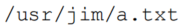

如果当前目录是 /usr/jim，那么 a.txt 的相对路径就是 a.txt。这时无需指定完整路径名。

· 代表当前目录

·· 代表上一目录

#### 9、两种open file table

（1）System-Wide Open File Table

（2）Per-Process Open File Table

#### 10、打开文件的过程

（1）system reads the inode information

（2）Store in the system-wide open file table

（3）Update the per-process open file table

（4）Return a file descriptor/file handle

#### 11、关闭文件的过程

（1）the per-process table entry is freed

（2）any data currently stored in memory cache for this file is written out to disk if necessary

#### 补充：PHP操作

##### （1）文件

fopen：打开文件或 URL；是否创建不存在的文件取决于打开模式，例如 `r` 不创建，`w` 或 `a` 可以创建。[PHP 文档](https://www.php.net/manual/en/function.fopen.php)

fclose：关闭已打开的文件指针。

##### （2）目录

opendir：Open directory handle。

closedir：Close directory handle。

#### 12、使用lock可以解决File Sharing中的冲突问题

有时候文件会被分享给很多users，有时候可能会有很多进程/用户同时write一个文件，可以使用lock来解决这个问题

#### 13、不同级别的权限管理

用户级别（Levels of Users）

Owner (u)：文件的所有者

Group (g)：文件的组用户

World (o)：系统中的其他用户

权限类型（Permissions）

R ：Read (4)：读取文件内容的权限，数字值为 4。

W：Write (2)：修改或写入文件的权限，数字值为 2。

X: Execute (1)：执行文件的权限，数字值为 1。

关键是按权限位相加：7=4+2+1，6=4+2，5=4+1，4 表示只读。

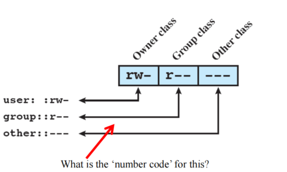

答案：640

chmod 744 zzz.py的意思是什么？

Owner 可以读、写、执行，Group 可以读，World 可以读。

#### 14、FileSystem Hierarchy Standard

```text
/
├── root - The superuser's home directory 管理员
├── boot - 有kernel image
├── etc - 系统配置文件
├── home - Users' directories
├── mnt - General purpose mount point u盘
├── proc - A view of internal kernel data 内核的视图
├── sys - The kernel's view of the hardware 系统硬件的信息
├── dev - Special device files live here 设备文件的存放位置
├── bin - Basic executables for all users 存放可执行文件
├── sbin - System executables (usually for administrative tasks) 存放可执行文件（管理员）
├── lib - Libraries 库
└── usr - User programs, more executables and libraries 用户安装的应用目录
├── bin - More executables 可执行文件
├── sbin - More executables 可执行文件
└── lib - More libraries 库
```

#### 15、Link

（1）Hard links

特点：与原文件共享相同的 inode，文件内容被多个名称共享，删除一个名称不会影响文件内容。但不允许对目录进行hard links

（2）Soft links

特点：一个指向文件路径的快捷方式（shortcut），删除original file后link会失效。

#### 16、inodes存储在哪里？

（1）在早期的 Unix 系统中，inode 存储在磁盘的最外层圆柱（cylinders）上。

delays, poor performance

（2）现代，inode 被分散存储在磁盘块组（block groups）中。closer to the data itself. 提高性能，增强reliability

#### 17、当使用 mv 命令在同一个分区内移动文件时会发生什么？

不会改变实际的数据或 inode，the system just updates the file's "location record" in the directory

#### 18、有哪些file allocation（文件管理）的方法？

Indexed Allocation（inode）、Contiguous Allocation、linked lists Allocation

##### （1）Contiguous File Allocation

1、定义：在文件创造时分配Sequence of blocks；在file allocation table中，每个文件只需要Start address & Length

2、优点：Easy implementation、Good performance

3、缺点：

External fragmentation（随着文件的删除和添加，会有gaps in the disk）

不支持 Dynamic ‘growth’ of files.（如果文件需要扩展，而后面的块已经被其他文件占用了，就无法再继续增加文件的大小）

4、应用场景：CD，DVD

##### （2）Linked Allocation: FAT (File Allocation Table)

1、原理：

文件分配表（FAT） 是一种通过链表结构管理文件的磁盘存储方式。

每个文件的数据块不一定连续存储在磁盘上，但 FAT 通过链表记录文件块的位置。

FAT 为每个文件分配一个文件编号（file number），该编号指向文件的第一个磁盘块。

FAT 通过链表的方式将文件的多个数据块连接起来，每个块指向下一个块，直到文件结束。

Unused blocks会形成FAT free list

read 31, < 2 >： Read block 2 from file with id 31

file_write(31, <3>)：Grab blocks from free list ，Linking them into file

2、优点：simple to implement

3、缺点：Slow to find blocks

简单但慢

#### 19、format a disk（格式化）硬盘会发生什么？

初始化文件系统元数据及空闲空间管理结构；是否清零所有数据块取决于格式化方式，快速格式化通常不逐块清零。

#### 20、磁盘空闲管理有哪些方法？

（1）Bitmap：通过二进制位来记录每个磁盘块是否被使用的方法。

0 表示该块是空闲的，可以用来存储数据。

1 表示该块已经被使用，存放着数据。

Bitmap优点：

– Works well with any file allocation method

– Very small in size to store

（2）Linked list (used in FAT)

### 第五章、Disk & IO

#### 1、register（寄存器），controller（控制器）

#### 2、I/O Bus（总线）结构

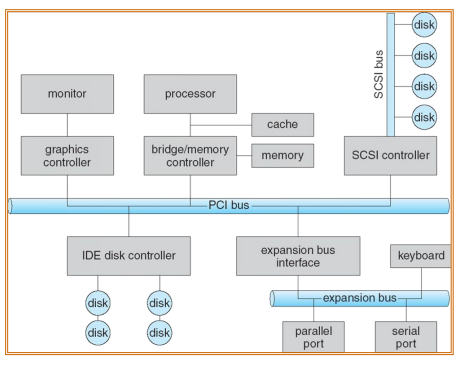

##### （1）什么是bus？

不同设备间的通信和协议

A set of wires (H/W) 软硬件 for communication among devices plus protocols for data transfer operations.

##### （2）PCI和SCSI是什么？

PCI：Peripheral Component Interconnect bus

SCSI：Small Computer System Interface

PCI 总线连接了外围设备（通过controller）

SCSI 总线主要用于连接磁盘等外部存储设备

#### 3、PCI的结构图

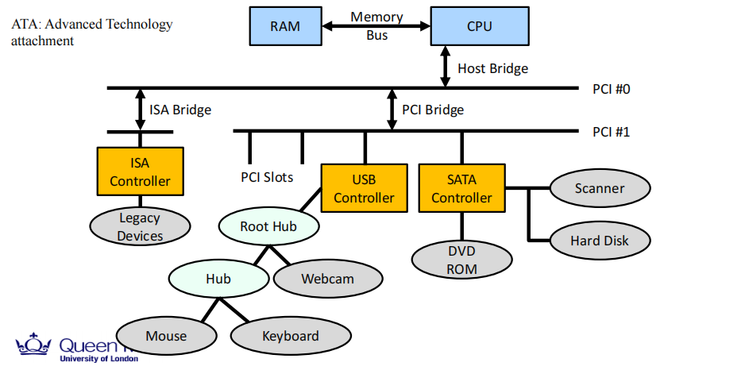

处理器通过Memory Bus与RAM（内存）进行通信。

Host Bridge（主桥）负责在 CPU 和 PCI 总线之间传输数据。

PCI Bridge负责连接不同的 PCI 设备

ISA 桥用于连接较旧的ISA 控制器（ISA Controller），它通常用于与旧设备（如键盘、鼠标等遗留设备）通信。

PCI 插槽是计算机主板上用于扩展设备的插槽，允许用户增加新的硬件功能。

USB 控制器通过 PCI 插槽连接，负责管理 USB 设备

SATA 控制器也通过 PCI 插槽连接，负责与存储设备（如硬盘和 DVD ROM）或扫描设备进行数据传输。

#### 4、Device Controller（以硬盘为例）

（1）操作系统中有专门的drivers，这些驱动程序能与不同的硬盘接口“对话”

（2）IDE/ATA, SATA, SCSI都遵循universal bus standards

（3）控制器中cache的作用：

store neighbouring sectors for future use

store recently accessed blocks

（4）控制器中cache如果突然停电了怎么办？

现代操作系统会保留log（日志），这样在恢复时可以revert to previous stable state & continue with operations.

（5）Controller的任务是什么？

– Read/write operations 读写操作

– Performs validation / any error correction necessary 数据验证和错误纠正

– Communicates with the CPU 与 CPU 通信

#### 5、系统和I/O设备交互的过程

（1）OS 通过status register 来 detect 设备是否处于not BUSY状态。

（2）OS将数据写入data register，sets the command register，controller将状态设置BUSY

（3）The controller 读取data register和command register中的内容，launches the execution of the command

（4）OS通过status register来detect command是否已经被executed

一旦命令完成，控制器会清除命令，并将设备的状态设置为not BUSY状态。

如果在执行过程中发生问题，控制器会将状态设置为ERROR状态

#### 6、Memory-Mapped I/O（记住这个标题）

在计算机的主内存中，有一些地址专门为输入/输出设备保留。它们并不存储普通的数据，而是store I/O device ‘s buffers and registers.

CPU 通过读取或写入这些地址，就可以完成和设备的通信。

#### 7、操作系统如何知道设备完成了 I/O 操作？

##### （1）中断（Interrupt）

（1）定义：Device generates an interrupt whenever it needs service

（2）优点：handles unpredictable events well 处理不可预测事件效果很好

（3）缺点：interrupt has relatively high overhead 开销较高

##### （2）轮询（Polling）

（1）定义：OS periodically checks a device-specific status register (“are you done yet?”) - I/O device puts comp letion information in status register

定期检查，设备会在状态寄存器中更新完成信息

（2）优点：low overhead

(3) 缺点：may waste many cycles on polling if infrequent or unpredictable I/O operations

如果设备操作不频繁或不可预测，操作系统可能会浪费大量 CPU 时间在无用的检查上。

##### 中断（Interrupt）和轮询（Polling）结合是最好的

#### 8、数据如何在processor和设备之间传输？‘

DMA比程序化I/O更快！

##### （1）程序化 I/O（Programmed I/O）

（1）传输特点：Each byte transferred via processor in/out or load/store instructions

（2）优点：简单硬件, 编程简单

（3）缺点：占用处理器资源（Consumes processor cycles proportional to data size）

##### （2）直接内存访问（DMA，Direct Memory Access）

DMA saves CPU cycles（周期、时间）.

（0）定义：

memory和device间的数据传输无需CPU参与

独立于CPU的bus access（总线访问）

CPU只在传输开始和结束时被中断

如果没有DMA，CPU在数据传输的整个过程中都得负责每次读写操作（叫做“编程I/O”），这会让CPU几乎完全被这种任务占据，效率很低。

（1）传输特点：

Give （DMA) controller access to memory bus； Ask controller to transfer data blocks to/from memory directly

（2）传输流程：

1、CPU 发出传输指令，驱动收到指令

2、驱动通知disk controller

3、disk controller 启动 DMA 传输

4、DMA controller执行传输：

5、DMA controller每传输一个字节，会自动更新内存地址，并减少要传输的数据量。

6、当传输完成后，DMA controller发送中断信号给 CPU，通知传输已完成。

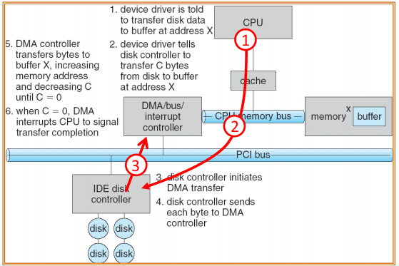

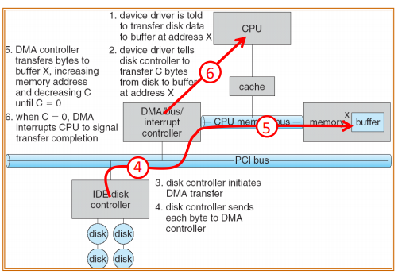

（3）DMA Bus Sharing

DMA Controller与CPU共享bus：

DMA Controller在CPU没有使用bus时使用；

或是强迫CPU suspend operation temporarily（cycle stealing）

（4）DMA Bus Sharing造成的后果：

虽然DMA使用总线会让CPU变慢，但仍然比CPU自己进行数据传输更高效。

#### 9、进行I/O时，程序在做什么？

##### （1）Synchronous, Blocking – “Wait”

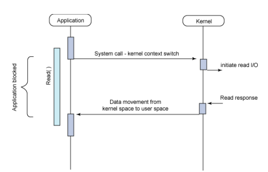

##### （2）Asynchronous, non-blocking – “Tell me later”

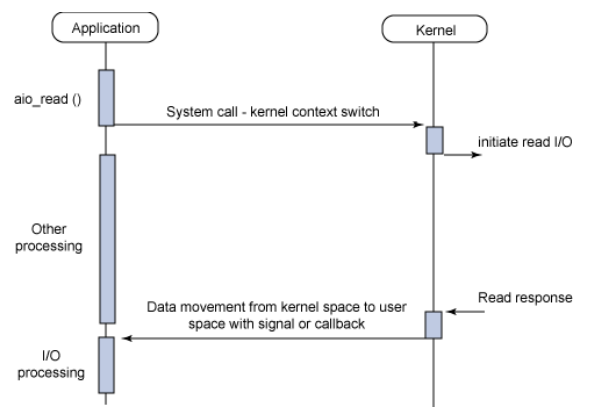

##### 10、设备驱动（Device Drivers）

##### （1）设备驱动在哪里，驱动是什么？

Device-specific code in the kernel that interacts directly with the device hardware

##### （2）设备驱动有两部分

（1）Top half：

accessed in call path from system calls ，响应系统请求，启动I/O操作，将进程设置为“sleep”

（2）Bottom half：

run as interrupt routine ，get input or transfers next block of output，I/O完成了所以“wake”进程

#### 11、HDD（Hard Disk Drive）机械硬盘的结构

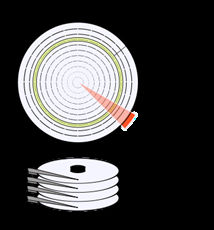

##### （1）Track（磁道）

ring around the disk surface

##### （2）Cylinder（柱面）

stack of tracks that are the same distance from the spindle

Track上下堆叠形成Cylinder

##### （3）Sector（扇区）

segment of track

##### （4）LBA和CHS可以一一对应

LBA：Logical Block Addressing

CHS：Cylinder-Head-Sector


#### 12、Disk Scheduling

##### （-1）seek time

seek time dominate the time taken for read/write operations

seek time是耗时主导因素

##### （0）磁盘请求的处理流程

Request、Software Queue(Device Driver)、Hardware Controller、Media Time（Seek+Rot+transfer）、Result

##### （1）FIFO

（1）特点：First come first served

（2）优点：最公平

（3）缺点：very long seeks


##### （2）SSTF

（1）特点：Shortest Seek Time First

注意，是比数字之差，不是比绝对的数字大小

（2）优点：减少seek times

（3）缺点：Unbounded wait，导致starvation

如果总有新的请求出现在current stack附近，某些远离磁头的请求可能会被长期推迟甚至无法处理。


##### （3）Scan（也叫电梯elevator算法）

方向不定！

left hand side是先小后大

right hand side是先大后小

（1）特点：Take the closest request in the direction of travel，先正后反


（2）优点：Bounded wait，所以avoids starvation

（3）缺点：不公平

反向离它最远的，最后到达

It tends to ignore the areas of the disk that the head has just passed by.（刚刚经过的区域可能会被忽视）


##### （4）C-Scan

方向不定！

left hand side是从大到小

right hand side是从小到大

（1）特点：Circular scan algorithm，take the closest request in the direction of travel


（2）优点：比SCAN更公平

（3）缺点：It skips any requests on the way back


##### （5）练习题


FIFO：50,82,170,43,140,24,16,190

| 算法 | 移动顺序（初始方向向大磁道号） |
|---|---|
| SSTF | 50 → 43 → 24 → 16 → 82 → 140 → 170 → 190 |
| SCAN | 50 → 82 → 140 → 170 → 190 → 199 → 43 → 24 → 16 |
| C-SCAN | 50 → 82 → 140 → 170 → 190 → 199 → 0 → 16 → 24 → 43 |

SCAN / C-SCAN 到达磁盘端点；若只走到最远请求处就折返或循环，则分别是 LOOK / C-LOOK。

记得要draw pictures！

#### 13、Anticipatory schedulers

##### （1）电梯算法（Scan）有什么问题？

违反了locality of reference（局部性原则）

局部性原则是指，如果一个进程请求了某个track/sector上的数据，很可能它会get another request nearby。这是因为，进程经常会请求disk上挨在一起的数据，尽管文件不一定存储在连续的块中，但至少部分数据块往往是adjacent的。

电梯算法（SCAN）如果scan too fast，其他的请求可能会被left behind。

##### （2）如何解决以上问题？

使用Anticipatory I/O scheduler：Delay after satisfying a read request to see if a new nearby request can be made

延迟其实能提高I/O的速度

#### 14、Flash Memory （闪存） – Solid State Drives (SSDs)固态硬盘

##### （1）什么是SSD？

A device that stores data persistently using integrated circuits without any involvement of moving mechanical parts.

##### （2）NAND闪存类型


endurance：耐用性

##### （3）闪存芯片的结构

– Chips are organised in banks（存储单元）

– Banks are divided in blocks (e.g. 256KB)

– Blocks are divided into pages (e.g. 4KB)

– SSDs offer operations on 512 byte “sectors”

##### （4）SSD Reading

操作单位：SSD的读取操作的单位是页（page），通常大小为4KB。

性能：读取操作非常快，通常在几十微秒内完成。

对比HDD：SSD的读取速度比HDD快几个数量级，因为没有机械部件的延迟。

##### （5）SSD Writing

写入前需要erasing

Erasing a block: set all bits to 1，不应丢失的数据会被复制

Writing a page：set some bits to 0

##### （6）关于写入SSD的有趣事实

1、只能写入空页，控制器会维护一组空的块，以便新数据可以直接写入。

2、写入比读取慢，写入操作的时间大约是读取操作的10倍，而擦除操作的时间大约是写入操作的10倍。这说明SSD写入数据比读取要慢得多，主要因为涉及擦除的过程。

3、每个块可以被编程（写入）/擦除的次数是有限的，通常大约在10,000次左右。在擦除操作中，每次擦除都会对存储单元施加电荷，随着次数的增加，存储单元的电荷会逐渐累积，这可能会影响单元的稳定性，最终难以区分0和1。

4、SSD控制器具有wear-levelling逻辑，以确保所有的存储块磨损得比较均匀。尽量使每个存储块被编程/擦除的次数差不多，以避免某些块的过早损耗。

wear：磨损

##### （7）SSD与HDD的对比

（1）SSD有更好的Random Access，更reliable

（2）但是，Sequential Access性能SSD和HDD差不多，因为HDD head seeks最小化了：

在顺序Read的情况下，SSD的性能可以与HDD相当，或者比HDD快几个数量级。

对于顺序Write，SSD和HDD的差异不太明显，性能取决于SSD的write-wear 情况以及剩余的存储空间。SSD在较满和需要频繁擦除的情况下，写入性能会下降。

### 第六章、内存管理

这里的内存，都是运行内存（RAM）

#### 1、内存管理的必要性

##### （1）为什么内存管理是必要的？

虽然计算机内存通常由多个进程共享，但是编译器和我们编写的代码需要忽视（disregard）内存被共享的事实，我们无法预知其他进程的数量及其内存位置。

##### （2）内存管理的要求有哪些？

Relocation

Protection & Sharing

illusion（每个进程在自己的address space中工作）

#### 2、Relocation

##### （1）什么是Relocation？

将程序从内存的一个位置移动到另一个位置的能力

##### （2）为什么需要Relocation？

程序员（programmer）和编译器（compiler）都不知道程序在内存中的具体位置

程序加载后可能会在内存中移动

同时运行两个相同的程序实例时，它们也不可能共享完全相同的内存地址。

##### （3）variables的本质是什么？

References to memory locations

##### （4）指令 x = x + 1 是如何执行的？

LOAD REGISTER1, 1000：将内存地址 1000 中的值加载到寄存器 REGISTER1 中。

INC REGISTER1：对寄存器 REGISTER1 的值加 1。

STORE REGISTER1, 1000：将寄存器 REGISTER1 的值存回内存地址 1000。

这里的内存是指运行内存（RAM）

#### 3、Protection and Sharing

##### （1）什么是Base register和Limit register？重要！！！

他们是存储值的

Base register : smallest legal physical memory address for the process

Limit register : the size of the range

##### （2）内存访问流程


首先会看内存地址是否大于等于base，然后检查这个地址是否小于base + limit。

如果地址在这个合法范围内，访问是被允许的；否则，会有trap

#### 4、illusion（每个进程在自己的address space中工作）

##### （1）有哪两种地址？

Logical Addres：

逻辑地址是指不考虑当前实际物理内存情况的内存位置引用。

它是程序运行时由CPU生成的地址，用于指令操作（比如指针、LOAD/STORE操作的参数等）。

contains a page number and an offset.

Physical Address：

The actual address in RAM

##### （2）什么是Address Translation？

将逻辑地址转换为物理地址的过程。

它也是实现relocation的一种方法。

Address Translation改变的是pysical address，程序中的logical address 是不变的

##### （3）什么是Logical Address space？

Logical Address space是一个程序可以使用的地址集合

每个进程都有它自己的逻辑地址空间，这个空间包含code, data, heap, 和 stack等，由操作系统进行管理，以防止进程之间相互干扰。


##### （4）什么是Physical Memory？

The memory we paid for

##### （5）Logical Address space和Physical Memory的对比？

物理内存常小于可表示的逻辑地址空间，但这不是所有系统都必须满足的关系。大地址空间还可包含：

Logical Address space不仅仅包括了实际的物理内存，还包括了操作系统使用的一些特殊内存区域：

– Memory mapped I/O

– OS data

– Simply cannot afford 2^64 memory（物理内存）

#### 5、Partition Memory

##### （1） 固定分区（Fixed Partitioning）

1、内存划分：在系统启动时将内存划分为若干个连续的块，每个块大小固定。

2、缺点：

如果程序需要更多的内存，而当前分区大小不够用，那么程序会内存不足，无法再继续使用。

产生Internal Fragmentation：内存块可能被分配给一个程序，但该程序并不使用全部分配的空间，导致部分内存浪费。

3、硬件要求：

使用Base Register，由操作系统在上下文切换时加载。

physical address = logical address + base register

##### （2）动态分区（Dynamic Partitioning）

1、内存划分：当程序被加载时，根据程序的实际需求动态创建内存分区，这样每个分区大小不固定，按需分配。

2、优点：

没有Internal Fragmentation

3、缺点：

产生External Fragmentation，因为unused memory broken-up into small regions that are unusable

外部碎片化发生在动态内存分区中，指的是多个小的未使用的内存块分散在整个内存中，这些内存块加起来虽然可能有足够的总空间满足某些请求，但因为不连续，无法被单个进程有效使用。

4、缺点（External Fragmentation）的解决方法：

Compaction（压缩），We would need to compact the memory to make the free space contiguous

但是这样overhead高

5、硬件要求：

使用Base Register和Limit Register。

physical address = logical address + base register

保护机制：合法范围为 `base <= physical address < base + limit`，超出范围则触发 trap。

##### （3）dynamic partitioning的Protection and relocation流程


先比较logic address和limit，再加上base

relocation register就是base register

#### 6、分页（Paging）

##### （1）什么是paging？

Divide memory into equal-size pages

Load program into available pages，这些页面不需要是连续（consecutive）的

会有internal fragmentation

我们可以根据需要将pages从主内存中调入和调出

##### （2）Paging由Frames、Pages组成

固定大小的Frame：指的是physical address。

进程的内存页（Page）：大小与Frame相同，指的是logical address

##### （3）Frames、Pages的关系？

每个进程的Page都需要分配到一个Frame中。

来自任何进程的任意Page都可以放入可用的Frame中。

允许进程的physical memory不连续（discontinuous）

##### （4）Paging的优点？

没有external fragmentation

外部碎片指的是当内存中有足够的空闲内存，但是因为这些空闲块不是连续的，无法满足进程对较大块连续内存的请求。分页的分配方式避免了这个问题，因为每个页可以分散地分配到任何空闲页框中，不需要连续的物理内存。

Easy to implement

Easy to model protection

Easy to model sharing

Easy to allocate physical memory，it can allocate a frame from list of free frames

Leads naturally to Virtual Memory（分页机制支持虚拟内存）

##### （5）Page不能太大，也不能太小

过大：会导致较多的internal fragmentation

过小：会产生过多的pages，我们需要更多的page table来存储他们

当前常见的page大小是4KB。

随着内存变得更便宜，page越来越大，以便存储更多的数据。

##### （6）Logic address在paging中的组成


Page number – MSB

Offset – LSB，address within page


#### 7、Page Table

##### （1）什么是Page Table？

每个process有很多pages，每个process都有一个Page Table

每个process都需要一个map，来说明它的Pages在哪个Frame中，即：将logical address映射到pysical address

Page Table存储在物理内存中，通过register CR3记录。

##### （2）Page Table的功能？

保护（Protection）：每个进程只能访问分配给它的frames

共享（Sharing）：allow sharing on a page level（在页级别上允许进程之间的内存共享）

##### （3）Page Table Entry（每一行）

一个Page Table由很多PTE（entry）组成


P (Present)：P bit 为 1 表示该映射当前有效且页驻留；P=0 表示页不在当前有效映射中，可能被换出、尚未分配或属于非法访问。

R/W (Read/Write)：表示页面是否可写。如果为 0，则该页只读。

U/S (User/Supervisor)：表示用户模式是否可以访问该页。0 表示只能在特权模式下访问。

PWT (Page Write-Through)：控制页面级写透，决定对该页的写操作是否通过外部缓存。

PCD (Page Cache Disable)：禁用该页的缓存，控制对该页的内存访问是否使用缓存。

A (Accessed)：指示该页是否已被访问过，由硬件设置，帮助操作系统管理内存。

D (Dirty)：指示该页是否被修改过，如果页的内容被改变，则会设置该位。

PAT（Page Attribute Table）：

如果支持PAT（Page Attribute Table），可以间接确定通过这一位访问的4-KByte页面的内存类型。

如果不支持PAT，此位保留，必须设置为0。

G (Global）：如果 CR4.PGE=1，表示该页的转换是否是global的。如果CR4.PGE = 0，这一位被忽略。

位 11：9 (Ignored)：未使用的保留位。

位 31：12：表示4KB 页的物理页框地址。

##### （4）Page Table的结构


Page flags包括：

Is page in memory? (or it is on disk?)

Has it changed?

Protection: read only?

Shared?

##### （5）Page Table的流程


##### （6）Virtual Memory

0、虚拟内存的定义：

Virtual memory maps a process address space to physical memory; pages not currently needed may be paged out to backing storage.

1、如何判断是否为虚拟内存：

P bit 为 1 表示页当前驻留；P=0 时需由 OS 判断是换出页、按需分配页，还是非法地址。

2、大多数进程不需要使用所有pages，至少不是一次性需要，原因如下：

程序的某些功能很少被使用：

例如，错误处理代码只有在特定错误发生时才需要使用，而这些错误通常比较少见。

数组通常over-sized ，以应对最坏的情况，但实际上只有一小部分数组会被使用。

3、虚拟内存的优点：

程序可以编写在比计算机实际物理内存更大的地址空间（虚拟内存空间）中。

每个进程只使用其地址空间的一小部分，因此可以为其他程序腾出更多的物理内存，从而提高CPU利用率和系统吞吐量。

#### 8、Page Faults

##### （1）Page Faults是什么？

P bit 为 0 表示该页不是当前有效的驻留映射；并不能仅凭这一位断定它一定保存在磁盘上。

当请求unmapped page时，CPU 会触发一个trap到操作系统，这种trap被称为Page Fault。


上图中标记 X 的页没有有效驻留映射，访问时会触发 Page Fault，由 OS 决定调页、分配或报告非法访问。

##### （2）如何处理Page fault？


当进程访问的页面不在内存中时，会触发页错误

由操作系统将所需页从磁盘加载到内存（context switch for disk access），并更新page table。处理完成后，进程会继续执行未完成的指令。

#### 9、General Protection Fault？

##### （1）什么是General Protection Fault？

通用保护错误（GPF）是指进程以非法方式访问某段内存时引发的错误。它不同于页错误，页错误既可能由页面不在内存中引起，也可能由分页权限违规引起；GPF 对应处理器规定的其他保护检查失败。

当 GPF 发生时，系统可能会生成一个Core Dump，将进程的当前状态写入文件。

##### （2）如何处理General Protection Fault？

1、user-mode：终止进程


2、kernel-mode：系统重启、blue screen of death、 kernel panic


#### 10、Paging练习题

##### （1）page size is 4096 bytes，根据logical address写physical address


Page Number = Logical Address / page size

Offset = Logical Address % page size

Physical Address = (Frame Number × Page Size) + Offset

逻辑地址 307：

Page Number = 307 / 4096 = 0

Offset = 307 % 4096 = 307

page table中，page number 0 对应的frame number为 10

物理地址 = 10 × 4096 + 307 = 41267

逻辑地址 12728：

Page Number = 12728 / 4096 = 3

Offset = 12728 % 4096 = 440

page table中，page number 3 对应的frame number为 3

物理地址 = 3 × 4096 + 440 = 12728

逻辑地址 8192：

Page Number = 8192 / 4096 = 2

Offset = 8192 % 4096 = 0

page table中，page number 2 的p bit为 0（表示该页不在内存中）

因此，Page Fault。

##### （2）32 位架构，逻辑地址中12 bit offset（LSB），20 bit page numbers（MSB），判断正误

##### 正确陈述

1. Physical memory frame size 与 page size 相同：

2. 每个进程的 page table 有 2^20 entries：

因为1个page有一个PTE，一个PTE就是一个entry，而这道题有2^20个pages

3. Offset 的 12 位用于定位 frame 内的位置

4. Page size 为 2^12 = 4KB

##### 错误陈述


这都是一个进程的。

##### （3）memory management，判断正误

1、在使用Dynamic Partitioning的系统中，内存可以通过使用 Base &Limit Registers 以非连续的方式分配给进程。

错误。Base & Limit Registers 确保内存是以连续的块分配给每个进程的，即每个进程的内存地址范围在 base 到 base + limit 之间。因此，内存分配是连续的，而不是非连续的。

2、运行一个程序，停止后再运行时，不保证程序会加载到与第一次相同的物理内存位置。

正确。

3、在使用 Base & Limit Registers 的内存管理系统中，尝试访问超过(base + limit) 的内存位置会导致非法操作，引发一个 trap（陷阱）并交由操作系统处理。

正确。

4、Compiler 知道计算机上有多少其他进程在运行，因此可以根据这个信息将进程分配到内存中。

错误。Compilers can not know this. The allocation is done by the memory management unit of the OS.

5、同一程序的两个运行实例必须使用相同的内存位置来存放代码和数据，否则会浪费内存。

错误。两个运行实例是独立的进程，每个进程需要拥有独立的 Address Space（地址空间）。它们可以共享只读代码页，或显式建立共享映射；普通私有数据仍需彼此隔离。

##### （4）page tables，判断正误

1. Page size can only be 4KB.

错误。虽然 4KB 是常见的页面大小，但并不是唯一的选择。

2、A smaller page size leads to smaller page tables.

错误。The page table will need more entries (smaller page size ->more pages).

3、The number of page table entries depends on page size.

正确。

4、Smaller page size increases external fragmentation.

错误。分页（Paging） 机制通过将内存划分为固定大小的页面， 消除了External Fragmentation的问题。

5、If we increase page size, we increase internal fragmentation.

正确。增大 page size 会导致 Internal Fragmentation增加。

#### 11、Page，Page number，Page Table，PTE，logic address的关系

##### （1）公式

本课程计算中常把 1024 bytes 写为 1 KB（严格二进制单位为 1 KiB）；1 byte = 8 bits。

Page Table 是由多个 PTE 组成的，PTE 是 Page Table 中的每一项；

Logic address 包括 Page number 和 Offset；

Page Table 包括了 Page number 和 Frame number的关系，以及一些flags；

一个 process 有 一个 Page Table

一个 process 有 很多 Pages

在完整单级页表模型中：页数 = 页表项数 = $2^{\text{页号位数}}$。

按字节编址时：Page size = $2^{\text{偏移位数}}$ bytes。

Page Table占用的总的空间 = Page number的个数 * 每个entry的大小

4 byte pages的意思是page size是4byte

##### （2）实例


#### 12、Paging的缺点和解决方案

##### （1）Paging的Problem

P1、Page table is large、sparse tables

已知32位架构，12位是offset，20位是page number，一个PTE的大小是4 byte

那么，PT的大小=4byte * 2^20（1M）= 4M byte，这是一个进程的PT的大小！

如果是64位架构，一个进程的PT的大小只会更大

解决方案：Multi-level page tables。

P2、Memory access is slow

在paging中，每次内存访问都需要进行两次查找：

One look-up into the page table, one more to access the data in memory.

解决方案：Caching: Translation Lookaside Buffer (TLB)

##### （2） Why are page tables sparse?

• 尽管程序查看整个logical address space，但实际上只有一小部分被使用——大部分空间是空闲的。

• 在single level page table中，所有进程都会被分配一个“full”的page table，无论它们是否真正需要整个内存空间。

• 特别注意heap空间（动态内存分配的地方）的增长，那里会有很多空白空间……

##### （3）如何解决Page table is large、sparse tables缺点？

利用sparsity，使用Multi-level page tables，但这会使P2问题更加严重

##### （4）Multi-level page tables


b[1]包括a[0]到a[3]；如果a[4n-3]到a[4n-1]都是0，那么对应的b[n]也是0

否则，b[n]的值就是指向level 2中的对应的块的第一个

第1个表要找1次，第2个表要找2次，第3个表要找3次

sorted list：

最右边的表（z.length = 5）使用的是一种排序列表的方式，仅存储非零元素，并且按索引排序。

使用二分查找来查找元素位置，查找次数是对数级别（logarithmic access），需要 O(log n) 的访问时间。这种方法极大地减少了空间浪费，但查找效率依赖于二分查找算法。


n+1- level LUT 的 n+1层 就是把n - levlel LUT照搬过去，再去掉全是0的组

##### （5）Solving P1: Page Table (PT) Structure


p1把它分成2^10份，p2把每份弄成2^10个

##### （6）Multi-level page tables如何帮助解决spaseness？

将1st level PTE 设置为not valid，可以释放出level 2中的1024个pointers。

少量not valid的1st level PTE可以在整体page table大小上带来相当大的节省。

##### （7）3-level paging


##### （7）Solving P2——Caching: Translation Lookaside Buffer (TLB)


图片理解：

TLB是一个小型的缓存，用于存储近期访问过的页表条目。

当虚拟地址的页号在TLB中被找到时，称为TLB hit。此时，TLB将直接提供对应的帧号，与虚拟地址的偏移量结合，形成完整的物理地址。

当TLB miss时，系统查阅页表，找到虚拟地址对应的物理帧号。页表存储在内存中，记录了虚拟页号和物理帧号的映射关系。

如果页表中也找不到对应的帧号，发生页错误。这通常意味着所需的数据不在物理内存中，需要从次级存储（例如硬盘）加载到主内存中。

##### （8）TLB（Translation Lookaside Buffer）定义

TLB 是一种专用于 page table translations的Cache，用来缓存虚拟地址到物理地址的映射，而不是直接缓存物理地址。

It is a hardware cache inside the CPU，由于位于CPU内部，TLB的大小通常较小，容量由具体处理器及 TLB 层级决定。

本课程采用 fully associative TLB 模型，可并行比较条目；实际处理器也可能使用组相联 TLB。

TLB 可以带有 ASID / PCID 等地址空间标识，用来区分不同进程的映射。

每次发生 context switch时，通常需要flush（清空）TLB，因为不同的进程可能使用相同的page numbers（page numbers are not unique），但映射到不同的物理地址。如果不清空，那么TLB中的旧映射可能导致错误的地址转换。


##### （9）TLB工作流程

TLB hit：only hardware operations involved

TLB miss：

若TLB中没有该地址的映射，可能需要操作系统（OS）去访问PT

将新生成的地址映射保存到TLB中。

更新TLB后，重新执行导致未命中的指令，这时可以hit TLB。

Page fault：需要操作系统的参与。

页面缺失时，需要进行context switch，因为需要actual disk acces

如果物理内存已满，可能需要进行页面置换（Page Replacement），即从虚拟内存中page-in一个页面时，需要将物理内存中page out一个页面，以腾出空间。


##### （10）TLB为何奏效？什么是principle of locality？


TLB通常可以存储我们需要的地址转换，因为：

At any time, most programs tend to access a subset of their memory pages (locality of reference)，比如

Loops、arrarys

Locality可以分为：

-Temporal (locality in time)：如果一个内存位置被访问过，那么在短时间内可能会再次被访问。

-Spatial (locality in space)：如果一个内存位置被访问过，那么其附近的内存位置也很可能会很快被访问。

##### （11）Locality的例子——arrays


假设：

a is an array of 10 integers

each integer occupies 4 bytes

we have 16-byte pages and 8-bit logical addresses

因此：

page大小：16 byte = 2^4，所以offset有4位，page number有8-4=4位

因此：

一个page包括16/4=4个integers

访问a[0]时发生TLB未命中。

访问a[1]和a[2]时发生TLB命中（因为它们在同一个页面）。

访问a[3]时再次发生TLB未命中，然后a[4]和a[5]命中。

访问a[7]时再次发生TLB未命中，其他访问则会命中。

在10次访问中，7次命中，命中率为70%。

回答：What effect would page size have?

page size增大，可以容纳更多数组元素，从而减少TLB miss次数。


左边： page size is small enough to cover the current working set of the program

中间：Fewer large pages fit in memory, the system must replace pages more often to accommodate new data.

右边：If the page size is large enough to hold the entire working set of the process

#### 13、Caching

##### （1）Aim of caching

-用最便宜的技术中提供尽可能多的内存

-提供最快的访问速度的技术

##### （2）Caching is really only good if

常见的情况足够频繁

不常见的情况成本不太高


缓存的容量越小，速度越快

#### 14、Working Set（WS）

定义：The set of pages that a process is currently using

WS随时间变化：

工作集可能在一定时间内保持稳定，例如在循环或函数执行时。

但总体来说是可变的，比如一个函数退出并调用另一个函数时，工作集会发生变化。

估计WS大小非常重要：

如果一个进程的内存分配不足会导致分页机制（scheme）失效；

如果没有足够的物理内存存放WS中的页面，程序大部分时间用来处理page faults，导致性能下降。


#### 15、Thrashing

##### （1）Thrashing是什么？

Thrashing发生在大多数process的 Working Set 的 memory不足时，导致page fault rate上升，使得系统忙于处理页面交换，实际工作效率低下。

##### （2）Thrashing的图像


如果某个运行的进程没有足够的内存使用，系统利用率（Utilisation）会下降。

##### （3）防止Thrashing的方法

we must provide processes with as many frames as processes really need "right now“

因此，需要限制“resident” process的数量，确保每个process有足够的memory使用；other processes are swapped out

##### （4）How many pages to give to a process?

如果要防止Thrashing，需要回答：How many pages to give to a process?

Fixed-allocation：

每个进程拥有固定数量的页面。

发生page fault时，必须替换该进程已有的页面之一。

Variable-allocation：

分配给进程的页面数量可随进程的生命周期而变化。

#### 16、Fetch Policy——何时将页面加载到内存中

Demand Paging：

当页面被访问时再加载到内存。

进程刚开始运行时会产生较多的页面缺失。

Linux操作系统采用按需分页。

Pre-paging：

除了被请求的页面，还提前加载更多的页面。

对于磁盘上连续存储的页面，预取可能更高效。

##### 17、Replacement Policy——当内存已满且发生页面缺失时，需要决定替换哪个已加载的页面

被替换的页面应是近期最不可能被再次引用的页面。

大多数策略通过过去的访问行为来预测未来的访问需求。

常见策略：

FIFO（先进先出）：简单但不“智能”，可能会驱逐（evict）有用的页面。

Least Recently Used (LRU) ：更好

##### （1）LRU

LRU定义：基于locality，长时间未使用的页面近期也可能不会被使用，因此可以优先替换。

Clock page replacement algorithm 是对 LRU 的近似，不是精确的 LRU。

Cycle through loaded pages

“clock hand”循环指向下一个待检查的页面。

发生page fault时：

如果时钟指针指向的页面的A bit为0，则替换该页面。

如果时钟指针指向的页面的A bit为1, 则将其重置为0，并将时钟指针移动到下一个页面继续检查。

##### （2）Frame Locking

Frame Locking的作用：防止某些重要页面被替换。

常见locked frames：

操作系统内核

控制结构

I/O缓冲区

#### 18、Cleaning Policy

Demand Cleaning：

A page is written out only when it has been selected for replacement

Pre-cleaning：

Pages are written out in batches

Page Buffering：

被替换的页面放入两个列表中：

Modified page list: written out in batches，需要分批写回到磁盘，以确保数据不丢失。

Unmodified page list: reclaimed or lost，因为它们的内容在磁盘上已经有备份。

#### 19、Load Control——How many processes resident（驻留） in main memory?

问题：主内存中应驻留多少个进程？

进程太少：可能导致所有进程被blocked，无法充分利用资源。

进程太多：可能导致Thrashing。

如果进程过多，需要suspend（或kill）一个进程，常用选择包括：

1. Lowest priority process

2. Faulting process ：因为其WS不在内存中。

3. Last process activated：新启动的进程通常WS还未完全resident

到内存中，挂起它对系统影响较小。。

4. Process with smallest resident set：此类进程在内存中的页面较

少，挂起后重新加载的成本较低。

5. Largest process

### 第七章、并发和线程

#### 1、traditional process

##### （1）定义

在traditional process中，一个process只有a single thread of execution，意味着没有concurrency，所有代码都是按顺序执行的。

##### （2）两个主要组成部分：

1、Sequential program execution stream：

进程的代码以一个sequential stream执行

包括 state of CPU registers, stack等

2、Protected resources：

Main memory state：包含进程的地址空间

I/O state：例如 file descriptors

#### 2、modern process

定义：process使用multithreading

#### 3、thread

##### （1）定义：

Thread：a sequential execution stream within a process

Multithreading: a single program made up of a number of different concurrent activities (threads of execution)

Multithreading → Multiple threads per Process

Process：an instance of a program running on a computer

Heavyweight Process → Process with one thread

##### （2）单线程与多线程进程的区别


State shared by all threads in process:

Content of memory(global variables, heap)

I/O state (file descriptors, network connections, etc.)

State “private” to each thread:

Kept in TCB (Thread Control Block)

CPU registers (PC，SP)

Execution stack pointer

Priority, etc.

##### （3）Multithreading的优势：

Thread switch成本低：thread switch比context switch的开销要小得多。

切换开销依赖硬件、操作系统、缓存状态和线程实现，不存在固定的通用数值。

Thread creation much faster：线程的创建速度比进程快大约 10倍，同时线程的终止速度也比进程快。

Threads naturally share memory：线程之间可以直接共享内存，方便通信。而进程间通信则需要内核介入，以提供保护和通信机制。

#### 4、Thread State

每个Thread都有一个Thread Control Block（TCB）

– Execution State: CPU registers, program counter (PC), pointer to stack (SP)

– Scheduling info: state, priority, CPU time

– Various Pointers (for implementing scheduling queues)


每个进程控制块（PCB）可以指向多个线程控制块（TCB）。

在同一个PCB中切换thread，只是简单的线程切换，不涉及地址空间的变化。

在不同PCB之间切换thread需要更改内存地址空间（涉及table pointers的更改）。

#### 5、操作系统如何运行一个thread？

– Load its state (registers, PC, stack pointer) into CPU

– Load environment (virtual memory space, etc.)

– Jump to the PC

#### 6、操作系统如何从线程中收回控制权？

thread阻塞在I/O上：当线程等待I/O操作完成时，会让出CPU。

thread等待其他thread的“信号”：当线程等待来自其他线程的信号时，会停止运行。

thread主动执行yield()：线程主动放弃CPU，允许操作系统调度其他线程。

中断发生：硬件或软件产生的信号会停止当前代码的运行并跳转到内核。

定时器中断：调度器的时间片结束时，触发定时器中断，将控制权交回操作系统。

#### 7、Thread Lifecycle


#### 8、单核处理器


thread切换，只需切换CPU状态，其他资源（如内存、I/O状态）无需切换。因此thread切换开销低

process内的threads可以共享资源

有CPU保护，没有Memory/I/O保护

在本节不考虑 SMT 的单核模型中，同一时刻只执行一个线程。

#### 9、Multi-Cores & scheduling 多核处理器 和 调度


##### （1）multicore processor

不考虑 SMT 时，4 个核心可同时执行 4 个硬件线程；支持 SMT 的核心可提供更多逻辑处理器。

现代计算机通常在一个物理芯片上集成多个计算核心，即multicore processor

##### （2）scheduling


thread的scheduling形式：

（1）Each core maintains its own queue of threads：

可以更有效地利用cache memory (warm cache）

可能需要Load balancing，以保证所有核心的工作量均衡分配。


（2）All threads are placed in a single common queue：

可能会出现竞争条件，需要使用锁机制来避免资源冲突。


#### 10、Hyper-Threading 超线程


Hyper-Threading技术允许每个core支持多个hardware-threads

hardware-threads之间的切换开销非常低，因为它们的切换是在硬件层面完成的。

但由于多个hardware-threads共享同一个core的运算资源（如ALU/FPU），可能导致资源争用，影响性能。

#### 11、Processor affinity 处理器亲和性

##### （1）什么是Processor Affinity？

由于线程/进程在不同核心之间切换时需要invalidating and repopulating caches，成本较高，大多数支持多核的操作系统会尽量让线程/进程保持在同一核心上运行。

##### （2）Soft vs hard affinity

soft affinity：系统会尽量让线程/进程在同一个处理器上运行，但不做绝对保证。例如，为了在处理器之间进行load balancing，可能会发生Migration。

hard affinity：一些系统提供system call，来允许process来决定自己在指定的 a set of processors上运行

##### （3）许多系统同时支持软亲和性和硬亲和性

Linux系统提供了 sched_setaffinity() system call，用于设置hard affinity。

#### 12、ULT & KLT

##### （1）KLT


kernel有两个table

（1）定义：

全称：Kernel level threads

Native threads supported directly by the kernel.

每个thread可以独立运行或阻塞。

一个process可能包含多个threads等待不同的事件。

（2）缺点：

开销较大，调度需要切换到kernel mode，需要额外的时间和资源。

##### （2）ULT

这里的局限特指 many-to-one 用户线程模型。

这里的局限特指 many-to-one 用户线程模型。


kernel只有一个table

（1）定义：

全称：User level Threads

用户程序提供scheduler和thread package

用户threads之间可以是non-preemptively调度（threads由用户程序进行调度）。

Thread switching更快，因为不需要kernel intervention

（2）缺点：

当一个thread因I/O阻塞时，所有thread都会阻塞。

Kernel无法在所有thread之间调整调度。

无法充分利用multi-processing（实际上，一个process中只能有一个thread同时执行）

（3）练习题：


##### （3）KLT对比ULT

KLT is managed by the OS, is slower, and can handle multi-core processors well.

ULT is managed by the program, is faster, but can’t handle multi-core processors efficiently.

##### （4）结合KLT和ULT


（a） 在这种情况下，内核只看到并调度一个进程（包含线程库Thread Library的进程）。

（b） 每个线程由内核进行调度。

（c） 线程的创建和调度发生在用户空间。一个应用程序中的多个用户级线程（ULTs）会映射到等于或少于其数量的内核级线程（KLTs）（线程数量可以由开发者调整）。

(c）的优点：

一个阻塞的系统调用不需要阻塞整个process（其中一个KLT会处理该阻塞）。

同一应用中的多个thread可以在多个multiple processors上并行运行。

例子：

历史上的 Solaris 使用过多对多线程模型；一对一模型则让每个用户线程对应一个内核线程，应与多对多模型区分。

##### （5）Some Threading Models


#### 13、Concurrency & Parallelism

##### （1）多多定义

Multiprocessing → Multiple CPUs

Multiprogramming → Multiple Jobs or Processes

Multithreading → Multiple threads per Process


Multiprogramming第二行是第一行的具体表述，实际只有一行


##### （2）Concurrency versus parallelism

Concurrency：同时处理多个事情(不一定同时做，可以利用调度来interleaving交叉)。可以分为Real concurrency和Simulated concurrency

Parallelism：同时做多个事情


##### 14、Atomic Operations

##### （1）定义

An operation that always runs to completion, or not at all, is called an atomic operation (“all or nothing”)

##### （2）一些重要的性质

原子操作也叫fundamental building blocks

如果没有Atomic Operations，可能会导致race conditions的发生。

某些满足数据宽度、对齐和体系结构条件的 LOAD/STORE 操作具有原子性；不能无条件推广到所有读写。

##### （3）x = x + 1不是atomic operations

MOV：load the contents of memory address where x is stored to register

INC：在register中对 x 加 1。

MOV：将register中的值存回 x 的memory address。

#### 15、Race Conditions

##### （1）定义

a form of error in concurrent programs. Occurs if effect of threads on shared data depends on the order in which the threads are scheduled. Behaviour becomes unpredictable – as it differs for different interleavings and is not controlled.

##### （2）一些重要的性质


期待count为2000，但大多数情况下到不了2000，因为race conditions，线程重叠

由于对资源count的未受控制的访问导致

Non-deterministic（输入不保证输出） and Non-reproducible（不同runs，输出不同） means that bugs can be intermittent间歇性的(“Heisenbugs”)

Murphy’s law：Concurrency编程中，线程调度往往在最糟糕的时间点出问题，导致不可预期的错误。


##### （3）防止Race Condition——Mutual Exclusion/ make operations atomic

Mutual Exclusion：Critical Region是具体实现方式

防止两个threads同时用一块资源

One thread excludes the other while doing its task

Critical Region：Part of the program over which mutual exclusion is needed

不允许两个threads同时进入它们的Critical Region（Mutual Exclusion）。

不应对threads速度或CPU数量作任何假设。program has to work correctly for any arbitrary interleavings

在Critical Region外运行的threads不得阻塞其他threads。

threads不能永远在等待进入Critical Region的状态


##### （4）Java Synchronized methods

‘Synchronized’ code is a ‘critical region’

All Java objects have lock

实例 synchronized 方法锁定当前对象 `this`；静态 synchronized 方法锁定对应的 `Class` 对象。方法退出时释放相应监视器。

一个thread对一个对象执行synchronized方法时，其他对这个对象调用synchronized方法的thread suspend直到第一个synchronized方法执行完毕


##### （5）Synchronized statements

声明块内的代码是critical region

The used of Synchronized ensures that certain parts of the code can only be accessed by one thread at a time.


使用同步语句时，必须明确指定哪个object提供锁。

当一个同步方法中只有很小部分代码操作共享数据时，使用同步语句可以优化性能。

##### （6）Entry set queue for a lock

调用一个 Synchronized 方法需要拥有该object的锁。

如果锁已经被另一个thread占用，调用 Synchronized 方法的thread会被阻塞，并被放入该对象锁的entry set queue中。

当一个thread退出 Synchronized 方法（或块）时，锁会被释放。

锁释放后，等待线程竞争该锁；Java 内置监视器不保证 FIFO 或公平性。


### 第八章、deadlock

#### 1、deadlock的定义

A set of processes (threads) is deadlocked if each process (thread) in the set is waiting for an event that only another process (thread) in the set can cause

如果该组中的每个进程（线程）都在等待一个事件，而这个事件只能由该组中的另一个进程（线程）来触发。

Circular wait，每个process保存一个资源并等待另一个资源，形成一个封闭的chain。

Deadlock is created by using locks to ensure mutual exclusion，但是但每个thread都在等待另一个thread持有的锁，从而形成了一个循环cycle等待。

#### 2、四个Conditions for Deadlocks

- Mutual exclusion condition

- 资源不可分享unshareable(同时只能有一个线程或进程使用资源)

- Hold and wait condition

- 持有hold一个资源同时等待另一个资源

- No preemption condition

- 资源只能在线程或进程使用完毕后被自动释放

- Circular wait condition

- 一个循环链circular chain，每个线程或进程持有的资源被下一个循环链中的线程或进程等待使用

#### 3、Thread Termination Co-operative termination

什么时候需要终止？

方法return终止

有时需提前终止

过时的方法：


Co-operative termination：

thread 可以接收终止terminate请求。

thread 必须监控monitor这些请求。

thread 必须通过释放当前正在使用的资源来co-operate终止请求。

#### 4、Interrupt

每个 thread 都有一个 interrupted 标志。

interrupt有哪些方法？


调用 interrupt会发生什么？

Sets the flag

If the thread is sleeping or waiting，InterruptedException is thrown

thread在运行时一定要：

test the flag using ‘interrupted’

catch the exception

#### 5、Conditional Suspension (wait/notify): Mailbox Example

信箱是critical region

reader和writer同时只能一个thread访问

如果信箱空，writer写一封邮件；如果信箱满，reader读一封邮件


##### （1）方案一（错）


信箱空，先读后写，reader等待信箱满，占有信箱资源，writer写不了→deadlock

##### （2）方案二（错）


这种方式会导致deadlock。

邮箱为空

reader进入并锁门

reader拿着钥匙睡着了（Thread.sleep() 不会释放线程持有的锁！！！）

writer被锁在外面

##### （3）方案三（解决deadlock）

邮箱为空

reader进入并锁门

reader发现邮箱为空，去外面等

writer进入并留下message

writer在出去时notifies reader

reader回去读message


mailbox完整：


##### （4）方案三完整

writer会不断写入消息，直到MAX。

reader会不断读取消息，直到收到中断信号

Writer


Reader


Mailbox


注意：

1、调用 wait / notify / notifyAll 时，必须持有相应对象的监视器锁，可通过同步方法或同步块取得。

2、检查等待条件时使用 while 循环；每次 wait 返回后重新判断条件。

3、改变了等待条件后，按协议调用 notify / notifyAll；通知本身不释放锁，退出同步区域才释放。

#### 6、wait() and notify()


##### （1）一些使用规则:

Create variables for condition（条件变量）

wait() called in a synchronized method。因为必须hold lock in order to call wait()

一定要在while中调用wait()

因为：

– 可能有多个thread被唤醒

– Don't assume that the interrupt was for the condition you were waiting for, or that the condition is still true

使条件成立后，应在持有相同监视器锁时通知等待者；遗漏必要的通知可能让线程一直等待。

##### （2）调用wait()时:

thread释放该对象的锁。

thread的状态被设置为waiting。

thread被放入该对象的wait set。

##### （3）调用 notify() 方法时：

在 wait set 中选择一个线程；具体选择任意，不保证 FIFO。

如果wait set中没有thread，调用 notify() 将被忽略。

将选中的thread从wait set移动到entry set。

将选中thread的状态从waiting设置为blocked。

该thread现在可以参与锁的竞争。


#### 7、Thread states in the JVM

New: thread刚被创建但未开始

Runnable: thread在JVM执行excuting

Blocked：等待进入或重新进入 synchronized 方法 / 代码块所需的监视器锁。Java 的 BLOCKED 状态并不泛指所有 I/O 等待。

Waiting: 线程在wait set中，一个thread在等待另一个thread执行某个特定操作

wait()和join()可以让线程进入此状态

调用wait()时，在进入WAITING状态之前，线程会释放它持有的对象锁

Timed Waiting: 与waiting类似，但指定了等待的时间

Thread.Sleep()会使线程进入此状态，但不会释放它持有的任何锁

Terminated: 一个thread的run方法已经返回

#### 8、Deadlock Modelling

##### （1）基本的定义


T：thread

R：resource，一个R有多个instances

每个thread通过以下方式使用资源：请求 (Request) / 使用 (Use) /释放 (Release)

##### （2）图中的两个cycles


T1 → R1 → T2 → R3 → T3 → R2 → T1

T2 → R3 → T3 → R2 → T2

（注意箭头方向）

##### （3）有cycle但没deadlock的情况


图的分析：

cycle：T1 → R1 → T3 → R2 → T1

T4 可能释放 R2 的一个 instance，之后该实例可以分配给等待 R2 的 T3。

总结：

如果resource allocation graph中 没有cycle，不会有deadlock。

如果resource allocation graph中 存在cycle，deadlock可能有可能没有：

如果每个资源都只有一个instance，cycle就意味着死deadlock。

如果一个资源有多个instances，deadlock可能有可能没有

（If there are multiple instance of resources）

#### 9、Strategies for Dealing with Deadlock

##### （1）Dynamic avoidance

通过操作系统对资源分配的动态决策，确保不会达到死锁的状态。

具体措施：

不分配可能导致死锁的资源。

监控所有锁的获取情况。

有选择性地拒绝可能导致死锁的资源请求。

##### （2）Prevention

从结构上否定导致死锁的四个条件中的一个或多个

（1）“break” Mutual exclusion:

让相关资源可共享，从而移除排他占用的需求；仅使某个无关资源可共享并不能保证消除所有死锁。

在某些情况下适用（例如，只读文件），但某些资源由于其本质不可共享（例如，锁、可写文件等）。

（2）“break” Hold and Wait：

确保一个进程在同一时间请求其所有需要的资源，并阻塞进程直到所有请求都被满足。

这是一种低效的方法，因为：

一个进程可能会因为等待其所有资源请求被满足而长时间被挂起，而实际上它可以只用部分资源继续执行。

分配给一个进程的资源可能在很长一段时间内未被使用，而在此期间，这些资源对其他进程来说是不可用的。

一个进程可能无法预先知道它需要的所有资源。

（3）“break” No Preemption

尝试在资源已经被分配后将资源收回。

可能导致饥饿，或者只能适用于那些状态可以轻松保存和恢复的资源，例如CPU registers, DB transactions

（4）“break” Circular Wait

We can attack this condition by imposing a total ordering of all resource types and require that each thread requests resources in an increasing order of enumeration.

（我们可以通过对所有资源类型施加一个全局顺序，并要求每个线程按照枚举顺序递增的方式请求资源，来攻击这一条件。）


i=5, j=6

A使用资源5，请求资源6

B使用资源6，但不能请求资源5

因为必须按升序（ascending order）请求，先小后大

防止了deadlock

##### （3）Detection and recovery

让死锁发生，检测出来，行动

##### （4）Ostrich strategy 鸵鸟策略

把“头埋在沙子里”，假装死锁从未发生。

大多数操作系统（包括 UNIX/Linux）采用这种策略。

##### （5）不同方法的对比

整体来看，prevention比avoidance更“restrictive”，因为它通过限制资源请求来避免死锁。这通常会导致资源使用效率低下。

而avoidance则是通过动态选择来确保系统不会达到死锁的状态。因此，avoidance allows more concurrency than prevention

#### 10、Recovery from Deadlock

（1）Recovery through preemption

方法：从一个进程中夺走某个资源，将其分配给其他需要的进程。

问题：并不总是可行，因为是否能抢占取决于资源的性质或任务的需求。有时资源的不可抢占性使这一方法无法实施。

（2）Recovery through rollback

方法：将系统恢复到某个之前的稳定状态，roll back actions of deadlocked threads / processes

应用场景：常见于DBs (transactions)。

风险：如果在rollback后以完全相同的方式重新运行系统，可能会再次进入死锁状态。

（3）Recovery through killing processes

方法：选择一个进程作为“victim”，强制终止它以释放资源。

应用：这一方法被许多操作系统使用，但具体选择哪个进程终止，通常需要用户来决定。

#### 11、Java Memory Model

##### （1）Shared memory multi-core system


当线程运行在不同的处理器上时，“local”缓存/寄存器中的更改可能不会被其他CPU察觉。

虽然会有潜在问题，但使用本地缓存和寄存器能显著提高速度，因此在多核系统中是实际且必要的。

##### （2）guarantees

（1）Atomic

Synchronised methods / blocks execute atomically

持有同一把锁的同步区域互斥；使用不同锁的同步区域仍然可以并发执行。

（2）Visibility

方法加Synchronised保证可见性

一个线程释放监视器锁之前的写入，对随后获取同一把锁的线程可见；这不是向所有线程立即广播更新。

不使用同步的情况

如果没有同步机制（如volatile或synchronized），Java Memory Model无法保证立即可见性。

问题：线程可能只操作自己CPU缓存中的共享变量的本地副本，而非直接从主存中读取或写入。线程A修改共享变量的值，但线程B读取的仍可能是旧值，因为B可能访问的是自己的缓存。

（3）Ordering：as written or different?

单线程：执行结果须符合单线程语义；编译器和处理器可以进行不改变可观察结果的重排序。

多线程之间：同步块的顺序是有保证的（即，一次只能有一个线程执行）。

确保当一个线程在同步块中更新数据，而另一个线程在另一个同步块中读取数据时，更新的值始终会以正确的顺序被读取。

（4）happens-before guarantee

当一个操作发生在另一个操作之前，第一个操作的ordered和visible都被保证在第二个操作之前。以下是此排序规则：

Within a Single Thread Rule:在单个线程内，操作会按照它们在程序中出现的顺序执行。

Locks and Unlocks (Synchronization) Rule:当一个线程释放锁（例如，退出同步块时），它保证任何随后获取相同锁的线程都可以看到第一个线程在释放锁之前所做的所有更改。

volatile field Rule：当一个线程对 volatile 变量进行写操作时，任何其他线程后续subsequent对同一变量的读操作都能够看到这个更新值。


Thread Start Rule：Calling start() on a thread guarantees that all actions before start() in the calling thread happen before any actions in the new thread.

在主线程中调用 start() 方法之前的所有操作，都会在新线程开始运行时可见且完成。


sharedVar = 42 的操作发生在调用 t.start() 之前，因此新线程访问 sharedVar 时，能够保证看到值为 42。

Thread Join Rule：All actions in a thread happen before any other thread successfully returns from a join() on that thread.

一个线程中的所有操作都会发生在另一个线程成功从对该线程的 join()调用返回之前。


主线程在调用 join() 后，会等待子线程执行完所有操作。子线程的所有更新（如 sharedVar = 42）在 join() 返回之前，主线程都能确保看到这些更新。

#### 12、Implementing Mutual Exclusion

##### （1）Interrupt Disabling

Interrupt Disabling定义：

一个进程会一直运行，直到它调用操作系统服务或被interrupted。

Disabling interrupts可以保证mutual exclusion。

Interrupt Disabling缺点：

容易出错

降低调度器的响应性

是否允许用户进程能control interrupts？

不应该，因为如果用户程序在Interrupt Disabling的情况下运行，它可以无限占用 CPU 时间。

Interrupt Disabling适用场景：uni-processor单核处理器

multi-core system无法使用，原因是：

在所有处理器上禁用中断需要通信消息——这将耗费大量时间，效率非常低。

##### （2）Naïve implementation of locks with interrupts


##### （3）Better Implementation of Locks by Disabling Interrupts

核心思想：

维护一个lock variable，并且只在对lock variable进行操作时impose（强迫）mutual exclusion。


为什么需要disable interrupts？

避免在检查和设置lock value之间被打断。否则，两个线程可能会同时认为它们都成功获取了锁。

从disable interrupts到enable interrupts为Critical region。


用户可以长时间占用锁，但由于锁实现只在获取和释放锁时禁用中断，整个系统的全局行为（比如中断响应、任务调度等）不会受到严重影响。

The OS uses atomic instructions provided by the processor hardware (such as test and set) to implement higher-level abstractions such as semaphores.

操作系统使用处理器硬件提供的原子指令（如测试并设置）来实现诸如信号量等更高级别的抽象。

##### （4）Hardware atomic operations

定义：使用hardware

优点：与Interrupt Disabling不同，这种方法可以用于uniprocessors and multiprocessors 。

##### （5）Atomic Machine Instructions

定义：对其他处理器或线程而言不可分割的机器操作；原子性不要求只耗费一个时钟周期。

将加载（load）和存储（store）操作结合在一起。

常见的指令包括：Test & Set、Compare & Swap 等。


#### 13、Implementing Locks with test & set


test&set的逻辑看上一知识点

如果锁是空闲的，test&set 会读取到 0 并将 value 设置为 1，因此锁现在变为忙状态。它返回 0，因此退出 while 循环。

如果锁是忙状态的，test&set 会读取到 1 并将 value 设置为 1（值没有变化）。它返回 1，因此 while 循环继续。

当我们设置 value = 0 时，其他线程可以获取锁。

问题：

Busy-Waiting: thread consumes cycles while waiting

#### 14、Semaphores——很强大

##### （1）Binary Semaphore

semaphore定义：

用于管理对共享资源的并发访问concurrent access。它通过一个非负整数来跟踪可用的资源单元，并通过一个队列来管理等待的进程或线程。

流程：

Semaphore初始化为0或1

两个操作:

wait(s)

signal(s)

wait——自己想进去

Blocks if semaphore = 0 → 加入queue

If semaphore = 1， 设为0然后继续

signal—— 自己结束了，让阻塞队列的人到ready queue中来

Unblocks a queued process, 如果有的话

If no queued process, semaphore设为1


#### 15、Monitor

什么是Monitor？

一个锁 和 0个或更多condition variables管理concurrent access to shared data

如果condition未满足，线程会进入条件队列for that condition，并释放锁，这样其他线程可以使用monitor。当condition满足时，线程会被通知唤醒，重新获取锁并继续执行。

同时只能一个线程在监视器中

Java monitor只有一个condition/queue，使用要小心

锁的作用：

任意时刻，只有一个线程可以进入代码的关键部分。

condition variables的作用：

如果不满足某个条件，线程会等待。


cwait(c1) 到 cwait(cn)：当进程需要等待特定条件变量时，会调用这些函数，并进入相应的条件队列等待。

紧急队列（urgent queue）：在 Hoare 风格 monitor 中，发出 signal 并暂时让出 monitor 的线程进入该队列，等待重新获得 monitor；它不是一般的高优先级任务队列。

#### 16、Semaphore versus Monitor

Semaphore in pairs: wait / signal

仅等待而不发送信号 → 死锁

仅发送信号而不等待 → 失去mutual exclusion

Monitors more structured

Implicit wait / signal pair

例如，exception in Java synchronized blocks

Monitor semantics more complex

在 Java 中，总是在循环loop中调用 wait，以确保线程恢复resume时等待的条件condition仍然有效valid


监视器通知、线程状态与可见性规则参见 [Object API](https://docs.oracle.com/en/java/javase/25/docs/api/java.base/java/lang/Object.html#notify())、[Thread.State](https://docs.oracle.com/en/java/javase/25/docs/api/java.base/java/lang/Thread.State.html) 与 [Java Memory Model](https://docs.oracle.com/javase/specs/jls/se25/html/jls-17.html)。

## 第二部分：复习提纲与例题

### 第一周

1.  OS

**什么是OS？**

全称：Operating System

1.  An OS creates a computer that is convenient and easy to use from the underlying hardware

2.  We can see the OS as software that manages the computer’s resources (in a fair and secure way) for its users and applications

**Roles of an OS——referee、illusionist（imagination）、glue（combination）**


**What is referee？**

1.  Resource allocation among users, applications

2.  Isolation of different users and applications from each other (protection)

3.  Communication between users, applications


**One of the roles of an Operating System (OS) is that of an illusionist. Briefly describe two illusions that an OS provides.**

1\. Processes (the CPU is doing many things at once),

2\. Memory (my program can use all the memory),

**OS是用什么语言写的？**

C and Assembly language（c语言和汇编语言）

**什么是kernel？**

内核是计算机中唯一一直运行的program，掌控一切

The one program running at all times on the computer

**What are main functions of OS？**

- Memory management

- CPU scheduling, process management

- I/O management

- File and storage management

- Networking

2、process概念

**What is a process？**

A process is an instance of a running program, with current state and system resources.

1.  current state

memory contents, PC（Program Counter）, SP（Stack Pointer）, other registers, data

2.  system resources

amount of memory, files it is using

**为什么OS需要process？**

An OS without processes runs only one program at a time，which leads to inconvenience and inefficiency

**The OS must keep data about processes, but why?**

1)  Current state: To resume the process after it has been switched off the CPU

2)  System resources: The scheduler may make use of this data in scheduling decisions

**How process are stored in memory？**

1.  Program code

2.  Data

3.  Process context：OS管理进程的数据（例如：Process Control Block）

**What is Process Control Block（PCB）？**

1.  The OS needs to keep information about each process, so that it can save the information for process A when it switches from A to B, load up the information for process B

2.  Kernel represents each process as a process control block (PCB), it consists of :

Process state、PC、CPU register、CPU-scheduling information、Memory-management information、Accounting information、I/O status information

**What is Process context？**

data OS has about a process

**How to run multiple programs at once？**

1.  Multiplex in time

2.  Let processes think that they have exclusive access to shared resources


**On a system with only 1 CPU (uniprocessor), there can be only 1 process in the Ready queue at any point in time. Explain if you agree or disagree with this statement.**

There can be multiple processes in the ready queue but only one in the Running state.

这是multi-tasking、scheduling的基础

**Two-State Process Model**

最简单的模型，有running和not-running两种状态


**What is Scheduling？**

choose which (ready) process to run

**Five-State Process Model**


**What can make a process to go into “Blocked” state？**

Waiting for I/O

The OS may not be ready to accept process in the queue.

**What is the purpose of the “New” State？**

The New queue holds processes that cannot be yet admitted to the ready queue. Maybe due to lack of resources, or due to higher priority processes already occupying the ready queue.

举例：login、new batch job

**Suspending a Process**

相较于Five-State Process Model，增加一个单词Suspend，两种状态：Blocked/Suspend，Ready/Suspend

process在被suspend时，process is swapped out of main memory to virtual memory，so that we can make space for new processes


**What is the protection in process？**

Protection：系统和进程之间、进程之间

（1）The OS must protect itself from user processes；Reliability；Security；Privacy；Fairness

（2）protect processes from one another

**Additional Mechanisms to protect process？**

Dual mode operation、System call processing

3、Dual mode operation

**What is Dual mode operation？**

（1）The operation is supported at H/W level

（2）Kernel mode: supervisor/ protected/ user

The kernel mode is a more privileged mode which allows to use kernel function

（3）User mode:

User programs typically execute in this mode

**Dual mode operation的目的是什么？**

It is used for protecting the OS from user process.

**切换mode时，OS如何操作？**

User→Kernel ：transition sets system mode AND saves the user PC

Kernel→User ：transition clears system mode AND restores（恢复） appropriate user PC and other state data

**Which transition is crucial from a security point of view?**

user to kernel, because：

if the kernel is ‘hijacked’ by a malicious piece of code, control of the OS will be lost.

**3 types of mode transfers/** **mode switch（从user到kernel）并举例子**

（1）System call——call gates（secure programming interface between apps and OS）

Process requests a system service

Like a function call, but ‘outside’ the process

Does not have the address of the system function to call

Example：read() operation

（2）Interrupt：

External events transfer control to an interrupt handler; the OS may then decide to switch processes.

Example：I/O interrupt、Timer interrupt

（3）Trap or Exception：

An internal event transfers control to an exception handler; a process switch is not always required.

example is Divide by zero


4、Context Switch

**What is Context Switch？**

change the running process

**What triggers process switch?**

Kernel call、Interrupt、Trap


**How to switch context？（详细）**

1\. Save program PC, SP and other registers (context)

2\. Update the PCB)

3\. Move process to queue

ready; blocked; ready/suspend

4\. Select new process for execution

5\. update its PCB

6\. Update memory-management data structures

7\. Restore（恢复）context of the selected process

**How to switch from one process to the next?（简洁）**

（1）Save PC, SP, and registers in current process control block

（2）Load PC, SP, and registers from new process control block

**Cost of Process Switch**

1.  Lots of data to store/load

2.  Scheduling

3.  Cache reloading

4.  Fast compared to I/O

5.  Mode switch (without process switch) is quicker

4、调度计算题

**Types of processes**

1.  Batch (CPU intensive)

2.  Interactive（I/O intensive）


左边高的是Interactive，右边低的是batch

**什么是Non-preemptive、Preemptive？**

Non-preemptive：FCFS

1.  Once a process is in the running state it continues until

> • Completed
>
> • blocks for I/O (or voluntarily gives up the CPU)

2.  FCFS is a non-preemptive scheduling method

Preemptive：RR

1.  The currently running process may be interrupted

2.  Preemption may occur:

> • when a new process arrives
>
> • on an interrupt
>
> • periodically based on a timer

**等待时间、完成时间、平均等待时间、平均完成时间**

**FCFS（First-Come-First-Served）**

1.  arrive time = 0


（2）arrive time ！= 0


**SJF（Shortest Job First）**

（1）arrive time = 0


（2）arrive time ！= 0


------------------------------------------------------------------------


例题很重要！！

**RR（Round Robin）**


q——Time Quantum

1.  arrival times=0

所有进程在 $t=0$ 到达，时间片 $q=20$。

| Process | Burst time | Completion time | Waiting time |
|---|---:|---:|---:|
| P1 | 53 | 125 | 72 |
| P2 | 8 | 28 | 20 |
| P3 | 68 | 153 | 85 |
| P4 | 24 | 112 | 88 |

Gantt chart（区间与执行进程）：

| 时间 | 0–20 | 20–28 | 28–48 | 48–68 | 68–88 | 88–108 | 108–112 | 112–125 | 125–145 | 145–153 |
|---|---|---|---|---|---|---|---|---|---|---|
| 进程 | P1 | P2 | P3 | P4 | P1 | P3 | P4 | P1 | P3 | P3 |

Waiting time 要累加所有等待区间；也可以用 `Completion − Arrival − Burst`。

- P1：$(68-20)+(112-88)=72$。
- P2：$20-0=20$。
- P3：$(28-0)+(88-48)+(125-108)=85$。
- P4：$(48-0)+(108-68)=88$。
- Average waiting time：$(72+20+85+88)/4=66.25$。
- Average completion time：$(125+28+153+112)/4=104.5$。

2.  arrival times ！=0


时间点上的新到达进程先入队，随后才把用完时间片的进程放到队尾。表内队列从左到右排列：

| t | CPU | Ready queue |
|---:|---|---|
| 0 | P1 | — |
| 1 | P1 | P2 |
| 2 | P2 | P3, P1 |
| 3 | P2 | P3, P1, P4 |
| 4 | P3 | P1, P4, P5, P2 |
| 5 | P3 | P1, P4, P5, P2, P6 |
| 6 | P1 | P4, P5, P2, P6 |
| 7 | P1 | P4, P5, P2, P6 |
| 8 | P4 | P5, P2, P6 |
| 9 | P5 | P2, P6 |
| 10 | P5 | P2, P6 |
| 11 | P2 | P6, P5 |
| 12 | P2 | P6, P5 |
| 13 | P6 | P5, P2 |
| 14 | P6 | P5, P2 |
| 15 | P5 | P2, P6 |
| 16 | P5 | P2, P6 |
| 17 | P2 | P6, P5 |
| 18 | P6 | P5 |
| 19 | P5 | — |
| 20 | P5 | — |
| 21 | — | — |


以 P2 为例：到达时刻 $1$，首次运行时刻 $2$，完成时刻 $18$，CPU burst 为 $5$。

$$
TAT=18-1=17,\quad WT=18-1-5=12,\quad RT=2-1=1.
$$

按等待区间检查：$WT=(2-1)+(11-4)+(17-13)=12$。

**Niceness（NI)**

Niceness（NI）quantifies the priority of processes

NI越大，优先级越低

**什么是Completely Fair Scheduler？**

当所有任务的 nice 值相同时，CFS 按相同权重分配 CPU；不同 nice 值对应不同权重，并影响 vruntime 的增长速率。[CFS 设计说明](https://www.kernel.org/doc/html/v6.6/scheduler/sched-design-CFS.html)

CFS总是选择vruntime值最小的任务

5、Process的代码

**Can a process create a process?（PID是什么）**

Yes! Unique identity of each process is the “process ID” (or PID)

**Process Control with Python？**

os.fork() – system call to create a copy of the current process, and start it running

os.execv (various versions) – system calls to change the program being run by the current process

os.waitpid() – system call to wait for a process to finish

`signal.signal()` 设置收到信号时的处理函数；`os.kill(pid, sig)` 用于给指定进程发送信号。

**代码分析**


如果new_pid=0，说明目前在子进程中，需要用os.getpid（）得到子进程的pid

如果new_pid不为0，说明目前在父进程中，需要用new_pid得到子进程的pid


### 第二周

1、File System

**What is File System？**

A File System is a layer of OS that transforms block interface of disks (or other block devices) into Files, Directories, etc.

**Why File System?**

File systems take away the complexity of dealing with blocks of data that is stored on some disk

**What are the four main functions of a File System？**

Disk Management: collecting disk blocks into files

Naming: Interface to find files by name, not by blocks

Protection: Layers to keep data secure

Reliability/Durability: Keeping of files durable despite crashes, media failures, attacks

**How does a user view a file ?**

Durable Data

**How does an OS view a file ?**

– System’s view (system call interface):

Collection of Bytes (UNIX)

System doesn’t care what kind of data you want to store on disk

– System’s view (inside OS):

Collection of blocks (a block is a logical transfer unit, while a sector is the physical transfer unit)

Block size \>= sector size; in UNIX, typical block size is 4KB


**What happens if a user says: give me bytes 6—18?**

Fetch block corresponding to those bytes from disk to memory

Return to user just the correct portion of the block

**What happens if a user says: write bytes 6—18?**

Fetch block

Modify (write) portion that corresponds to bytes 6-18

Write out block back to disk

2.  File

**What is a File?**

（1）A file is a collection of blocks，inside the File System everything is in whole size

（2）It is an abstraction for non-volatile（非易失性） storage.

File包括两部分：data & metadata

metadata包括：Owner, size, last opened, last modified，Access rights

**What is inode？**

（1）Inode is index node so inodes stores metadata about the file it refers to.

（2）Keeps information about files (metadata)

（3）Keeps information about which disk blocks belong to which file

具体来说，有：

– The size of the file in bytes

– Device ID

– User ID of the file’s owner

– Group ID of the file’s owner

– The file mode

• owner, group, and others (world) access the file

– Timestamps

• last change (ctime, changing time)

• last modified (mtime or modification time)

• last accessed (atime or access time)

– A link counter

– Pointers to the disk blocks storing the file’s contents

**Components of a File System，OS如何查看一个文件？**

1\. Locate the File number of the file based on the File path

2\. Locate the file inode information based on the File number

3\. Locate the file content using the block pointer in the inode information.


**操作系统不需要理解文件的具体内容，但它必须能够recognize its own executable files**


**有哪两种Path Names？**

Absolute path name、Relative path name

**How do you move between directories？**

Use cd command to change directories and ls to see the contents within directories

**How the OS keeps information about open files in memory**

1.  System-Wide Open File Table

containing information for every currently open file in the system

2.  Per-Process Open File Table

containing a pointer to the system open file table as well as some other information

**How the OS open a FILE？**

1.  open( ) system call reads in the inode information from disk, stores it in the system-wide open file table

2.  an entry is added to the per-process open file table referencing the system-wide table, and an index pointer into the per-process table is returned to us by the open( ) system call

3.  In UNIX this is a file descriptor, in Windows a file handle

**How the OS close a FILE？**

（1）the per-process table entry is freed

（2）any data currently stored in memory cache for this file is written out to disk if necessary

**PHP operation有哪些？**

1.  fopen：打开文件或 URL；是否创建不存在的文件取决于打开模式，例如 `r` 不创建，`w` 或 `a` 可以创建。[PHP 文档](https://www.php.net/manual/en/function.fopen.php)

2.  fclose：关闭已打开的文件指针。

3.  opendir：Open directory handle。

4.  closedir：Close directory handle。

**Consider a file mycode.py developed by you and you shared it across multiple users. What is the biggest concern for you as a file owner and how will you make it safer?（File Sharing）**

（1）A file can be accessed by multiple users / processes

（2）problems can occur when more than one user/process tries to write in the file

（3）if many are reading it is ok, but should someone else start writing at that point?

（4）解决方法：Locks: Management of simultaneous access

（5）For example if I have a read lock no one else should be allowed to write in the file

**不同级别的权限管理**


————————————————————————————————————


————————————————————————————————————


——————————————————————————————————-

Consider a file simple fork.py for which you want to assign access rights to owner, group and others. The owner have read, write and execute rights, the group can read and execute while others are only allowed to read. Provide the chmod command to assign these rights.


**Two types of File links？**

1.  Hard links

Linked files share the same inode number

Hard-linking of directories is not allowed

（2）Soft links

File contains full path name of the original file

Similar to Windows shortcut

**What is Directories？**

Directories are files containing: a list of file names，pointers to inodes

**What happens when you mv (in the same partition)?**

The actual data and inode（） does not change, the system just updates the file's location record in the directory

文件真正存储的地址不变，目录会变

3.  file allocation

**What are the methods for file allocation?**

Indexed Allocation（inode）、Contiguous Allocation、linked lists Allocation

**What is Contiguous File Allocation？**

1.  Sequence of blocks allocated at file creation

2.  Single entry in the file allocation table contains Start address、Length

**What are problems and good things of Contiguous File Allocation？**

（1）Problems:

External fragmentation

Dynamic ‘growth’ of files not fully supported

（2）Good things:

Easy implementation

Good performance (only 1 seek needed)

**Linked Allocation: FAT (File Allocation Table)**

1.  **What happens when you format a disk?**

初始化文件系统元数据及空闲空间管理结构；是否清零所有数据块取决于格式化方式，快速格式化通常不逐块清零。

2.  **Where is FAT stored?**

On disk, restore on boot, copy in memory

3.  **FAT的缺点和优点？**

优点：simple to implement

缺点：Slow to find blocks

4.  **file_read 31, \< 2 \>是什么意思？流程是什么？**

**file_read 31, \< 2 \>：**Read block 2 from file with id 31

（1）Index into FAT with file number

（2）Follow linked list to block

（3）Read the block from disk into mem

**（5） file_write(31, \<3\> )流程是什么？**

（1）Grab blocks from free list

（2） Link them into file

**Free Space Management methods有哪些？**

Bit table (Bitmap)、Linked list (used in FAT)

**Bitmap的优点？**

（1）Works well with any file allocation method

（2）Very small in size to store

4.  Disk and I/O

**What is a bus?**

A set of wires (H/W) for communication among devices plus protocols for data transfer

**Device Controller’s typical tasks？**

Read/write operations

Performs validation / any error correction necessary

Communicates with the CPU

**Interactions between the OS and an I/O device？**


**How does the CPU communicate with the device?**

1.  Memory-Mapped I/O

2.  I/O happens by reading from and writing to special locations in main memory

3.  Some locations in main memory are reserved to store I/O device‘s buffers and registers

4.  The part of main memory mapped for I/O is typically not available for any other operations apart from（除了）communicating with that I/O device

**How does the OS know/check when the device is done with the I/O operation?**

（1）Interrupt

定义：Device generates an interrupt whenever it needs service

优点：handles unpredictable events well

缺点：high overhead

（2）Polling

定义：OS periodically checks a device-specific status register (“are you done yet?”) -I/O device puts completion information in status register

优点：low overhead

缺点：may waste many cycles on polling if infrequent or unpredictable I/O operations

3.  Devices may combine both polling and interrupts

**How is data transferred between the processor and the device?**

1.  Programmed I/O

定义：Each byte transferred via processor in/out or load/store instructions

优点: Simple hardware, easy to program

缺点: Consumes processor cycles proportional（成比例）to data size

2.  DMA（Direct Memory Access）

定义：Data transfer between memory and device without the CPU

优点：saves CPU cycles

缺点：bus sharing problem

原理：

Give （DMA) controller access to memory bus

Ask controller to transfer data blocks to/from memory directly

**What is bus sharing problem？**

1.  The DMA controller shares the bus with the CPU

2.  Use the bus when the processor is not using it or force processor to suspend operation temporarily（cycle stealing）

3.  Slows down the CPU but worth it

**对比Programmed I/O和DMA？**

Without DMA the CPU would typically be occupied only with the read/write operation for the whole duration (Programmed I/O)

**Briefly describe how DMA works？**

1.  Data transfer between memory and device without the CPU

2.  The hardware must have a DMA controller for this to happen, typically on the mainboard

3.  The DMA controller has access to memory bus independent of the CPU

4.  The CPU is interrupted only at start and end of the transaction，rather than for each memory read / write if the CPU was doing the job itself

**I/O and timing from the programmer’s point of view？**

（1）Synchronous, Blocking – “Wait”

（2）Asynchronous, non-blocking – “Tell me later”

**What is Device Drivers？**

Device-specific code in the kernel that interacts directly with the device hardware

**Device Drivers typically divided into which two parts？**

1.  Top half: accessed in call path from system calls

2.  Bottom half: run as interrupt routine

<!-- -->

5.  Disk Scheduling

**FIFO（First come first served）**

优点：最公平

缺点：very long seeks


**SSTF（Shortest Seek Time First）**

优点：reduce seek times

缺点：下图中的150，Unbounded wait→ it may lead to starvation


**Scan（elevator algorithm）**


优点：Bounded wait → It avoids the problem of starvation

缺点：

（1）not fair. 比如下图中的10反向离它最远的，最后到达

（2）It is also biased against the area of the disk that the head has most recently passed


**elevator algorithm（SCAN）的问题详细分析**

（1）Works against locality of reference

（2）If we get a read request for a track/sector we are very likely to get another request nearby

（3）If we scan too fast in an elevator algorithm, then that other request will most likely be left behind

**elevator algorithm（SCAN）的问题解决方案**

1.  Anticipatory I/O scheduler

2.  Delay after satisfying a read request to see if a new nearby request can be made

3.  By introducing some delay, we may actually get faster overall I/O from the disk

**CScan**


优点：Fairer than SCAN

缺点：It skips any requests on the way back（when we move the head back to the start it does not satisfy requests）

**练习题**


**例题**：磁盘共有 200 条磁道（0–199）；当前磁头在 50；请求队列依次为 `82, 170, 43, 140, 24, 16, 190`。

| 算法 | 磁头移动顺序 |
|---|---|
| FIFO / FCFS | 50 → 82 → 170 → 43 → 140 → 24 → 16 → 190 |
| SSTF | 50 → 43 → 24 → 16 → 82 → 140 → 170 → 190 |
| SCAN，先向大磁道号 | 50 → 82 → 140 → 170 → 190 → 199 → 43 → 24 → 16 |
| C-SCAN，向大磁道号 | 50 → 82 → 140 → 170 → 190 → 199 → 0 → 16 → 24 → 43 |

SCAN 在磁盘端点反向，C-SCAN 到达端点后回到另一端再继续同方向服务；只到最后一个请求就折返的是 LOOK。画图时横轴表示磁道号，纵轴表示时间，按上述顺序连接各点。

**SSDs和HDDs有哪些不同？**

1.  SSDs can be seen as more reliable due to the lack of mechanical moving parts

2.  For random-access I/O, SSDs offer a big advantage. For HDDs head movement would cause significant delays leading to decaying performance. SSDs do not suffer from this

3.  SSDs also very light weight, low power, silent, very shock insensitive

4.  


### 第三周

1、memory management

**Why is memory management necessary**?

1.  The computer memory is shared by (many) processes

2.  But the compiler (and us) must produce code disregarding this fact – we cannot know how many other processes are and where they are in memory

**Main requirements for memory management？**

1.  Relocation (the ability to move the program from one place in memory to another)

2.  Protection & sharing

3.  Each process working in its own address space – (illusion)

**What is Base register and Limit register？（used for protection and sharing）**

（1）Base register : smallest legal physical memory address for the process

（2）Limit register : the size of the range


这里的address是physical address

**What is 2 types of Addresses？**

Logical address

1.  Reference to a memory location independent of the current use of memory

2.  Instructions issued by CPU reference logical addresses (pointers, arguments to LOAD/STORE, etc.)

Physical Address

1.  The actual location in memory

2.  Used by CPU

**What is Address translation？**

Logical – physical

**Memory Translation练习题**

page size is 4096 bytes，根据logical address写 physical address


Page Number = Logical Address / page size

Offset = Logical Address % page size

Physical Address = (Frame Number × Page Size) + Offset

答案：


**Partition Memory有哪些？**

（1）Fixed Partitioning

缺点：Internal fragmentation (we have reserved some memory for a process which we are not fully using)

（2）Dynamic Partitioning

缺点：External fragmentation (unused memory broken-up into small regions that are unusable)

（解决方法是compact压缩）

优点: no internal fragmentation

Paging没有external fragmentation

2、paging

**Page Table**


**如何存储page table？**


1.  The page table itself for each process is held in physical memory.

2.  Use register CR3

**Paging的优点？**

1.  no external fragmentation

2.  when page size is small, internal fragmentation is small.

3.  


**Some problems with Paging？**

1.  Page table is large

Solution：Multi-level page tables

2.  Memory access is slow

Solution：TLB

**multi-level page table怎么找值？**


逻辑地址的p1把它分成2^的12份，p2把每份弄成2^12个，p3再接着把每个分成2^12份

上面的page size是2^12 byte，number of pages是2^36

**How does multi-level page table help with sparseness?**

（1）Setting 1st level PTE as not valid frees up another 1024 pointers in level 2

（2）Small number of not valid level 1 entries can lead to quite big savings in overall Page Table size

可以看下面的图


**What is TLB？**

全称：Translation Lookaside Buffer

Cache for page table translations (not for physical addresses)

**Why does the TLB work?**

Locality principle

**What is the “principle of locality” and why is it important?**

At any time, a program tends to access a subset of its memory space (i.e., a subset of its pages); so not all the pages need to be resident at any time. This principle also underlies the effectiveness of “caches”, including the TLB.

**有哪几种Locality？**

（1）Temporal (locality in time): if a location in memory is accessed, that same location will tend to referenced again soon

（2）Spatial (locality in space): If a location in memory is accessed, locations close by tend to be referenced soon

**TLB工作原理，理解**

TLB是一个小型的cache，用于存储近期访问过的PTE。

当logical address的page number在TLB中被找到时，称为*TLB hit*。此时，TLB将直接提供对应的frame number，与logical address的offset结合，形成完整的physical address。

如果没找到，就是*TLB miss*。此时，OS查阅page table，找到page number对应的frame number。

如果page table中也找不到对应的frame number，发生*page fault*。这通常意味着所需的数据不在physical memory中，需要从次级存储（例如硬盘）加载到main memory中。

**Locality计算题**


假设：

a is an array of 10 integers

each integer occupies 4 bytes

we have 16-byte pages and 8-bit logical addresses

因此：

Page size：16 byte = 2^4，所以offset有4 bits，page number有8-4=4 bits

开始回答以下问题吧！

1.  TLB miss和TLB hits的情况是什么？计算TLB hit rate

Accessing a\[0\] causes a TLB miss

Accessing a\[1\], a\[2\] will result in a TLB hit

Accessing a\[3\] will cause TLB miss and again a\[7\]. All other accesses will cause TLB hit

**TLB hit rate: (**number of TLB hits**)** / **(**total number of accesses**)** = 7/10=70%

2.  What is the logical address for a\[0\]?

Covert 0204 to binary：0010 0100

3.  What effect would page size have?

Increasing page size would fit more array elements causing less TLB misses.

4.  How do we replace TLB entries if the cache is full?

FIFO, Least Recently Used（Lru） (due to locality), Random, others

5.  计算Avg. Access time


Avg. Access time = 0.7 \* Hit time + 0.3 \* Miss Time

**什么样的page size是合适的？**

1.  Page size不能太大，也不能太小

2.  Too big：lead to much internal fragmentation

3.  Too small：lead to with too many pages and need more page tables to store them

**Page size的单位都是byte（一般page size是4kb。Number of pages是1 million）**


**Page，Page number，Page Table，PTE，logic address的关系**


**2的次方练习题**

（1）如果32 位架构，逻辑地址中12 bit offset（LSB），20 bit page numbers（MSB）

那么每个进程的 page table 有 2^20 entries

（2）


**样题（理解逻辑地址，lru的分开考虑，页面替换后frame的分配）**


**What is Virtual Memory？**

Virtual memory maps a process address space to physical memory; pages not currently needed may be paged out to backing storage.

**What is page fault？**

We get a page fault if a page that a process need is not in memory (no physical memory frame allocated to that page)

**如何利用H/W如何解决page fault？**

There needs to be an MMU that can remap virtual pages to physical pages. Also, when a page not currently mapped is referenced, there needs to be a trap to the OS so it can fetch the page.

**How Page Size Affects Page Faults？**


**What is Working Set（WS）？**

The set of pages that a process is currently using.

**What is Thrashing？**

（1）A process that spends more time paging than executing.

（2）Thrashing” occurs when most processes have insufficient memory for their Working Set (WS) and the page fault rate climbs so that little real work gets done.


**How to prevent Thrashing？**

（1）we must provide processes with as many frames as they really need "right now“

（2）It can be avoided by limiting the number of “resident” processes to allow each process enough memory; other processes are swapped out.

**How many pages to give to a process？**


### 第四周

1、Thread

**What is the difference between threads and processes?**

（1）Thread：a sequential execution stream within a process

（2）Process：A process is an instance of a running program, with current state and system resources.

current state (memory contents, program counter (PC), stack/heap pointers (SP), other

registers, data, etc.)

system resources (amount of memory, files it is using, etc.)

（3）A process can have many threads

（4）Context switch very expensive compared to thread switch

（5）Thread creation much faster than process creation (around 10 times faster) and thread termination also faster than process termination

（6）Threads naturally share memory for communication, for processes the kernel needs to intervene to provide protection and the mechanisms needed for communication.

**What is Multithreading？**

（1）a single program made up of a number of different concurrent activities (threads of execution)

（2）Multiple threads per Process

**State shared by all threads in process & State “private” to each thread？**

（1）State shared by all threads in process:

Content of memory(global variables, heap)

I/O state (file descriptors, network connections, etc.)

（2）State “private” to each thread:

Kept in TCB (Thread Control Block)

CPU registers (PC，SP)

Execution stack pointer

Priority, etc.

**Benefits of multithreading？**

1.  Context switch very expensive compared to thread switch

2.  Thread creation much faster than process creation and thread termination also faster than process termination

3.  Threads naturally share memory for communication, for processes the kernel needs to intervene to provide protection and the mechanisms needed for communication

**Thread Lifecycle**


**KLT对比ULT**

1.  KLT（Kernel level threads） is managed by the OS, is slower, and can handle multi-core processors well.

2.  ULT is managed by the program, is faster, but can’t handle multi-core processors efficiently.

**What is the main benefit of supporting multiple kernel-threads per process?**

Kernel-threads are scheduled by the OS scheduler to one of the CPU cores; many such threads in a process allow a single user process to use multiple CPU cores. This means we can fully exploit the hardware’s power without the overheads of multiple processes.

**多多概念**

Hyper-Threading：CPU的每个core可以同时运行多个threads

Single-core processor：CPU只有一个core，一次只能运行一个thread

Multi-Cores processor：CPU有多个cores，可以同时运行多个threads

Multiprocessing：Multiple CPUs

Multithreading：Multiple threads per Process

Multiprogramming：Multiple Jobs or Processes

**画图解释Multi-programming和Multiprocessing**


**Concurrency对比parallelism（用图像解释）**

1.  Concurrency is about dealing with multiple things at the same time

2.  Parallelism is about doing multiple things at the same time

3.  It is possible to have concurrency without parallelism


2、Race Condition

**What is race condition？**

a form of error in concurrent programs. Occurs if effect of threads on shared data depends on the order in which the threads are scheduled. Behaviour becomes unpredictable – as it differs for different interleavings and is not controlled.

**How to avoid Race Conditions？**

1.  Use Mutual Exclusion

2.  Prevent two threads using a shared resource (variable, memory, file) at the same time

3.  One thread excludes the other while doing its task

**What is Critical Region？**

Part of the program over which mutual exclusion is needed

3、Deadlock

**What is deadlock？**

A set of processes (threads) is deadlocked if each process (thread) in the set is waiting for an event that only another process (thread) in the set can cause

**4 Conditions for (Resource) Deadlocks**

1.  Mutual exclusion condition

The resources are unshareable (only one thread/process at a time can use the resource)

2.  Hold and wait condition

Hold one resource while waiting for other(s)

3.  No preemption condition

Resource can only be given up voluntarily after the thread/process finished using it (i.e., cannot be taken away)

4.  Circular wait condition

A circular chain, with each thread/process holding resources which are currently being requested by the next thread/process in the chain

**What is the difference between deadlock & starvation?**

（1）In deadlock, processes halt because they cannot proceed and the resources are never released (i.e., no one makes any progress).

（2）In starvation, the system overall makes progress using (and reusing) the resources, but specific process(es) consistently miss out on being granted their resource request.

**What does it mean by “a thread returns”?**

The thread terminates ‘normally’

**What is “co-operative thread termination” and why is it a good idea to use it, instead of non-cooperative (i.e., forced) termination?**

（1）Co-operative termination means that a thread can be asked to terminate. This approach allows threads to release any locks, having left critical regions (i.e., restored any data structures to a consistent state).

（2）Non-cooperative (i.e., forced) termination would either risk ending a thread holding a lock or risk allowing a new thread to enter a critical region that had not been completed.

**Strategies for Dealing with Deadlock？**

1.  Dynamic avoidance by careful resource allocation

dynamic decisions by the OS that ensure that a deadlock situation is never reached

2.  Prevention，by structurally negating one of the four required conditions

3.  Detection and recovery

Let deadlocks occur, detect them, take action

**4 Deadlock Prevention？**

（1）“break” Mutual exclusion

allow resources to be shared when possible, breaking the mutual exclusion condition.

（2）“break” Hold and Wait

ensure that a process requests all its required resources at one time and blocking the process until all requests can be granted. This is an inefficient approach:

（3）“break” No Preemption

try and take resources away once they have been allocated

（4）“break” Circular Wait:

define a strict ordering of resources

**3 Recovery from Deadlock？**

1.  Recovery through preemption

2.  Recovery through rollback

3.  Recovery through killing processes

4、JMM（Java Memory Model）

**3 Java Memory Model ‘guarantees’？**

1.  Atomic

Synchronised methods / blocks execute atomically

No other thread can execute any synchronized method or block on the same object until the first thread releases the lock.

2.  Visibility

Synchronised method保证可见性

An unlock on a monitor happens-before a subsequent lock on the same monitor, making the preceding writes visible to the thread that acquires that lock.

（3）Ordering

as written or different.

One thread: as written

Between threads: order of synchronised blocks is guaranteed

Ensures that when one thread updates data inside a synchronized block, and another thread reads it in another synchronized block, the updated value will always be seen in the correct order.

**有哪些happens-before guarantee？**

1.  Thread Start Rule

A call to start() on a thread happens before any actions in the started thread.

2.  Thread Join Rule

All actions in a thread happen before any other thread successfully returns from a join() on that thread.

3.  Within a Single Thread Rule

Each action in a thread happens before every action in that thread that comes later in the program's order.

4.  Locks and Unlocks Rule

An unlock on a monitor happens before every subsequent lock on that same monitor.

When one thread releases a lock (e.g., exits a synchronised block), it guarantees that any thread that subsequently acquires the same lock will see all the changes made by the first thread before releasing the lock.

5.  volatile field Rule

A write to a volatile field happens before every subsequent read of that same volatile

4、Interrupt

**三种检查中断的方法**


**调用 interrupt会发生什么？**

1.  Sets the flag

2.  If the thread is sleeping or waiting，InterruptedException is thrown

**分析代码第一种**


以上代码存在以下问题：

1.  The method releaseWriteLock() should call notify()/notifyAll(), as a thread waiting for the writeLock to become false needs to wake up.

2.  In the methods getReadLock() and getWriteLock(), the if statements should be while statements, to ensure that waiting threads retest the condition as soon as they are awakened by a notification.

3.  Synchronized missing in getReadLock

4.  In getReadLock，it should be：


注意：


获得锁，释放锁都要是synchronized方法

释放锁要notify/notifyall

要用while，不用if

用while之后，要用try-catch

—————————————————————————————————————


以上两个exception二选一，写一个就行。

**分析代码第二种**


5、Semaphore & Monitor

参见第一部分中相应章节的定义、流程和例题。
