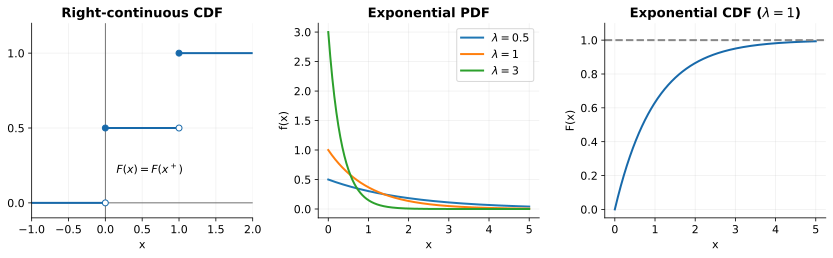
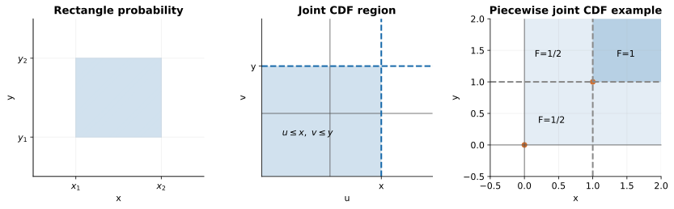
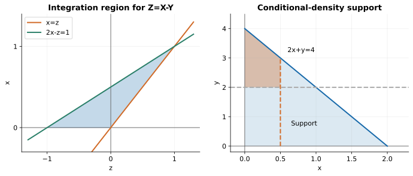
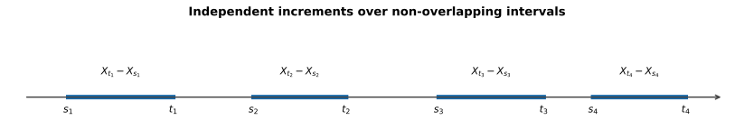
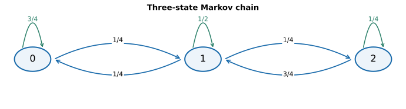

# Probability and Stochastic Processes · 笔记

## 1. 概率与事件

### 1.1 2 Experiment, Sample Space and Random Event

- **Random experiment：** 随机试验，简写为 $`E`$。

- $`\Omega`$：样本空间（sample space），是试验 $`E`$ 所有可能结果的集合。
- $`\omega`$：样本点（sample point），是样本空间中的一个元素。

| 试验 | Sample space |
|---|---|
| E1：Determination of the sex of a newborn child | $`\Omega_1=\{g,b\}`$（该例采用二分类模型） |
| E2：Roll a die and observe which number appears | $`\Omega_2=\{1,2,3,4,5,6\}`$ |
| E3：Flip two coins and observe the outcomes | $`\Omega_3=\{(H,H),(H,T),(T,H),(T,T)\}`$ |
| E4：Roll two dice and observe the outcomes | $`\Omega_4=\{(i,j):i,j\in\{1,2,3,4,5,6\}\}`$，共 $`36`$ 个样本点 |
| E5：Number of friends online at one time | $`\Omega_5=\{0,1,2,\ldots\}`$ |
| E6：Measure the lifetime of cars | $`\Omega_6=[0,+\infty)`$ |

样本空间的子集称为 random event / event（随机事件），通常用 $`A,B,C,\ldots`$ 表示。

- **Inevitable / certain event：** 必然事件，样本空间 $`\Omega`$ 本身。
- **Impossible event：** 不可能事件，记作 $`\varnothing`$。

| Notation | Set jargon | Probability jargon |
|---|---|---|
| $`\Omega`$ | Collection of objects / whole space | Sample space / certain event |
| $`\omega`$ | Member of $`\Omega`$ | Elementary outcome |
| $`A`$ | Subset of $`\Omega`$ | Some outcome in $`A`$ occurs |
| $`\overline A`$ 或 $`A^c`$ | Complement of $`A`$ | No outcome in $`A`$ occurs |
| $`A\cap B`$ | Intersection | Both $`A`$ and $`B`$ occur |
| $`A\cup B`$ | Union | Either $`A`$ or $`B`$, or both |
| $`A-B`$ | Difference | $`A`$ occurs, but $`B`$ does not |
| $`A\subseteq B`$ | Inclusion | If $`A`$ occurs, then $`B`$ occurs |
| $`\varnothing`$ | Empty set | Impossible event |

#### 1.1.1 事件关系与运算

- $`A\subseteq B`$：$`A`$ 包含于 $`B`$；$`A=B`$ 当且仅当 $`A\subseteq B`$ 且 $`B\subseteq A`$。
- **Union（并）：**$`A\cup B`$，表示 $`A`$ 发生或 $`B`$ 发生。

  $`\displaystyle \bigcup_{k=1}^nA_k=A_1\cup A_2\cup\cdots\cup A_n,`$

  $`\displaystyle \bigcup_{k=1}^{\infty}A_k=A_1\cup A_2\cup\cdots.`$

- **Intersection（交）：**$`A\cap B`$，也记作 $`AB`$，表示 $`A,B`$ 同时发生。
- **Difference（差）：**$`A-B=A\cap B^c`$，表示 $`A`$ 发生而 $`B`$ 不发生。
- **Disjoint / mutually exclusive（互斥）：**$`AB=\varnothing`$，两事件不可能同时发生。
- **Pairwise disjoint（两两互斥）：** 当 $`i\ne j`$ 时总有 $`A_iA_j=\varnothing`$。
- **Complement（补集）：**$`\overline A`$ 或 $`A^c`$。

若 $`AB=\varnothing`$，则 $`P(A\cup B)=P(A)+P(B)`$。

#### 1.1.2 集合的性质

1. **Commutativity（交换律）：**$`A\cup B=B\cup A`$，$`AB=BA`$。
2. **Associativity（结合律）：**$`A\cup(B\cup C)=(A\cup B)\cup C=A\cup B\cup C`$；$`A(BC)=(AB)C=ABC`$。
3. **Distributivity（分配律）：**

   $`\displaystyle A\cup(B\cap C)=(A\cup B)\cap(A\cup C),`$

   $`\displaystyle A(B\cup C)=(AB)\cup(AC).`$

4. **De Morgan's law（德摩根律）：**

   $`\displaystyle \overline{A\cup B}=\overline A\cap\overline B,\qquad \overline{A\cap B}=\overline A\cup\overline B.`$

   更一般地，

   $`\displaystyle \overline{\bigcup_iA_i}=\bigcap_i\overline{A_i},\qquad \overline{\bigcap_iA_i}=\bigcup_i\overline{A_i}.`$

补充恒等式（也要会逆向使用）：

```math
A-B=A-AB=A\overline B,
```

```math
A\cup B=A\cup\overline AB,
```

```math
A\cup B\cup C=A\cup\overline AB\cup\overline A\,\overline B C.
```

右侧各项两两互斥。

### 1.2 3 事件的概率

#### 1.2.1 Classical Probability：古典概型

**适用条件：**

- 样本点有限。
- 所有 outcome 等可能。

这样的样本空间称为 **simple sample space**。若样本空间有 $`n`$ 个基本结果，事件 $`A`$ 包含其中 $`k`$ 个，则

```math
P(A)=\frac kn=\frac{\#A}{\#\Omega}.
```

#### 1.2.2 Geometric Probability：几何概型

样本空间具有有限的长度、面积或体积，并按该度量均匀选点；概率只与所占度量有关，与位置无关：

```math
P(A)=\frac{L(A)}{L(\Omega)},\qquad P(\varnothing)=0.
```

#### 1.2.3 Frequency：频率

做 $`n`$ 次试验，记 $`f_n(A)`$ 为事件 $`A`$ 出现的次数，则相对频率为

```math
F_n(A)=\frac{f_n(A)}n.
```

$`n`$ 足够大时，在相应的大数定律条件下，$`F_n(A)`$ 接近 $`P(A)`$。

### 1.3 4 Probability Space

#### 1.3.1 $`\sigma`$-algebra（不考）

事件集合族 $`\mathcal F`$ 是 $`\sigma`$-代数，若：

1. $`\Omega\in\mathcal F`$。
2. 若 $`F\in\mathcal F`$，则 $`\overline F\in\mathcal F`$。
3. 若 $`F_n\in\mathcal F`$，则 $`\bigcup_{n=1}^{\infty}F_n\in\mathcal F`$。

#### 1.3.2 概率公理

满足以下三条时，$`P`$ 称为概率：

1. **非负性：** 对每个 $`A\in\mathcal F`$，$`P(A)\ge0`$。
2. **规范性：**$`P(\Omega)=1`$。
3. **Countable additivity（可列可加性）：** 若 $`A_i`$ 两两互斥，

   $`\displaystyle P\left(\bigcup_{i=1}^{\infty}A_i\right)=\sum_{i=1}^{\infty}P(A_i).`$

由此得到：

- $`P(\varnothing)=0`$。
- **有限可加性：** 两两互斥的 $`A_i`$ 满足 $`P(\bigcup_{i=1}^nA_i)=\sum_{i=1}^nP(A_i)`$。
- $`P(\overline A)=1-P(A)`$。
- 若 $`A\subseteq B`$，则 $`P(B-A)=P(B)-P(A)`$，且 $`P(A)\le P(B)`$。
- $`0\le P(A)\le1`$。
- $`P(A\cup B)=P(A)+P(B)-P(AB)`$。容斥计算记忆为“奇加偶减”。

三个事件的容斥公式：

```math
\begin{aligned} P(A_1\cup A_2\cup A_3)={}&P(A_1)+P(A_2)+P(A_3)\\ &-P(A_1A_2)-P(A_2A_3)-P(A_1A_3)\\ &+P(A_1A_2A_3). \end{aligned}
```

一般地，

```math
P\left(\bigcup_{i=1}^nA_i\right)=\sum_iP(A_i)-\sum_{i\lt j}P(A_iA_j)+\sum_{i\lt j\lt k}P(A_iA_jA_k)-\cdots+(-1)^{n+1}P(A_1\cdots A_n).
```

### 1.4 5 条件概率

Conditional probability：在 $`B`$ 已发生的条件下，$`A`$ 发生的概率。

```math
P(A\mid B)=\frac{P(AB)}{P(B)},\qquad P(B)\gt 0.
```

条件概率本身也是概率，因此满足相应性质：

1. 若 $`A_i`$ 两两互斥，$`P(\bigcup_{i=1}^nA_i\mid B)=\sum_{i=1}^nP(A_i\mid B)`$。
2. $`P(\overline A\mid B)=1-P(A\mid B)`$。
3. $`P(A\cup C\mid B)=P(A\mid B)+P(C\mid B)-P(AC\mid B)`$。
4. 若 $`A\subseteq C`$，则 $`P(C-A\mid B)=P(C\mid B)-P(A\mid B)`$，且 $`P(A\mid B)\le P(C\mid B)`$。

#### 1.4.1 补充：二项分布

$`n`$ 次独立重复试验中，每次事件 $`A`$ 发生的概率为 $`p`$，$`X`$ 表示发生次数，则

```math
P(X=k)=\binom nkp^k(1-p)^{n-k},\quad k=0,1,\ldots,n.
```

#### 1.4.2 乘法公式

条件概率逆向使用：

```math
P(AB)=P(B)P(A\mid B)=P(A)P(B\mid A).
```

```math
P(A_1A_2A_3)=P(A_1)P(A_2\mid A_1)P(A_3\mid A_1A_2).
```

```math
P(A_1A_2\cdots A_n)=P(A_1)P(A_2\mid A_1)\cdots P(A_n\mid A_1\cdots A_{n-1}).
```

事件连续发生时，这个公式很好用；注意各条件事件的概率须非零。

#### 1.4.3 Partition 与全概率公式

$`B_1,\ldots,B_n`$ 构成样本空间的 partition（划分），要求：

1. $`B_i`$ 两两 disjoint。
2. $`\bigcup_{i=1}^nB_i=\Omega`$。

对情形进行划分，可得全概率公式：

```math
P(A)=\sum_{i=1}^nP(B_i)P(A\mid B_i).
```

#### 1.4.4 Bayes' Theorem：贝叶斯公式

由结果找原因：

```math
P(B_i\mid A)=\frac{P(B_i)P(A\mid B_i)}{\sum_{j=1}^nP(B_j)P(A\mid B_j)}.
```

简化形式：

```math
P(B\mid A)=\frac{P(AB)}{P(A)}=\frac{P(A\mid B)P(B)}{P(A)}.
```

贝叶斯公式可以实现 $`P(B\mid A)`$ 与 $`P(A\mid B)`$ 之间的转换。

例：已知 $`P(A)=0.5`$、$`P(B)=0.6`$、$`P(B\mid\overline A)=0.4`$，求 $`P(B\mid A)`$。

```math
P(B)=P(B\mid A)P(A)+P(B\mid\overline A)P(\overline A),
```

故

```math
P(B\mid A)=\frac{0.6-0.4\times0.5}{0.5}=0.8.
```

也可以先转换条件：

```math
P(A\mid B)=\frac{P(B\mid A)P(A)}{P(B)},\qquad P(\overline A\mid B)=1-P(A\mid B),
```

```math
P(B\mid\overline A)=\frac{P(\overline A\mid B)P(B)}{P(\overline A)}.
```

### 1.5 6 Independence of Events

定义：$`A,B`$ 独立，当且仅当

```math
P(AB)=P(A)P(B).
```

- **互斥与独立：** 若 $`A,B`$ 互斥且二者概率均为正，则它们不独立，因为 $`P(AB)=0`$。概率为零的事件是上述结论的例外。
- **条件概率判定：** 在条件概率有定义时，独立等价于 $`P(A\mid B)=P(A)`$。
- **补事件：** 若 $`A,B`$ 独立，则 $`A`$ 与 $`\overline B`$、$`\overline A`$ 与 $`B`$、$`\overline A`$ 与 $`\overline B`$ 也独立。

#### 1.5.1 Pairwise 与 Mutually Independent

- **两两独立：** 三个事件两两独立，要求

  $`\displaystyle P(AB)=P(A)P(B),\quad P(BC)=P(B)P(C),\quad P(AC)=P(A)P(C).`$

- **相互独立：** 除以上三条外，还要求

  $`\displaystyle P(ABC)=P(A)P(B)P(C).`$

$`n`$ 个事件两两独立需要验证 $`\binom n2`$ 个等式；相互独立需要验证所有至少含两项的乘法等式，共

```math
\binom n2+\binom n3+\cdots+\binom nn=2^n-n-1
```

个。这里使用了二项式恒等式 $`\sum_{k=0}^n\binom nk=2^n`$。

相互独立时，任取子集 $`A_{i_1},\ldots,A_{i_k}`$，并将其中任意事件替换为其补事件，仍满足

```math
P(A_{i_1}^*\cdots A_{i_k}^*)=P(A_{i_1}^*)\cdots P(A_{i_k}^*),\quad k=2,3,\ldots,n,
```

其中每个 $`A_i^*`$ 选为 $`A_i`$ 或 $`\overline{A_i}`$，等式两边选择保持一致。

#### 1.5.2 Bernoulli Trials：伯努利试验

$`n`$ 次独立重复试验中，成功概率为 $`p`$、失败概率为 $`q=1-p`$，恰好成功 $`k`$ 次的概率为

```math
P_n(k)=P_n(\#S=k)=\binom nkp^kq^{n-k}.
```

## 2. Random Variable

### 2.1 1 随机变量与分布函数的定义

**Random variable：** 把随机试验的结果映射为具体数值的函数 $`X=X(\omega)`$。

例：抛一枚公平硬币，令 $`X=\#H`$：

```math
X(\omega)=\begin{cases}1,&\omega=\text{Head},\\0,&\omega=\text{Tail}.\end{cases}
```

$`X`$ 是随机变量，$`0,1`$ 是 possible values，Head、Tail 是对应的随机结果；

```math
P(X=0)=\frac12,\qquad P(X=1)=\frac12.
```

Distribution function（d.f. / c.d.f.）：

```math
F(x)=P(X\le x),\qquad x\in\mathbb R.
```

把不大于 $`x`$ 的所有取值的概率加在一起。

### 2.2 2 分布函数

#### 2.2.1 性质

1. **单调不减：**$`x_1\lt x_2\Rightarrow F(x_1)\le F(x_2)`$。
2. $`\lim_{x\to-\infty}F(x)=0`$，$`\lim_{x\to+\infty}F(x)=1`$。
3. **右连续：** 每一点都有 $`F(x)=F(x^+)`$。

#### 2.2.2 区间概率（连续、离散情形均适用）

```math
P(X\gt x)=1-F(x),\qquad P(X\lt x)=F(x^-),
```

```math
P(X=x)=F(x)-F(x^-).
```

对于 $`x_1\lt x_2`$：

```math
P(x_1\lt X\le x_2)=F(x_2)-F(x_1),
```

```math
P(x_1\lt X\lt x_2)=F(x_2^-)-F(x_1),
```

```math
P(x_1\le X\lt x_2)=F(x_2^-)-F(x_1^-),
```

```math
P(x_1\le X\le x_2)=F(x_2)-F(x_1^-).
```

**记忆：** 左开右闭直接相减，其余情形通过左极限调整端点。

#### 2.2.3 离散型随机变量

```math
F(x)=P(X\le x)=\sum_{x_k\le x}P(X=x_k).
```

#### 2.2.4 连续型随机变量

密度函数 $`f(x)`$（p.d.f.）满足

```math
f(x)\ge0,\qquad\int_{-\infty}^{\infty}f(x)\,dx=1.
```

```math
P(X\in A)=\int_Af(x)\,dx,
```

```math
F(x)=P(X\le x)=\int_{-\infty}^xf(t)\,dt.
```

在 $`F`$ 可导的点，$`F'(x)=f(x)`$。连续型随机变量的单点概率 $`P(X=x)=0`$，因此

```math
P(a\le X\le b)=\int_a^bf(x)\,dx,
```

且区间端点开闭不影响概率。

**术语：**

- **p.f. / p.m.f.：** probability function（概率函数，p.m.f. 用于离散情形）。
- **p.d.f.：** 密度函数 $`f(x)`$。
- **d.f. / c.d.f.：** 分布函数 $`F(x)`$。

### 2.3 随机变量函数的分布

#### 2.3.1 离散型：合并同一函数值的概率

若 $`Y=g(X)`$，则

```math
p_Y(y)=P(Y=y)=\sum_{x:g(x)=y}p_X(x).
```

例：

| $`x`$ | $`-1`$ | $`0`$ | $`1`$ |
|---|---|---|---|
| $`p_X(x)`$ | $`1/4`$ | $`1/4`$ | $`1/2`$ |

令 $`Y=2X`$、$`W=X^2`$。则

```math
p_Y(-2)=P(X=-1)=\frac14,\quad p_Y(0)=P(X=0)=\frac14,\quad p_Y(2)=P(X=1)=\frac12.
```

| $`y`$ | $`-2`$ | $`0`$ | $`2`$ |
|---|---|---|---|
| $`p_Y(y)`$ | $`1/4`$ | $`1/4`$ | $`1/2`$ |

而

```math
p_W(0)=P(X=0)=\frac14,
```

```math
p_W(1)=P(X=-1)+P(X=1)=\frac34.
```

| $`w`$ | $`0`$ | $`1`$ |
|---|---|---|
| $`p_W(w)`$ | $`1/4`$ | $`3/4`$ |

#### 2.3.2 题型 1：离散变量的单调变换

Suppose the p.f. of $`X`$ is

```math
p_X(x)=(1-p)^{x-1}p,\qquad x=1,2,\ldots,\quad0\lt p\lt 1.
```

令 $`Y=X^2`$。由于 $`X`$ 只取正整数，平方变换在该取值范围上一一对应：

```math
p_Y(y)=P(Y=y)=P(X^2=y)=p_X(\sqrt y) =(1-p)^{\sqrt y-1}p,\qquad y=1,4,9,\ldots.
```

其他 $`y`$ 的概率为零。

#### 2.3.3 题型 2：分布函数法

Let $`X`$ be a continuous nonnegative random variable with density

```math
f_X(x)=\begin{cases}x/8,&0\lt x\lt 4,\\0,&\text{otherwise},\end{cases}
```

and let $`Y=2X+1`$. Find $`f_Y(y)`$.

1. **求 $`Y`$ 的分布函数**

   $`\displaystyle F_Y(y)=P(Y\le y)=P(2X+1\le y)=P\left(X\le\frac{y-1}2\right) =\int_{-\infty}^{(y-1)/2}f_X(x)\,dx.`$

2. **按取值范围分段**

   当 $`y\le1`$，$`F_Y(y)=0`$；当 $`1\lt y\lt 9`$，

   $`\displaystyle F_Y(y)=\int_0^{(y-1)/2}\frac x8\,dx=\frac{(y-1)^2}{64};`$

   当 $`y\ge9`$，$`F_Y(y)=1`$。所以

   $`\displaystyle F_Y(y)=\begin{cases}0,&y\le1,\\(y-1)^2/64,&1\lt y\lt 9,\\1,&y\ge9.\end{cases}`$

3. **求导得到密度**

   $`\displaystyle f_Y(y)=\begin{cases}(y-1)/32,&1\lt y\lt 9,\\0,&\text{otherwise}.\end{cases}`$

#### 2.3.4 题型 3：平方变换

Suppose $`X`$ is continuous with density $`f_X(x)`$. Find the density of $`Y=X^2`$.

当 $`y\lt 0`$，$`F_Y(y)=0`$。当 $`y\ge0`$，

```math
F_Y(y)=P(X^2\le y)=P(-\sqrt y\le X\le\sqrt y) =F_X(\sqrt y)-F_X(-\sqrt y).
```

也就是

```math
F_Y(y)=\int_{-\sqrt y}^{\sqrt y}f_X(t)\,dt.
```

对 $`y\gt 0`$ 求导：

```math
\begin{aligned} f_Y(y)&=f_X(\sqrt y)(\sqrt y)'-f_X(-\sqrt y)(-\sqrt y)'\\ &=\frac{f_X(\sqrt y)+f_X(-\sqrt y)}{2\sqrt y}. \end{aligned}
```

$`y\lt 0`$ 时密度为零。

#### 2.3.5 公式法

当 $`g`$ 在 $`X`$ 的取值区间上严格单调、可微且反函数满足相应可微条件时，$`Y=g(X)`$ 的密度为

```math
f_Y(y)=f_X(g^{-1}(y))\left\vert \frac d{dy}g^{-1}(y)\right\vert ,
```

其中 $`y`$ 位于 $`g`$ 的值域内；其他位置密度为零。

再次计算 $`f_X(x)=x/8`$（$`0\lt x\lt 4`$）、$`Y=2X+1`$：

```math
g^{-1}(y)=\frac{y-1}2,\qquad\frac d{dy}g^{-1}(y)=\frac12,
```

```math
f_Y(y)=\frac12\cdot\frac{(y-1)/2}{8}=\frac{y-1}{32},\quad1\lt y\lt 9,
```

其余为零，与分布函数法一致。

### 2.4 3 Expectation and Variance

#### 2.4.1 期望的定义

Expected value：

```math
\mu=E(X)=\begin{cases}\displaystyle\sum_i x_i p_X(x_i),&X\text{ 离散},\\ \displaystyle\int_{-\infty}^{\infty}xf_X(x)\,dx,&X\text{ 连续}.\end{cases}
```

- **有限期望的条件：** 绝对可积，$`E\vert X\vert \lt \infty`$。
- **Divergent：** 发散、不收敛。柯西分布的 $`\int\vert x\vert f_X(x)\,dx`$ 发散，通常意义下的期望不存在。

#### 2.4.2 随机变量函数的期望

$`Y=g(X)`$ 时，不必先求 $`Y`$ 的分布，可直接计算

```math
E[g(X)]=\begin{cases}\displaystyle\sum_i g(x_i)p_X(x_i),&X\text{ 离散},\\ \displaystyle\int_{-\infty}^{\infty}g(x)f_X(x)\,dx,&X\text{ 连续}.\end{cases}
```

**离散例子。** $`X`$ 取 $`-1,0,1`$，概率依次为 $`0.2,0.5,0.3`$，计算 $`E(X^2)`$。

令 $`Y=X^2`$，则 $`P(Y=1)=0.2+0.3=0.5`$、$`P(Y=0)=0.5`$，于是

```math
E(Y)=1\times0.5+0\times0.5=0.5.
```

直接计算也得到

```math
E(X^2)=(-1)^2\times0.2+0^2\times0.5+1^2\times0.3=0.5.
```

**连续例子。** $`f_X(x)=x/8`$（$`0\lt x\lt 4`$），$`Y=2X+1`$，计算 $`E(Y)`$。

已知 $`f_Y(y)=(y-1)/32`$（$`1\lt y\lt 9`$），则

```math
E(Y)=\int_1^9y\frac{y-1}{32}\,dy=\frac{19}3.
```

直接计算：

```math
E(2X+1)=\int_0^4(2x+1)\frac x8\,dx=\frac{19}3.
```

#### 2.4.3 期望的性质

1. $`E(aX+b)=aE(X)+b`$；把 $`X`$ 换成 $`g(X)`$ 同样成立。
2. $`E(c)=c`$，常数的期望是它本身。
3. 若 $`P(X\ge a)=1`$，则 $`E(X)\ge a`$；若 $`P(X\le b)=1`$，则 $`E(X)\le b`$。
4. 若 $`P(X\ge a)=1`$ 且 $`E(X)=a`$，则 $`P(X\gt a)=0`$、$`P(X=a)=1`$。
5. $`E[E(X)]=E(X)`$，因为 $`E(X)`$ 是常数。

以上涉及有限期望的等式，均以相应期望存在为前提。

#### 2.4.4 Variance：方差

```math
\sigma^2=\mathop{\mathrm{Var}}\nolimits(X)=E[(X-E(X))^2].
```

令 $`\mu=E(X)`$，则

```math
\mathop{\mathrm{Var}}\nolimits(X)=\begin{cases}\displaystyle\sum_i(x_i-\mu)^2p_X(x_i),&X\text{ 离散},\\ \displaystyle\int_{-\infty}^{\infty}(x-\mu)^2f_X(x)\,dx,&X\text{ 连续}.\end{cases}
```

- $`\mathop{\mathrm{Var}}\nolimits(X)\ge0`$。
- **Standard deviation（标准差）：**$`\sigma=\sqrt{\mathop{\mathrm{Var}}\nolimits(X)}`$。
- $`\mathop{\mathrm{Var}}\nolimits(X)=E(X^2)-[E(X)]^2`$。
- $`\mathop{\mathrm{Var}}\nolimits(aX+b)=a^2\mathop{\mathrm{Var}}\nolimits(X)`$。

标准化：当 $`0\lt \mathop{\mathrm{Var}}\nolimits(X)\lt \infty`$，令

```math
X^*=\frac{X-E(X)}{\sqrt{\mathop{\mathrm{Var}}\nolimits(X)}}.
```

则 $`E(X^*)=0`$、$`\mathop{\mathrm{Var}}\nolimits(X^*)=1`$。这里的标准化并不意味着 $`X^*`$ 一定服从正态分布。

#### 2.4.5 Moments：矩

- **原点矩：**$`E(X^k)`$。
- **中心矩：**$`E[(X-\mu)^k]`$。正态分布的奇数阶中心矩为零。
- 高阶绝对矩存在，则低阶绝对矩存在。

#### 2.4.6 应用

**Markov's inequality。** 若 $`X\ge0`$，则对任意 $`\varepsilon\gt 0`$，

```math
P(X\ge\varepsilon)\le\frac{E(X)}\varepsilon.
```

**Chebyshev's inequality。** 若 $`E(X)=\mu`$、$`\mathop{\mathrm{Var}}\nolimits(X)=\sigma^2\lt \infty`$，则对任意 $`\varepsilon\gt 0`$，

```math
P(\vert X-\mu\vert \ge\varepsilon)\le\frac{\sigma^2}{\varepsilon^2}.
```

### 2.5 4 离散型随机变量的常用分布

#### 2.5.1 Binomial Distribution：二项分布

```math
X\sim B(n,p),\qquad P(X=x)=\binom nxp^xq^{n-x},\quad x=0,1,\ldots,n,
```

其中 $`p+q=1`$。

```math
E(X)=np,\qquad\mathop{\mathrm{Var}}\nolimits(X)=np(1-p).
```

**Poisson limit theorem。** 若 $`n\to\infty`$ 时 $`np_n\to\lambda`$，$`\lambda\gt 0`$ 为常数，则对固定非负整数 $`x`$，

```math
\lim_{n\to\infty}\binom nxp_n^x(1-p_n)^{n-x}=e^{-\lambda}\frac{\lambda^x}{x!}.
```

#### 2.5.2 Poisson Distribution：泊松分布

```math
X\sim\mathop{\mathrm{Poisson}}\nolimits(\lambda),\qquad P(X=x)=\frac{e^{-\lambda}\lambda^x}{x!},\quad x=0,1,\ldots.
```

$`X`$ 通常表示次数，且

```math
\sum_{x=0}^{\infty}\frac{e^{-\lambda}\lambda^x}{x!}=1,
```

```math
E(X)=\mathop{\mathrm{Var}}\nolimits(X)=\lambda.
```

二项分布中 $`n`$ 很大、$`p`$ 很小时，可用泊松分布近似，令 $`\lambda=np`$。笔记中的经验条件是 $`n\gt 20`$、$`p\lt 0.05`$，实际精度仍与参数及所求概率有关。

满足泊松过程假设时，某事件在一个时间或空间区间内的发生次数服从泊松分布。

例：某医院平均每小时有 $`1.5`$ 个孩子出生，求一小时恰有 $`4`$ 个孩子出生的概率。

```math
\lambda=1.5,\qquad P(X=4)=\frac{e^{-1.5}1.5^4}{4!}.
```

注意：观察的时间长度改变时，均值参数 $`\lambda`$ 也要按时间长度改变。

### 2.6 5 连续型随机变量的常用分布

#### 2.6.1 Uniform Distribution：均匀分布

```math
X\sim U(a,b),\quad a\lt b,
```

```math
f_X(x)=\begin{cases}1/(b-a),&a\le x\le b,\\0,&\text{otherwise}.\end{cases}
```

$`b-a`$ 是区间宽度，可视为尺度参数。

```math
E(X)=\frac{a+b}2,\qquad\mathop{\mathrm{Var}}\nolimits(X)=\frac{(b-a)^2}{12}.
```

Standard uniform distribution：$`a=0,b=1`$，即 $`X\sim U(0,1)`$。

```math
f_X(x)=\begin{cases}1,&0\le x\le1,\\0,&\text{otherwise},\end{cases}
```

```math
F_X(x)=\begin{cases}0,&x\lt 0,\\x,&0\le x\lt 1,\\1,&x\ge1.\end{cases}
```

#### 2.6.2 Exponential Distribution：指数分布

```math
X\sim\mathop{\mathrm{Exp}}\nolimits(\lambda),\qquad\lambda\gt 0,
```

```math
f_X(x)=\begin{cases}\lambda e^{-\lambda x},&x\gt 0,\\0,&x\le0.\end{cases}
```

- **参数：** $`\lambda`$ 是 rate parameter（率参数），尺度参数为 $`1/\lambda`$。
- **用途：** 常用于描述泊松过程中两次事件发生之间的等待时间。
- **标准形式：** $`\lambda=1`$ 时为标准指数分布。

```math
F_X(x)=\begin{cases}1-e^{-\lambda x},&x\ge0,\\0,&x\lt 0,\end{cases}
```

```math
E(X)=\frac1\lambda,\qquad\mathop{\mathrm{Var}}\nolimits(X)=\frac1{\lambda^2}.
```

**Memoryless property（无记忆性）：**

```math
P(X\gt t+s\mid X\gt t)=P(X\gt s),\qquad s,t\ge0.
```

指数分布密度在 $`x=0^+`$ 处为 $`\lambda`$，随后单调下降；$`\lambda`$ 越大，下降越快。分布函数由 $`0`$ 单调上升并趋近于 $`1`$。



#### 2.6.3 Normal Distribution：正态分布

```math
X\sim N(\mu,\sigma^2),\qquad\sigma\gt 0,
```

```math
f_X(x)=\frac1{\sqrt{2\pi}\sigma}\exp\left[-\frac{(x-\mu)^2}{2\sigma^2}\right],\quad-\infty\lt x\lt \infty.
```

```math
\int_{-\infty}^{\infty}f_X(x)\,dx=1,\qquad \int_{-\infty}^{\infty}e^{-y^2/2}\,dy=\sqrt{2\pi}.
```

```math
E(X)=\mu,\qquad\mathop{\mathrm{Var}}\nolimits(X)=\sigma^2.
```

性质：

1. 关于 $`\mu`$ 对称：$`f_X(\mu+x)=f_X(\mu-x)`$。
2. $`f_{\max}=f_X(\mu)=1/(\sqrt{2\pi}\sigma)`$，$`F_X(\mu)=1/2`$。
3. $`\mu`$ 为 location parameter（位置参数）；$`\sigma`$ 为 scale parameter（尺度参数），$`\sigma^2`$ 控制分布的离散程度。
4. 若 $`Y=aX+b`$，$`a\ne0`$，则 $`Y\sim N(a\mu+b,a^2\sigma^2)`$。

#### 2.6.4 标准正态分布

$`\mu=0`$、$`\sigma^2=1`$ 时为标准正态分布。若 $`X\sim N(\mu,\sigma^2)`$，则

```math
Z=\frac{X-\mu}{\sigma}\sim N(0,1).
```

记标准正态密度为 $`\phi`$，分布函数为 $`\Phi`$：

```math
\phi(z)=\frac1{\sqrt{2\pi}}e^{-z^2/2},\qquad \Phi(z)=\int_{-\infty}^z\phi(t)\,dt.
```

```math
F_X(x)=\Phi\left(\frac{x-\mu}\sigma\right).
```

因此

```math
P(a\le X\le b)=\Phi\left(\frac{b-\mu}\sigma\right)-\Phi\left(\frac{a-\mu}\sigma\right),
```

```math
P(X\le a)=\Phi\left(\frac{a-\mu}\sigma\right),\qquad P(X\ge b)=1-\Phi\left(\frac{b-\mu}\sigma\right).
```

```math
\Phi(x)+\Phi(-x)=1,\qquad\Phi(0)=\frac12.
```

#### 2.6.5 Geometric Distribution：几何分布

独立重复伯努利试验中，$`X`$ 表示获得第一次成功所需的试验次数，成功概率为 $`p`$：

```math
P(X=x)=(1-p)^{x-1}p,\qquad x=1,2,\ldots.
```

```math
E(X)=\frac1p,\qquad\mathop{\mathrm{Var}}\nolimits(X)=\frac{1-p}{p^2}.
```

## 3. Random Vectors

### 3.1 1 Random Vectors and Joint Distributions

#### 3.1.1 随机向量与联合分布

Joint distribution function（j.d.f.）：

```math
F(x,y)=P(X\le x,Y\le y),\qquad x,y\in\mathbb R.
```

```math
P(X\le x,y_1\lt Y\le y_2)=F(x,y_2)-F(x,y_1).
```

对于 $`x_1\lt x_2`$、$`y_1\lt y_2`$，

```math
\begin{aligned} P(x_1\lt X\le x_2,y_1\lt Y\le y_2) ={}&F(x_2,y_2)-F(x_1,y_2)\\ &-F(x_2,y_1)+F(x_1,y_1)\ge0. \end{aligned}
```

上述矩形事件是平面上以 $`(x_1,y_1)`$、$`(x_2,y_1)`$、$`(x_1,y_2)`$、$`(x_2,y_2)`$ 为四个顶点的区域。

#### 3.1.2 联合分布函数的性质

1. 对每个变量分别单调不减：$`x_1\lt x_2\Rightarrow F(x_1,y)\le F(x_2,y)`$，对 $`y`$ 同理。
2. 极限：$`F(-\infty,y)=F(x,-\infty)=0`$，$`F(+\infty,+\infty)=1`$。
3. 对每个变量右连续：

   $`\displaystyle \lim_{x\downarrow x_0}F(x,y)=F(x_0,y),\qquad \lim_{y\downarrow y_0}F(x,y)=F(x,y_0).`$

4. Marginal distributions（边缘分布）：

   $`\displaystyle F_Y(y)=\lim_{x\to\infty}F(x,y),\qquad F_X(x)=\lim_{y\to\infty}F(x,y).`$

边缘概率函数 / 密度是将另一个变量消去：

```math
p_X(x)=\sum_y p(x,y),\qquad f_X(x)=\int_{-\infty}^{\infty}f(x,y)\,dy.
```

#### 3.1.3 对立事件的计算

```math
\{X\gt x,Y\gt y\}^c=\{X\le x\}\cup\{Y\le y\}.
```

因此

```math
\begin{aligned} P(X\gt x,Y\gt y) &=1-P(\{X\le x\}\cup\{Y\le y\})\\ &=1-[P(X\le x)+P(Y\le y)-P(X\le x,Y\le y)]\\ &=1-F_X(x)-F_Y(y)+F(x,y). \end{aligned}
```

#### 3.1.4 Discrete Random Vectors

Joint p.f.（联合概率函数）：

```math
p(x,y)=P(\{X=x\}\cap\{Y=y\})=P(X=x,Y=y).
```

性质：

```math
p(x_j,y_k)\ge0,\qquad\sum_j\sum_kp(x_j,y_k)=1.
```

Marginal probability functions：

```math
p_X(x)=\sum_y p(x,y),\qquad p_Y(y)=\sum_xp(x,y).
```

联合分布函数由左下区域的所有概率相加得到：

```math
F(x,y)=\sum_{x_j\le x}\sum_{y_k\le y}p(x_j,y_k).
```

**3.1.4.1 Example：由联合概率表求联合分布函数。**

| $`y\backslash x`$ | $`0`$ | $`1`$ |
|---|---|---|
| $`0`$ | $`1/2`$ | $`0`$ |
| $`1`$ | $`0`$ | $`1/2`$ |

用分块法，按直线 $`x=0,x=1,y=0,y=1`$ 分割平面：

```math
F(x,y)=\begin{cases} 0,&x\lt 0\text{ 或 }y\lt 0,\\ 1/2,&x\ge0,y\ge0\text{ 且 }(x\lt 1\text{ 或 }y\lt 1),\\ 1,&x\ge1,y\ge1. \end{cases}
```

另一个 joint probability table，最后一列及最后一行给出边缘概率：

| $`y\backslash x`$ | $`-1`$ | $`0`$ | $`1`$ | $`p_Y(y)`$ |
|---|---|---|---|---|
| $`0`$ | $`1/4`$ | $`0`$ | $`1/4`$ | $`1/2`$ |
| $`1`$ | $`0`$ | $`1/2`$ | $`0`$ | $`1/2`$ |
| $`p_X(x)`$ | $`1/4`$ | $`1/2`$ | $`1/4`$ | $`1`$ |



#### 3.1.5 Continuous Random Vectors

Joint p.d.f.（联合密度）：

```math
F(x,y)=\int_{-\infty}^y\int_{-\infty}^x f(u,v)\,du\,dv.
```

```math
f(x,y)\ge0,\qquad\int_{-\infty}^{\infty}\int_{-\infty}^{\infty}f(x,y)\,dx\,dy=1.
```

在相应偏导存在且满足密度条件的地方，

```math
f(x,y)=\frac{\partial^2F(x,y)}{\partial x\partial y}.
```

计算技巧：当区域是直积区域且函数可分离时，二重积分可以分离。例如

```math
\int_a^b\int_c^d e^{x+y}\,dy\,dx =\left(\int_a^be^x\,dx\right)\left(\int_c^de^y\,dy\right).
```

Marginal probability density functions：

```math
f_X(x)=\int_{-\infty}^{\infty}f(x,y)\,dy,\qquad f_Y(y)=\int_{-\infty}^{\infty}f(x,y)\,dx.
```

概率计算就是对相应区域积分，例如

```math
P(2X\gt 1)=\iint_{x\gt 1/2}f(x,y)\,dx\,dy.
```

求 $`F(x,y)`$ 时，按支持集与 $`(-\infty,x]\times(-\infty,y]`$ 的交集分类讨论、分段积分。只涉及 $`X`$ 的事件可先求边缘密度：

```math
P(1\lt X\le2)=\int_1^2f_X(x)\,dx.
```

#### 3.1.6 二维正态分布

了解形式即可，不需要背。

二维正态密度为

```math
f(x,y)=\frac1{2\pi\sigma_1\sigma_2\sqrt{1-\rho^2}} \exp\left\{-\frac1{2(1-\rho^2)}\left[ \frac{(x-\mu_1)^2}{\sigma_1^2} -2\rho\frac{(x-\mu_1)(y-\mu_2)}{\sigma_1\sigma_2} +\frac{(y-\mu_2)^2}{\sigma_2^2} \right]\right\},
```

其中 $`x,y,\mu_1,\mu_2\in\mathbb R`$，$`\sigma_1,\sigma_2\gt 0`$，$`-1\lt \rho\lt 1`$。记为

```math
(X,Y)\sim N(\mu_1,\mu_2;\sigma_1^2,\sigma_2^2;\rho).
```

边缘密度分别为

```math
f_X(x)=\frac1{\sqrt{2\pi}\sigma_1}e^{-(x-\mu_1)^2/(2\sigma_1^2)},\quad X\sim N(\mu_1,\sigma_1^2),
```

```math
f_Y(y)=\frac1{\sqrt{2\pi}\sigma_2}e^{-(y-\mu_2)^2/(2\sigma_2^2)},\quad Y\sim N(\mu_2,\sigma_2^2).
```

### 3.2 2 Independence of Random Variables

定义：$`X`$ 与 $`Y`$ 独立（记作 $`X\perp Y`$），当且仅当对任意 $`x,y`$，

```math
F(x,y)=F_X(x)F_Y(y).
```

等价判定：

- 离散情形：对所有取值，$`p(x,y)=p_X(x)p_Y(y)`$。
- 连续情形：联合密度几乎处处满足 $`f(x,y)=f_X(x)f_Y(y)`$。

若 $`(X,Y)`$ 联合服从二维正态分布，则

```math
X\perp Y\quad\Longleftrightarrow\quad\rho=0.
```

若 $`X,Y`$ 独立，则对任意可测实函数 $`g,h`$，$`g(X)`$ 与 $`h(Y)`$ 也独立。

- **支持区域：** 对于独立的连续变量，密度非零的支持区域应能写为两个边缘支持集的直积；当两个边缘支持均为区间时，区域呈矩形。
- **判定限制：** 这是辅助判断，仍需检验密度能否分解。

### 3.3 3 Conditional Distributions

#### 3.3.1 Discrete Case

```math
p_{X\mid Y}(x\mid y)=P(X=x\mid Y=y) =\frac{P(X=x,Y=y)}{P(Y=y)}=\frac{p(x,y)}{p_Y(y)},\quad p_Y(y)\gt 0.
```

```math
p_{Y\mid X}(y\mid x)=P(Y=y\mid X=x) =\frac{P(X=x,Y=y)}{P(X=x)}=\frac{p(x,y)}{p_X(x)},\quad p_X(x)\gt 0.
```

#### 3.3.2 Continuous Case

The conditional probability density function：

```math
f_{X\mid Y}(x\mid y)=\frac{f(x,y)}{f_Y(y)},\quad0\lt f_Y(y)\lt \infty,
```

```math
f_{Y\mid X}(y\mid x)=\frac{f(x,y)}{f_X(x)},\quad0\lt f_X(x)\lt \infty.
```

分母为零的位置不由上述比例式确定，可任意指定一个版本，不影响概率计算。

#### 3.3.3 参数与变量

在 $`p_{Y\mid X}(y\mid x)`$ 或 $`f_{Y\mid X}(y\mid x)`$ 中，$`x`$ 是给定的 parameter（参数），$`y`$ 是 variable（变量）。

**写二元条件分布的步骤：**

1. 写出**参数的取值范围**。
2. 写出**给定参数下变量的取值范围**。

#### 3.3.4 Example：条件密度与条件事件

Given

```math
f(x,y)=\begin{cases}\dfrac3{16}(4-2x-y),&x\gt 0,\ y\gt 0,\ 2x+y\lt 4,\\0,&\text{otherwise}.\end{cases}
```

- **(a)** Determine $`f_{Y\mid X}(y\mid x)`$.

- **(b)** Determine $`P(Y\ge2\mid X\le1/2)`$.

- **(c)** Determine $`P(Y\ge2\mid X=1/2)`$.

**Solution (a).** 先求边缘密度。若 $`0\lt x\lt 2`$，

```math
f_X(x)=\int_0^{4-2x}\frac3{16}(4-2x-y)\,dy=\frac38(2-x)^2.
```

因此

```math
f_X(x)=\begin{cases}\dfrac38(2-x)^2,&0\lt x\lt 2,\\0,&\text{otherwise}.\end{cases}
```

给定 $`0\lt x\lt 2`$ 时，

```math
f_{Y\mid X}(y\mid x)=\frac{f(x,y)}{f_X(x)} =\begin{cases}\dfrac{4-2x-y}{2(2-x)^2},&0\lt y\lt 4-2x,\\0,&\text{otherwise}.\end{cases}
```

**Solution (b).** 按条件概率定义，

```math
P(Y\ge2\mid X\le1/2) =\frac{P(X\le1/2,Y\ge2)}{P(X\le1/2)}.
```

分子为

```math
\int_0^{1/2}\int_2^{4-2x}\frac3{16}(4-2x-y)\,dy\,dx =\int_0^{1/2}\left(\frac38-\frac34x+\frac38x^2\right)\,dx=\frac7{64}.
```

分母为

```math
\int_0^{1/2}\frac38(2-x)^2\,dx=\frac{37}{64}.
```

所以条件概率为 $`7/37`$。

**Solution (c).** 将 $`x=1/2`$ 代入条件密度：

```math
f_{Y\mid X}(y\mid1/2)=\begin{cases}2(3-y)/9,&0\lt y\lt 3,\\0,&\text{otherwise}.\end{cases}
```

```math
P(Y\ge2\mid X=1/2)=\int_2^3\frac{2(3-y)}9\,dy=\frac19.
```

了解：二维正态分布的条件分布仍为正态分布。

### 3.4 4 One Function of Two Random Variables

#### 3.4.1 Discrete Case

若 $`X,Y`$ 是独立的整数值离散随机变量，则

```math
p_{X+Y}(n)=\sum_kp_X(k)p_Y(n-k)=(p_X*p_Y)(n),
```

即两个概率函数的卷积。

一般联合概率表中，按**函数值**将表格单元分组相加：

- **$`X+Y`$：** 沿和相同的斜线求和。
- **$`\min(X,Y)`$：** 收集最小值相同的单元。
- **$`\max(X,Y)`$：** 收集最大值相同的单元。

**Example.** Assume the joint p.f. of $`(X,Y)`$ is given by the following table. Determine the probability functions of (a) $`X+Y`$, (b) $`\min(X,Y)`$ and (c) $`\max(X,Y)`$.

| $`y\backslash x`$ | $`0`$ | $`1`$ | $`2`$ | $`3`$ | $`4`$ | $`5`$ |
|---|---|---|---|---|---|---|
| $`0`$ | $`0`$ | $`0.01`$ | $`0.03`$ | $`0.05`$ | $`0.07`$ | $`0.09`$ |
| $`1`$ | $`0.01`$ | $`0.02`$ | $`0.04`$ | $`0.05`$ | $`0.06`$ | $`0.08`$ |
| $`2`$ | $`0.01`$ | $`0.03`$ | $`0.05`$ | $`0.05`$ | $`0.05`$ | $`0.06`$ |
| $`3`$ | $`0.01`$ | $`0.02`$ | $`0.04`$ | $`0.06`$ | $`0.06`$ | $`0.05`$ |

**(a) $`S=X+Y`$：**

| $`s`$ | $`0`$ | $`1`$ | $`2`$ | $`3`$ | $`4`$ | $`5`$ | $`6`$ | $`7`$ | $`8`$ |
|---|---|---|---|---|---|---|---|---|---|
| $`p_S(s)`$ | $`0`$ | $`0.02`$ | $`0.06`$ | $`0.13`$ | $`0.19`$ | $`0.24`$ | $`0.19`$ | $`0.12`$ | $`0.05`$ |

**(b) $`U=\min(X,Y)`$：**

| $`u`$ | $`0`$ | $`1`$ | $`2`$ | $`3`$ |
|---|---|---|---|---|
| $`p_U(u)`$ | $`0.28`$ | $`0.30`$ | $`0.25`$ | $`0.17`$ |

**(c) $`V=\max(X,Y)`$：**

| $`v`$ | $`0`$ | $`1`$ | $`2`$ | $`3`$ | $`4`$ | $`5`$ |
|---|---|---|---|---|---|---|
| $`p_V(v)`$ | $`0`$ | $`0.04`$ | $`0.16`$ | $`0.28`$ | $`0.24`$ | $`0.28`$ |

独立随机变量的分布可加性：

- 若 $`X\sim B(n_1,p)`$、$`Y\sim B(n_2,p)`$ 且 $`X\perp Y`$，则 $`X+Y\sim B(n_1+n_2,p)`$。成功概率 $`p`$ 必须相同。
- 若 $`X\sim\mathop{\mathrm{Poisson}}\nolimits(\lambda)`$、$`Y\sim\mathop{\mathrm{Poisson}}\nolimits(\mu)`$ 且独立，则 $`X+Y\sim\mathop{\mathrm{Poisson}}\nolimits(\lambda+\mu)`$。
- 以上结论均可推广到多个相互独立变量的和。

#### 3.4.2 Continuous Case

##### 3.4.2.1 $`Z=X+Y`$

```math
F_Z(z)=\iint_{x+y\le z}f(x,y)\,dx\,dy =\int_{-\infty}^{\infty}\int_{-\infty}^{z-x}f(x,y)\,dy\,dx.
```

令 $`v=x+y`$，则

```math
F_Z(z)=\int_{-\infty}^{\infty}\int_{-\infty}^{z}f(x,v-x)\,dv\,dx =\int_{-\infty}^{z}\left[\int_{-\infty}^{\infty}f(x,v-x)\,dx\right]dv.
```

因此

```math
f_Z(z)=\int_{-\infty}^{\infty}f(x,z-x)\,dx =\int_{-\infty}^{\infty}f(z-y,y)\,dy.
```

若 $`X\perp Y`$，则

```math
f_{X+Y}(z)=\int_{-\infty}^{\infty}f_X(x)f_Y(z-x)\,dx,
```

即卷积公式。

##### 3.4.2.2 独立正态变量的线性组合

若 $`X\sim N(\mu_1,\sigma_1^2)`$、$`Y\sim N(\mu_2,\sigma_2^2)`$ 且独立，则

```math
aX+bY+c\sim N(a\mu_1+b\mu_2+c,a^2\sigma_1^2+b^2\sigma_2^2),
```

其中 $`a,b,c`$ 为常数，且方差非零。

##### 3.4.2.3 $`Z=X-Y`$

```math
f_Z(z)=\int_{-\infty}^{\infty}f(x,x-z)\,dx =\int_{-\infty}^{\infty}f(z+y,y)\,dy.
```

**例 3.31。** The joint p.d.f. of $`X`$ and $`Y`$ is

```math
f(x,y)=\begin{cases}6x,&x\ge0,\ y\ge0,\ x+y\le1,\\0,&\text{otherwise}.\end{cases}
```

Define $`U=X+Y`$ and $`Z=X-Y`$. Find $`f_U(u)`$ and $`f_Z(z)`$.

对和 $`U`$，当 $`0\lt u\lt 1`$ 时，$`0\le x\le u`$，所以

```math
f_U(u)=\int_0^u6x\,dx=3u^2.
```

```math
f_U(u)=\begin{cases}3u^2,&0\lt u\lt 1,\\0,&\text{otherwise}.\end{cases}
```

对差 $`Z`$，

```math
f_Z(z)=\int_{-\infty}^{\infty}f(x,x-z)\,dx.
```

被积函数非零需同时满足 $`x\ge0`$、$`x-z\ge0`$、$`2x-z\le1`$，即

```math
\max(0,z)\le x\le\frac{1+z}2.
```

整体非零范围为 $`-1\le z\le1`$。在 $`(z,x)`$ 平面中，由直线 $`x=0`$、$`x=z`$、$`2x-z=1`$ 确定积分区域。

当 $`-1\le z\le0`$，

```math
f_Z(z)=\int_0^{(1+z)/2}6x\,dx=\frac34(1+z)^2.
```

当 $`0\le z\le1`$，

```math
f_Z(z)=\int_z^{(1+z)/2}6x\,dx=\frac34(1+z)^2-3z^2.
```

所以

```math
f_Z(z)=\begin{cases} \dfrac34(1+z)^2,&-1\le z\le0,\\ \dfrac34(1+z)^2-3z^2,&0\lt z\le1,\\ 0,&\text{otherwise}. \end{cases}
```

进一步积分得到分布函数。$`0\le z\le1`$ 时，

```math
F_Z(z)=\int_{-1}^0\frac34(1+u)^2\,du +\int_0^z\left[\frac34(1+u)^2-3u^2\right]du =\frac{(1+z)^3}{4}-z^3.
```

$`-1\le z\le0`$ 时，

```math
F_Z(z)=\int_{-1}^z\frac34(1+u)^2\,du=\frac{(1+z)^3}4.
```

合并为

```math
F_Z(z)=\begin{cases} 0,&z\lt -1,\\ (1+z)^3/4,&-1\le z\lt 0,\\ (1+z)^3/4-z^3,&0\le z\lt 1,\\ 1,&z\ge1. \end{cases}
```



##### 3.4.2.4 最大值与最小值

若 $`X\perp Y`$，令 $`Z=\max(X,Y)`$，则

```math
F_Z(z)=F_X(z)F_Y(z).
```

令 $`W=\min(X,Y)`$，则

```math
F_W(w)=1-[1-F_X(w)][1-F_Y(w)].
```

### 3.5 6 Numerical Characteristics of Random Vectors

#### 3.5.1 期望的加与乘

对二元函数 $`h(X,Y)`$：

```math
E[h(X,Y)]=\begin{cases} \displaystyle\sum_x\sum_yh(x,y)p(x,y),&\text{离散},\\ \displaystyle\int_{-\infty}^{\infty}\int_{-\infty}^{\infty}h(x,y)f(x,y)\,dx\,dy,&\text{连续}. \end{cases}
```

若 $`h(x,y)=x`$，则 $`E[h(X,Y)]=E(X)`$。

期望存在时：

- 若 $`X\ge Y`$ 几乎处处，则 $`E(X)\ge E(Y)`$。
- $`\vert E(X)\vert \le E(\vert X\vert )`$。
- $`E(X+Y)=E(X)+E(Y)`$，不需要独立性。
- 若 $`X\perp Y`$，则 $`E(XY)=E(X)E(Y)`$。
- 若 $`X\perp Y`$，则 $`E[g(X)h(Y)]=E[g(X)]E[h(Y)]`$。

若 $`X\perp Y`$ 且方差有限：

```math
\mathop{\mathrm{Var}}\nolimits(X+Y)=\mathop{\mathrm{Var}}\nolimits(X)+\mathop{\mathrm{Var}}\nolimits(Y),
```

```math
\mathop{\mathrm{Var}}\nolimits(X-Y)=\mathop{\mathrm{Var}}\nolimits(X)+\mathop{\mathrm{Var}}\nolimits(Y),
```

```math
\mathop{\mathrm{Var}}\nolimits(aX+bY+c)=a^2\mathop{\mathrm{Var}}\nolimits(X)+b^2\mathop{\mathrm{Var}}\nolimits(Y).
```

IID：independent and identically distributed，独立同分布。

#### 3.5.2 Sample Mean 与 Sample Total

令 $`X_1,\ldots,X_n`$ 相互独立，均有期望 $`\mu`$、方差 $`\sigma^2`$。

- **Sample mean（样本均值）**

  $`\displaystyle \overline X_n=\frac1n(X_1+\cdots+X_n).`$

  $`\displaystyle E(\overline X_n)=\mu,\qquad\mathop{\mathrm{Var}}\nolimits(\overline X_n)=\frac{\sigma^2}n,\qquad \sigma_{\overline X_n}=\frac\sigma{\sqrt n}.`$

- **Sample total（样本总和）**

  $`S_n=X_1+\cdots+X_n`$。

  $`\displaystyle E(S_n)=n\mu,\qquad\mathop{\mathrm{Var}}\nolimits(S_n)=n\sigma^2,\qquad\sigma_{S_n}=\sqrt n\,\sigma.`$

#### 3.5.3 Covariance and Correlation

Covariance：协方差；correlation coefficient：相关系数。

协方差定义：

```math
\mathop{\mathrm{Cov}}\nolimits(X,Y)=E[(X-\mu_X)(Y-\mu_Y)],
```

```math
\mathop{\mathrm{Cov}}\nolimits(X,Y)=\begin{cases} \displaystyle\sum_x\sum_y(x-\mu_X)(y-\mu_Y)p(x,y),&\text{离散},\\ \displaystyle\iint(x-\mu_X)(y-\mu_Y)f(x,y)\,dx\,dy,&\text{连续}. \end{cases}
```

计算公式：

```math
\mathop{\mathrm{Cov}}\nolimits(X,Y)=E(XY)-E(X)E(Y).
```

性质：

```math
\mathop{\mathrm{Cov}}\nolimits(X,X)=E(X^2)-[E(X)]^2=\mathop{\mathrm{Var}}\nolimits(X),
```

```math
\mathop{\mathrm{Cov}}\nolimits(aX+b,cY+d)=ac\mathop{\mathrm{Cov}}\nolimits(X,Y),
```

```math
\mathop{\mathrm{Cov}}\nolimits(X,Y+Z)=\mathop{\mathrm{Cov}}\nolimits(X,Y)+\mathop{\mathrm{Cov}}\nolimits(X,Z),
```

```math
\mathop{\mathrm{Var}}\nolimits(X+Y)=\mathop{\mathrm{Var}}\nolimits(X)+\mathop{\mathrm{Var}}\nolimits(Y)+2\mathop{\mathrm{Cov}}\nolimits(X,Y).
```

最后一式始终成立；没有独立性时，要保留协方差项。

协方差的双线性展开：

```math
\begin{aligned} \mathop{\mathrm{Cov}}\nolimits(aX+bY,cU+dV) ={}&ac\mathop{\mathrm{Cov}}\nolimits(X,U)+ad\mathop{\mathrm{Cov}}\nolimits(X,V)\\ &+bc\mathop{\mathrm{Cov}}\nolimits(Y,U)+bd\mathop{\mathrm{Cov}}\nolimits(Y,V). \end{aligned}
```

#### 3.5.4 相关系数

当 $`0\lt \sigma_X,\sigma_Y\lt \infty`$，定义

```math
\rho(X,Y)=\rho_{XY}=\frac{\mathop{\mathrm{Cov}}\nolimits(X,Y)}{\sigma_X\sigma_Y}.
```

1. 若 $`a,c`$ 同正或同负，$`\rho(aX+b,cY+d)=\rho(X,Y)`$；若 $`ac\lt 0`$，相关系数变号。
2. $`-1\le\rho(X,Y)\le1`$。
3. $`\rho=1`$ 当且仅当 $`Y=aX+b`$ 几乎处处成立且 $`a\gt 0`$，称完全正相关。
4. $`\rho=-1`$ 当且仅当 $`Y=cX+d`$ 几乎处处成立且 $`c\lt 0`$，称完全负相关。
5. $`\rho=0`$ 表示不相关，即没有线性相关性。
6. $`\mathop{\mathrm{Cov}}\nolimits(X,Y)=\rho(X,Y)\sqrt{\mathop{\mathrm{Var}}\nolimits(X)}\sqrt{\mathop{\mathrm{Var}}\nolimits(Y)}`$。

在相关系数有定义时，下列条件等价：

```math
\rho(X,Y)=0\quad\Longleftrightarrow\quad\mathop{\mathrm{Cov}}\nolimits(X,Y)=0
```

```math
\Longleftrightarrow\quad E(XY)=E(X)E(Y)
```

```math
\Longleftrightarrow\quad\mathop{\mathrm{Var}}\nolimits(X+Y)=\mathop{\mathrm{Var}}\nolimits(X)+\mathop{\mathrm{Var}}\nolimits(Y).
```

独立可以推出这些条件，反向一般不成立。但如果 $`(X,Y)`$ 联合服从二维正态分布，则

```math
X\perp Y\quad\Longleftrightarrow\quad\rho(X,Y)=0.
```

## 4. Chapter 4：Sequence of Random Variables

### 4.1 Modes of Convergence

Let $`\{X_n\}_{n=1}^{\infty}`$ be a random sequence. 复习重点为 (2)、(4)。

1. **Almost surely（几乎处处收敛）**，写作 $`X_n\xrightarrow{a.s.}X`$，若

   $`\displaystyle P\{\omega:X_n(\omega)\to X(\omega)\text{ as }n\to\infty\}=1.`$

2. **In probability（依概率收敛）**，写作 $`X_n\xrightarrow P X`$，若对所有 $`\varepsilon\gt 0`$，

   $`\displaystyle P(\vert X_n-X\vert \gt \varepsilon)\to0\quad(n\to\infty).`$

3. **In $`r`$th mean（$`r`$ 阶平均收敛）**，$`r\ge1`$，写作 $`X_n\xrightarrow{L^r}X`$。在所涉及变量 $`r`$ 阶绝对矩有限时，要求

   $`\displaystyle E\vert X_n-X\vert ^r\to0.`$

   当 $`r=2`$ 时，$`X`$ 是序列的 mean-square limit（均方极限）。
4. **In distribution（依分布收敛）**，写作 $`X_n\xrightarrow D X`$，若对 $`F_X`$ 的每个连续点 $`x`$，

   $`\displaystyle P(X_n\le x)\to P(X\le x)\quad(n\to\infty).`$

### 4.2 The Law of Large Numbers

切比雪夫大数定律：独立随机变量具有共同有限均值 $`\mu`$、共同有限方差 $`\sigma^2`$ 时，样本均值满足

```math
\overline X_n\xrightarrow P\mu.
```

对任意 $`\varepsilon\gt 0`$，

```math
\lim_{n\to\infty}P(\vert \overline X_n-\mu\vert \ge\varepsilon)=0,
```

```math
\lim_{n\to\infty}P(\vert \overline X_n-\mu\vert \lt \varepsilon)=1.
```

由切比雪夫不等式，

```math
P(\vert \overline X_n-\mu\vert \ge\varepsilon)\le\frac{\sigma^2}{n\varepsilon^2}.
```

对于伯努利试验，样本均值就是事件频率，因此频率依概率趋于事件概率。

### 4.3 The Central Limit Theorem

设 $`X_1,\ldots,X_n`$ IID，均值 $`\mu`$，方差 $`0\lt \sigma^2\lt \infty`$，$`S_n=\sum_{i=1}^nX_i`$。标准化后

```math
S_n^*=\frac{S_n-n\mu}{\sigma\sqrt n}\xrightarrow D N(0,1).
```

对每个 $`n`$，$`E(S_n^*)=0`$、$`\mathop{\mathrm{Var}}\nolimits(S_n^*)=1`$；$`n`$ 足够大时，其分布近似标准正态。

当 $`np`$ 与 $`n(1-p)`$ 足够大，二项分布 $`B(n,p)`$ 可用 $`N(np,np(1-p))`$ 近似。

**Example：Normal Approximation to the Binomial。** Let $`X`$ be the number of heads when a fair coin is flipped $`40`$ times. Find $`P(X=20)`$ using normal approximation, and compare with the exact result.

1. **连续性修正（均值 $`20`$，方差 $`10`$）**

   $`\displaystyle P(X=20)\approx P(19.5\lt Y\lt 20.5),\qquad Y\sim N(20,10),`$

   $`\displaystyle \approx\Phi\left(\frac{20.5-20}{\sqrt{10}}\right)-\Phi\left(\frac{19.5-20}{\sqrt{10}}\right).`$

2. **查标准正态分布表（端点按表格精度取 $`\pm0.16`$）**

   $`\displaystyle \Phi(0.16)-\Phi(-0.16)=2\Phi(0.16)-1=0.1272.`$

3. **与精确概率比较**

   $`\displaystyle P(X=20)=\binom{40}{20}\left(\frac12\right)^{40}\approx0.12537.`$

记号提醒：随机变量一般用大写，具体取值用小写，期望写为 $`E(X)`$。

## 5. Chapter 5：Stochastic Processes

### 5.1 定义

例：

```math
X_t=a\cos(\omega t+\Theta),\qquad t\in(-\infty,+\infty),
```

其中 $`a,\omega`$ 为常数，$`\Theta\sim U(0,2\pi)`$。

- 固定 $`t=t_1`$，则 $`X_{t_1}=a\cos(\omega t_1+\Theta)`$ 是随机变量；$`\{X_t\}`$ 是 stochastic process（随机过程）。
- 固定随机结果 $`\Theta=\theta_i`$，令 $`t`$ 变化，则 $`x_t=a\cos(\omega t+\theta_i)`$ 是该过程的一条 sample path（样本轨道）。

### 5.2 The Distribution Family

- **一维分布函数与密度**

  $`\displaystyle F(x;t)=P(X_t\le x),\qquad f(x;t)=\frac{\partial F(x;t)}{\partial x},\quad t\in T.`$

- **二维分布函数与密度**

  $`\displaystyle F(x_1,x_2;t_1,t_2)=P(X_{t_1}\le x_1,X_{t_2}\le x_2),`$

  $`\displaystyle f(x_1,x_2;t_1,t_2)=\frac{\partial^2F(x_1,x_2;t_1,t_2)}{\partial x_1\partial x_2}.`$

- **Family of distribution functions（有限维分布函数族）**

  $`\displaystyle \{F(x_1,\ldots,x_n;t_1,\ldots,t_n):n\ge1,\ t_1,\ldots,t_n\in T\}.`$

### 5.3 The Moments of a Stochastic Process

以下先讨论实值随机过程。

1. **Mean function（均值函数）：**

   $`\displaystyle \mu_X(t)=E(X_t),\qquad t\in T.`$

2. **Variance function（方差函数）：**

   $`\displaystyle \sigma_X^2(t)=E(X_t^2)-[E(X_t)]^2=R_X(t,t)-\mu_X^2(t).`$

3. **Autocorrelation function（自相关函数）：**

   $`\displaystyle R_X(t_1,t_2)=E(X_{t_1}X_{t_2}).`$

4. **Autocovariance function（自协方差函数）：**

   $`\displaystyle C_X(t_1,t_2)=\mathop{\mathrm{Cov}}\nolimits(X_{t_1},X_{t_2})`$

   $`\displaystyle =E(X_{t_1}X_{t_2})-E(X_{t_1})E(X_{t_2})`$

   $`\displaystyle =R_X(t_1,t_2)-\mu_X(t_1)\mu_X(t_2).`$

当两个时刻相同时，可用 $`E(A^2)=\mathop{\mathrm{Var}}\nolimits(A)+[E(A)]^2`$ 计算。

#### 5.3.1 积化和差公式

```math
\cos(\alpha+\beta)=\cos\alpha\cos\beta-\sin\alpha\sin\beta,
```

```math
\cos(\alpha-\beta)=\cos\alpha\cos\beta+\sin\alpha\sin\beta.
```

两式相加除以 $`2`$，得到

```math
\cos\alpha\cos\beta=\frac{\cos(\alpha+\beta)+\cos(\alpha-\beta)}2.
```

## 6. 平稳随机过程

### 6.1 Strict-Sense Stationary Processes（SSS）

严格平稳：任意有限维联合分布在所有时刻同时平移后不变。即对任意 $`n,t_1,\ldots,t_n`$ 与允许的时间平移 $`h`$，

```math
(X_{t_1},\ldots,X_{t_n})\overset d=(X_{t_1+h},\ldots,X_{t_n+h}).
```

若严格平稳过程还有有限二阶矩，则

```math
\mu_X(t)=E(X_t)=c\quad\text{（常数）},
```

```math
R_X(t,t+\tau)=E(X_tX_{t+\tau})=R_X(\tau),
```

自相关只依赖时间差 $`\tau`$。一维随机变量 $`X_t`$ 同分布是严格平稳的必要结果，但仅一维同分布不足以推出严格平稳。

Second-order process：对所有 $`t\in T`$，有 $`E(X_t^2)\lt \infty`$。

### 6.2 Wide-Sense Stationary Processes（WSS）

**广义平稳的条件：**

1. **二阶矩有限**。
2. **均值为常数：** $`\mu_X(t)=c`$。
3. **自相关只依赖时间差：** $`R_X(t_1,t_2)`$ 仅依赖 $`t_2-t_1`$。

它不要求所有有限维分布在平移后不变。

#### 6.2.1 Example：随机相位正弦波

Consider

```math
X_t=a\sin(\omega t+\Theta),\qquad t\in(-\infty,+\infty),
```

where $`a,\omega`$ are constants and $`\Theta\sim U(0,2\pi)`$. Find the mean function, autocorrelation function and variance function.

```math
f_\Theta(\theta)=\begin{cases}1/(2\pi),&0\lt \theta\lt 2\pi,\\0,&\text{otherwise}.\end{cases}
```

均值：

```math
\mu_X(t)=E[a\sin(\omega t+\Theta)] =\frac a{2\pi}\int_0^{2\pi}\sin(\omega t+\theta)\,d\theta=0.
```

自相关：

```math
\begin{aligned} R_X(t_1,t_2)&=E[a\sin(\omega t_1+\Theta)\,a\sin(\omega t_2+\Theta)]\\ &=\frac{a^2}{2\pi}\int_0^{2\pi}\sin(\omega t_1+\theta)\sin(\omega t_2+\theta)\,d\theta\\ &=\frac{a^2}2\cos[\omega(t_2-t_1)]. \end{aligned}
```

取 $`t_1=t_2=t`$，得到

```math
\sigma_X^2(t)=R_X(t,t)-\mu_X^2(t)=\frac{a^2}2.
```

#### 6.2.2 广义平稳实过程自相关的性质

将 $`R_X(t,t+\tau)`$ 记为 $`R_X(\tau)`$，则：

1. $`R_X(\tau)=R_X(-\tau)`$，是偶函数。
2. $`R_X(0)=R_X(t,t)=E(X_t^2)\ge0`$。
3. $`\vert R_X(\tau)\vert \le R_X(0)`$。

### 6.3 3 功率谱

平均功率：

```math
Q=E(X_t^2)=R_X(0).
```

功率谱密度与自相关互为傅里叶变换：

```math
S_X(\omega)=\int_{-\infty}^{\infty}R_X(\tau)e^{-j\omega\tau}\,d\tau,
```

```math
R_X(\tau)=\frac1{2\pi}\int_{-\infty}^{\infty}S_X(\omega)e^{j\omega\tau}\,d\omega.
```

所以

```math
Q=\frac1{2\pi}\int_{-\infty}^{\infty}S_X(\omega)\,d\omega.
```

常用变换对：

```math
Ae^{-\beta\vert \tau\vert }\longleftrightarrow\frac{2A\beta}{\omega^2+\beta^2},\qquad\beta\gt 0.
```

普通信号的傅里叶变换形式同样是

```math
F(\omega)=\int_{-\infty}^{\infty}x(t)e^{-j\omega t}\,dt,\qquad x(t)=\frac1{2\pi}\int_{-\infty}^{\infty}F(\omega)e^{j\omega t}\,d\omega.
```

## 7. Independent-Increment Processes

### 7.1 独立增量过程

对任意不重叠的时间区间

```math
0\le s_1\lt t_1\le s_2\lt t_2\le\cdots\le s_n\lt t_n,
```

若增量

```math
X_{t_1}-X_{s_1},\ X_{t_2}-X_{s_2},\ldots,X_{t_n}-X_{s_n}
```

相互独立，则 $`\{X_t\}_{t\ge0}`$ 具有 independent increments（独立增量）。

若 $`X_0=0`$，给出增量分布便可确定各时刻随机变量的分布：取 $`s=0`$，$`X_t-X_0=X_t`$。

二阶独立增量过程在 $`X_0=0`$ 时，

```math
C_X(s,t)=\mathop{\mathrm{Var}}\nolimits(X_{\min(s,t)})=\sigma_X^2(\min(s,t)).
```



### 7.2 Poisson Process

速率为 $`\lambda`$ 的泊松过程 $`\{N_t\}_{t\ge0}`$ 满足：

1. $`N_0=0`$。
2. 具有独立增量。
3. 对 $`0\le s\lt t`$，$`N_t-N_s\sim\mathop{\mathrm{Poisson}}\nolimits(\lambda(t-s))`$。

**例 8.3。** Suppose $`N_t`$ is a Poisson process with rate $`\lambda`$. Find $`P(N_1=0,N_2=2,N_3=3)`$.

转成相邻区间的增量：$`N_1=0`$、$`N_2-N_1=2`$、$`N_3-N_2=1`$，由独立性

```math
P(N_1=0,N_2=2,N_3=3) =e^{-\lambda}\frac{\lambda^2e^{-\lambda}}{2!}\lambda e^{-\lambda} =\frac{\lambda^3e^{-3\lambda}}2.
```

由增量分布取 $`s=0`$，有

```math
N_t\sim\mathop{\mathrm{Poisson}}\nolimits(\lambda t).
```

因此

```math
\mu_N(t)=E(N_t)=\lambda t,
```

```math
C_N(s,t)=\mathop{\mathrm{Var}}\nolimits(N_{\min(s,t)})=\lambda\min(s,t),
```

```math
R_N(s,t)=E(N_sN_t)=C_N(s,t)+\mu_N(s)\mu_N(t) =\lambda\min(s,t)+\lambda^2st.
```

特别地，

```math
E(N_t^2)=\lambda t+\lambda^2t^2.
```

计算技巧：

```math
\min(s,t)=\frac{s+t-\vert s-t\vert }2.
```

### 7.3 Wiener Process

维纳过程 $`\{W_t\}_{t\ge0}`$ 的基本条件：

1. $`W_0=0`$。
2. 具有独立增量。
3. 对 $`0\le s\lt t`$，$`W_t-W_s\sim N(0,\sigma^2(t-s))`$。
4. 样本轨道几乎处处连续。

因此

```math
\mu_W(t)=0,
```

```math
C_W(s,t)=R_W(s,t)=\sigma^2\min(s,t).
```

## 8. Discrete-Time Markov Chains

时间 $`n=0,1,2,\ldots`$。有限状态空间可写为

```math
S=\{0,1,\ldots,N-1\}\quad\text{或}\quad S=\{1,2,\ldots,N\}.
```

考试提示：主要考三个状态的情形。

一步转移概率（one-step transition probabilities）：

```math
P(X_{n+1}=j\mid X_n=i),\qquad n\ge0,\ i,j\in S.
```

Markov 性表示给定当前状态后，下一步的条件分布不再依赖更早的历史。

### 8.1 转移矩阵与时齐性

$`P(n)`$ 是 $`n`$ 步转移概率矩阵；$`\boldsymbol q(n)`$ 是时刻 $`n`$ 的状态分布行向量。

- $`P(n)`$ 的两个下标分别代表起点状态和终点状态，$`n`$ 表示时间差。
- $`\boldsymbol q(n)`$ 描述给定时刻的各状态概率。

Time homogeneous（时齐性）：

```math
P(X_{n+1}=j\mid X_n=i)=P(X_{m+1}=j\mid X_m=i)=p_{ij}.
```

三状态一步转移矩阵为

```math
P=\begin{pmatrix} p_{00}&p_{01}&p_{02}\\ p_{10}&p_{11}&p_{12}\\ p_{20}&p_{21}&p_{22} \end{pmatrix}.
```

各元素非负，每一行之和为 $`1`$（row sum $`=1`$）。

### 8.2 Limit / Invariant Distribution

- **极限分布**

  当 $`n\to\infty`$，状态分布 $`\boldsymbol q(n)`$ 趋于 $`\boldsymbol\pi`$。

- **Invariant / stationary distribution（不变 / 平稳分布）**

  若 $`X_n\sim\boldsymbol\pi`$，则 $`X_{n+1}`$ 仍服从 $`\boldsymbol\pi`$。它满足

  $`\displaystyle \boldsymbol\pi=\boldsymbol\pi P,\qquad\sum_{i\in S}\pi_i=1,\qquad\pi_i\ge0.`$

- **分布演化**

  $`\displaystyle \boldsymbol q(n)=\boldsymbol q(0)P(n),\qquad P(n)=P^n.`$

  维数为 $`(1\times N)(N\times N)=1\times N`$。

有限状态链中，若存在 $`n`$ 使 $`P^n`$ 每个元素都大于零，则称为 regular；它等价于链不可约且非周期，因而具有遍历收敛性质（ergodic）。

### 8.3 三状态链例题

设 $`S=\{0,1,2\}`$，初始分布

```math
\boldsymbol q(0)=\left(\frac13,\frac13,\frac13\right),
```

也就是 $`P(X_0=i)=1/3`$，$`i=0,1,2`$。转移矩阵为

```math
P=\begin{pmatrix} 3/4&1/4&0\\ 1/4&1/2&1/4\\ 0&3/4&1/4 \end{pmatrix}.
```

求：

1. $`P(X_2=1)`$。
2. $`P(X_0=0,X_2=0)`$，以及 $`P(X_0=1,X_1=2,X_3=0,X_5=1)`$。
3. Invariant distribution。
4. Is the chain ergodic?



#### 8.3.1 解题思路

1. **计算矩阵平方并判断遍历性**

   $`\displaystyle P^2=\begin{pmatrix} 5/8&5/16&1/16\\ 5/16&1/2&3/16\\ 3/16&9/16&1/4 \end{pmatrix}.`$

   所有元素均大于零，所以该链具有遍历性。

2. **第一问：时刻 2 的状态概率**

   $`\displaystyle P(X_2=1)=\frac13p_{01}(2)+\frac13p_{11}(2)+\frac13p_{21}(2)=\frac{11}{24}.`$

3. **第二问：联合概率与路径概率**

   $`\displaystyle P(X_0=0,X_2=0)=\frac13p_{00}(2)=\frac5{24}.`$

   同理，若求 $`P(X_0=0,X_2=1)`$，则结果是 $`\frac13p_{01}(2)=5/48`$。

   路径概率要按相邻观察时刻之间的步数相乘：

   $`\displaystyle \begin{aligned} &P(X_0=1,X_1=2,X_3=0,X_5=1)\\ &\quad=q_1(0)\,p_{12}(1)\,p_{20}(2)\,p_{01}(2)\\ &\quad=\frac13\cdot\frac14\cdot\frac3{16}\cdot\frac5{16}=\frac5{1024}. \end{aligned}`$

4. **第三问：解 $`\boldsymbol\pi=\boldsymbol\pi P`$，列方程**

   $`\displaystyle \begin{cases} \pi_0=\dfrac34\pi_0+\dfrac14\pi_1,\\ \pi_1=\dfrac14\pi_0+\dfrac12\pi_1+\dfrac34\pi_2,\\ \pi_2=\dfrac14\pi_1+\dfrac14\pi_2,\\ \pi_0+\pi_1+\pi_2=1. \end{cases}`$

   得到

   $`\displaystyle \boldsymbol\pi=\left(\frac37,\frac37,\frac17\right).`$

注意题目初始状态编号采用 $`\{0,1,2\}`$ 还是 $`\{1,2,3\}`$，下标和矩阵行列必须对应。
