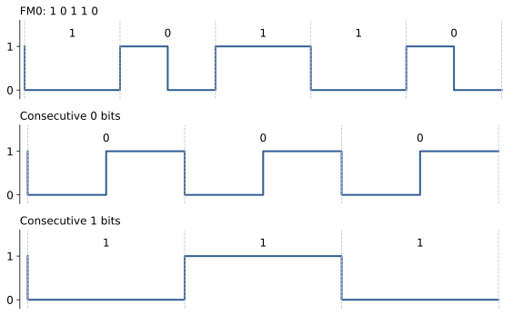
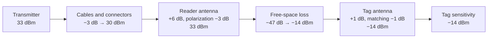
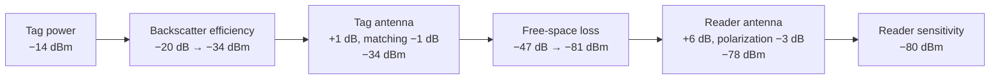
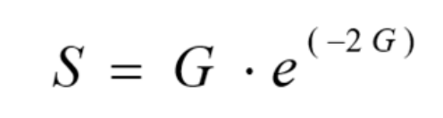
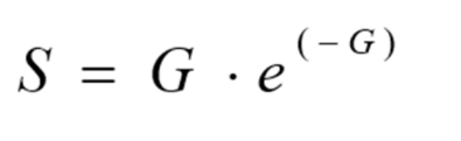

# RFID · 提纲

## 1. 课程提纲

### 1.1 Week 1 RFID Basics

#### 1.1.1 Automatic Identification

**1.1.1.1 What are the different types of automatic identification systems?**


- **Biometric procedures**：
  - Fingerprinting procedures.
  - Voice identification.
  - Face recognition.
  - Retina identification.
  - Heartbeat recognition technology.
- **Bar codes**：
  - 1D barcode recognition.
  - 2D code recognition.
- **Card technologies**：
  - Magnetic cards.
  - Smart cards.
  - Optical cards.

**1.1.1.2 Describe three of them（Automatic identification systems）**

- **Biometric procedures**：the general term for all procedures that identify people by comparing unmistakable and individual physical characteristics.
  - **Examples**：fingerprinting procedures, voice identification, face recognition, retina identification, heartbeat recognition technology.
- **Bar codes**：a binary code comprising a field of bars and gaps arranged in a parallel configuration.
  - **Examples**：1D barcode recognition, 2D code recognition.
- **Card technologies**：
  - **Examples**：magnetic cards, smart cards, optical cards.

#### 1.1.2 Biometric procedures

**1.1.2.1 What are the technical features of speech recognition?**

- Easy to use, and easily accepted by the user
- Cheap sound equipment, and not involve user's privacy
- Due to the lack of international standards, there are some difficulties in promoting推广

**1.1.2.2 What are the steps to perform speech recognition?**


**1.1.2.3 What are the technical features of face recognition?**

- Surroundings, hair ornaments装饰, age can affect the recognition rate
- Fast recognition speed, not easy to be aware of it

**1.1.2.4 What are the steps to perform face recognition?**


#### 1.1.3 barcode

**1.1.3.1 What is the most popular barcode? In which industry it was first introduced?**

The most popular barcode by some margin is the EAN code (European Article Number), which was designed specifically to fulfil the requirements of the grocery industry in 1976

**1.1.3.2 What are the main differences between 1D and 2D barcode recognitions?**

1D barcode recognition:

1. Limited storage capacity, need to combine with the database.

2. The barcode size is relatively large, the space utilization is low.

3. Fault tolerance is poor, cannot restore the information after the corruption.

2D barcode recognition:

1. **Large storage capacity**: Up to 32KB.

2. **High information density**: Can store text, sound, pictures and other information.

3. **Powerful error correction capability**: 2D code can still be identified in the case of 50% defacement.

4. **Support for encryption**: Multiple security features.

**1.1.3.3 Is RFID better than using bar codes? Will RFID ever completely replace bar codes? RFID vs Barcode？**


- **（Readable through objects**: 是否能够通过障碍物进行读取）
**1.1.3.4 Three advantages of using RFID compared to bar code scanning are:**

- **More efficiency**: you can scan multiple items at once
- **More durability**: tags can handle exposure to weather conditions like sun and rain
- **More security**: you can encrypt RFID tags so only your reader can get the data

#### 1.1.4 RFID

**1.1.4.1 To which year RFID dates back?**

1. RFID started as early as World War II, where airplanes used to be identified as “friend or foe” using this technology.

2. In 2003, EPCGlobal systems came to being and they started standardizing RFID from all possible directions.

**1.1.4.2 When EPCglobal started to standardize RFID?**

In 2003, EPCGlobal systems came to being and they started standardizing RFID from all possible directions.

**1.1.4.3 Define the radio frequency identification.**

1. RFID (Radio Frequency Identification) is a technology that uses radio frequency waves to transfer energy and data between a reader and a movable item to identify, categorize, track, …

2. The item can be an object, a person, an animal, etc.

3. Identification system consists of chip-based RFID tags, RFID readers, and software.

4. RFID is fast, reliable, and does not require physical sight or contact between reader /scanner and the tag.

**1.1.4.4 State 5 main features of RFID system? Describe them.**

1. **Non-contact automatic and rapid identification**：
   - The RFID tag returns data by backscattering the energy, with an effective communication range of 6–10 m.
   - The RFID system uses an effective anti-collision mechanism to read tags, enabling rapid identification of a large number of tags.
2. **Permanently store a certain amount of data**：RFID tag has a user storage area, which can store 1KB–10KB of user data.
3. **Simple logical processing**：RFID has a very limited number of internal logic gates, so only a simple logical processing can be made. But the RFID system can use the basic logic processing ability of tags to achieve some effective protocols and algorithms to improve the system operating efficiency and security performance.
4. **Reflection signal strength is affected by the distance and other factors significantly**：Since the RFID tag itself is a passive device, the feedback signal must be modulated by backscatter. Therefore, the strength of the RFID tag reflection signal is susceptible to the surrounding environment, including distance, reader power, signal interference, and tag deployment density.
5. **Low cost, can be deployed at a large scale**：RFID tags tend to large-scale mass production using printed circuits, so manufacturing costs can be significantly reduced. At present, the cost of an RFID tag can be controlled at around 10 cents.

**1.1.4.5 What are the main components of an RFID system?**

- A computer, database, RFID software
- **A reader (Interrogator)**: , which receives signals from the RFID and identifies and processes the information contained in one of more tags
- RFID middleware
- an antenna, used to transmit signals between the reader and the RFID tag.
- An RFID tag (transponders), which contains the data of the element to identify.

**1.1.4.6 RFID vs NFC**

Near-field communication (NFC) is a subset of the RFID technology family. The big difference is that NFC is used for two-way communication. Instead of the scanner receiving or sending data, both ends can receive and send information.


**1.1.4.7 What are the advantages of LF and HF frequency bands over UHF frequency band？（What are the advantages & disadvantages of LF、HF、UHF frequency bands？）**

- **Low-Frequency (LF) RFID (125-134 kHz)：**

    - **Pros:**

        - Good penetration through walls, water, and people.
        - Less interference from metal and environmental factors.
        - **Suitable for**: access control, animal tracking, and industrial applications.

    - **Cons:**

        - Short read range (up to ~10 cm).
        - Slower data transfer rates.
- **High-Frequency (HF) RFID (13.56 MHz)**

    - **Pros:**

        - Works well around metal and liquids.
        - Moderate range (up to 1 meter).
        - **Common in**: access control, NFC (smartphones), and ticketing systems.

    - **Cons:**

        - Slightly more affected by interference than LF.
- **Ultra-High-Frequency (UHF) RFID (860-960 MHz)**：Not ideal for buildings with many walls and people because:

    - Strong interference from water, metal, and human bodies.
    - Reduced reliability in indoor environments.
    - Longer range (up to 10 meters) but more prone to signal blockage.


**RFID系统有四个主要的频率范围。通常来说，低频系统的特点是读取范围短、读取速度慢，且成本较低。高频RFID系统用于需要更长读取范围和更快读取速度的场合，例如车辆跟踪和自动收费系统。微波频段需要使用有源RFID标签。请回答以下问题：**

**1.1.4.8 a. 你正在规划一个用于跟踪建筑物内人员位置的RFID系统。你会考虑使用哪些频率带？请详细说明你的答案。**

For indoor applications with many people and walls, LF or HF RFID is recommended due to their superior penetration and minimal interference. HF is preferable if you need a slightly longer range, while LF is best for short-range, highly reliable applications.

**1.1.4.9 b. 你正在规划一个用于计数传送带上大量快速移动且便宜的产品的RFID系统。你会考虑使用哪些频率？请详细说明你的答案。**

- For high-speed, high-volume product counting on a conveyor belt, UHF RFID (860-960 MHz) is the best choice due to its long range, fast reading speed, and ability to read multiple tags at once.
- And we should use Fixed RFID Readers！


**1.1.4.10 c. 你计划部署RFID系统，但环境中已经有一个大型的WLAN网络并且有很多用户。哪些RFID频段可能不适合你的系统？请详细说明你的答案。**


（LF和HF的信号波长较长，它们的干扰相对较小，在穿透墙壁和其他障碍物时表现较好）

#### 1.1.5 RFID components——reader

**1.1.5.1 What are the reader’s main functions?**

- **Energy Supply**：A reader provides energy for RFID tags’ work.

- **Communication**：Communication between reader and tag; Communication between reader and application layer (middleware)

- **Security Assurance**：Security assurance in communication, such as encryption and decryption

- Ad-hoc networking ability
- Multiple antenna management
- Interface of middle components
- Connecting peripherals周边设备

**1.1.5.2 Describe Reader Classifications: By Operating Frequency**

The higher the work frequency, the further the identification range, the higher the data transferring speed, the faster the signal attenuation, the more sensitive to obstacles.


常用 RFID 工作频率及典型读距：

| 频段 | 常见 RFID 频率 | 典型工作距离 |
|---|---|---|
| LF | 125–134 kHz | 小于 1 m，近距离 |
| HF | 13.56 MHz | 通常小于 1 m，近距离 |
| UHF | 433 MHz、860–960 MHz | 可超过 1 m |
| Microwave | 2.4 GHz、5.8 GHz | 可超过 1 m |

实际读距还受标签类型、功率、天线与环境影响。

**1.1.5.3 Describe Reader Classifications: By Appearance**

- **Fixed**
    - Wired charging、Highly integrated、Fast set up

- **Portable**
    - Small volume、Battery charging、Easy to move

- **Industrial**：Industrial related、Capable of integrating、other sensors

**1.1.5.4 选择最合适的Reader**


**1.1.5.5 What are the main components of RFID reader?**

**会画图**


**1.1.5.6 What is the function of Signal Processing and Control Module？**

1. Communicate with upper computer, and execute command from it

2. Control communication process with tags

3. Encode and decode signal

4. Perform anti-collision algorithm

5. Encrypt and decrypt the data transferred between reader and tag

6. Identity certification between reader and tag

**1.1.5.7 What are the two types of RF（Radio Frequencies） modules and how different they are?**

1. Inductively Coupled RF Modules

    Ideal for short-range applications, using magnetic fields for communication

2. Electromagnetic Backscatter Coupled RF Module

    Suitable for longer ranges, leveraging reflected signals for data transfer

**1.1.5.8 List 3 types of Reader Antenna**

- **Omnidirectional全向 antennas**: such as dipole antennas, will have lower gain than directional antennas because they distribute their power over a wider area.
- **Parabolic抛物线 antennas**: usually have the highest gain of any type of antenna but not really useable in typical RFID applications, except maybe for microwave RFID readers where a long-range and narrow radiation pattern is required.
- **A half-wave dipole半波偶极 antenna**: will have a gain of near unity or nearly equal the isotropic antenna.

**1.1.5.9 选择合适的Reader Antenna**


conveyor belt：传送带

#### 1.1.6 RFID components——Tag

**1.1.6.1 What are the functions of Tag？**

- **Data Storage**：Tags store goods-related information, e.g. identifier, production date, manufacturer, etc.

- **Energy Harvesting**：Tags can absorb energy from electromagnetic field generated by the reader, and generate electricity for themselves

- **Contactless R&W**：Tags can be identified from a certain distance to the reader.

- Security Encryption
- Collision Concessions

**1.1.6.2 What are the different package forms for RFID tags?**

- **Card-like Tag**：Portable, good antenna protection, waterproof

- **Label-like Tag**：Directly attached to the items, used in industrial production and logistics management

- **Implantable Tag**
    - Animal and plant management

- **Accessories-like Tag**：Easy to carry, no influence on the appearance

**1.1.6.3 What are the different Work Frequencies for RFID tags?**

- **LF Tags (Low Frequency)**
    - 30kHz - 300kHz
    - Usually passive
    - Inductively coupled
    - Strong penetration
- **HF Tags (High Frequency)**
    - 300kHz - 30MHz
    - Usually passive
    - Inductively coupled
    - Fast transmission rate, large storage
- **UHF Tags (Ultra High Frequency)**
    - 0.3GHz - 3GHz
    - Passive or active
    - Electromagnetic backscatter coupled
    - Long distance, high speed, mobile scenario, good multiple-tag read & write performance

**1.1.6.4 选择合适的频率**


**1.1.6.5 What is the difference between passive and active tags?**

Passive Tags

1. Rely on the carrier signal sent from reflection reader to gain energy

2. is most appropriate where the movement of tagged assets is highly consistent and controlled, and little or no security or sensing capability or data storage is required.

3. Compared with active tags, passive tags generally provide more limited processing, storage and sensing capabilities.

4. Cost typically well below \$1.

5. Small as 0.4 mm square and thinner than a sheet of paper.

Active Tags

1. Rely on its own battery

2. is best suited where business processes are dynamic or unconstrained, movement of tagged assets is variable, and more sophisticated security, sensing, and/or data storage capabilities are required.

3. Generally, cost from \$10 to \$50, depending on the amount of memory, the battery life required, any on-board sensors, and the ruggedness.

4. Small as a coin, which means that they are around 50 times the size of passive ones.

**1.1.6.6 What are the features of Passive Tags？**

1. No power supply

2. Limited transmission capability 缺点

3. Limited range of broadcast 缺点

4. Ideal for places preventing battery replacement 优点

5. Small size 优点

**1.1.6.7 What are the features of Active Tags（transponders）？**

1. Rely on its own battery

2. Large缺点

3. Expensive 缺点

4. Hold more data about the product 优点

5. Ideal in environments with electromagnetic interference 优点

6. Higher Data Transfer Rate 优点

**1.1.6.8 选择合适的Tag**


**1.1.6.9 You want a RFID tag that supports longer distance communications, rely on the reader to provide power to the tag, and cannot be written. What are the main components of RFID tags? Discuss advantages and disadvantages of these tags.**

- UHF passive read-only tags, electromagnetic backscatter coupled tags.
- **Advantages are**: long distance, low cost, ideal for places preventing battery replacement, small.
- **Disadvantages are**: weak penetration, limited transmission capability, limited range of broadcast, no or little security and sensing capability, data storage required.
- electromagnetic backscatter coupled是为了长距离通信，和UHF同时使用
- **短距离通信**： 使用LF/HF tags, inductively coupled tags.

**1.1.6.10 You want a RFID tag that supports longer distance communications and does not rely on the reader to provide power to the tag. What kind of tag(s) do you need?Discuss advantages and disadvantages of these tags.**

1. UHF active tags, electromagnetic backscatter coupled tags.

2. **Advantages are**: long distance, independent power supply, Higher Data Transfer Rate, Ideal in environments with electromagnetic interference

3. **Disadvantages are**: weak penetration, high cost

**1.1.6.11 What do you think about the idea of passive RFID devices for locating small children?**

1. It is not a good idea.

2. Passive tag has no active communication – It lacks a power source and only responds when near a reader. It cannot continuously send location information in real-time.

3. Passive tags have Limited range of broadcast, unsuitable for tracking.

4. Requiring many readers, it is expensive.

**1.1.6.12 What are the main components of RFID tags?**

- **Antenna**
    - Decides the size of the tag.
    - Receive RF signal from the reader.
    - Send chip data to the reader.
    - Provide energy for passive tags.
- **Chip**
    - Demodulate and decode signal received by the antenna.
    - Encode and modulate the signal to send from the tag.
    - Perform anti-collision algorithm and store data.

**1.1.6.13 Define the tag antenna？**

1. An antenna is a conductive structure specifically designed to couple or radiate electromagnetic energy.

2. Antenna structures, often encountered in RFID systems, may be used to both transmit and receive data-modulated energy

3. In the low-frequency (LF) range with short read distances, the tag is in the near field of the reader antenna, and the power and signals are transferred by means of a magnetic coupling. In the LF range, the tag antenna therefore comprises a coil (inductive loops) to which the chip is attached.

4. In the UHF range with larger read distances, the tag is located in the far field of the reader antenna.

**1.1.6.14 There are many types of tag antennas, but the most common are coil antenna, patch antenna and dipole antenna. Discuss them in more detail and find examples of RFID applications.**


**1.1.6.15 Explain the different tag antenna types？**

1. There are various types of antennas available: dipole, folded dipole, printed dipole, printed patch, squiggle, and log-spiral. 背4个就行

2. **Omnidirectional antennas**: can be read in all possible tag orientations. Among these are the dipole, folded dipole, and squiggle antennas.

3. **Directional antennas**: have good read range due to their radiation patterns.

**1.1.6.16 How the coil antenna works?**

1. **The coil antenna**: Simple process, low cost, widely used in LF, HF close-range RFID system. It works by inductively coupled, whose principle similar to transformer.

2. The reader antenna is equivalent to transformer primary coil, tag antenna as secondary coil, generating voltage at a varying magnetic field. Charged by parallel capacitors, it generates power for tag chip.

**1.1.6.17 Multiple Tag Operation计算题**


**1.1.6.18 Overlapping Tags公式**


- a\. Calculate the capacitor value for a 4.9-mH transponder coil operating at 125 kHz.
- b\. What would be the resonant frequency f1 if the overlapped tags have a new total inductance of 5.5 mH?
- L：Inductance 电感，单位H
- C：Capacitance 电容，单位F


(a) 电容：

```math
C=\frac{1}{(2\pi f)^2L} =\frac{1}{(2\pi\times125\times10^3)^2\times4.9\times10^{-3}} \approx3.31\times10^{-10}\ \mathrm F=331\ \mathrm{pF}.
```

(b) 电感变为 $`5.5\ \mathrm{mH}`$，电容不变：

```math
f_1=\frac{1}{2\pi\sqrt{LC}} =\frac{1}{2\pi\sqrt{5.5\times10^{-3}\times3.31\times10^{-10}}} \approx117957\ \mathrm{Hz}\approx117.96\ \mathrm{kHz}.
```

#### 1.1.7 RFID components——RFID middleware

**1.1.7.1 Define the RFIDmiddleware.**

One of the primary benefits of using RFID middleware is that it standardizes ways of dealing with the flood of information these tiny tags produce.

**1.1.7.2 What is RFID middleware’s main function?**

1. Providing connectivity with readers (via the reader adapter)

2. Processing raw RFID observations for consumption by applications (via the event manager)

3. Providing an application-level interface to manage readers and capture filtered RFID events.

### 1.2 Week 2 Transmission Mode

#### 1.2.1 Signal Voltage and Energy

**1.2.1.1 dB和dBm的换算公式**

正弦电压：

```math
V(t)=V_0\cos(\omega t).
```

瞬时功率及平均功率：

```math
P=IV=\frac{V^2}{R},\qquad P_{\mathrm{av}}=\frac{V_0^2}{2R}.
```

```math
P_{\mathrm{dBm}}=10\log_{10}\left(\frac{P}{1\times10^{-3}\ \mathrm W}\right),\qquad G_{\mathrm{dB}}=10\log_{10}\frac{P_2}{P_1}.
```

- **常用换算**： $`1\ \mathrm{mW}=0\ \mathrm{dBm}`$，$`1\ \mathrm W=30\ \mathrm{dBm}`$。
- 功率经过增益或损耗，可以将 dBm 与 dB 相加：

```math
2\ \mathrm{dBm}+10\ \mathrm{dB}+10\ \mathrm{dB}=22\ \mathrm{dBm}.
```

dBi 是相对于理想各向同性天线的增益，数值以 dB 表示。

**1.2.1.2 练习题**


- P的dB换算为10，E的dB换算为20
- 已知 $`\mathrm{EIRP}=E^2r^2/30`$，其中 $`E`$ 以 V/m 计，$`r`$ 以 m 计：

```math
\begin{aligned} \mathrm{EIRP}_{\mathrm{dBm}} &=10\log_{10}\left(\frac{E^2r^2/30}{10^{-3}}\right)\\ &=20\log_{10}E_{\mathrm{V/m}}+20\log_{10}r-10\log_{10}30+30. \end{aligned}
```

电场强度换算：

```math
E_{\mathrm{dB}\mu\mathrm V/\mathrm m} =20\log_{10}\left(\frac{E}{1\times10^{-6}\ \mathrm{V/m}}\right) =20\log_{10}E_{\mathrm{V/m}}+120.
```

所以：

```math
\boxed{\mathrm{EIRP}_{\mathrm{dBm}} =E_{\mathrm{dB}\mu\mathrm V/\mathrm m}+20\log_{10}r-(10\log_{10}30+90)}.
```

也就是 $`\mathrm{EIRP}_{\mathrm{dBm}}\approx E_{\mathrm{dB}\mu\mathrm V/\mathrm m}+20\log_{10}r-104.77`$。

#### 1.2.2 Modulation and Multiplexing of Reader Signal（reader发给tag）

**1.2.2.1 Amplitude Modulation**


m（t）是信息信号，也是一个余弦函数


**1.2.2.2 Digitally Modulated**

- **On-Off Keying (OOK)**: high power for 1, low power for 0.
- **PIE（Pulse Interval Encoding）：**
    - **“1” 的表示方式：** 输出较长时间的高功率，然后是一个短时间的低功率。
    - **“0” 的表示方式：** 输出较短时间的高功率，然后是一个短时间的低功率。


#### 1.2.3 Backscatter Mechanism and Tag Encoding（tag发给reader）

**1.2.3.1 What is frequency shift keying(FSK)？**

- “1”could be 50 turns of tag state change in 1ms
- “0”could be 100 turns of tag state change in 1ms
- 在这个示例中，1 的翻转较慢，0 的翻转较快。下图另示 FM0 的编码规则。
- 例子中的比特序列是 `1 0 1 1 0`。FM0 编码在每个比特边界翻转，`0` 还在比特中间翻转，因此连续 `0` 的翻转频率比连续 `1` 高。同样时长内，图中 `0` string 有 4 次翻转，`1` string 有 2 次翻转。



#### 1.2.4 Link Budget预算


Passive tags harvest energy from the incident reader signal and return data through backscatter.


**1.2.4.1 What factors determine the link budget of a wireless link? Discuss the influence of each individual factor？**

1. **Link budget**: forward link budget and backward link budget.

2. **Reader’s transmit energy**： The power of the reader is usually restricted to certain safe range

3. **Path loss**： In transmission process, the difference between actual energy sent from transmitter and that received by receiver.

    注意path loss不等于free space loss，path loss是整个过程中的损失，free space loss只是中间传输过程中的损失

4. **Tag activate energy**： At tag reading phase, the tag needs an energy to activate the circuit.

**1.2.4.2 path loss中db的累加**

题目：1m: the actual received energy of the tag is 0.7mW (-1.5dBm), and the path loss is about 32dB

问题：3m的total path loss？

先算1-3m的path loss，

10 lg(3/1) <sup>2</sup>=9.5 dB

所以，

32+9.5 = 41.5dB

**1.2.4.3 Path Loss计算题公式**

M是10的6次方

G是10的9次方

mm，µm，nm，pm

假设是isotropic antenna（无方向天线）


- λ：wave length
- c：光速
- f：frequency


Ae：Effective Aperture有效孔径


- **PRX**： RX的power
- **PTX**： TX的power
- r：距离
- **Ae**： 接收天线的有效孔径


- **EIRP**： Effective Isotropic Radiated Power
- Pₜₓ（发射功率），单位是 dBm
- Gₜₓ（天线增益），单位是 dBi（相当于dB）

#### 1.2.5 Antenna Gain

**1.2.5.1 What is Antenna Gain？**

1. Under the condition of the same input power, the power density ratio of signal generated at the same point in space by actual antenna and ideal radiation unit.

2. It quantitatively describes the extent to which an antenna concentrates the input power.

天线增益描述能量在方向上的集中程度；发送与接收天线的增益都会影响链路预算。

**1.2.5.2 Effects of Antenna Gain公式**


- G：amplification coefficient
- Ω：波束角


- 下面第一个公式不考虑天线增益，因为free space loss已经不包括天线增添和损失

不考虑天线增益时：

```math
P_{\mathrm{RX}}=P_{\mathrm{TX}}\left(\frac{\lambda}{4\pi r}\right)^2.
```

- $`P_{\mathrm{TX}}`$ 是自由空间传播损耗之前的功率，$`P_{\mathrm{RX}}`$ 是损耗之后的功率。
**有效孔径及 Friis 公式：**

```math
A_e=G\frac{\lambda^2}{4\pi},\qquad\lambda=\frac cf,
```

```math
P_{\mathrm{RX}}=P_{\mathrm{TX}}G_{\mathrm{RX}}G_{\mathrm{TX}}\left(\frac{\lambda}{4\pi r}\right)^2.
```

**Reader → Tag**：

```math
P_{\mathrm{RX,tag}}=P_{\mathrm{TX,reader}}G_{\mathrm{reader}}G_{\mathrm{tag}} \left(\frac{\lambda}{4\pi r}\right)^2.
```

标签将接收功率的一部分反向散射，$`T_b`$ 表示功率反向散射系数：

```math
P_{\mathrm{TX,tag}}=P_{\mathrm{RX,tag}}T_b.
```

**Tag → Reader**：

```math
P_{\mathrm{RX,reader}}=P_{\mathrm{TX,tag}}G_{\mathrm{tag}}G_{\mathrm{reader}} \left(\frac{\lambda}{4\pi r}\right)^2.
```

汇总：

```math
P_{\mathrm{RX,reader}}=P_{\mathrm{TX,reader}}T_bG_{\mathrm{reader}}^2G_{\mathrm{tag}}^2 \left(\frac{\lambda}{4\pi r}\right)^4.
```

正向链路和反向链路的距离上限：

```math
R_{\mathrm{forward}}=\frac{\lambda}{4\pi} \sqrt{\frac{P_{\mathrm{TX,reader}}G_{\mathrm{reader}}G_{\mathrm{tag}}}{P_{\min,\mathrm{tag}}}},
```

```math
R_{\mathrm{reverse}}=\frac{\lambda}{4\pi} \sqrt[4]{\frac{P_{\mathrm{TX,reader}}T_bG_{\mathrm{reader}}^2G_{\mathrm{tag}}^2}{P_{\min,\mathrm{reader}}}}.
```

- $`P_{\min,\mathrm{tag}}`$：激活标签所需的最小接收功率。
- $`P_{\min,\mathrm{reader}}`$：读写器所需的最小接收功率。
- 系统读取距离同时受正向与反向链路限制。

**1.2.5.3 power传输计算题**


- 首先分析题目，因为波长为0.33m，c=λf，所以f算出来是915×10<sup>6</sup>hz
- Energy Required to Activate the Tag这个功率是Tag的最小接收功率
- Reflection energy is 1/2 of received energy 这个说明Tb是 0.5
- Reader Sensitivity 这个功率是Reader的最小接收功率
1. 求Maximum Path Loss

    $`\displaystyle L_{\max}=P_{\mathrm{TX,reader}}-P_{\min,\mathrm{tag}} =29\ \mathrm{dBm}-(-14\ \mathrm{dBm})=43\ \mathrm{dB}.`$

    dBm 相减得到 dB。

2. 使用Friis equation求出Tag和Reader的（发送的）最大距离

    $`\displaystyle P_{\mathrm{RX}}=P_{\mathrm{TX}}\frac{A_e}{4\pi r^2} =P_{\mathrm{TX}}\frac{\lambda^2}{4\pi\times4\pi r^2} =P_{\mathrm{TX}}\left(\frac{\lambda}{4\pi r}\right)^2.`$

    损耗是 $`P_{\mathrm{TX}}/P_{\mathrm{RX}}`$，不是它的倒数：

    $`\displaystyle 10\log_{10}\frac{P_{\mathrm{TX}}}{P_{\mathrm{RX}}}=43 \quad\Rightarrow\quad\frac{P_{\mathrm{TX}}}{P_{\mathrm{RX}}}=10^{4.3}.`$

    $`\displaystyle r=\frac{\sqrt{10^{4.3}}\times0.33}{4\pi}\approx3.7\ \mathrm m.`$

3. Tag在反射损耗后的发射功率

    $`\displaystyle P_{\mathrm{TX,tag}}=-14\ \mathrm{dBm}-3\ \mathrm{dB}=-17\ \mathrm{dBm}.`$

4. Reader收到的功率

    去、回的自由空间损耗相同：

    $`\displaystyle P_{\mathrm{RX,reader}}=-17\ \mathrm{dBm}-43\ \mathrm{dB}=-60\ \mathrm{dBm}.`$

5. Reader收到的能量是否大于Reader的Sensitivity

    $`\displaystyle -60\ \mathrm{dBm}\gt -70\ \mathrm{dBm}.`$

    Yes，接收功率高于读写器灵敏度。

6. GReader=4倍或6dB，寻找最新的Tag和Reader的（发送的）最大距离

    读写器天线增益变为 $`G_{\mathrm{reader}}=4`$（约 $`6\ \mathrm{dB}`$），标签天线保持各向同性：

    $`\displaystyle P_{\mathrm{RX,tag}}=P_{\mathrm{TX,reader}}G_{\mathrm{reader}} \left(\frac{\lambda}{4\pi r'}\right)^2.`$

    $`\displaystyle r'=\sqrt{G_{\mathrm{reader}}}\,r=2\times3.7=7.4\ \mathrm m.`$

7. 重新算Reader收到的功率，是否大于Reader的Sensitivity

    读写器的等效各向同性辐射功率：

    $`\displaystyle \mathrm{EIRP}=29\ \mathrm{dBm}+6\ \mathrm{dB}=35\ \mathrm{dBm}.`$

    允许的自由空间损耗：

    $`\displaystyle L=35-(-14)=49\ \mathrm{dB}.`$

    回程接收功率包括读写器接收天线的增益：

    $`\displaystyle P_{\mathrm{RX,reader}}=-14-3-49+6=-60\ \mathrm{dBm}\gt -70\ \mathrm{dBm}.`$

    Yes，仍高于灵敏度。

**1.2.5.4 流程图计算题**


基本公式：$`\lambda=c/f`$，$`A_e=\lambda^2/(4\pi)`$，$`P_{\mathrm{RX}}=P_{\mathrm{TX}}(\lambda/(4\pi r))^2`$，以及 $`\mathrm{EIRP}_{\mathrm{dBm}}=P_{\mathrm{TX,dBm}}+G_{\mathrm{TX,dBi}}`$。

**Forward link budget：**



```math
\mathrm{FSL}_{\max}=(33+6+1)-(3+3+1)-(-14)=47\ \mathrm{dB}.
```

**Reverse link budget：**



接收功率为 $`-78\ \mathrm{dBm}`$，比灵敏度 $`-80\ \mathrm{dBm}`$ 高 $`2\ \mathrm{dB}`$。


```math
P_{\mathrm{RX}}=P_{\mathrm{TX}}\left(\frac{\lambda}{4\pi r}\right)^2.
```

$`P_{\mathrm{TX}}`$ 是 free-space loss 前的功率，$`P_{\mathrm{RX}}`$ 是 free-space loss 后的功率。已知损耗为 $`47\ \mathrm{dB}`$：

```math
10\log_{10}\frac{P_{\mathrm{TX}}}{P_{\mathrm{RX}}}=47 \quad\Rightarrow\quad\frac{P_{\mathrm{TX}}}{P_{\mathrm{RX}}}=10^{4.7}.
```

```math
\frac{P_{\mathrm{TX}}}{P_{\mathrm{RX}}}\left(\frac{\lambda}{4\pi r}\right)^2=1 \quad\Rightarrow\quad10^{4.7}\frac{0.33^2}{(4\pi r)^2}=1.
```

```math
r=\frac{\sqrt{10^{4.7}\times0.33^2}}{4\pi}\approx5.8\ \mathrm m.
```

返回不需要算Tag的the cables and connectors losses的损失


**1.2.5.5 磁场计算题**

- The chip device turns on when the antenna coil develops $`4\ \mathrm{V_{pp}}`$ across it. This voltage is rectified and the device starts to operate when it reaches $`2.4\ \mathrm{V_{DC}}`$.
- At the resonant frequency, the voltage across the tag antenna is:

```math
V_{\mathrm{tag}}=2\pi fNSQB\cos\theta.
```

其中：$`f`$ 是载波频率，$`N`$ 是匝数，$`S`$ 是线圈面积（平方米），$`Q`$ 是谐振电路品质因数，$`B`$ 是标签处磁场强度，$`\theta`$ 是磁场与标签面积法线之间的夹角。

(a) Calculate the magnetic field to induce a $`4\ \mathrm{V_{pp}}`$ coil voltage with an ISO standard 7810 card size $`(85.6\times54\times0.76\ \mathrm{mm})`$. The frequency is $`13.56\ \mathrm{MHz}`$, the number of turns is 4, the $`Q`$ of the tag antenna coil is 40, and the coils are perfectly parallel to each other.

线圈完全平行，$`\cos\theta=1`$，因此按题目给定电压公式：

```math
B=\frac{V_{\mathrm{tag}}}{2\pi fNSQ\cos\theta} =\frac{4}{2\pi\times13.56\times10^6\times4\times85.6\times54\times10^{-6}\times40} \approx6.35\times10^{-8}\ \mathrm T.
```

- (b) Calculate the induced voltage, assuming that the frequency of the reader was $`1\ \mathrm{kHz}`$ off from the resonant frequency of the tag. What conclusion can you make?
- 取读写器频率比谐振频率低 $`1\ \mathrm{kHz}`$：

```math
f_1=f_0-1\ \mathrm{kHz}=13.559\ \mathrm{MHz}.
```

若写成 $`f_1=f_0/(1+\delta)`$，则 $`\delta`$ 必须是无量纲的相对频偏，$`\delta=f_0/f_1-1`$。

在题目给定的 $`Q`$、$`B`$ 不变的近似公式中：

```math
V_{\mathrm{tag},1}=2\pi f_1NSQB\cos\theta =4\frac{13.559}{13.56}\approx3.9997\ \mathrm V.
```

$`1\ \mathrm{kHz}`$ 相对于 $`13.56\ \mathrm{MHz}`$ 很小，因此这个近似计算中的电压变化很小。实际离开谐振点时，还需要考虑谐振回路的频率响应。

#### 1.2.6 Signal Transmission in Realistic Environments


#### 1.2.7 Checksum

**1.2.7.1 Parity Checking procedure**

每8 bits，加入一位parity bit

1. Odd parity这9个bits有奇数个1

2. Even parity 这9个bits有偶数个1

可以通过XOR电路实现，以下图的每个门都是XOR门，输入为8位，输出为parity bit，odd-p前面要加个非门


**1.2.7.2 Parity Checking的缺点**

1. **An odd number of inverted bits**: detected

2. **An even number of inverted bits**: the errors cancel each other out, appear to be correct.

**1.2.7.3 LRC longitudinal redundancy check (LRC) procedure**

简单方法：直接竖着按列XOR

先分byte迭代XOR计算LRC，附加在数据最后

发送数据给接收方，接收方先迭代XOR计算，再将迭代计算的结果与结尾的LRC进行XOR

如果结果为 0，表示未检测到错误；某些多比特错误仍可能相互抵消。


**1.2.7.4 LRC的优点**

1. Can be calculated very simply and quickly

2. Primarily used for the rapid checking of very small data blocks

**1.2.7.5 LRC的缺点**

Not very reliable because it is possible for multiple errors to cancel each other out, and the check cannot detect whether bytes have been transposed within a data block.

**1.2.7.6 CRC (cyclic redundancy check) procedure**

1. 根据 generator polynomial 的最高次数 $`n`$，在数据后补 $`n`$ 个零
2. 用generator polynomial去XOR补全后的数
3. 如果XOR左边算出的结果是0，删除全部0，向右移动generator polynomial
4. 如果最后的位数已经不足以XOR（位数少于generator polynomial的位数），停止
5. 将模 2 除法的余数补齐为 $`n`$ 位，作为 checksum
6. 发送数据与 checksum。接收方将整个码字除以生成多项式，余数应全为 0

**例 1：** 输入 $`\mathrm{F7}_{16}=11110111_2`$，generator polynomial 为 $`x^4+x+1`$。

按 $`x^4,x^3,x^2,x^1,x^0`$ 的系数排列：

```math
x^4+x+1\longleftrightarrow10011.
```

生成多项式次数为 4，二进制表示共 5 位，因此补 $`5-1=4`$ 个零：

```text
11110111 0000
```

发送方用模 2 除法（减法就是 XOR）计算：

```text
1. 111101110000
 ⊕ 100110000000
 = 011011110000
2. 011011110000
 ⊕ 010011000000
 = 001000110000
3. 001000110000
 ⊕ 001001100000
 = 000001010000
4. 000001010000
 ⊕ 000001001100
 = 000000011100
5. 000000011100
 ⊕ 000000010011
 = 000000001111
```

余数为 `1111`，发送码字为 `11110111 1111`。接收方将整个码字除以相同生成多项式：

```text
1. 111101111111
 ⊕ 100110000000
 = 011011111111
2. 011011111111
 ⊕ 010011000000
 = 001000111111
3. 001000111111
 ⊕ 001001100000
 = 000001011111
4. 000001011111
 ⊕ 000001001100
 = 000000010011
5. 000000010011
 ⊕ 000000010011
 = 000000000000
```

余数为 `0000`，表示未检测到错误。

**例 2：** 数据为 `11100101`，生成多项式的二进制表示为 `11011`（$`x^4+x^3+x+1`$）。
发送方补 4 个零并计算：

```text
1. 111001010000
 ⊕ 110110000000
 = 001111010000
2. 001111010000
 ⊕ 001101100000
 = 000010110000
3. 000010110000
 ⊕ 000011011000
 = 000001101000
4. 000001101000
 ⊕ 000001101100
 = 000000000100
```

余数为 `0100`。发送 `11100101 0100`，接收方核验：

```text
1. 111001010100
 ⊕ 110110000000
 = 001111010100
2. 001111010100
 ⊕ 001101100000
 = 000010110100
3. 000010110100
 ⊕ 000011011000
 = 000001101100
4. 000001101100
 ⊕ 000001101100
 = 000000000000
```

余数为 `0000`。

**1.2.7.7 CRC 的优点**

reliability of error recognition

**1.2.7.8 CRC 的缺点**

Cannot correct errors

#### 1.2.8 Coding in the Baseband

##### 1.2.8.1 NRZ coding (Not Return to Zero)（无箭头）

1在高处，0在低处


##### 1.2.8.2 Manchester Coding（bi-phase）

1下降，0上升


##### 1.2.8.3 Unipolar RZ Coding（无箭头）

1下降，0在低处


**Explain the principle of unipolar RZ coding.**

- **Binary1**: a ‘high’ signal during the first half-bit period
- **Binary 0**: a ‘low’ signal lasting for the entire duration of the bit

##### 1.2.8.4 DBP (differential bi-phase)

- 1,0开始都反转
- 1不变，0跳动


**Explain the principle of DBP.**

- **Binary 0**: a transition of either type in the half-bit period
- **Binary 1**: lack of a transition
- The level is inverted at the start of every bit period
- The bit pulse can be more easily reconstructed in the receiver

##### 1.2.8.5 Miller coding

- 1,0开始都不反转
- 1跳动，0不变
- 重复的0会一个周期反转一次


**Explain the principle of Miller coding**

- **Binary 1**: a transition of either type in the half-bit period.
- **Binary 0**: continuance of the 1 level over the next bit period.
- **A sequence of zeros**: transition at the start of a bit period.
- The bit pulse can be more easily reconstructed in the receiver.

##### 1.2.8.6 Modified Miller Coding

- 1：在中间发生反转，但迅速恢复
- 0：如果前一个是1，不反转；如果前一个是0，开始的时候反转并迅速恢复


##### 1.2.8.7 Differential coding

- 1反转
- 0不变


##### 1.2.8.8 PPC（Pulse-pause coding）

- 1：在下一个脉冲（反转再恢复）之前，暂停时间为 t
- 0：在下一个脉冲之前，暂停时间为 2t


**1.2.8.8.1 练习题**


#### 1.2.9 Digital Modulation Procedures

**1.2.9.1 振幅调制（Amplitude Shift Keying, ASK）**


Duty Factor：


Percentage Carrier Reduction：


当Duty Factor \>15% 或 \>85%时，两种计算方法的差异可以忽略不计


- 当数字信号为 高电平（1） 时，HF 信号正常传输。
- 当数字信号为 低电平（0） 时，HF 信号被关闭（振幅降为零）。

**1.2.9.2 频率调制（Frequency Shift Keying, FSK）**

频率上的改变


- **fCR**： Carrier Frequency
- **△fCR**： frequency deviation

```math
f_{\mathrm{CR}}=\frac{f_1+f_2}{2},\qquad\Delta f_{\mathrm{CR}}=\frac{\vert f_1-f_2\vert }{2}.
```

**1.2.9.3 相位调制（Phase Shift Keying, PSK）**


- 当数字信号为 1 时，载波相位为 0°
- 当数字信号为 0 时，载波相位切换为 180°

**1.2.9.4 不同modulation方法的对比图**


**1.2.9.5 练习题**


```math
\Delta f_{\mathrm{CR}}=\frac{\vert f_1-f_2\vert }{2}=\frac{\vert 10-20\vert }{2}=5\ \mathrm{kHz}.
```

中心频率为 $`f_{\mathrm{CR}}=(10+20)/2=15\ \mathrm{kHz}`$。

### 1.3 Week 3、Protocol

#### 1.3.1 Anti-Collision Algorithms

**1.3.1.1 three typical anti-collision protocols to address conflicts among readers**


**1.3.1.2 4 Anti-Collision Algorithms**


**1.3.1.3 TDMA分类图**


**1.3.1.4 Explain the purpose of anti-collision algorithms in RFID systems and discuss their importance in managing tag collisions.**

- Anti-collision algorithms in RFID systems are designed to manage tag collisions, which occur when multiple tags transmit data simultaneously and their signals interfere with each other.
- The purpose of these algorithms is to efficiently identify and differentiate tags within the reader's range, ensuring accurate data capture and minimizing communication delays caused by collisions.

**1.3.1.5 Which algorithm is mainly used only for read-only tags?**

1. The simplest of all the multi-access procedures is the **ALOHA** procedure, which got its name from the fact that this multi-access procedure was developed in the 1970s for ALOHANET – a radio network for data transmission on Hawaii.

2. As soon as a data packet is available it is sent from the transponder to the reader.

3. This is a transponder-driven stochastic TDMA procedure.

4. The procedure is used exclusively with read-only transponders, which generally have to transfer only a small amount of data (serial numbers), this data being sent to the reader in a cyclical sequence.

**1.3.1.6 Explain the concept of frame slotted ALOHA (FSA) anti-collision algorithm.**

1. Based on S-ALOHA, several time slots are organized into one frame, and the reader identify tags by frame.

2. Reader broadcasts frame length (f)

3. After receiving “f”, the tag randomly selects an integer from 0~(f-1) as its slot number and stores it in the register (SN)

4. In each time slot of the next frame, the reader starts a new time slot by the slot start command, and if the tag’s SN is 0, the identifier is immediately sent, otherwise SN-1

5. If the identifier is sent successfully, the tag goes asleep, otherwise it waits for the next frame to reselect a slot to send the identifier.

**1.3.1.7 How does FSA improve the efficiency compared to traditional（pure） ALOHA？**

- **Pure ALOHA**
    - **Vulnerable period per transmission**： 2 × frame‑time
    - The average throughput S of a transmission channel：

    

    S reaches a maximum of 18.4% at G= 0.5 .

- **Frame‑Slotted ALOHA**
    - **Vulnerable period per transmission**： 1 × slot‑time
    - The average throughput S of a transmission channel：

    

    S reaches a maximum of 36.8% at G= 1

**1.3.1.8 Random Binary Tree**

- Request、Conflict、success是上一轮的状态
- 红色的数字的意思是相较于上一轮状态发生了变化
1. 每个标签维护一个计数器（SN）（初始为 0）
2. 读写器每轮轮询时，只有计数器为 0 的标签才可以发言
3. 如果一个标签成功响应，该标签被识别后保持 silent；其他等待标签的 SN 减 1，再回到步骤 2 进行轮询。
4. 如果多个标签同时发言 ➜冲突发生
5. 发生冲突后 ➜ 所有相关标签随机选择 0 或 1 加到自己的计数器上（这就是二叉树分叉），回到2
判断，以下图会发生什么？


Conflict happens


判断，以下图会发生什么？


Tag 2 successfully identified, silent


完整流程


**1.3.1.9 Binary search based anti-collision algorithm**


- 已知，在一次迭代中， Request（\<11111111）。发生了collision
**a）碰撞的原因是什么？serial number有多少种可能性？**
- 因为有4个transponders的serial number都less than 11111111，所以都会reply，而这4个transponder的serial number的bit 0、bit 4和bit 6是不同的，所以：The collision occurs at bit 0, bit 4, and bit 6 of the received serial number.
- There are 8 possibilities for the serial numbers.


**b）为了解决这个碰撞，reader应该发出什么样的下一个请求命令？**
- **Search in the range ≤ 10111111b**: set bit 6 equal to 0 (highest value bit with collision) and ignore all lower value bits by setting them to 1.
- 最左边的不确定的位设置为0，其余位设置成1
**c）假设读写器发送一个REQUEST命令（\<10111111\>），会发生什么？是否会发生碰撞？碰撞可能发生在哪些比特位？**
- There is now a collision (X) at bit 0 and bit 4 of the received serial number.
**d）如果发生碰撞，我们有多少种可能性？列举出来。你能推断出什么？**
- 4种可能，方法和上面a问一样
- From this we can conclude that there are still at least two transponders in the search range of the second iteration.
**e）假设有八个tags在reader的查询区域内。使用基于二进制搜索的反碰撞算法，平均需要多少次迭代才能检测到一个标签？**


#### 1.3.2 EPCGlobal Standard

**1.3.2.1 Why is standardization very important in the RFID world?**

1. Better interoperability

2. Lower costs

**1.3.2.2 What are the most important standardization organizations in this arena?**

- EPCglobal
- ISO/IEC

#### 1.3.3 EPCglobal Network

**1.3.3.1 When did EPC started? What was its goal?**

- 1999
- **Goal**: create a cost-efficient, global and open-source system

**1.3.3.2 State at least three universities that participate in the EPCglobal partnership.**

1. Fudan University in China

2. Keio University in Japan

3. The University of Cambridge in the UK

**1.3.3.3 When and who founded EPCglobal Network? What was its mission?**

- In 2003, European Article Number (EAN) and the Uniform Code Council (UCC) founded EPCglobal (converted from Auto-ID Center), a worldwide, open nonprofit organization for the international implementation of EPCglobal Network
- **mission:**
    - Develop and oversee the standards of electronic product codes (EPC) by using the RFID technology
    - Provide registry service of the codes
    - Coordinate with ISO for their review and ratification

**1.3.3.4 Draw a diagram of a typical EPCglobal network and explain its five basic services.**


#### 1.3.4 EPC

**1.3.4.1 EPC组成**

- Version Number +Domain Manager number + Object Class number + Serial Number
- 以下图都是2进制的位数


**1.3.4.2 EPC识别题目**


**1.3.4.3 EPC识别题目**


A、

- 给的EPC code是16进制，一共24位，换成2进制，24\*4=96，所以是EPC-96，然后EPC-96只有一种，所以是EPC-96-type1


B、


#### 1.3.5 EPC Class 0 standard


**1.3.5.1 For which types of tags stands EPCglobal class 0 protocol?**

EPCglobal class 0 protocol are for read-only tags

**1.3.5.2 How many bits are included in EPC code?**

The EPC code includes 64 bits and 96 bits

**1.3.5.3 Which anti-collision protocol is used in this standard?**

It uses the binary tree based variant algorithm.

#### 1.3.6 EPC Class 1 Generation 1 (EPC C1G1) Standard

**1.3.6.1 For which types of tags stands EPCglobal C1G1 protocol?**

The EPC C1G1 tag is a passive tag, can reflect a unique ID to the reader.

**1.3.6.2 How many bits are included in EPC code?**


64 bits or 96 bits

**1.3.6.3 Does it support the LOCK and Kill commands?**

Yes

**1.3.6.4 Is it a half-duplex or full duplex protocol?**

The EPC CIG1 standard uses a packet-based half-duplex protocol.

**1.3.6.5 Are EPC C1G1 and EPCglobal class 0 compatible?**

The EPC C1G1 and EPCglobal Class 0 standards are not compatible, whether in tag symbols, media access control, command sets, or in state diagrams.

**1.3.6.6 Which anti-collision protocol is used in the standard EPC C1G1?**

The EPC C1G1 standard provides commands to improve the media access control process and has commands that can directly access the tag EPC code. EPC C1G1 uses the PingID command to traverse the binary tree and identify the tag.

**1.3.6.7 Explain the PingID functionality**

A mask filter is provided that specifies the starting position of the traversal process and the access to the tag.

#### 1.3.7 EPC Class 1 Generation 2 (EPC C1G2) Standard

**1.3.7.1 For which types of tags stands EPCglobal C1G2 protocol?**

Passive Tags

**1.3.7.2 At which frequency operates this standard?**

The operating frequency of the RFID system which complies with the EPCglobal Class 1 Generation 2 (EPC G1G2) standard is at 860MHz ~ 960MHz.

**1.3.7.3 Is it a half-duplex or full-duplex protocol?**

The EPC C1G2 protocol standard is a half-duplex protocol that allows only one reader or one tag to send a signal in a single transmission.

**1.3.7.4 Explain the physical layer communication interface.**

- There are two communication links in the EPC C1G2, namely, a reader-to-tag communication link and a tag-to-reader communication link.
- The two links are independent and have different data encoding schemes, data rates and data modulation modes.

**1.3.7.5 Which anti-collision protocol is used in the standard EPC C1G2?**

The EPC C1G2 uses dynamic frame slotted ALOHA anti-collision algorithms to reduce data corruption caused by collisions.

**1.3.7.6 Which modulation techniques are used in EPC C1G2?**

- For reader-to-tag link, ASK modulation is used.
- b\. For tag-to-reader link, ASK/PSK modulation is used.

**1.3.7.7 What are the four commands in EPC C1G2?**

- select, query, queryrep, queryadjust
- QueryRep 用于推进当前查询轮次的时隙，使参与该轮的相关标签递减 slot counter；计数到 0 的标签按协议回应。

**1.3.7.8 What are the performance trade-offs problems in C1G2?**


### 1.4 Week 4、Application

#### 1.4.1 RFID applications Patterns

**1.4.1.1 State three patterns of RFID applications and explain them.**

1. tag identification

    This involves identifying tagged items uniquely.

2. information retrieval and integration

    This involves reading and sometimes updating data from/to the tag and integrating with a system.

3. object detection and tracking

    This involves tracking items as they move or detecting their presence/location.

**1.4.1.2 State two applications for RFID tag identification.**

ETC system，Intelligent parking system，Product monitoring，Medical and health，Heavy industry equipment manufacturing

**1.4.1.3 State two applications for RFID information retrieval and integration.**

smart poster, electronic business card.

**1.4.1.4 State two applications for RFID object positioning and tracking.**

baby security monitoring, medical applications, personnel real-time positioning system.

**1.4.1.5 What are the tag type, reader type, frequency band for tag identification, information retrieval and integration, object detection and tracking.**


**1.4.1.6 下图是一个Real-Time Locating System（RTLS）实时定位系统。What type of RFID tags and readers would you use for the application shown in the figure below?**

- 由于目标是实时位置跟踪，所以不能使用传统的无源 RFID 系统（这种系统只有当物品靠近读取器时才能识别）。

相反，你应该使用以下方案：

- **主动 RFID 标签**： 这些标签自带电源，并会定期发送信号。它们非常适合用于实时跟踪在移动中的资产，尤其是在像仓库、医院或工厂这样的大型区域内。系统可以持续监控物品的移动，而不需要人工扫描。
- **RFID 读取器 / 锚点（Anchors）**： 固定在多个位置，用来接收来自标签的信号，并通过三角定位确定位置。
- **频段**： 使用 UHF（超高频）频段。


如果使用 UHF 无源 RFID（860–960 MHz）：

- 适合用于物品识别。
- 不适合用于实时跟踪或传感器数据采集。
- 由于没有电池，功能比较有限。

如果使用 UHF 主动 RFID（433 MHz 或 2.4 GHz）：

- 由于内置电池，可以实现实时定位以及支持传感器功能。
- 最适合用于 RTLS（实时定位系统） 和 状态监控。

## 2. 背诵要点

### 2.1 Week 1 RFID Basis

#### 2.1.1 1 、 Automatic Identification

##### 2.1.1.1 3 种 Automatic identification systems 和例子

- **Biometric procedures**： is the general term for all procedures that identify people by comparing unmistakable and individual physical characteristics.
    - **Example：**
        - Fingerprinting procedures.
        - Voice identification.
        - Face recognition.
        - Retina identification.
        - Heartbeat recognition technology.
- **Bar codes**： a binary code comprising a field of bars and gaps arranged in a parallel configuration.
    - **Example：**
        - 1D barcode recognition.
        - 2D code recognition.
- **Card technologies**
    - **Example：**
        - Magnetic cards.
        - Smart cards.
        - Optical cards

##### 2.1.1.2 technical features of speech recognition

- Easy to use, and easily accepted by the user
- Cheap sound equipment, and not involve user's privacy
- Due to the lack of international standards, there are some difficulties in promoting

##### 2.1.1.3 speech recognition 步骤

- Feature extraction module
- Statistical acoustics model
- Pronunciation dictionary
- Language model
- Decoder

##### 2.1.1.4 technical features of face recognition

- Surroundings, hair ornaments, age can affect the recognition rate
- Fast recognition speed, not easy to be aware of it

##### 2.1.1.5 face recognition 步骤

- Face acquisition
- Face positioning
- Face recognition preprocessing (Local Feature Analysis)
- Look up the identity
- Identity confirmation

#### 2.1.2 2 、 barcode

##### 2.1.2.1 1D 对比 2D barcode

1D barcode recognition:

- Limited storage capacity, need to combine with the database.
- The barcode size is relatively large, the space utilization is low.
- Fault tolerance is poor, cannot restore the information after the corruption.

2D barcode recognition:

- **Large storage capacity**: Up to 32KB.
- **High information density**: Can store text, sound, pictures and other information.
- **Powerful error correction capability**: 2D code can still be identified in the case of 50% defacement.
- **Support for encryption**: Multiple security features.

##### 2.1.2.2 Barcode 对比 RFID

- **Read Rate**
    - **Barcode**: Only one at a time
    - **RFID**: 10's, 100's or 1000's simultaneously
- **Read Range**
    - **Barcode**: Several inches up to several feet
    - **RFID**: Passive UHF RFID: Up to 40 feet (fixed readers)、Up to 20 feet (handheld readers)
    - **Active RFID**: Up to 100's of feet or more
- **Read Speed**
    - **Barcode**: Slow
    - **RFID**: Very fast (ms)
- **Readable through objects**
    - **Barcode**: No, must be line of sight
    - **RFID**: Yes
- **Identification**
    - **Barcode**: Most barcodes only identify the type of item (UPS Code) but not uniquely
    - **RFID**: Can uniquely identify each item/asset tagged

##### 2.1.2.3 RFID 相较于 barcode 的 3 个优点

- **More efficiency**: you can scan multiple items at once
- **More durability**: tags can handle exposure to weather conditions like sun and rain
- More security: you can encrypt RFID tags so only your reader can get the data

#### 2.1.3 3 、 RFID

##### 2.1.3.1 RFID 定义

- RFID (Radio Frequency Identification) is a technology that uses radio frequency waves to transfer energy and data between a reader and a movable item to identify, categorize, track, …
- The item can be an object, a person, an animal, etc.
- Identification system consists of chip-based RFID tags, RFID readers, and software.
- RFID is fast, reliable, and does not require physical sight or contact between reader /scanner and the tag.

##### 2.1.3.2 5 main features of RFID system

- **Non-contact automatic and rapid identification**
    - The RFID tag returns data by backscattering the energy, with an effective communication range of 6-10 m.
    - The RFID system uses an effective anti-collision mechanism to read tags, enabling rapid identification of a large number of tags.
- **Permanently store a certain amount of data**：RFID tag has a user storage area, which can store 1KB-10KB of user data.

- **Simple logical processing**
    - RFID has a very limited number of internal logic gates, so only a simple logical processing can be made. But the RFID system can use the basic logic processing ability of tags to achieve some effective protocols and algorithms to improve the system operating efficiency and security performance.
- **Reflection signal strength is affected by the distance and other factors significantly**

    Since the RFID tag itself is a passive device, the feedback signal must be modulated by backscatter. Therefore, the strength of the RFID tag reflection signal is susceptible to the surrounding environment, including distance, reader power, signal interference, and tag deployment density.

- **Low cost, can be deployed at a large scale**：RFID tags tend to large-scale mass production using printed circuits, so manufacturing costs can be significantly reduced. At present, the cost of an RFID tag can be controlled at around 10 cents.

##### 2.1.3.3 main components RFID system

- A computer, database, RFID software
- **A reader (Interrogator)**: , which receives signals from the RFID and identifies and processes the information contained in one of more tags
- RFID middleware
- an antenna, used to transmit signals between the reader and the RFID tag.
- An RFID tag (transponders), which contains the data of the element to identify.

##### 2.1.3.4 RFID 对比 NFC

- Near-field communication (NFC) is a subset of the RFID technology family. The big difference is that NFC is used for two-way communication. Instead of the scanner receiving or sending data, both ends can receive and send information.
- **Range:**
    - **RFID**: 3-5 meters
    - **NFC**: 1-10 cm
- **Type of Communication:**
    - **RFID**: One-way
    - **NFC**: Two-way
- **Data Transfer Speed:**
    - **RFID**: Faster, multiple tags
    - **NFC**: Slower, 1 tag at a time
- **Data Types:**
    - **RFID**: Simple ID data
    - **NFC**: Multiple data types

#### 2.1.4 4 、 Frequency

##### 2.1.4.1 LF 、 HF 、 UHF 的优缺点

频率越高，data transfer rates越高，penetration越差，interference越多，read range越远，在in door越不可靠

- **Low-Frequency (LF) RFID (125-134 kHz)：**
    - **优点:**
        - Good penetration through walls,  water, and people.
        - Less interference from metal and   environmental factors.
        - **Suitable for**: access control, animal tracking, and industrial applications.
    - **缺点:**
        - Short read range (up to ~10 cm).
        - Slower data transfer rates.
- **High-Frequency (HF) RFID (13.56 MHz)**
    - **优点:**
        - Works well around metal and liquids.
        - Moderate range (up to 1 meter).
        - **Common in**: access control, NFC   (smartphones), and ticketing systems.
    - **缺点:**
        - Slightly more affected by interference than LF.
- **Ultra-High-Frequency (UHF) RFID (860-960 MHz)**
    - **优点:**
        - Long read range (up to 10 meters)
        - Higher data transfer rates
        - Can read fast-moving objects
    - **缺点：** Not ideal for buildings with many walls and people because:
        - Strong interference from water, metal, and human bodies.
        - Reduced reliability in indoor environments.
        - Longer range (up to 10 meters) but more prone to signal blockage

##### 2.1.4.2 选哪种频率

- **track inventory in a warehouse with metal shelves**：_Ultra-High Frequency (UHF, 860–960 MHz)_ - Can cover long ranges, but may need special anti-metal tags.

- **animal tracking**：_Low-Frequency (LF, 125–134 kHz)_ - Works well around animals, penetrates skin, and is used for livestock tagging

- **toll collection on highways**：_Ultra-High Frequency (UHF, 860–960 MHz)_ - Enables long-range, high-speed vehicle detection.

- **hospitals with medical devices**：_High-Frequency (HF, 13.56 MHz)_ - Avoids interference with sensitive medical equipment.

- **supply chain management in retail**：_Ultra-High Frequency (UHF, 860–960 MHz)_ - Enables bulk scanning of items on pallets or shelves.

- **Convey belt**
    - For high-speed, high-volume product counting on a conveyor belt, UHF RFID (860-960 MHz) is the best choice due to its long range, fast reading speed, and ability to read multiple tags at once.
    - And we should use Fixed RFID Readers.
- **Track people室内**：For indoor applications with many people and walls, LF or HF RFID is recommended due to their superior penetration and minimal interference. HF is preferable if you need a slightly longer range, while LF is best for short-range, highly reliable applications.

- **有很多WLAN，室内**
    - For indoor environments with heavy WLAN usage, LF (125–134 kHz) or HF (13.56 MHz) RFID is the best choice.
    - If longer read ranges are necessary, UHF RFID (860–960 MHz) can be used carefully with proper interference mitigation techniques (e.g., frequency hopping, shielding, and directional antennas).

##### 2.1.4.3 Convey belt 为什么要用 Fixed Readers

- Hands-Free, Continuous Operation
- Higher Read Accuracy & Speed
- Automation & Integration
- Better Read Range & Coverage

##### 2.1.4.4 Convey belt 为什么不用 Handheld Readers

- **Manual operation is required**, making them impractical for high-speed, automated systems.
- **Lower speed & efficiency** compared to fixed readers.
- **Operator dependency increases the risk of missed scans.**

#### 2.1.5 5 、 RFID components——reader

##### 2.1.5.1 reader functions

- **Energy Supply**：A reader provides energy for RFID tags’ work.

- **Communication**：Communication between reader and tag; Communication between reader and application layer (middleware)

- **Security Assurance**：Security assurance in communication, such as encryption and decryption

- Ad-hoc networking ability
- Multiple antenna management
- Interface of middle components
- Connecting peripherals

##### 2.1.5.2 main components of RFID reader

###### 2.1.5.2.1 function of Signal Processing and Control Module

- Communicate with upper computer, and execute command from it
- Control communication process with tags
- Encode and decode signal
- Perform anti-collision algorithm
- Encrypt and decrypt the data transferred between reader and tag
- Identity certification between reader and tag

###### 2.1.5.2.2 2 种 RF Module

- **Inductively Coupled RF Modules**：Ideal for short-range applications, using magnetic fields for communication

- **Electromagnetic Backscatter Coupled RF Module**：Suitable for longer ranges, leveraging reflected signals for data transfer

##### 2.1.5.3 Reader 分类： By Operating Frequency

The higher the work frequency, the further the identification range, the higher the data transferring speed, the faster the signal attenuation, the more sensitive to obstacles.

##### 2.1.5.4 Reader 分类： By Appearance

- **Fixed**
    - Wired charging、Highly integrated、Fast set up

- **Portable**
    - Small volume、Battery charging、Easy to move

- **Industrial**：Industrial related、Capable of integrating、other sensors

##### 2.1.5.5 track books in a library 选哪个 reader

Fixed readers at entry points for security + handheld readers for inventory scanning

##### 2.1.5.6 large-scale warehouse operations 选哪个 reader

Fixed RFID readers are better for automated, continuous tracking

##### 2.1.5.7 3 种 Reader Antenna

- **Omnidirectional全向 antennas**: such as dipole antennas, will have lower gain than directional antennas because they distribute their power over a wider area.
- **Parabolic抛物线 antennas**: usually have the highest gain of any type of antenna but not really useable in typical RFID applications, except maybe for microwave RFID readers where a long-range and narrow radiation pattern is required.
- **A half-wave dipole半波偶极 antenna**: will have a gain of near unity or nearly equal the isotropic antenna.

##### 2.1.5.8 选哪种 Reader Antenna

- **event access control**：_Directional antenna_ - Focuses scanning on entry/exit points, reducing false reads.

- **tracking cattle**：_Omnidirectional antenna_ - Covers a wide area, ensuring tags are read regardless of orientation.

- **scan baggage**：_Directional antenna_ - Ensures accurate tag reading at scanning points.

- **track warehouse assets at entry points**：_Directional antenna_ - Focuses signals only on doorway traffic, improving accuracy.

- **conveyor belt**：_Multiple directional antennas_ - Placed above, below, and sides for complete coverage.

#### 2.1.6 6 、 RFID components——Tag

##### 2.1.6.1 Tag functions

- **Data Storage**：Tags store goods-related information, e.g. identifier, production date, manufacturer, etc.

- **Energy Harvesting**：Tags can absorb energy from electromagnetic field generated by the reader, and generate electricity for themselves

- **Contactless R&W**：Tags can be identified from a certain distance to the reader.

- Security Encryption
- Collision Concessions

##### 2.1.6.2 main components of RFID tags

- **Antenna**
    - Decides the size of the tag.
    - Receive RF signal from the reader.
    - Send chip data to the reader.
    - Provide energy for passive tags.
- **Chip**
    - Demodulate and decode signal received by the antenna.
    - Encode and modulate the signal to send from the tag.
    - Perform anti-collision algorithm and store data.

##### 2.1.6.3 different package forms for RFID tags

- **Card-like Tag**：Portable, good antenna protection, waterproof

- **Label-like Tag**：Directly attached to the items, used in industrial production and logistics management

- **Implantable Tag**
    - Animal and plant management

- **Accessories-like Tag**：Easy to carry, no influence on the appearance

##### 2.1.6.4 Tag 的 Work Frequencies

- **LF Tags (Low Frequency)**
    - 30kHz - 300kHz
    - Usually passive
    - Inductively coupled
    - Strong penetration
- **HF Tags (High Frequency)**
    - 300kHz - 30MHz
    - Usually passive
    - Inductively coupled
    - Fast transmission rate, large storage
- **UHF Tags (Ultra High Frequency)**
    - 0.3GHz - 3GHz
    - Passive or active
    - Electromagnetic backscatter coupled
    - Long distance, high speed, mobile scenario, good multiple-tag read & write performance

##### 2.1.6.5 passive 对比 active tags

Passive Tags

- Rely on the carrier signal sent from reflection reader to gain energy
- is most appropriate where the movement of tagged assets is highly consistent and controlled, and little or no security or sensing capability or data storage is required.
- Compared with active tags, passive tags generally provide more limited processing, storage and sensing capabilities.
- Cost typically well below $1.
- Small as 0.4 mm square and thinner than a sheet of paper.

Active Tags

- Rely on its own battery
- is best suited where business processes are dynamic or unconstrained, movement of tagged assets is variable, and more sophisticated security, sensing, and/or data storage capabilities are required.
- Generally, cost from \$10 to \$50, depending on the amount of memory, the battery life required, any on-board sensors, and the ruggedness.
- Small as a coin, which means that they are around 50 times the size of passive ones.

##### 2.1.6.6 Passive Tags 特点

- **No power supply**
- **缺点：**
    - Limited transmission capability
    - Limited range of broadcast
    - has no active communication

- **优点：**

    - Ideal for places preventing battery replacement
    - Small size

##### 2.1.6.7 Active Tags 特点

- **Rely on its own battery**
- **缺点：**
    - Large
    - Expensive

- **优点：**

    - Hold more data about the product
    - Ideal in environments with electromagnetic interference
    - Higher Data Transfer Rate
    - used for real-time positioning

##### 2.1.6.8 选择哪个 Tag

- **vehicle track**：_Active RFID tags_ - Required for **long-range tracking** without requiring readers near vehicles.

- **access control**：_Passive HF tags (13.56 MHz, NFC)_ - Used in ID cards and key fobs

- reusable container track read-write tags help update **shipping details and condition monitoring**
- **track high-value electronics in retail**：_Passive UHF tags_ - Cost-effective and can be read at checkout or security exits.

- **medical records track**：_Read-write tags_ - Enable **updating patient data** in real-time.

- **长距离通信**：UHF, electromagnetic backscatter coupled, (大多数passive)

- **短距离通信**
    - LF/HF. inductively coupled,(大多数passive)

- **locate small children**
    - Active, Passive tag has no active communication, Passive tags have Limited range of broadcast, Passive tags
    - Requiring many readers, it is expensive

##### 2.1.6.9 tag antenna 定义

- An antenna is a conductive structure specifically designed to couple or radiate electromagnetic energy.
- Antenna structures, often encountered in RFID systems, may be used to both transmit and receive data modulated energy

- In the low-frequency (LF) range with short read distances, the tag is in the near field of the reader antenna, and the power and signals are transferred by means of a magnetic coupling. In the LF range, the tag antenna therefore comprises a coil (inductive loops) to which the chip is attached.
- In the UHF range with larger read distances, the tag is located in the far field of the reader antenna.

##### 2.1.6.10 tag antenna 种类

There are various types of antennas available: dipole, folded dipole, printed dipole, printed patch, squiggle, and log-spiral.

- **Omnidirectional antennas**: can be read in all possible tag orientations. Among these are the dipole, folded dipole, and squiggle antennas.
- **Directional antennas**: have good read range due to their radiation patterns.

##### 2.1.6.11 介绍几种 tag antenna

- **Coil Antenna:** Uses a loop of wire to create a magnetic field for communication.
    - **Frequency:** Low Frequency (LF) and High Frequency (HF) (e.g., 125 kHz, 13.56 MHz).
    - **Applications:** Access control (keycards, hotel room keys), animal tracking (implanted RFID tags).
- **Patch Antenna (Microstrip):** A flat, rectangular antenna used in RFID tags, especially for high-frequency applications.
    - **Frequency:** Ultra-High Frequency (UHF) and Microwave (e.g., 860–960 MHz, 2.45 GHz).
    - **Applications:** Asset tracking in warehouses, Toll collection systems (E-ZPass, ETC), car part tracking.
- **Dipole Antenna (Electromagnetic Coupling):** Consists of two conductive elements, making it the most common RFID tag antenna.
    - **Frequency:** UHF (860–960 MHz).
    - **Applications:** Retail inventory management (Walmart, Amazon Go), Supply chain and logistics tracking, Library book tracking.

##### 2.1.6.12 coil antenna 定义

- **The coil antenna**: Simple process, low cost, widely used in LF, HF close-range RFID system. It works by inductively coupled, whose principle similar to transformer.
- The reader antenna is equivalent to transformer primary coil, tag antenna as secondary coil, generating voltage at a varying magnetic field. Charged by parallel capacitors, it generates power for tag chip.

#### 2.1.7 7 、 RFID components—-middleware

##### 2.1.7.1 RFID middleware 定义

One of the primary benefits of using RFID middleware is that it standardizes ways of dealing with the flood of information these tiny tags produce.

##### 2.1.7.2 RFID middleware function

- Providing connectivity with readers (via the reader adapter)
- Processing raw RFID observations for consumption by applications (via the event manager)
- Providing an application-level interface to manage readers and capture filtered RFID events.

### 2.2 Week 2 Transmission Mode

#### 2.2.1 Link Budget

##### 2.2.1.1 Link Budget 的决定因素

- **Link budget**: forward link budget and backward link budget.
- **Reader’s transmit energy**： The power of the reader is usually restricted to certain safe range
- **Path loss**： In transmission process, the difference between actual energy sent from transmitter and that received by receiver.
- **Tag activate energy**： At tag reading phase, the tag needs an energy to activate the circuit.

##### 2.2.1.2 Antenna Gain 定义

- Under the condition of the same input power, the power density ratio of signal generated at the same point in space by actual antenna and ideal radiation unit.
- It quantitatively describes the extent to which an antenna concentrates the input power.

##### 2.2.1.3 天线摆放位置

- If a transmitter antenna is vertically polarized (electric field oscillates up and down) and the receiver antenna is horizontally polarized (electric field oscillates left to right), the polarization mismatch results in almost zero reception.
- A circularly polarized (CP) antenna emits waves where the electric field rotates in a circular motion, allowing it to communicate with both vertically and horizontally polarized antennas.

#### 2.2.2 2 、 Checksum

##### 2.2.2.1 Parity Check

- **8 data bits+1 parity bit**
    - 通过XOR电路实现

- **缺点：**
    - **An odd number of inverted bits**: detected
    - **An even number of inverted bits**: the errors cancel each other out, appear to be correct.

##### 2.2.2.2 LRC

- **优点：**

    - Can be calculated very simply and quickly
    - Primarily used for the rapid checking of very small data blocks
- **缺点：**
    - Not very reliable because it is possible for multiple errors to cancel each other out, and the check cannot detect whether bytes have been transposed within a data block.

##### 2.2.2.3 CRC

- **优点**： reliability of error recognition
- **缺点**： Cannot correct errors

##### 2.2.2.4 NRZ

- **Binary 1**: a ‘high’ signal
- **Binary 0**: a ‘low’ signal

##### 2.2.2.5 Manchester Coding （ bi-phase ）

1下降，0上升

- **binary 1**: a negative transition
- **binary 0**: a positive transition

##### 2.2.2.6 Unipolar RZ Coding （无箭头）

1下降，0在低处

- **Binary 1**: a ‘high’ signal during the first half-bit period
- **Binary 0**: a ‘low’ signal lasting for the entire duration of the bit

##### 2.2.2.7 DBP (differential bi-phase)

- 1,0开始都反转
- 1不变，0跳动
- **Binary 0**: a transition of either type in the half-bit period
- **Binary 1**: lack of a transition
- The level is inverted at the start of every bit period
- The bit pulse can be more easily reconstructed in the receiver

##### 2.2.2.8 Miller coding

- 1,0开始都不反转
- 1跳动，0不变
- 重复的0会一个周期反转一次
- **Binary1**: a transition of either type in the half-bit period
- **Binary 0**: continuance of the 1 level over the next bit period
- **A sequence of zeros**: transition at the start of a bit period
- The bit pulse can be more easily reconstructed in the receiver

##### 2.2.2.9 Modified Miller Coding

- 1：在中间发生反转，但迅速恢复
- 0：如果前一个是1，不反转；如果前一个是0，开始的时候反转并迅速恢复

##### 2.2.2.10 Differential coding

- 1反转
- 0不变
- **binary 1**: a change (toggle) in the signal level
- **binary 0**: the signal level remains unchanged

##### 2.2.2.11 Pulse-pause coding (PPC)

- **binary 1**: a pause of duration t before the next pulse
- **binary 0**: a pause of duration 2t before the next pulse

### 2.3 Week 3 Anti-Collision 协议

#### 2.3.1 1 、 Tag Identification Protocol

##### 2.3.1.1 3 种 typical anti-collision protocols to address conflicts among readers

- Time Division Multiple Access（TDMA)
- Frequency Division Multiple Access（FDMA)
- Carrier Sense Multiple Access（CSMA)

##### 2.3.1.2 Two main forms of communication

- **Broadcast：**

    - Transmit data from a reader to the transponders
    - Received by all transponders simultaneously
- **Multi-access：**
    - from many individual transponders in the reader’s interrogation zone to the reader

#### 2.3.2 2 、 Anti-Collision Algorithms

##### 2.3.2.1 anti-collision algorithms 的目的和重要性

- Anti-collision algorithms in RFID systems are designed to manage tag collisions, which occur when multiple tags transmit data simultaneously and their signals interfere with each other.
- The purpose of these algorithms is to efficiently identify and differentiate tags within the reader's range, ensuring accurate data capture and minimizing communication delays caused by collisions.

##### 2.3.2.2 4 种 Anti-Collision Algorithms

- Space division multiple access (SDMA)
- Frequency division multiple access (FDMA)
- Time division multiple access (TDMA)
- Code division multiple access (CDMA)

##### 2.3.2.3 SDMA

- **Two options to use SDMA:**

    - Significantly reduce the range of a single reader and use a large number of readers to cover an area.
    - Use an electronically controlled directional antenna. The directional beam is pointed at the various transponders one after the other

- **缺点：**

    - relatively high implementation cost of complicated antenna system
    - Restricted to a few specialized applications
- **例子：**
    - Large-scale marathon events

##### 2.3.2.4 FDMA

- **定义：**
    - In an FDMA procedure several frequency channels are available for the data transfer from the transponders to the reader
- **缺点：**
    - relatively high cost of readers
    - Limited to a few specialized applications

##### 2.3.2.5 read-only tag 用哪个

- **ALOHA**
    - As soon as a data packet is available it is sent from the transponder to the reader.
    - This is a transponder-driven stochastic TDMA procedure.
    - The procedure is used exclusively with read-only transponders, which generally have to transfer only a small amount of data (serial numbers), this data being sent to the reader in a cyclical sequence.

#### 2.3.3 2 、 Tag-Driven

##### 2.3.3.1 ALOHA based

- **特点**： simple and fair
- **缺点**： starvation for tags

##### 2.3.3.2 Pure ALOHA

- **Vulnerable period per transmission**： 2 × frame‑time
- **The average throughput S of a transmission channel：**
    - S reaches a maximum of 18.4% at G= 0.5 .

##### 2.3.3.3 Slotted ALOHA

- **定义：**

    The S-ALOHA algorithm divides the time of the pure ALOHA algorithm into several time slots, each slot is greater than or equal to the time length to send tag identifier, and each tag can only send an identifier at the beginning of the slot.

- **计算：**

    Vulnerable period per transmission：1 × slot‑time

    The average throughput S of a transmission channel：

    S reaches a maximum of 36.8% at G= 1

- **三个阶段：**

    REQUEST、SELECT(SNR)、READ_DATA

##### 2.3.3.4 Frame ‑ Slotted ALOHA （最常用的 ALOHA ）

计算：与Slotted ALOHA一样

定义：

1. Based on S-ALOHA, several time slots are organized into one frame, and the reader identify tags by frame.
2. Reader broadcasts frame length (f)
3. After receiving “f”, the tag randomly selects an integer from 0~(f-1) as its slot number and stores it in the register (SN)
4. In each time slot of the next frame, the reader starts a new time slot by the slot start command, and if the tag’s SN is 0, the identifier is immediately sent, otherwise SN-1

    

    

5. If the identifier is sent successfully, the tag goes asleep, otherwise it waits for the next frame to reselect a slot to send the identifier.

- **优点**： simple logic, simple circuit design, less memory requirement, and the only one randomly sent in the frame further reduces the probability of conflict.
- **缺点**： fixed frame length

##### 2.3.3.5 Dynamic FSA

- **定义**： It can solve the limitation of FSA by dynamically and adaptively adjust the frame length.
- **Q Algorithm：**
    - When there are too many slot conflicts in one frame, the reader will end the frame ahead of time and resend a larger frame
    - When there are too many idle slots in one frame, the reader will end the frame ahead of time and restart a smaller frame.

#### 2.3.4 3 、 Binary Tree

有2个，(Random) Binary Tree (BT)和(Binary) Query Tree (QT)

##### 2.3.4.1 Random Binary Tree

1. 每个Tag有一个SN，初始0
2. SN=0的Tag发言
3. 若一个标签成功响应，该标签被识别后保持 silent；其他等待标签的 SN 减 1，再回到上一步进行轮询。

    Tag X successfully identified, silent

4. 若有冲突，所有Tag随机 0 或 1 加给SN（二叉树分叉），回到第2步
    Conflict happens

- **特点**： There is no problem of starvation, but the counter needs to be maintained.

#### 2.3.5 4 、 Reader-Driven

##### 2.3.5.1 Binary Query Tree

Request S，Tag有3种回复：conflict、idle（没有这个Tag）、4位ID（成功）

##### 2.3.5.2 Binary Search based

- 使用Manchester code，不用NRZ
- **四个阶段**： REQUEST(SNR)、SELECT_(SNR)、READ_DATA、UNSELECT
- L（N）=log2N+1，N是Tag数

##### 2.3.5.3 Dynamic binary search

NVB：Number of Valid Bits

- NVB=0，冲突
- NVB=2（10），冲突
- NVB=4（1010），成功，返回10100011(ID)
