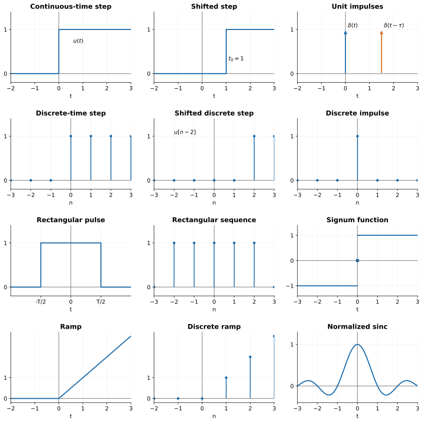
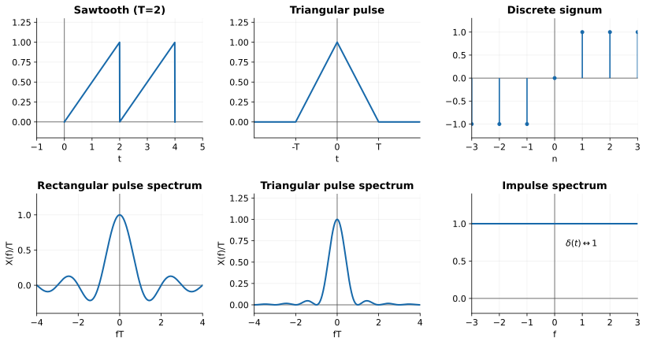
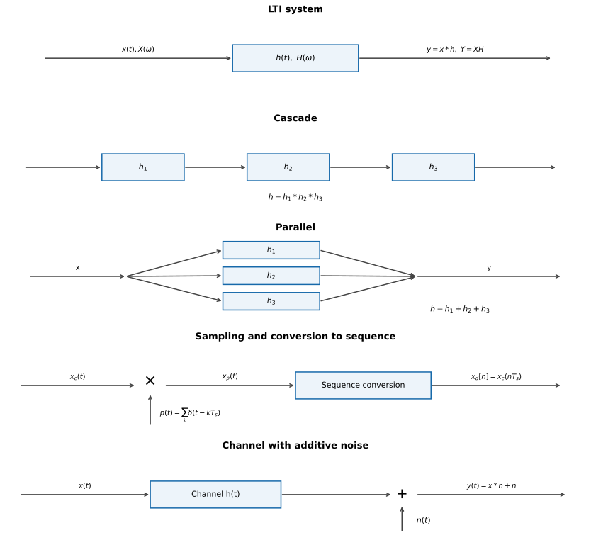
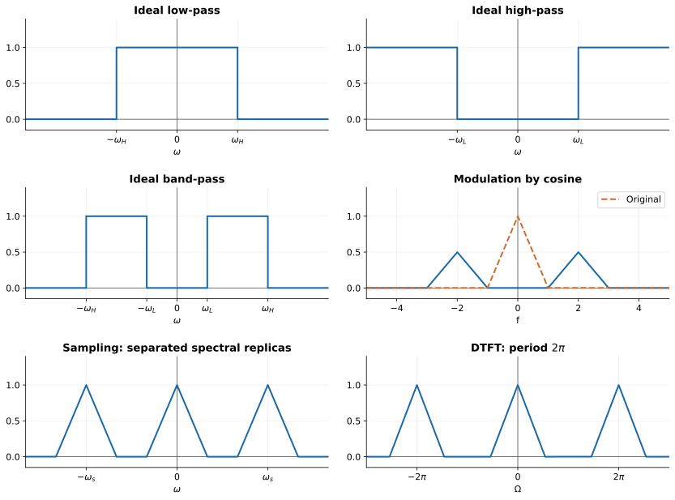
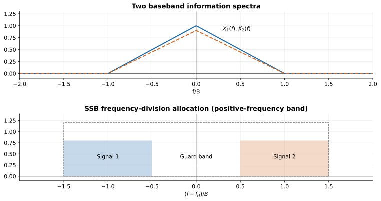
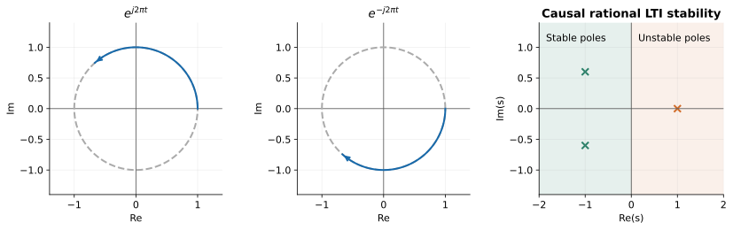

# Signals and Systems · 笔记

## Week 1：信号的基本概念

### 信号分类

- Periodic：周期的；aperiodic：非周期的。
- Stochastic：随机的；deterministic：确定的。
- Fundamental period：最小周期。
- CT（Continuous-Time）：连续时间信号，以 $x(t)$ 表示。
- DT（Discrete-Time）：离散时间信号，以 $x[n]$ 表示，常称为 sequence（序列）。
- Sampling（抽样）：将连续时间信号在离散的时刻取样。
- Analogue：continuous-valued（连续取值）。
- Digital：discrete-valued（离散取值）。

连续时间周期信号的基频和基角频率：
$$f_0=\frac1{T_0},\qquad \omega_0=\frac{2\pi}{T_0}.$$
离散时间周期序列的基频和基角频率：
$$f_0=\frac1{K_0},\qquad \Omega_0=\frac{2\pi}{K_0}.$$

任意信号可分解为偶分量和奇分量：
$$x(t)=x_e(t)+x_o(t),$$
$$x_e(t)=\frac{x(t)+x(-t)}2,\qquad x_o(t)=\frac{x(t)-x(-t)}2.$$

### 能量与功率

能量（energy），单位 joules（焦耳）：
$$E_x=\int_{-\infty}^{\infty}|x(t)|^2\,dt\quad\text{（CT）},$$
$$E_x=\sum_{k=-\infty}^{\infty}|x[k]|^2\quad\text{（DT）}.$$

平均功率（average power），单位 watts（瓦特）：
$$P_x=\lim_{T\to\infty}\frac1T\int_{-T/2}^{T/2}|x(t)|^2\,dt\quad\text{（CT）},$$
$$P_x=\lim_{K\to\infty}\frac1{2K+1}\sum_{k=-K}^{K}|x[k]|^2\quad\text{（DT）}.$$

- $0<E_x<\infty$、$P_x=0$：energy signal（能量信号）。
- $0<P_x<\infty$、$E_x=\infty$：power signal（功率信号）。
- 能量信号具有有限的非零能量，平均功率为零。
- 功率信号具有有限的非零平均功率，其总能量无限。
- 有些信号既不是能量信号，也不是功率信号。例如在无限时间内幅度不断增大的信号。

周期信号若在一个周期内的能量有限，只需用一个周期计算平均功率：
$$P_x=\frac1{T_0}\int_{t_0}^{t_0+T_0}|x(t)|^2\,dt.$$

**Key：** 瞬时功率 $p_x(t)=|x(t)|^2$。能量信号的 $p_x(t)$ 在整个时间轴可积，$E_x=\int_{-\infty}^{\infty}p_x(t)\,dt$；周期功率信号用一周期内的积分求平均功率。

### Basic Time Signals

- The unit-step：单位阶跃。
- The unit-impulse：单位冲激。
- Complex exponential and sinusoidal：复指数与正弦信号。

#### The Unit-Step Function（CT）

$$u(t)=\begin{cases}1,&t\ge0,\\0,&t<0,\end{cases}\qquad
u(t-t_0)=\begin{cases}1,&t\ge t_0,\\0,&t<t_0.\end{cases}$$
$u(t-t_0)$ 在 $t=t_0$ 处由 $0$ 跳变为 $1$。

#### The Unit-Impulse Function（CT）

单位冲激 $\delta(t)$ 在 $t\ne0$ 时为零，且满足
$$\int_{-\varepsilon}^{\varepsilon}\delta(t)\,dt=1\qquad(\varepsilon>0).$$
它不是通常意义上的普通函数，而是用上述积分性质描述的广义函数。

抽样性质：
$$\int_a^b\phi(t)\delta(t)\,dt=
\begin{cases}\phi(0),&a<0<b,\\0,&a<b<0\text{ 或 }0<a<b.\end{cases}$$
端点恰好在 $0$ 时，需要另行约定端点取值。
$$\int_{-\infty}^{\infty}\phi(t)\delta(t-\tau)\,dt=\phi(\tau).$$

性质：
$$\delta(at)=\frac1{|a|}\delta(t),\quad a\ne0;\qquad\delta(-t)=\delta(t),$$
$$x(t)\delta(t)=x(0)\delta(t),\qquad x(t)\delta(t-\tau)=x(\tau)\delta(t-\tau).$$
$$g(t)*\delta(t)=g(t),\qquad g(t)*\delta(t-t_0)=g(t-t_0),$$
$$x(t)=\int_{-\infty}^{\infty}x(\tau)\delta(t-\tau)\,d\tau.$$
阶跃与冲激的关系：
$$\delta(t)=\frac{du(t)}{dt},\qquad u(t)=\int_{-\infty}^t\delta(\tau)\,d\tau.$$

#### Complex Exponential and Sinusoidal（CT）

Euler 公式：
$$e^{j\omega_0t}=\cos(\omega_0t)+j\sin(\omega_0t).$$
当 $\omega_0\ne0$，其最小正周期为 $T_0=2\pi/|\omega_0|$；能量为 $\infty$，平均功率为 $1$。

$$x(t)=\sin(\omega_0t+\theta),\qquad x_m(t)=\sin(m\omega_0t+\theta).$$
$x_m(t)$ 是相对于基频 $\omega_0$ 的第 $m$ 次谐波（$m$th harmonic）。

合成信号
$$g(t)=a x_1(t)+b x_2(t)$$
中，$x_1,x_2$ 的周期分别为 $T_1,T_2$。当 $T_1/T_2$ 为有理数时，可找到公共周期。若
$$\frac{T_1}{T_2}=\frac mn\quad\text{（既约分数）},$$
则最小公共周期为 $nT_1=mT_2$；若合成时没有谐波抵消导致周期进一步缩短，它也是 $g(t)$ 的基本周期。

#### The Unit-Step Sequence（DT）

$$u[n]=\begin{cases}1,&n\ge0,\\0,&n<0,\end{cases}\qquad
u[n-k]=\begin{cases}1,&n\ge k,\\0,&n<k.\end{cases}$$

#### The Unit-Impulse Sequence（DT）

$$\delta[n]=\begin{cases}1,&n=0,\\0,&n\ne0,\end{cases}\qquad
\delta[n-k]=\begin{cases}1,&n=k,\\0,&n\ne k.\end{cases}$$
$$\delta[n]=u[n]-u[n-1],\qquad u[n]=\sum_{k=0}^{\infty}\delta[n-k],$$
$$x[n]=\sum_{k=-\infty}^{\infty}x[k]\delta[n-k].$$

### Operations（CT）：时间变换

Time scaling：时间缩放。

- 对 $x(at+b)$，可以先将 $x(t)$ 平移得到 $x(t+b)$，再将时间变量乘以 $a$，得到 $x(at+b)$。
- 对 $x(a(t+b))$，可以先缩放得到 $x(at)$，再平移得到 $x(a(t+b))$。

注意括号：先加减、后乘除与先乘除、后加减对应的表达式形式不同；若 $a<0$，还包含时间反转。

#### Rectangular Function

连续时间矩形脉冲（宽度 $\tau>0$）：
$$\operatorname{rect}\!\left(\frac t\tau\right)=\begin{cases}1,&|t|\le\tau/2,\\0,&|t|>\tau/2.\end{cases}$$
离散时间矩形序列：
$$\operatorname{rect}\!\left(\frac k{2N+1}\right)=\begin{cases}1,&|k|\le N,\\0,&|k|>N.\end{cases}$$
矩形脉冲在对应区间内高度为 $1$，区间外为 $0$。

#### Signum Function

$$\operatorname{sgn}(t)=\begin{cases}1,&t>0,\\0,&t=0,\\-1,&t<0,\end{cases}\qquad
\operatorname{sgn}[k]=\begin{cases}1,&k>0,\\0,&k=0,\\-1,&k<0.\end{cases}$$

#### Ramp Function

$$r(t)=tu(t)=\begin{cases}t,&t\ge0,\\0,&t<0,\end{cases}\qquad
r[k]=ku[k]=\begin{cases}k,&k\ge0,\\0,&k<0.\end{cases}$$

#### Sinc Function

采用归一化定义：
$$\operatorname{sinc}(\omega_0t)=\frac{\sin(\pi\omega_0t)}{\pi\omega_0t},\qquad\operatorname{sinc}(0)=1.$$
中心峰值为 $1$，零点位于 $t=m/\omega_0$（$m$ 为非零整数），两侧振荡并衰减。

### 线性与时不变性

Linear：线性。Time-invariant：时不变性。若 $T\{x(t)\}=y(t)$，时不变性要求
$$T\{x(t\pm\tau)\}=y(t\pm\tau).$$

## Convolution：卷积

### 连续与离散卷积

连续时间 LTI 系统的单位冲激响应为
$$h(t)=T\{\delta(t)\}.$$
输入 $x(t)$，输出
$$y(t)=x(t)*h(t)=\int_{-\infty}^{\infty}x(\tau)h(t-\tau)\,d\tau.$$

离散时间 LTI 系统的单位冲激响应为
$$h[n]=T\{\delta[n]\}.$$
输入 $x[n]$，输出
$$y[n]=x[n]*h[n]=\sum_{k=-\infty}^{\infty}x[k]h[n-k].$$

### 性质

1. 交换律：$x*h=h*x$。
2. 结合律：$(x*h_1)*h_2=x*(h_1*h_2)$。
3. 分配律：$x*(h_1+h_2)=x*h_1+x*h_2$。

连续与离散卷积均满足以上性质。Overlap：重叠。

### Graphical Method：图形法

1. 将 $h[k]$ 翻转，得到 $h[-k]$。
2. 平移得到 $h[n-k]$，注意左减右加的变量关系。
3. 对每个固定的 $n$，让 $k$ 变化，计算 $y[n]=\sum_kx[k]h[n-k]$。

也可列 Table（表格），把所有对应位置的乘积加在一起。例如，$x[-1]=x[0]=x[1]=1$，其余为零；$h[1]=h[2]=1$，其余为零。则
$$y[0]=1,\qquad y[1]=1\times1+1\times1=2,\qquad y[2]=1\times1+1\times1=2.$$
完整卷积为
$$y[n]=\begin{cases}1,&n=0,3,\\2,&n=1,2,\\0,&\text{其他}.\end{cases}$$

多个系统串联时，可先把 $h_1[k]$ 当作输入与 $h_2[k]$ 卷积，得到 $h_{12}[k]$；再把 $h_{12}[k]$ 与 $h_3[k]$ 卷积，得到总冲激响应。

串联系统：
$$h=h_1*h_2*h_3.$$
并联系统：三个支路的输出相加，因而
$$h[k]=h_1[k]+h_2[k]+h_3[k].$$

### Convolution of CT Systems

$$y(t)=x(t)*h(t)=\int_{-\infty}^{\infty}x(\tau)h(t-\tau)\,d\tau
=\int_{-\infty}^{\infty}h(\tau)x(t-\tau)\,d\tau.$$

关键：画出 $h(-\tau)$，平移得到 $h(t-\tau)$，寻找它与 $x(\tau)$ 的重叠区间。对于每一个给定的 $t$，积分上下限由两者非零区间的交集决定。

Sawtooth wave：锯齿波。例：在 $0\le t<2$ 时从 $(0,0)$ 线性升至 $(2,1)$，即 $x(t)=t/2$，其中 $x(1)=0.5$；随后跳回零，再按周期重复。

## Fourier Series and Fourier Transform

### Orthogonal 与 Orthonormal

两个非零信号 $p(t),q(t)$ 若满足
$$\int_{t_1}^{t_2}p(t)q^*(t)\,dt=0,$$
则称它们在 $[t_1,t_2]$ 上正交（orthogonal）。共轭后的内积也为零：
$$\int_{t_1}^{t_2}p^*(t)q(t)\,dt=0.$$
若还满足
$$\int_{t_1}^{t_2}|p(t)|^2\,dt=\int_{t_1}^{t_2}|q(t)|^2\,dt=1,$$
则称为标准正交（orthonormal）。

$1$、$\cos(n\omega_0t)$、$\sin(n\omega_0t)$（$n=1,2,\ldots$）在任意长度为 $T_0=2\pi/\omega_0$ 的区间 $[t_0,t_0+T_0]$ 上构成正交函数系。

- CTFS：连续时间傅里叶级数，处理 periodic（周期）信号。
- CTFT：连续时间傅里叶变换，可处理 aperiodic（非周期）信号。

### Trigonometric CTFS Coefficients

令周期 $T_0=2l$，三角形式的傅里叶级数为
$$f(x)=\frac{a_0}{2}+\sum_{n=1}^{\infty}\left[a_n\cos\left(\frac{n\pi x}{l}\right)+b_n\sin\left(\frac{n\pi x}{l}\right)\right],$$
$$a_n=\frac1l\int_{(T_0)}f(x)\cos\left(\frac{n\pi x}{l}\right)\,dx,\quad n=0,1,2,\ldots,$$
$$b_n=\frac1l\int_{(T_0)}f(x)\sin\left(\frac{n\pi x}{l}\right)\,dx,\quad n=1,2,3,\ldots.$$
$\int_{(T_0)}$ 表示在任意完整周期上积分。

### Exponential CTFS Coefficients

$$x(t)=\sum_{n=-\infty}^{\infty}D_ne^{jn\omega_0t},$$
$$D_n=\frac1{T_0}\int_{(T_0)}x(t)e^{-jn\omega_0t}\,dt,\qquad\omega_0=\frac{2\pi}{T_0}.$$

### Fourier Transform（FT）与 Inverse Fourier Transform（IFT）

FT 把 time domain（时域）信号变换至 frequency domain（频域）；IFT 将频域表示还原为时域信号。

以频率 $f$ 为变量：
$$X(f)=\int_{-\infty}^{\infty}x(t)e^{-j2\pi ft}\,dt,$$
$$x(t)=\int_{-\infty}^{\infty}X(f)e^{j2\pi ft}\,df.$$
以角频率 $\omega=2\pi f$ 为变量：
$$X(\omega)=\int_{-\infty}^{\infty}x(t)e^{-j\omega t}\,dt,$$
$$x(t)=\frac1{2\pi}\int_{-\infty}^{\infty}X(\omega)e^{j\omega t}\,d\omega.$$
仍采用 $\operatorname{sinc}(\theta)=\sin(\pi\theta)/(\pi\theta)$。

### Rectangular Pulse（Rect Function）

$$x(t)=\operatorname{rect}\!\left(\frac tT\right)=\begin{cases}1,&-T/2\le t\le T/2,\\0,&\text{其他 }t.\end{cases}$$
$$X(f)=T\operatorname{sinc}(fT)=T\operatorname{sinc}\!\left(\frac{T\omega}{2\pi}\right).$$
$T$ 是固定的脉冲宽度，$f$ 或 $\omega$ 才是频谱的自变量。频谱在 $f=0$ 时为 $T$，在 $f=\pm1/T,\pm2/T,\ldots$ 处为零。

幅度为 $A$ 时：
$$A\operatorname{rect}\!\left(\frac tT\right)\longleftrightarrow AT\operatorname{sinc}(fT).$$
矩形面积 $S=AT$。当 $T\to0$、$A\to\infty$ 且 $AT=1$ 时，矩形脉冲趋向单位冲激，对应频谱趋向常数 $1$。

### 常用傅里叶变换对

下表采用 $X(f)=\int x(t)e^{-j2\pi ft}\,dt$。

| Time Function | Fourier Transform |
|---|---|
| $\operatorname{rect}(t/T)$ | $T\operatorname{sinc}(fT)$ |
| $\operatorname{sinc}(2Wt)$，$W>0$ | $\dfrac1{2W}\operatorname{rect}\!\left(\dfrac f{2W}\right)$ |
| $e^{-at}u(t)$，$a>0$ | $\dfrac1{a+j2\pi f}$ |
| $e^{-a\vert t\vert }$，$a>0$ | $\dfrac{2a}{a^2+(2\pi f)^2}$ |
| $e^{-\pi t^2}$ | $e^{-\pi f^2}$ |
| $\operatorname{tri}(t/T)$ | $T\operatorname{sinc}^2(fT)$ |
| $\delta(t)$ | $1$ |
| $1$ | $\delta(f)$ |
| $\delta(t-t_0)$ | $e^{-j2\pi ft_0}$ |
| $A\operatorname{tri}(t/T)$ | $AT\operatorname{sinc}^2(fT)$ |
| $e^{j2\pi f_ct}$ | $\delta(f-f_c)$ |
| $\cos(2\pi f_ct)$ | $\dfrac12[\delta(f-f_c)+\delta(f+f_c)]$ |
| $\sin(2\pi f_ct)$ | $\dfrac1{2j}[\delta(f-f_c)-\delta(f+f_c)]$ |
| $\operatorname{sgn}(t)$ | $\dfrac1{j\pi f}$ |
| $\dfrac1{\pi t}$ | $-j\operatorname{sgn}(f)$ |
| $u(t)$ | $\dfrac12\delta(f)+\dfrac1{j2\pi f}$ |
| $\displaystyle\sum_{i=-\infty}^{\infty}\delta(t-iT_0)$ | $\displaystyle\dfrac1{T_0}\sum_{n=-\infty}^{\infty}\delta\!\left(f-\dfrac n{T_0}\right)$ |

涉及 $1/t$、$1/f$ 等奇异项时按主值分布理解。三角脉冲定义为
$$\operatorname{tri}\!\left(\frac tT\right)=\begin{cases}1-|t|/T,&|t|<T,\\0,&|t|\ge T.\end{cases}$$
它在 $t=0$ 时高度为 $1$，底边从 $-T$ 延伸至 $T$；矩形脉冲的底边从 $-T/2$ 延伸至 $T/2$。

### 常用三角恒等式

$$e^{\pm j\theta}=\cos\theta\pm j\sin\theta,$$
$$\cos\theta=\frac12(e^{j\theta}+e^{-j\theta}),\qquad
\sin\theta=\frac1{2j}(e^{j\theta}-e^{-j\theta}),$$
$$\sin\alpha\sin\beta=\frac12[\cos(\alpha-\beta)-\cos(\alpha+\beta)],$$
$$\cos\alpha\cos\beta=\frac12[\cos(\alpha-\beta)+\cos(\alpha+\beta)],$$
$$\sin\alpha\cos\beta=\frac12[\sin(\alpha-\beta)+\sin(\alpha+\beta)].$$

### 傅里叶变换性质

#### 1. Linearity

$$ax(t)+bv(t)\longleftrightarrow aX(f)+bV(f).$$

#### 2. Time Shift

$$x(t-c)\longleftrightarrow X(f)e^{-j2\pi fc}=X(f)e^{-j\omega c}.$$
$t-c$ 对应右移 $c$；$t+c$ 对应左移 $c$。

#### 3. Time Scaling

$$x(at)\longleftrightarrow\frac1{|a|}X\!\left(\frac fa\right),\qquad a\ne0.$$

#### 4. Multiplication by a Complex Exponential（Frequency Shift）

$$x(t)e^{j\omega_0t}\longleftrightarrow X(f-f_0),\qquad\omega_0=2\pi f_0.$$

#### 5. Multiplication by a Sinusoid

$$x(t)\sin(\omega_0t)\longleftrightarrow\frac1{2j}[X(f-f_0)-X(f+f_0)],$$
$$x(t)\cos(\omega_0t)\longleftrightarrow\frac12[X(f-f_0)+X(f+f_0)].$$

#### 6. Differentiation in the Time Domain

$$\frac{dx(t)}{dt}\longleftrightarrow j2\pi fX(f)=j\omega X(f).$$

#### 7. Integration in the Time Domain

$$\int_{-\infty}^t x(\lambda)\,d\lambda\longleftrightarrow
\frac{X(f)}{j2\pi f}+\frac{X(0)}2\delta(f).$$
当 $X(0)=0$ 时，可简化为 $X(f)/(j\omega)$。

#### 8. Convolution in the Time Domain

$$x(t)*v(t)\longleftrightarrow X(f)V(f).$$

#### 9. Multiplication in the Time Domain

$$x(t)v(t)\longleftrightarrow[X*V](f)=\int_{-\infty}^{\infty}X(\lambda)V(f-\lambda)\,d\lambda.$$
频域卷积等价于时域相乘。若采用角频率形式，则
$$x(t)v(t)\longleftrightarrow\frac1{2\pi}[X*V](\omega).$$

频移时要分清域：时域乘 $e^{j2\pi f_0t}$，频域平移 $f_0$；时域乘 $\cos(2\pi f_0t)$，频域产生向左右平移的两个副本，各乘 $1/2$。先把余弦写成对应的冲激频谱，再作频域卷积。

$\omega$ 在信号与系统中通常称为角频率，单位为 rad/s；$f$ 的单位为 Hz，两者满足 $\omega=2\pi f$。

复平面上的旋转：$e^{j2\pi t}$ 沿单位圆逆时针旋转，$e^{-j2\pi t}$ 沿单位圆顺时针旋转；横轴 Re，纵轴 Im。

## LTI Systems（Linear Time-Invariant Systems）

线性时不变系统具有两个基本性质：

1. 线性：$Ax_1(t)+Bx_2(t)\mapsto Ay_1(t)+By_2(t)$。
2. 时不变性：若 $x(t)\mapsto y(t)$，则 $x(t-t_0)\mapsto y(t-t_0)$。

输入写为
$$x(t)=\frac1{2\pi}\int_{-\infty}^{\infty}X(\omega)e^{j\omega t}\,d\omega.$$
经过 LTI 系统后，输出为
$$y(t)=\frac1{2\pi}\int_{-\infty}^{\infty}X(\omega)H(\omega)e^{j\omega t}\,d\omega.$$
因此
$$y(t)=x(t)*h(t),\qquad Y(\omega)=X(\omega)H(\omega).$$
$H(\omega)$ 是系统的频率响应。系统可充当频率滤波器，允许输入中的某些频率通过，并抑制其他频率。

### Frequency Response of LTI Systems

- Stopband：阻带。
- Passband：通带。
- Bandwidth：带宽。

三种基本滤波器：lowpass filters（低通）、highpass filters（高通）、bandpass filters（带通）。理想情形下，通带增益为 $1$，阻带增益为 $0$。

#### 1. Low Pass

$$H_{\mathrm{LP}}(\omega)=\begin{cases}1,&|\omega|<\omega_H,\\0,&|\omega|>\omega_H.\end{cases}$$
$\omega_H$ 为 upper cutoff frequency（上截止角频率），单边带宽 $B_{\mathrm{LP}}=\omega_H$。

#### 2. High Pass

$$H_{\mathrm{HP}}(\omega)=\begin{cases}0,&|\omega|<\omega_L,\\1,&|\omega|>\omega_L.\end{cases}$$
$\omega_L$ 为 lower cutoff frequency（下截止角频率），理想高通的带宽 $B_{\mathrm{HP}}=\infty$。

#### 3. Band Pass

$$H_{\mathrm{BP}}(\omega)=\begin{cases}1,&\omega_L<|\omega|<\omega_H,\\0,&\text{其他}.\end{cases}$$
带宽为 $B_{\mathrm{BP}}=\omega_H-\omega_L$。

## 离散时间傅里叶分析

### 离散时间周期与频率

$$x[n]=x[n+N].$$
对复指数 $e^{j\Omega n}$，周期条件是
$$\Omega N=2\pi k,\qquad\Omega=\frac{2\pi k}{N}.$$
注意 $\Omega$ 为大写欧米伽，$\omega$ 为小写欧米伽。离散时间频率相差 $2\pi$ 的整数倍时产生相同的序列。因此以 $N$ 为周期的不同复指数只有 $N$ 个：
$$\Omega=0,\frac{2\pi}{N},\frac{4\pi}{N},\ldots,\frac{2\pi(N-1)}{N}.$$

连续时间变换中两种频率变量的关系可明确写为
$$X_f(f)=\int_{-\infty}^{\infty}x(t)e^{-j2\pi ft}\,dt,$$
$$X_\omega(\omega)=\int_{-\infty}^{\infty}x(t)e^{-j\omega t}\,dt
=X_f\!\left(\frac\omega{2\pi}\right),$$
$$x(t)=\int_{-\infty}^{\infty}X_f(f)e^{j2\pi ft}\,df
=\frac1{2\pi}\int_{-\infty}^{\infty}X_\omega(\omega)e^{j\omega t}\,d\omega.$$

### DTFS：傅里叶级数

令 $\Omega_0=2\pi/N$。

Analysis（分析）：
$$a_k=\frac1N\sum_{n=\langle N\rangle}x_N[n]e^{-jk\Omega_0n}.$$
Synthesis（合成）：
$$x_N[n]=\sum_{k=\langle N\rangle}a_ke^{jk\Omega_0n}.$$
$\langle N\rangle$ 表示任取连续 $N$ 个整数。系数 $a_k$ 是周期为 $N$ 的序列：
$$a_{k+N}=a_k,\qquad a_0=a_N=a_{-N}.$$

周期输入经过频率响应为 $H(\Omega)$ 的 LTI 系统：
$$x_N[n]=\sum_{k=\langle N\rangle}a_ke^{jk\Omega_0n}
\quad\Longrightarrow\quad
y_N[n]=\sum_{k=\langle N\rangle}H(k\Omega_0)a_ke^{jk\Omega_0n}.$$
输出的傅里叶系数为
$$b_k=a_kH(k\Omega_0).$$
若 $v_N[n]=x_N[n-n_0]$，则它的傅里叶系数为
$$v_k=a_ke^{-jk\Omega_0n_0}.$$

### DTFT：离散时间傅里叶变换

方法一：由定义直接求和。
$$X(\Omega)=\sum_{n=-\infty}^{\infty}x[n]e^{-j\Omega n},$$
$$x[n]=\frac1{2\pi}\int_{\langle2\pi\rangle}X(\Omega)e^{j\Omega n}\,d\Omega.$$
逆变换积分取任意长度为 $2\pi$ 的区间。注意连续变量用圆括号，序列自变量用方括号。

方法二：对于周期序列，用傅里叶级数系数表示其冲激频谱。
$$X(\Omega)=2\pi\sum_{k=-\infty}^{\infty}a_k\delta(\Omega-k\Omega_0).$$

基本记法：周期为 $N$ 时，$\Omega_0=2\pi/N$，谐波频率为 $\Omega=k\Omega_0$。$\sum_{k=\langle N\rangle}$ 可以从 $0$ 到 $N-1$ 求和，也可以从 $1$ 到 $N$ 求和，结果相同。

例：
$$x[n]=\sin\left(\frac\pi3n+\frac\pi4\right).$$
$\Omega_0=\pi/3$，基本周期 $N=2\pi/(\pi/3)=6$。

记忆：用 $f$ 表示连续频率时，逆变换前没有 $1/(2\pi)$；用角频率 $\omega$ 或 $\Omega$ 时，逆变换前有 $1/(2\pi)$。

### DTFT 的性质

1. **Periodicity：** $X(\Omega+2\pi)=X(\Omega)$。
2. **Linearity：** $Ax_1[n]+Bx_2[n]\longleftrightarrow AX_1(\Omega)+BX_2(\Omega)$。
3. **Time shift：** $x[n-n_0]\longleftrightarrow e^{-j\Omega n_0}X(\Omega)$。
4. **Frequency shift：** $e^{j\Omega_0n}x[n]\longleftrightarrow X(\Omega-\Omega_0)$。
5. **Reflection：** $x[-n]\longleftrightarrow X(-\Omega)$。
6. **Real signals：** 若 $x[n]$ 为实数，$X(\Omega)=X^*(-\Omega)$，因而 $|X(\Omega)|=|X(-\Omega)|$，$\angle X(\Omega)=-\angle X(-\Omega)$（按相位的模 $2\pi$ 意义理解）。
7. **Convolution：**
   $$x_1[n]*x_2[n]\longleftrightarrow X_1(\Omega)X_2(\Omega),$$
   $$x_1[n]x_2[n]\longleftrightarrow\frac1{2\pi}\int_{\langle2\pi\rangle}X_1(\lambda)X_2(\Omega-\lambda)\,d\lambda.$$
8. **Parseval's Relation：**
   $$\sum_{n=-\infty}^{\infty}|x[n]|^2=\frac1{2\pi}\int_{\langle2\pi\rangle}|X(\Omega)|^2\,d\Omega.$$

### 常用离散时间傅里叶变换

$$x[n]=\begin{cases}1,&-N_1\le n\le N_1,\\0,&\text{其他},\end{cases}
\quad\longleftrightarrow\quad
X(\Omega)=\frac{\sin[(N_1+1/2)\Omega]}{\sin(\Omega/2)}.$$
分母为零的位置取连续延拓值。

$$a^nu[n]\longleftrightarrow\frac1{1-ae^{-j\Omega}},\qquad |a|<1.$$

$$\frac{\sin(Wn)}{\pi n}\longleftrightarrow
X(\Omega)=\begin{cases}1,&|\Omega|<W,\\0,&W<|\Omega|\le\pi,\end{cases}\qquad0<W<\pi.$$
$n=0$ 处取值为 $W/\pi$，频谱以 $2\pi$ 为周期延拓。

无论离散还是连续，卷积都满足交换律（commutative property）、分配律（distributive property）、结合律（associative property）。

## Sampling：采样

Analog（模拟）$\longrightarrow$ sampled（取样）$\longrightarrow$ quantised（量化）。

取样函数为冲激列：
$$p(t)=\sum_{k=-\infty}^{\infty}\delta(t-kT_s).$$
$T_s$ 为取样周期，$f_s=1/T_s$ 为取样频率，$\omega_s=2\pi f_s=2\pi/T_s$ 为取样角频率。

连续信号 $x_c(t)$ 与冲激列相乘得到
$$x_p(t)=x_c(t)p(t)=\sum_{k=-\infty}^{\infty}x_c(kT_s)\delta(t-kT_s).$$
再转换成离散序列：
$$x_d[n]=\sum_{k=-\infty}^{\infty}x_c(kT_s)\delta[n-k]=x_c(nT_s).$$

频域中，采样后的频谱是原频谱的周期复制：
$$X_p(\omega)=\frac1{T_s}\sum_{k=-\infty}^{\infty}X_c(\omega-k\omega_s).$$
它以 $\omega_s$ 为周期，每个副本相对于原频谱缩放 $1/T_s$。

### 连续与离散频谱的关系

$$x_p(t)=\sum_{n=-\infty}^{\infty}x_d[n]\delta(t-nT_s),$$
$$X_p(\omega)=X_d(\omega T_s),\qquad X_d(\Omega)=X_p\!\left(\frac\Omega{T_s}\right).$$
特别地，$X_p(\omega_s)=X_d(2\pi)$。也可以直接写成
$$X_d(\Omega)=\frac1{T_s}\sum_{k=-\infty}^{\infty}X_c\!\left(\frac\Omega{T_s}-k\frac{2\pi}{T_s}\right).$$
其中 $X_c(\omega)$ 是 $x_c(t)$ 的 Fourier Transform。

Digital signal：数字信号，量化后的有限取值信号常用二进制 $0,1$ 编码表示。

### Quantisation：量化

若均匀量化的级间距（quantisation step）为 $q$，采用就近取整且没有过载时，量化误差不超过 $\pm q/2$。

### D/A Conversion：重建连续信号

若原信号的最高角频率为 $B$，避免混叠要求
$$\omega_s=\frac{2\pi}{T_s}>2B.$$
理想重建低通滤波器的截止角频率可选在
$$B<\omega_c<\omega_s-B.$$
通带内增益设为 $T_s$，以补偿采样带来的幅度因子 $1/T_s$。

例：
$$x(t)=7+4\cos\left(2\pi t-\frac{7\pi}{8}\right)+2\cos\left(6\pi t+\frac\pi8\right).$$
最高角频率为 $B=6\pi$ rad/s，即 $3$ Hz。Nyquist rate 为 $2B=12\pi$ rad/s，即 $6$ Hz；$T_s=2\pi/\omega_s$，实际采样通常取高于该临界采样频率。

Transmission bit rate（每秒传输的比特数）与 bit time（发送一比特所需时间）满足
$$R_b=\frac1{T_b}.$$
$x(t)$ 变为 $x(2t)$，带宽扩大为两倍；$x(t)$ 变为 $x(t-1)$，带宽及所需采样频率不变。

选用截止角频率 $\pi/T_s$ 的理想重建滤波器：
$$H(\omega)=\begin{cases}T_s,&|\omega|<\pi/T_s,\\0,&|\omega|>\pi/T_s,\end{cases}$$
$$h(t)=\frac{T_s\sin(\pi t/T_s)}{\pi t}=\operatorname{sinc}(t/T_s).$$
重建公式：
$$x_c(t)=x_p(t)*h(t)=\sum_{n=-\infty}^{\infty}x_d[n]\operatorname{sinc}\!\left(\frac t{T_s}-n\right).$$

若题目中最小比特间隔为 $T_{b,\min}=2T$，则
$$R_{b,\max}=\frac1{T_{b,\min}}=\frac1{2T}.$$
$T_b$ 减小，传输速率增大，所需带宽通常增大；$T_b$ 增大，传输速率与所需带宽减小。

Recuperate：恢复；modify：修改。分离信号的方法：转到频域寻找规律。

### 抽样与重构的解题步骤

#### 连续时间信号

已知输入 $m(t)$ 和采样间隔 $T_s$，求采样信号的频谱 $M_s(j\omega)$：

1. 对 $m(t)$ 作傅里叶变换得到 $M(j\omega)$，确定其带宽 $\omega_H$，要求 $\omega_s=2\pi/T_s\ge2\omega_H$，临界情形需注意边界处频谱。
2. 若 $m(t)$ 非周期，直接求变换；若周期为 $T_0$，先求傅里叶级数系数 $M[k]$，再写为
   $$M(j\omega)=2\pi\sum_{k=-\infty}^{\infty}M[k]\delta(\omega-k\omega_0),\qquad\omega_0=\frac{2\pi}{T_0}.$$
3. 频谱复制：
   $$M_s(j\omega)=\frac1{T_s}\sum_{k=-\infty}^{\infty}M\!\left(j(\omega-k\omega_s)\right).$$

已知 $M_s(j\omega)$ 和 $T_s$，重构 $m(t)$：

1. 取理想低通窗
   $$D(j\omega)=\begin{cases}1,&|\omega|<\omega_s/2,\\0,&|\omega|>\omega_s/2,\end{cases}$$
   并计算 $M(j\omega)=T_sM_s(j\omega)D(j\omega)$。
2. 对 $M(j\omega)$ 作逆傅里叶变换得到 $m(t)$。

#### 离散序列及其冲激列表示

已知 $m[n]$，先求 DTFT
$$M(e^{j\Omega})=\sum_{n=-\infty}^{\infty}m[n]e^{-j\Omega n}.$$
若 $m[n]$ 周期为 $N$，可先求级数系数 $M[k]$，然后写成
$$M(e^{j\Omega})=2\pi\sum_{k=-\infty}^{\infty}M[k]\delta(\Omega-k\Omega_0),\qquad\Omega_0=\frac{2\pi}{N}.$$
将 $\Omega=\omega T_s$ 代入，即得到间隔为 $T_s$ 的冲激列的连续时间频谱 $M_s(j\omega)$。

反向恢复时，先用上述低通窗恢复带限连续信号 $m(t)$，然后在 $t=nT_s$ 取值，得到 $m[n]$。

例题类型：对于给定信号及抽样间隔 $T_s$，确定傅里叶变换 $X_s(j\omega)$，并画出相应频谱。

## 通信信道与频分传输

- Transmitter（Tx）：发送器。
- Receiver（Rx）：接收器。
- Attenuation：衰减。
- Distortion：失真。
- Noise / interference：噪声 / 干扰。

信号通过冲激响应为 $h(t)$ 的信道，并叠加噪声 $n(t)$ 后：
$$y(t)=x(t)*h(t)+n(t),$$
$$Y(\omega)=X(\omega)H(\omega)+N(\omega).$$

### Understanding the Channel

By analysing the channel, different modulation techniques can be devised which allow us to:

- Reduce the attenuation and distortion.
- Transmit multiple signals at the same time（share the medium）.

**Example.** Assume that you need to transmit simultaneously two baseband information signals $x_1(t)$ and $x_2(t)$ with bandwidth $B$ through a channel with frequency response
$$H(f)=\begin{cases}1,&\bigl||f|-f_H\bigr|<1.5B,\\0,&\text{otherwise}.\end{cases}$$
Design a suitable modulation for transmitting your information signals and a suitable receiver.

两路基带频谱分别集中在 $[-B,B]$。正频率信道通带为 $[f_H-1.5B,f_H+1.5B]$，宽度为 $3B$。为让两路信号各占宽度 $B$，可使用单边带调制并进行频分复用。设两路已调信号所占频带的中心分别为 $f_1,f_2$，则需满足
$$\begin{cases}
f_2+B/2\le f_H+3B/2,\\
f_1+B/2\le f_2-B/2,\\
f_1-B/2\ge f_H-3B/2.
\end{cases}$$
例如取 $f_1=f_H-B$、$f_2=f_H+B$，两路之间留有宽度 $B$ 的保护间隔。接收端先用各自的带通滤波器分离两路信号，再分别同步解调并低通滤波，恢复对应的基带信号。

## 拉普拉斯变换（Laplace Transform）

### 定义、零点与极点

双边（two-sided）变换：
$$X(s)=\int_{-\infty}^{\infty}x(t)e^{-st}\,dt.$$
逆变换：
$$x(t)=\frac1{2\pi j}\int_{c-j\infty}^{c+j\infty}X(s)e^{st}\,ds.$$
其中 $s=c+j\omega$；使变换积分收敛的 $s$ 的集合称为收敛域（ROC）。逆变换的积分直线须位于 ROC 内。逆变换积分与 ROC 的详细讨论不考。

单边（single-sided）变换：
$$X(s)=\int_{0^+}^{\infty}x(t)e^{-st}\,dt.$$
若用 $0^-$ 作为下限，则会包括 $t=0$ 的冲激，并在导数公式中相应使用 $x(0^-)$。

- 零点（zero）：约去公因子后，使 $X(s)$ 的分子为零的 $s$ 值。
- 极点（pole）：约去公因子后，使 $X(s)$ 的分母为零的 $s$ 值。

### 性质

#### 1. 线性

若 $x_1(t)\longleftrightarrow X_1(s)$、$x_2(t)\longleftrightarrow X_2(s)$，则
$$ax_1(t)+bx_2(t)\longleftrightarrow aX_1(s)+bX_2(s).$$
ROC 至少包含两个原 ROC 的交集；若发生极零抵消，可能扩大。

#### 2. 时移

双边变换满足
$$x(t-t_0)\longleftrightarrow e^{-st_0}X(s),$$
ROC 不变。

#### 3. $s$ 域频移

$$e^{s_0t}x(t)\longleftrightarrow X(s-s_0).$$
ROC 在实部方向平移 $\operatorname{Re}(s_0)$，极点与零点也相应平移。

#### 4. Scaling in Time

$$x(at)\longleftrightarrow\frac1{|a|}X\!\left(\frac sa\right),\qquad a\ne0.$$
变换后 ROC 为所有满足 $s/a$ 位于原 ROC 的 $s$ 的集合。若 $a>0$，原 ROC 的实部边界乘以 $a$。

#### 5. 共轭

$$x^*(t)\longleftrightarrow X^*(s^*).$$

#### 6. 卷积

$$x_1(t)*x_2(t)\longleftrightarrow X_1(s)X_2(s).$$
ROC 至少包含两个原 ROC 的交集。

#### 7. 时域微分与积分

双边变换（边界项消失时）：
$$\frac{dx(t)}{dt}\longleftrightarrow sX(s).$$
单边变换（从 $0^+$ 开始）：
$$\frac{dx(t)}{dt}\longleftrightarrow sX(s)-x(0^+).$$
$$\int_{-\infty}^t x(\tau)\,d\tau\longleftrightarrow\frac{X(s)}s.$$
后一式 ROC 至少包含原 ROC 与 $\operatorname{Re}(s)>0$ 的交集。例如
$$u(t)\longleftrightarrow\frac1s,\qquad\operatorname{Re}(s)>0.$$

#### 8. $s$ 域微分与积分

$$-tx(t)\longleftrightarrow\frac{dX(s)}{ds}.$$
对满足相应收敛条件的右边信号，
$$\frac{x(t)}t\longleftrightarrow\int_s^{\infty}X(\sigma)\,d\sigma.$$

#### 9. 初值与终值定理

在各定理的适用条件下：
$$x(0^+)=\lim_{s\to\infty}sX(s),$$
$$\lim_{t\to\infty}x(t)=\lim_{s\to0}sX(s).$$
终值定理要求 $sX(s)$ 的极点均在开左半平面，不能直接用于持续振荡或发散的信号。

例：零初始条件下，
$$H(s)=\frac1{s+3}\quad\Longleftrightarrow\quad\frac{dy(t)}{dt}+3y(t)=x(t).$$

### Stability 与计算技巧

对因果、适当的有理 LTI 系统，BIBO 稳定要求所有极点位于复平面的开左半平面。右半平面存在极点则不稳定；虚轴极点也不满足 BIBO 稳定条件。

拉普拉斯变换的计算技巧：部分分式展开（裂项）。
$$\frac{s+1}{s(s+2)}=\frac1{2s}+\frac1{2(s+2)}.$$
