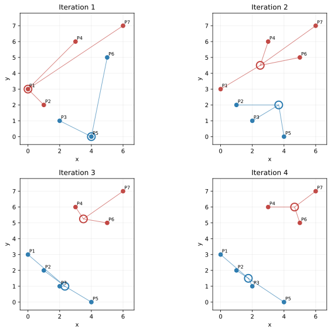

# Smart Infrastructure · 提纲

## 第一周

**什么是smart infrastructure？**

 Level

- Decision-making based on sensor data is autonomous and near real time.

 Values

- Self-monitoring and accuracy in decision-making; efficiency and cost savings; reliability; security, safety and resilience; user interaction and empowerment; sustainability; redundancy minimisation; response time; low carbon footprint; and service quality.

 Principles

- Acquire data.

- Analyse data (real time).

- Maintain feedback loop.

- Design for adaptability.

**Interrogate data的过程，Data analytics-based smart infrastructure process**

**Consider the data analytics-based process for smart infrastructure. At which point does the process end? Explain the process and support the explanation by an example of smart infrastructure value creation.**

There is no true end, it is a cycle.

Example: Smart Street Lighting

（1）Business Understanding

What is the problem that I want to solve?

The goal is to reduce city electricity costs.

（2）Analytics Approach

How can I use data to answer Question 1？

Dim the street lamps when the street is empty.

（3）Data Requirements

What data do I need for Question 2?

Need data on Number of cars and people on the street at different times

（4）Data Collection

Where is this data produced, how I can get it?

Put sensors on the lamps.

（5）Data Understanding

Is the data that I collected representative of the problem that want to solve?

Check: Is the data real?（Is it a person or a cat?）

（6）Data Preparation

Is the data ready to be used or do I need to ‘clean’ it first?

Remove "bad" data and fix errors.

（7）Modelling

How can I visualize the data to answer my question?

Create a plan: 100% light if busy, 50% if quiet.

（8）Evaluation

Does my model answer the question or do I need to change it?

How much electricity consumption was reduced?

（9）Deployment

Can the model be used in practice?

Use this system in the whole city.

（10）Feedback

Can I get feedback and new data on how well I’ve answered the initial question?

Check the bills. Ask people: "Is it good?"

**反馈过程理解**

Example: Smart Traffic Management

1.  Modelling: Create a prediction model using traffic data (vehicle counts, speed, time patterns) to forecast congestion and optimize traffic light timing.

2.  Evaluation: Test if the model accurately predicts traffic flow.

3.  Deployment: Install the model in real traffic control systems across the city.

4.  Feedback: Collect real-world performance data:

    - Actual traffic speeds

    - Congestion levels

    - Travel times

    - Driver behavior

5.  Back to Modelling: Use feedback to improve the model:

    - Fix errors (model underestimated rush hour traffic)

    - Add new factors (construction zones, weather impacts)

    - Update parameters with recent patterns

6.  Repeat: Deploy improved model → Get new feedback → Refine further

The Loop's Value:

Models learn from real outcomes, not just historical data

System adapts to changing conditions (new roads, population growth)

Continuous optimization improves traffic flow over time

Identifies blind spots in original assumptions

**A smart car uses computer vision to predict if a pedestrian will cross the street in front of it (positive class) or not (negative class). If crossing is predicted, the car will automatically stop. A dataset of 300 video clips is manually labelled where each video clip constitutes a data point. 250 of those in which pedestrians cross the street are labelled as positive, the rest are negative.**

| Predicted class / Actual class | Positive | Negative |
|---|---|---|
| Positive | TP | FP |
| Negative | FN | TN |

$$
\mathrm{Sensitivity}=\mathrm{Recall}=\mathrm{TPR}=\frac{TP}{TP+FN}
$$

$$
\mathrm{Specificity}=\mathrm{TNR}=\frac{TN}{FP+TN},\qquad
\mathrm{Precision}=\mathrm{PPV}=\frac{TP}{TP+FP}
$$

$$
F_1=\frac{2\,\mathrm{Precision}\,\mathrm{Recall}}{\mathrm{Precision}+\mathrm{Recall}}
$$

**（1）Model A correctly predicts all positive cases and achieves 83.33% accuracy. Evaluate this model and discuss how its performance will affect the car behaviour. Use the metrics in Appendix A to support your argument.**

| Actual / Predicted | Positive | Negative | Total |
|---|---:|---:|---:|
| Positive | 250 | 0 | 250 |
| Negative | 50 | 0 | 50 |
| Total | 300 | 0 | 300 |

（1）安全性角度：这份测试集上的召回率很高 —— 因为 FN=0，测试集中真正横穿的行人都被检出。

Safety on this test set: Recall = 100%.

FN = 0: The model misses none of the crossing pedestrians in the test set.

Result: It predicts crossing for every clip and always requests a stop. Test results alone do not establish safety in every real-world situation.

（2）体验/交通角度：很糟 —— 因为 FP=50 且 Specificity=0，表示只要遇到行人就几乎都判“会横穿”并停车：

Traffic & Experience: Very Bad

FP = 50 / Specificity = 0: The car is too "scared."

Result: It stops for every person on the sidewalk in the test, even if they aren't crossing. It Sacrifices traffic efficiency for safety.

**（2）Model B correctly predicts all negative cases and achieves 83.33% accuracy. Evaluate this model and discuss how its performance will affect the car behaviour. Use the metrics in Appendix A to support your argument.**

| Actual / Predicted | Positive | Negative | Total |
|---|---:|---:|---:|
| Positive | 200 | 50 | 250 |
| Negative | 0 | 50 | 50 |
| Total | 200 | 100 | 300 |

（1）体验/效率角度：这份测试集上没有误报 —— FP=0，没有因误判横穿而触发停车；这不能说明模型的预测置信度。

Traffic & Efficiency: Excellent

FP = 0: Zero "false alarms."

Result: No stop is triggered for a non-crossing pedestrian in this test set.

（2）Safety: Very Dangerous

FN = 50: The car missed 50 people who actually crossed.

Result: The car failed to stop many times when it should have, leading to high accident risks.

两种模型的指标汇总：

| Metric | Model A | Model B |
|---|---:|---:|
| Accuracy | 83.33% | 83.33% |
| Recall / Sensitivity | 100% | 80% |
| Specificity | 0% | 100% |
| Precision | 83.33% | 100% |
| F1 | 90.91% | 88.89% |

**（3）What can you do to have a better model than A and B? Hint: Consider the process in Figure 1 and identify the steps that you might use to improve your model.**

\(1\) Data Collection

The goal is to ensure high-quality inputs for the model.

- **Class Balance:**

  - Augment negative samples to balance the classes.

  - For training, choose an appropriate balance between crossing and non-crossing clips. The labels describe whether pedestrians cross, not simply whether pedestrians are present. Keep validation and test sets representative of the intended operating conditions.

- **Data Diversity:**

  - Collect data that covers varied conditions (e.g., different weather, times of day, and pedestrian behaviors).

  - This helps reduce overfitting to limited data scenarios.

- **Data Cleaning:**

  - Remove low-quality data.

  - Correct **mislabels** to ensure data reliability.

\(2\) Modelling

The focus here is on configuring the model for safety and accuracy.

- **Loss Function:**

  - Prioritize safety by using a **weighted loss function** (likely penalizing missed detections more heavily).

- **Hyperparameter Tuning:**

  - Optimize parameters to find the right balance between **recall and precision**.

- **Validation:**

  - Split data into different sets (Training vs. Validation vs. Test) to ensure unbiased evaluation.

- **Algorithm Selection:**

  - Choose an appropriate algorithm with strong computer vision capabilities.

  - Ensure the algorithm captures **movement features** well.

\(3\) Evaluation

Look beyond Accuracy. Do not just check the total score. Focus more on False Negatives (missing a person) and True Positives (correctly stopping) to ensure safety.

（4）Deployment & Feedback Loop

How to maintain the model after it goes live.

- **Deploy a Feedback Loop:**

  - After the initial deployment, collect real-world data.

  - **Retrain** the model periodically using this new data.

- **False Negative (FN) Management:**

  - Specifically identify occasional False Negatives (cases where the model missed something) and add them back into the **training set** to improve future performance.

**电费题**

（1）Recommendation: Hourly data collection

Hourly collection is best. Daily data is too slow to catch theft quickly and misses important patterns. Minute or second data costs too much storage and processing power without helping much. Hourly data captures daily usage patterns well, supports timely detection and investigation, keeps costs reasonable, and works well for machine learning models.

（2）Prioritise: Positive class (theft detection)

Detecting theft is more important. Missing real theft (false negative) causes direct money loss from unbilled energy. False alarms (false positive) only waste investigation time but can be managed. With 90% no-theft samples, models might just predict "no theft" for everything and miss all thieves. We need high recall/TPR to catch actual theft cases.

（3）Best model: RUSBoost\* (after data augmentation)

RUSBoost\* has the highest TPR (55%) and a WF1 of about 77%, so it is preferred if catching theft is the main priority. LGBM and CNN have higher WF1 but lower TPR (about 20% and 35%); the other models achieve roughly 42%–52% TPR. RUSBoost\* catches more theft cases, although false-positive rates and investigation costs are also needed to judge the overall trade-off. The \* denotes data augmentation for rebalancing.

注：F1的取值范围是\[0, 1\]，F1 = 1 时，意味着模型的 Precision（精确率） 和 Recall（召回率） 同时也都达到了 1。当 F1 = 0 时，意味着 Precision 或 Recall 中至少有一个为 0。

**Analytics**

（1）Descriptive Analytics

What happened

（2）Diagnostic Analytics

Why happening

（3）Predictive Analytics

What will happen

（4）Prescriptive Analytics

What to do

**Smart grids**

**Smart grids represent a leading application to smart infrastructure and aim to improve the efficiency, resilience, and sustainability of energy systems. This question examines the peak-shaving feature of smart grids shown in Figure 6 to avoid the inefficient and costly energy production during peaks.**

**（1）What data would you need to investigate this solution and which sensors and/or other data sources would you need? (less than 100 words)**

（1）need real-time energy consumption profiles to identify peak timings.

（2）Smart Meters: For granular household usage data.

（3）Smart Appliances/IoT Sensors: To monitor individual device consumption.

（4）Weather Data: To forecast renewable generation (wind/solar) and heating demand.

（5）SCADA/PMUs: For grid operational monitoring.

**（2）What type of analytics would you need to investigate the efficacy of the solution under different scenarios? Can you think of an artificial intelligence approach to generate these**

（1）I would use Predictive Analytics to show what will happen to the grid load under various conditions, and Prescriptive Analytics to show what to do by optimizing strategies to shave the peaks.

（2）AI Approach: "I would use GANs. They learn from past data to create realistic test scenarios. This helps us simulate extreme events to verify 'resource plan strategies' and make 'decisions under uncertainty' without real-world risks."

**（3）The data in Figure 7 shows that less than 50% of residential homes in the United Kingdom upgraded to smart meters despite the evidence that these can contribute to sustainable energy production and reduce the energy bills of homes by up to 10%. What could be the reason and how would you apply data analytics to investigate. Hint: think of data privacy and related risks. (max 200 words)**

（1）The main reason is that people are worried about their privacy and online safety. Smart meters collect very detailed data about electricity use, like when someone is not at home. This makes people feel uncomfortable, as they fear being watched, having their data used in the wrong way, or being hacked.

（2）First, I would use Descriptive Analytics to look at customer feedback and social media comments. This helps me find out what is happening — for example, many people often mention "privacy" as a big concern.

（3）Next, I would use Diagnostic Analytics to find out why this is happening. I would use Correlation tools to check if people who care more about privacy are also the ones rejecting smart meters. A clear connection supports this explanation, but correlation alone does not establish that privacy fears cause low usage; surveys and other factors such as cost and installation access should also be examined.

## 第二周

**Data fusion**

（1）Heterogeneous Input Data

Diverse data from different sources

（2）Data Alignment

（3）Data/Object Correlation

（4）Aligned and Correlated Data

（5）Attribute/Identity Estimation

（6）Data Fusion Result

**看图回答**

**i) 想解决哪些事故成因？用哪些 Smart Transportation 技术？（≤100词）**

（1）I would address accidents caused by driver error（Driver failed to look properly）, using ITS（Intelligent Transportation Systems）to reduce human mistakes.

（2）Collaborative Perception and V2X (Vehicle-to-Everything) techniques

（3）These systems let cars share information. They include features like Blind Spot Assist and Collision Avoidance.

**ii) 您将使用什么类型的传感器来收集数据以支持您的解决方案？您将如何评估您的解决方案？（最多 100 字）。**

（0）Vehicle mounted sensors

（1）use Camera sensors to identify objects and signs, and use Radar sensors for detection

（2）use Vehicle accident frequency（before VS after）to do the evaluation.

**iii) 您将应用什么类型的分析来分析提议解决方案的有效性？在这种情况下，您会考虑使用数字孪生 (Digital Twins) 吗？（最多 100 字）。**

（1）I would use Descriptive Analytics to show what happened and Diagnostic Analytics to show why happening.

（2）I would use Predictive Analytics to show what will happen and Prescriptive Analytics to show what to do.

（3）Yes, Integrating Digital Twins enables higher-level Predictive and Prescriptive Analytics. This allows us to simulate "what will happen" under different scenarios and optimize "resource plan strategies" (what to do) in a virtual environment before actual implementation, ensuring maximum efficacy with minimal risk.

**汽车尾气**

（1）Diagnostic Analytics

The initial finding shows PM2.5 decreased significantly. Central roadside dropped from 16.4 μg/m³ (2017) to 10.0 μg/m³ (2023) - a 39% reduction. Inner London roadside fell 41%. The data also shows traffic volume declined in Central and Inner London after the zones started, which is consistent with a possible ULEZ effect, but does not by itself establish causation.

（2）To effectively monitor vehicle types, I would deploy a combination of disruptive and non-disruptive sensors:

Disruptive Sensors: I would use Inductive Loop Detectors. Unlike other road-embedded options, these specifically list "vehicle type identification" as a capability alongside speed and counting.

Non-Disruptive Sensors: I would implement Traffic Monitoring Camera Systems or Video Surveillance Cameras. These are crucial because they can visually distinguish specific vehicle classes (e.g., distinguishing a van from a car) and extract detailed information from video footage without damaging the road surface.

（3）COVID is reflected in the 2020-2021 data: PM2.5 dropped sharply (to 8.8 μg/m³) and traffic collapsed (Figure 4). This confounds my analysis in (i) because lockdowns also reduced travel and emissions, so the change cannot be attributed solely to ULEZ.

Strategy: Utilize Predictive Analytics.

Process: Perform Data Preparation (Data cleaning).

Mark the lockdown periods and account for them in the analysis, for example with a lockdown indicator, traffic and weather controls, or a comparison with unaffected areas. Compare results with and without those periods as a sensitivity check.

Lockdown observations are real data; removing them automatically does not by itself remove confounding.

**A smart car uses computer vision to predict if the driver is distracted (positive class) or not (negative class). If the model identifies the driver as distracted, it will generate an alarm and force the car to stop. The test dataset of 300 video clips is manually labelled where each video clip constitutes a data point. 50 of those in which the driver is distracted are labelled as positive, 250 are negative.**

**（1）哪个模型更合适？为什么？**

（1）Model B is better.

（2）

（3）In safety-critical tasks, it is better to have a false alarm than to miss a danger. Model B captures the "distracted" drivers much better.

**（2）数据不平衡时如何提升性能？还需要什么数据？传感器？**

（1）Use Oversampling on the minority class (distracted) or Undersampling on the majority class to balance the training set.

（2）Eye Movement

Sensor: Infrared (IR) eye-tracking camera. 红外

（3）Heart Rate

Wearable sensors (smartwatch) or contact sensors on the steering wheel（方向盘）.

**混淆矩阵**

（1）Model A is better.

Key metrics

Reasons:

False Negative = patient has heart attack but gets no help → life-threatening

False Positive = unnecessary ambulance → consumes resources and may delay care for other patients

Model A has fewer false negatives (10 vs 30)

For this question, prioritize fewer missed heart attacks, while also considering ambulance capacity and the cost of false alarms.

（2）

Sensor noise and signal interference

Individual differences in ECG patterns

Motion artifacts from daily activities

Imbalanced training data

Poor feature extraction

Overfitting or underfitting

（3）

Prevention of Data Leakage: ECG data is highly subject-specific. Standard 5-fold validation randomly mixes samples, likely placing data from the same subject in both training and testing sets. This allows the model to "memorize" individual features rather than learning general disease patterns, leading to inflated accuracy.

Assessment of Generalization: Real-world applications encounter unseen users. LOSO (training on 9 subjects, testing on 1) tests an unseen-subject scenario, helping assess whether the model generalizes beyond the people in the training set.

Practicality: With only 10 subjects, LOSO is quick to run. It provides a more relevant evaluation than randomly splitting clips across the same subjects. Grouped 5-fold validation with whole subjects assigned to folds is also a valid alternative; either approach must keep subjects separate.

**计算Z-score**

正常范围 (Not unusual):

-2 ≤ z ≤ 2

中度异常 (Moderately unusual):

-3 \< z \< -2 或 2 \< z \< 3

异常值 (Outliers):

z ≤ -3 或 z ≥ 3

z = (x - μ) / σ

**计算IQR**

## 第三周

**Smart meters in the UK can be programmed by the customer to report data every 15 minutes or 30 minutes. How would you prepare the data from multiple smart meters with different setting before applying a data analytics approach? Hint: there are two options, discuss both. (less than 150 words)**

（1）Downsampling (Aggregation)：Convert 15-minute data into 30-minute intervals, usually by summing (for energy) or averaging (for power) every two readings.

Pros:

Uses only actual recorded data

High accuracy and less noise

Cons:

Lower resolution

May miss short-term peaks important for some analyses

（2）Upsampling (Interpolation)：Convert 30-minute data into 15-minute intervals. For interval energy totals, allocate each total across the two shorter intervals while preserving its sum; for sampled power values, linear interpolation may be used.

Pros:

Preserves the existing 15-minute readings and puts all meters on a common time grid

Allows modeling at 15-minute intervals, but does not recover the missing detail in 30-minute readings

Cons:

Introduces estimated ("synthetic") data

Might make the data look too smooth and hide real changes

（3）Summary

Use Option 1 for accurate reporting and reliability.

Choose Option 2 if you need detailed pattern analysis and can accept some estimation error.

**K means**

数据点为：

| Point | P1 | P2 | P3 | P4 | P5 | P6 | P7 |
|---|---:|---:|---:|---:|---:|---:|---:|
| x | 0 | 1 | 2 | 3 | 4 | 5 | 6 |
| y | 3 | 2 | 1 | 6 | 0 | 5 | 7 |

取初始质心 $C_{1,1}=(0,3)$、$C_{2,1}=(4,0)$。

$$D(P_1,P_2)=\sqrt{(x_1-x_2)^2+(y_1-y_2)^2}.$$

每轮先按欧氏距离分配，再用簇内坐标均值更新质心。表中列出距离的平方，距离本身为对应值的平方根；这不影响最近质心的判断。数值展示保留四位小数，计算使用未舍入值。

**Iteration 1**：$C_1=(0,3)$，$C_2=(4,0)$。

| 距离平方 / Point | P1 | P2 | P3 | P4 | P5 | P6 | P7 |
|---|---:|---:|---:|---:|---:|---:|---:|
| $D^2(C_1,P)$ | 0.0000 | 2.0000 | 8.0000 | 18.0000 | 25.0000 | 29.0000 | 52.0000 |
| $D^2(C_2,P)$ | 25.0000 | 13.0000 | 5.0000 | 37.0000 | 0.0000 | 26.0000 | 53.0000 |
| 归属 | C1 | C1 | C2 | C1 | C2 | C2 | C1 |

$C_1$ 包含 P1, P2, P4, P7；更新为 $((0+1+3+6)/4,(3+2+6+7)/4)=(2.5,4.5)$。

$C_2$ 包含 P3, P5, P6；更新为 $((2+4+5)/3,(1+0+5)/3)=(3.66667,2)$。

**Iteration 2**：$C_1=(2.5,4.5)$，$C_2=(3.66667,2)$。

| 距离平方 / Point | P1 | P2 | P3 | P4 | P5 | P6 | P7 |
|---|---:|---:|---:|---:|---:|---:|---:|
| $D^2(C_1,P)$ | 8.5000 | 8.5000 | 12.5000 | 2.5000 | 22.5000 | 6.5000 | 18.5000 |
| $D^2(C_2,P)$ | 14.4444 | 7.1111 | 3.7778 | 16.4444 | 4.1111 | 10.7778 | 30.4444 |
| 归属 | C1 | C2 | C2 | C1 | C2 | C1 | C1 |

$C_1$ 包含 P1, P4, P6, P7；更新为 $((0+3+5+6)/4,(3+6+5+7)/4)=(3.5,5.25)$。

$C_2$ 包含 P2, P3, P5；更新为 $((1+2+4)/3,(2+1+0)/3)=(2.33333,1)$。

**Iteration 3**：$C_1=(3.5,5.25)$，$C_2=(2.33333,1)$。

| 距离平方 / Point | P1 | P2 | P3 | P4 | P5 | P6 | P7 |
|---|---:|---:|---:|---:|---:|---:|---:|
| $D^2(C_1,P)$ | 17.3125 | 16.8125 | 20.3125 | 0.8125 | 27.8125 | 2.3125 | 9.3125 |
| $D^2(C_2,P)$ | 9.4444 | 2.7778 | 0.1111 | 25.4444 | 3.7778 | 23.1111 | 49.4444 |
| 归属 | C2 | C2 | C2 | C1 | C2 | C1 | C1 |

$C_1$ 包含 P4, P6, P7；更新为 $((3+5+6)/3,(6+5+7)/3)=(4.66667,6)$。

$C_2$ 包含 P1, P2, P3, P5；更新为 $((0+1+2+4)/4,(3+2+1+0)/4)=(1.75,1.5)$。

**Iteration 4**：$C_1=(4.66667,6)$，$C_2=(1.75,1.5)$。

| 距离平方 / Point | P1 | P2 | P3 | P4 | P5 | P6 | P7 |
|---|---:|---:|---:|---:|---:|---:|---:|
| $D^2(C_1,P)$ | 30.7778 | 29.4444 | 32.1111 | 2.7778 | 36.4444 | 1.1111 | 2.7778 |
| $D^2(C_2,P)$ | 5.3125 | 0.8125 | 0.3125 | 21.8125 | 7.3125 | 22.8125 | 48.3125 |
| 归属 | C2 | C2 | C2 | C1 | C2 | C1 | C1 |

$C_1$ 包含 P4, P6, P7；更新为 $((3+5+6)/3,(6+5+7)/3)=(4.66667,6)$。

$C_2$ 包含 P1, P2, P3, P5；更新为 $((0+1+2+4)/4,(3+2+1+0)/4)=(1.75,1.5)$。

第 4 轮的归属与上一轮一致，质心不再改变，算法收敛。最终 $C_1=\{P4,P6,P7\}$，$C_2=\{P1,P2,P3,P5\}$。

**K-means计算题**

（1）

**第 1 轮：按当前质心分配**

| Council | (x, y) | d(C1) | d(C2) | d(C3) | 归类 |
|---|---|---:|---:|---:|---|
| Brent | (3.32, 21.20) | 6.21 | 9.91 | 14.97 | C1 |
| Sutton | (3.46, 12.90) | 2.15 | 3.65 | 9.39 | C1 |
| Greenwich | (9.37, 15.60) | 6.40 | 4.31 | 7.10 | C2 |
| Harrow | (8.50, 12.50) | 6.04 | 1.58 | 4.95 | C2 |
| Ealing | (3.79, 19.70) | 4.77 | 8.34 | 13.49 | C1 |
| Hounslow | (5.79, 17.40) | 3.68 | 5.53 | 10.45 | C1 |
| Redbridge | (6.52, 14.00) | 3.66 | 2.06 | 7.42 | C2 |
| Richmond upon Thames | (16.87, 10.40) | 14.61 | 10.00 | 5.07 | C3 |
| Bexley | (7.75, 12.90) | 5.19 | 1.17 | 5.77 | C2 |

**更新质心**：对各簇取平均 $x$ 与平均 $y$。

- C1：Brent, Sutton, Ealing, Hounslow。质心 $((3.32+3.46+3.79+5.79)/4,(21.2+12.9+19.7+17.4)/4)=(4.09,17.8)$。
- C2：Greenwich, Harrow, Redbridge, Bexley。质心 $((9.37+8.5+6.52+7.75)/4,(15.6+12.5+14+12.9)/4)=(8.035,13.75)$。
- C3：Richmond upon Thames。质心 $((16.87)/1,(10.4)/1)=(16.87,10.4)$。

**第 2 轮：按当前质心分配**

| Council | (x, y) | d(C1) | d(C2) | d(C3) | 归类 |
|---|---|---:|---:|---:|---|
| Brent | (3.32, 21.20) | 3.49 | 8.82 | 17.33 | C1 |
| Sutton | (3.46, 12.90) | 4.94 | 4.65 | 13.64 | C2 |
| Greenwich | (9.37, 15.60) | 5.72 | 2.28 | 9.13 | C2 |
| Harrow | (8.50, 12.50) | 6.89 | 1.33 | 8.63 | C2 |
| Ealing | (3.79, 19.70) | 1.92 | 7.31 | 16.05 | C1 |
| Hounslow | (5.79, 17.40) | 1.75 | 4.29 | 13.11 | C1 |
| Redbridge | (6.52, 14.00) | 4.51 | 1.54 | 10.96 | C2 |
| Richmond upon Thames | (16.87, 10.40) | 14.77 | 9.45 | 0.00 | C3 |
| Bexley | (7.75, 12.90) | 6.12 | 0.90 | 9.46 | C2 |

**更新质心**：对各簇取平均 $x$ 与平均 $y$。

- C1：Brent, Ealing, Hounslow。质心 $((3.32+3.79+5.79)/3,(21.2+19.7+17.4)/3)=(4.3,19.4333)$。
- C2：Sutton, Greenwich, Harrow, Redbridge, Bexley。质心 $((3.46+9.37+8.5+6.52+7.75)/5,(12.9+15.6+12.5+14+12.9)/5)=(7.12,13.58)$。
- C3：Richmond upon Thames。质心 $((16.87)/1,(10.4)/1)=(16.87,10.4)$。

第 2 轮 Sutton 从 C1 转入 C2。用第 2 轮后的质心再分配，所有归类保持不变，算法收敛。

**最终聚类结果：**

- C1，质心约为 $(4.30,19.43)$：Brent, Ealing, Hounslow。
- C2，质心约为 $(7.12,13.58)$：Sutton, Greenwich, Harrow, Redbridge, Bexley。
- C3，质心约为 $(16.87,10.40)$：Richmond upon Thames。

（2）

Interpretation: Based on the K-means clustering results from (i), we can see a clear negative relationship between "Woodland %" and "CO2/Sq.km".

C1 (High pollution group): Areas like Brent and Ealing have very low woodland coverage (about 3%-4%) and high CO2 emissions (\>17).

C3 (Low pollution group): Areas like Richmond have the highest woodland coverage (16.87%) and the lowest CO2 emissions (10.4).

The green bars show woodland area and the purple bars show traffic. Brent combines little woodland with relatively high traffic, while Richmond has the largest woodland area. Woodland may absorb some carbon, but clustering and the bar chart alone cannot establish how much of the difference it explains.

（3）Brent 与 Sutton 的比较：

Both areas have similar woodland coverage (Brent 3.32%, Sutton 3.46%) and similar total area. Brent has higher traffic (1024.5 versus 731.2 million vehicle kilometres), which is consistent with its higher CO2 per square kilometre (21.2 versus 12.9). Traffic is a plausible contributing factor; these observations alone do not establish that it is the only cause.

（4）按表格数据，Bexley 的 CO2/Sq.km 是 12.9，Brent 是 21.2，两者并不相同。与 Bexley 相同的是 Sutton（12.9）。

If the intended comparison is Bexley and Sutton, Bexley has both more traffic (1033.6 versus 731.2) and more woodland coverage (7.75% versus 3.46%), as well as a larger area. These factors may offset one another, producing similar emissions per square kilometre. Further information on vehicle types, industrial emissions and other factors would be needed to explain the equality conclusively.

## 第四周

**计算两个句子的余弦相似度**

句子转换成向量，相同单词算一次

**空气质量变化**

（1）There is a negative correlation between temperature and NO concentration.

When temperature is high: NO values are lower and more stable (e.g., during daytime on Monday and Tuesday).

When temperature is low: NO values rise sharply (e.g., at night or early morning).

（2）Yes. This pattern matches what we learn in class

（1）There is a negative correlation between temperature and NO concentration. This means that higher NO levels are generally associated with lower temperatures, while higher temperatures tend to correspond to lower NO concentrations.

（2）Most data points are clustered in the range of 20–60 μg/m³ for NO and 5–12°C for temperature.

（3）There is a clear outlier at the bottom left corner (where NO is 0 and Temperature is about 2).

本题按最近秩法取第 $\lceil0.25n\rceil=12$ 与第 $\lceil0.75n\rceil=36$ 个观测值作为四分位数。

（1）Descriptive Analytics: data aggregation

The weekly NO data is grouped by hour, and the average, min and max for each hour is calculated. This creates a clear 24-hour profile instead of many scattered raw data points.

（2）From Figure 11 and the known rush hours (7–10 AM and 4–7 PM), we can see:

Transportation Impact Insights: Figure 11 shows the strongest rise during the morning rush hour (7–10 AM), when the daily maximum occurs. There is a smaller rise around the evening commute (4–7 PM). This is consistent with a contribution from transport emissions, but identifying the main source requires traffic data, weather controls and further source analysis.

Peak morning hours: NO As traffic volume increases, congestion accumulates rapidly.

Midday: Due to the increase in temperature and a slight decrease in traffic flow, the concentration of NO has dropped.

Peak evening hours: As the commuting traffic volume increased again, NO once again showed a significant peak.
