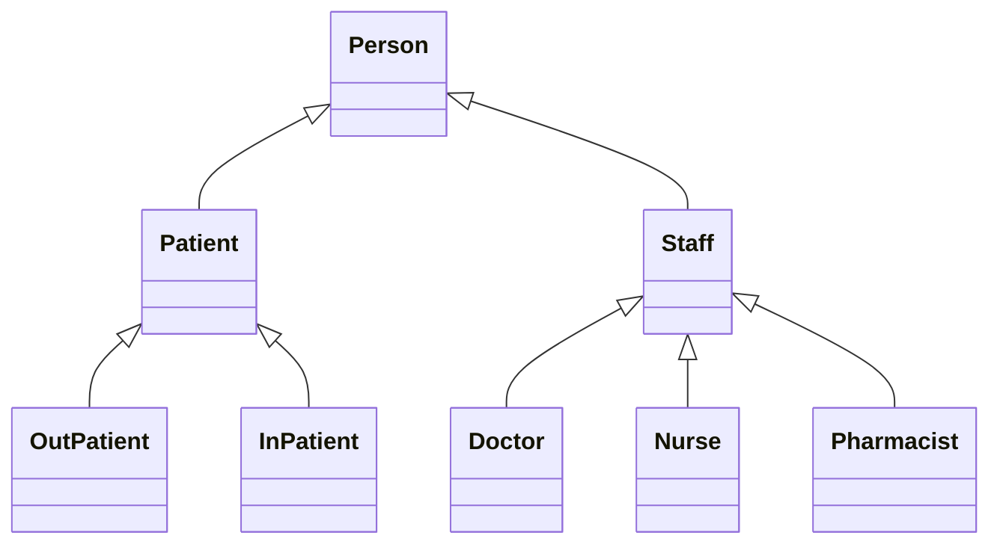
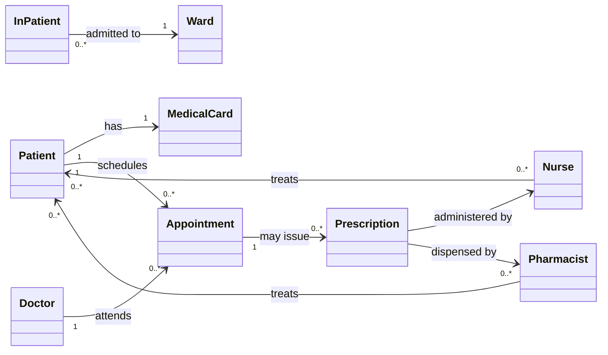
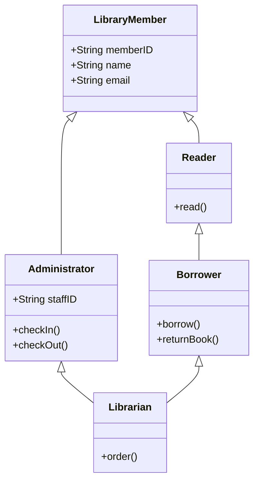
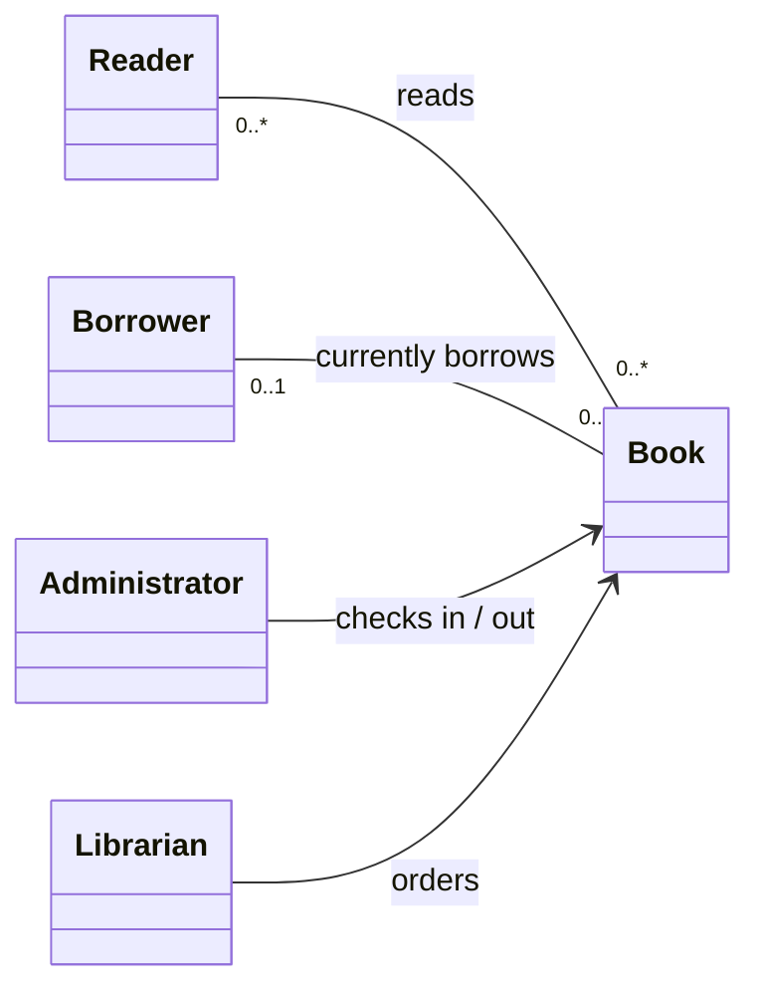
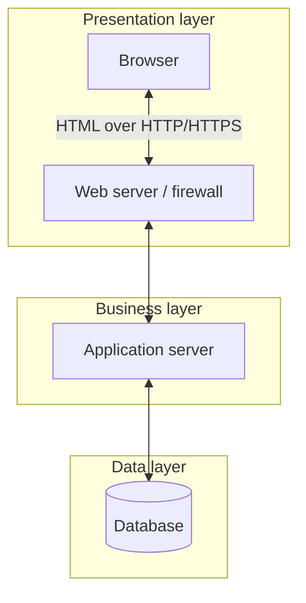

# Software Engineering · 题目

## 1. Week 1

### 1.1 Software process models

#### 1.1.1 有哪几种Software process models？

- **Traditional:** Waterfall、Evolutionary development、The Rational Unified Process (RUP).
- **Modern:** Agile software development.

#### 1.1.2 Suggest the most appropriate software process for developing a system to control anti-lock braking in a car. Give your reasons.

1. waterfall model.

2. Because anti-lock braking system is a safety-critical system, so requires a lot of up-front analysis before implementation.

3. Waterfall model is a plan-driven process with the requirements carefully analyzed.

#### 1.1.3 What is Agile?

It is:

- **Lightweight**.
- **Highly iterative**, with short iterations.
- **Test-driven**.
- Focused on **value to customer**.
- Based on **frequent releases**.
- Able to **cope with change**.

#### 1.1.4 Agile适用的场景和理由

- **The requirements are changing, unclear and not well-defined**

    Agile welcomes changing and unclear requirements

- **The project needs quick delivery**

    Agile delivers working software frequently in short iterations

- **The project needs to get feedback during development**

    Agile encourages customer involvement throughout the process

- **The system focuses on user experience**

    Agile supports frequent testing and improvement.

- **The technology is complex and risky**

    Agile reduces risk by building and testing in small increments.

**A university is planning to develop a virtual reality classroom system to enhance remote teaching and learning experience. Suggest the most appropriate software process model that might be used for developing this system. Give your reasons.**

1. **Agile software development process model. It is:**

    - **Lightweight**.
    - **Highly iterative**, with short iterations.
    - **Test-driven**.
    - Focused on **value to customer**.
    - Based on **frequent releases**.
    - Able to **cope with change**..

2. The requirements are changing and unclear.

    Agile welcomes changing and unclear requirements. It helps the university update the requirements during the project.

3. The project needs quick delivery.

    Agile delivers working software frequently in short iterations, which is ideal for releasing usable features early.

4. The project needs to get feedback during development.

    Agile encourages customer involvement throughout the process. allowing teachers and students to give feedback during development.

5. **The system focuses on user experience**

    Agile supports frequent testing and improvements, which helps in building an interactive and user-friendly VR classroom.

6. **The technology is complex and risky**

    Agile reduces risk by developing and testing in small increments, making it easier to manage VR-related challenges.

#### 1.1.5 Why Agile is suitable for this project (with links to Agile principles) ?

原理加分析

- Agile embraces change.

    The requirements are changing and unclear.

- Agile uses incremental delivery.

    We want to deliver features step by step

- Agile values customer involvement.

    We need feedback from the customer.

- Agile focuses on people, not process.

    敏捷认为**好的人才+良好的沟通合作**，比照本宣科的流程更能带来成功。

    The team is skilled and can manage itself

- Agile maintains simplicity.

    The app should be simple and easy to use

### 1.2 requirements

#### 1.2.1 Functional requirements的例子

- The student shall be able to submit coursework.

- The administrator shall be able to create a student list.

- The lecturer shall be able to set an assignment and its deadline.

#### 1.2.2 User story的模版


常见的人物：lecturer、student、user、influencer、new user

**You are leading a software development team to build a new fitness app for a startup company. The project aims to develop an interactive, user-friendly app that can provide users with guided workout routines, track activity, and offer personalized recommendations. The startup has ambitious growth plans and expects frequent customer feedback and updates to enhance features and accommodate changing market demands. Your team members are highly skilled and experienced developers. Based on this brief description of the scenario, answer the following questions.**

**Identify a functional requirement that has the highest priority and provide your reasons why it has the highest priority. Write a detailed user story for that function.**

1. **Functional requirement：**

    The user shall be able to register and log in to the fitness app.

2. **Reason：**

    This is a must-have feature. Without it, users cannot access workouts, track activity, or receive recommendations.

    It enables personalization, data storage, and user feedback—all essential for the startup's goals.

3. **User Story：**

    As a new user, I want to register and log in to the fitness app, so that I can access my personal workouts, track my progress, and get tailored recommendations.

#### 1.2.3 Non-Functional requirements的模版

- Speed：Event response time

- Size：MB/GB

- Ease of use：Training time

- Reliability：Mean time to failure

- Robustness：Percentage of events causing failure

- Portability：be able to run on both MacOS and Windows.

#### 1.2.4 "The software should be portable" There is problem with the statement, rewrite it.

重写后的non-functional requirements需要详细，不能简略

The software should be able to run on both MacOS and Windows.

**One of the non-functional requirements in a mobile APP development is “energy-efficient: make the APP more usable on low power mobile devices and help reduce the overall carbon footprint”. Suggest a method to verify this requirement and re-write this non-functional requirement to make it verifiable.**

1. The mobile app shall consume no more than 4 percentage points of battery over 30 minutes of the agreed typical-use test script on the specified test devices, with fixed OS version, screen brightness and network conditions.

2. **verify：** To verify this, record the battery level and run the same 30-minute test script (e.g., browsing and switching screens) under the specified conditions. Keep background activity controlled and repeat the test. Check that the measured battery drop meets the 4-percentage-point acceptance threshold.

#### 1.2.5 Identify a non-functional requirement and rewrite it in a way that can be verified.

1. The app should be portable.

2. The app should be able to run on both MacOS and Windows.

## 2. Week 2

### 2.1 Analysis（UML）

#### 2.1.1 What is the multiplicity of an association? Give an example.

1. It states how many instances of a class at one role end can be associated with an instance of another class at the other role end.

2. **Example**

    ```mermaid
    classDiagram
      Dog "0..*" -- "0..1" Owner : Lives
      User "0..1" -- "0..*" Book : Borrows
      Lecturer "0..2" -- "0..*" Course : Teaches
    ```

    多重性写在被计数的一端：一个 Owner 可以对应 0 到多只 Dog；一只 Dog 对应 0 或 1 个 Owner。一个 User 可借多本 Book，一本 Book 同时对应至多一个借阅者。一个 Lecturer 可教多门 Course，一门 Course 对应 0 到 2 位 Lecturer。

#### 2.1.2 3 main stereotypes of classes for analysis

- **Entity classes**

    名词，单数

- **Boundary classes**

    User Interface、File Reader/Writer、Web API Controller、Network Communication Handler

- **Control classes**

    XXManager、XXController、XXProcessor、XXGenerator

#### 2.1.3 识别三种stereotypes


- **Entity classes**

    找名词，换成单数

    

    所以Entity classes：doctor, nurse, pharmacist, patient, medical card, appointment, prescription, ward

- **Boundary classes**

    根据名词，加UI

    DoctorUI、NurseUI、PharmacistUI、PatientUI、appointmentUI、prescriptionUI

- **Control classes**

    找动词，找到作用对象

    

    所以Control classes：AppointmentScheduler、RecordManager、PrescriptionController、WardAdmissionController、WardDischargeController




关联关系：



这里把 Appointment 视为包括尚未完成就诊的预约，因此它可以暂时没有处方；每张处方对应一次就诊。每个在院 InPatient 当前对应一个 Ward。题干未规定每张处方必须由几名护士或药剂师处理，因此这两条关联不额外规定多重性。

#### 2.1.4 画UML


找出动词和名词




与书籍的关联关系：



这里 Book 表示可借阅的单册书。同一册书同时最多有一个借阅者；Librarian 同时具备 Borrower 与 Administrator 的能力，符合题干中的 “all of the above duties”。这是分析模型的角色继承，不限定最终代码必须采用多类继承。

箭头是类的泛化（generalisation）关系，空心三角形指向父类。

### 2.2 Design

#### 2.2.1 “Refactoring means frequently changing the code in order to change its external behavior”. Do you agree with this statement? Explain why

1. No.

2. Refactoring is a reorganization technique that simplifies the design

3. It Frequently reviews/changes code, without changing its external behavior

4. Refactoring is intended to improve nonfunctional attributes of the software

#### 2.2.2 Advantages of Object-Oriented Design

- **Easier maintenance**

    - Objects are independent.

    - Objects may be understood as stand-alone entities.

- **Objects are potentially reusable components**

    - Reuse previous developed objects

    - Standard object

    - Inheritance

- For some systems, there may be an obvious mapping from real world entities to system objects.

#### 2.2.3 Which two fundamental design concepts are used to ensure less dependencies within the system? Explain your answers.

**Encapsulation：**

- It Restricts direct access to some of an object's components. Information hiding

- Bundling data with the methods that operate on that data. Implementations of abstract data types.

**Modularity：**

- It separates the functionality of a program into independent, interchangeable可替换的 modules.

- Each module contains everything necessary to execute only one aspect of the desired functionality.

- A module interface expresses the elements that are provided and required by the module.

- The elements defined in the interface are detectable by other modules.

**Summary：**

Encapsulation & Modularity achieves low coupling（耦合） and high cohesion（内聚）, so that it can be used to ensure less dependencies within the system.

#### 2.2.4 Define and discuss the concepts of cohesion and coupling, explaining what an optimal system should look like in terms of applying these concepts.


- **Coupling（耦合）:** The degree of dependency between subsystems, reflecting the strength and extent of their interconnections.

- **Cohesion（内聚）:** The degree to which the elements within a module contribute to a single, well-defined responsibility; it describes functional relatedness rather than simply counting dependencies.

- An optimal system should have low coupling and high cohesion.

- Subsystem with as loosely as coupled to minimize the impacts of errors and future changes.

- Subsystem with high cohesion means that all parts of the components should contribute to its logical function. If it is necessary to change the system, then everything to do with the component is encapsulated in one place.

### 2.3 Test

#### 2.3.1 Test Case Design密码

You are going to test a software unit which is to validate a username format. A valid username must be six characters long, the first three characters must be letters and the last three characters must be digits. For example, abc123 and ghh558 are valid usernames. Design test cases using Partition Testing.


invalid inputs包括：value outside the valid range, inputs of the wrong type（Non-integer，Negative value, Non-digits）

#### 2.3.2 Test Case Design分段画图


#### 2.3.3 Test Case Design分段


#### 2.3.4 Test Case Design分段


#### 2.3.5 写production和test代码


#### 2.3.6 写production和test代码


## 3. Week 3

### 3.1 Software Architecture

#### 3.1.1 List five most significant features of using RESTful architecture for development compared to other approaches.

REST is a combination of 6 architectural constraints

- **Client-server**

- **Cacheability 缓存能力**

- **Uniform interface**

- **Statelessness**

- **Layered system**

- **Code-On-Demand（可选约束）**

**It is often said that “non-functional requirements are a result of the architectural choices”. Discuss an architectural choice in the context of web-based applications that makes the system more robust to hardware failures.**

1. **Choose distributed systems architecture**

2. It uses Replication and clusters, Load balancing, Caching, Serverless/cloud computing and Hadoop and Map Reduce to make the system more robust to hardware failures.

**A web-based application your company is developing needs to be RESTful, i.e., that it respects the REST architectural constraints. In the current version, after a user has logged in, the client is still required to send its login credentials to the server at every request. Which of the REST constraints does this behavior follow or violate and why?**

1. **Follow Statelessness**

2. Statelessness means that each request can be understood independently, without relying on server-side client session context from earlier requests.

3. The server keeps no session state.

4. Every request should contain all information needed to process it, including authentication information such as a token. This does not require resending a username and password, and does not prohibit persistent application data such as user records.

#### 3.1.2 “Architectural patterns can be seen as a way of reusing knowledge”. Do you agree with this statement? Explain why

1. I agree.

2. Patterns are a means of representing, sharing and reusing knowledge.

3. An architectural pattern is a stylized description of good design practice, which has been tried and tested in different environments.

4. Patterns should include information about when they are and when they are not useful.

5. Patterns may be represented using tabular and graphical descriptions.

#### 3.1.3 What is load balancing in the context of distributed systems and what is its aim?

1. Load balancing is the run-time technique of distributing client requests or computational work across multiple service instances or nodes.

2. **Aim:**

    - Prevent any single node from becoming overloaded.

    - Improve performance and response time.

    - Ensure high availability and fault tolerance.

    - Enable scalability by adding more nodes.

#### 3.1.4 Describe Mobile applications architecture.



1. Applications developed for mobiles are usually structured using a layered architecture.

2. **Presentation layer**

    User Interface and UI process components

3. **Business layer**

    Main functionalities, potentially deployed on a remote backend to reduce the load on the mobile.

4. **Data layer**

    Data helpers and utilities, data access components, and service agents.

#### 3.1.5 What is the business layer in the context of mobile applications architecture and how can it be used to reduce the computational load on the mobile?

**What：**

1. It is a layer in the mobile application architecture. It is between Presentation layer and Data layer.

2. It contains the main functionalities of the app.

**How：**

1. It can be deployed on a remote backend to reduce the load on the mobile.

2. Send Offloads heavy tasks (e.g., data processing, calculations) to the server.

3. Send back only processed results, reducing computational load on the mobile.

4. Allows the mobile app to stay lightweight and responsive.

### 3.2 project management

#### 3.2.1 What are the goals of a successful software project management? Explain.

- **Deliver on time**

    develop and release the product by the agreed deadline.

- **Stay within budget**

    keep actual spending at or below the authorized cost baseline.

- **Assure quality**

    meet or exceed the required functionality, reliability and maintainability.

- **Control risk and uncertainty**

- **Use people and resources efficiently**

- **Satisfy stakeholders**

#### 3.2.2 In project scheduling, we should not assume that every stage will be problem-free. Suggest scheduling rules to deal with unexpected problems.

1. Estimate as if nothing will go wrong.

2. Add 30% for anticipated problems.

3. Add further 20% to cover unanticipated problems.

#### 3.2.3 What is Project scheduling process？

1. **Split project into separate tasks**

    estimate time and resources required to complete each task.

2. **Organize tasks concurrently**

    to make optimal use of workforce.

3. **Minimize task dependencies**

    to avoid delays caused by one task waiting for another to complete.

#### 3.2.4 AON计算方法

1. 根据表连接活动节点。AON 中活动和 duration 写在节点上，连线表示先后依赖。

2. **正向**

    

    

    

    正向计算：

    $`\displaystyle ES_i=\max_{j\in\mathop{\mathrm{pred}}\nolimits(i)}EF_j,\qquad EF_i=ES_i+DUR_i.`$

    没有前驱的活动通常从时间 0 开始。

    ES多合一，取最大

    

3. **反向**

    

    反向计算：

    $`\displaystyle LF_i=\min_{j\in\mathop{\mathrm{succ}}\nolimits(i)}LS_j,\qquad LS_i=LF_i-DUR_i.`$

    LF多合一，取最小

    

4. **计算其他值**

    节点内的四个时刻按如下顺序记录：

    | ES（最早开始） | EF（最早结束） |
    |---|---|
    | LS（最迟开始） | LF（最迟结束） |

    Slack time（总时差）：

    $`\displaystyle S_i=LS_i-ES_i=LF_i-EF_i.`$

    Critical path 是起点到终点总持续时间最长的路径，它决定项目的最短完成时间。采用最早完成的项目截止时间时，关键路径上的活动总时差为 0。

    Critical path上的slack time一般是0，有时不止一条Critical path

    若计划截止时间采用最早完工时间，则本题的 planned project duration 等于关键路径时长；题目另外指定的截止时间可能不同。

    Non-critical time=Slack time=LS-ES

    不能一般性地把所有节点的总时差相加当作项目可任意消耗的缓冲，因为相依活动可能共享时差。本题只有 F 的时差非零，所以可用非关键时间为 7 周。

#### 3.2.5 AON计算


计算方法回顾笔记

1. **Network and activity times**

    ```mermaid
    flowchart LR
      S((Start)) --> A["A：2"]
      S --> B["B：3"]
      A --> C["C：4"]
      A --> D["D：3"]
      B --> D
      C --> F["F：3"]
      C --> E["E：8"]
      D --> E
      E --> G["G：2"]
      F --> H["H：3"]
      G --> H
      H --> T((End))
    ```

    | Activity | Duration | ES | EF | LS | LF | Slack |
    |---|---:|---:|---:|---:|---:|---:|
    | A | 2 | 0 | 2 | 0 | 2 | 0 |
    | B | 3 | 0 | 3 | 0 | 3 | 0 |
    | C | 4 | 2 | 6 | 2 | 6 | 0 |
    | D | 3 | 3 | 6 | 3 | 6 | 0 |
    | E | 8 | 6 | 14 | 6 | 14 | 0 |
    | F | 3 | 6 | 9 | 13 | 16 | 7 |
    | G | 2 | 14 | 16 | 14 | 16 | 0 |
    | H | 3 | 16 | 19 | 16 | 19 | 0 |

    项目最短完成时间为 19。两条关键路径为 `A → C → E → G → H` 与 `B → D → E → G → H`。

2. **Planned project duration**

    

3. **Non-critical time**

    

    Float=slack time=LS-ES

    

## 4. Week 4

### 4.1 Design Principles

#### 4.1.1 Solid Design Principles

#### 4.1.2 回顾笔记

- **SRP（single responsibility principle）：** 一个类应只有一个引起其变化的职责或原因。

- **OCP（open-closed principle）**

    Open to extension, close to modification

    对扩展开放，对修改关闭

    用implements、interface实现

- **LSP（Liskov Substitution Principle）**

    子类型应能替代父类型，并保持父类型对客户端承诺的行为契约。仅使用 implements 或 interface 并不能自动满足 LSP。

- **ISP（Interface-Segregation Principle）**

    接口隔离：客户端不应被迫依赖它不使用的方法。

    用更多更小的interface实现

- **DIP（Dependency Inversion Principle）**

    高层模块与低层模块都应依赖抽象，细节依赖抽象。通常通过依赖注入降低对具体实现的依赖；这并不禁止创建对象，而是把具体对象的创建放在合适的组装位置。

    用implements、interface实现

- **DRY（Do not Repeat Yourself principle）**

    DRY 与 OCP 是不同原则。DRY 要求每项知识在系统中只有一个明确、权威的表示，减少重复逻辑。

    可以提取公共函数、组合组件，或在存在合理 is-a 关系时使用继承。

接口（interface）是一种特殊形式的抽象，实现接口的类可以添加新的属性，继承抽象类用的是extends

Java 接口没有实例字段，但可以声明隐式为 `public static final` 的常量字段。抽象方法可以有参数、没有方法体；`default`、`static` 和 `private` 方法可以有方法体。参见 [Java Language Specification — Interfaces](https://docs.oracle.com/en/java/javase/26/docs/specs/jls/jls-9.html)。

两种修复后的代码，interface+两个implements+调用类+主函数

调用类接受interface类型，调用方法

| 项目 | Java Interface | Java Abstract Class |
|---|---|---|
| 抽象性 | 定义接口契约；也可包含部分实现 | 可包含抽象方法和具体方法 |
| 方法实现 | 抽象方法无方法体；default、static、private 方法可有方法体 | 可有具体方法实现 |
| 字段 | 只能声明 public static final 常量，无实例字段 | 可以有实例字段和静态字段 |
| 多继承支持 | 一个类可以实现多个接口 | 一个类只能继承一个直接父类 |
| 目的 | 定义“能做什么” | 提供“是什么”的共同类型及可复用的状态、行为 |

#### 4.1.3 OCP题目


1. It violates OCP.

2. **Because:** OCP means Software modules (classes, methods, etc) should be open for extension and closed for modification.

3. We should Make a module behave in new and different ways as requirements change or to meet new needs.

4. But we should be able to do this in a way that does not require changing the code of the module.

5. **solution：**

    

    

#### 4.1.4 LSP题目

Here, Green is a base superclass of Blue. When a Blue object is assigned to a Green reference, dynamic dispatch calls Blue.getColor(). Assume the Green contract promises the color “Green”, but Blue.getColor() returns “Blue”. Which design principle is violated?


1. It violates LSP.

2. **Because LSP requires:** Objects should be replaceable with their sub-types without affecting the correctness (behavior) of the program.

3. Under the stated contract, Blue breaks Green's promise and violates LSP. Overriding a method or returning a different value does not by itself violate LSP; the key is whether the subtype preserves the behavior promised by the supertype.

4. **solution：**

    

    

#### 4.1.5 DIP题目


1. **It fits DIP（Dependency Inversion Principle）**

2. **DIP requires that:**

    - High-level modules should not depend on low-level modules.

    - Both should depend on abstractions

    - Abstractions should not depend on details.

    - Details should depend on abstractions.

3. Reduce dependency between different parts of a program means that enable details connected to implementation to be hidden from code which use objects, in line with Dependency Inversion Principle (DIP).

#### 4.1.6 DIP的错误例子和修正

错误的例子


修正


#### 4.1.7 DRY题目


关键词：copy

1. **It violates DRY（don’t repeat yourself）**

2. It increases maintenance effort and the risk of inconsistent changes; duplicated source code does not necessarily reduce runtime efficiency.

3. if errors happen, you have to change in lots of places.

4. It is hard for the programmer to understand and maintain the code.

5. **解决方法：** Inheritance、extends

    1. declare the class PayedGame as a subclass of OurGame, which is superclass of PayedGame.

    2. add extra features in the subclass PayedGame.

    3. override the method move.

### 4.2 Design Pattern

#### 4.2.1 Design Pattern有哪些？作用是什么？

- **Wrapper**

- **Decorator：** allows adding new behavior to an object dynamically

    add an additional task to an existing method without changing the code of that method

- **Adapter：** makes incompatible interfaces work together

    fit a class into an interface which it is not declared as implementing without changing the code of that class

- **composite：** allows treating individual objects and groups of objects the same way.

- **observer：** notifies multiple objects when the state of one object changes

- **strategy：** allows switching between different algorithms dynamically

- **Factory Method：** defines an object-creation operation and lets subclasses choose the concrete product class.

- **Singleton：** ensures only one instance of a class exists

- **proxy：** controls access to an object by acting as a substitute

- **command：** encapsulates a request as an object to allow parameterization and queuing


#### 4.2.2 Decorator题目


1. The Decorator Design Pattern is one example of a wrapper pattern, which

    involves:

    - A class which implements an interface

    - Inside it a variable of the same interface type whose value is set in the constructor

    - Each method from the interface has code which calls the same method with the same arguments on that variable, plus some extra work

    

2. The Decorator’s effect is to ‘decorate’ the methods of an object of the interface type with the code that does the extra work.

3. If you use Inheritance, you create a subclass that overrides methods to change behavior.

4. If you use Decorator, it allows adding new behavior to an object dynamically.

5. When an object needs multiple optional, flexible features, decorators are better.

#### 4.2.3 判断题


- **Singleton**
    - Printer background management


Simple Factory（简单工厂）：这个例子使用静态方法和条件分支选择产品类型。GoF Factory Method 则通过子类重写创建方法决定产品类型。

Bank account opening system, you may need a Saving account or a credit card account, factory will create the corresponding account object based on your selection and return to you.


- **Adapter**
    - Laptop power adapter


- **Decorator**
    - Make a cup of milk tea


- **Composite**
    - System folders and files


- **Observer**
    - WeChat public account push


- **Strategy**
    - When shopping online, choose different payment methods


- **Proxy**
    - Image preview loader


- **Command**
    - Smart home remote control devices


- **Singleton+Factory**
    - System Logger（日志）

### 4.3 Open Source Software

#### 4.3.1 Define open source and open-source software (OSS) and give one example of OSS.

1. Open source means that source code is available under a licence permitting use, study, modification and redistribution; public visibility alone is not enough.

2. OSS is not necessarily free of charge, and users must still comply with its licence conditions. See the [Open Source Definition](https://opensource.org/osd).

3. **Python、Eclipse、Linux**

#### 4.3.2 使用开源还是自己研发？


1. If you run a company which needs a software product, you could develop your own, but this would be expensive to do and to maintain as your requirements change.

2. You could purchase a product from a closed-source supplier, but then you are tied to that supplier: you are forced to carry on making use of them and paying what they ask for further development, because only they have knowledge and control of the code.

3. If you use an OSS product, you have the source code, and there is likely to be several service companies who will help adapt it to your needs. Using OSS reduces dependence on a single supplier because another team may maintain or adapt the code. It does not eliminate supplier failure, maintenance costs or the need for appropriate technical expertise.

#### 4.3.3 What is a good software？


- Functionality、Reliability 、Performance 、Maintainability、Security、compatibility、usability

- It is impossible, for example, it is hard to maintain the software by your own for a long time.

    

    

### 4.4 Software Development Tools

#### 4.4.1 How might a version control system help the company manage the quality of the software that is being implemented?

- A Revision Control keeps a record of all the changes that are made to the software of a project.

- It will generally incorporate roll-back features, enabling a return to any previous version of the system.

- A check-out is when a developer obtains the current version of a file, to have a local copy to work with.

- A check-in (or “commit”) is when a developer enters a modified version of the file into the system to become the current version (“master copy”) of that file for the system.

- A conflict is when two different developers are trying to make incompatible changes to the same file.

- A merge is an attempt to put together separate changes made by two or more developers.

- Conflicts could be avoided by allowing only one developer to work on any one file at one time (“locking” the file), but this is not always practical or efficient in large scale systems.

### 4.5 Ethics

**Briefly describe the concept of disparate impact, and explain whether this is justified when developing ‘fair’ software or products. Give one example to illustrate your answer.**

1. Disparate impact refers to a policy or system that should treat everyone the same but results in negative effects on a particular group.

2. It is not justified in fair software or product.

3. 比如，用AI 算法去select and hire employees，但是由于因为训练数据的原因，AI 算法会偏向于select and hire male employees，the system looks "fair," but the result is not fair。

### 4.6 Bugs or features

**Users receive app notifications only on their mobile devices but not on the desktop version. Some users assume this is a bug, while others think it’s intentional to reduce distractions at work.**

This is a feature if the agreed requirements intentionally limit notifications to mobile to reduce desktop distractions. If desktop notifications are required but absent, it is a bug; the observed behavior alone cannot establish the intended requirement.

先回答是bug还是feature，再回答理由

#### 4.6.1 What tools can you use to debug?

IDE debugger, print statements, logging（日志）

**You will debug a Java program that calculates the average of numbers but contains multiple bugs. You should use debugging tools (such as breakpoints in an IDE) or manual print statements to identify and fix the errors.**

#### 4.6.2 This program should calculate the average of an array of numbers, but it contains several issues.


需要处理的问题：

- 循环边界应为 `i < nums.length`，使用 `<=` 会访问越界下标。
- 应先检查 `nums == null` 与空数组，避免空指针或无意义的平均值。
- 平均值计算应在除法前转换为 `double`。题中代码已经写成 `(double) sum / nums.length`，这一行不会发生整数除法截断；如果写成 `sum / nums.length` 后再转换，才会丢失小数。


先转换成double，再除

#### 4.6.3 改代码bug

#### 4.6.4 Find the maximum number in an array.


1. **要判断nums是否为空**

2. **max初始要赋值为nums\[0\]**

3. **遍历数组时，下标错误，数组越界**

    
